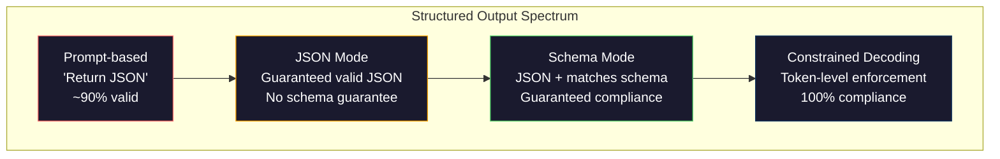
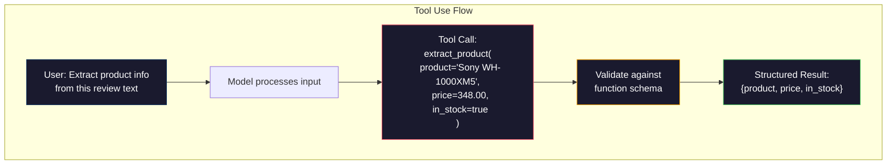

# Đầu ra có cấu trúc: JSON, xác thực Schema, giải mã hạn chế

> LLM của bạn trả về một chuỗi. Ứng dụng của bạn cần JSON. Khoảng cách đó đã làm sập hệ thống production nhiều hơn bất kỳ ảo giác model nào. Đầu ra có cấu trúc là cầu nối giữa ngôn ngữ tự nhiên và dữ liệu được nhập. Làm đúng và LLM của bạn trở thành một API đáng tin cậy. Làm sai và bạn đang phân tích cú pháp văn bản tự do với regex vào lúc 3 giờ sáng.

**Loại:** Xây dựng
**Ngôn ngữ:** Python
**Kiến thức tiên quyết:** Giai đoạn 10, Bài học 01-05 (LLMs từ đầu)
**Thời lượng:** ~90 phút
**Liên quan:** Giai đoạn 5 · 20 (Đầu ra có cấu trúc & Giải mã hạn chế) bao gồm lý thuyết cấp decoder (bộ xử lý FSM/CFG logit, Outlines, XGrammar). Bài học này tập trung vào bề mặt production SDK (OpenAI `response_format`, sử dụng công cụ Anthropic, Người hướng dẫn) - đọc Giai đoạn 5 · 20 Đầu tiên nếu bạn muốn hiểu những gì đang xảy ra bên dưới API.

## Mục tiêu học tập

- Triển khai đầu ra chế độ JSON và hạn chế schema bằng cách sử dụng OpenAI và Anthropic API parameters
- Xây dựng lớp xác thực Pydantic loại bỏ đầu ra LLM sai định dạng và thử lại với phản hồi lỗi
- Giải thích cách giải mã bị ràng buộc JSON hợp lệ ở cấp độ token mà không cần xử lý hậu kỳ
- Thiết kế prompts trích xuất mạnh mẽ giúp chuyển đổi văn bản phi cấu trúc thành cấu trúc dữ liệu được nhập một cách đáng tin cậy

## Vấn đề

Bạn hỏi một LLM: "Trích xuất tên sản phẩm, giá cả và tình trạng còn hàng từ văn bản này." Nó trả lời:

```
The product is the Sony WH-1000XM5 headphones, which cost $348.00 and are currently in stock.
```

Đó là một câu trả lời hoàn toàn chính xác. Nó cũng hoàn toàn vô dụng đối với ứng dụng của bạn. Hệ thống kiểm kê của bạn cần `{"product": "Sony WH-1000XM5", "price": 348.00, "in_stock": true}`. Bạn cần một đối tượng JSON với các khóa cụ thể, loại cụ thể và các ràng buộc giá trị cụ thể. Bạn không cần một câu.

Giải pháp ngây thơ: thêm "Phản hồi trong JSON" vào prompt của bạn. Điều này hoạt động 90% thời gian. 10% còn lại của model bọc JSON trong hàng rào mã đánh dấu hoặc thêm lời mở đầu như "Đây là JSON:" hoặc tạo ra JSON không hợp lệ về mặt cú pháp vì nó đóng dấu ngoặc sớm. Trình phân tích cú pháp JSON của bạn gặp sự cố. pipeline của bạn bị hỏng. Bạn thêm try/except và vòng lặp thử lại. Thử lại đôi khi tạo ra dữ liệu khác nhau. Bây giờ bạn có một vấn đề nhất quán trên một vấn đề phân tích cú pháp.

Đây không phải là một vấn đề kỹ thuật prompt. Nó là một vấn đề giải mã. model tạo ra tokens từ trái sang phải. Ở mỗi vị trí, nó chọn token tiếp theo có khả năng nhất từ từ vựng 100K + tùy chọn. Hầu hết các tùy chọn đó sẽ tạo ra JSON không hợp lệ ở bất kỳ vị trí nhất định nào. Nếu model chỉ phát ra `{"price":`, token tiếp theo phải là một chữ số, dấu ngoặc kép (đối với chuỗi), `null`, `true`, `false` hoặc dấu âm. Bất cứ điều gì khác tạo ra JSON không hợp lệ. Nếu không có ràng buộc, model có thể chọn một từ tiếng Anh hoàn toàn hợp lý nhưng sai cú pháp nghiêm trọng.

## Khái niệm

### Phổ đầu ra có cấu trúc

Có bốn cấp độ kiểm soát đầu ra có cấu trúc, mỗi cấp độ đáng tin cậy hơn cấp độ trước.



**dựa trên Prompt **("Phản hồi trong JSON hợp lệ"): không thực thi. model thường tuân thủ nhưng đôi khi không. Độ tin cậy: ~90%. Chế độ lỗi: hàng rào đánh dấu, văn bản mở đầu, đầu ra bị cắt bớt, cấu trúc sai.

**Chế độ JSON**: API đảm bảo đầu ra hợp lệ JSON. `response_format: { type: "json_object" }` của OpenAI cho phép điều này. Đầu ra sẽ phân tích cú pháp mà không có lỗi. Nhưng nó có thể không khớp với schema mong đợi của bạn - khóa phụ, sai loại, thiếu trường.

**Chế độ Schema**: API có JSON Schema và đảm bảo đầu ra khớp với nó. Vào năm 2026, mọi nhà cung cấp lớn đều hỗ trợ điều này nguyên bản: `response_format: { type: "json_schema", json_schema: {...} }` của OpenAI (cũng như `tool_choice="required"`), việc sử dụng công cụ của Anthropic với `input_schema` và `response_schema` + `response_mime_type: "application/json"` của Gemini. Đầu ra có các khóa, loại và ràng buộc chính xác mà bạn đã chỉ định.

**Giải mã hạn chế**: tại mỗi vị trí token trong quá trình tạo, decoder che đi tất cả các tokens có thể tạo ra đầu ra không hợp lệ. Nếu schema yêu cầu một số và model sắp phát ra một chữ cái, token đó được đặt thành xác suất bằng không. model chỉ có thể tạo ra tokens dẫn đến đầu ra hợp lệ. Đây là những gì chế độ đầu ra có cấu trúc của OpenAI và các thư viện như Outlines và Guidance triển khai bên trong.

### JSON Schema: Ngôn ngữ hợp đồng

JSON Schema là cách bạn nói với model (hoặc lớp xác thực) đầu ra phải có hình dạng nào. Mọi hệ thống đầu ra có cấu trúc chính đều sử dụng nó.

```json
{
  "type": "object",
  "properties": {
    "product": { "type": "string" },
    "price": { "type": "number", "minimum": 0 },
    "in_stock": { "type": "boolean" },
    "categories": {
      "type": "array",
      "items": { "type": "string" }
    }
  },
  "required": ["product", "price", "in_stock"]
}
```

schema này cho biết: đầu ra phải là một đối tượng có `product` chuỗi, `price` số không âm, `in_stock` boolean và một mảng `categories` chuỗi tùy chọn. Bất kỳ đầu ra nào không khớp đều bị từ chối.

Schemas xử lý các trường hợp khó: đối tượng lồng nhau, mảng với các mục được nhập, enum (ràng buộc một chuỗi thành các giá trị cụ thể), khớp mẫu (biểu thức chính quy trên chuỗi) và bộ kết hợp (oneOf, anyOf, allOf cho đầu ra đa hình).

### Mô hình Pydantic

Trong Python, bạn không viết JSON Schema bằng tay. Bạn định nghĩa một model Pydantic và nó tạo ra schema cho bạn.

```python
from pydantic import BaseModel

class Product(BaseModel):
    product: str
    price: float
    in_stock: bool
    categories: list[str] = []
```

Thao tác này tạo ra JSON Schema tương tự như trên. Thư viện Instructor (và SDK của OpenAI) chấp nhận trực tiếp models Pydantic: chuyển model class, lấy lại một thực thể đã xác thực. Nếu kết quả LLM không khớp, Instructor sẽ tự động thử lại.

### Function Calling / Sử dụng công cụ

Một giao diện thay thế cho cùng một vấn đề. Thay vì yêu cầu model tạo JSON trực tiếp, bạn định nghĩa "công cụ" (hàm) bằng parameters được nhập. model xuất ra một lệnh gọi hàm với các đối số có cấu trúc. OpenAI gọi đây là "function calling". Anthropic gọi nó là "sử dụng công cụ". Kết quả là giống nhau: dữ liệu có cấu trúc.



Việc sử dụng công cụ được ưu tiên hơn khi model cần chọn hàm nào để gọi, không chỉ điền vào parameters. Nếu bạn có 10 schemas trích xuất khác nhau và model phải chọn đúng hàm dựa trên đầu vào, thì việc sử dụng công cụ cung cấp cho bạn cả lựa chọn schema và đầu ra có cấu trúc.

### Chế độ lỗi phổ biến

Ngay cả với schema thực thi, đầu ra có cấu trúc có thể thất bại theo những cách tinh tế.

**Giá trị ảo giác**: đầu ra khớp với schema nhưng chứa dữ liệu được phát minh. model tạo ra `{"price": 299.99}` khi văn bản cho biết 348 đô la. Schema xác thực không thể nắm bắt được điều này - loại đúng, giá trị sai.

**Enum nhầm lẫn**: bạn ràng buộc một trường để `["in_stock", "out_of_stock", "preorder"]`. Đầu ra model `"available"` -- đúng ngữ nghĩa, nhưng không nằm trong tập hợp cho phép. Giải mã hạn chế tốt ngăn chặn điều này. Các phương pháp tiếp cận dựa trên Prompt thì không.

**Độ sâu đối tượng lồng nhau**: schemas lồng sâu (4+ cấp độ) tạo ra nhiều lỗi hơn. Mỗi cấp độ lồng nhau là một nơi khác mà model có thể mất dấu cấu trúc.

**Độ dài mảng**: model có thể tạo ra quá nhiều hoặc quá ít mục trong một mảng. Schemas hỗ trợ `minItems` và `maxItems` nhưng không phải tất cả các nhà cung cấp đều thực thi chúng ở cấp độ giải mã.

**Bỏ qua trường tùy chọn**: model bỏ qua các trường tùy chọn về mặt kỹ thuật nhưng quan trọng về mặt ngữ nghĩa đối với trường hợp sử dụng của bạn. Đặt chúng theo yêu cầu trong schema ngay cả khi dữ liệu đôi khi bị thiếu -- buộc model tạo `null` một cách rõ ràng.

## Tự xây dựng

### Bước 1: Trình xác thực JSON Schema

Xây dựng trình xác thực từ đầu để kiểm tra xem đối tượng Python có khớp với JSON Schema hay không. Đây là những gì chạy ở phía đầu ra để xác minh sự tuân thủ.

```python
import json

def validate_schema(data, schema):
    errors = []
    _validate(data, schema, "", errors)
    return errors

def _validate(data, schema, path, errors):
    schema_type = schema.get("type")

    if schema_type == "object":
        if not isinstance(data, dict):
            errors.append(f"{path}: expected object, got {type(data).__name__}")
            return
        for key in schema.get("required", []):
            if key not in data:
                errors.append(f"{path}.{key}: required field missing")
        properties = schema.get("properties", {})
        for key, value in data.items():
            if key in properties:
                _validate(value, properties[key], f"{path}.{key}", errors)

    elif schema_type == "array":
        if not isinstance(data, list):
            errors.append(f"{path}: expected array, got {type(data).__name__}")
            return
        min_items = schema.get("minItems", 0)
        max_items = schema.get("maxItems", float("inf"))
        if len(data) < min_items:
            errors.append(f"{path}: array has {len(data)} items, minimum is {min_items}")
        if len(data) > max_items:
            errors.append(f"{path}: array has {len(data)} items, maximum is {max_items}")
        items_schema = schema.get("items", {})
        for i, item in enumerate(data):
            _validate(item, items_schema, f"{path}[{i}]", errors)

    elif schema_type == "string":
        if not isinstance(data, str):
            errors.append(f"{path}: expected string, got {type(data).__name__}")
            return
        enum_values = schema.get("enum")
        if enum_values and data not in enum_values:
            errors.append(f"{path}: '{data}' not in allowed values {enum_values}")

    elif schema_type == "number":
        if not isinstance(data, (int, float)):
            errors.append(f"{path}: expected number, got {type(data).__name__}")
            return
        minimum = schema.get("minimum")
        maximum = schema.get("maximum")
        if minimum is not None and data < minimum:
            errors.append(f"{path}: {data} is less than minimum {minimum}")
        if maximum is not None and data > maximum:
            errors.append(f"{path}: {data} is greater than maximum {maximum}")

    elif schema_type == "boolean":
        if not isinstance(data, bool):
            errors.append(f"{path}: expected boolean, got {type(data).__name__}")

    elif schema_type == "integer":
        if not isinstance(data, int) or isinstance(data, bool):
            errors.append(f"{path}: expected integer, got {type(data).__name__}")
```

### Bước 2: Model kiểu Pydantic để Schema

Xây dựng một công cụ chuyển đổi class sang schema tối thiểu. Xác định một Python class và tự động tạo JSON Schema của nó.

```python
class SchemaField:
    def __init__(self, field_type, required=True, default=None, enum=None, minimum=None, maximum=None):
        self.field_type = field_type
        self.required = required
        self.default = default
        self.enum = enum
        self.minimum = minimum
        self.maximum = maximum

def python_type_to_schema(field):
    type_map = {
        str: "string",
        int: "integer",
        float: "number",
        bool: "boolean",
    }

    schema = {}

    if field.field_type in type_map:
        schema["type"] = type_map[field.field_type]
    elif field.field_type == list:
        schema["type"] = "array"
        schema["items"] = {"type": "string"}
    elif isinstance(field.field_type, dict):
        schema = field.field_type

    if field.enum:
        schema["enum"] = field.enum
    if field.minimum is not None:
        schema["minimum"] = field.minimum
    if field.maximum is not None:
        schema["maximum"] = field.maximum

    return schema

def model_to_schema(name, fields):
    properties = {}
    required = []

    for field_name, field in fields.items():
        properties[field_name] = python_type_to_schema(field)
        if field.required:
            required.append(field_name)

    return {
        "type": "object",
        "properties": properties,
        "required": required,
    }
```

### Bước 3: Bộ lọc Token hạn chế

Mô phỏng giải mã bị ràng buộc. Cho một chuỗi JSON một phần và một schema, hãy xác định danh mục token nào hợp lệ ở vị trí hiện tại.

```python
def next_valid_tokens(partial_json, schema):
    stripped = partial_json.strip()

    if not stripped:
        return ["{"]

    try:
        json.loads(stripped)
        return ["<EOS>"]
    except json.JSONDecodeError:
        pass

    last_char = stripped[-1] if stripped else ""

    if last_char == "{":
        return ['"', "}"]
    elif last_char == '"':
        if stripped.endswith('":'):
            return ['"', "0-9", "true", "false", "null", "[", "{"]
        return ["a-z", '"']
    elif last_char == ":":
        return [" ", '"', "0-9", "true", "false", "null", "[", "{"]
    elif last_char == ",":
        return [" ", '"', "{", "["]
    elif last_char in "0123456789":
        return ["0-9", ".", ",", "}", "]"]
    elif last_char == "}":
        return [",", "}", "]", "<EOS>"]
    elif last_char == "]":
        return [",", "}", "<EOS>"]
    elif last_char == "[":
        return ['"', "0-9", "true", "false", "null", "{", "[", "]"]
    else:
        return ["any"]

def demonstrate_constrained_decoding():
    partial_states = [
        '',
        '{',
        '{"product"',
        '{"product":',
        '{"product": "Sony"',
        '{"product": "Sony",',
        '{"product": "Sony", "price":',
        '{"product": "Sony", "price": 348',
        '{"product": "Sony", "price": 348}',
    ]

    print(f"{'Partial JSON':<45} {'Valid Next Tokens'}")
    print("-" * 80)
    for state in partial_states:
        valid = next_valid_tokens(state, {})
        display = state if state else "(empty)"
        print(f"{display:<45} {valid}")
```

### Bước 4: Chiết xuất Pipeline

Kết hợp mọi thứ thành một pipeline trích xuất: xác định một schema, mô phỏng một LLM tạo ra đầu ra có cấu trúc, xác thực đầu ra và xử lý các lần thử lại.

```python
def simulate_llm_extraction(text, schema, attempt=0):
    if "headphones" in text.lower() or "sony" in text.lower():
        if attempt == 0:
            return '{"product": "Sony WH-1000XM5", "price": 348.00, "in_stock": true, "categories": ["audio", "headphones"]}'
        return '{"product": "Sony WH-1000XM5", "price": 348.00, "in_stock": true}'

    if "laptop" in text.lower():
        return '{"product": "MacBook Pro 16", "price": 2499.00, "in_stock": false, "categories": ["computers"]}'

    return '{"product": "Unknown", "price": 0, "in_stock": false}'

def extract_with_retry(text, schema, max_retries=3):
    for attempt in range(max_retries):
        raw = simulate_llm_extraction(text, schema, attempt)

        try:
            data = json.loads(raw)
        except json.JSONDecodeError as e:
            print(f"  Attempt {attempt + 1}: JSON parse error -- {e}")
            continue

        errors = validate_schema(data, schema)
        if not errors:
            return data

        print(f"  Attempt {attempt + 1}: Schema validation errors -- {errors}")

    return None

product_schema = {
    "type": "object",
    "properties": {
        "product": {"type": "string"},
        "price": {"type": "number", "minimum": 0},
        "in_stock": {"type": "boolean"},
        "categories": {"type": "array", "items": {"type": "string"}},
    },
    "required": ["product", "price", "in_stock"],
}
```

### Bước 5: Chạy toàn bộ Pipeline

```python
def run_demo():
    print("=" * 60)
    print("  Structured Output Pipeline Demo")
    print("=" * 60)

    print("\n--- Schema Definition ---")
    product_fields = {
        "product": SchemaField(str),
        "price": SchemaField(float, minimum=0),
        "in_stock": SchemaField(bool),
        "categories": SchemaField(list, required=False),
    }
    generated_schema = model_to_schema("Product", product_fields)
    print(json.dumps(generated_schema, indent=2))

    print("\n--- Schema Validation ---")
    test_cases = [
        ({"product": "Test", "price": 10.0, "in_stock": True}, "Valid object"),
        ({"product": "Test", "price": -5.0, "in_stock": True}, "Negative price"),
        ({"product": "Test", "in_stock": True}, "Missing price"),
        ({"product": "Test", "price": "ten", "in_stock": True}, "String as price"),
        ("not an object", "String instead of object"),
    ]

    for data, label in test_cases:
        errors = validate_schema(data, product_schema)
        status = "PASS" if not errors else f"FAIL: {errors}"
        print(f"  {label}: {status}")

    print("\n--- Constrained Decoding Simulation ---")
    demonstrate_constrained_decoding()

    print("\n--- Extraction Pipeline ---")
    texts = [
        "The Sony WH-1000XM5 headphones are priced at $348 and currently available.",
        "The new MacBook Pro 16-inch laptop costs $2499 but is sold out.",
        "This is a random sentence with no product info.",
    ]

    for text in texts:
        print(f"\n  Input: {text[:60]}...")
        result = extract_with_retry(text, product_schema)
        if result:
            print(f"  Output: {json.dumps(result)}")
        else:
            print(f"  Output: FAILED after retries")
```

## Ứng dụng

### OpenAI Đầu ra có cấu trúc

```python
# from openai import OpenAI
# from pydantic import BaseModel
#
# client = OpenAI()
#
# class Product(BaseModel):
#     product: str
#     price: float
#     in_stock: bool
#
# response = client.beta.chat.completions.parse(
#     model="gpt-5-mini",
#     messages=[
#         {"role": "system", "content": "Extract product information."},
#         {"role": "user", "content": "Sony WH-1000XM5, $348, in stock"},
#     ],
#     response_format=Product,
# )
#
# product = response.choices[0].message.parsed
# print(product.product, product.price, product.in_stock)
```

Chế độ đầu ra có cấu trúc của OpenAI sử dụng giải mã ràng buộc bên trong. Mỗi token model tạo ra đều được đảm bảo tạo ra đầu ra phù hợp với schema Pydantic. Không cần thử lại. Không cần xác thực. Ràng buộc được đưa vào process giải mã.

### Anthropic Sử dụng công cụ

```python
# import anthropic
#
# client = anthropic.Anthropic()
#
# response = client.messages.create(
#     model="claude-opus-4-7",
#     max_tokens=1024,
#     tools=[{
#         "name": "extract_product",
#         "description": "Extract product information from text",
#         "input_schema": {
#             "type": "object",
#             "properties": {
#                 "product": {"type": "string"},
#                 "price": {"type": "number"},
#                 "in_stock": {"type": "boolean"},
#             },
#             "required": ["product", "price", "in_stock"],
#         },
#     }],
#     messages=[{"role": "user", "content": "Extract: Sony WH-1000XM5, $348, in stock"}],
# )
```

Anthropic đạt được đầu ra có cấu trúc thông qua việc sử dụng công cụ. model phát ra lệnh gọi công cụ với các đối số có cấu trúc khớp với input_schema. Cùng một kết quả, bề mặt API khác nhau.

### Thư viện giảng viên

```python
# pip install instructor
# import instructor
# from openai import OpenAI
# from pydantic import BaseModel
#
# client = instructor.from_openai(OpenAI())
#
# class Product(BaseModel):
#     product: str
#     price: float
#     in_stock: bool
#
# product = client.chat.completions.create(
#     model="gpt-5-mini",
#     response_model=Product,
#     messages=[{"role": "user", "content": "Sony WH-1000XM5, $348, in stock"}],
# )
```

Người hướng dẫn bao bọc bất kỳ ứng dụng khách LLM nào và thêm các lần thử lại tự động với xác thực. Nếu lần thử đầu tiên không xác thực, nó sẽ gửi lỗi trở lại model dưới dạng ngữ cảnh và yêu cầu nó sửa đầu ra. Điều này hoạt động với bất kỳ nhà cung cấp nào, không chỉ OpenAI.

## Sản phẩm bàn giao

Bài học này tạo ra `outputs/prompt-structured-extractor.md` -- một mẫu prompt có thể tái sử dụng trích xuất dữ liệu có cấu trúc từ bất kỳ văn bản nào được định nghĩa schema. Cung cấp cho nó một văn bản JSON Schema và không có cấu trúc và nó trả về JSON đã được xác thực.

Nó cũng tạo ra `outputs/skill-structured-outputs.md` - một quyết định framework để chọn chiến lược đầu ra có cấu trúc phù hợp dựa trên nhà cung cấp của bạn, yêu cầu về độ tin cậy và độ phức tạp của schema.

## Bài tập

1. Mở rộng trình xác thực schema để hỗ trợ `oneOf` (dữ liệu phải khớp chính xác một trong một số schemas). Điều này xử lý các đầu ra đa hình -- ví dụ: một trường có thể là đối tượng `Product` hoặc `Service` với các hình dạng khác nhau.

2. Xây dựng một công cụ "schema diff" so sánh hai schemas và xác định các thay đổi phá vỡ (các trường bắt buộc đã bị xóa, các loại đã thay đổi) so với các thay đổi không phá vỡ (thêm các trường tùy chọn, các ràng buộc được nới lỏng). Điều này rất cần thiết để tạo phiên bản schemas trích xuất của bạn trong production.

3. Triển khai trình mô phỏng giải mã hạn chế thực tế hơn. Cho một JSON Schema và từ vựng là 100 tokens (chữ cái, chữ số, dấu câu, từ khóa), hãy đi qua từng bước tạo, che đi các tokens không hợp lệ ở mỗi vị trí. Đo lường tỷ lệ phần trăm từ vựng hợp lệ ở mỗi bước.

4. Xây dựng bộ đánh giá trích xuất. Tạo 50 mô tả sản phẩm với đầu ra JSON được gắn nhãn thủ công. Chạy pipeline trích xuất của bạn trên tất cả 50 và đo lường sự tuân thủ khớp chính xác, accuracy cấp trường và loại. Xác định trường nào khó trích xuất chính xác nhất.

5. Thêm "điểm tin cậy" vào pipeline trích xuất của bạn. Đối với mỗi trường được trích xuất, ước tính mức độ tin cậy của model (dựa trên xác suất token hoặc bằng cách chạy trích xuất 3 lần và đo lường tính nhất quán). Gắn cờ các trường có độ tin cậy thấp để con người xem xét.

## Thuật ngữ chính

| Thuật ngữ | Những gì mọi người nói | Ý nghĩa thực sự của nó |
|------|----------------|----------------------|
| Chế độ JSON | "Trả lại JSON" | API cờ đảm bảo đầu ra JSON hợp lệ về mặt cú pháp, nhưng không thực thi bất kỳ schema cụ thể nào |
| Đầu ra có cấu trúc | "Đánh máy JSON" | Đầu ra khớp với một JSON Schema cụ thể với các khóa, loại và ràng buộc chính xác |
| Giải mã hạn chế | "Thế hệ có hướng dẫn" | Ở mỗi vị trí token, hãy che giấu các tokens có thể tạo ra đầu ra không hợp lệ - đảm bảo tuân thủ 100% schema |
| JSON Schema | "Một bản mẫu JSON" | Một ngôn ngữ khai báo để mô tả cấu trúc, kiểu và ràng buộc của dữ liệu JSON (được sử dụng bởi OpenAPI, JSON Forms, v.v.) |
| Pydantic | "Python lớp dữ liệu+" | Python thư viện xác định models dữ liệu với xác thực kiểu, được FastAPI và Instructor sử dụng để tạo JSON Schemas |
| Function calling | "Sử dụng công cụ" | LLM xuất ra một lệnh gọi hàm có cấu trúc (tên + đối số được nhập) thay vì văn bản tự do -- OpenAI và Anthropic đều hỗ trợ điều này |
| Người hướng dẫn | "Pydantic cho LLMs" | Python thư viện bao bọc LLM máy khách để trả về các phiên bản Pydantic đã được xác thực, tự động thử lại khi xác thực không thành công |
| Mặt nạ Token | "Lọc từ vựng" | Đặt xác suất token cụ thể về không trong quá trình tạo ra để model không thể tạo ra chúng |
| Tuân thủ Schema | "Phù hợp với hình dạng" | Đầu ra có mọi trường bắt buộc, đúng loại, giá trị trong ràng buộc và không có trường không được phép bổ sung |
| Vòng lặp thử lại | "Hãy thử lại cho đến khi nó hoạt động" | Gửi lỗi xác thực trở lại model và yêu cầu nó sửa đầu ra -- Người hướng dẫn thực hiện việc này tự động, lên đến mức tối đa có thể cấu hình |

## Đọc thêm

- [OpenAI Structured Outputs Guide](https://platform.openai.com/docs/guides/structured-outputs) -- tài liệu chính thức cho giải mã ràng buộc dựa trên JSON Schema trong OpenAI API
- [Willard & Louf, 2023 -- "Efficient Guided Generation for Large Language Models"](https://arxiv.org/abs/2307.09702) -- bài báo Outlines, mô tả cách biên dịch JSON Schemas thành các máy trạng thái hữu hạn cho các ràng buộc cấp token
- [Instructor documentation](https://python.useinstructor.com/) -- thư viện tiêu chuẩn để lấy kết quả có cấu trúc từ bất kỳ LLM nào có xác thực và thử lại Pydantic
- [Anthropic Tool Use Guide](https://docs.anthropic.com/en/docs/tool-use) -- cách Claude triển khai đầu ra có cấu trúc thông qua việc sử dụng công cụ với JSON Schema input_schema
- [JSON Schema specification](https://json-schema.org/) -- thông số kỹ thuật đầy đủ cho ngôn ngữ schema được sử dụng bởi mọi hệ thống đầu ra có cấu trúc chính
- [Outlines library](https://github.com/outlines-dev/outlines) - tạo giới hạn mã nguồn mở sử dụng regex và JSON Schema được biên dịch thành các máy trạng thái hữu hạn
- [Dong et al., "XGrammar: Flexible and Efficient Structured Generation Engine for Large Language Models" (MLSys 2025)](https://arxiv.org/abs/2411.15100) - công cụ ngữ pháp hiện đại; biên dịch tự động đẩy mặt nạ tokens ở ~100 ns / token.
- [Beurer-Kellner et al., "Prompting Is Programming: A Query Language for Large Language Models" (LMQL)](https://arxiv.org/abs/2212.06094) -- giải mã hạn chế đóng khung giấy LMQL như một ngôn ngữ truy vấn với các ràng buộc về loại và giá trị.
- [Microsoft Guidance (framework docs)](https://github.com/guidance-ai/guidance) -- thế hệ hạn chế theo khuôn mẫu; bổ sung bất khả tri cho Outlines và XGrammar.
