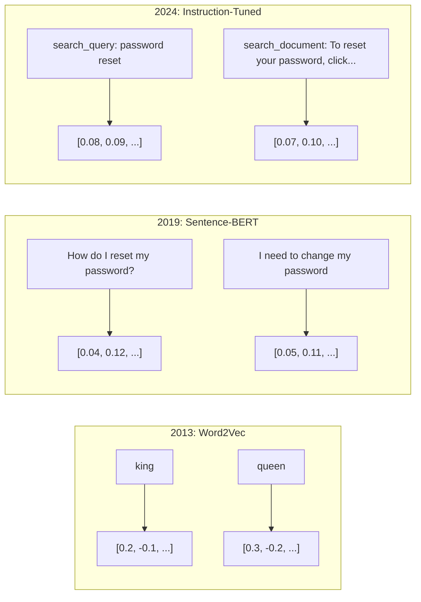
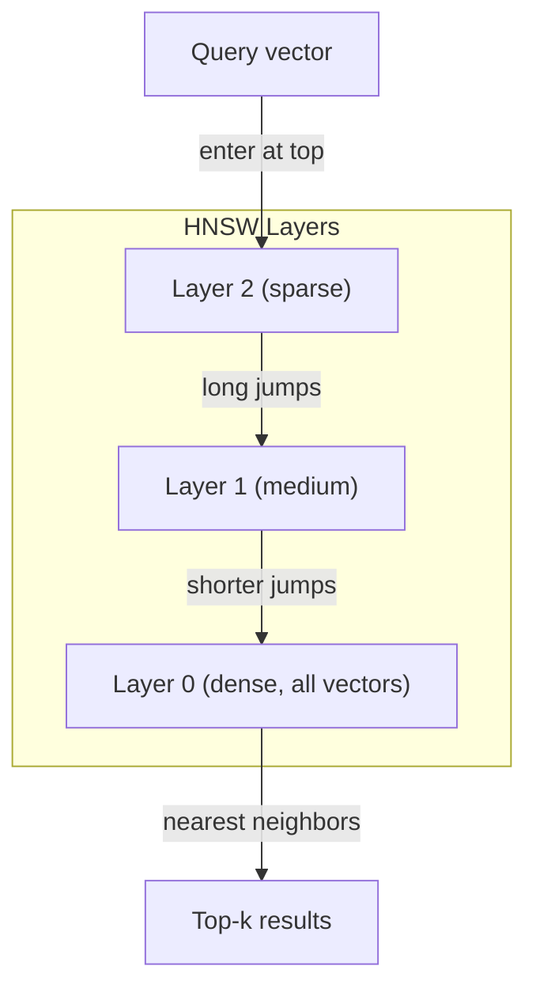

# Đại diện Embeddings & Vector

> Văn bản là rời rạc. Toán học là liên tục. Mỗi khi bạn yêu cầu một LLM tìm tài liệu "tương tự", so sánh ý nghĩa hoặc tìm kiếm ngoài từ khóa, bạn đang dựa vào một cầu nối giữa hai thế giới này. Cây cầu đó là một embedding. Nếu bạn không hiểu embeddings, bạn không hiểu AI hiện đại. Bạn chỉ cần sử dụng nó.

**Loại:** Xây dựng
**Ngôn ngữ:** Python
**Kiến thức tiên quyết:** Giai đoạn 11, Bài 01 (Kỹ thuật Prompt)
**Thời lượng:** ~75 phút
**Liên quan:** Giai đoạn 5 · 22 (Embedding Models Deep Dive) bao gồm dày đặc so với thưa thớt so với nhiều vector, cắt bớt Matryoshka và lựa chọn model trên mỗi trục. Bài học này tập trung vào production pipeline (vector DBs, HNSW, toán học tương tự). Đọc Giai đoạn 5 · 22 trước khi chọn một model.

## Mục tiêu học tập

- Tạo embeddings văn bản bằng cách sử dụng các nhà cung cấp API và models mã nguồn mở, đồng thời tính toán sự tương đồng cosin giữa chúng
- Giải thích lý do tại sao embeddings giải quyết vấn đề từ vựng không khớp mà tìm kiếm từ khóa không thể xử lý
- Xây dựng chỉ mục tìm kiếm ngữ nghĩa truy xuất tài liệu theo ý nghĩa thay vì khớp từ khóa chính xác
- Đánh giá chất lượng embedding bằng cách sử dụng benchmarks truy xuất (precision@k, recall) và chọn embedding model phù hợp cho nhiệm vụ của bạn

## Vấn đề

Bạn có 10.000 phiếu hỗ trợ. Một khách hàng viết "khoản thanh toán của tôi không được thực hiện". Bạn cần tìm các phiếu tương tự trước đây. Tìm kiếm từ khóa tìm các phiếu có chứa "thanh toán" và "không thực hiện". Nó bỏ lỡ "giao dịch không thành công", "khoản phí bị từ chối" và "lỗi thanh toán". Các phiếu này mô tả chính xác cùng một vấn đề với các từ hoàn toàn khác nhau.

Đây là vấn đề từ vựng không khớp. Ngôn ngữ của con người có hàng tá cách để nói cùng một điều. Tìm kiếm từ khóa coi mỗi từ như một biểu tượng độc lập không có ý nghĩa. Nó không thể biết rằng "từ chối" và "không trải qua" đề cập đến cùng một khái niệm.

Bạn cần một đại diện của văn bản trong đó ý nghĩa, không phải chính tả, xác định sự tương đồng. Bạn cần một cách để đặt "khoản thanh toán của tôi không được thực hiện" và "giao dịch bị từ chối" gần nhau trong một số không gian toán học, trong khi đẩy "khoản thanh toán của tôi đến đúng hạn" ra xa mặc dù chia sẻ từ "thanh toán".

Sự đại diện đó là một embedding.

## Khái niệm

### Embedding là gì?

Một embedding là một vector dày đặc của các số dấu phẩy động đại diện cho ý nghĩa của văn bản. Từ "dày đặc" quan trọng - mọi chiều đều mang thông tin, không giống như các biểu diễn thưa thớt (túi từ, TF-IDF) nơi hầu hết các chiều bằng không.

"Con mèo ngồi trên thảm" trở thành một cái gì đó giống như `[0.023, -0.041, 0.087, ..., 0.012]` - một danh sách từ 768 đến 3072 số tùy thuộc vào model. Những con số này mã hóa ý nghĩa. Bạn không bao giờ kiểm tra chúng trực tiếp. Bạn so sánh chúng.

### Bước đột phá của Word2Vec

Vào năm 2013, Tomas Mikolov và các đồng nghiệp tại Google đã xuất bản Word2Vec. Cái nhìn sâu sắc cốt lõi: huấn luyện một mạng nơ-ron để dự đoán một từ từ hàng xóm của nó (hoặc hàng xóm từ một từ), và trọng lượng lớp ẩn trở nên có ý nghĩa vector các đại diện.

Kết quả nổi tiếng:

```
king - man + woman = queen
```

Vector số học trên embeddings từ nắm bắt các mối quan hệ ngữ nghĩa. Hướng từ "đàn ông" đến "phụ nữ" gần giống với hướng từ "vua" đến "nữ hoàng". Đây là thời điểm lĩnh vực này nhận ra rằng hình học có thể mã hóa ý nghĩa.

Word2Vec tạo ra vectors 300 chiều. Mỗi từ có một vector bất kể ngữ cảnh. "Bank" trong "river bank" và "bank account" có cùng embedding. Hạn chế này đã thúc đẩy thập kỷ nghiên cứu tiếp theo.

### Từ từ đến câu

Word embeddings đại diện cho một tokens. Production hệ thống cần nhúng toàn bộ câu, đoạn văn hoặc tài liệu. Bốn cách tiếp cận đã xuất hiện:

**Tính trung bình**: lấy giá trị trung bình của tất cả các vectors từ trong câu. Rẻ, mất giá, tốt một cách đáng ngạc nhiên cho văn bản ngắn. Mất hoàn toàn thứ tự từ - "dog bites man" và "man bites dog" có embeddings giống hệt nhau.

**CLS token**: transformer models (BERT, 2018) xuất ra một token embedding [CLS] đặc biệt đại diện cho toàn bộ đầu vào. Tốt hơn tính trung bình nhưng token [CLS] được huấn luyện để dự đoán câu tiếp theo, không phải sự tương tự.

**Học tương phản**: huấn luyện model một cách rõ ràng để đẩy các cặp tương tự lại với nhau và các cặp khác nhau. BERT câu (Reimers & Gurevych, 2019) đã sử dụng cách tiếp cận này và trở thành nền tảng cho embedding models hiện đại. Với "Làm thế nào để đặt lại mật khẩu của tôi?" và "Tôi cần thay đổi mật khẩu của mình", model học được rằng chúng phải có vectors gần giống hệt nhau.

**embeddings được điều chỉnh theo hướng dẫn**: cách tiếp cận mới nhất. Models như E5 và GTE chấp nhận tiền tố tác vụ ("search_query:", "search_document:") cho người model biết loại embedding nào sẽ tạo ra. Điều này cho phép một model phục vụ nhiều nhiệm vụ.



### Embedding Models hiện đại

Thị trường đã ổn định với một số lựa chọn cấp production (điểm MTEB tính đến đầu năm 2026, MTEB v2):

| Model | Nhà cung cấp | Kích thước | MTEB | Bối cảnh | Chi phí / 1 triệu tokens |
|-------|----------|-----------|------|---------|------------------|
| Gemini Embedding 2 | Google | 3072 (Matryoshka) | 67.7 (truy cập) | 8192 | 0,15 US$ |
| nhúng-v4 | Gắn kết | 1024 (Matryoshka) | 65.2 | 128 nghìn | 0,12 US$ |
| Voyage-4 (Chuyến đi-4) | Chuyến đi AI | 1024/2048 (Matryoshka) | 66.8 | 32 nghìn | 0,12 US$ |
| text-embedding-3-lớn | OpenAI | 3072 (Matryoshka) | 64.6 | 8192 | 0,13 US$ |
| text-embedding-3-nhỏ | OpenAI | 1536 (Matryoshka) | 62.3 | 8192 | 0,02 US$ |
| BGE-M3 | BAAI | 1024 (dày đặc + thưa thớt + ColBERT) | 63.0 Đa ngôn ngữ | 8192 | Trọng lượng mở |
| Qwen3-Embedding | Alibaba | 4096 (Matryoshka) | 66.9 | 32 nghìn | Trọng lượng mở |
| Nomic-nhúng-v2 | Danh nghĩa | 768 (Matryoshka) | 63.1 | 8192 | Trọng lượng mở |

MTEB (Massive Text Embedding Benchmark) v2 bao gồm 100+ tác vụ về truy xuất, phân loại, phân cụm, xếp hạng lại và tóm tắt. Cao hơn là tốt hơn. Đến năm 2026, models trọng lượng mở (Qwen3-Embedding, BGE-M3) khớp hoặc đánh bại models lưu trữ kín trên hầu hết các trục. Gemini Embedding 2 dẫn đến truy xuất thuần túy; Voyage/Cohere dẫn các miền cụ thể (tài chính, luật, mã). Luôn benchmark các truy vấn của riêng bạn trước khi cam kết.

### Chỉ số tương tự

Với hai embedding vectors, ba cách để đo lường mức độ giống nhau của chúng:

**Độ tương đồng cosin**: cosin của góc giữa hai vectors. Phạm vi từ -1 (ngược lại) đến 1 (cùng hướng). Bỏ qua độ lớn -- một câu 10 từ và một tài liệu 500 từ có thể đạt 1,0 nếu chúng chỉ cùng một hướng. Đây là mặc định cho 90% các trường hợp sử dụng.

```
cosine_sim(a, b) = dot(a, b) / (||a|| * ||b||)
```

**Sản phẩm chấm**: sản phẩm bên trong thô của hai vectors. Giống hệt với sự tương tự cosin khi vectors được chuẩn hóa (chiều dài đơn vị). Tính toán nhanh hơn. embeddings của OpenAI được chuẩn hóa, vì vậy tích chấm và cosin cho cùng một thứ hạng.

```
dot(a, b) = sum(a_i * b_i)
```

**Khoảng cách Euclid (L2)**: khoảng cách đường thẳng trong không gian vector. Nhỏ hơn = giống nhau hơn. Nhạy cảm với sự khác biệt về độ lớn. Sử dụng khi vị trí tuyệt đối trong không gian quan trọng, không chỉ là hướng.

```
L2(a, b) = sqrt(sum((a_i - b_i)^2))
```

Khi nào sử dụng:

| Số liệu | Sử dụng khi | Tránh khi |
|--------|----------|------------|
| Sự tương đồng cosin | So sánh các văn bản có độ dài khác nhau; hầu hết các nhiệm vụ truy xuất | Độ lớn mang thông tin |
| Sản phẩm chấm | Embeddings đã được chuẩn hóa; tốc độ tối đa | Vectors có cường độ khác nhau |
| Khoảng cách Euclid | Phân cụm; các vấn đề không gian gần nhất | So sánh các tài liệu có độ dài khác nhau |

### Cơ sở dữ liệu Vector và HNSW

Tìm kiếm tương tự brute-force so sánh truy vấn với mọi vector được lưu trữ. Ở mức 1 triệu vectors với 1536 thứ nguyên, tức là 1,5 tỷ thao tác cộng cho mỗi truy vấn. Quá chậm.

Vector cơ sở dữ liệu giải quyết vấn đề này bằng các thuật toán Gần đúng hàng xóm gần nhất (ANN). Thuật toán chủ đạo là HNSW (Hierarchical Navigable Small World):

1. Xây dựng biểu đồ nhiều lớp vectors
2. Các lớp trên cùng thưa thớt - kết nối tầm xa giữa các cụm ở xa
3. Các lớp dưới cùng dày đặc - các kết nối hạt mịn giữa các vectors gần đó
4. Tìm kiếm bắt đầu từ lớp trên cùng, tham lam giảm dần để tinh chỉnh
5. Trả về kết quả top-k gần đúng theo thời gian O(log n) thay vì O(n)

HNSW đánh đổi một accuracy loss nhỏ (thường là 95-99% recall) để tăng tốc độ lớn. Ở mức 10 triệu vectors, vũ phu mất vài giây. HNSW mất mili giây.



Production tùy chọn:

| Cơ sở dữ liệu | Kiểu | Tốt nhất cho | Quy mô tối đa |
|----------|------|----------|-----------|
| Cây thông | SaaS được quản lý | Zero-ops production | Tỷ |
| Dệt | Mã nguồn mở | Tìm kiếm kết hợp, tự lưu trữ | 100 triệu + |
| Câu hỏi | Mã nguồn mở | Hiệu suất cao, lọc | 100 triệu + |
| ChromaDB | Nhúng | Tạo mẫu, nhà phát triển cục bộ | 1 triệu |
| pgvector | Phần mở rộng Postgres | Đã sử dụng Postgres | 10 triệu |
| FAISS | Thư viện | Nghiên cứu trong process | 1 tỷ + |

### Chiến lược Chunking

Tài liệu quá dài để nhúng dưới dạng vectors đơn. Một tệp PDF 50 trang bao gồm hàng chục chủ đề - embedding của nó trở thành mức trung bình của mọi thứ, tương tự như không có gì cụ thể. Bạn chia tài liệu thành các phần và nhúng từng phần.

**Phân đoạn kích thước cố định**: chia mỗi N tokens với M-token chồng chéo. Đơn giản và dễ đoán. Hoạt động tốt khi tài liệu không có cấu trúc rõ ràng. Một đoạn 512 token với 50 token chồng chéo: đoạn 1 là tokens 0-511, đoạn 2 là tokens 462-973.

**Phân đoạn dựa trên câu**: tách theo ranh giới câu, nhóm các câu cho đến khi đạt đến giới hạn token. Mỗi đoạn là ít nhất một câu hoàn chỉnh. Tốt hơn kích thước cố định vì bạn không bao giờ cắt một suy nghĩ làm đôi.

**Phân đoạn đệ quy**: trước tiên hãy thử tách ở ranh giới lớn nhất (tiêu đề phần). Nếu vẫn quá lớn, hãy thử ranh giới đoạn văn. Sau đó ranh giới câu. Sau đó giới hạn ký tự. Đây là `RecursiveCharacterTextSplitter` của LangChain và nó hoạt động tốt cho kho dữ liệu định dạng hỗn hợp.

**Phân đoạn ngữ nghĩa**: nhúng từng câu, sau đó nhóm các câu liên tiếp có embeddings tương tự nhau. Khi sự tương đồng embedding giảm xuống dưới ngưỡng, hãy bắt đầu một đoạn mới. Tốn kém (yêu cầu embedding từng câu riêng lẻ) nhưng tạo ra các đoạn mạch lạc nhất.

| Chiến lược | Độ phức tạp | Chất lượng | Tốt nhất cho |
|----------|-----------|---------|----------|
| Kích thước cố định | Thấp | Khá | Văn bản, nhật ký phi cấu trúc |
| Dựa trên câu | Thấp | Tốt | Bài viết, email |
| Đệ quy | Trung bình | Tốt | Markdown, HTML, tài liệu hỗn hợp |
| Ngữ nghĩa | Cao | Tốt nhất | Chất lượng truy xuất quan trọng |

Điểm ngọt ngào cho hầu hết các hệ thống: 256-512 token khối với 50-token chồng chéo.

### Bi-Encoders so với Cross-Encoders

Bi-encoder nhúng truy vấn và tài liệu một cách độc lập, sau đó so sánh vectors. Nhanh -- bạn nhúng truy vấn một lần và so sánh với embeddings tài liệu được tính toán trước. Đây là những gì bạn sử dụng để truy xuất.

Một encoder chéo lấy truy vấn và một tài liệu làm đầu vào duy nhất và xuất ra điểm liên quan. Chậm -- nó processes từng cặp truy vấn-tài liệu thông qua model đầy đủ. Nhưng chính xác hơn nhiều vì nó có thể tham dự trên các truy vấn và tài liệu tokens đồng thời.

Mô hình production: bi-encoder lấy 100 ứng cử viên hàng đầu, cross-encoder xếp lại họ lên top 10. Đây là pipeline truy xuất sau đó xếp hạng lại.


Xếp hạng lại models: Cohere Rerank 3.5 ($ 2 cho mỗi 1000 truy vấn), BGE-reranker-v2 (miễn phí, mã nguồn mở), Jina Reranker v2 (miễn phí, mã nguồn mở).

### Matryoshka Embeddings

Các embeddings truyền thống là tất cả hoặc không có gì. Một vector 1536 chiều sử dụng 1536 phao. Bạn không thể cắt bớt xuống 256 chiều mà không huấn luyện lại.

Matryoshka Representation Learning (Kusupati et al., 2022) khắc phục điều này. model được huấn luyện để các chiều N đầu tiên nắm bắt được thông tin quan trọng nhất, giống như một con búp bê làm tổ của Nga. Cắt bớt embedding Matryoshka 1536-d xuống 256 chiều sẽ mất một số accuracy nhưng vẫn hoạt động.

Văn bản-embedding-3-nhỏ và văn bản-embedding-3-lớn của OpenAI hỗ trợ cắt bớt Matryoshka thông qua `dimensions` parameter. Yêu cầu 256 kích thước thay vì 1536 sẽ cắt giảm dung lượng lưu trữ xuống 6 lần với khoảng 3-5% accuracy loss trên MTEB benchmarks.

### Quantization nhị phân

Một embedding 1536 chiều được lưu trữ dưới dạng float32 sử dụng 6.144 byte. Nhân với 10 triệu tài liệu: 61 GB chỉ cho vectors.

Nhị phân quantization chuyển đổi mỗi float thành một bit duy nhất: giá trị dương trở thành 1, giá trị âm trở thành 0. Lưu trữ giảm từ 6.144 byte xuống còn 192 byte - giảm 32 lần. Độ tương tự được tính toán bằng cách sử dụng khoảng cách Hamming (đếm các bit khác nhau), điều này CPUs có thể thực hiện trong một lệnh duy nhất.

Lần truy cập accuracy là khoảng 5-10% trên recall truy xuất. Mô hình phổ biến: quantization nhị phân cho tìm kiếm lần đầu tiên trên hàng triệu vectors, sau đó ghi lại top 1000 với precision vectors đầy đủ. Điều này giúp bạn có được 95% + precision accuracy đầy đủ với bộ nhớ ít hơn 32 lần.

```figure
cosine-similarity
```

## Tự xây dựng

Chúng ta xây dựng một công cụ tìm kiếm ngữ nghĩa từ đầu. Không có cơ sở dữ liệu vector. Không có embedding API bên ngoài. Python thuần túy với numpy cho toán học.

### Bước 1: Phân đoạn văn bản

```python
def chunk_text(text, chunk_size=200, overlap=50):
    words = text.split()
    chunks = []
    start = 0
    while start < len(words):
        end = start + chunk_size
        chunk = " ".join(words[start:end])
        chunks.append(chunk)
        start += chunk_size - overlap
    return chunks


def chunk_by_sentences(text, max_chunk_tokens=200):
    sentences = text.replace("\n", " ").split(".")
    sentences = [s.strip() + "." for s in sentences if s.strip()]
    chunks = []
    current_chunk = []
    current_length = 0
    for sentence in sentences:
        sentence_length = len(sentence.split())
        if current_length + sentence_length > max_chunk_tokens and current_chunk:
            chunks.append(" ".join(current_chunk))
            current_chunk = []
            current_length = 0
        current_chunk.append(sentence)
        current_length += sentence_length
    if current_chunk:
        chunks.append(" ".join(current_chunk))
    return chunks
```

### Bước 2: Xây dựng Embeddings từ đầu

Chúng ta thực hiện một embedding mật độ đơn giản bằng cách sử dụng TF-IDF với chuẩn hóa L2. Đây không phải là một embedding thần kinh, nhưng nó tuân theo cùng một hợp đồng: văn bản vào, kích thước cố định vector ra, các văn bản tương tự tạo ra vectors tương tự.

```python
import math
import numpy as np
from collections import Counter

class SimpleEmbedder:
    def __init__(self):
        self.vocab = []
        self.idf = []
        self.word_to_idx = {}

    def fit(self, documents):
        vocab_set = set()
        for doc in documents:
            vocab_set.update(doc.lower().split())
        self.vocab = sorted(vocab_set)
        self.word_to_idx = {w: i for i, w in enumerate(self.vocab)}
        n = len(documents)
        self.idf = np.zeros(len(self.vocab))
        for i, word in enumerate(self.vocab):
            doc_count = sum(1 for doc in documents if word in doc.lower().split())
            self.idf[i] = math.log((n + 1) / (doc_count + 1)) + 1

    def embed(self, text):
        words = text.lower().split()
        count = Counter(words)
        total = len(words) if words else 1
        vec = np.zeros(len(self.vocab))
        for word, freq in count.items():
            if word in self.word_to_idx:
                tf = freq / total
                vec[self.word_to_idx[word]] = tf * self.idf[self.word_to_idx[word]]
        norm = np.linalg.norm(vec)
        if norm > 0:
            vec = vec / norm
        return vec
```

### Bước 3: Chức năng tương tự

```python
def cosine_similarity(a, b):
    dot = np.dot(a, b)
    norm_a = np.linalg.norm(a)
    norm_b = np.linalg.norm(b)
    if norm_a == 0 or norm_b == 0:
        return 0.0
    return float(dot / (norm_a * norm_b))


def dot_product(a, b):
    return float(np.dot(a, b))


def euclidean_distance(a, b):
    return float(np.linalg.norm(a - b))
```

### Bước 4: Vector lập chỉ mục bằng Tìm kiếm Brute-Force

```python
class VectorIndex:
    def __init__(self):
        self.vectors = []
        self.texts = []
        self.metadata = []

    def add(self, vector, text, meta=None):
        self.vectors.append(vector)
        self.texts.append(text)
        self.metadata.append(meta or {})

    def search(self, query_vector, top_k=5, metric="cosine"):
        scores = []
        for i, vec in enumerate(self.vectors):
            if metric == "cosine":
                score = cosine_similarity(query_vector, vec)
            elif metric == "dot":
                score = dot_product(query_vector, vec)
            elif metric == "euclidean":
                score = -euclidean_distance(query_vector, vec)
            else:
                raise ValueError(f"Unknown metric: {metric}")
            scores.append((i, score))
        scores.sort(key=lambda x: x[1], reverse=True)
        results = []
        for idx, score in scores[:top_k]:
            results.append({
                "text": self.texts[idx],
                "score": score,
                "metadata": self.metadata[idx],
                "index": idx
            })
        return results

    def size(self):
        return len(self.vectors)
```

### Bước 5: Công cụ tìm kiếm ngữ nghĩa

```python
class SemanticSearchEngine:
    def __init__(self, chunk_size=200, overlap=50):
        self.embedder = SimpleEmbedder()
        self.index = VectorIndex()
        self.chunk_size = chunk_size
        self.overlap = overlap

    def index_documents(self, documents, source_names=None):
        all_chunks = []
        all_sources = []
        for i, doc in enumerate(documents):
            chunks = chunk_text(doc, self.chunk_size, self.overlap)
            all_chunks.extend(chunks)
            name = source_names[i] if source_names else f"doc_{i}"
            all_sources.extend([name] * len(chunks))
        self.embedder.fit(all_chunks)
        for chunk, source in zip(all_chunks, all_sources):
            vec = self.embedder.embed(chunk)
            self.index.add(vec, chunk, {"source": source})
        return len(all_chunks)

    def search(self, query, top_k=5, metric="cosine"):
        query_vec = self.embedder.embed(query)
        return self.index.search(query_vec, top_k, metric)

    def search_with_scores(self, query, top_k=5):
        results = self.search(query, top_k)
        return [
            {
                "text": r["text"][:200],
                "source": r["metadata"].get("source", "unknown"),
                "score": round(r["score"], 4)
            }
            for r in results
        ]
```

### Bước 6: So sánh các chỉ số tương tự

```python
def compare_metrics(engine, query, top_k=3):
    results = {}
    for metric in ["cosine", "dot", "euclidean"]:
        hits = engine.search(query, top_k=top_k, metric=metric)
        results[metric] = [
            {"score": round(h["score"], 4), "preview": h["text"][:80]}
            for h in hits
        ]
    return results
```

## Ứng dụng

Với một production embedding API, kiến trúc vẫn giống hệt nhau. Chỉ có trình nhúng thay đổi:

```python
from openai import OpenAI

client = OpenAI()

def openai_embed(texts, model="text-embedding-3-small", dimensions=None):
    kwargs = {"model": model, "input": texts}
    if dimensions:
        kwargs["dimensions"] = dimensions
    response = client.embeddings.create(**kwargs)
    return [item.embedding for item in response.data]
```

Cắt bớt Matryoshka với OpenAI - cùng model, ít kích thước hơn, lưu trữ thấp hơn:

```python
full = openai_embed(["semantic search query"], dimensions=1536)
compact = openai_embed(["semantic search query"], dimensions=256)
```

vector 256-d sử dụng dung lượng lưu trữ ít hơn 6 lần. Đối với 10 triệu tài liệu, đó là 10 GB so với 61 GB. accuracy loss khoảng 3-5% trên benchmarks tiêu chuẩn.

Để xếp hạng lại với Cohere:

```python
import cohere

co = cohere.ClientV2()

results = co.rerank(
    model="rerank-v3.5",
    query="What is the refund policy?",
    documents=["Full refund within 30 days...", "No refunds after 90 days..."],
    top_n=3
)
```

Đối với embeddings cục bộ không phụ thuộc API:

```python
from sentence_transformers import SentenceTransformer

model = SentenceTransformer("BAAI/bge-small-en-v1.5")
embeddings = model.encode(["semantic search query", "another document"])
```

VectorIndex class từ bản dựng của chúng tôi hoạt động với bất kỳ ứng dụng nào trong số này. Hoán đổi hàm embedding, giữ logic tìm kiếm.

## Sản phẩm bàn giao

Bài học này tạo ra:
- `outputs/prompt-embedding-advisor.md` -- một prompt để lựa chọn embedding models và chiến lược cho các trường hợp sử dụng cụ thể
- `outputs/skill-embedding-patterns.md` - một skill dạy agents cách sử dụng embeddings hiệu quả trong production

## Bài tập

1. **So sánh số liệu**: chạy 5 truy vấn giống nhau đối với các tài liệu mẫu bằng cách sử dụng độ tương tự cosin, tích điểm và khoảng cách euclide. Ghi lại 3 kết quả hàng đầu cho mỗi truy vấn. Các chỉ số không đồng ý với những truy vấn nào? Tại sao?

2. **Thử nghiệm kích thước khối**: lập chỉ mục các tài liệu mẫu với kích thước đoạn là 50, 100, 200 và 500 từ. Đối với mỗi đoạn truy vấn, chạy 5 truy vấn và ghi lại điểm tương đồng top 1. Vẽ mối quan hệ giữa kích thước khối và chất lượng truy xuất. Tìm điểm mà các đoạn lớn hơn bắt đầu bị tổn thương.

3. **Mô phỏng Matryoshka**: xây dựng SimpleEmbedder tạo ra vectors 500-d. Cắt bớt thành 50, 100, 200 và 500 chiều. Đo lường mức độ suy giảm recall truy xuất ở mỗi lần cắt bớt. Điều này mô phỏng hành vi của Matryoshka mà không cần thủ thuật training thực sự.

4. **quantization nhị phân**: lấy embeddings từ công cụ tìm kiếm, chuyển đổi chúng thành nhị phân (1 nếu tích cực, 0 nếu tiêu cực) và thực hiện tìm kiếm khoảng cách Hamming. So sánh 10 kết quả hàng đầu với sự tương đồng cosin toàn precision. Đo tỷ lệ phần trăm chồng chéo.

5. **Phân đoạn dựa trên câu**: thay thế phân đoạn có kích thước cố định bằng `chunk_by_sentences`. Chạy các truy vấn tương tự và so sánh điểm truy xuất. Tôn trọng ranh giới câu có cải thiện kết quả không?

## Thuật ngữ chính

| Thuật ngữ | Những gì mọi người nói | Ý nghĩa thực sự của nó |
|------|----------------|----------------------|
| Embedding | "Văn bản thành số" | Một vector dày đặc nơi sự gần gũi hình học mã hóa sự tương đồng về ngữ nghĩa |
| Word2Vec | "OG embedding" | 2013 model vectors từ đã học bằng cách dự đoán các từ ngữ cảnh; đã chứng minh vector mã hóa số học ý nghĩa |
| Sự tương đồng cosin | "Hai vectors giống nhau như thế nào" | Cosin của góc giữa vectors; 1 = hướng giống hệt nhau, 0 = trực giao, -1 = ngược lại |
| HNSW | "Tìm kiếm vector nhanh" | Đồ thị Thế giới nhỏ có thể điều hướng phân cấp - cấu trúc nhiều lớp cho phép O (log n) tìm kiếm hàng xóm gần nhất gần nhất |
| Bi-encoder | "Nhúng riêng, so sánh nhanh" | Mã hóa truy vấn và tài liệu độc lập thành vectors; cho phép tính toán trước và truy xuất nhanh |
| encoder chéo | "Trình xếp hạng lại chậm nhưng chính xác" | Processes cặp tài liệu truy vấn cùng nhau thông qua model đầy đủ; accuracy cao hơn, không tính toán trước |
| Matryoshka embeddings | "vectors có thể cắt được" | Embeddings huấn luyện để N kích thước đầu tiên nắm bắt thông tin quan trọng nhất, cho phép lưu trữ kích thước thay đổi |
| quantization nhị phân | "embeddings 1 bit" | Chuyển đổi vectors float thành nhị phân (chỉ bit dấu) để giảm dung lượng lưu trữ gấp 32 lần với tìm kiếm khoảng cách Hamming |
| Chunking | "Tách tài liệu cho embedding" | Chia tài liệu thành 256-512 token phân đoạn để mỗi phân đoạn có thể được nhúng và truy xuất độc lập |
| Cơ sở dữ liệu Vector | "Công cụ tìm kiếm cho embeddings" | Lưu trữ dữ liệu được tối ưu hóa để lưu trữ vectors và thực hiện tìm kiếm lân cận gần nhất trên quy mô lớn |
| Học tương phản | "Huấn luyện bằng cách so sánh" | Training cách tiếp cận đẩy cặp embeddings giống nhau lại với nhau và embeddings cặp khác nhau ra xa nhau |
| MTEB | "Người embedding benchmark" | Văn bản lớn Embedding Benchmark - 56 datasets trên 8 nhiệm vụ; tiêu chuẩn để so sánh embedding models |

## Đọc thêm

- Mikolov và cộng sự, "Ước tính hiệu quả các biểu diễn từ trong không gian Vector" (2013) - bài báo Word2Vec bắt đầu cuộc cách mạng embedding với phép so sánh vua-nữ hoàng
- Reimers & Gurevych, "Sentence-BERT: Sentence Embeddings using Xiamese BERT-Networks" (2019) -- cách huấn luyện bi-encoders cho sự tương đồng ở cấp độ câu, nền tảng của embedding models hiện đại
- Kusupati và cộng sự, "Matryoshka Representation Learning" (2022) -- kỹ thuật đằng sau embeddings chiều thay đổi mà OpenAI áp dụng cho text-embedding-3
- Malkov & Yashunin, "Người hàng xóm gần nhất gần đúng hiệu quả và mạnh mẽ sử dụng đồ thị thế giới nhỏ có thể điều hướng theo phân cấp" (2018) - bài báo của HNSW, thuật toán đằng sau hầu hết các tìm kiếm production vector
- Hướng dẫn OpenAI Embeddings (platform.openai.com/docs/guides/embeddings) -- tài liệu tham khảo thực tế cho models văn bản-embedding-3 bao gồm giảm kích thước Matryoshka
- Bảng xếp hạng MTEB (huggingface.co/spaces/mteb/leaderboard) -- benchmark trực tiếp so sánh tất cả các embedding models giữa các nhiệm vụ và ngôn ngữ
- [Muennighoff et al., "MTEB: Massive Text Embedding Benchmark" (EACL 2023)](https://arxiv.org/abs/2210.07316) -- benchmark xác định 8 danh mục nhiệm vụ (phân loại, phân cụm, phân loại cặp, xếp hạng lại, truy xuất, STS, tóm tắt, khai thác hai văn bản) mà bảng xếp hạng báo cáo; đọc trước khi tin tưởng bất kỳ điểm MTEB nào.
- [Sentence Transformers documentation](https://www.sbert.net/) -- tài liệu tham khảo chuẩn cho bi-encoder so với cross-encoder, chiến lược gộp và nhập-tách-nhúng-lưu trữ RAG pipeline bài học này thực hiện.
