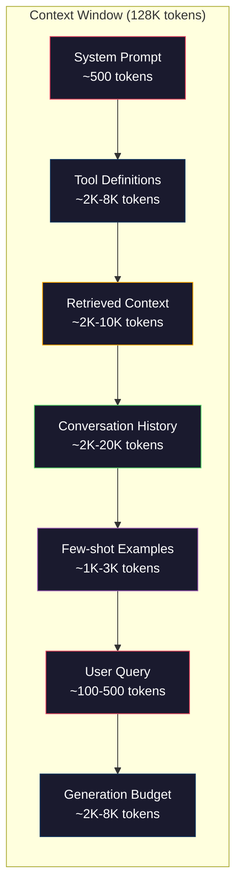
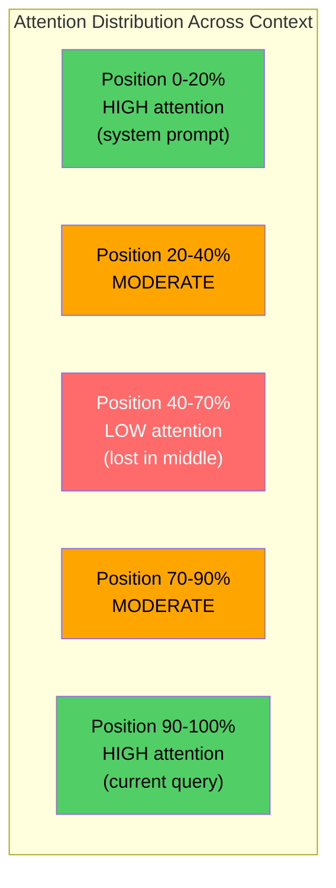
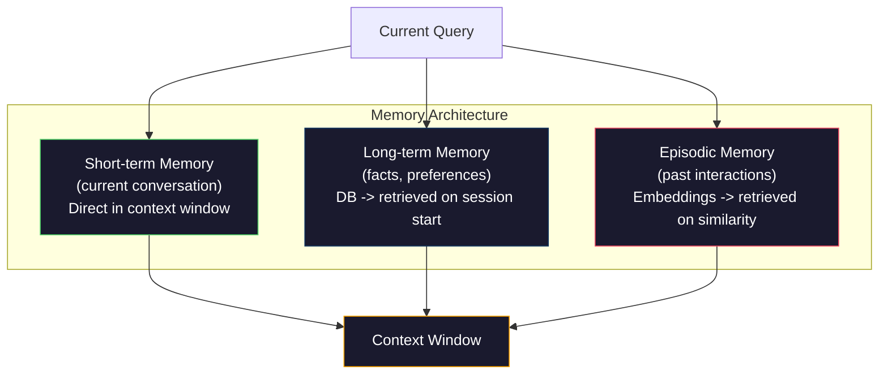

# Kỹ thuật ngữ cảnh: Windows, ngân sách, bộ nhớ và truy xuất

> Kỹ thuật Prompt là một tập hợp con. Kỹ thuật ngữ cảnh là toàn bộ trò chơi. Một prompt là một chuỗi bạn nhập. Ngữ cảnh là mọi thứ đi vào cửa sổ của model: hướng dẫn hệ thống, tài liệu được truy xuất, định nghĩa công cụ, lịch sử cuộc trò chuyện, ví dụ few-shot và chính prompt. Các kỹ sư AI giỏi nhất vào năm 2026 là kỹ sư ngữ cảnh. Họ quyết định những gì đi vào, những gì ở ngoài và theo thứ tự nào.

**Loại:** Xây dựng
**Ngôn ngữ:** Python
**Kiến thức tiên quyết:** Giai đoạn 10 (LLMs từ đầu), Giai đoạn 11 Bài 01-02
**Thời lượng:** ~90 phút
**Liên quan:** Giai đoạn 11 · 15 (Prompt Bộ nhớ đệm) — bố cục thân thiện với bộ nhớ cache là một phần mở rộng của kỹ thuật ngữ cảnh. Giai đoạn 5 · 28 (Đánh giá ngữ cảnh dài) để biết cách đo lường bị mất giữa bằng NIAH/RULER.

## Mục tiêu học tập

- Tính toán ngân sách token trên tất cả các thành phần context window (system prompt, công cụ, lịch sử, tài liệu được truy xuất, khoảng trống thế hệ)
- Triển khai các chiến lược quản lý context window: cắt bớt, tóm tắt và cửa sổ trượt cho lịch sử hội thoại
- Ưu tiên và sắp xếp các thành phần ngữ cảnh để tối đa hóa attention của model về thông tin phù hợp nhất
- Xây dựng trình lắp ráp ngữ cảnh tự động phân bổ tokens dựa trên loại truy vấn và không gian cửa sổ có sẵn

## Vấn đề

Claude Opus 4.7 có cửa sổ token 200K (1 triệu trong phiên bản beta). GPT-5 có 400K. Gemini 3 Pro có 2 triệu. Llama 4 tuyên bố 10 triệu. Những con số này nghe có vẻ rất lớn cho đến khi bạn lấp đầy chúng.

Dưới đây là bảng phân tích thực sự cho một trợ lý mã hóa. System prompt: 500 tokens. Định nghĩa công cụ cho 50 công cụ: 8.000 tokens. Tài liệu được truy cập: 4.000 tokens. Lịch sử hội thoại (10 lượt): 6.000 tokens. Truy vấn người dùng hiện tại: 200 tokens. Ngân sách phát điện (đầu ra tối đa): 4.000 tokens. Tổng cộng: 22.700 tokens. Đó chỉ là 18% của cửa sổ 128K.

Nhưng attention không chia tỷ lệ tuyến tính với độ dài ngữ cảnh. Một model có 128 nghìn tokens ngữ cảnh phải trả chi phí attention bậc hai (O (n ^ 2) trong transformers vani, mặc dù hầu hết production models sử dụng các biến thể attention hiệu quả). Quan trọng hơn, accuracy truy xuất suy giảm. Thử nghiệm "Needle in a Haystack" cho thấy models đấu tranh để tìm thông tin được đặt ở giữa ngữ cảnh dài. Nghiên cứu của Liu et al. (2023) cho thấy LLMs truy xuất thông tin ở đầu và cuối các context dài với accuracy gần như hoàn hảo, nhưng accuracy giảm 10-20% đối với thông tin được đặt ở giữa (vị trí 40-70% context). Hiệu ứng "lost-in-the-middle" này thay đổi theo model nhưng ảnh hưởng đến tất cả các kiến trúc hiện tại.

Bài học thực tế: có sẵn 200K tokens không có nghĩa là sử dụng 200K tokens là hiệu quả. Bối cảnh token 10K được quản lý cẩn thận thường vượt trội hơn ngữ cảnh token 100K đã kết xuất. Kỹ thuật ngữ cảnh là kỷ luật tối đa hóa tỷ lệ tín hiệu trên nhiễu trong context window.

Mỗi token bạn đặt vào cửa sổ sẽ thay thế một token có thể mang thông tin liên quan hơn. Mọi định nghĩa công cụ không liên quan, mọi lượt trò chuyện cũ, mọi đoạn văn bản được truy xuất không trả lời câu hỏi - mỗi cái làm cho model trở nên tồi tệ hơn một chút trong nhiệm vụ.

## Khái niệm

### Context Window là một nguồn tài nguyên khan hiếm

Hãy nghĩ về context window như RAM, không phải đĩa. Nó nhanh chóng và có thể truy cập trực tiếp, nhưng bị hạn chế. Bạn không thể phù hợp với mọi thứ. Bạn phải lựa chọn.



Mỗi thành phần cạnh tranh về không gian. Thêm nhiều định nghĩa công cụ hơn có nghĩa là ít chỗ hơn cho lịch sử cuộc trò chuyện. Thêm nhiều ngữ cảnh được truy xuất hơn có nghĩa là ít chỗ hơn cho few-shot ví dụ. Kỹ thuật ngữ cảnh là nghệ thuật phân bổ ngân sách này để tối đa hóa hiệu suất tác vụ.

### Lạc giữa

Phát hiện thực nghiệm quan trọng nhất trong kỹ thuật ngữ cảnh. Models chú ý tốt hơn đến thông tin ở đầu và cuối ngữ cảnh. Thông tin ở giữa có điểm attention thấp hơn và có nhiều khả năng bị bỏ qua.

Liu et al. (2023) đã kiểm tra điều này một cách có hệ thống. Họ đặt một tài liệu liên quan trong số 20 tài liệu không liên quan ở các vị trí khác nhau và đo lường câu trả lời accuracy. Khi tài liệu liên quan là đầu tiên hoặc cuối cùng, accuracy là 85-90%. Khi nó ở giữa (vị trí 10/20), accuracy giảm xuống còn 60-70%.

Điều này có ý nghĩa kỹ thuật trực tiếp:

- Đặt thông tin quan trọng nhất lên hàng đầu (system prompt, hướng dẫn quan trọng)
- Đặt truy vấn hiện tại và ngữ cảnh có liên quan nhất cuối cùng (gần đây bias trợ giúp)
- Coi giữa ngữ cảnh là vùng ưu tiên thấp nhất
- Nếu bạn phải bao gồm thông tin ở giữa, hãy sao chép điểm chính ở cuối



### Thành phần ngữ cảnh

**System prompt**: đặt tính cách, ràng buộc và quy tắc hành vi. Điều này đi trước và không đổi qua các lượt. Claude Code sử dụng khoảng 6.000 tokens cho system prompt của nó bao gồm các định nghĩa công cụ và hướng dẫn hành vi. Giữ chặt chẽ. Mọi từ trong system prompt được lặp lại trên mỗi cuộc gọi API.

**Định nghĩa công cụ**: mỗi công cụ thêm 50-200 tokens (tên, mô tả, parameter schema). 50 công cụ ở 150 tokens mỗi công cụ là 7.500 tokens trước khi bất kỳ cuộc trò chuyện nào xảy ra. Lựa chọn công cụ động - chỉ bao gồm các công cụ liên quan đến truy vấn hiện tại - có thể giảm 60-80%.

**Ngữ cảnh được truy xuất**: tài liệu từ cơ sở dữ liệu vector, kết quả tìm kiếm, nội dung tệp. Chất lượng truy xuất trực tiếp quyết định chất lượng của phản hồi. Truy xuất xấu còn tệ hơn là không truy xuất - nó lấp đầy cửa sổ bằng nhiễu và chủ động đánh lừa model.

**Lịch sử cuộc trò chuyện**: mọi tin nhắn của người dùng trước đó và phản hồi của trợ lý. Tăng tuyến tính theo thời lượng cuộc trò chuyện. Cuộc trò chuyện 50 lượt ở tốc độ 200 tokens mỗi lượt là 10.000 tokens lịch sử. Hầu hết các câu hỏi này không liên quan đến truy vấn hiện tại.

**Few-shot ví dụ**: input/output cặp thể hiện hành vi mong muốn. Hai đến ba ví dụ được lựa chọn kỹ lưỡng thường cải thiện chất lượng đầu ra hơn hàng nghìn tokens lệnh. Nhưng chúng tốn không gian.

**Ngân sách phát điện**: tokens dành riêng cho phản hồi của model. Nếu bạn lấp đầy cửa sổ đến công suất, model không có chỗ để trả lời. Dự trữ ít nhất 2.000-4.000 tokens để phát điện.

### Chiến lược nén ngữ cảnh

**Tóm tắt lịch sử**: thay vì giữ nguyên văn tất cả các lượt trước đó, hãy tóm tắt cuộc trò chuyện theo định kỳ. "Chúng ta đã thảo luận về X, quyết định Y và người dùng muốn Z" trong 100 tokens thay thế 10 lượt mất 2.000 tokens. Chạy tóm tắt khi lịch sử vượt quá ngưỡng (ví dụ: 5.000 tokens).

**Lọc liên quan**: chấm điểm mỗi tài liệu được truy xuất so với truy vấn hiện tại và thả tài liệu xuống dưới ngưỡng. Nếu bạn truy xuất 10 phần nhưng chỉ có 3 phần có liên quan, hãy loại bỏ 7 phần còn lại. Tốt hơn là có 3 phần có liên quan cao hơn là 10 phần tầm thường.

**Cắt tỉa công cụ**: phân loại ý định truy vấn của người dùng và chỉ bao gồm các công cụ liên quan đến ý định đó. Câu hỏi mã không cần công cụ lịch. Câu hỏi lập lịch không cần công cụ hệ thống tệp. Điều này có thể giảm định nghĩa công cụ từ 8.000 tokens xuống còn 1.000.

**Tóm tắt đệ quy**: đối với các tài liệu rất dài, hãy tóm tắt theo từng giai đoạn. Đầu tiên tóm tắt từng phần, sau đó tóm tắt các bản tóm tắt. Một tài liệu 50 trang trở thành một bản tóm tắt dài 500 token nắm bắt các điểm chính.

### Hệ thống bộ nhớ

Kỹ thuật ngữ cảnh spans ba chân trời thời gian.

**Trí nhớ ngắn hạn**: cuộc trò chuyện hiện tại. Được lưu trữ trực tiếp trong context window. Phát triển theo từng lượt. Được quản lý bằng cách tóm tắt và cắt bớt.

**Trí nhớ dài hạn**: sự kiện và sở thích tồn tại trong các cuộc trò chuyện. "Người dùng thích TypeScript." "Dự án sử dụng PostgreSQL." Được lưu trữ trong cơ sở dữ liệu, được truy xuất khi session đầu. Claude Code lưu trữ thông tin này trong CLAUDE.md tệp. ChatGPT lưu trữ nó trong feature bộ nhớ của nó.

**Bộ nhớ theo từng tập**: các tương tác cụ thể trong quá khứ có thể có liên quan. "Thứ Ba tuần trước, chúng tôi đã gỡ lỗi một vấn đề tương tự trong mô-đun xác thực." Được lưu trữ dưới dạng embeddings, được truy xuất khi cuộc trò chuyện hiện tại khớp với episode trước đây.



### Lắp ráp ngữ cảnh động

Thông tin chi tiết quan trọng: các truy vấn khác nhau cần ngữ cảnh khác nhau. Một system prompt tĩnh + công cụ tĩnh + lịch sử tĩnh là lãng phí. Các hệ thống tốt nhất tự động lắp ráp ngữ cảnh cho mỗi truy vấn.

1. Phân loại ý định truy vấn
2. Chọn các công cụ có liên quan (không phải tất cả các công cụ)
3. Truy xuất các tài liệu liên quan (không phải một tập cố định)
4. Bao gồm các lượt lịch sử có liên quan (không phải tất cả lịch sử)
5. Thêm few-shot ví dụ phù hợp với loại nhiệm vụ
6. Sắp xếp mọi thứ theo mức độ quan trọng: quan trọng trước, quan trọng cuối cùng, tùy chọn ở giữa

Đây là điều phân biệt một ứng dụng AI tốt với một ứng dụng tuyệt vời. Các model là như nhau. Bối cảnh là yếu tố khác biệt.

## Tự xây dựng

### Bước 1: Bộ đếm Token

Bạn không thể lập ngân sách cho những gì bạn không thể đo lường. Xây dựng một bộ đếm token đơn giản (xấp xỉ bằng cách sử dụng tách khoảng trắng, vì số lượng chính xác phụ thuộc vào tokenizer).

```python
import json
import numpy as np
from collections import OrderedDict

def count_tokens(text):
    if not text:
        return 0
    return int(len(text.split()) * 1.3)

def count_tokens_json(obj):
    return count_tokens(json.dumps(obj))
```

### Bước 2: Trình quản lý ngân sách ngữ cảnh

Trừu tượng cốt lõi. Người quản lý ngân sách theo dõi số lượng tokens mỗi thành phần sử dụng và thực thi các giới hạn.

```python
class ContextBudget:
    def __init__(self, max_tokens=128000, generation_reserve=4000):
        self.max_tokens = max_tokens
        self.generation_reserve = generation_reserve
        self.available = max_tokens - generation_reserve
        self.allocations = OrderedDict()

    def allocate(self, component, content, max_tokens=None):
        tokens = count_tokens(content)
        if max_tokens and tokens > max_tokens:
            words = content.split()
            target_words = int(max_tokens / 1.3)
            content = " ".join(words[:target_words])
            tokens = count_tokens(content)

        used = sum(self.allocations.values())
        if used + tokens > self.available:
            allowed = self.available - used
            if allowed <= 0:
                return None, 0
            words = content.split()
            target_words = int(allowed / 1.3)
            content = " ".join(words[:target_words])
            tokens = count_tokens(content)

        self.allocations[component] = tokens
        return content, tokens

    def remaining(self):
        used = sum(self.allocations.values())
        return self.available - used

    def utilization(self):
        used = sum(self.allocations.values())
        return used / self.max_tokens

    def report(self):
        total_used = sum(self.allocations.values())
        lines = []
        lines.append(f"Context Budget Report ({self.max_tokens:,} token window)")
        lines.append("-" * 50)
        for component, tokens in self.allocations.items():
            pct = tokens / self.max_tokens * 100
            bar = "#" * int(pct / 2)
            lines.append(f"  {component:<25} {tokens:>6} tokens ({pct:>5.1f}%) {bar}")
        lines.append("-" * 50)
        lines.append(f"  {'Used':<25} {total_used:>6} tokens ({total_used/self.max_tokens*100:.1f}%)")
        lines.append(f"  {'Generation reserve':<25} {self.generation_reserve:>6} tokens")
        lines.append(f"  {'Remaining':<25} {self.remaining():>6} tokens")
        return "\n".join(lines)
```

### Bước 3: Sắp xếp lại Lost-in-the-Middle

Thực hiện chiến lược sắp xếp lại: hầu hết các mục quan trọng đều đi trước và cuối cùng, ít quan trọng nhất đi ở giữa.

```python
def reorder_lost_in_middle(items, scores):
    paired = sorted(zip(scores, items), reverse=True)
    sorted_items = [item for _, item in paired]

    if len(sorted_items) <= 2:
        return sorted_items

    first_half = sorted_items[::2]
    second_half = sorted_items[1::2]
    second_half.reverse()

    return first_half + second_half

def score_relevance(query, documents):
    query_words = set(query.lower().split())
    scores = []
    for doc in documents:
        doc_words = set(doc.lower().split())
        if not query_words:
            scores.append(0.0)
            continue
        overlap = len(query_words & doc_words) / len(query_words)
        scores.append(round(overlap, 3))
    return scores
```

### Bước 4: Máy nén lịch sử hội thoại

Tóm tắt các lượt trò chuyện cũ để lấy lại ngân sách token.

```python
class ConversationManager:
    def __init__(self, max_history_tokens=5000):
        self.turns = []
        self.summaries = []
        self.max_history_tokens = max_history_tokens

    def add_turn(self, role, content):
        self.turns.append({"role": role, "content": content})
        self._compress_if_needed()

    def _compress_if_needed(self):
        total = sum(count_tokens(t["content"]) for t in self.turns)
        if total <= self.max_history_tokens:
            return

        while total > self.max_history_tokens and len(self.turns) > 4:
            old_turns = self.turns[:2]
            summary = self._summarize_turns(old_turns)
            self.summaries.append(summary)
            self.turns = self.turns[2:]
            total = sum(count_tokens(t["content"]) for t in self.turns)

    def _summarize_turns(self, turns):
        parts = []
        for t in turns:
            content = t["content"]
            if len(content) > 100:
                content = content[:100] + "..."
            parts.append(f"{t['role']}: {content}")
        return "Previous: " + " | ".join(parts)

    def get_context(self):
        parts = []
        if self.summaries:
            parts.append("[Conversation Summary]")
            for s in self.summaries:
                parts.append(s)
        parts.append("[Recent Conversation]")
        for t in self.turns:
            parts.append(f"{t['role']}: {t['content']}")
        return "\n".join(parts)

    def token_count(self):
        return count_tokens(self.get_context())
```

### Bước 5: Bộ chọn công cụ động

Chỉ bao gồm các công cụ liên quan đến truy vấn hiện tại. Phân loại ý định, sau đó lọc.

```python
TOOL_REGISTRY = {
    "read_file": {
        "description": "Read contents of a file",
        "tokens": 120,
        "categories": ["code", "files"],
    },
    "write_file": {
        "description": "Write content to a file",
        "tokens": 150,
        "categories": ["code", "files"],
    },
    "search_code": {
        "description": "Search for patterns in codebase",
        "tokens": 130,
        "categories": ["code"],
    },
    "run_command": {
        "description": "Execute a shell command",
        "tokens": 140,
        "categories": ["code", "system"],
    },
    "create_calendar_event": {
        "description": "Create a new calendar event",
        "tokens": 180,
        "categories": ["calendar"],
    },
    "list_emails": {
        "description": "List recent emails",
        "tokens": 160,
        "categories": ["email"],
    },
    "send_email": {
        "description": "Send an email message",
        "tokens": 200,
        "categories": ["email"],
    },
    "web_search": {
        "description": "Search the web for information",
        "tokens": 140,
        "categories": ["research"],
    },
    "query_database": {
        "description": "Run a SQL query on the database",
        "tokens": 170,
        "categories": ["code", "data"],
    },
    "generate_chart": {
        "description": "Generate a chart from data",
        "tokens": 190,
        "categories": ["data", "visualization"],
    },
}

def classify_intent(query):
    query_lower = query.lower()

    intent_keywords = {
        "code": ["code", "function", "bug", "error", "file", "implement", "refactor", "debug", "test"],
        "calendar": ["meeting", "schedule", "calendar", "appointment", "event"],
        "email": ["email", "mail", "send", "inbox", "message"],
        "research": ["search", "find", "what is", "how does", "explain", "look up"],
        "data": ["data", "query", "database", "chart", "graph", "analytics", "sql"],
    }

    scores = {}
    for intent, keywords in intent_keywords.items():
        score = sum(1 for kw in keywords if kw in query_lower)
        if score > 0:
            scores[intent] = score

    if not scores:
        return ["code"]

    max_score = max(scores.values())
    return [intent for intent, score in scores.items() if score >= max_score * 0.5]

def select_tools(query, token_budget=2000):
    intents = classify_intent(query)
    relevant = {}
    total_tokens = 0

    for name, tool in TOOL_REGISTRY.items():
        if any(cat in intents for cat in tool["categories"]):
            if total_tokens + tool["tokens"] <= token_budget:
                relevant[name] = tool
                total_tokens += tool["tokens"]

    return relevant, total_tokens
```

### Bước 6: Lắp ráp ngữ cảnh đầy đủ Pipeline

Kết nối mọi thứ lại với nhau. Đưa ra một truy vấn, tự động lắp ráp ngữ cảnh tối ưu.

```python
class ContextEngine:
    def __init__(self, max_tokens=128000, generation_reserve=4000):
        self.budget = ContextBudget(max_tokens, generation_reserve)
        self.conversation = ConversationManager(max_history_tokens=5000)
        self.system_prompt = (
            "You are a helpful AI assistant. You have access to tools for "
            "code editing, file management, web search, and data analysis. "
            "Use the appropriate tools for each task. Be concise and accurate."
        )
        self.knowledge_base = [
            "Python 3.12 introduced type parameter syntax for generic classes using bracket notation.",
            "The project uses PostgreSQL 16 with pgvector for embedding storage.",
            "Authentication is handled by Supabase Auth with JWT tokens.",
            "The frontend is built with Next.js 15 using the App Router.",
            "API rate limits are set to 100 requests per minute per user.",
            "The deployment pipeline uses GitHub Actions with Docker multi-stage builds.",
            "Test coverage must be above 80% for all new modules.",
            "The codebase follows the repository pattern for data access.",
        ]

    def assemble(self, query):
        self.budget = ContextBudget(self.budget.max_tokens, self.budget.generation_reserve)

        system_content, _ = self.budget.allocate("system_prompt", self.system_prompt, max_tokens=1000)

        tools, tool_tokens = select_tools(query, token_budget=2000)
        tool_text = json.dumps(list(tools.keys()))
        tool_content, _ = self.budget.allocate("tools", tool_text, max_tokens=2000)

        relevance = score_relevance(query, self.knowledge_base)
        threshold = 0.1
        relevant_docs = [
            doc for doc, score in zip(self.knowledge_base, relevance)
            if score >= threshold
        ]

        if relevant_docs:
            doc_scores = [s for s in relevance if s >= threshold]
            reordered = reorder_lost_in_middle(relevant_docs, doc_scores)
            doc_text = "\n".join(reordered)
            doc_content, _ = self.budget.allocate("retrieved_context", doc_text, max_tokens=3000)

        history_text = self.conversation.get_context()
        if history_text.strip():
            history_content, _ = self.budget.allocate("conversation_history", history_text, max_tokens=5000)

        query_content, _ = self.budget.allocate("user_query", query, max_tokens=500)

        return self.budget

    def chat(self, query):
        self.conversation.add_turn("user", query)
        budget = self.assemble(query)
        response = f"[Response to: {query[:50]}...]"
        self.conversation.add_turn("assistant", response)
        return budget


def run_demo():
    print("=" * 60)
    print("  Context Engineering Pipeline Demo")
    print("=" * 60)

    engine = ContextEngine(max_tokens=128000, generation_reserve=4000)

    print("\n--- Query 1: Code task ---")
    budget = engine.chat("Fix the bug in the authentication module where JWT tokens expire too early")
    print(budget.report())

    print("\n--- Query 2: Research task ---")
    budget = engine.chat("What is the best approach for implementing vector search in PostgreSQL?")
    print(budget.report())

    print("\n--- Query 3: After conversation history builds up ---")
    for i in range(8):
        engine.conversation.add_turn("user", f"Follow-up question number {i+1} about the implementation details of the system")
        engine.conversation.add_turn("assistant", f"Here is the response to follow-up {i+1} with technical details about the architecture")

    budget = engine.chat("Now implement the changes we discussed")
    print(budget.report())

    print("\n--- Tool Selection Examples ---")
    test_queries = [
        "Fix the bug in auth.py",
        "Schedule a meeting with the team for Tuesday",
        "Show me the database query performance stats",
        "Search for best practices on error handling",
    ]

    for q in test_queries:
        tools, tokens = select_tools(q)
        intents = classify_intent(q)
        print(f"\n  Query: {q}")
        print(f"  Intents: {intents}")
        print(f"  Tools: {list(tools.keys())} ({tokens} tokens)")

    print("\n--- Lost-in-the-Middle Reordering ---")
    docs = ["Doc A (most relevant)", "Doc B (somewhat relevant)", "Doc C (least relevant)",
            "Doc D (relevant)", "Doc E (moderately relevant)"]
    scores = [0.95, 0.60, 0.20, 0.80, 0.50]
    reordered = reorder_lost_in_middle(docs, scores)
    print(f"  Original order: {docs}")
    print(f"  Scores:         {scores}")
    print(f"  Reordered:      {reordered}")
    print(f"  (Most relevant at start and end, least relevant in middle)")
```

## Ứng dụng

### Chiến lược ngữ cảnh của Claude Code

Claude Code quản lý ngữ cảnh bằng cách tiếp cận theo lớp. system prompt này bao gồm các quy tắc hành vi và định nghĩa công cụ (~6K tokens). Khi bạn mở một tệp, nội dung của nó sẽ được chèn dưới dạng ngữ cảnh. Khi bạn tìm kiếm, kết quả sẽ được thêm vào. Các lượt trò chuyện cũ được tóm tắt. CLAUDE.md cung cấp bộ nhớ dài hạn tồn tại trên sessions.

Quyết định kỹ thuật quan trọng: Claude Code không kết xuất toàn bộ cơ sở mã của bạn vào ngữ cảnh. Nó truy xuất các tệp có liên quan theo yêu cầu. Đây là kỹ thuật ngữ cảnh trong thực tế.

### Tải ngữ cảnh động của con trỏ

Con trỏ lập chỉ mục toàn bộ cơ sở mã của bạn thành embeddings. Khi bạn nhập truy vấn, nó sẽ truy xuất các tệp và khối mã có liên quan nhất bằng cách sử dụng vector sự tương đồng. Chỉ những phần đó mới được đưa vào context window. Cơ sở mã 500K dòng được nén thành 5-10 khối mã có liên quan nhất.

Đây là mẫu: nhúng mọi thứ, truy xuất theo yêu cầu, chỉ bao gồm những gì quan trọng.

### ChatGPT Bộ nhớ

ChatGPT lưu trữ sở thích và sự kiện của người dùng dưới dạng bộ nhớ dài hạn. Trên mỗi lần bắt đầu cuộc trò chuyện, các ký ức liên quan được truy xuất và đưa vào system prompt. "Người dùng thích Python" có giá 5 tokens nhưng tiết kiệm hàng trăm tokens hướng dẫn lặp lại trong các cuộc trò chuyện.

### RAG như Kỹ thuật ngữ cảnh

Retrieval-Augmented Generation là kỹ thuật ngữ cảnh được chính thức hóa. Thay vì nhồi nhét kiến thức vào trọng số của model (training) hoặc system prompt (ngữ cảnh tĩnh), bạn truy xuất các tài liệu liên quan tại thời điểm truy vấn và đưa chúng vào context window. Toàn bộ RAG pipeline - phân đoạn, embedding, truy xuất, xếp hạng lại - tồn tại để giải quyết một vấn đề: đưa thông tin phù hợp vào context window.

## Sản phẩm bàn giao

Bài học này tạo ra `outputs/prompt-context-optimizer.md` - một prompt có thể tái sử dụng để kiểm tra chiến lược lắp ráp ngữ cảnh và đề xuất tối ưu hóa. Cung cấp cho nó system prompt, số lượng công cụ, độ dài lịch sử trung bình và chiến lược truy xuất của bạn, đồng thời xác định lãng phí token và đề xuất các cải tiến.

Nó cũng tạo ra `outputs/skill-context-engineering.md` - một framework quyết định để thiết kế pipelines lắp ráp ngữ cảnh dựa trên loại tác vụ, kích thước context window và ngân sách độ trễ.

## Bài tập

1. Thêm "token phát hiện chất thải" vào class ContextBudget. Nó sẽ gắn cờ các thành phần sử dụng hơn 30% ngân sách và đề xuất các chiến lược nén cụ thể cho từng loại thành phần (tóm tắt lịch sử, cắt tỉa công cụ, xếp hạng lại tài liệu).

2. Triển khai tính năng loại bỏ trùng lặp ngữ nghĩa cho ngữ cảnh được truy xuất. Nếu hai tài liệu được truy xuất giống nhau hơn 80% (do chồng chéo từ hoặc tương đồng cosin của embeddings của chúng), hãy chỉ giữ lại tài liệu có điểm cao hơn. Đo lường ngân sách token thu hồi.

3. Xây dựng công cụ "phát lại ngữ cảnh". Với bản chép lời cuộc trò chuyện, hãy phát lại bản ghi đó thông qua ContextEngine và hình dung cách thay đổi phân bổ ngân sách lần lượt. Vẽ biểu đồ mức sử dụng token cho mỗi thành phần theo thời gian. Xác định lượt mà ngữ cảnh bắt đầu bị nén.

4. Triển khai bộ chọn công cụ dựa trên mức độ ưu tiên. Thay vì include/exclude nhị phân, hãy gán điểm liên quan cho mỗi công cụ cho truy vấn hiện tại. Bao gồm các công cụ theo thứ tự liên quan giảm dần cho đến khi hết ngân sách công cụ. So sánh hiệu suất tác vụ với 5, 10, 20 và 50 công cụ đi kèm.

5. Xây dựng một trình nén ngữ cảnh đa chiến lược. Thực hiện ba chiến lược nén (cắt bớt, tóm tắt, trích xuất các câu chính) và benchmark chúng trên một tập hợp 20 tài liệu. Đo lường sự cân bằng giữa tỷ lệ nén và lưu giữ thông tin (phiên bản nén có còn chứa câu trả lời cho truy vấn không?).

## Thuật ngữ chính

| Thuật ngữ | Những gì mọi người nói | Ý nghĩa thực sự của nó |
|------|----------------|----------------------|
| Context window | "model có thể đọc được bao nhiêu" | Số lượng tokens tối đa (đầu vào + đầu ra) model processes trong một forward pass - 400K cho GPT-5, 200K (1M beta) cho Claude Opus 4.7, 2M cho Gemini 3 Pro |
| Kỹ thuật ngữ cảnh | "Kỹ thuật prompt tiên tiến" | Kỷ luật quyết định những gì đi vào context window, theo thứ tự nào và ở mức độ ưu tiên nào - bao gồm truy xuất, nén, lựa chọn công cụ và quản lý bộ nhớ |
| Lạc giữa | "Models quên mọi thứ ở giữa" | Phát hiện thực nghiệm rằng LLMs chú ý tốt hơn đến đầu và cuối ngữ cảnh, với 10-20% accuracy giảm thông tin được đặt ở giữa |
| Token ngân sách | "Bạn còn bao nhiêu tokens" | Phân bổ rõ ràng dung lượng context window trên các thành phần (system prompt, công cụ, lịch sử, truy xuất, tạo) với giới hạn cho mỗi thành phần |
| Ngữ cảnh động | "Tải đồ một cách nhanh chóng" | Lắp ráp các context window khác nhau cho từng truy vấn dựa trên phân loại ý định, lựa chọn công cụ có liên quan và kết quả truy xuất |
| Tóm tắt lịch sử | "Nén cuộc trò chuyện" | Thay thế nguyên văn cuộc trò chuyện cũ bằng một bản tóm tắt ngắn gọn, giảm chi phí token trong khi vẫn giữ được thông tin quan trọng |
| Cắt tỉa dụng cụ | "Chỉ bao gồm các công cụ có liên quan" | Phân loại ý định truy vấn và chỉ bao gồm các định nghĩa công cụ phù hợp, giảm 60-80% chi phí token công cụ |
| Trí nhớ dài hạn | "Ghi nhớ qua sessions" | Các dữ kiện và sở thích được lưu trữ trong cơ sở dữ liệu và được truy xuất khi bắt đầu session - CLAUDE.md, Bộ nhớ ChatGPT và các hệ thống tương tự |
| Trí nhớ theo từng giai đoạn | "Ghi nhớ các sự kiện cụ thể trong quá khứ" | Các tương tác trước đây được lưu trữ dưới dạng embeddings và truy xuất khi truy vấn hiện tại tương tự như cuộc hội thoại trước đây |
| Ngân sách phát điện | "Phòng cho câu trả lời" | Tokens dành riêng cho đầu ra của model - nếu ngữ cảnh lấp đầy cửa sổ, model không có chỗ để phản hồi |

## Đọc thêm

- [Liu et al., 2023 -- "Lost in the Middle: How Language Models Use Long Contexts"](https://arxiv.org/abs/2307.03172) - nghiên cứu cuối cùng về attention phụ thuộc vào vị trí, cho thấy models đấu tranh với thông tin giữa bối cảnh dài
- [Anthropic's Contextual Retrieval blog post](https://www.anthropic.com/news/contextual-retrieval) -- cách Anthropic tiếp cận truy xuất chunk nhận biết ngữ cảnh, giảm 49% lỗi truy xuất
- [Simon Willison's "Context Engineering"](https://simonwillison.net/2025/Jun/27/context-engineering/) -- bài đăng trên blog đặt tên cho ngành học và phân biệt nó với kỹ thuật prompt
- [LangChain documentation on RAG](https://python.langchain.com/docs/tutorials/rag/) -- triển khai thực tế của Retrieval-Augmented Generation như một mẫu kỹ thuật ngữ cảnh
- [Greg Kamradt's Needle in a Haystack test](https://github.com/gkamradt/LLMTest_NeedleInAHaystack) - benchmark cho thấy các lỗi truy xuất phụ thuộc vào vị trí trên tất cả các models chính
- [Pope et al., "Efficiently Scaling Transformer Inference" (2022)](https://arxiv.org/abs/2211.05102) -- tại sao độ dài ngữ cảnh thúc đẩy bộ nhớ và độ trễ cũng như cách KV cache, MQA và GQA thay đổi cách tính toán ngân sách.
- [Agrawal et al., "SARATHI: Efficient LLM Inference by Piggybacking Decodes with Chunked Prefills" (2023)](https://arxiv.org/abs/2308.16369) - hai giai đoạn inference làm cho dài hạn prompts đắt trong TTFT nhưng rẻ trong TPOT; ground truth đằng sau sự đánh đổi đóng gói theo ngữ cảnh.
- [Ainslie et al., "GQA: Training Generalized Multi-Query Transformer Models from Multi-Head Checkpoints" (EMNLP 2023)](https://arxiv.org/abs/2305.13245) -- truy vấn nhóm attention giấy cắt bộ nhớ KV 8× trong production decoders mà không có loss chất lượng.
