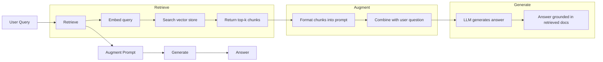
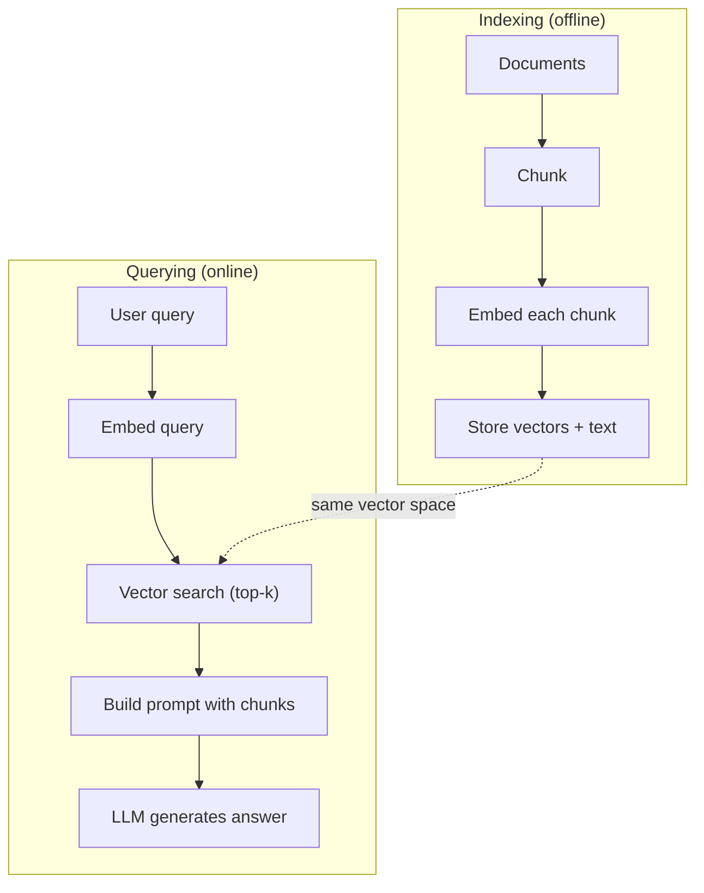

# RAG (Thế hệ tăng cường truy xuất)

> LLM của bạn biết mọi thứ cho đến ngưỡng training của nó. Nó không biết gì về tài liệu của công ty bạn, cơ sở mã của bạn hoặc ghi chú cuộc họp của tuần trước. RAG giải quyết vấn đề này bằng cách truy xuất các tài liệu liên quan và nhét chúng vào prompt. Đó là mẫu được triển khai nhiều nhất trong production AI. Nếu bạn xây dựng một thứ từ khóa học này, hãy xây dựng một RAG pipeline.

**Loại:** Xây dựng
**Ngôn ngữ:** Python
**Kiến thức tiên quyết:** Giai đoạn 10 (LLMs từ đầu), Giai đoạn 11 Bài học 01-05
**Thời lượng:** ~90 phút
**Liên quan:** Giai đoạn 5 · 23 (Chiến lược phân đoạn cho RAG) cho sáu thuật toán phân đoạn và khi mỗi thuật toán chiến thắng. Giai đoạn 5 · 22 (Embedding Models Tìm hiểu sâu) để chọn trình nhúng. Giai đoạn 11 · 07 (RAG nâng cao) để tìm kiếm kết hợp, xếp hạng lại và chuyển đổi truy vấn.

## Mục tiêu học tập

- Xây dựng một RAG pipeline hoàn chỉnh: tải, phân đoạn, embedding, lưu trữ vector, truy xuất và tạo tài liệu
- Triển khai tìm kiếm ngữ nghĩa bằng cơ sở dữ liệu vector (ChromaDB, FAISS hoặc Pinecone) với lập chỉ mục thích hợp
- Giải thích lý do tại sao RAG được ưa chuộng hơn fine-tuning cho các ứng dụng dựa trên tri thức (chi phí, độ mới, phân bổ)
- Đánh giá chất lượng RAG bằng cách sử dụng chỉ số truy xuất (precision, recall) và chỉ số tạo (độ trung thực, mức độ liên quan)

## Vấn đề

Bạn xây dựng một chatbot cho công ty của mình. Một khách hàng hỏi "policy hoàn tiền cho các gói doanh nghiệp là bao nhiêu?" Người LLM trả lời bằng một câu trả lời chung chung về policies hoàn tiền SaaS điển hình. policy thực tế, được chôn vùi trong một wiki nội bộ dài 200 trang, cho biết khách hàng doanh nghiệp nhận được khoảng thời gian 60 ngày với các khoản hoàn tiền theo tỷ lệ. LLM chưa bao giờ xem tài liệu này. Nó không thể biết nó không được huấn luyện về điều gì.

Fine-tuning là một giải pháp. Hãy sử dụng LLM, huấn luyện nó trên tài liệu nội bộ của bạn và triển khai model cập nhật. Điều này hoạt động nhưng có vấn đề nghiêm trọng. Fine-tuning tốn hàng nghìn đô la điện toán. model trở nên cũ ngay khi tài liệu thay đổi. Bạn không có cách nào để biết model lấy từ nguồn nào. Và nếu công ty mua lại một dòng sản phẩm khác vào tháng tới, bạn sẽ fine-tune lại.

RAG là giải pháp khác. Giữ nguyên model. Khi có câu hỏi, hãy tìm kiếm kho tài liệu của bạn để tìm các đoạn văn có liên quan, dán chúng vào prompt trước câu hỏi và để model trả lời bằng cách sử dụng các đoạn đó làm ngữ cảnh. Kho tài liệu có thể được cập nhật trong vài phút. Bạn có thể xem chính xác tài liệu nào đã được truy xuất. Bản thân model không bao giờ thay đổi. Đây là lý do tại sao RAG là mẫu chủ đạo trong production: nó rẻ hơn, mới hơn, dễ kiểm tra hơn và hoạt động với bất kỳ LLM nào.

## Khái niệm

### Mô hình RAG

Toàn bộ mô hình phù hợp với bốn bước:



Truy vấn -> Truy xuất -> Augment prompt -> Generate. Mọi hệ thống RAG đều tuân theo mẫu này. Sự khác biệt giữa các hệ thống production RAG nằm ở chi tiết của từng bước: cách bạn phân đoạn, cách bạn nhúng, cách bạn tìm kiếm và cách bạn xây dựng prompt.

### Tại sao RAG Beats Fine-Tuning

| Mối quan tâm | Fine-tuning | RAG |
|---------|------------|-----|
| Phí Tổn | $1,000-$100,000+ mỗi lần chạy training | $0.01-$0,10 mỗi truy vấn (embedding + LLM) |
| Sự tươi mát | Cũ cho đến khi được huấn luyện lại | Cập nhật trong vài phút bằng cách lập chỉ mục lại tài liệu |
| Khả năng kiểm toán | Không thể trace trả lời nguồn | Có thể hiển thị các đoạn văn được truy xuất chính xác |
| Ảo giác | Vẫn bị ảo giác tự do | Có cơ sở trong các tài liệu được truy xuất |
| Quyền riêng tư dữ liệu | Training dữ liệu được đưa vào trọng lượng | Tài liệu vẫn ở trong cửa hàng vector của bạn |

Fine-tuning thay đổi trọng số của model vĩnh viễn. RAG thay đổi ngữ cảnh của model tạm thời. Đối với hầu hết các ứng dụng, ngữ cảnh tạm thời là những gì bạn muốn.

Một trường hợp mà fine-tuning chiến thắng: khi bạn cần model áp dụng một phong cách, giọng điệu hoặc mô hình lý luận cụ thể mà không thể đạt được chỉ thông qua prompting. Đối với việc truy xuất kiến thức thực tế, RAG luôn chiến thắng.

### Embedding Models

Một embedding model chuyển đổi văn bản thành một vector dày đặc. Các văn bản tương tự tạo ra vectors gần nhau trong không gian high-dimensional này. "Làm cách nào để đặt lại mật khẩu của tôi?" và "Tôi cần thay đổi mật khẩu của mình" tạo ra vectors gần giống hệt nhau mặc dù chia sẻ một vài từ. "Con mèo ngồi trên thảm" tạo ra một vector rất khác.

Common embedding models (đội hình năm 2026 - xem Giai đoạn 5 · 22 để phân tích đầy đủ):

| Model | Kích thước | Nhà cung cấp | Ghi chú |
|-------|-----------|----------|-------|
| text-embedding-3-nhỏ | 1536 (Matryoshka) | OpenAI | price/performance tốt nhất cho hầu hết các trường hợp sử dụng |
| text-embedding-3-lớn | 3072 (Matryoshka) | OpenAI | accuracy cao hơn, có thể cắt 256/512/1024 |
| Gemini Embedding 2 | 3072 (Matryoshka) | Google | Truy xuất MTEB hàng đầu; Bối cảnh 8K |
| Voyage-4 (Chuyến đi-4) | 1024/2048 (Matryoshka) | Chuyến đi AI | Các biến thể miền (mã, tài chính, luật) |
| Cohere embed-v4 | 1024 (Matryoshka) | Gắn kết | Đa ngôn ngữ mạnh mẽ, ngữ cảnh 128K |
| BGE-M3 | 1024 (dày đặc + thưa thớt + ColBERT) | BAAI (trọng lượng mở) | Ba góc nhìn từ một model |
| Qwen3-Embedding | 4096 (Matryoshka) | Alibaba (trọng lượng mở) | Điểm truy xuất trọng lượng mở hàng đầu |
| tất cả-MiniLM-L6-v2 | 384 | Trọng lượng mở (Câu Transformers) | Đường cơ sở tạo mẫu |

Đối với bài học này, chúng ta xây dựng embedding đơn giản của riêng mình bằng cách sử dụng TF-IDF. Không phải vì TF-IDF là thứ mà các hệ thống production sử dụng, mà vì nó làm cho khái niệm cụ thể: văn bản đi vào, một vector xuất hiện, các văn bản tương tự tạo ra vectors tương tự.

### Vector Sự tương đồng

Với hai vectors, làm thế nào để bạn đo lường sự tương đồng? Ba tùy chọn:

**Độ tương đồng cosin**: cosin của góc giữa hai vectors. Phạm vi từ -1 (ngược lại) đến 1 (giống hệt nhau). Bỏ qua độ lớn, chỉ quan tâm đến hướng. Đây là mặc định cho RAG.

```
cosine_sim(a, b) = dot(a, b) / (||a|| * ||b||)
```

**Sản phẩm chấm**: sản phẩm thô bên trong. vectors lớn hơn sẽ đạt điểm cao hơn. Hữu ích khi độ lớn mang thông tin (tài liệu dài hơn có thể phù hợp hơn).

```
dot(a, b) = sum(a_i * b_i)
```

**Khoảng cách L2 (Euclid)**: khoảng cách đường thẳng trong không gian vector. Khoảng cách nhỏ hơn = giống nhau hơn. Nhạy cảm với sự khác biệt về độ lớn.

```
L2(a, b) = sqrt(sum((a_i - b_i)^2))
```

Sự tương đồng cosin là tiêu chuẩn. Nó xử lý các tài liệu có độ dài khác nhau một cách duyên dáng vì nó chuẩn hóa theo độ lớn. Khi ai đó nói "vector tìm kiếm", họ hầu như luôn có nghĩa là sự tương đồng cosin.

### Chiến lược Chunking

Tài liệu quá dài để nhúng dưới dạng vectors đơn. Một tệp PDF 50 trang có thể tạo ra một embedding khủng khiếp vì nó chứa hàng chục chủ đề. Thay vào đó, bạn chia tài liệu thành các phần và nhúng từng đoạn riêng biệt.

**Phân đoạn kích thước cố định**: tách mỗi N tokens. Đơn giản và dễ đoán. Một đoạn 512 token với sự chồng lên nhau 50 token có nghĩa là đoạn 1 là tokens 0-511, đoạn 2 là tokens 462-973, v.v. Sự chồng chéo đảm bảo bạn không tách một câu ở ranh giới không may mắn.

**Phân đoạn ngữ nghĩa**: phân tách theo ranh giới tự nhiên. Đoạn văn, phần hoặc tiêu đề đánh dấu. Mỗi phần là một đơn vị ý nghĩa mạch lạc. Phức tạp hơn để thực hiện nhưng tạo ra khả năng truy xuất tốt hơn.

**Phân đoạn đệ quy**: cố gắng tách ở ranh giới lớn nhất trước (tiêu đề phần). Nếu một phần vẫn quá lớn, hãy tách ở ranh giới đoạn văn. Nếu một đoạn văn vẫn quá lớn, hãy tách ở ranh giới câu. Đây là cách tiếp cận LangChain RecursiveCharacterTextSplitter và nó hoạt động tốt trong thực tế.

Kích thước khối quan trọng hơn mọi người nghĩ:

- Quá nhỏ (64-128 tokens): mỗi phần thiếu ngữ cảnh. "Nó đã tăng 15% trong quý trước" không có ý nghĩa gì nếu không biết "nó" đề cập đến điều gì.
- Quá lớn (2048+ tokens): mỗi phần bao gồm nhiều chủ đề, làm loãng mức độ liên quan. Khi bạn tìm kiếm dữ liệu doanh thu, bạn sẽ nhận được một phần 10% về doanh thu và 90% về số lượng nhân viên.
- Điểm ngọt ngào (256-512 tokens): đủ bối cảnh để khép kín, đủ tập trung để có liên quan.

Hầu hết các hệ thống production RAG sử dụng các khối token 256-512 với sự chồng chéo 50 token. Hướng dẫn RAG của Anthropic khuyến nghị phạm vi này.

### Cơ sở dữ liệu Vector

Khi bạn đã embeddings, bạn cần một nơi nào đó để lưu trữ và tìm kiếm chúng. Tùy chọn:

| Cơ sở dữ liệu | Kiểu | Tốt nhất cho |
|----------|------|----------|
| FAISS | Thư viện (trong process) | Tạo mẫu, datasets vừa và nhỏ |
| Sắc độ | DB nhẹ | Phát triển địa phương, triển khai nhỏ |
| Cây thông | Dịch vụ được quản lý | Production không có ops trên chi phí |
| Dệt | DB mã nguồn mở | production tự lưu trữ |
| pgvector | Phần mở rộng Postgres | Đã sử dụng Postgres |
| Câu hỏi | DB mã nguồn mở | Tự lưu trữ hiệu suất cao |

Đối với bài học này, chúng ta xây dựng một kho lưu trữ vector trong bộ nhớ đơn giản. Nó lưu trữ vectors trong một danh sách và thực hiện tìm kiếm sự tương đồng cosin vũ phu. Điều này tương đương với FAISS với chỉ số phẳng. Nó mở rộng quy mô có thể là 100.000 vectors trước khi chậm lại. Production hệ thống sử dụng các thuật toán gần nhất gần nhất (ANN) như HNSW để tìm kiếm hàng triệu vectors trong mili giây.

### Toàn bộ Pipeline



Giai đoạn lập chỉ mục chạy một lần cho mỗi tài liệu (hoặc khi tài liệu cập nhật). Giai đoạn truy vấn chạy trên mọi yêu cầu của người dùng. Trong production, việc lập chỉ mục có thể process hàng triệu tài liệu trong nhiều giờ. Truy vấn phải phản hồi trong vòng chưa đầy một giây.

### Số thực

Hầu hết các hệ thống production RAG sử dụng các parameters sau:

- **k = 5 đến 10** khối được truy xuất trên mỗi truy vấn
- **Kích thước khối = 256 đến 512 tokens** với 50 token chồng chéo
- **Ngân sách ngữ cảnh**: 2.500-5.000 tokens nội dung được truy xuất cho mỗi truy vấn
- **Tổng prompt**: ~8.000-16.000 tokens (system prompt + đoạn được truy xuất + lịch sử cuộc trò chuyện + truy vấn của người dùng)
- **Embedding kích thước**: 384-3072 tùy thuộc vào model
- **Thông lượng lập chỉ mục**: 100-1.000 tài liệu mỗi giây với API embeddings
- **Độ trễ truy vấn**: 50-200 mili giây để truy xuất, 500-3000 mili giây để tạo

```figure
rag-chunking
```

## Tự xây dựng

### Bước 1: Phân mảnh tài liệu

```python
def chunk_text(text, chunk_size=200, overlap=50):
    words = text.split()
    chunks = []
    start = 0
    while start < len(words):
        end = start + chunk_size
        chunk = " ".join(words[start:end])
        chunks.append(chunk)
        start += chunk_size - overlap
    return chunks
```

### Bước 2: TF-IDF Embeddings

Chúng ta xây dựng một hàm embedding đơn giản. TF-IDF (Tần số thuật ngữ-Tần số tài liệu nghịch đảo) không phải là một embedding thần kinh, nhưng nó chuyển đổi văn bản thành vectors theo cách nắm bắt được tầm quan trọng của từ. Các từ thường gặp trong tài liệu có TF cao hơn. Các từ hiếm trong kho dữ liệu có IDF cao hơn. Sản phẩm đưa ra một vector trong đó các từ quan trọng, đặc biệt có giá trị cao.

```python
import math
from collections import Counter

def build_vocabulary(documents):
    vocab = set()
    for doc in documents:
        vocab.update(doc.lower().split())
    return sorted(vocab)

def compute_tf(text, vocab):
    words = text.lower().split()
    count = Counter(words)
    total = len(words)
    return [count.get(word, 0) / total for word in vocab]

def compute_idf(documents, vocab):
    n = len(documents)
    idf = []
    for word in vocab:
        doc_count = sum(1 for doc in documents if word in doc.lower().split())
        idf.append(math.log((n + 1) / (doc_count + 1)) + 1)
    return idf

def tfidf_embed(text, vocab, idf):
    tf = compute_tf(text, vocab)
    return [t * i for t, i in zip(tf, idf)]
```

### Bước 3: Tìm kiếm độ tương tự cosin

```python
def cosine_similarity(a, b):
    dot = sum(x * y for x, y in zip(a, b))
    norm_a = math.sqrt(sum(x * x for x in a))
    norm_b = math.sqrt(sum(x * x for x in b))
    if norm_a == 0 or norm_b == 0:
        return 0.0
    return dot / (norm_a * norm_b)

def search(query_embedding, stored_embeddings, top_k=5):
    scores = []
    for i, emb in enumerate(stored_embeddings):
        sim = cosine_similarity(query_embedding, emb)
        scores.append((i, sim))
    scores.sort(key=lambda x: x[1], reverse=True)
    return scores[:top_k]
```

### Bước 4: Xây dựng Prompt

Đây là nơi "tăng cường" trong RAG xảy ra. Lấy các đoạn đã truy xuất, định dạng chúng thành prompt và yêu cầu LLM trả lời dựa trên ngữ cảnh được cung cấp.

```python
def build_rag_prompt(query, retrieved_chunks):
    context = "\n\n---\n\n".join(
        f"[Source {i+1}]\n{chunk}"
        for i, chunk in enumerate(retrieved_chunks)
    )
    return f"""Answer the question based ONLY on the following context.
If the context doesn't contain enough information, say "I don't have enough information to answer that."

Context:
{context}

Question: {query}

Answer:"""
```

### Bước 5: Hoàn thành RAG Pipeline

```python
class RAGPipeline:
    def __init__(self):
        self.chunks = []
        self.embeddings = []
        self.vocab = []
        self.idf = []

    def index(self, documents):
        all_chunks = []
        for doc in documents:
            all_chunks.extend(chunk_text(doc))
        self.chunks = all_chunks
        self.vocab = build_vocabulary(all_chunks)
        self.idf = compute_idf(all_chunks, self.vocab)
        self.embeddings = [
            tfidf_embed(chunk, self.vocab, self.idf)
            for chunk in all_chunks
        ]

    def query(self, question, top_k=5):
        query_emb = tfidf_embed(question, self.vocab, self.idf)
        results = search(query_emb, self.embeddings, top_k)
        retrieved = [(self.chunks[i], score) for i, score in results]
        prompt = build_rag_prompt(
            question, [chunk for chunk, _ in retrieved]
        )
        return prompt, retrieved
```

### Bước 6: Tạo (mô phỏng)

Trong production, đây là nơi bạn gọi LLM API. Đối với bài học này, chúng tôi mô phỏng thế hệ bằng cách trích xuất câu có liên quan nhất từ ngữ cảnh được truy xuất.

```python
def simple_generate(prompt, retrieved_chunks):
    query_words = set(prompt.lower().split("question:")[-1].split())
    best_sentence = ""
    best_score = 0
    for chunk in retrieved_chunks:
        for sentence in chunk.split("."):
            sentence = sentence.strip()
            if not sentence:
                continue
            words = set(sentence.lower().split())
            overlap = len(query_words & words)
            if overlap > best_score:
                best_score = overlap
                best_sentence = sentence
    return best_sentence if best_sentence else "I don't have enough information."
```

## Ứng dụng

Với một embedding model và LLM thực sự, mã hầu như không thay đổi:

```python
from openai import OpenAI

client = OpenAI()

def embed(text):
    response = client.embeddings.create(
        model="text-embedding-3-small",
        input=text
    )
    return response.data[0].embedding

def generate(prompt):
    response = client.chat.completions.create(
        model="gpt-4o-mini",
        messages=[{"role": "user", "content": prompt}],
        temperature=0
    )
    return response.choices[0].message.content
```

Hoặc với Anthropic:

```python
import anthropic

client = anthropic.Anthropic()

def generate(prompt):
    response = client.messages.create(
        model="claude-sonnet-4-20250514",
        max_tokens=1024,
        messages=[{"role": "user", "content": prompt}]
    )
    return response.content[0].text
```

Các pipeline giống nhau. Hoán đổi hàm embedding. Hoán đổi chức năng tạo. Logic truy xuất, phân đoạn prompt cấu trúc -- tất cả đều giống hệt nhau bất kể bạn sử dụng models nào.

Để lưu trữ vector trên quy mô lớn, hãy thay thế tìm kiếm brute-force bằng cơ sở dữ liệu vector thích hợp:

```python
import chromadb

client = chromadb.Client()
collection = client.create_collection("my_docs")

collection.add(
    documents=chunks,
    ids=[f"chunk_{i}" for i in range(len(chunks))]
)

results = collection.query(
    query_texts=["What is the refund policy?"],
    n_results=5
)
```

Chroma xử lý embedding nội bộ (nó sử dụng all-MiniLM-L6-v2 theo mặc định) và lưu trữ vectors trong cơ sở dữ liệu cục bộ. Cùng một mẫu, hệ thống ống nước khác nhau.

## Sản phẩm bàn giao

Bài học này tạo ra:
- `outputs/prompt-rag-architect.md` -- prompt thiết kế hệ thống RAG cho các trường hợp sử dụng cụ thể
- `outputs/skill-rag-pipeline.md` -- một skill dạy agents cách xây dựng và gỡ lỗi RAG pipelines

## Bài tập

1. Thay thế embeddings TF-IDF bằng cách tiếp cận túi từ đơn giản (nhị phân: 1 nếu có từ, 0 nếu không). So sánh chất lượng truy xuất trên các tài liệu mẫu. TF-IDF sẽ hoạt động tốt hơn vì nó có trọng số các từ hiếm cao hơn.

2. Thử nghiệm với kích thước khối: thử 50, 100, 200 và 500 từ trên cùng một tập tài liệu. Đối với mỗi kích thước, hãy chạy cùng 5 truy vấn và đếm số lượng truy vấn trả về một đoạn có liên quan trong top 3. Tìm điểm ngọt ngào nơi chất lượng truy xuất đạt đỉnh cao.

3. Thêm siêu dữ liệu vào từng đoạn (tên tài liệu nguồn, vị trí chunk). Sửa đổi mẫu prompt để bao gồm phân bổ nguồn để LLM trích dẫn nguồn.

4. Thực hiện một đánh giá đơn giản: đưa ra 10 cặp câu hỏi-trả lời, chạy từng câu hỏi qua RAG pipeline và đo lường tỷ lệ phần trăm các đoạn được truy xuất chứa câu trả lời. Đây là truy xuất recall tại k.

5. Xây dựng một RAG pipeline nhận thức về cuộc trò chuyện: duy trì lịch sử của 3 cuộc trao đổi gần đây nhất và đưa chúng vào prompt cùng với các phần được truy xuất. Kiểm tra với các câu hỏi tiếp theo như "Còn doanh nghiệp thì sao?" sau khi hỏi về giá cả.

## Thuật ngữ chính

| Thuật ngữ | Những gì mọi người nói | Ý nghĩa thực sự của nó |
|------|----------------|----------------------|
| RAG | "AI đọc tài liệu của bạn" | Truy xuất các tài liệu liên quan, dán chúng vào prompt và tạo câu trả lời dựa trên các tài liệu đó |
| Embedding | "Chuyển đổi văn bản thành số" | Một biểu diễn vector dày đặc của văn bản trong đó các ý nghĩa tương tự tạo ra vectors tương tự |
| Cơ sở dữ liệu Vector | "Công cụ tìm kiếm cho AI" | Kho dữ liệu được tối ưu hóa để lưu trữ vectors và tìm hàng xóm gần nhất theo sự tương đồng |
| Chunking | "Chia tài liệu thành nhiều mảnh" | Chia tài liệu thành các phân đoạn nhỏ hơn (thường là 256-512 tokens) để mỗi phân đoạn có thể được nhúng và truy xuất độc lập |
| Sự tương đồng cosin | "Hai vectors giống nhau như thế nào" | Cosin của góc giữa hai vectors; 1 = hướng giống hệt nhau, 0 = trực giao, -1 = ngược lại |
| Truy xuất Top-k | "Nhận k trận đấu hay nhất" | Trả về k các đoạn tương tự nhất vào truy vấn từ cửa hàng vector |
| Context window | "Người LLM có thể nhìn thấy bao nhiêu văn bản" | Số lượng tokens tối đa mà LLM có thể process trong một yêu cầu; các đoạn được truy xuất phải phù hợp với |
| Thế hệ tăng cường | "Trả lời bằng ngữ cảnh nhất định" | Tạo phản hồi bằng cách sử dụng các tài liệu được truy xuất làm ngữ cảnh thay vì chỉ dựa vào kiến thức được huấn luyện |
| TF-IDF | "Chấm điểm tầm quan trọng của từ" | Tần số thuật ngữ nhân với tần số tài liệu nghịch đảo; trọng số các từ theo mức độ đặc biệt của chúng trong một kho dữ liệu |
| Lập chỉ mục | "Chuẩn bị tài liệu để tìm kiếm" | Các process ngoại tuyến của việc phân đoạn, embedding và lưu trữ tài liệu để có thể tìm kiếm chúng tại thời điểm truy vấn |

## Đọc thêm

- Lewis và cộng sự, "Retrieval-Augmented Generation for Knowledge-Intensive NLP Tasks" (2020) - bài báo gốc RAG từ Facebook AI Research chính thức hóa mô hình truy xuất sau đó tạo
- Tài liệu RAG của Anthropic (docs.anthropic.com) -- hướng dẫn thực tế về kích thước khối, xây dựng prompt và đánh giá
- Trung tâm học tập Pinecone, "RAG là gì?" - giải thích trực quan rõ ràng về RAG pipeline với những cân nhắc production
- Câu BERT: Reimers & Gurevych (2019) - bài báo đằng sau embedding models MiniLM toàn diện, chỉ ra cách huấn luyện encoders kép để có sự tương đồng về ngữ nghĩa
- [Karpukhin et al., "Dense Passage Retrieval for Open-Domain Question Answering" (EMNLP 2020)](https://arxiv.org/abs/2004.04906) - bài báo DPR đã chứng minh khả năng truy xuất hai encoder dày đặc đánh bại BM25 trên QA miền mở và thiết lập khuôn mẫu cho những săn RAG hiện đại.
- [LlamaIndex High-Level Concepts](https://docs.llamaindex.ai/en/stable/getting_started/concepts.html) -- các khái niệm chính cần biết khi xây dựng RAG pipelines: trình tải dữ liệu, trình phân tích cú pháp nút, chỉ mục, truy xuất, bộ tổng hợp phản hồi.
- [LangChain RAG tutorial](https://python.langchain.com/docs/tutorials/rag/) -- trình điều phối hương vị ngược lại; chế độ xem chuỗi có thể chạy của cùng một mẫu truy xuất sau đó tạo.
