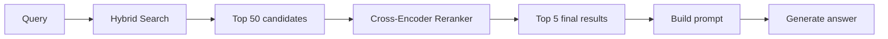
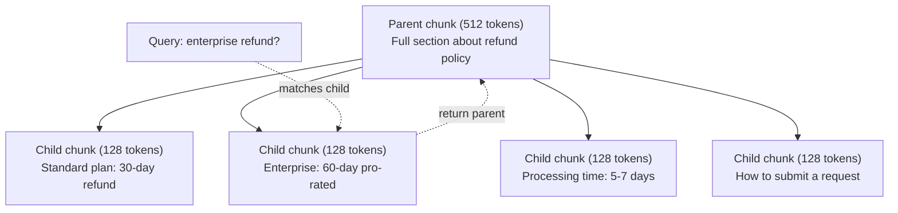
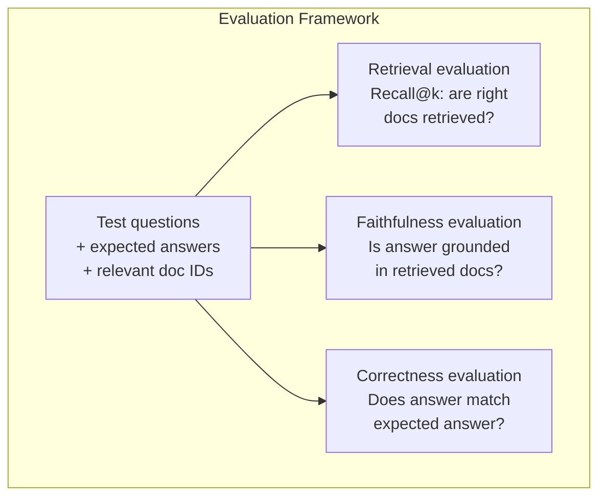

# RAG nâng cao (Phân đoạn, Xếp hạng lại, Tìm kiếm kết hợp)

> Basic RAG truy xuất top-k phần tương tự nhất. Điều đó hoạt động cho các câu hỏi đơn giản. Nó sụp đổ cho lý luận nhiều bước nhảy, truy vấn mơ hồ và kho dữ liệu lớn. Advanced RAG là sự khác biệt giữa bản demo hoạt động trên 10 tài liệu và hệ thống hoạt động trên 10 triệu.

**Loại:** Xây dựng
**Ngôn ngữ:** Python
**Kiến thức tiên quyết:** Giai đoạn 11, Bài 06 (RAG)
**Thời lượng:** ~90 phút
**Liên quan:** Giai đoạn 5 · 23 (Chiến lược phân đoạn cho RAG) bao gồm tất cả sáu thuật toán phân đoạn - đệ quy, ngữ nghĩa, câu, tài liệu mẹ, phân đoạn muộn, truy xuất theo ngữ cảnh - với Vectara/Anthropic benchmarks. Bài học này được xây dựng dựa trên: tìm kiếm kết hợp, xếp hạng lại, chuyển đổi truy vấn.

## Mục tiêu học tập

- Triển khai các chiến lược phân đoạn nâng cao (ngữ nghĩa, đệ quy, cha-con) để bảo toàn cấu trúc và ngữ cảnh của tài liệu
- Xây dựng pipeline tìm kiếm kết hợp kết hợp đối sánh từ khóa BM25 với tìm kiếm vector ngữ nghĩa và trình xếp hạng lại encoder chéo
- Áp dụng các kỹ thuật chuyển đổi truy vấn (HyDE, nhiều truy vấn, lùi bước) để cải thiện khả năng truy xuất các câu hỏi mơ hồ hoặc phức tạp
- Chẩn đoán và khắc phục các lỗi RAG thường gặp: truy xuất sai chunk, câu trả lời không đúng ngữ cảnh, phân tích suy luận nhiều bước nhảy

## Vấn đề

Bạn đã xây dựng một RAG pipeline cơ bản trong Bài 06. Nó hoạt động cho các câu hỏi đơn giản trên một kho dữ liệu nhỏ. Bây giờ hãy thử những điều sau:

**Truy vấn mơ hồ**: "Doanh thu quý trước là bao nhiêu?" Tìm kiếm ngữ nghĩa trả về các phần về chiến lược doanh thu, dự báo doanh thu và suy nghĩ của CFO về tăng trưởng doanh thu. Tất cả đều giống nhau về mặt ngữ nghĩa với từ "doanh thu". Không chứa con số thực tế. Đoạn chính xác là "$47.2M in Q3 2025" but uses the word "earnings" instead of "revenue." The embedding model thinks "revenue strategy" is closer to the query than "Q3 earnings were $47,2 triệu".

**Câu hỏi nhiều bước nhảy**: "Nhóm nào có điểm hài lòng của khách hàng được cải thiện cao nhất?" Điều này đòi hỏi phải tìm điểm hài lòng cho từng nhóm, so sánh chúng và xác định mức tối đa. Không có phần nào chứa câu trả lời. Thông tin nằm rải rác trong các báo cáo nhóm.

**Vấn đề kho dữ liệu lớn**: Bạn có 2 triệu khối. Câu trả lời đúng là trong đoạn #1,847,293. Truy xuất top 5 của bạn kéo các đoạn #14, #89,201, #1,200,000, #44 và #901,333. Đóng trong embedding không gian, nhưng không có câu trả lời nào. Ở thang đo này, tìm kiếm lân cận gần nhất gần nhất tạo ra đủ lỗi khiến các kết quả liên quan bị đẩy ra khỏi top-k.

RAG cơ bản không thành công vì vector giống nhau không giống với mức độ liên quan. Một đoạn có thể tương tự về mặt ngữ nghĩa với một truy vấn mà không hữu ích để trả lời nó. Advanced RAG giải quyết vấn đề này bằng bốn kỹ thuật: tìm kiếm kết hợp (thêm đối sánh từ khóa), xếp hạng lại (chấm điểm ứng viên cẩn thận hơn), chuyển đổi truy vấn (sửa truy vấn trước khi tìm kiếm) và phân đoạn tốt hơn (truy xuất ở độ chi tiết phù hợp).

## Khái niệm

### Tìm kiếm kết hợp: Ngữ nghĩa + Từ khóa

Tìm kiếm ngữ nghĩa (vector tương tự) rất tốt trong việc hiểu ý nghĩa. "Làm cách nào để hủy đăng ký của tôi?" khớp với "Các bước để chấm dứt gói của bạn" mặc dù chúng không chia sẻ từ. Nhưng nó bỏ lỡ các kết quả khớp chính xác. "Mã lỗi E-4021" có thể không khớp với một đoạn chứa "E-4021" nếu embedding model coi đó là nhiễu.

Tìm kiếm từ khóa (BM25) thì ngược lại. Nó vượt trội ở các kết quả khớp chính xác. "E-4021" khớp hoàn hảo. Nhưng "hủy đăng ký của tôi" trả về kết quả bằng không nếu tài liệu cho biết "chấm dứt gói của bạn".

Tìm kiếm kết hợp chạy cả hai, sau đó merges kết quả.

**BM25** (Best Matching 25) là thuật toán tìm kiếm từ khóa tiêu chuẩn. Nó đã là xương sống của các công cụ tìm kiếm từ những năm 1990. Công thức:

```
BM25(q, d) = sum over terms t in q:
    IDF(t) * (tf(t,d) * (k1 + 1)) / (tf(t,d) + k1 * (1 - b + b * |d| / avgdl))
```

Trong đó tf(t,d) là tần số thuật ngữ của t trong tài liệu d, IDF(t) là tần số tài liệu nghịch đảo, |d| là độ dài tài liệu, avgdl là độ dài tài liệu trung bình, k1 kiểm soát độ bão hòa tần số thuật ngữ (mặc định 1,2) và b kiểm soát chuẩn hóa độ dài (mặc định 0,75).

Nói một cách đơn giản: BM25 chấm điểm tài liệu cao hơn khi chúng chứa các thuật ngữ truy vấn (đặc biệt là những thuật ngữ hiếm), nhưng với lợi nhuận giảm dần cho các thuật ngữ lặp lại. Một tài liệu có từ "doanh thu" 50 lần không liên quan nhiều hơn 50 lần so với một tài liệu có một lần.

### Hợp nhất xếp hạng đối ứng (RRF)

Bạn có hai danh sách được xếp hạng: một từ tìm kiếm vector, một từ BM25. Làm thế nào để bạn kết hợp chúng? Reciprocal Rank Fusion là cách tiếp cận tiêu chuẩn.

```
RRF_score(d) = sum over rankings R:
    1 / (k + rank_R(d))
```

Trong đó k là một hằng số (thường là 60) ngăn kết quả được xếp hạng cao nhất chiếm ưu thế.

Một tài liệu được xếp hạng #1 trong tìm kiếm vector và #5 trong BM25 nhận được: 1/(60+1) + 1/(60+5) = 0,0164 + 0,0154 = 0,0318

Một tài liệu được xếp hạng #3 trong tìm kiếm vector và #2 trong BM25 nhận được: 1/(60+3) + 1/(60+2) = 0,0159 + 0,0161 = 0,0320

RRF cân bằng hai tín hiệu một cách tự nhiên. Một tài liệu xếp hạng cao trong cả hai danh sách sẽ nhận được điểm cao nhất. Một tài liệu xếp hạng #1 trong một danh sách nhưng không có trong danh sách kia sẽ nhận được điểm trung bình. Điều này mạnh mẽ vì nó sử dụng thứ hạng chứ không phải điểm thô, vì vậy sự khác biệt trong phân phối điểm giữa hai hệ thống không quan trọng.

### Xếp hạng lại

Truy xuất (dù là vector, từ khóa hay kết hợp) nhanh nhưng không chính xác. Nó sử dụng hai encoders: truy vấn và mỗi tài liệu được nhúng độc lập, sau đó được so sánh. Các embeddings được tính toán một lần và được lưu vào bộ nhớ đệm. Điều này mở rộng thành hàng triệu tài liệu.

Xếp hạng lại sử dụng encoders chéo: truy vấn và tài liệu ứng viên được đưa vào một model xuất ra điểm liên quan. model xem đồng thời cả hai văn bản và có thể nắm bắt các tương tác chi tiết giữa chúng. Một encoder chéo có thể hiểu rằng "Thu nhập quý 3 là bao nhiêu?" có liên quan cao đến một phần chứa "47,2 triệu đô la trong quý 3" ngay cả khi một encoder hai bên bỏ lỡ kết nối.

Sự đánh đổi: cross-encoders chậm hơn 100-1000 lần so với bi-encoders vì chúng cùng process cặp truy vấn-tài liệu. Bạn không thể tính toán trước điểm cross-encoder cho một triệu tài liệu. Giải pháp: truy xuất một nhóm ứng cử viên lớn hơn (top-50 từ tìm kiếm kết hợp), sau đó xếp hạng lại bằng cross-encoder để có được top 5 cuối cùng.



Xếp hạng lại phổ biến models (đội hình năm 2026):
- Cohere Rerank 3.5: API được quản lý, đa ngôn ngữ, tăng recall tốt nhất trên kho dữ liệu hỗn hợp
- Voyage rerank-2.5: API được quản lý, độ trễ thấp nhất của các tùy chọn được lưu trữ
- Jina-Reranker-v2 Đa ngôn ngữ: trọng lượng mở, 100+ ngôn ngữ
- BGE-Reranker-V2-M3: Trọng lượng mở, đường cơ sở mạnh mẽ
- cross-encoder/ms-marco-MiniLM-L-6-v2: trọng lượng mở, chạy trên CPU để tạo mẫu
- ColBERTv2 / Jina-ColBERT-v2: trình xếp hạng lại nhiều vector tương tác muộn - O (tokens) không phải O (tài liệu) tại thời điểm ghi điểm

### Chuyển đổi truy vấn

Đôi khi vấn đề không phải là truy xuất mà là bản thân truy vấn. "Điều đó về sự thay đổi policy mới là gì?" là một truy vấn tìm kiếm khủng khiếp. Nó không chứa các thuật ngữ cụ thể. embedding mơ hồ. Không có hệ thống truy xuất nào có thể tìm thấy tài liệu phù hợp từ điều này.

**Viết lại truy vấn**: diễn đạt lại truy vấn của người dùng thành truy vấn tìm kiếm tốt hơn. Một LLM có thể làm điều này:

```
User: "What was that thing about the new policy change?"
Rewritten: "Recent policy changes and updates"
```

**HyDE (Tài liệu giả định Embeddings)**: thay vì tìm kiếm bằng truy vấn, hãy tạo câu trả lời giả định, nhúng câu trả lời đó và tìm kiếm các tài liệu thực tương tự.

```
Query: "What is the refund policy for enterprise?"
Hypothetical answer: "Enterprise customers are eligible for a full refund
within 60 days of purchase. Refunds are pro-rated based on the remaining
subscription period and processed within 5-7 business days."
```

Nhúng câu trả lời giả định và tìm kiếm các tài liệu thực tương tự như nó. Trực giác: câu trả lời giả định sống gần embedding không gian với câu trả lời thực hơn so với câu hỏi ban đầu. Câu hỏi và câu trả lời có cấu trúc ngôn ngữ khác nhau. Bằng cách tạo ra một câu trả lời giả định, bạn thu hẹp khoảng cách giữa "không gian câu hỏi" và "không gian câu trả lời" trong embedding.

HyDE thêm một cuộc gọi LLM trước khi truy xuất. Điều này làm tăng độ trễ lên 500-2000ms. Đáng giá khi chất lượng truy xuất kém trên các truy vấn thô.

### Cha mẹ - Con cái Chunking

Phân đoạn tiêu chuẩn buộc phải đánh đổi: các phân đoạn nhỏ để truy xuất chính xác, các phân đoạn lớn để có đủ ngữ cảnh. Phân đoạn cha-con loại bỏ sự đánh đổi này.

Lập chỉ mục các đoạn nhỏ (128 tokens) để truy xuất. Khi một đoạn nhỏ được truy xuất, hãy trả về đoạn mẹ của nó (512 tokens) cho prompt. Đoạn nhỏ khớp chính xác với truy vấn. Đoạn mẹ cung cấp đủ ngữ cảnh để LLM tạo câu trả lời tốt.



Truy vấn "hoàn tiền doanh nghiệp?" khớp chính xác với đoạn con C2. Nhưng prompt nhận được đoạn mẹ đầy đủ P, bao gồm ngữ cảnh xung quanh về thời gian xử lý và process gửi.

### Lọc siêu dữ liệu

Trước khi chạy tìm kiếm vector, hãy lọc kho dữ liệu theo siêu dữ liệu: ngày, nguồn, danh mục, tác giả, ngôn ngữ. Điều này làm giảm không gian tìm kiếm và ngăn chặn các kết quả không liên quan.

"Điều gì đã thay đổi trong policy bảo mật tháng trước?" chỉ nên tìm kiếm tài liệu từ 30 ngày qua trong danh mục bảo mật. Nếu không có siêu dữ liệu lọc dữ liệu, bạn tìm kiếm toàn bộ kho dữ liệu và có thể truy xuất một tài liệu bảo mật 2 năm tuổi có ngữ nghĩa tương tự.

Production RAG hệ thống lưu trữ siêu dữ liệu cùng với từng đoạn: tài liệu nguồn, ngày tạo, danh mục, tác giả, phiên bản. Vector cơ sở dữ liệu hỗ trợ lọc trước bằng siêu dữ liệu trước khi tìm kiếm tương tự, điều này rất quan trọng đối với hiệu suất trên quy mô lớn.

### Đánh giá

Bạn đã xây dựng một hệ thống RAG. Làm thế nào để bạn biết nếu nó hoạt động? Ba chỉ số:

**Mức độ liên quan truy xuất (Recall@k)**: đối với một tập hợp các câu hỏi kiểm tra có các tài liệu liên quan đã biết, bao nhiêu phần trăm tài liệu liên quan xuất hiện trong kết quả top-k? Nếu câu trả lời cho một câu hỏi nằm trong đoạn #47, đoạn #47 có xuất hiện trong top 5 không?

**Faithfulness**: câu trả lời được tạo ra có dựa trên các tài liệu được truy xuất không? Nếu các đoạn được truy xuất cho biết "cửa sổ hoàn tiền 60 ngày" và model cho biết "cửa sổ hoàn tiền 90 ngày", đó là sự thất bại của sự trung thực. Người model bị ảo giác mặc dù có ngữ cảnh chính xác.

**Độ đúng của câu trả lời**: câu trả lời được tạo có khớp với câu trả lời mong đợi không? Đây là chỉ số đầu cuối. Nó kết hợp chất lượng truy xuất và chất lượng tạo.

Một kiểm tra độ trung thực đơn giản: lấy từng tuyên bố trong câu trả lời được tạo và xác minh rằng nó xuất hiện (về bản chất) trong các đoạn được truy xuất. Nếu câu trả lời chứa một sự kiện không có trong bất kỳ đoạn nào được truy xuất, nó có thể là ảo giác.



## Tự xây dựng

### Bước 1: Triển khai BM25

```python
import math
from collections import Counter

class BM25:
    def __init__(self, k1=1.2, b=0.75):
        self.k1 = k1
        self.b = b
        self.docs = []
        self.doc_lengths = []
        self.avg_dl = 0
        self.doc_freqs = {}
        self.n_docs = 0

    def index(self, documents):
        self.docs = documents
        self.n_docs = len(documents)
        self.doc_lengths = []
        self.doc_freqs = {}

        for doc in documents:
            words = doc.lower().split()
            self.doc_lengths.append(len(words))
            unique_words = set(words)
            for word in unique_words:
                self.doc_freqs[word] = self.doc_freqs.get(word, 0) + 1

        self.avg_dl = sum(self.doc_lengths) / self.n_docs if self.n_docs else 1

    def score(self, query, doc_idx):
        query_words = query.lower().split()
        doc_words = self.docs[doc_idx].lower().split()
        doc_len = self.doc_lengths[doc_idx]
        word_counts = Counter(doc_words)
        score = 0.0

        for term in query_words:
            if term not in word_counts:
                continue
            tf = word_counts[term]
            df = self.doc_freqs.get(term, 0)
            idf = math.log((self.n_docs - df + 0.5) / (df + 0.5) + 1)
            numerator = tf * (self.k1 + 1)
            denominator = tf + self.k1 * (1 - self.b + self.b * doc_len / self.avg_dl)
            score += idf * numerator / denominator

        return score

    def search(self, query, top_k=10):
        scores = [(i, self.score(query, i)) for i in range(self.n_docs)]
        scores.sort(key=lambda x: x[1], reverse=True)
        return scores[:top_k]
```

### Bước 2: Hợp nhất xếp hạng đối ứng

```python
def reciprocal_rank_fusion(ranked_lists, k=60):
    scores = {}
    for ranked_list in ranked_lists:
        for rank, (doc_id, _) in enumerate(ranked_list):
            if doc_id not in scores:
                scores[doc_id] = 0.0
            scores[doc_id] += 1.0 / (k + rank + 1)
    fused = sorted(scores.items(), key=lambda x: x[1], reverse=True)
    return fused
```

### Bước 3: Tìm kiếm kết hợp Pipeline

```python
def hybrid_search(query, chunks, vector_embeddings, vocab, idf, bm25_index, top_k=5, fusion_k=60):
    query_emb = tfidf_embed(query, vocab, idf)
    vector_results = search(query_emb, vector_embeddings, top_k=top_k * 3)
    bm25_results = bm25_index.search(query, top_k=top_k * 3)
    fused = reciprocal_rank_fusion([vector_results, bm25_results], k=fusion_k)
    return fused[:top_k]
```

### Bước 4: Xếp hạng lại đơn giản

Trong production, bạn sẽ sử dụng cross-encoder model. Ở đây chúng tôi xây dựng một reranker chấm điểm mức độ liên quan của tài liệu truy vấn bằng cách sử dụng chồng chéo từ, tầm quan trọng của thuật ngữ và đối sánh cụm từ.

```python
def rerank(query, candidates, chunks):
    query_words = set(query.lower().split())
    stop_words = {"the", "a", "an", "is", "are", "was", "were", "what", "how",
                  "why", "when", "where", "do", "does", "for", "of", "in", "to",
                  "and", "or", "on", "at", "by", "it", "its", "this", "that",
                  "with", "from", "be", "has", "have", "had", "not", "but"}
    query_terms = query_words - stop_words

    scored = []
    for doc_id, initial_score in candidates:
        chunk = chunks[doc_id].lower()
        chunk_words = set(chunk.split())

        term_overlap = len(query_terms & chunk_words)

        query_bigrams = set()
        q_list = [w for w in query.lower().split() if w not in stop_words]
        for i in range(len(q_list) - 1):
            query_bigrams.add(q_list[i] + " " + q_list[i + 1])
        bigram_matches = sum(1 for bg in query_bigrams if bg in chunk)

        position_boost = 0
        for term in query_terms:
            pos = chunk.find(term)
            if pos != -1 and pos < len(chunk) // 3:
                position_boost += 0.5

        rerank_score = (
            term_overlap * 1.0
            + bigram_matches * 2.0
            + position_boost
            + initial_score * 5.0
        )
        scored.append((doc_id, rerank_score))

    scored.sort(key=lambda x: x[1], reverse=True)
    return scored
```

### Bước 5: HyDE (Tài liệu giả định Embeddings)

```python
def hyde_generate_hypothesis(query):
    templates = {
        "what": "The answer to '{query}' is as follows: Based on our documentation, {topic} involves specific policies and procedures that define how the process works.",
        "how": "To address '{query}': The process involves several steps. First, you need to initiate the request. Then, the system processes it according to the defined rules.",
        "default": "Regarding '{query}': Our records indicate specific details and policies related to this topic that provide a comprehensive answer."
    }
    query_lower = query.lower()
    if query_lower.startswith("what"):
        template = templates["what"]
    elif query_lower.startswith("how"):
        template = templates["how"]
    else:
        template = templates["default"]

    topic_words = [w for w in query.lower().split()
                   if w not in {"what", "is", "the", "how", "do", "does", "a", "an",
                                "for", "of", "to", "in", "on", "at", "by", "and", "or"}]
    topic = " ".join(topic_words) if topic_words else "this topic"

    return template.format(query=query, topic=topic)


def hyde_search(query, chunks, vector_embeddings, vocab, idf, top_k=5):
    hypothesis = hyde_generate_hypothesis(query)
    hypothesis_emb = tfidf_embed(hypothesis, vocab, idf)
    results = search(hypothesis_emb, vector_embeddings, top_k)
    return results, hypothesis
```

### Bước 6: Cha mẹ - Con cái Chunking

```python
def create_parent_child_chunks(text, parent_size=200, child_size=50):
    words = text.split()
    parents = []
    children = []
    child_to_parent = {}

    parent_idx = 0
    start = 0
    while start < len(words):
        parent_end = min(start + parent_size, len(words))
        parent_text = " ".join(words[start:parent_end])
        parents.append(parent_text)

        child_start = start
        while child_start < parent_end:
            child_end = min(child_start + child_size, parent_end)
            child_text = " ".join(words[child_start:child_end])
            child_idx = len(children)
            children.append(child_text)
            child_to_parent[child_idx] = parent_idx
            child_start += child_size

        parent_idx += 1
        start += parent_size

    return parents, children, child_to_parent
```

### Bước 7: Đánh giá mức độ trung thành

```python
def evaluate_faithfulness(answer, retrieved_chunks):
    answer_sentences = [s.strip() for s in answer.split(".") if len(s.strip()) > 10]
    if not answer_sentences:
        return 1.0, []

    grounded = 0
    ungrounded = []
    context = " ".join(retrieved_chunks).lower()

    for sentence in answer_sentences:
        words = set(sentence.lower().split())
        stop_words = {"the", "a", "an", "is", "are", "was", "were", "and", "or",
                      "to", "of", "in", "for", "on", "at", "by", "it", "this", "that"}
        content_words = words - stop_words
        if not content_words:
            grounded += 1
            continue

        matched = sum(1 for w in content_words if w in context)
        ratio = matched / len(content_words) if content_words else 0

        if ratio >= 0.5:
            grounded += 1
        else:
            ungrounded.append(sentence)

    score = grounded / len(answer_sentences) if answer_sentences else 1.0
    return score, ungrounded


def evaluate_retrieval_recall(queries_with_relevant, retrieval_fn, k=5):
    total_recall = 0.0
    results = []

    for query, relevant_indices in queries_with_relevant:
        retrieved = retrieval_fn(query, k)
        retrieved_indices = set(idx for idx, _ in retrieved)
        relevant_set = set(relevant_indices)
        hits = len(retrieved_indices & relevant_set)
        recall = hits / len(relevant_set) if relevant_set else 1.0
        total_recall += recall
        results.append({
            "query": query,
            "recall": recall,
            "hits": hits,
            "total_relevant": len(relevant_set)
        })

    avg_recall = total_recall / len(queries_with_relevant) if queries_with_relevant else 0
    return avg_recall, results
```

## Ứng dụng

Với một encoder chéo thực sự để xếp hạng lại:

```python
from sentence_transformers import CrossEncoder

reranker = CrossEncoder("cross-encoder/ms-marco-MiniLM-L-6-v2")

def rerank_with_cross_encoder(query, candidates, chunks, top_k=5):
    pairs = [(query, chunks[doc_id]) for doc_id, _ in candidates]
    scores = reranker.predict(pairs)
    scored = list(zip([doc_id for doc_id, _ in candidates], scores))
    scored.sort(key=lambda x: x[1], reverse=True)
    return scored[:top_k]
```

Với trình xếp hạng lại được quản lý của Cohere:

```python
import cohere

co = cohere.Client()

def rerank_with_cohere(query, candidates, chunks, top_k=5):
    docs = [chunks[doc_id] for doc_id, _ in candidates]
    response = co.rerank(
        model="rerank-english-v3.0",
        query=query,
        documents=docs,
        top_n=top_k
    )
    return [(candidates[r.index][0], r.relevance_score) for r in response.results]
```

Đối với HyDE có LLM thực sự:

```python
import anthropic

client = anthropic.Anthropic()

def hyde_with_llm(query):
    response = client.messages.create(
        model="claude-sonnet-4-20250514",
        max_tokens=256,
        messages=[{
            "role": "user",
            "content": f"Write a short paragraph that would be a good answer to this question. Do not say you don't know. Just write what the answer would look like.\n\nQuestion: {query}"
        }]
    )
    return response.content[0].text
```

Đối với production tìm kiếm kết hợp với Weaviate:

```python
import weaviate

client = weaviate.connect_to_local()

collection = client.collections.get("Documents")
response = collection.query.hybrid(
    query="enterprise refund policy",
    alpha=0.5,
    limit=10
)
```

Alpha parameter kiểm soát sự cân bằng: 0,0 = từ khóa thuần túy (BM25), 1,0 = vector thuần túy, 0,5 = trọng số bằng nhau. Hầu hết các hệ thống production sử dụng alpha trong khoảng từ 0,3 đến 0,7.

## Sản phẩm bàn giao

Bài học này tạo ra:
- `outputs/prompt-advanced-rag-debugger.md` -- một prompt để chẩn đoán và khắc phục các vấn đề về chất lượng RAG
- `outputs/skill-advanced-rag.md` -- một skill để xây dựng RAG cấp production với tìm kiếm và xếp hạng lại kết hợp

## Bài tập

1. So sánh BM25 so với tìm kiếm vector và tìm kiếm kết hợp trên các tài liệu mẫu. Đối với mỗi truy vấn trong số 5 truy vấn thử nghiệm, ghi lại cách tiếp cận nào trả về phần phù hợp nhất ở vị trí #1. Tìm kiếm kết hợp sẽ giành chiến thắng ít nhất 3 trong số 5.

2. Triển khai bộ lọc siêu dữ liệu. Thêm trường "danh mục" vào mỗi tài liệu (bảo mật, thanh toán, api, sản phẩm). Trước khi chạy tìm kiếm vector, hãy lọc các đoạn chỉ thành danh mục có liên quan. Kiểm tra với "Mã hóa nào được sử dụng?" và xác minh rằng nó chỉ tìm kiếm các đoạn danh mục bảo mật.

3. Xây dựng một HyDE pipeline đầy đủ bằng cách sử dụng hàm tạo đơn giản từ Bài 06. So sánh chất lượng truy xuất (mức độ liên quan top 3) giữa tìm kiếm truy vấn trực tiếp và tìm kiếm HyDE trên cả 5 truy vấn kiểm tra. HyDE nên cải thiện kết quả cho các truy vấn mơ hồ.

4. Triển khai chiến lược phân đoạn cha-con trên các tài liệu mẫu. Sử dụng child_size=30 và parent_size=100. Tìm kiếm với các phân đoạn con nhưng trả về các phân đoạn cha trong prompt. So sánh các câu trả lời được tạo với phân đoạn tiêu chuẩn với chunk_size=50.

5. Tạo dataset đánh giá: 10 câu hỏi với các đoạn câu trả lời đã biết. Đo lường Recall@3, Recall@5 và Recall@10 cho (a) chỉ tìm kiếm vector, (b) chỉ BM25, (c) tìm kiếm kết hợp, (d) kết hợp + xếp hạng lại. Vẽ kết quả và xác định nơi xếp hạng lại giúp ích nhiều nhất.

## Thuật ngữ chính

| Thuật ngữ | Những gì mọi người nói | Ý nghĩa thực sự của nó |
|------|----------------|----------------------|
| BM25 | "Tìm kiếm từ khóa" | Thuật toán xếp hạng xác suất chấm điểm tài liệu theo tần suất thuật ngữ, tần suất tài liệu nghịch đảo và chuẩn hóa độ dài tài liệu |
| Tìm kiếm kết hợp | "Tốt nhất của cả hai thế giới" | Chạy song song tìm kiếm ngữ nghĩa (vector) và từ khóa (BM25), sau đó hợp nhất kết quả với hợp nhất xếp hạng |
| Hợp nhất xếp hạng đối ứng | "Merge danh sách xếp hạng" | Kết hợp nhiều danh sách được xếp hạng bằng cách tổng 1 / (k + xếp hạng) cho mỗi tài liệu trên tất cả các danh sách |
| Xếp hạng lại | "Ghi điểm đường chuyền thứ hai" | Sử dụng một encoder model chéo đắt tiền hơn để chấm điểm lại một nhóm ứng viên từ lần truy xuất ban đầu |
| encoder chéo | "Truy vấn chung-tài liệu model" | Một model lấy truy vấn và tài liệu làm đầu vào duy nhất, tạo ra điểm liên quan; chính xác hơn hai encoders nhưng quá chậm để tìm kiếm toàn bộ kho dữ liệu |
| Bi-encoder | "embedding model độc lập" | Một model nhúng các truy vấn và tài liệu một cách độc lập; nhanh vì embeddings được tính toán trước, nhưng kém chính xác hơn so với encoders chéo |
| HyDE | "Tìm kiếm bằng câu trả lời giả" | Tạo câu trả lời giả định cho truy vấn, nhúng nó và tìm kiếm các tài liệu thực tương tự như nó |
| Chia nhỏ cha mẹ và con cái | "Tìm kiếm nhỏ, bối cảnh lớn" | Lập chỉ mục các đoạn nhỏ để truy xuất chính xác nhưng trả về phần cha lớn hơn để cung cấp đủ ngữ cảnh |
| Lọc siêu dữ liệu | "Thu hẹp trước khi tìm kiếm" | Lọc tài liệu theo thuộc tính (ngày, nguồn, danh mục) trước khi chạy tìm kiếm vector để giảm không gian tìm kiếm |
| Trung thành | "Nó có giữ vững không" | Liệu câu trả lời được tạo có được hỗ trợ bởi các tài liệu được truy xuất hay không, trái ngược với ảo giác từ dữ liệu training của model |

## Đọc thêm

- Robertson & Zaragoza, "The Probabilistic Relevance Framework: BM25 and Beyond" (2009) - tài liệu tham khảo dứt khoát cho BM25, giải thích các nền tảng xác suất đằng sau công thức
- Cormack et al., "Reciprocal Rank Fusion Outperform Condorcet and Individual Rank Learning Methods" (2009) - bài báo gốc của RRF cho thấy nó đánh bại các phương pháp nhiệt hạch phức tạp hơn
- Gao và cộng sự, "Truy xuất chính xác Zero-Shot dày đặc mà không có nhãn liên quan" (2022) - bài báo HyDE chứng minh rằng tài liệu giả định embeddings cải thiện khả năng truy xuất mà không cần bất kỳ dữ liệu training nào
- Nogueira & Cho, "Passage Re-ranking with BERT" (2019) - cho thấy việc xếp hạng lại cross-encoder trên BM25 cải thiện đáng kể chất lượng truy xuất
- [Khattab et al., "DSPy: Compiling Declarative Language Model Calls into Self-Improving Pipelines" (2023)](https://arxiv.org/abs/2310.03714) -- coi cấu trúc prompt và lựa chọn trọng số là một vấn đề tối ưu hóa so với pipelines truy xuất; đọc điều này cho "chương trình LLMs" thay vì "prompt LLMs".
- [Edge et al., "From Local to Global: A Graph RAG Approach to Query-Focused Summarization" (Microsoft Research 2024)](https://arxiv.org/abs/2404.16130) -- Bài báo GraphRAG: trích xuất mối quan hệ thực thể + Phát hiện cộng đồng Leiden để tóm tắt tập trung vào truy vấn; sự khác biệt truy xuất toàn cầu và cục bộ.
- [Asai et al., "Self-RAG: Learning to Retrieve, Generate, and Critique through Self-Reflection" (ICLR 2024)](https://arxiv.org/abs/2310.11511) - RAG tự đánh giá với tokens phản ánh; biên giới agentic quá khứ truy xuất tĩnh sau đó tạo ra.
- [LangChain Query Construction blog](https://blog.langchain.dev/query-construction/) -- cách dịch các truy vấn ngôn ngữ tự nhiên thành các truy vấn cơ sở dữ liệu có cấu trúc (Text-to-SQL, Cypher) như một bước truy xuất trước.
