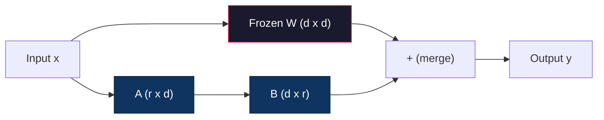
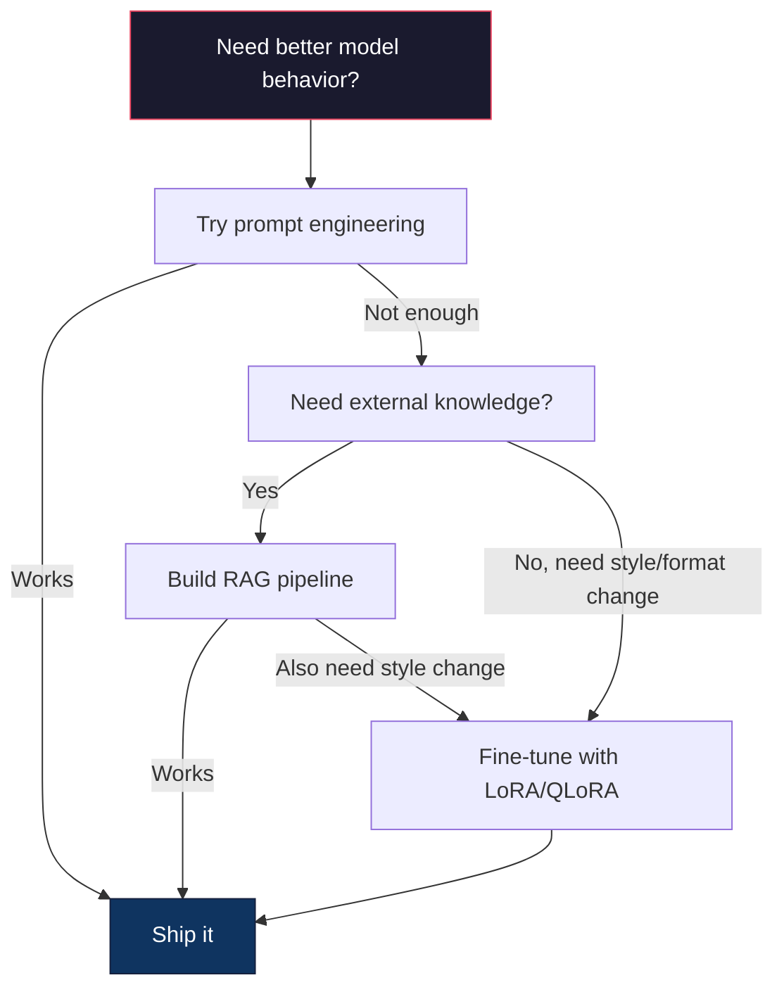

# Fine-Tuning với LoRA & QLoRA

> Đầy đủ fine-tuning một model 7B yêu cầu 56GB VRAM. Bạn không có điều đó. Hầu hết các công ty cũng vậy. LoRA cho phép bạn fine-tune cùng một model trong 6GB training ít hơn 1% parameters. Đây không phải là một sự thỏa hiệp - nó phù hợp với chất lượng đầy đủ fine-tuning trên hầu hết các tác vụ. Toàn bộ hệ sinh thái fine-tuning mã nguồn mở chạy trên một thủ thuật này.

**Loại:** Xây dựng
**Ngôn ngữ:** Python
**Kiến thức tiên quyết:** Giai đoạn 10, Bài 06 (Hướng dẫn điều chỉnh / SFT)
**Thời lượng:** ~75 phút
**Liên quan: **Giai đoạn 10 bao gồm các vòng lặp SFT/DPO từ đầu. Bài học này đưa những điều đó vào bộ công cụ PEFT 2026 (PEFT, TRL, Unsloth, Axolotl, LLaMA-Factory).

## Mục tiêu học tập

- Triển khai LoRA bằng cách chèn ma trận bộ điều hợp cấp thấp (A và B) vào các lớp attention của pretrained model
- Tính toán mức tiết kiệm parameter của LoRA so với fine-tuning đầy đủ: xếp hạng r với d_model chiều huấn luyện 2 * r * d parameters thay vì d ^ 2
- Fine-tune model sử dụng QLoRA (bộ điều hợp cơ sở lượng tử hóa + LoRA 4 bit) để phù hợp với bộ nhớ GPU tiêu dùng
- Merge LoRA cân trở lại model cơ sở để triển khai và so sánh tốc độ inference có và không có bộ điều hợp

## Vấn đề

Bạn có một model cơ sở. Llama 3 8B. Bạn muốn nó trả lời các yêu cầu hỗ trợ khách hàng bằng giọng nói của công ty bạn. SFT là câu trả lời. Nhưng SFT có vấn đề về chi phí.

Cập nhật đầy đủ fine-tuning mỗi parameter trong model. Llama 3 8B có 8 tỷ parameters. Trong fp16, mỗi parameter mất 2 byte. Đó là 16GB chỉ để tải trọng lượng. Trong quá trình training, bạn cũng cần gradients (16GB), optimizer trạng thái cho Adam (32GB cho động lượng + variance) và kích hoạt. Tổng cộng: khoảng 56GB VRAM cho một model 8B duy nhất.

Một chiếc A100 80GB hầu như không thể phù hợp với điều này. Hai chiếc A100 có giá $3-4/hour on cloud providers. Training for 3 epochs on 50,000 examples takes 6-10 hours. That's $30-40 cho mỗi thử nghiệm. Chạy 10 thử nghiệm để có được hyperparameters phù hợp và bạn đã chi 400 đô la trước khi triển khai bất cứ thứ gì.

Chia tỷ lệ này lên Llama 3 70B và các con số trở nên vô lý. 140GB chỉ cho trọng lượng. Bạn cần một cụm. $ 100 + mỗi thử nghiệm.

Có một vấn đề sâu sắc hơn. Full fine-tuning sửa đổi mọi trọng lượng trong model. Nếu bạn fine-tune dữ liệu hỗ trợ khách hàng, bạn có thể làm giảm khả năng chung của model. Nó được gọi là quên thảm họa. model trở nên tốt hơn trong nhiệm vụ của bạn và tồi tệ hơn ở mọi thứ khác.

Bạn cần một phương pháp huấn luyện ít parameters hơn, sử dụng ít bộ nhớ hơn và không phá hủy kiến thức hiện có của model.

## Khái niệm

### LoRA: Thích ứng cấp thấp

Edward Hu và các đồng nghiệp tại Microsoft đã xuất bản LoRA vào tháng 6 năm 2021. Thông tin chi tiết của bài báo: các bản cập nhật trọng lượng trong fine-tuning có thứ hạng nội tại thấp. Bạn không cần phải cập nhật tất cả 16,7 triệu parameters trong ma trận trọng lượng 4096x4096. Thông tin hữu ích trong bản cập nhật có thể được nắm bắt bằng ma trận xếp hạng 16 hoặc 32.

Đây là phép toán. Một lớp tuyến tính tiêu chuẩn tính toán:

```
y = Wx
```

Trong đó W là ma trận d_out x d_in. Đối với phép chiếu attention 4096x4096, đó là 16.777.216 parameters.

LoRA đóng băng W và thêm phân hủy cấp thấp:

```
y = Wx + BAx
```

Trong đó B là (d_out x r) và A là (r x d_in). Thứ hạng r nhỏ hơn nhiều so với d - thường là 8, 16 hoặc 32.

Đối với r = 16 trên lớp 4096x4096:
- parameters gốc: 4096 x 4096 = 16,777,216
- LoRA parameters: (4096 x 16) + (16 x 4096) = 65.536 + 65.536 = 131.072
- Mức giảm: 131.072 / 16.777.216 = 0,78%

Bạn đang training 0,78% parameters và nhận được 95-100% chất lượng.



A được khởi tạo bằng một Gaussian ngẫu nhiên. B được khởi tạo về không. Điều này có nghĩa là đóng góp LoRA bắt đầu từ số không - model bắt đầu training từ hành vi ban đầu của nó và dần dần học được sự thích nghi.

### Hệ số tỷ lệ: Alpha

LoRA giới thiệu alpha hệ số tỷ lệ kiểm soát mức độ ảnh hưởng của bản cập nhật xếp hạng thấp:

```
y = Wx + (alpha / r) * BAx
```

Khi alpha = r, tỷ lệ là 1x. Khi alpha = 2r (mặc định chung), tỷ lệ là 2x. hyperparameter này kiểm soát learning rate của đường dẫn LoRA độc lập với learning rate cơ sở.

Hướng dẫn thực tế:
- alpha = 2 * xếp hạng là một quy ước chung của cộng đồng (bài báo gốc được sử dụng alpha = xếp hạng trong hầu hết các thí nghiệm)
- alpha = xếp hạng cho tỷ lệ gấp 1x, bảo thủ nhưng ổn định
- Alpha cao hơn có nghĩa là các bản cập nhật lớn hơn trên mỗi bước, có thể tăng tốc độ hội tụ hoặc gây ra sự mất ổn định

### Nơi đăng ký LoRA

Một transformer có nhiều lớp tuyến tính. Bạn không cần phải thêm LoRA vào tất cả chúng. Bài báo gốc đã thử nghiệm các kết hợp khác nhau:

| Lớp mục tiêu | Tham số có thể huấn luyện (7B) | Chất lượng |
|--------------|----------------------|---------|
| Chỉ q_proj | 4,7 triệu | Tốt |
| q_proj + v_proj | 9,4 triệu | Tốt hơn |
| q_proj + k_proj + v_proj + o_proj | 18,9 triệu | Tốt nhất cho attention |
| Tất cả tuyến tính (attention + MLP) | 37,7 triệu | Tăng biên, tham số 2x |

Điểm ngọt ngào cho hầu hết các tác vụ: q_proj + v_proj. Điều này nhắm mục tiêu truy vấn và dự báo giá trị trong self-attention, kiểm soát những gì model tham gia và thông tin mà nó trích xuất. Thêm các lớp MLP giúp thực hiện các tác vụ phức tạp như tạo mã nhưng tăng gấp đôi số lượng parameter để giảm lợi nhuận cho các tác vụ đơn giản hơn.

### Lựa chọn thứ hạng

Hạng r kiểm soát tính biểu cảm của sự thích ứng:

| Cấp | Tham số có thể huấn luyện (mỗi lớp) | Tốt nhất cho |
|------|---------------------------|----------|
| 4 | 32,768 | Phân loại, tình cảm đơn giản |
| 8 | 65,536 | Hỏi & đáp một miền, tóm tắt |
| 16 | 131,072 | Nhiệm vụ đa miền, hướng dẫn theo |
| 32 | 262,144 | Lý luận phức tạp, tạo mã |
| 64 | 524,288 | Lợi nhuận giảm dần cho hầu hết các nhiệm vụ |
| 128 | 1,048,576 | Hiếm khi hợp lý |

Hu và cộng sự đã chỉ ra rằng r = 4 đã nắm bắt được hầu hết sự thích nghi cho các nhiệm vụ đơn giản. r = 8 và r = 16 là những lựa chọn phổ biến nhất trong thực tế. Vượt quá r = 64 hiếm khi cải thiện chất lượng và bắt đầu mất lợi thế trí nhớ của LoRA.

### QLoRA: Quantization 4 bit + LoRA

Tim Dettmers và các đồng nghiệp tại Đại học Washington đã xuất bản QLoRA vào tháng 5 năm 2023. Ý tưởng: lượng tử hóa model cơ sở đóng băng thành precision 4-bit, sau đó gắn LoRA bộ điều hợp trong fp16 ở trên cùng.

Điều này thay đổi đáng kể phương trình bộ nhớ:

| Phương pháp | Bộ nhớ trọng lượng (7B) | Bộ nhớ Training (7B) | GPU Bắt buộc |
|--------|-------------------|---------------------|-------------|
| fine-tune đầy đủ (fp16) | 14GB | ~56GB | 1x A100 80GB |
| LoRA (cơ sở FP16) | 14GB | ~18GB | 1x A100 40GB |
| QLoRA (cơ sở 4 bit) | 3,5 GB | ~6GB | 1x RTX 3090 24GB |

QLoRA có ba đóng góp kỹ thuật:

**NF4 (Normal Float 4-bit)**: Một kiểu dữ liệu mới được thiết kế đặc biệt cho trọng số mạng nơ-ron. Trọng số mạng nơ-ron tuân theo phân phối gần như chuẩn. NF4 đặt 16 mức quantization của nó ở các lượng tử của phân phối chuẩn chuẩn. Đây là thông tin tối ưu về mặt lý thuyết cho dữ liệu phân phối bình thường. Nó mất ít thông tin hơn so với quantization 4-bit đồng nhất (INT4) hoặc Float4 tiêu chuẩn.

**Double quantization**: Bản thân các hằng số quantization lấy bộ nhớ. Mỗi khối gồm 64 trọng lượng cần hệ số tỷ lệ fp32 (4 byte). Đối với model 7B, đó là thêm 0.4GB. Double quantization lượng tử hóa các hằng số này thành fp8, giảm chi phí xuống còn 0.1GB. Nhỏ nhưng nó cộng lại.

**optimizers phân trang**: Trong quá trình training, các trạng thái optimizer (động lượng và variance của Adam) có thể vượt quá bộ nhớ GPU trên các chuỗi dài. Phân trang optimizers sử dụng bộ nhớ hợp nhất của NVIDIA để tự động phân trang trạng thái optimizer để CPU RAM khi bộ nhớ GPU cạn kiệt và phân trang lại khi cần. Điều này ngăn chặn sự cố OOM với chi phí của một số thông lượng.

### Câu hỏi về chất lượng

Giảm parameters hoặc lượng tử hóa cơ sở có ảnh hưởng đến chất lượng không? Kết quả từ nhiều bài báo:

| Phương pháp | MMLU (5 ảnh) | MT-Băng ghế | Đánh giá con người |
|--------|--------------|----------|-----------|
| fine-tune đầy đủ (Llama 2 7B) | 48.3 | 6.72 | 14.6 |
| LoRA r = 16 | 47.9 | 6.68 | 14.0 |
| QLoRA r = 16 (NF4) | 47.5 | 6.61 | 13.4 |
| QLoRA r = 64 (NF4) | 48.1 | 6.70 | 14.2 |

LoRA ở r = 16 nằm trong khoảng 1% của fine-tuning đầy trên hầu hết benchmarks. QLoRA ở r = 16 mất một phần phần trăm khác. QLoRA ở r = 64 về cơ bản khớp với fine-tuning đầy đủ trong khi sử dụng ít bộ nhớ hơn 90%.

### Chi phí trong thế giới thực

Fine-tuning Llama 3 8B trên 50.000 ví dụ (3 epochs):

| Phương pháp | GPU | Thời gian | Phí Tổn |
|--------|-----|------|------|
| fine-tune đầy đủ | 2x A100 80GB | 8 giờ | ~$32 |
| LoRA r = 16 | 1x A100 40GB | 4 giờ | ~$8 |
| QLoRA r = 16 | 1x RTX 4090 24GB | 6 giờ | ~$5 |
| QLoRA r = 16 (Không lười) | 1x RTX 4090 24GB | 2.5 giờ | ~$2 |
| QLoRA r = 16 | 1x T4 16GB | 12 giờ | ~$4 |

QLoRA trên một GPU tiêu dùng duy nhất có giá thấp hơn một bữa trưa. Đây là lý do tại sao cộng đồng fine-tuning trọng lượng mở bùng nổ vào năm 2023 và tại sao mọi training framework dưới ships QLoRA mặc định vào năm 2026.

### The 2026 PEFT stack

| Framework | Nó là gì | Chọn thời điểm |
|-----------|-----------|-----------|
| **Hugging Face PEFT** | Thư viện LoRA/QLoRA/DoRA/IA3 chuẩn | Bạn muốn kiểm soát thô và vòng lặp training của bạn đã được `transformers.Trainer` |
| **TRL** | Huấn luyện viên tăng cường từ phản hồi của HF (SFT, DPO, GRPO, PPO, ORPO) | Bạn cần DPO/GRPO sau SFT; được xây dựng trên PEFT |
| **Không lười biếng** | Viết lại hạt nhân Triton của forward/backward pass | Bạn muốn tăng tốc gấp 2-5 lần + một nửa VRAM mà không cần accuracy loss; Llama/Mistral/Qwen gia đình |
| **Axolotl** | YAML-config wrapper qua PEFT + TRL + DeepSpeed + Unsloth | Bạn muốn chạy training có thể tái tạo, kiểm soát phiên bản |
| **LLaMA-Nhà máy** | GUI/CLI/API qua PEFT + TRL | Bạn muốn fine-tuning không mã; 100+ model họ được hỗ trợ |
| **Đuốc **| Công thức nấu ăn PyTorch bản địa, không có `transformers` dep | Bạn muốn deps tối thiểu và tổ chức của bạn đã chuẩn hóa trên PyTorch |

Quy tắc ngón tay cái: sử dụng nghiên cứu hoặc thử nghiệm một lần → PEFT. Có thể lặp lại production pipeline → Axolotl với các hạt Unsloth được bật. Tạo mẫu vứt đi → LLaMA-Factory.

### Hợp nhất bộ điều hợp

Sau training, bạn có hai thứ: model đế đóng băng và bộ chuyển đổi LoRA nhỏ (thường là 10-100MB). Bạn có thể:

1. **Giữ chúng riêng biệt**: Tải model cơ sở, tải bộ điều hợp lên trên. Hoán đổi bộ điều hợp cho các tác vụ khác nhau. Đây là cách bạn phục vụ nhiều biến thể fine-tuned từ một model cơ sở.

2. **Merge chúng vĩnh viễn**: Tính toán W' = W + (alpha/r) * BA và lưu kết quả dưới dạng model đầy đủ mới. merged model có cùng kích thước với bản gốc. Không inference chi phí. Không có bộ chuyển đổi để quản lý.

Để phục vụ nhiều tác vụ (bộ chuyển đổi hỗ trợ khách hàng, bộ điều hợp mã, bộ điều hợp dịch), hãy giữ chúng riêng biệt. Để triển khai một model chuyên dụng duy nhất, merge.

Các kỹ thuật hợp nhất nâng cao để kết hợp nhiều bộ điều hợp:

- **TIES-Merging** (Yadav et al. 2023): Cắt bớt parameters có độ lớn nhỏ, giải quyết xung đột ký hiệu, sau đó merges. Giảm nhiễu giữa các bộ điều hợp.
- **DARE** (Yu et al. 2023): Thả ngẫu nhiên bộ điều hợp parameters trước khi hợp nhất và thay đổi tỷ lệ rest. Hiệu quả đáng ngạc nhiên trong việc kết hợp các khả năng.
- **Số học nhiệm vụ**: Chỉ cần thêm hoặc trừ trọng số bộ điều hợp. Thêm bộ điều hợp "mã" và bộ điều hợp "toán học" thường tạo ra một model tốt ở cả hai.

### Khi nào KHÔNG Fine-Tune

Fine-tuning là lựa chọn thứ ba, không phải là lựa chọn đầu tiên.

**Đầu tiên: prompt kỹ thuật.** Viết một system prompt tốt hơn. Thêm few-shot ví dụ. Sử dụng chain-of-thought. Điều này không tốn kém và mất vài phút. Nếu prompting giúp bạn đạt được 80% chặng đường, có lẽ bạn không cần phải fine-tune.

**Thứ hai: RAG.** Nếu model cần biết về dữ liệu cụ thể của bạn (tài liệu, cơ sở tri thức, danh mục sản phẩm), việc truy xuất sẽ rẻ hơn và dễ bảo trì hơn so với việc nướng nó thành trọng lượng. Xem Bài 06.

**Thứ ba: fine-tuning.** Sử dụng điều này khi bạn cần model áp dụng một phong cách, định dạng hoặc mẫu lý luận cụ thể mà không thể đạt được thông qua prompting. Khi bạn cần đầu ra có cấu trúc nhất quán. Khi bạn cần chắt lọc một model lớn hơn thành một  nhỏ hơn. Khi độ trễ quan trọng và bạn không đủ khả năng chi trả thêm tokens từ few-shot prompting.



```figure
lora-params
```

## Tự xây dựng

Chúng ta triển khai LoRA từ đầu trong PyTorch thuần túy. Không có thư viện. Không có phép thuật. Bạn sẽ xây dựng lớp LoRA, đưa nó vào một model, huấn luyện nó và merge các trọng lượng trở lại.

### Bước 1: Lớp LoRA

```python
import torch
import torch.nn as nn
import math

class LoRALayer(nn.Module):
    def __init__(self, in_features, out_features, rank=8, alpha=16):
        super().__init__()
        self.rank = rank
        self.alpha = alpha
        self.scaling = alpha / rank

        self.A = nn.Parameter(torch.randn(in_features, rank) * (1 / math.sqrt(rank)))
        self.B = nn.Parameter(torch.zeros(rank, out_features))

    def forward(self, x):
        return (x @ self.A @ self.B) * self.scaling
```

A được khởi tạo với các giá trị ngẫu nhiên được chia tỷ lệ. B được khởi tạo về không. Sản phẩm BA bắt đầu từ không, vì vậy model bắt đầu với hành vi ban đầu của nó.

### Bước 2: Lớp tuyến tính bọc LoRA

```python
class LinearWithLoRA(nn.Module):
    def __init__(self, linear, rank=8, alpha=16):
        super().__init__()
        self.linear = linear
        self.lora = LoRALayer(
            linear.in_features, linear.out_features, rank, alpha
        )

        for param in self.linear.parameters():
            param.requires_grad = False

    def forward(self, x):
        return self.linear(x) + self.lora(x)
```

Lớp tuyến tính ban đầu bị đóng băng. Chỉ có LoRA parameters (A và B) mới có thể huấn luyện được.

### Bước 3: Tiêm LoRA vào Model

```python
def inject_lora(model, target_modules, rank=8, alpha=16):
    for param in model.parameters():
        param.requires_grad = False

    lora_layers = {}
    for name, module in model.named_modules():
        if isinstance(module, nn.Linear):
            if any(t in name for t in target_modules):
                parent_name = ".".join(name.split(".")[:-1])
                child_name = name.split(".")[-1]
                parent = dict(model.named_modules())[parent_name]
                lora_linear = LinearWithLoRA(module, rank, alpha)
                setattr(parent, child_name, lora_linear)
                lora_layers[name] = lora_linear
    return lora_layers
```

Đầu tiên, đóng băng mọi parameter trong model. Sau đó, đi theo cây model, tìm các lớp tuyến tính phù hợp với tên mục tiêu của bạn và thay thế chúng bằng các phiên bản bọc LoRA. Ma trận LoRA A và B là parameters duy nhất có thể huấn luyện trong toàn bộ model.

### Bước 4: Đếm Parameters

```python
def count_parameters(model):
    total = sum(p.numel() for p in model.parameters())
    trainable = sum(p.numel() for p in model.parameters() if p.requires_grad)
    frozen = total - trainable
    return {
        "total": total,
        "trainable": trainable,
        "frozen": frozen,
        "trainable_pct": 100 * trainable / total if total > 0 else 0
    }
```

### Bước 5: Merge tạ trở lại

```python
def merge_lora_weights(model):
    for name, module in model.named_modules():
        if isinstance(module, LinearWithLoRA):
            with torch.no_grad():
                merged = (
                    module.lora.A @ module.lora.B
                ) * module.lora.scaling
                module.linear.weight.data += merged.T
            parent_name = ".".join(name.split(".")[:-1])
            child_name = name.split(".")[-1]
            if parent_name:
                parent = dict(model.named_modules())[parent_name]
            else:
                parent = model
            setattr(parent, child_name, module.linear)
```

Sau khi hợp nhất, các lớp LoRA biến mất. Các model có cùng kích thước với bản gốc với sự thích nghi được nướng vào trọng lượng. Không có inference trên cao.

### Bước 6: Mô phỏng QLoRA Quantization

```python
def quantize_to_nf4(tensor, block_size=64):
    blocks = tensor.reshape(-1, block_size)
    scales = blocks.abs().max(dim=1, keepdim=True).values / 7.0
    scales = torch.clamp(scales, min=1e-8)
    quantized = torch.round(blocks / scales).clamp(-8, 7).to(torch.int8)
    return quantized, scales

def dequantize_from_nf4(quantized, scales, original_shape):
    dequantized = quantized.float() * scales
    return dequantized.reshape(original_shape)
```

Điều này mô phỏng quantization 4 bit bằng cách ánh xạ trọng số thành 16 mức riêng biệt trong các khối 64. Production QLoRA sử dụng thư viện bitsandbytes cho NF4 thực sự trên GPU.

### Bước 7: Training vòng lặp

```python
def train_lora(model, data, epochs=5, lr=1e-3, batch_size=4):
    optimizer = torch.optim.AdamW(
        [p for p in model.parameters() if p.requires_grad], lr=lr
    )
    criterion = nn.MSELoss()

    losses = []
    for epoch in range(epochs):
        epoch_loss = 0.0
        n_batches = 0
        indices = torch.randperm(len(data["inputs"]))

        for i in range(0, len(indices), batch_size):
            batch_idx = indices[i:i + batch_size]
            x = data["inputs"][batch_idx]
            y = data["targets"][batch_idx]

            output = model(x)
            loss = criterion(output, y)

            optimizer.zero_grad()
            loss.backward()
            optimizer.step()

            epoch_loss += loss.item()
            n_batches += 1

        avg_loss = epoch_loss / n_batches
        losses.append(avg_loss)

    return losses
```

### Bước 8: Demo đầy đủ

```python
def demo():
    torch.manual_seed(42)
    d_model = 256
    n_classes = 10

    model = nn.Sequential(
        nn.Linear(d_model, 512),
        nn.ReLU(),
        nn.Linear(512, 512),
        nn.ReLU(),
        nn.Linear(512, n_classes),
    )

    n_samples = 500
    x = torch.randn(n_samples, d_model)
    y = torch.randint(0, n_classes, (n_samples,))
    y_onehot = torch.zeros(n_samples, n_classes).scatter_(1, y.unsqueeze(1), 1.0)

    data = {"inputs": x, "targets": y_onehot}

    params_before = count_parameters(model)

    lora_layers = inject_lora(
        model, target_modules=["0", "2"], rank=8, alpha=16
    )

    params_after = count_parameters(model)

    losses = train_lora(model, data, epochs=20, lr=1e-3)

    merge_lora_weights(model)
    params_merged = count_parameters(model)

    return {
        "params_before": params_before,
        "params_after": params_after,
        "params_merged": params_merged,
        "losses": losses,
    }
```

Bản demo tạo ra một model nhỏ, đưa LoRA vào hai lớp, huấn luyện nó và merges trọng số trở lại. Số lượng parameter giảm từ có thể huấn luyện đầy đủ xuống ~1% có thể huấn luyện trong quá trình LoRA training, sau đó trở lại kiến trúc ban đầu sau khi hợp nhất.

## Ứng dụng

Với hệ sinh thái Hugging Face, LoRA trên một model thực mất khoảng 20 dòng:

```python
from transformers import AutoModelForCausalLM, AutoTokenizer
from peft import LoraConfig, get_peft_model, TaskType

model = AutoModelForCausalLM.from_pretrained("meta-llama/Llama-3.1-8B")
tokenizer = AutoTokenizer.from_pretrained("meta-llama/Llama-3.1-8B")

lora_config = LoraConfig(
    task_type=TaskType.CAUSAL_LM,
    r=16,
    lora_alpha=32,
    lora_dropout=0.05,
    target_modules=["q_proj", "v_proj"],
)

model = get_peft_model(model, lora_config)
model.print_trainable_parameters()
```

Đối với QLoRA, hãy thêm bitsandbyte quantization:

```python
from transformers import BitsAndBytesConfig

bnb_config = BitsAndBytesConfig(
    load_in_4bit=True,
    bnb_4bit_quant_type="nf4",
    bnb_4bit_compute_dtype=torch.bfloat16,
    bnb_4bit_use_double_quant=True,
)

model = AutoModelForCausalLM.from_pretrained(
    "meta-llama/Llama-3.1-8B",
    quantization_config=bnb_config,
    device_map="auto",
)

model = get_peft_model(model, lora_config)
```

Đó là nó. Cùng một vòng lặp training. Cùng một pipeline dữ liệu. Các model cơ sở hiện nằm trong 4-bit, bộ điều hợp LoRA huấn luyện trong fp16 và toàn bộ đều nằm trong 6GB.

Để training với Hugging Face Trainer:

```python
from transformers import TrainingArguments, Trainer
from datasets import load_dataset

dataset = load_dataset("tatsu-lab/alpaca", split="train[:5000]")

training_args = TrainingArguments(
    output_dir="./lora-llama",
    num_train_epochs=3,
    per_device_train_batch_size=4,
    gradient_accumulation_steps=4,
    learning_rate=2e-4,
    fp16=True,
    logging_steps=10,
    save_strategy="epoch",
    optim="paged_adamw_8bit",
)

trainer = Trainer(
    model=model,
    args=training_args,
    train_dataset=dataset,
)

trainer.train()

model.save_pretrained("./lora-adapter")
```

Bộ điều hợp đã lưu là 10-100MB. Cơ model vẫn không bị ảnh hưởng. Bạn có thể chia sẻ bộ điều hợp trên Hugging Face Hub mà không cần phân phối lại toàn bộ model.

## Sản phẩm bàn giao

Bài học này tạo ra:
- `outputs/prompt-lora-advisor.md` -- một prompt giúp bạn quyết định xếp hạng, mô-đun mục tiêu và hyperparameters LoRA cho nhiệm vụ cụ thể của mình
- `outputs/skill-fine-tuning-guide.md` - một skill dạy agents cây quyết định về thời điểm và cách thức fine-tune

## Bài tập

1. **Nghiên cứu cắt bỏ thứ hạng.** Chạy bản demo với các hạng 2, 4, 8, 16, 32 và 64. Vẽ loss cuối cùng so với xếp hạng. Tìm điểm lợi nhuận giảm dần trong đó tăng gấp đôi thứ hạng không còn làm giảm một nửa loss. Đối với một nhiệm vụ phân loại đơn giản trên features 256 mờ, điều này phải vào khoảng r = 8-16.

2. **So sánh mô-đun mục tiêu.** Sửa đổi inject_lora để chỉ nhắm mục tiêu lớp "0", chỉ lớp "2", chỉ lớp "4" và cả ba. Huấn luyện mỗi biến thể trong 20 epochs. So sánh tốc độ hội tụ và loss cuối cùng. Điều này phản ánh quyết định thực sự của việc nhắm mục tiêu q_proj so với v_proj so với tất cả các lớp tuyến tính.

3. **Quantization phân tích lỗi. **Lấy ma trận trọng lượng của model được huấn luyện trước và sau quantize_to_nf4 / dequantize_from_nf4. Tính toán sai số bình phương trung bình, sai số tuyệt đối tối đa và mối tương quan giữa trọng số ban đầu và trọng số được tái tạo. Thử nghiệm với các giá trị block_size là 32, 64, 128 và 256.

4. **Phục vụ nhiều bộ điều hợp.** Huấn luyện hai bộ điều hợp LoRA trên các tập hợp con dữ liệu khác nhau (chỉ số chẵn so với chỉ số lẻ). Lưu cả hai bộ điều hợp. Tải model cơ sở một lần, sau đó hoán đổi bộ điều hợp và xác minh rằng mỗi bộ điều hợp tạo ra các đầu ra khác nhau trên cùng một đầu vào. Đây là cách các hệ thống production phục vụ nhiều fine-tuned models từ một cơ sở.

5. **Merge so với inference chưa hợp nhất. **So sánh đầu ra của LoRA model trước và sau merge_lora_weights trên cùng 100 đầu vào. Xác minh các đầu ra giống hệt nhau (trong dung sai dấu phẩy động 1e-5). Sau đó, benchmark inference tốc độ cho cả hai -- merged sẽ nhanh hơn một chút vì đó là một ma trận duy nhất nhân thay vì hai.

## Thuật ngữ chính

| Thuật ngữ | Những gì mọi người nói | Ý nghĩa thực sự của nó |
|------|----------------|----------------------|
| LoRA | "fine-tuning hiệu quả" | Thích ứng cấp thấp: đóng băng trọng lượng cơ bản, huấn luyện hai ma trận nhỏ A và B có sản phẩm xấp xỉ cập nhật trọng lượng đầy đủ |
| QLoRA | "Fine-tune trên máy tính xách tay" | LoRA lượng tử: tải model cơ sở ở NF4 4-bit, huấn luyện bộ điều hợp LoRA trong fp16 ở trên cùng, cho phép 7B fine-tuning trong 6GB VRAM |
| Cấp (r) | "Các model có thể học được bao nhiêu" | Kích thước bên trong của ma trận A và B; kiểm soát khả năng biểu cảm so với số lượng parameter |
| Alpha | "LoRA learning rate" | Hệ số tỷ lệ áp dụng cho đầu ra LoRA; alpha/r chia tỷ lệ đóng góp của bản thích ứng vào đầu ra cuối cùng |
| NF4 | "quantization 4 bit" | Normal Float 4: kiểu dữ liệu 4 bit với các mức quantization ở các lượng tử phân phối chuẩn, tối ưu cho trọng số mạng nơ-ron |
| Bộ chuyển đổi | "Phần nhỏ được huấn luyện" | Ma trận LoRA A và B được lưu dưới dạng một tệp riêng biệt (10-100MB), có thể tải lên trên bất kỳ bản sao nào của model cơ sở |
| Mô-đun mục tiêu | "Lớp nào để LoRA" | Các lớp tuyến tính cụ thể (q_proj, v_proj, v.v.) nơi các bộ điều hợp LoRA được đưa vào |
| Hợp nhất | "Nướng nó vào" | Tính toán W + (alpha/r) * BA và thay thế trọng lượng ban đầu, loại bỏ chi phí bộ chuyển đổi ở inference |
| Trang optimizers | "Đừng OOM trong khi training" | Giảm tải trạng thái optimizer (Adam động lượng, variance) CPU khi bộ nhớ GPU cạn kiệt |
| Quên thảm khốc | "Fine-tuning đã phá vỡ mọi thứ khác" | Khi cập nhật tất cả các trọng lượng khiến model mất khả năng đã học trước đó |

## Đọc thêm

- Hu và cộng sự, "LoRA: Thích ứng cấp thấp của ngôn ngữ lớn Models" (2021) -- bài báo gốc giới thiệu phương pháp phân rã cấp thấp, được thử nghiệm trên GPT-3 175B với thứ hạng thấp nhất là 4
- Dettmers và cộng sự, "QLoRA: Tinh chỉnh hiệu quả ngôn ngữ lượng tử hóa Models" (2023) - giới thiệu NF4, quantization kép và optimizers phân trang, cho phép fine-tuning 65B trên một GPU 48GB duy nhất
- Tài liệu thư viện PEFT (huggingface.co/docs/peft) -- thư viện tiêu chuẩn cho các phương pháp LoRA, QLoRA và các phương pháp hiệu quả parameter khác trong hệ sinh thái Hugging Face
- Yadav và cộng sự, "Hợp nhất TIES: Giải quyết nhiễu khi hợp nhất Models" (2023) - kỹ thuật kết hợp nhiều bộ điều hợp LoRA mà không làm giảm chất lượng
- [Rafailov et al., "Direct Preference Optimization: Your Language Model is Secretly a Reward Model" (NeurIPS 2023)](https://arxiv.org/abs/2305.18290) -- dẫn xuất DPO; giai đoạn điều chỉnh sở thích sau SFT, không cần phần thưởng model.
- [TRL documentation](https://huggingface.co/docs/trl/) -- tham chiếu chính thức cho `SFTTrainer`, `DPOTrainer`, `KTOTrainer` và bề mặt tích hợp với PEFT/bitsandbytes/Unsloth.
- [Unsloth documentation](https://docs.unsloth.ai/) -- các hạt nhân hợp nhất giúp tăng gấp đôi thông lượng fine-tuning và giảm một nửa bộ nhớ; lớp hiệu suất trong TRL.
- [Axolotl documentation](https://axolotl-ai-cloud.github.io/axolotl/) -- huấn luyện viên đa GPU SFT/DPO/QLoRA được cấu hình YAML; giải pháp thay thế config dưới dạng mã cho scripts viết tay.
