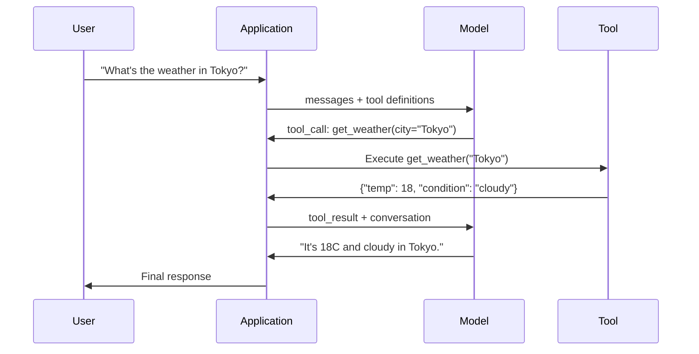

# Function Calling và sử dụng công cụ

> LLMs không thể làm bất cứ điều gì. Họ tạo ra văn bản. Đó là toàn bộ khả năng. Họ không thể kiểm tra thời tiết, truy vấn cơ sở dữ liệu, gửi email, chạy mã hoặc đọc tệp. Mỗi "AI agent" bạn từng thấy là một JSON tạo LLM cho biết chức năng nào sẽ gọi - và sau đó mã của bạn thực sự gọi nó. model là bộ não. Công cụ là bàn tay. Function calling là hệ thống thần kinh kết nối chúng.

**Loại:** Xây dựng
**Ngôn ngữ:** Python
**Kiến thức tiên quyết:** Giai đoạn 11 Bài 03 (Đầu ra có cấu trúc)
**Thời lượng:** ~75 phút
**Liên quan:** Giai đoạn 11 · 14 (Model Giao thức ngữ cảnh) — khi một công cụ được chia sẻ giữa các máy chủ, chuyển từ gọi hàm nội tuyến sang MCP server. Bài học này bao gồm trường hợp nội tuyến; MCP bao gồm trường hợp giao thức.

## Mục tiêu học tập

- Triển khai vòng lặp function calling: xác định schemas công cụ, phân tích cú pháp JSON gọi công cụ của model, thực thi các hàm và trả về kết quả
- Công cụ thiết kế schemas với mô tả rõ ràng và parameters nhập mà model có thể gọi một cách đáng tin cậy
- Xây dựng vòng lặp agent nhiều lượt chuỗi nhiều lệnh gọi hàm để trả lời các truy vấn phức tạp
- Xử lý các trường hợp function calling biên: lệnh gọi công cụ song song, lan truyền lỗi và ngăn chặn vòng lặp công cụ vô hạn

## Vấn đề

Bạn xây dựng một chatbot. Một người dùng hỏi: "Thời tiết ở Tokyo bây giờ như thế nào?"

Người model trả lời: "Tôi không có quyền truy cập vào dữ liệu thời tiết theo thời gian thực, nhưng dựa trên mùa, Tokyo có thể vào khoảng 15 độ C..."

Đó là ảo giác được khoác lên mình tuyên bố từ chối trách nhiệm. Người model không biết thời tiết. Nó sẽ không bao giờ. Thời tiết thay đổi mỗi giờ. Dữ liệu training của model đã được nhiều tháng tuổi.

Câu trả lời đúng yêu cầu gọi OpenWeatherMap API, lấy temperature hiện tại và trả về số thực. model không thể gọi APIs. Mã của bạn có thể. Phần còn thiếu: một giao thức có cấu trúc cho phép model nói "Tôi cần gọi thời tiết API với các đối số này" và cho phép mã của bạn thực thi nó và cung cấp lại kết quả.

Đây là function calling. Đầu ra model có cấu trúc JSON mô tả hàm nào sẽ gọi với đối số nào. Ứng dụng của bạn thực thi hàm. Kết quả quay trở lại cuộc trò chuyện. model sử dụng kết quả để tạo ra câu trả lời cuối cùng.

Không có function calling, LLMs là bách khoa toàn thư. Với nó, họ trở nên agents.

## Khái niệm

### Vòng lặp Function Calling

Mọi tương tác sử dụng công cụ đều tuân theo cùng một vòng lặp 5 bước.



Bước 1: người dùng gửi tin nhắn. Bước 2: model nhận tin nhắn cùng với định nghĩa công cụ (JSON Schema mô tả các chức năng có sẵn). Bước 3: thay vì trả lời bằng văn bản, model xuất ra một lệnh gọi công cụ -- một đối tượng JSON có cấu trúc với tên hàm và đối số. Bước 4: mã của bạn thực thi hàm và nắm bắt kết quả. Bước 5: kết quả quay trở lại model, bây giờ có dữ liệu thực để tạo ra câu trả lời cuối cùng.

model không bao giờ thực thi bất cứ thứ gì. Nó chỉ quyết định gọi gì và với đối số nào. Mã của bạn là trình thực thi.

### Định nghĩa công cụ: Hợp đồng JSON Schema

Mỗi công cụ được xác định bởi một JSON Schema cho model biết hàm làm gì, đối số nào và các đối số đó phải là loại nào.

```json
{
  "type": "function",
  "function": {
    "name": "get_weather",
    "description": "Get current weather for a city. Returns temperature in Celsius and conditions.",
    "parameters": {
      "type": "object",
      "properties": {
        "city": {
          "type": "string",
          "description": "City name, e.g. 'Tokyo' or 'San Francisco'"
        },
        "units": {
          "type": "string",
          "enum": ["celsius", "fahrenheit"],
          "description": "Temperature units"
        }
      },
      "required": ["city"]
    }
  }
}
```

Các trường `description` rất quan trọng. model đọc chúng để quyết định thời điểm và cách sử dụng công cụ. Mô tả mơ hồ như "nhận được thời tiết" tạo ra lựa chọn công cụ kém hơn so với "Nhận thời tiết hiện tại cho một thành phố. Trả về temperature bằng độ C và điều kiện." Mô tả là một prompt để lựa chọn công cụ.

### So sánh nhà cung cấp

Mọi nhà cung cấp lớn đều hỗ trợ function calling, nhưng bề mặt API khác nhau.

| Nhà cung cấp | API Parameter | Định dạng cuộc gọi công cụ | Cuộc gọi song song | Cuộc gọi bắt buộc |
|----------|--------------|-----------------|---------------|----------------|
| OpenAI (GPT-5, o4) | `tools` | `tool_calls[].function` | Có (nhiều lần mỗi lượt) | `tool_choice="required"` |
| Anthropic (Claude 4.6/4.7) | `tools` | `content[].type="tool_use"` | Có (nhiều khối) | `tool_choice={"type":"any"}` |
| Google (Gemini 3) | `function_declarations` | `functionCall` | Có | `function_calling_config` |
| Trọng lượng mở (Llama 4, Qwen3, DeepSeek-V3) | Native `tools` trên Llama 4; Hermes hoặc ChatML trên những người khác | Hỗn hợp | Phụ thuộc Model | Dựa trên Prompt hoặc `tool_choice` nếu được hỗ trợ |

Đến năm 2026, ba nhà cung cấp đóng đã hội tụ trên các định dạng dựa trên JSON-Schema gần giống hệt nhau. Llama 4 ships với trường `tools` gốc phù hợp với hình dạng của OpenAI. Các tinh chỉnh trọng lượng mở vẫn khác nhau - định dạng Hermes (NousResearch) là phổ biến nhất cho các tinh chỉnh của bên thứ ba. Đối với các công cụ được chia sẻ giữa các máy chủ, hãy ưu tiên MCP (Giai đoạn 11 · 14) hơn gọi hàm nội tuyến - server giống nhau cho tất cả chúng.

### Lựa chọn công cụ: Tự động, Bắt buộc, Cụ thể

Bạn kiểm soát thời điểm model sử dụng công cụ.

**Tự động** (mặc định): model quyết định gọi công cụ hay phản hồi trực tiếp. "2+2 là gì?" -- trả lời trực tiếp. "Thời tiết thế nào?" -- gọi công cụ.

**Bắt buộc**: model phải gọi ít nhất một công cụ. Sử dụng tùy chọn này khi bạn biết ý định của người dùng yêu cầu một công cụ. Ngăn model đoán thay vì tra cứu dữ liệu thực.

**Chức năng cụ thể**: buộc model gọi một hàm cụ thể. `tool_choice={"type":"function", "function": {"name": "get_weather"}}` đảm bảo công cụ thời tiết được gọi, bất kể truy vấn là gì. Sử dụng công cụ này để định tuyến -- khi logic ngược dòng đã xác định công cụ nào là cần thiết.

### Function Calling song song

GPT-4o và Claude có thể gọi nhiều hàm trong một lượt. Một người dùng hỏi: "Thời tiết ở Tokyo và New York như thế nào?" model xuất ra hai lệnh gọi công cụ đồng thời:

```json
[
  {"name": "get_weather", "arguments": {"city": "Tokyo"}},
  {"name": "get_weather", "arguments": {"city": "New York"}}
]
```

Mã của bạn thực thi cả hai (lý tưởng nhất là đồng thời), trả về cả hai kết quả và model tổng hợp một phản hồi duy nhất. Thao tác này sẽ cắt giảm các chuyến đi khứ hồi từ 2 xuống 1. Đối với agents có 5-10 lệnh gọi công cụ cho mỗi truy vấn, tính năng gọi song song giúp giảm độ trễ từ 60-80%.

### Đầu ra có cấu trúc so với Function Calling

Bài 03 đề cập đến các đầu ra có cấu trúc. Function calling sử dụng cùng một JSON Schema máy móc, nhưng cho một mục đích khác.

**Đầu ra có cấu trúc**: buộc model tạo dữ liệu theo hình dạng cụ thể. Đầu ra là sản phẩm cuối cùng. Ví dụ: trích xuất thông tin sản phẩm từ văn bản dưới dạng `{name, price, in_stock}`.

**Function calling**: model khai báo ý định thực hiện một hành động. Đầu ra là một bước trung gian. Ví dụ: `get_weather(city="Tokyo")` -- model đang yêu cầu một hành động, không tạo ra câu trả lời cuối cùng.

Sử dụng đầu ra có cấu trúc khi bạn muốn trích xuất dữ liệu. Sử dụng function calling khi bạn muốn model tương tác với các hệ thống bên ngoài.

### Bảo mật: Các quy tắc không thể thương lượng

Function calling là khả năng nguy hiểm nhất mà bạn có thể đưa ra LLM. model chọn những gì để thực thi. Nếu bộ công cụ của bạn bao gồm các truy vấn cơ sở dữ liệu, model sẽ xây dựng các truy vấn. Nếu nó bao gồm các lệnh shell, model sẽ ghi chúng.

**Quy tắc 1: Không bao giờ chuyển SQL do model tạo trực tiếp vào cơ sở dữ liệu.** model có thể và sẽ tạo DROP TABLE, UNION chèn hoặc truy vấn trả về mỗi hàng. Luôn tham số hóa. Luôn xác thực. Luôn sử dụng danh sách cho phép các hoạt động.

**Quy tắc 2: Đưa các hàm vào danh sách cho phép.** model chỉ có thể gọi các hàm mà bạn xác định rõ ràng. Không bao giờ xây dựng một công cụ chung chung "thực thi bất kỳ hàm nào theo tên". Nếu bạn có 50 hàm nội bộ, chỉ hiển thị 5 hàm mà người dùng cần.

**Quy tắc 3: Xác thực đối số.** model có thể chuyển tên thành phố là `"; DROP TABLE users; --"`. Xác thực mọi đối số dựa trên các loại, phạm vi và định dạng dự kiến trước khi thực thi.

**Quy tắc 4: Vệ sinh kết quả của công cụ.** Nếu một công cụ trả về dữ liệu nhạy cảm (khóa API, PII, lỗi nội bộ), hãy lọc dữ liệu đó trước khi gửi lại cho model. model sẽ bao gồm các kết quả của công cụ trong phản hồi nguyên văn.

**Quy tắc 5: Rate limit gọi công cụ.** Một model trong một vòng lặp có thể gọi công cụ hàng trăm lần. Đặt tối đa (10-20 cuộc gọi cho mỗi cuộc trò chuyện là hợp lý). Phá vỡ các vòng lặp vô hạn.

### Xử lý lỗi

Các công cụ bị lỗi. APIs hết thời gian. Cơ sở dữ liệu ngừng hoạt động. Các tệp không tồn tại. Người model cần biết khi nào một công cụ bị lỗi và tại sao.

Trả về lỗi dưới dạng kết quả công cụ có cấu trúc, không phải ngoại lệ:

```json
{
  "error": true,
  "message": "City 'Toky' not found. Did you mean 'Tokyo'?",
  "code": "CITY_NOT_FOUND"
}
```

model đọc điều này, điều chỉnh các đối số của nó và thử lại. Models giỏi trong việc tự sửa chữa từ các thông báo lỗi có cấu trúc. Họ kém trong việc khôi phục từ các phản hồi trống hoặc các lỗi chung chung "có gì đó không đúng".

### MCP: Giao thức ngữ cảnh Model

MCP là tiêu chuẩn mở của Anthropic về khả năng tương tác của công cụ. Thay vì mọi ứng dụng xác định các công cụ của riêng mình, MCP cung cấp một giao thức chung: các công cụ được phục vụ bởi MCP servers, được sử dụng bởi MCP khách hàng (như Claude Code, Cursor hoặc ứng dụng của bạn).

Một MCP server có thể hiển thị các công cụ cho bất kỳ ứng dụng khách tương thích nào. Postgres MCP server cung cấp bất kỳ quyền truy cập cơ sở dữ liệu agent tương thích với MCP nào. Một GitHub MCP server cung cấp bất kỳ quyền truy cập agent repository nào. Các công cụ được xác định một lần, được sử dụng ở mọi nơi.

MCP là function calling HTTP mạng là gì. Nó chuẩn hóa lớp transport để các công cụ trở nên di động.

## Tự xây dựng

### Bước 1: Xác định công cụ Registry

Xây dựng một registry lưu trữ các định nghĩa công cụ và cách triển khai chúng. Mỗi công cụ có một định nghĩa JSON Schema (những gì model nhìn thấy) và một hàm Python (những gì mã của bạn thực thi).

```python
import json
import math
import time
import hashlib


TOOL_REGISTRY = {}


def register_tool(name, description, parameters, function):
    TOOL_REGISTRY[name] = {
        "definition": {
            "type": "function",
            "function": {
                "name": name,
                "description": description,
                "parameters": parameters,
            },
        },
        "function": function,
    }
```

### Bước 2: Triển khai 5 công cụ

Xây dựng máy tính, tra cứu thời tiết, trình mô phỏng tìm kiếm web, trình đọc tệp và trình chạy mã.

```python
def calculator(expression, precision=2):
    allowed = set("0123456789+-*/.() ")
    if not all(c in allowed for c in expression):
        return {"error": True, "message": f"Invalid characters in expression: {expression}"}
    try:
        result = eval(expression, {"__builtins__": {}}, {"math": math})
        return {"result": round(float(result), precision), "expression": expression}
    except Exception as e:
        return {"error": True, "message": str(e)}


WEATHER_DB = {
    "tokyo": {"temp_c": 18, "condition": "cloudy", "humidity": 72, "wind_kph": 14},
    "new york": {"temp_c": 22, "condition": "sunny", "humidity": 45, "wind_kph": 8},
    "london": {"temp_c": 12, "condition": "rainy", "humidity": 88, "wind_kph": 22},
    "san francisco": {"temp_c": 16, "condition": "foggy", "humidity": 80, "wind_kph": 18},
    "sydney": {"temp_c": 25, "condition": "sunny", "humidity": 55, "wind_kph": 10},
}


def get_weather(city, units="celsius"):
    key = city.lower().strip()
    if key not in WEATHER_DB:
        suggestions = [c for c in WEATHER_DB if c.startswith(key[:3])]
        return {
            "error": True,
            "message": f"City '{city}' not found.",
            "suggestions": suggestions,
            "code": "CITY_NOT_FOUND",
        }
    data = WEATHER_DB[key].copy()
    if units == "fahrenheit":
        data["temp_f"] = round(data["temp_c"] * 9 / 5 + 32, 1)
        del data["temp_c"]
    data["city"] = city
    return data


SEARCH_DB = {
    "python function calling": [
        {"title": "OpenAI Function Calling Guide", "url": "https://platform.openai.com/docs/guides/function-calling", "snippet": "Learn how to connect LLMs to external tools."},
        {"title": "Anthropic Tool Use", "url": "https://docs.anthropic.com/en/docs/tool-use", "snippet": "Claude can interact with external tools and APIs."},
    ],
    "MCP protocol": [
        {"title": "Model Context Protocol", "url": "https://modelcontextprotocol.io", "snippet": "An open standard for connecting AI models to data sources."},
    ],
    "weather API": [
        {"title": "OpenWeatherMap API", "url": "https://openweathermap.org/api", "snippet": "Free weather API with current, forecast, and historical data."},
    ],
}


def web_search(query, max_results=3):
    key = query.lower().strip()
    for db_key, results in SEARCH_DB.items():
        if db_key in key or key in db_key:
            return {"query": query, "results": results[:max_results], "total": len(results)}
    return {"query": query, "results": [], "total": 0}


FILE_SYSTEM = {
    "data/config.json": '{"model": "gpt-4o", "temperature": 0.7, "max_tokens": 4096}',
    "data/users.csv": "name,email,role\nAlice,alice@example.com,admin\nBob,bob@example.com,user",
    "README.md": "# My Project\nA tool-use agent built from scratch.",
}


def read_file(path):
    if ".." in path or path.startswith("/"):
        return {"error": True, "message": "Path traversal not allowed.", "code": "FORBIDDEN"}
    if path not in FILE_SYSTEM:
        available = list(FILE_SYSTEM.keys())
        return {"error": True, "message": f"File '{path}' not found.", "available_files": available, "code": "NOT_FOUND"}
    content = FILE_SYSTEM[path]
    return {"path": path, "content": content, "size_bytes": len(content), "lines": content.count("\n") + 1}


def run_code(code, language="python"):
    if language != "python":
        return {"error": True, "message": f"Language '{language}' not supported. Only 'python' is available."}
    forbidden = ["import os", "import sys", "import subprocess", "exec(", "eval(", "__import__", "open("]
    for pattern in forbidden:
        if pattern in code:
            return {"error": True, "message": f"Forbidden operation: {pattern}", "code": "SECURITY_VIOLATION"}
    try:
        local_vars = {}
        exec(code, {"__builtins__": {"print": print, "range": range, "len": len, "str": str, "int": int, "float": float, "list": list, "dict": dict, "sum": sum, "min": min, "max": max, "abs": abs, "round": round, "sorted": sorted, "enumerate": enumerate, "zip": zip, "map": map, "filter": filter, "math": math}}, local_vars)
        result = local_vars.get("result", None)
        return {"success": True, "result": result, "variables": {k: str(v) for k, v in local_vars.items() if not k.startswith("_")}}
    except Exception as e:
        return {"error": True, "message": f"{type(e).__name__}: {e}"}
```

### Bước 3: Đăng ký tất cả các công cụ

```python
def register_all_tools():
    register_tool(
        "calculator", "Evaluate a mathematical expression. Supports +, -, *, /, parentheses, and decimals. Returns the numeric result.",
        {"type": "object", "properties": {"expression": {"type": "string", "description": "Math expression, e.g. '(10 + 5) * 3'"}, "precision": {"type": "integer", "description": "Decimal places in result", "default": 2}}, "required": ["expression"]},
        calculator,
    )
    register_tool(
        "get_weather", "Get current weather for a city. Returns temperature, condition, humidity, and wind speed.",
        {"type": "object", "properties": {"city": {"type": "string", "description": "City name, e.g. 'Tokyo' or 'San Francisco'"}, "units": {"type": "string", "enum": ["celsius", "fahrenheit"], "description": "Temperature units, defaults to celsius"}}, "required": ["city"]},
        get_weather,
    )
    register_tool(
        "web_search", "Search the web for information. Returns a list of results with title, URL, and snippet.",
        {"type": "object", "properties": {"query": {"type": "string", "description": "Search query"}, "max_results": {"type": "integer", "description": "Maximum results to return", "default": 3}}, "required": ["query"]},
        web_search,
    )
    register_tool(
        "read_file", "Read the contents of a file. Returns the file content, size, and line count.",
        {"type": "object", "properties": {"path": {"type": "string", "description": "Relative file path, e.g. 'data/config.json'"}}, "required": ["path"]},
        read_file,
    )
    register_tool(
        "run_code", "Execute Python code in a sandboxed environment. Set a 'result' variable to return output.",
        {"type": "object", "properties": {"code": {"type": "string", "description": "Python code to execute"}, "language": {"type": "string", "enum": ["python"], "description": "Programming language"}}, "required": ["code"]},
        run_code,
    )
```

### Bước 4: Xây dựng vòng lặp Function Calling

Đây là công cụ cốt lõi. Nó mô phỏng model quyết định gọi công cụ nào, thực thi công cụ và cung cấp kết quả trở lại.

```python
def simulate_model_decision(user_message, tools, conversation_history):
    msg = user_message.lower()

    if any(word in msg for word in ["weather", "temperature", "forecast"]):
        cities = []
        for city in WEATHER_DB:
            if city in msg:
                cities.append(city)
        if not cities:
            for word in msg.split():
                if word.capitalize() in [c.title() for c in WEATHER_DB]:
                    cities.append(word)
        if not cities:
            cities = ["tokyo"]
        calls = []
        for city in cities:
            calls.append({"name": "get_weather", "arguments": {"city": city.title()}})
        return calls

    if any(word in msg for word in ["calculate", "compute", "math", "what is", "how much"]):
        for token in msg.split():
            if any(c in token for c in "+-*/"):
                return [{"name": "calculator", "arguments": {"expression": token}}]
        if "+" in msg or "-" in msg or "*" in msg or "/" in msg:
            expr = "".join(c for c in msg if c in "0123456789+-*/.() ")
            if expr.strip():
                return [{"name": "calculator", "arguments": {"expression": expr.strip()}}]
        return [{"name": "calculator", "arguments": {"expression": "0"}}]

    if any(word in msg for word in ["search", "find", "look up", "google"]):
        query = msg.replace("search for", "").replace("look up", "").replace("find", "").strip()
        return [{"name": "web_search", "arguments": {"query": query}}]

    if any(word in msg for word in ["read", "file", "open", "cat", "show"]):
        for path in FILE_SYSTEM:
            if path.split("/")[-1].split(".")[0] in msg:
                return [{"name": "read_file", "arguments": {"path": path}}]
        return [{"name": "read_file", "arguments": {"path": "README.md"}}]

    if any(word in msg for word in ["run", "execute", "code", "python"]):
        return [{"name": "run_code", "arguments": {"code": "result = 'Hello from the sandbox!'", "language": "python"}}]

    return []


def execute_tool_call(tool_call):
    name = tool_call["name"]
    args = tool_call["arguments"]

    if name not in TOOL_REGISTRY:
        return {"error": True, "message": f"Unknown tool: {name}", "code": "UNKNOWN_TOOL"}

    tool = TOOL_REGISTRY[name]
    func = tool["function"]
    start = time.time()

    try:
        result = func(**args)
    except TypeError as e:
        result = {"error": True, "message": f"Invalid arguments: {e}"}

    elapsed_ms = round((time.time() - start) * 1000, 2)
    return {"tool": name, "result": result, "execution_time_ms": elapsed_ms}


def run_function_calling_loop(user_message, max_iterations=5):
    conversation = [{"role": "user", "content": user_message}]
    tool_definitions = [t["definition"] for t in TOOL_REGISTRY.values()]
    all_tool_results = []

    for iteration in range(max_iterations):
        tool_calls = simulate_model_decision(user_message, tool_definitions, conversation)

        if not tool_calls:
            break

        results = []
        for call in tool_calls:
            result = execute_tool_call(call)
            results.append(result)

        conversation.append({"role": "assistant", "content": None, "tool_calls": tool_calls})

        for result in results:
            conversation.append({"role": "tool", "content": json.dumps(result["result"]), "tool_name": result["tool"]})

        all_tool_results.extend(results)
        break

    return {"conversation": conversation, "tool_results": all_tool_results, "iterations": iteration + 1 if tool_calls else 0}
```

### Bước 5: Xác thực đối số

Xây dựng trình xác thực kiểm tra các đối số lệnh gọi công cụ so với JSON Schema trước khi thực thi.

```python
def validate_tool_arguments(tool_name, arguments):
    if tool_name not in TOOL_REGISTRY:
        return [f"Unknown tool: {tool_name}"]

    schema = TOOL_REGISTRY[tool_name]["definition"]["function"]["parameters"]
    errors = []

    if not isinstance(arguments, dict):
        return [f"Arguments must be an object, got {type(arguments).__name__}"]

    for required_field in schema.get("required", []):
        if required_field not in arguments:
            errors.append(f"Missing required argument: {required_field}")

    properties = schema.get("properties", {})
    for arg_name, arg_value in arguments.items():
        if arg_name not in properties:
            errors.append(f"Unknown argument: {arg_name}")
            continue

        prop_schema = properties[arg_name]
        expected_type = prop_schema.get("type")

        type_checks = {"string": str, "integer": int, "number": (int, float), "boolean": bool, "array": list, "object": dict}
        if expected_type in type_checks:
            if not isinstance(arg_value, type_checks[expected_type]):
                errors.append(f"Argument '{arg_name}': expected {expected_type}, got {type(arg_value).__name__}")

        if "enum" in prop_schema and arg_value not in prop_schema["enum"]:
            errors.append(f"Argument '{arg_name}': '{arg_value}' not in {prop_schema['enum']}")

    return errors
```

### Bước 6: Chạy bản demo

```python
def run_demo():
    register_all_tools()

    print("=" * 60)
    print("  Function Calling & Tool Use Demo")
    print("=" * 60)

    print("\n--- Registered Tools ---")
    for name, tool in TOOL_REGISTRY.items():
        desc = tool["definition"]["function"]["description"][:60]
        params = list(tool["definition"]["function"]["parameters"].get("properties", {}).keys())
        print(f"  {name}: {desc}...")
        print(f"    params: {params}")

    print(f"\n--- Argument Validation ---")
    validation_tests = [
        ("get_weather", {"city": "Tokyo"}, "Valid call"),
        ("get_weather", {}, "Missing required arg"),
        ("get_weather", {"city": "Tokyo", "units": "kelvin"}, "Invalid enum value"),
        ("calculator", {"expression": 123}, "Wrong type (int for string)"),
        ("unknown_tool", {"x": 1}, "Unknown tool"),
    ]
    for tool_name, args, label in validation_tests:
        errors = validate_tool_arguments(tool_name, args)
        status = "VALID" if not errors else f"ERRORS: {errors}"
        print(f"  {label}: {status}")

    print(f"\n--- Tool Execution ---")
    direct_tests = [
        {"name": "calculator", "arguments": {"expression": "(10 + 5) * 3 / 2"}},
        {"name": "get_weather", "arguments": {"city": "Tokyo"}},
        {"name": "get_weather", "arguments": {"city": "Mars"}},
        {"name": "web_search", "arguments": {"query": "python function calling"}},
        {"name": "read_file", "arguments": {"path": "data/config.json"}},
        {"name": "read_file", "arguments": {"path": "../etc/passwd"}},
        {"name": "run_code", "arguments": {"code": "result = sum(range(1, 101))"}},
        {"name": "run_code", "arguments": {"code": "import os; os.system('rm -rf /')"}},
    ]
    for call in direct_tests:
        result = execute_tool_call(call)
        print(f"\n  {call['name']}({json.dumps(call['arguments'])})")
        print(f"    -> {json.dumps(result['result'], indent=None)[:100]}")
        print(f"    time: {result['execution_time_ms']}ms")

    print(f"\n--- Full Function Calling Loop ---")
    test_queries = [
        "What's the weather in Tokyo?",
        "Calculate (100 + 250) * 0.15",
        "Search for MCP protocol",
        "Read the config file",
        "Run some Python code",
        "Tell me a joke",
    ]
    for query in test_queries:
        print(f"\n  User: {query}")
        result = run_function_calling_loop(query)
        if result["tool_results"]:
            for tr in result["tool_results"]:
                print(f"    Tool: {tr['tool']} ({tr['execution_time_ms']}ms)")
                print(f"    Result: {json.dumps(tr['result'], indent=None)[:90]}")
        else:
            print(f"    [No tool called -- direct response]")
        print(f"    Iterations: {result['iterations']}")

    print(f"\n--- Parallel Tool Calls ---")
    multi_city_query = "What's the weather in tokyo and london?"
    print(f"  User: {multi_city_query}")
    result = run_function_calling_loop(multi_city_query)
    print(f"  Tool calls made: {len(result['tool_results'])}")
    for tr in result["tool_results"]:
        city = tr["result"].get("city", "unknown")
        temp = tr["result"].get("temp_c", "N/A")
        print(f"    {city}: {temp}C, {tr['result'].get('condition', 'N/A')}")

    print(f"\n--- Security Checks ---")
    security_tests = [
        ("read_file", {"path": "../../etc/passwd"}),
        ("run_code", {"code": "import subprocess; subprocess.run(['ls'])"}),
        ("calculator", {"expression": "__import__('os').system('ls')"}),
    ]
    for tool_name, args in security_tests:
        result = execute_tool_call({"name": tool_name, "arguments": args})
        blocked = result["result"].get("error", False)
        print(f"  {tool_name}({list(args.values())[0][:40]}): {'BLOCKED' if blocked else 'ALLOWED'}")
```

## Ứng dụng

### OpenAI Function Calling

```python
# from openai import OpenAI
#
# client = OpenAI()
#
# tools = [{
#     "type": "function",
#     "function": {
#         "name": "get_weather",
#         "description": "Get current weather for a city",
#         "parameters": {
#             "type": "object",
#             "properties": {
#                 "city": {"type": "string"},
#                 "units": {"type": "string", "enum": ["celsius", "fahrenheit"]}
#             },
#             "required": ["city"]
#         }
#     }
# }]
#
# response = client.chat.completions.create(
#     model="gpt-4o",
#     messages=[{"role": "user", "content": "Weather in Tokyo?"}],
#     tools=tools,
#     tool_choice="auto",
# )
#
# tool_call = response.choices[0].message.tool_calls[0]
# args = json.loads(tool_call.function.arguments)
# result = get_weather(**args)
#
# final = client.chat.completions.create(
#     model="gpt-4o",
#     messages=[
#         {"role": "user", "content": "Weather in Tokyo?"},
#         response.choices[0].message,
#         {"role": "tool", "tool_call_id": tool_call.id, "content": json.dumps(result)},
#     ],
# )
# print(final.choices[0].message.content)
```

OpenAI trả về các lệnh gọi công cụ dưới dạng `response.choices[0].message.tool_calls`. Mỗi lệnh gọi có một `id` bạn phải đưa vào khi trả về kết quả. model sử dụng ID này để khớp kết quả với các cuộc gọi. GPT-4o có thể trả về nhiều lệnh gọi công cụ trong một phản hồi duy nhất -- lặp lại và thực thi tất cả chúng.

### Anthropic Sử dụng công cụ

```python
# import anthropic
#
# client = anthropic.Anthropic()
#
# response = client.messages.create(
#     model="claude-sonnet-4-20250514",
#     max_tokens=1024,
#     tools=[{
#         "name": "get_weather",
#         "description": "Get current weather for a city",
#         "input_schema": {
#             "type": "object",
#             "properties": {
#                 "city": {"type": "string"},
#                 "units": {"type": "string", "enum": ["celsius", "fahrenheit"]}
#             },
#             "required": ["city"]
#         }
#     }],
#     messages=[{"role": "user", "content": "Weather in Tokyo?"}],
# )
#
# tool_block = next(b for b in response.content if b.type == "tool_use")
# result = get_weather(**tool_block.input)
#
# final = client.messages.create(
#     model="claude-sonnet-4-20250514",
#     max_tokens=1024,
#     tools=[...],
#     messages=[
#         {"role": "user", "content": "Weather in Tokyo?"},
#         {"role": "assistant", "content": response.content},
#         {"role": "user", "content": [{"type": "tool_result", "tool_use_id": tool_block.id, "content": json.dumps(result)}]},
#     ],
# )
```

Anthropic trả về các lệnh gọi công cụ dưới dạng khối nội dung với các `type: "tool_use"`. Kết quả của công cụ sẽ xuất hiện trong thông báo của người dùng với `type: "tool_result"`. Lưu ý sự khác biệt chính: Anthropic sử dụng `input_schema` cho các định nghĩa parameter công cụ, trong khi OpenAI sử dụng `parameters`.

### Tích hợp MCP

```python
# MCP servers expose tools over a standardized protocol.
# Any MCP-compatible client can discover and call these tools.
#
# Example: connecting to a Postgres MCP server
#
# from mcp import ClientSession, StdioServerParameters
# from mcp.client.stdio import stdio_client
#
# server_params = StdioServerParameters(
#     command="npx",
#     args=["-y", "@modelcontextprotocol/server-postgres", "postgresql://localhost/mydb"],
# )
#
# async with stdio_client(server_params) as (read, write):
#     async with ClientSession(read, write) as session:
#         await session.initialize()
#         tools = await session.list_tools()
#         result = await session.call_tool("query", {"sql": "SELECT count(*) FROM users"})
```

MCP tách việc triển khai công cụ khỏi việc tiêu thụ công cụ. Postgres server biết SQL. Người GitHub server biết API. agent của bạn chỉ khám phá và gọi các công cụ -- nó không cần mã cụ thể của nhà cung cấp cho mỗi tích hợp.

## Sản phẩm bàn giao

Bài học này tạo ra `outputs/prompt-tool-designer.md` - một mẫu prompt có thể tái sử dụng để thiết kế các định nghĩa công cụ. Cung cấp cho nó một mô tả về những gì bạn muốn một công cụ làm và nó tạo ra định nghĩa JSON Schema hoàn chỉnh với các mô tả, kiểu và ràng buộc.

Nó cũng tạo ra `outputs/skill-function-calling-patterns.md` - một framework quyết định để triển khai function calling trong production, bao gồm thiết kế công cụ, xử lý lỗi, bảo mật và các mẫu cụ thể của nhà cung cấp.

## Bài tập

1. **Thêm công cụ thứ 6: truy vấn cơ sở dữ liệu.** Triển khai công cụ SQL mô phỏng với bảng trong bộ nhớ. Công cụ chấp nhận tên bảng và điều kiện lọc (không phải SQL thô). Xác thực rằng tên bảng nằm trong danh sách cho phép và các toán tử bộ lọc bị giới hạn ở `=`, `>`, `<`, `>=`, `<=`. Trả về các hàng phù hợp dưới dạng JSON.

2. **Triển khai thử lại với phản hồi lỗi.** Khi lệnh gọi công cụ không thành công (ví dụ: không tìm thấy thành phố), hãy cung cấp thông báo lỗi trở lại hàm quyết định model và để hàm đó sửa các đối số. Theo dõi số lần thử lại mỗi cuộc gọi. Đặt tối đa 3 lần thử lại cho mỗi lệnh gọi công cụ.

3. **Xây dựng một agent nhiều bước.** Một số truy vấn yêu cầu các lệnh gọi công cụ nối chuỗi: "Đọc tệp config và cho tôi biết model nào được định cấu hình, sau đó tìm kiếm giá của model đó trên web." Triển khai một vòng lặp chạy cho đến khi model quyết định không cần thêm công cụ, chuyển kết quả tích lũy vào mỗi bước quyết định. Giới hạn 10 lần lặp lại để ngăn chặn vòng lặp vô hạn.

4. **Đo lường lựa chọn công cụ accuracy.** Tạo 30 truy vấn kiểm tra với tên công cụ dự kiến. Chạy hàm quyết định của bạn trên tất cả 30 và đo lường tỷ lệ phần trăm thời gian chọn đúng công cụ. Xác định truy vấn nào gây nhầm lẫn nhiều nhất giữa các công cụ.

5. **Triển khai bộ nhớ đệm lệnh gọi công cụ.** Nếu cùng một công cụ được gọi với các đối số giống hệt nhau trong vòng 60 giây, hãy trả về kết quả được lưu trong bộ nhớ đệm thay vì thực thi lại. Sử dụng từ điển do `(tool_name, frozenset(args.items()))` nhập khóa. Đo lường tỷ lệ truy cập bộ nhớ đệm trong một cuộc trò chuyện với 20 truy vấn.

## Thuật ngữ chính

| Thuật ngữ | Những gì mọi người nói | Ý nghĩa thực sự của nó |
|------|----------------|----------------------|
| Function calling | "Sử dụng công cụ" | Các model xuất ra có cấu trúc JSON mô tả một hàm để gọi với các đối số cụ thể -- mã của bạn thực thi nó, không phải model |
| Định nghĩa công cụ | "Chức năng schema" | Một đối tượng JSON Schema mô tả tên, mục đích, parameters và loại của công cụ -- model đọc điều này để quyết định thời điểm và cách sử dụng công cụ |
| Lựa chọn công cụ | "Chế độ gọi" | Kiểm soát xem model phải gọi một công cụ (bắt buộc), có thể gọi một công cụ (tự động) hay phải gọi một công cụ cụ thể (có tên) |
| Gọi song song | "Đa công cụ" | model xuất ra nhiều lệnh gọi công cụ trong một lượt, giảm các chuyến đi khứ hồi - GPT-4o và Claude đều hỗ trợ điều này |
| Kết quả công cụ | "Đầu ra chức năng" | Giá trị trả về từ việc thực thi một công cụ, được gửi trở lại model dưới dạng thông báo để nó có thể sử dụng dữ liệu thực trong phản hồi của mình |
| Xác thực đối số | "Kiểm tra đầu vào" | Xác minh rằng các đối số do model tạo khớp với các loại, phạm vi và ràng buộc dự kiến trước khi thực thi công cụ |
| MCP | "Giao thức công cụ" | Model Context Protocol - tiêu chuẩn mở của Anthropic để hiển thị các công cụ thông qua servers mà bất kỳ máy khách tương thích nào cũng có thể khám phá và gọi |
| Agent vòng lặp | "Vòng lặp ReAct" | Chu kỳ lặp đi lặp lại của model-decisions-tool, code-executes-tool, result-feeds-back cho đến khi model có đủ thông tin để phản hồi |
| Ngộ độc dụng cụ | "Prompt tiêm qua dụng cụ" | Một cuộc tấn công trong đó kết quả công cụ chứa các hướng dẫn thao túng hành vi của model -- làm sạch tất cả các đầu ra của công cụ |
| Giới hạn tỷ lệ | "Ngân sách cuộc gọi" | Đặt số lượng lệnh gọi công cụ tối đa cho mỗi cuộc trò chuyện để ngăn chặn vòng lặp vô hạn và chi phí API chạy trốn |

## Đọc thêm

- [OpenAI Function Calling Guide](https://platform.openai.com/docs/guides/function-calling) -- tham chiếu cuối cùng để sử dụng công cụ với GPT-4o, bao gồm các cuộc gọi song song, cuộc gọi bắt buộc và các đối số có cấu trúc
- [Anthropic Tool Use Guide](https://docs.anthropic.com/en/docs/tool-use) -- triển khai sử dụng công cụ của Claude với input_schema, phản hồi đa công cụ và tool_choice configuration
- [Model Context Protocol Specification](https://modelcontextprotocol.io) -- tiêu chuẩn mở cho khả năng tương tác của công cụ trên các ứng dụng AI, với kiến trúc server/client
- [Schick et al., 2023 -- "Toolformer: Language Models Can Teach Themselves to Use Tools"](https://arxiv.org/abs/2302.04761) -- tài liệu nền tảng về training LLMs quyết định khi nào và làm thế nào để gọi các công cụ bên ngoài
- [Patil et al., 2023 -- "Gorilla: Large Language Model Connected with Massive APIs"](https://arxiv.org/abs/2305.15334) - fine-tuning LLMs cho các cuộc gọi API chính xác trên 1.645 APIs với giảm ảo giác
- [Berkeley Function Calling Leaderboard](https://gorilla.cs.berkeley.edu/leaderboard.html) -- benchmark thời gian thực so sánh function calling accuracy trên GPT-4o, Claude, Gemini và models mở
- [Yao et al., "ReAct: Synergizing Reasoning and Acting in Language Models" (ICLR 2023)](https://arxiv.org/abs/2210.03629) -- vòng lặp Suy nghĩ-Hành động-Quan sát là vòng lặp agent bên ngoài xung quanh mọi lệnh gọi công cụ; khi bài học này kết thúc, Giai đoạn 14 bắt đầu.
- [Anthropic — Building effective agents (Dec 2024)](https://www.anthropic.com/research/building-effective-agents) -- năm mẫu có thể kết hợp (prompt chuỗi, định tuyến, song song, điều phối-workers, đánh giá-optimizer) được xây dựng từ primitive sử dụng công cụ duy nhất.
