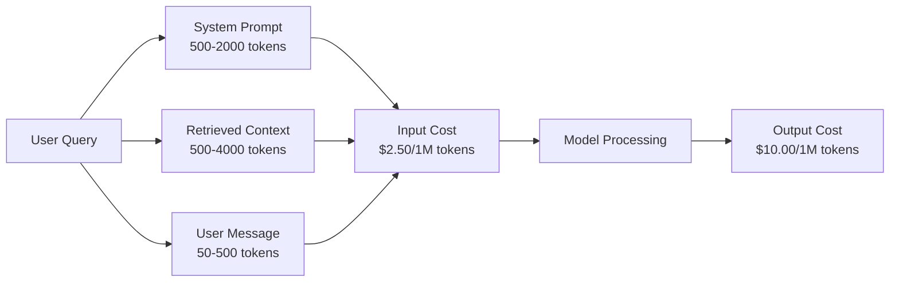
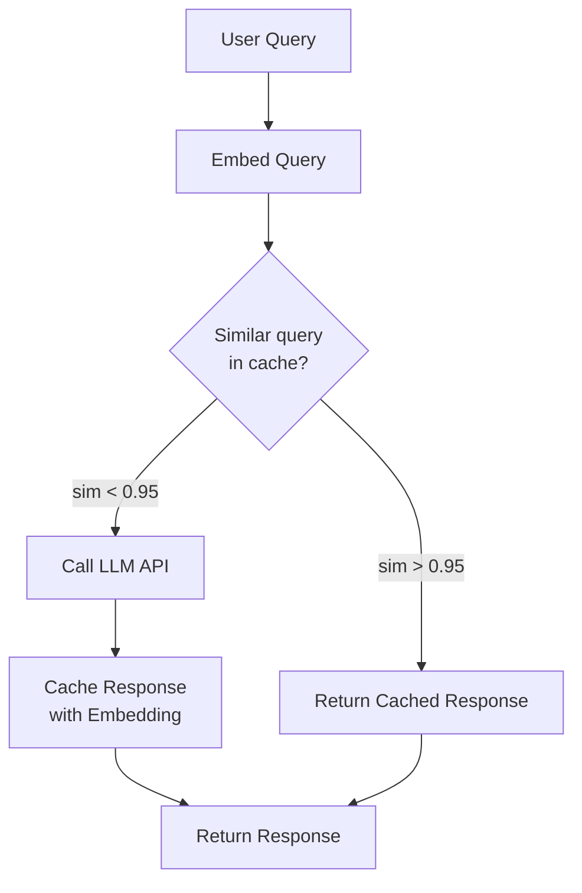
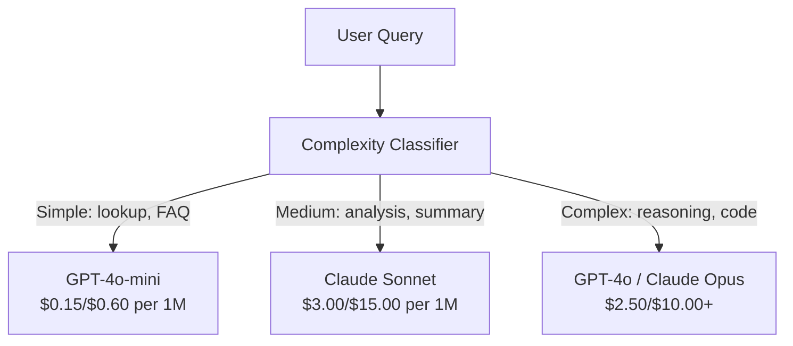

# Bộ nhớ đệm, giới hạn tốc độ và tối ưu hóa chi phí

> Hầu hết các công ty khởi nghiệp AI không chết vì models xấu. Họ chết vì kinh tế đơn vị tồi. Một cuộc gọi GPT-4o có giá chỉ bằng một phần của một xu. Mười nghìn người dùng thực hiện mười cuộc gọi mỗi ngày chỉ tiêu tốn 250 đô la cho tokens đầu vào - trước khi bạn tính một đô la duy nhất. Các công ty tồn tại là những công ty coi mọi cuộc gọi API như một giao dịch tài chính, không phải một cuộc gọi chức năng.

**Loại:** Xây dựng
**Ngôn ngữ:** Python
**Kiến thức tiên quyết:** Giai đoạn 11 Bài 09 (Function Calling)
**Thời lượng:** ~45 phút
**Liên quan:** Giai đoạn 11 · 15 (Prompt Bộ nhớ đệm) — bài học này bao gồm bộ nhớ đệm lớp ứng dụng (bộ nhớ đệm ngữ nghĩa, bộ nhớ đệm băm chính xác model định tuyến). Bài 15 bao gồm bộ nhớ đệm prompt lớp nhà cung cấp (Anthropic cache_control, OpenAI tự động Gemini CachedContent). Kết hợp cả hai để giảm 50-95% chi phí.

## Mục tiêu học tập

- Triển khai bộ nhớ đệm ngữ nghĩa phục vụ các truy vấn lặp đi lặp lại hoặc tương tự từ bộ nhớ đệm thay vì thực hiện lệnh gọi API mới
- Tính toán chi phí cho mỗi yêu cầu giữa các nhà cung cấp và triển khai giới hạn tỷ lệ nhận biết token và cảnh báo ngân sách
- Xây dựng lớp tối ưu hóa chi phí với tính năng nén prompt, định tuyến model (đắt so với rẻ) và bộ nhớ đệm phản hồi
- Thiết kế chiến lược bộ nhớ đệm theo tầng bằng cách sử dụng đối sánh chính xác, tương tự ngữ nghĩa và bộ nhớ đệm tiền tố cho các loại truy vấn khác nhau

## Vấn đề

Bạn xây dựng một chatbot RAG. Nó hoạt động rất đẹp. Người dùng yêu thích nó.

Sau đó, hóa đơn đến.

Chi phí GPT-5 $5 per million input tokens and $15 trên một triệu sản lượng. Claude Opus 4.7 có chi phí $15 input / $75 đầu ra. Gemini 3 Pro có chi phí $1.25 input / $5 đầu ra. GPT-5-mini là $0.25/$2. Giá dưới đây chỉ mang tính chất minh họa; luôn kiểm tra trang giá hiện tại của nhà cung cấp.

Dưới đây là phép toán giết chết các công ty khởi nghiệp:

- 10.000 người dùng hoạt động hàng ngày
- 10 truy vấn cho mỗi người dùng mỗi ngày
- 1.000 tokens đầu vào cho mỗi truy vấn (system prompt + ngữ cảnh + tin nhắn người dùng)
- 500 tokens đầu ra cho mỗi phản hồi

**Chi phí đầu vào hàng ngày:** 10.000 x 10 x 1.000 / 1.000.000 x $2.50 = **$ 250/day**
**Chi phí sản lượng hàng ngày:** 10.000 x 10 x 500 / 1.000.000 x $10.00 = **$ 500/day**
**Tổng hàng tháng:** **$22,500/month**

Đó chỉ là LLM. Thêm embeddings, vector lưu trữ cơ sở dữ liệu, cơ sở hạ tầng. Bạn đang xem xét 30.000/month đô la cho một chatbot.

Phần tàn bạo: 40-60% những truy vấn đó gần như trùng lặp. Người dùng hỏi cùng một câu hỏi bằng những từ hơi khác nhau. system prompt của bạn - giống hệt nhau trên mọi yêu cầu - được tính phí mỗi lần. Các tài liệu ngữ cảnh được truy xuất bởi RAG lặp lại giữa những người dùng hỏi về cùng một chủ đề.

Bạn đang trả toàn bộ giá cho tính toán dự phòng.

## Khái niệm

### Phân tích chi phí của một cuộc gọi LLM

Mỗi cuộc gọi API có năm thành phần chi phí.



prompts hệ thống là kẻ giết người thầm lặng. Một token system prompt 1.500  được gửi với mỗi yêu cầu có giá $3.75 per million requests just for that prefix. At 100K requests per day, that is $ 375/day - 11.250/month đô la - cho văn bản không bao giờ thay đổi.

### Bộ nhớ đệm của nhà cung cấp: Giảm giá tích hợp

Cả ba nhà cung cấp chính đều cung cấp bộ nhớ đệm prompt phía nhà cung cấp vào năm 2026, nhưng cơ chế khác nhau. Xem Giai đoạn 11 · 15 để tìm hiểu sâu.

| Nhà cung cấp | Cơ chế | Giảm giá | Tối thiểu | Thời lượng bộ nhớ cache |
|----------|-----------|----------|---------|----------------|
| Anthropic | Điểm đánh dấu cache_control rõ ràng | 90% khi truy cập bộ nhớ cache (trả thêm 25% khi ghi) | 1.024 tokens (Sonnet/Opus), 2.048 (Haiku) | Mặc định 5 phút; Mở rộng 1 giờ (2x phí ghi phí) |
| OpenAI | Tự động khớp tiền tố | 50% số lần truy cập vào bộ nhớ cache | 1,024 tokens | Nỗ lực tốt nhất lên đến 1 giờ |
| Google Gemini | CachedContent rõ ràng API | Giảm ~75% (cộng với dung lượng lưu trữ) | 4,096 (Đèn flash) / 32,768 (Pro) | TTL do người dùng định cấu hình |

**Anthropiccách tiếp cận của **là rõ ràng. Bạn đánh dấu các phần củapromptvới`cache_control: {"type": "ephemeral"}`. Yêu cầu đầu tiên trả phí ghi 25%. Các yêu cầu tiếp theo có cùng tiền tố sẽ được giảm giá 90%. Một 2,000-token system promptchi phí đó$0.005 normally costs $0,000625 lần truy cập vào bộ nhớ cache. Hơn 100 nghìn yêu cầu, giúp tiết kiệm $437.50/day.

**Cách tiếp cận của OpenAI** là tự động. Bất kỳ tiền tố prompt nào khớp với yêu cầu trước đó đều được giảm giá 50%. Không cần đánh dấu. Sự đánh đổi: ít chiết khấu hơn, ít kiểm soát hơn, nhưng không nỗ lực triển khai.

### Semantic Caching: Lớp tùy chỉnh của bạn

Bộ nhớ đệm của nhà cung cấp chỉ hoạt động cho các tiền tố giống hệt nhau. Bộ nhớ đệm ngữ nghĩa xử lý trường hợp khó hơn: các truy vấn khác nhau có cùng nghĩa.

"policy trả về là gì?" và "Làm cách nào để trả về một mục?" là các chuỗi khác nhau nhưng có ý định giống hệt nhau. Bộ nhớ đệm ngữ nghĩa nhúng cả hai truy vấn, tính toán độ tương đồng cosin và trả về phản hồi được lưu trong bộ nhớ đệm nếu độ tương đồng vượt quá ngưỡng (thường là 0,92-0,95).



Chi phí embedding là không đáng kể. Văn bản-embedding-3-nhỏ của OpenAI có giá 0,02 đô la cho mỗi triệu tokens. Kiểm tra bộ nhớ cache hầu như không tốn kém so với một cuộc gọi LLM đầy đủ.

### Bộ nhớ đệm chính xác: Hash và Match

Đối với các lệnh gọi xác định (temperature=0, cùng model, cùng prompt), bộ nhớ đệm chính xác đơn giản và nhanh hơn. Băm toàn bộ prompt, kiểm tra bộ nhớ đệm, trả về nếu tìm thấy.

Điều này hoạt động hoàn hảo cho:
- System prompt + ngữ cảnh cố định + truy vấn người dùng giống hệt nhau
- Function calling với các định nghĩa công cụ giống hệt nhau
- Batch xử lý trong đó cùng một tài liệu được xử lý nhiều lần

### Giới hạn tỷ lệ: Bảo vệ ngân sách của bạn

Giới hạn tỷ lệ không chỉ là về sự công bằng. Đó là về sự sống còn.

**Token thuật toán vùng lưu trữ:** mỗi người dùng nhận được một vùng chứa N tokens nạp lại với tốc độ R mỗi giây. Một yêu cầu tiêu thụ tokens từ vùng lưu trữ. Nếu vùng lưu trữ trống, yêu cầu sẽ bị từ chối. Điều này cho phép tăng số lần (sử dụng toàn bộ vùng lưu trữ cùng một lúc) trong khi thực thi tốc độ trung bình.

**Hạn ngạch cho mỗi người dùng:** đặt giới hạn daily/monthly token cho mỗi cấp người dùng.

| Bậc | Giới hạn Token hàng ngày | Tối đa Requests/min | Truy cập Model |
|------|------------------|------------------|-------------|
| Miễn phí | 50,000 | 10 | Chỉ GPT-4o-mini |
| Chuyên nghiệp | 500,000 | 60 | GPT-4o, Claude Sonnet |
| Doanh nghiệp | 5,000,000 | 300 | Tất cả models |

### Định tuyến Model: Đúng Model cho đúng công việc

Không phải mọi truy vấn đều cần GPT-4o.

"Cửa hàng đóng cửa lúc mấy giờ?" không yêu cầu$10/M-output model. GPT-4o-mini at $ 0.60/Mđầu ra xử lý nó một cách hoàn hảo.ClaudeHaiku với $1.25/Moutput xử lý nó. Một bộ phân loại đơn giản định tuyến các truy vấn rẻ đến giá rẻmodelsvà các truy vấn phức tạp đến đắt tiềnmodels.



Một bộ định tuyến được điều chỉnh tốt giúp tiết kiệm 40-70% chỉ riêng chi phí model.

### Theo dõi chi phí: Biết tiền đi đâu

Bạn không thể tối ưu hóa những gì bạn không đo lường. Ghi nhật ký mọi cuộc gọi API bằng:

- Dấu thời gian
- Tên Model
- Đầu vào tokens
- Đầu ra tokens
- Độ trễ (ms)
- Chi phí tính toán ($)
- ID người dùng
- hit/miss bộ nhớ đệm
- Danh mục yêu cầu

Dữ liệu này tiết lộ features nào đắt tiền, người dùng nào là người tiêu dùng nặng và bộ nhớ đệm nào có tác động nhiều nhất.

### Batching: Giảm giá số lượng lớn

OpenAI yêu cầu Batch API processes không đồng bộ với mức chiết khấu 50%. Bạn gửi batch lên đến 50.000 yêu cầu và kết quả sẽ trả về trong vòng 24 giờ.

Sử dụng hàng loạt cho:
- Xử lý tài liệu hàng đêm
- Phân loại số lượng lớn
- Chạy đánh giá
- Làm giàu dữ liệu pipelines

Không dành cho: truy vấn đối mặt với người dùng theo thời gian thực (vấn đề về độ trễ).

### Cảnh báo ngân sách và bộ ngắt mạch

Bộ ngắt mạch ngừng chi tiêu khi bạn đạt đến giới hạn. Nếu không có nó, một lỗi hoặc lạm dụng có thể đốt cháy ngân sách hàng tháng của bạn trong vài giờ.

Đặt ba ngưỡng:
1. **Cảnh báo** (70% ngân sách): gửi cảnh báo
2. **Bướm ga **(85% ngân sách): chỉ chuyển sang models rẻ hơn
3. **Dừng** (95% ngân sách): từ chối yêu cầu mới, chỉ trả về phản hồi được lưu trong bộ nhớ cache

### Tối ưu hóa Stack

Áp dụng các kỹ thuật này theo thứ tự. Mỗi lớp hợp chất với những lớp trước.

| Lớp | Kỹ thuật | Tiết kiệm điển hình | Nỗ lực thực hiện |
|-------|-----------|----------------|----------------------|
| 1 | Bộ nhớ đệm prompt của nhà cung cấp | 30-50% | Thấp (thêm điểm đánh dấu bộ nhớ đệm) |
| 2 | Bộ nhớ đệm chính xác | 10-20% | Thấp (băm + dict) |
| 3 | Bộ nhớ đệm ngữ nghĩa | 15-30% | Trung bình (embeddings + tương tự) |
| 4 | Định tuyến Model | 40-70% | Trung bình (phân loại) |
| 5 | Giới hạn tỷ lệ | Bảo vệ ngân sách | Thấp (token xô) |
| 6 | Nén Prompt | 10-30% | Trung bình (viết lại prompts) |
| 7 | Lô | 50% khi đủ điều kiện | Thấp (batch API) |

Một ứng dụng RAG áp dụng các lớp 1-5 thường giảm chi phí từ $22,500/month to $4.000-6.000/month. Đó là sự khác biệt giữa việc đốt đường băng và xây dựng doanh nghiệp.

### Tiết kiệm thực sự: Trước và sau

Dưới đây là bảng phân tích thực sự cho một chatbot RAG phục vụ 10.000 DAU.

| Số liệu | Trước khi tối ưu hóa | Sau khi tối ưu hóa | Tiết kiệm |
|--------|--------------------|--------------------|---------|
| Chi phí LLM hàng tháng | $22,500 | $5,200 | 77% |
| Chi phí trung bình cho mỗi truy vấn | 0,0075 US$ | 0,0017 US$ | 77% |
| Tỷ lệ trúng bộ nhớ đệm | 0% | 52% | -- |
| Truy vấn được định tuyến đến mini | 0% | 65% | -- |
| Độ trễ P95 | 2.800 mili giây | 900ms (lần truy cập bộ nhớ đệm: 50ms) | 68% |
| Chi phí embedding hàng tháng | 0 đô la | $180 | (chi phí mới) |
| Tổng chi phí hàng tháng | $22,500 | $5,380 | 76% |

Thuộc tínhembeddingChi phí cho bộ nhớ đệm ngữ nghĩa ($180/month) tự thanh toán trong vòng một giờ đầu tiên kể từ khi truy cập vào bộ nhớ đệm.

## Tự xây dựng

### Bước 1: Máy tính chi phí

Xây dựng máy tính chi phí token biết giá hiện tại cho các models chính.

```python
import hashlib
import time
import json
import math
from dataclasses import dataclass, field


MODEL_PRICING = {
    "gpt-4o": {"input": 2.50, "output": 10.00, "cached_input": 1.25},
    "gpt-4o-mini": {"input": 0.15, "output": 0.60, "cached_input": 0.075},
    "gpt-4.1": {"input": 2.00, "output": 8.00, "cached_input": 0.50},
    "gpt-4.1-mini": {"input": 0.40, "output": 1.60, "cached_input": 0.10},
    "gpt-4.1-nano": {"input": 0.10, "output": 0.40, "cached_input": 0.025},
    "o3": {"input": 2.00, "output": 8.00, "cached_input": 0.50},
    "o3-mini": {"input": 1.10, "output": 4.40, "cached_input": 0.55},
    "o4-mini": {"input": 1.10, "output": 4.40, "cached_input": 0.275},
    "claude-opus-4": {"input": 15.00, "output": 75.00, "cached_input": 1.50},
    "claude-sonnet-4": {"input": 3.00, "output": 15.00, "cached_input": 0.30},
    "claude-haiku-3.5": {"input": 0.80, "output": 4.00, "cached_input": 0.08},
    "gemini-2.5-pro": {"input": 1.25, "output": 10.00, "cached_input": 0.3125},
    "gemini-2.5-flash": {"input": 0.15, "output": 0.60, "cached_input": 0.0375},
}


def calculate_cost(model, input_tokens, output_tokens, cached_input_tokens=0):
    if model not in MODEL_PRICING:
        return {"error": f"Unknown model: {model}"}
    pricing = MODEL_PRICING[model]
    non_cached = input_tokens - cached_input_tokens
    input_cost = (non_cached / 1_000_000) * pricing["input"]
    cached_cost = (cached_input_tokens / 1_000_000) * pricing["cached_input"]
    output_cost = (output_tokens / 1_000_000) * pricing["output"]
    total = input_cost + cached_cost + output_cost
    return {
        "model": model,
        "input_tokens": input_tokens,
        "output_tokens": output_tokens,
        "cached_input_tokens": cached_input_tokens,
        "input_cost": round(input_cost, 6),
        "cached_input_cost": round(cached_cost, 6),
        "output_cost": round(output_cost, 6),
        "total_cost": round(total, 6),
    }
```

### Bước 2: Bộ nhớ cache chính xác

Băm toàn bộ prompt và trả về phản hồi được lưu trong bộ nhớ cache cho các yêu cầu giống hệt nhau.

```python
class ExactCache:
    def __init__(self, max_size=1000, ttl_seconds=3600):
        self.cache = {}
        self.max_size = max_size
        self.ttl = ttl_seconds
        self.hits = 0
        self.misses = 0

    def _hash(self, model, messages, temperature):
        key_data = json.dumps({"model": model, "messages": messages, "temperature": temperature}, sort_keys=True)
        return hashlib.sha256(key_data.encode()).hexdigest()

    def get(self, model, messages, temperature=0.0):
        if temperature > 0:
            self.misses += 1
            return None
        key = self._hash(model, messages, temperature)
        if key in self.cache:
            entry = self.cache[key]
            if time.time() - entry["timestamp"] < self.ttl:
                self.hits += 1
                entry["access_count"] += 1
                return entry["response"]
            del self.cache[key]
        self.misses += 1
        return None

    def put(self, model, messages, temperature, response):
        if temperature > 0:
            return
        if len(self.cache) >= self.max_size:
            oldest_key = min(self.cache, key=lambda k: self.cache[k]["timestamp"])
            del self.cache[oldest_key]
        key = self._hash(model, messages, temperature)
        self.cache[key] = {
            "response": response,
            "timestamp": time.time(),
            "access_count": 1,
        }

    def stats(self):
        total = self.hits + self.misses
        return {
            "hits": self.hits,
            "misses": self.misses,
            "hit_rate": round(self.hits / total, 4) if total > 0 else 0,
            "cache_size": len(self.cache),
        }
```

### Bước 3: Bộ nhớ đệm ngữ nghĩa

Nhúng truy vấn và trả về phản hồi được lưu trong bộ nhớ cache khi độ tương đồng vượt quá ngưỡng.

```python
def simple_embed(text):
    words = text.lower().split()
    vocab = {}
    for w in words:
        vocab[w] = vocab.get(w, 0) + 1
    norm = math.sqrt(sum(v * v for v in vocab.values()))
    if norm == 0:
        return {}
    return {k: v / norm for k, v in vocab.items()}


def cosine_similarity(a, b):
    if not a or not b:
        return 0.0
    all_keys = set(a) | set(b)
    dot = sum(a.get(k, 0) * b.get(k, 0) for k in all_keys)
    return dot


class SemanticCache:
    def __init__(self, similarity_threshold=0.85, max_size=500, ttl_seconds=3600):
        self.entries = []
        self.threshold = similarity_threshold
        self.max_size = max_size
        self.ttl = ttl_seconds
        self.hits = 0
        self.misses = 0

    def get(self, query):
        query_embedding = simple_embed(query)
        now = time.time()
        best_match = None
        best_sim = 0.0
        for entry in self.entries:
            if now - entry["timestamp"] > self.ttl:
                continue
            sim = cosine_similarity(query_embedding, entry["embedding"])
            if sim > best_sim:
                best_sim = sim
                best_match = entry
        if best_match and best_sim >= self.threshold:
            self.hits += 1
            best_match["access_count"] += 1
            return {"response": best_match["response"], "similarity": round(best_sim, 4), "original_query": best_match["query"]}
        self.misses += 1
        return None

    def put(self, query, response):
        if len(self.entries) >= self.max_size:
            self.entries.sort(key=lambda e: e["timestamp"])
            self.entries.pop(0)
        self.entries.append({
            "query": query,
            "embedding": simple_embed(query),
            "response": response,
            "timestamp": time.time(),
            "access_count": 1,
        })

    def stats(self):
        total = self.hits + self.misses
        return {
            "hits": self.hits,
            "misses": self.misses,
            "hit_rate": round(self.hits / total, 4) if total > 0 else 0,
            "cache_size": len(self.entries),
        }
```

### Bước 4: Giới hạn tỷ lệ

Token giới hạn tốc độ vùng lưu trữ với hạn ngạch cho mỗi người dùng.

```python
class TokenBucketRateLimiter:
    def __init__(self):
        self.buckets = {}
        self.tiers = {
            "free": {"capacity": 50_000, "refill_rate": 500, "max_requests_per_min": 10},
            "pro": {"capacity": 500_000, "refill_rate": 5_000, "max_requests_per_min": 60},
            "enterprise": {"capacity": 5_000_000, "refill_rate": 50_000, "max_requests_per_min": 300},
        }

    def _get_bucket(self, user_id, tier="free"):
        if user_id not in self.buckets:
            tier_config = self.tiers.get(tier, self.tiers["free"])
            self.buckets[user_id] = {
                "tokens": tier_config["capacity"],
                "capacity": tier_config["capacity"],
                "refill_rate": tier_config["refill_rate"],
                "last_refill": time.time(),
                "request_timestamps": [],
                "max_rpm": tier_config["max_requests_per_min"],
                "tier": tier,
                "total_tokens_used": 0,
            }
        return self.buckets[user_id]

    def _refill(self, bucket):
        now = time.time()
        elapsed = now - bucket["last_refill"]
        refill = int(elapsed * bucket["refill_rate"])
        if refill > 0:
            bucket["tokens"] = min(bucket["capacity"], bucket["tokens"] + refill)
            bucket["last_refill"] = now

    def check(self, user_id, tokens_needed, tier="free"):
        bucket = self._get_bucket(user_id, tier)
        self._refill(bucket)
        now = time.time()
        bucket["request_timestamps"] = [t for t in bucket["request_timestamps"] if now - t < 60]
        if len(bucket["request_timestamps"]) >= bucket["max_rpm"]:
            return {"allowed": False, "reason": "rate_limit", "retry_after_seconds": 60 - (now - bucket["request_timestamps"][0])}
        if bucket["tokens"] < tokens_needed:
            deficit = tokens_needed - bucket["tokens"]
            wait = deficit / bucket["refill_rate"]
            return {"allowed": False, "reason": "token_limit", "tokens_available": bucket["tokens"], "retry_after_seconds": round(wait, 1)}
        return {"allowed": True, "tokens_available": bucket["tokens"]}

    def consume(self, user_id, tokens_used, tier="free"):
        bucket = self._get_bucket(user_id, tier)
        bucket["tokens"] -= tokens_used
        bucket["request_timestamps"].append(time.time())
        bucket["total_tokens_used"] += tokens_used

    def get_usage(self, user_id):
        if user_id not in self.buckets:
            return {"error": "User not found"}
        b = self.buckets[user_id]
        return {
            "user_id": user_id,
            "tier": b["tier"],
            "tokens_remaining": b["tokens"],
            "capacity": b["capacity"],
            "total_tokens_used": b["total_tokens_used"],
            "utilization": round(b["total_tokens_used"] / b["capacity"], 4) if b["capacity"] else 0,
        }
```

### Bước 5: Trình theo dõi chi phí

Ghi lại mọi cuộc gọi và tính toán tổng số chạy.

```python
class CostTracker:
    def __init__(self, monthly_budget=1000.0):
        self.logs = []
        self.monthly_budget = monthly_budget
        self.alerts = []

    def log_call(self, model, input_tokens, output_tokens, cached_input_tokens=0, latency_ms=0, user_id="anonymous", cache_status="miss"):
        cost = calculate_cost(model, input_tokens, output_tokens, cached_input_tokens)
        entry = {
            "timestamp": time.time(),
            "model": model,
            "input_tokens": input_tokens,
            "output_tokens": output_tokens,
            "cached_input_tokens": cached_input_tokens,
            "latency_ms": latency_ms,
            "cost": cost["total_cost"],
            "user_id": user_id,
            "cache_status": cache_status,
        }
        self.logs.append(entry)
        self._check_budget()
        return entry

    def _check_budget(self):
        total = self.total_cost()
        pct = total / self.monthly_budget if self.monthly_budget > 0 else 0
        if pct >= 0.95 and not any(a["level"] == "stop" for a in self.alerts):
            self.alerts.append({"level": "stop", "message": f"Budget 95% consumed: ${total:.2f}/${self.monthly_budget:.2f}", "timestamp": time.time()})
        elif pct >= 0.85 and not any(a["level"] == "throttle" for a in self.alerts):
            self.alerts.append({"level": "throttle", "message": f"Budget 85% consumed: ${total:.2f}/${self.monthly_budget:.2f}", "timestamp": time.time()})
        elif pct >= 0.70 and not any(a["level"] == "warning" for a in self.alerts):
            self.alerts.append({"level": "warning", "message": f"Budget 70% consumed: ${total:.2f}/${self.monthly_budget:.2f}", "timestamp": time.time()})

    def total_cost(self):
        return round(sum(e["cost"] for e in self.logs), 6)

    def cost_by_model(self):
        by_model = {}
        for e in self.logs:
            m = e["model"]
            if m not in by_model:
                by_model[m] = {"calls": 0, "cost": 0, "input_tokens": 0, "output_tokens": 0}
            by_model[m]["calls"] += 1
            by_model[m]["cost"] = round(by_model[m]["cost"] + e["cost"], 6)
            by_model[m]["input_tokens"] += e["input_tokens"]
            by_model[m]["output_tokens"] += e["output_tokens"]
        return by_model

    def cache_savings(self):
        cache_hits = [e for e in self.logs if e["cache_status"] == "hit"]
        if not cache_hits:
            return {"saved": 0, "cache_hits": 0}
        saved = 0
        for e in cache_hits:
            full_cost = calculate_cost(e["model"], e["input_tokens"], e["output_tokens"])
            saved += full_cost["total_cost"]
        return {"saved": round(saved, 4), "cache_hits": len(cache_hits)}

    def summary(self):
        if not self.logs:
            return {"total_calls": 0, "total_cost": 0}
        total_latency = sum(e["latency_ms"] for e in self.logs)
        cache_hits = sum(1 for e in self.logs if e["cache_status"] == "hit")
        return {
            "total_calls": len(self.logs),
            "total_cost": self.total_cost(),
            "avg_cost_per_call": round(self.total_cost() / len(self.logs), 6),
            "avg_latency_ms": round(total_latency / len(self.logs), 1),
            "cache_hit_rate": round(cache_hits / len(self.logs), 4),
            "cost_by_model": self.cost_by_model(),
            "cache_savings": self.cache_savings(),
            "budget_remaining": round(self.monthly_budget - self.total_cost(), 2),
            "budget_utilization": round(self.total_cost() / self.monthly_budget, 4) if self.monthly_budget > 0 else 0,
            "alerts": self.alerts,
        }
```

### Bước 6: Model bộ định tuyến

Định tuyến truy vấn đến model rẻ nhất có thể xử lý chúng.

```python
SIMPLE_KEYWORDS = ["what time", "hours", "address", "phone", "price", "return policy", "hello", "hi", "thanks", "yes", "no"]
COMPLEX_KEYWORDS = ["analyze", "compare", "explain why", "write code", "debug", "architect", "design", "trade-off", "evaluate"]


def classify_complexity(query):
    q = query.lower()
    if len(q.split()) <= 5 or any(kw in q for kw in SIMPLE_KEYWORDS):
        return "simple"
    if any(kw in q for kw in COMPLEX_KEYWORDS):
        return "complex"
    return "medium"


def route_model(query, tier="pro"):
    complexity = classify_complexity(query)
    routing_table = {
        "simple": {"free": "gpt-4.1-nano", "pro": "gpt-4o-mini", "enterprise": "gpt-4o-mini"},
        "medium": {"free": "gpt-4o-mini", "pro": "claude-sonnet-4", "enterprise": "claude-sonnet-4"},
        "complex": {"free": "gpt-4o-mini", "pro": "gpt-4o", "enterprise": "claude-opus-4"},
    }
    model = routing_table[complexity].get(tier, "gpt-4o-mini")
    return {"query": query, "complexity": complexity, "model": model, "tier": tier}
```

### Bước 7: Chạy bản demo

```python
def simulate_llm_call(model, query):
    input_tokens = len(query.split()) * 4 + 500
    output_tokens = 150 + (len(query.split()) * 2)
    latency = 200 + (output_tokens * 2)
    return {
        "model": model,
        "response": f"[Simulated {model} response to: {query[:50]}...]",
        "input_tokens": input_tokens,
        "output_tokens": output_tokens,
        "latency_ms": latency,
    }


def run_demo():
    print("=" * 60)
    print("  Caching, Rate Limiting & Cost Optimization Demo")
    print("=" * 60)

    print("\n--- Model Pricing ---")
    for model, pricing in list(MODEL_PRICING.items())[:6]:
        cost_1k = calculate_cost(model, 1000, 500)
        print(f"  {model}: ${cost_1k['total_cost']:.6f} per 1K in + 500 out")

    print("\n--- Cost Comparison: 100K Requests ---")
    for model in ["gpt-4o", "gpt-4o-mini", "claude-sonnet-4", "claude-haiku-3.5"]:
        cost = calculate_cost(model, 1000 * 100_000, 500 * 100_000)
        print(f"  {model}: ${cost['total_cost']:.2f}")

    print("\n--- Anthropic Cache Savings ---")
    no_cache = calculate_cost("claude-sonnet-4", 2000, 500, 0)
    with_cache = calculate_cost("claude-sonnet-4", 2000, 500, 1500)
    saving = no_cache["total_cost"] - with_cache["total_cost"]
    print(f"  Without cache: ${no_cache['total_cost']:.6f}")
    print(f"  With 1500 cached tokens: ${with_cache['total_cost']:.6f}")
    print(f"  Savings per call: ${saving:.6f} ({saving/no_cache['total_cost']*100:.1f}%)")

    exact_cache = ExactCache(max_size=100, ttl_seconds=300)
    semantic_cache = SemanticCache(similarity_threshold=0.75, max_size=100)
    rate_limiter = TokenBucketRateLimiter()
    tracker = CostTracker(monthly_budget=100.0)

    print("\n--- Exact Cache ---")
    messages_1 = [{"role": "user", "content": "What is the return policy?"}]
    result = exact_cache.get("gpt-4o-mini", messages_1, 0.0)
    print(f"  First lookup: {'HIT' if result else 'MISS'}")
    exact_cache.put("gpt-4o-mini", messages_1, 0.0, "You can return items within 30 days.")
    result = exact_cache.get("gpt-4o-mini", messages_1, 0.0)
    print(f"  Second lookup: {'HIT' if result else 'MISS'} -> {result}")
    result = exact_cache.get("gpt-4o-mini", messages_1, 0.7)
    print(f"  With temp=0.7: {'HIT' if result else 'MISS (non-deterministic, skip cache)'}")
    print(f"  Stats: {exact_cache.stats()}")

    print("\n--- Semantic Cache ---")
    test_queries = [
        ("What is the return policy?", "Items can be returned within 30 days with receipt."),
        ("How do I return an item?", None),
        ("What are your store hours?", "We are open 9am-9pm Monday through Saturday."),
        ("When does the store open?", None),
        ("Tell me about quantum computing", "Quantum computers use qubits..."),
        ("Explain quantum mechanics", None),
    ]
    for query, response in test_queries:
        cached = semantic_cache.get(query)
        if cached:
            print(f"  '{query[:40]}' -> CACHE HIT (sim={cached['similarity']}, original='{cached['original_query'][:40]}')")
        elif response:
            semantic_cache.put(query, response)
            print(f"  '{query[:40]}' -> MISS (stored)")
        else:
            print(f"  '{query[:40]}' -> MISS (no match)")
    print(f"  Stats: {semantic_cache.stats()}")

    print("\n--- Rate Limiting ---")
    for i in range(12):
        check = rate_limiter.check("user_1", 1000, "free")
        if check["allowed"]:
            rate_limiter.consume("user_1", 1000, "free")
        status = "OK" if check["allowed"] else f"BLOCKED ({check['reason']})"
        if i < 5 or not check["allowed"]:
            print(f"  Request {i+1}: {status}")
    print(f"  Usage: {rate_limiter.get_usage('user_1')}")

    print("\n--- Model Routing ---")
    routing_queries = [
        "What time do you close?",
        "Summarize this quarterly earnings report",
        "Analyze the trade-offs between microservices and monoliths",
        "Hello",
        "Write code for a binary search tree with deletion",
    ]
    for q in routing_queries:
        route = route_model(q, "pro")
        print(f"  '{q[:50]}' -> {route['model']} ({route['complexity']})")

    print("\n--- Full Pipeline: Before vs After Optimization ---")
    queries = [
        "What is the return policy?",
        "How do I return something?",
        "What are your hours?",
        "When do you open?",
        "Explain the difference between TCP and UDP",
        "Compare TCP vs UDP protocols",
        "Hello",
        "What is your phone number?",
        "Write a Python function to sort a list",
        "Analyze the pros and cons of serverless architecture",
    ]

    print("\n  [Before: no caching, single model (gpt-4o)]")
    tracker_before = CostTracker(monthly_budget=1000.0)
    for q in queries:
        result = simulate_llm_call("gpt-4o", q)
        tracker_before.log_call("gpt-4o", result["input_tokens"], result["output_tokens"], latency_ms=result["latency_ms"], cache_status="miss")
    before = tracker_before.summary()
    print(f"  Total cost: ${before['total_cost']:.6f}")
    print(f"  Avg cost/call: ${before['avg_cost_per_call']:.6f}")
    print(f"  Avg latency: {before['avg_latency_ms']}ms")

    print("\n  [After: caching + routing + rate limiting]")
    exact_c = ExactCache()
    semantic_c = SemanticCache(similarity_threshold=0.75)
    tracker_after = CostTracker(monthly_budget=1000.0)

    for q in queries:
        messages = [{"role": "user", "content": q}]
        cached = exact_c.get("gpt-4o", messages, 0.0)
        if cached:
            tracker_after.log_call("gpt-4o-mini", 0, 0, latency_ms=5, cache_status="hit")
            continue
        sem_cached = semantic_c.get(q)
        if sem_cached:
            tracker_after.log_call("gpt-4o-mini", 0, 0, latency_ms=15, cache_status="hit")
            continue
        route = route_model(q)
        result = simulate_llm_call(route["model"], q)
        tracker_after.log_call(route["model"], result["input_tokens"], result["output_tokens"], latency_ms=result["latency_ms"], cache_status="miss")
        exact_c.put(route["model"], messages, 0.0, result["response"])
        semantic_c.put(q, result["response"])

    after = tracker_after.summary()
    print(f"  Total cost: ${after['total_cost']:.6f}")
    print(f"  Avg cost/call: ${after['avg_cost_per_call']:.6f}")
    print(f"  Avg latency: {after['avg_latency_ms']}ms")
    print(f"  Cache hit rate: {after['cache_hit_rate']:.0%}")

    if before["total_cost"] > 0:
        savings_pct = (1 - after["total_cost"] / before["total_cost"]) * 100
        print(f"\n  SAVINGS: {savings_pct:.1f}% cost reduction")
        print(f"  Latency improvement: {(1 - after['avg_latency_ms'] / before['avg_latency_ms']) * 100:.1f}% faster")

    print("\n--- Budget Alerts Demo ---")
    alert_tracker = CostTracker(monthly_budget=0.01)
    for i in range(5):
        alert_tracker.log_call("gpt-4o", 5000, 2000, latency_ms=500)
    print(f"  Total spent: ${alert_tracker.total_cost():.6f} / ${alert_tracker.monthly_budget}")
    for alert in alert_tracker.alerts:
        print(f"  ALERT [{alert['level'].upper()}]: {alert['message']}")

    print("\n--- Cost Breakdown by Model ---")
    multi_tracker = CostTracker(monthly_budget=500.0)
    for _ in range(50):
        multi_tracker.log_call("gpt-4o-mini", 800, 200, latency_ms=150)
    for _ in range(30):
        multi_tracker.log_call("claude-sonnet-4", 1500, 500, latency_ms=400)
    for _ in range(10):
        multi_tracker.log_call("gpt-4o", 2000, 800, latency_ms=600)
    for _ in range(10):
        multi_tracker.log_call("claude-opus-4", 3000, 1000, latency_ms=1200)
    breakdown = multi_tracker.cost_by_model()
    for model, data in sorted(breakdown.items(), key=lambda x: x[1]["cost"], reverse=True):
        print(f"  {model}: {data['calls']} calls, ${data['cost']:.6f}, {data['input_tokens']:,} in / {data['output_tokens']:,} out")
    print(f"  Total: ${multi_tracker.total_cost():.6f}")

    print("\n" + "=" * 60)
    print("  Demo complete.")
    print("=" * 60)


if __name__ == "__main__":
    run_demo()
```

## Ứng dụng

### Anthropic Prompt Bộ nhớ đệm

```python
# import anthropic
#
# client = anthropic.Anthropic()
#
# response = client.messages.create(
#     model="claude-sonnet-4-20250514",
#     max_tokens=1024,
#     system=[
#         {
#             "type": "text",
#             "text": "You are a helpful customer support agent for Acme Corp...",
#             "cache_control": {"type": "ephemeral"},
#         }
#     ],
#     messages=[{"role": "user", "content": "What is the return policy?"}],
# )
#
# print(f"Input tokens: {response.usage.input_tokens}")
# print(f"Cache creation tokens: {response.usage.cache_creation_input_tokens}")
# print(f"Cache read tokens: {response.usage.cache_read_input_tokens}")
```

Lệnh gọi đầu tiên ghi vào bộ nhớ đệm (phí bảo hiểm 25%). Mỗi cuộc gọi tiếp theo có cùng tiền tố system prompt sẽ đọc từ bộ nhớ đệm (chiết khấu 90%). Bộ nhớ đệm kéo dài 5 phút và đặt lại bộ đếm thời gian trên mỗi lần truy cập.

### OpenAI Bộ nhớ đệm tự động

```python
# from openai import OpenAI
#
# client = OpenAI()
#
# response = client.chat.completions.create(
#     model="gpt-4o",
#     messages=[
#         {"role": "system", "content": "You are a helpful customer support agent..."},
#         {"role": "user", "content": "What is the return policy?"},
#     ],
# )
#
# print(f"Prompt tokens: {response.usage.prompt_tokens}")
# print(f"Cached tokens: {response.usage.prompt_tokens_details.cached_tokens}")
# print(f"Completion tokens: {response.usage.completion_tokens}")
```

OpenAI bộ nhớ đệm tự động. Bất kỳ tiền tố prompt nào là 1.024+ tokens khớp với yêu cầu gần đây đều được giảm giá 50%. Không cần thay đổi mã -- chỉ cần kiểm tra `prompt_tokens_details.cached_tokens` trong phản hồi để xác minh rằng nó đang hoạt động.

### OpenAI Batch API

```python
# import json
# from openai import OpenAI
#
# client = OpenAI()
#
# requests = []
# for i, query in enumerate(queries):
#     requests.append({
#         "custom_id": f"request-{i}",
#         "method": "POST",
#         "url": "/v1/chat/completions",
#         "body": {
#             "model": "gpt-4o-mini",
#             "messages": [{"role": "user", "content": query}],
#         },
#     })
#
# with open("batch_input.jsonl", "w") as f:
#     for r in requests:
#         f.write(json.dumps(r) + "\n")
#
# batch_file = client.files.create(file=open("batch_input.jsonl", "rb"), purpose="batch")
# batch = client.batches.create(input_file_id=batch_file.id, endpoint="/v1/chat/completions", completion_window="24h")
# print(f"Batch ID: {batch.id}, Status: {batch.status}")
```

Batch API giảm giá cố định 50% cho tất cả các tokens. Kết quả đến trong vòng 24 giờ. Hoàn hảo cho khối lượng công việc không theo thời gian thực: đánh giá, ghi nhãn dữ liệu, tóm tắt hàng loạt.

### Production Semantic Cache với Redis

```python
# import redis
# import numpy as np
# from openai import OpenAI
#
# r = redis.Redis()
# client = OpenAI()
#
# def get_embedding(text):
#     response = client.embeddings.create(model="text-embedding-3-small", input=text)
#     return response.data[0].embedding
#
# def semantic_cache_lookup(query, threshold=0.95):
#     query_emb = np.array(get_embedding(query))
#     keys = r.keys("cache:emb:*")
#     best_sim, best_key = 0, None
#     for key in keys:
#         stored_emb = np.frombuffer(r.get(key), dtype=np.float32)
#         sim = np.dot(query_emb, stored_emb) / (np.linalg.norm(query_emb) * np.linalg.norm(stored_emb))
#         if sim > best_sim:
#             best_sim, best_key = sim, key
#     if best_sim >= threshold and best_key:
#         response_key = best_key.decode().replace("cache:emb:", "cache:resp:")
#         return r.get(response_key).decode()
#     return None
```

Trong production, hãy thay thế quét tuyến tính bằng chỉ mục vector (Redis Vector Search, Pinecone hoặc pgvector). Quét tuyến tính hoạt động cho <1.000 mục nhập. Ngoài ra, hãy sử dụng ANN (hàng xóm gần nhất) để tra cứu O(log n).

## Sản phẩm bàn giao

Bài học này tạo ra `outputs/prompt-cost-optimizer.md` -- một prompt có thể tái sử dụng để phân tích ứng dụng LLM của bạn và đề xuất tối ưu hóa chi phí cụ thể với khoản tiết kiệm dự kiến.

Nó cũng tạo ra `outputs/skill-cost-patterns.md` - một quyết định framework để chọn chiến lược bộ nhớ đệm phù hợp, configuration giới hạn tốc độ và các quy tắc định tuyến model cho trường hợp sử dụng của bạn.

## Bài tập

1. **Triển khai loại bỏ LRU cho bộ nhớ đệm ngữ nghĩa.** Thay thế loại bỏ cũ nhất bằng lần thứ nhất được sử dụng gần đây nhất. Theo dõi thời gian truy cập cuối cùng cho mỗi mục nhập và loại bỏ mục nhập có thời gian truy cập cũ nhất khi bộ nhớ đệm đầy. So sánh tỷ lệ truy cập giữa hai chiến lược trên 100 truy vấn.

2. **Xây dựng công cụ dự báo chi phí.** Với nhật ký các cuộc gọi API (nhật ký CostTracker), hãy dự đoán chi phí hàng tháng dựa trên mức trung bình 7 ngày trước đó. Tính đến các mẫu weekday/weekend. Trigger cảnh báo nếu chi phí hàng tháng dự kiến vượt quá ngân sách hơn 20%.

3. **Triển khai bộ nhớ đệm ngữ nghĩa theo bậc.** Sử dụng hai ngưỡng tương tự: 0,98 cho lần truy cập có độ tin cậy cao (trả về ngay lập tức) và 0,90 cho lần truy cập có độ tin cậy trung bình (trả về kèm theo tuyên bố miễn trừ trách nhiệm: "Dựa trên câu hỏi tương tự trước đó..."). Theo dõi mỗi lần truy cập đến từ cấp nào và đo lường sự khác biệt về mức độ hài lòng của người dùng.

4. **Xây dựng bộ phân loại định tuyến model.** Thay thế bộ phân loại dựa trên từ khóa bằng bộ phân loại dựa trên embedding. Nhúng 50 truy vấn được gắn nhãn (simple/medium/complex), sau đó phân loại truy vấn mới bằng cách tìm ví dụ được gắn nhãn gần nhất. Phân loại đo lường accuracy dựa trên tập hợp thử nghiệm gồm 20 truy vấn.

5. **Triển khai bộ ngắt mạch với mức độ suy giảm.** Với ngân sách 70%, hãy ghi lại cảnh báo. Ở mức 85%, tự động chuyển tất cả định tuyến sang model rẻ nhất (gpt-4o-mini). Ở mức 95%, chỉ phân phát các phản hồi được lưu trong bộ nhớ đệm và từ chối các truy vấn mới. Kiểm tra bằng cách mô phỏng 1.000 yêu cầu so với ngân sách 1,00 đô la và xác minh từng ngưỡng triggers chính xác.

## Thuật ngữ chính

| Thuật ngữ | Những gì mọi người nói | Ý nghĩa thực sự của nó |
|------|----------------|----------------------|
| Prompt bộ nhớ đệm | "Lưu trữ system prompt" | Bộ nhớ đệm cấp nhà cung cấp trong đó các tiền tố prompt lặp lại được giảm giá (90% Anthropic, 50% OpenAI) -- không thay đổi mã cho OpenAI, các điểm đánh dấu rõ ràng cho Anthropic |
| Bộ nhớ đệm ngữ nghĩa | "Bộ nhớ đệm thông minh" | Embedding truy vấn, tính toán sự tương đồng với các truy vấn trước đây và trả về phản hồi được lưu trong bộ nhớ cache nếu sự tương đồng vượt quá ngưỡng -- bắt các diễn giải mà khớp chính xác bị bỏ lỡ |
| Bộ nhớ đệm chính xác | "Bộ nhớ đệm băm" | Băm toàn bộ prompt (model + tin nhắn + temperature) và trả về phản hồi được lưu trong bộ nhớ cache cho các đầu vào giống hệt nhau -- chỉ hoạt động cho các lệnh gọi xác định temperature = 0 |
| Token xô | "Bộ giới hạn tốc độ" | Một thuật toán trong đó mỗi người dùng có một nhóm N tokens nạp lại với tốc độ R mỗi giây - cho phép tăng lên đến N trong khi thực thi tốc độ trung bình là R |
| Định tuyến Model | "Định tuyến rẻ tiền" | Sử dụng bộ phân loại để gửi các truy vấn đơn giản đến models giá rẻ (GPT-4o-mini, Haiku) và các truy vấn phức tạp đến models đắt tiền (GPT-4o, Opus) - tiết kiệm 40-70% chi phí model |
| Theo dõi chi phí | "Đo sáng" | Ghi lại mọi cuộc gọi API với model, tokens, độ trễ, chi phí và ID người dùng để bạn biết chính xác tiền đi đâu và features nào đắt |
| Bộ ngắt mạch | "Kill switch" | Tự động làm giảm chất lượng dịch vụ (models rẻ hơn, chỉ được lưu trong bộ nhớ đệm) hoặc dừng hoàn toàn yêu cầu khi chi tiêu đạt đến giới hạn ngân sách |
| Batch API | "Giảm giá số lượng lớn" | Xử lý không đồng bộ của OpenAI với chiết khấu 50% - gửi tới 50.000 yêu cầu, nhận kết quả trong vòng 24 giờ |
| Nén Prompt | "Token chế độ ăn kiêng" | Viết lại prompts hệ thống và ngữ cảnh để sử dụng ít tokens hơn trong khi vẫn giữ được ý nghĩa - ngắn hơn prompts chi phí thấp hơn và thường hoạt động tốt hơn |
| Tỷ lệ trúng bộ nhớ đệm | "Hiệu quả bộ nhớ đệm" | Tỷ lệ phần trăm yêu cầu được phục vụ từ bộ nhớ cache thay vì gọi LLM - 40-60% là điển hình cho chatbot production, tiết kiệm tỷ lệ thuận về chi phí |

## Đọc thêm

- [Anthropic Prompt Caching Guide](https://docs.anthropic.com/en/docs/build-with-claude/prompt-caching) -- tài liệu chính thức về các điểm đánh dấu cache_control rõ ràng của Anthropic, giá cả và hành vi trọn đời của bộ nhớ đệm
- [OpenAI Prompt Caching](https://platform.openai.com/docs/guides/prompt-caching) -- bộ nhớ đệm tự động của OpenAI, cách xác minh số lần truy cập bộ nhớ đệm thông qua các trường sử dụng và độ dài tiền tố tối thiểu
- [OpenAI Batch API](https://platform.openai.com/docs/guides/batch) -- Giảm giá 50% cho xử lý không đồng bộ, định dạng JSONL, thời gian hoàn thành 24 giờ và giới hạn yêu cầu 50K
- [GPTCache](https://github.com/zilliztech/GPTCache) -- thư viện bộ nhớ đệm ngữ nghĩa mã nguồn mở hỗ trợ nhiều embedding phụ trợ, cửa hàng vector và policies loại bỏ
- [Martian Model Router](https://docs.withmartian.com) -- production model định tuyến tự động chọn model rẻ nhất có khả năng xử lý từng truy vấn
- [Not Diamond](https://www.notdiamond.ai) -- bộ định tuyến model dựa trên ML học hỏi từ các mẫu lưu lượng truy cập của bạn để tối ưu hóa sự đánh đổi cost/quality giữa các nhà cung cấp
- [Helicone](https://www.helicone.ai) -- LLM observability nền tảng có theo dõi chi phí, bộ nhớ đệm, giới hạn tốc độ và cảnh báo ngân sách như một lớp proxy
- [Dean & Barroso, "The Tail at Scale" (CACM 2013)](https://research.google/pubs/the-tail-at-scale/) - độ trễ, thông lượng, TTFT/TPOT phần trăm và các yêu cầu được bảo hiểm; chi phí model đằng sau "chọn model rẻ nhất vẫn đáp ứng P95".
- [Kwon et al., "Efficient Memory Management for Large Language Model Serving with PagedAttention" (SOSP 2023)](https://arxiv.org/abs/2309.06180) -- bài báo vLLM; tại sao bộ nhớ đệm KV được phân trang + hàng loạt liên tục đánh bại servers ngây thơ 24× về thông lượng, lớp cơ sở hạ tầng dưới "bộ nhớ đệm và chi phí".
- [Dao et al., "FlashAttention-2: Faster Attention with Better Parallelism and Work Partitioning" (ICLR 2024)](https://arxiv.org/abs/2307.08691) -- giảm chi phí cấp hạt nhân trực giao với bộ nhớ đệm prompt; đọc cùng với giải mã đầu cơ và GQA để có bức tranh đường cong chi phí đầy đủ.
