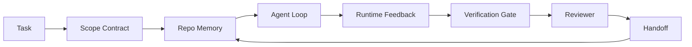

# Kỹ thuật bàn làm việc Agent: Tại sao Models có khả năng vẫn thất bại

> Một model có năng lực là không đủ. Các agents đáng tin cậy cần bàn làm việc: hướng dẫn, trạng thái, phạm vi, phản hồi, xác minh, xem xét và bàn giao. Loại bỏ những thứ đó và thậm chí là một model biên giới tạo ra công việc không an toàn cho ship.

**Loại:** Tìm hiểu + Xây dựng
**Ngôn ngữ:** Python (stdlib)
**Kiến thức tiên quyết:** Giai đoạn 14 · 01 (Vòng lặp Agent), Giai đoạn 14 · 26 (Chế độ lỗi)
**Thời lượng:** ~45 phút

## Mục tiêu học tập

- Tách biệt khả năng model khỏi độ tin cậy của việc thực hiện.
- Đặt tên cho bảy bề mặt bàn làm việc quyết định xem có agent ships hay không.
- So sánh chạy chỉ prompt với chạy có hướng dẫn trên bàn làm việc trên một tác vụ repo nhỏ.
- Tạo báo cáo chế độ lỗi ánh xạ từng bề mặt bị bỏ lỡ với triệu chứng mà nó gây ra.

## Vấn đề

Bạn thả một model biên giới vào một repo thực và yêu cầu nó thêm xác thực đầu vào. Nó mở bốn tệp, viết mã hợp lý, tuyên bố thành công và dừng lại. Bạn chạy các bài kiểm tra. Hai thất bại. Một tệp thứ ba được chạm vào không liên quan gì đến xác thực. Không có hồ sơ nào về những gì agent giả định, những gì nó đã cố gắng đầu tiên, hoặc những gì còn lại để làm.

model không sai về Python. Đó là sai lầm về công việc. Nó không biết điều gì được coi là đã hoàn thành, nó được phép viết ở đâu, bài kiểm tra nào có thẩm quyền hoặc session tiếp theo sẽ được chọn như thế nào.

Đây không phải là một lỗi model. Đó là một lỗi bàn làm việc. Bề mặt xung quanh agent thiếu các bộ phận biến thế hệ one-shot thành kỹ thuật đáng tin cậy, có thể tiếp tục.

## Khái niệm

Bàn làm việc là môi trường hoạt động bao bọc model trong một nhiệm vụ. Nó có bảy bề mặt:

| Bề mặt | Những gì nó mang theo | Thất bại khi thiếu |
|---------|-----------------|----------------------|
| Hướng dẫn | Quy tắc khởi động, hành vi bị cấm, định nghĩa đã hoàn thành | Agent đoán shipping nghĩa là gì |
| Tiểu bang | Nhiệm vụ hiện tại, tệp đã chạm, trình chặn, hành động tiếp theo | Mỗi session khởi động lại từ con số không |
| Phạm vi | Các tệp được phép, tệp bị cấm, tiêu chí chấp nhận | Nội dung chỉnh sửa bị rò rỉ thành mã không liên quan |
| Phản hồi | Đầu ra lệnh thực được ghi lại vào vòng lặp | Agent tuyên bố thành công trên 400 |
| Xác minh | Kiểm tra, lint, chạy khói, kiểm tra phạm vi | "Looks good" đạt đến chính |
| Đánh giá | Đường chuyền thứ hai với một vai trò khác | Người xây dựng đánh dấu bài tập về nhà của chính mình |
| Bàn giao | Điều gì đã thay đổi, tại sao, những gì còn lại | Tiếp theo session khám phá lại mọi thứ |

Bàn làm việc độc lập với model. Bạn có thể hoán đổi model và giữ lại các bề mặt. Bạn không thể hoán đổi các bề mặt và giữ độ tin cậy.



Vòng lặp đóng trên tệp trạng thái, không phải trên lịch sử trò chuyện. Trò chuyện rất dễ bay hơi. repo là hệ thống hồ sơ.

### Bàn làm việc so với kỹ thuật prompt

Prompting cho model biết bạn muốn gì trong lượt này. Bàn làm việc cho người model biết cách làm việc qua các lượt và giữa các sessions. Hầu hết các câu chuyện thất bại agent là những thất bại trên bàn làm việc khi mặc quần áo kỹ thuật prompt.

### Bàn làm việc so với framework

Một framework cung cấp cho bạn một runtime (LangGraph, AutoGen, Agents SDK). Bàn làm việc cung cấp cho agent một nơi để làm việc bên trong runtime đó. Bạn cần cả hai. Đường đua nhỏ này là về bản thứ hai.

### Lý luận từ primitives, không phải từ phân loại nhà cung cấp

Có rất nhiều bài viết về "kỹ thuật harness" ngay bây giờ. Addy Osmani, OpenAI, Anthropic, LangChain, Martin Fowler, MongoDB, HumanLayer, Augment Code, Thoughtworks, danh sách tuyệt vời của walkinglabs và một nhịp trống ổn định của các tác phẩm Medium và Hacker News đều mang nó. Họ không đồng ý về ranh giới của harness là gì, những gì nằm trong phạm vi và từ vựng nào để sử dụng. Chúng ta không cần phải chọn một bên. Bảy bề mặt là một lớp UX; Bên dưới mỗi bàn làm việc là cùng một tập hợp các hệ thống phân tán primitives giữ bất kỳ phần phụ trợ đáng tin cậy nào.

Loại bỏ nhãn agent trong giây lát. Chạy agent là tính toán vượt qua thời gian, processes và máy móc. Để làm cho điều đó đáng tin cậy, bạn cần cùng một primitives bất kỳ hệ thống production nào cần.

| Primitive | Nó là gì | Những gì nó mang lại cho một agent |
|-----------|------------|------------------------------|
| Chức năng | Trình xử lý được nhập. Tinh khiết nếu có thể. Sở hữu đầu vào và đầu ra của nó. | Lệnh gọi công cụ, kiểm tra quy tắc, bước xác minh, gọi model |
| Worker | process tồn tại lâu dài sở hữu một hoặc nhiều chức năng và vòng đời | Người xây dựng, người đánh giá, người xác minh, một MCP server |
| Trigger | Nguồn sự kiện gọi một hàm | Đánh dấu vòng lặp Agent, yêu cầu HTTP, thông báo hàng đợi, cron, thay đổi tệp, hook |
| Runtime | Ranh giới quyết định cái gì chạy ở đâu, với timeouts và tài nguyên nào | process của Claude Code, runtime của LangGraph, một worker container |
| HTTP / RPC | Dây giữa người gọi và worker | Giao thức gọi công cụ, yêu cầu MCP, model API |
| Hàng đợi | Bộ đệm bền giữa trigger và worker; áp lực ngược, thử lại, idempotency | Bảng tác vụ, nhật ký phản hồi, hộp thư đến đánh giá |
| Session persistence | Trạng thái tồn tại sau sự cố, khởi động lại model hoán đổi | `agent_state.json`, checkpoints, cửa hàng KV, chính repo |
| Authorization policy | Ai có thể gọi hàm nào với phạm vi nào | Allowed/forbidden tệp, ranh giới phê duyệt MCP danh sách khả năng |

Bây giờ ánh xạ bảy bề mặt bàn làm việc lên những primitives đó.

- **Hướng dẫn** - siêu dữ liệu policy + chức năng. Quy tắc là kiểm tra (chức năng). Bộ định tuyến (`AGENTS.md`) policy được gắn vào khởi động của runtime.
- **Tiểu bang** — session persistence. Một cửa hàng có chìa khóa mà runtime đọc ở mọi bước. Tệp, KV hoặc DB; persistence ngữ nghĩa quan trọng, phần phụ trợ lưu trữ thì không.
- **Phạm vi** — authorization policy cho mỗi nhiệm vụ. Allowed/forbidden quả cầu là ACL. Phê duyệt bắt buộc là một mạng lưới cho phép.
- **Phản hồi** — nhật ký lệnh gọi được ghi vào hàng đợi. Mỗi cuộc gọi shell là một bản ghi, bền, có thể phát lại.
- **Xác minh** — một chức năng. Xác định trên đầu vào. Được kích hoạt khi đóng nhiệm vụ. Thất bại đã đóng.
- **Đánh giá** — một worker riêng biệt với xác thực chỉ đọc trên artifacts trình tạo và xác thực chỉ ghi trên báo cáo đánh giá.
- **Handoff** — một bản ghi bền bỉ được phát ra bởi một trigger đầu session. Khởi nghiệp session tiếp theo trigger đọc nó.

Bản thân vòng lặp agent là một worker tiêu thụ các sự kiện (thông báo người dùng, kết quả công cụ, tick hẹn giờ), gọi các chức năng (model, sau đó là các công cụ mà model chọn), ghi bản ghi (trạng thái, phản hồi) và phát ra triggers (xác minh, xem xét, bàn giao). Không có bí ẩn; hình dạng giống như bộ xử lý công việc.

### Các mẫu đang lưu hành, được dịch thành primitives

Mọi mẫu harness phổ biến đều giảm xuống còn tám primitives. Bảng dịch.

| Mô hình nhà cung cấp hoặc cộng đồng | Nó thực sự là gì |
|------------------------------|--------------------|
| Ralph Loop (Claude Code, Codex, agentic_harness sách) — đưa lại ý định ban đầu vào một context window mới khi agent cố gắng dừng lại sớm | Một trigger xếp lại một nhiệm vụ với ngữ cảnh rõ ràng; session persistence mang mục tiêu về phía trước |
| Lập kế hoạch / Thực hiện / Xác minh (PEV) | Ba workers, một cho mỗi vai trò, giao tiếp qua trạng thái và hàng đợi giữa các giai đoạn |
| Harness-compute separation (OpenAI Agents SDK, tháng 4 năm 2026) — tách control plane khỏi máy bay hành quyết | Nhắc lại control-plane / data-plane. Có trước nhãn hiệu agent nhiều thập kỷ |
| Open Agent Passport (OAP, tháng 3 năm 2026) — ký và kiểm tra mọi lệnh gọi công cụ dựa trên policy khai báo trước khi thực hiện | Một authorization policy được thực thi bởi một worker trước hành động, với một hàng đợi kiểm tra đã ký |
| Hướng dẫn và cảm biến (Birgitta Böckeler / Thoughtworks) — quy tắc chuyển tiếp + observability phản hồi | Authorization policy + chức năng xác minh + observability traces |
| Đầm lũy tiến, 5 giai đoạn (Kỹ thuật đảo ngược Mã Claude, tháng 4 năm 2026) | Một worker quản lý nhà nước hoạt động giống như cron trên session persistence để giữ nó trong phạm vi ngân sách |
| Hooks / middleware (LangChain, Claude Code) — chặn model và lệnh gọi công cụ | Triggers + hàm bao quanh đường dẫn gọi của runtime |
| Skills dưới dạng Markdown với tiết lộ lũy tiến (Anthropic, Flue) | Một hàm registry nơi siêu dữ liệu hàm được tải vào ngữ cảnh ngay trong thời gian |
| Sandbox agents (Codex, Sandcastle, Vercel Sandbox) | Mặt phẳng điện toán: một runtime với hệ thống tệp, mạng và vòng đời bị cô lập |
| MCP servers | Workers hiển thị các chức năng trên một RPC ổn định, với danh sách khả năng là authorization |

Mỗi mục trong bảng đó là cộng đồng agent đến một primitive đã có tên trong các hệ thống phân tán và đặt cho nó một cái mới. Nhãn hữu ích cho tiếp thị; không hữu ích như từ vựng kỹ thuật.

### Biên lai thực sự nói gì

Tuyên bố harness trên model đã có những con số đằng sau nó. Đáng biết, bởi vì chúng cũng là lập luận trung thực duy nhất chống lại "chỉ cần chờ đợi một model thông minh hơn".

- Terminal Bench 2.0 — cùng model, thay đổi harness đã chuyển một agent mã hóa từ bên ngoài top 30 lên thứ năm (LangChain, *Anatomy of an Agent Harness*).
- Vercel - xóa 80% công cụ của agent; tỷ lệ thành công tăng từ 80% lên 100% (MongoDB).
- Harvey - agents pháp lý đã tăng hơn gấp đôi accuracy chỉ thông qua tối ưu hóa harness (MongoDB).
- 88% các dự án AI agent doanh nghiệp không đạt được production. Các thất bại tập trung xung quanh runtime, không phải lý luận (preprints.org, *Harness Engineering for Language Agents*, tháng 3 năm 2026).
- Một nghiên cứu benchmark năm 2025 trên ba frameworks mã nguồn mở phổ biến đã báo cáo hoàn thành nhiệm vụ ~50%; WebAgent ngữ cảnh dài đã sụp đổ từ 40-50% xuống dưới 10% trong điều kiện ngữ cảnh dài, chủ yếu là từ các vòng lặp vô hạn và loss mục tiêu (được đề cập rộng rãi trong các bài viết đầu năm 2026).

Bài học rút ra không phải là "harness chiến thắng mãi mãi". Models tiếp thu các thủ thuật harness theo thời gian. Bài học rút ra là ngày nay, phần kỹ thuật cốt lõi là xung quanh model chứ không phải bên trong nó, và primitives chịu tải đó là những thứ mà mọi hệ thống production luôn cần.

### Nơi các bài viết của nhà cung cấp dừng lại

Đây là phần bạn không cần phải lịch sự.

- *Anatomy of an Agent Harness* của LangChain liệt kê mười một thành phần - prompts, công cụ, hooks, sandboxes, orchestration, bộ nhớ, skills, subagents và một runtime "vòng lặp câm". Nó không đặt tên hàng đợi, workers như một đơn vị triển khai, trigger semantics, session persistence như một mối quan tâm riêng biệt hoặc authorization policy. Nó coi harness là một đối tượng bạn cấu hình, không phải là một hệ thống bạn triển khai.
- *Agent Harness Engineering* của Addy Osmani đưa ra `Agent = Model + Harness` đóng khung và ratchet pattern, nhưng không nói rằng một harness được xây dựng từ gì. Nó giống như một lập trường, không phải một thông số kỹ thuật.
- Anthropic và OpenAI đi sâu nhất trên bề mặt nhưng vẫn ở bên trong runtimes của chính chúng. Thông báo "harness-compute separation" trong Agents SDK tháng 4 năm 2026 là phần đầu tiên của nhà cung cấp xác nhận rõ ràng việc phân chia control-plane / data-plane. Đó là một ý tưởng primitive, không phải là một ý tưởng mới.
- Cuốn sách agentic_harness coi harness như một đối tượng config (*Agentic Engineering* của Jaymin West, chương 6) và dòng mạnh nhất trong đó là "harness là ranh giới an ninh chính trong hệ thống agentic". Đó chỉ là authorization policy, được nhắc lại.
- Hacker News threads tiếp tục đến cùng một nơi. Bản thread *The agent harness belongs outside the sandbox* tháng 4 năm 2026 lập luận rằng harness nên nằm "giống như một hypervisor nằm bên ngoài mọi thứ và cho phép truy cập dựa trên ngữ cảnh và người dùng". Đó là, một lần nữa, authorization policy như một mặt phẳng riêng biệt.

Bạn không cần phải không đồng ý với bất kỳ phần nào trong số này để nhận thấy khoảng cách. Họ đang viết mô tả UX của một hệ thống đã tồn tại. Chúng ta đang viết hệ thống. Khi hệ thống được xây dựng đúng, bảy bề mặt rơi ra khỏi primitives. Khi nó được xây dựng sai, không có `AGENTS.md` đánh bóng nào để khắc phục hàng đợi bị thiếu.

Vì vậy, khi bạn nghe "kỹ thuật harness" ở nơi khác, hãy dịch thành primitives. Prompts và quy tắc là policy và chức năng. Giàn giáo là runtime. Guardrails là authorization + xác minh. Hooks are triggers. Trí nhớ là session persistence. Ralph Loop là hàng đợi. Subagents are workers. Sandboxes là mặt phẳng tính toán. Từ vựng thay đổi; Kỹ thuật thì không. Bàn làm việc là UX hướng agent; harness, theo nghĩa tồn tại sau lần tái cấu trúc nhà cung cấp tiếp theo, là các hàm, workers, triggers, runtimes, hàng đợi, persistence và policy được kết nối với nhau một cách chính xác.

## Tự xây dựng

`code/main.py` chạy một nhiệm vụ nhỏ repo hai lần. Đầu tiên chỉ là prompt, sau đó với bảy bề mặt được nối vào. Cùng một model, cùng một nhiệm vụ. script đếm những bề mặt nào bị thiếu trong quá trình chạy không thành công và in báo cáo chế độ lỗi.

Nhiệm vụ repo có mục đích nhỏ: thêm xác thực đầu vào vào trình xử lý kiểu FastAPI một tệp và viết một bài kiểm tra vượt qua.

Chạy nó:

```
python3 code/main.py
```

Đầu ra: nhật ký song song của hai lần chạy, một `failure_modes.json` tóm tắt lần chạy chỉ prompt và phán quyết một dòng cho lần chạy bàn làm việc.

agent là một sơ khai dựa trên quy tắc nhỏ; Vấn đề là bề mặt, không phải model. Trên rest của đường đua nhỏ này, bạn sẽ xây dựng lại từng bề mặt như một artifact thực sự, có thể tái sử dụng.

## Ứng dụng

Ba nơi bề mặt bàn làm việc đã tồn tại trong tự nhiên, ngay cả khi không ai gọi chúng như vậy:

- **Claude Mã, Codex, Con trỏ.** `AGENTS.md` và `CLAUDE.md` là bề mặt hướng dẫn. Lệnh gạch chéo là phạm vi. Hooks là xác minh.
- **LangGraph, OpenAI Agents SDK.** Checkpoints và session lưu trữ là bề mặt trạng thái. Handoffs là bề mặt bàn giao.
- **CI trên một repo thực sự. **Kiểm tra, lint và type-check là xác minh. Mẫu PR là bàn giao. CODEOWNERS là đánh giá.

Kỹ thuật bàn làm việc là kỷ luật làm cho các bề mặt đó trở nên rõ ràng và có thể tái sử dụng, thay vì để mỗi nhóm khám phá lại chúng.

## Sản phẩm bàn giao

`outputs/skill-workbench-audit.md` là một skill di động kiểm tra repo hiện có cho bảy bề mặt bàn làm việc và báo cáo bị thiếu, một phần và lành mạnh. Thả nó bên cạnh bất kỳ thiết lập agent nào; Nó cho bạn biết những gì cần sửa trước.

## Bài tập

1. Chọn một repo mà bạn đã chạy một agent. Chấm điểm bảy bề mặt từ 0 (thiếu) đến 2 (khỏe mạnh). Bề mặt yếu nhất của bạn là gì?
2. Kéo dài `main.py` để chạy prompt cũng tạo ra tuyên bố "thành công" giả mạo. Xác minh cổng xác minh sẽ bắt được nó.
3. Thêm bề mặt thứ tám cho sản phẩm của riêng bạn. Biện minh tại sao nó không sụp đổ thành một trong bảy loại hiện có.
4. Chạy lại script với một agent sơ khai khác gây ảo giác cho việc ghi thêm tệp. Bề mặt nào bắt nó trước?
5. Lập bản đồ năm chế độ lỗi định kỳ trong ngành từ Giai đoạn 14 · 26 lên bảy bề mặt. Mỗi bề mặt được thiết kế để hấp thụ chế độ nào?

## Thuật ngữ chính

| Thuật ngữ | Những gì mọi người nói | Ý nghĩa thực sự của nó |
|------|----------------|------------------------|
| Bàn làm việc | "Thiết lập" | Các bề mặt được thiết kế xung quanh model giúp công việc trở nên đáng tin cậy |
| Bề mặt | "Một tài liệu" hoặc "một script" | Một đầu vào được đặt tên, máy có thể đọc được mà agent đọc hoặc ghi mỗi lượt |
| Hệ thống hồ sơ | "Các ghi chú" | Tệp mà agent coi là sự thật khi lịch sử trò chuyện biến mất |
| Định nghĩa của việc hoàn thành | "Chấp nhận" | Một danh sách kiểm tra khách quan, được hỗ trợ bởi tệp mà agent không thể giả mạo |
| Kiểm tra bàn làm việc | "Kiểm tra mức độ sẵn sàng Repo" | Một đường chuyền qua bảy bề mặt đánh dấu các mảnh còn thiếu trước khi công việc bắt đầu |

## Đọc thêm

Đọc đây là điểm dữ liệu, không phải là cơ quan có thẩm quyền. Mỗi cái là một phân loại từng phần. Dịch mọi khái niệm trở lại primitive (hàm, worker, trigger, runtime, HTTP/RPC, queue, persistence, policy) trước khi quyết định có áp dụng nó hay không.

Khung nhà cung cấp:

- [Addy Osmani, Agent Harness Engineering](https://addyosmani.com/blog/agent-harness-engineering/) - `Agent = Model + Harness` và ratchet pattern; mỏng về cơ sở hạ tầng
- [LangChain, The Anatomy of an Agent Harness](https://blog.langchain.com/the-anatomy-of-an-agent-harness/) - mười một thành phần: prompts, công cụ, hooks, orchestration, sandboxes, bộ nhớ, skills, subagents, runtime; bỏ qua hàng đợi, triển khai, authz
- [OpenAI, Harness engineering: leveraging Codex in an agent-first world](https://openai.com/index/harness-engineering/) — Góc nhìn của nhóm Codex về các bề mặt xung quanh runtime của họ
- [OpenAI, Unrolling the Codex agent loop](https://openai.com/index/unrolling-the-codex-agent-loop/) - vòng lặp agent được giảm xuống `while` qua các lệnh gọi hàm
- [Anthropic, Effective harnesses for long-running agents](https://www.anthropic.com/engineering/effective-harnesses-for-long-running-agents) - bề mặt đường chân trời dài bên trong một runtime cụ thể
- [Anthropic, Harness design for long-running application development](https://www.anthropic.com/engineering/harness-design-long-running-apps) — Ghi chú thiết kế ứng dụng
- [LangChain Deep Agents harness capabilities](https://docs.langchain.com/oss/python/deepagents/harness) - bề mặt runtime config

Các tác phẩm của học viên với chi tiết có thể sử dụng được:

- [Martin Fowler / Birgitta Böckeler, Harness engineering for coding agent users](https://martinfowler.com/articles/harness-engineering.html) - hướng dẫn (feedforward) + cảm biến (feedback); Khung lý thuyết điều khiển rõ ràng nhất
- [HumanLayer, Skill Issue: Harness Engineering for Coding Agents](https://www.humanlayer.dev/blog/skill-issue-harness-engineering-for-coding-agents) - "đó không phải là một vấn đề model, đó là một vấn đề configuration"
- [MongoDB, The Agent Harness: Why the LLM Is the Smallest Part of Your Agent System](https://www.mongodb.com/company/blog/technical/agent-harness-why-llm-is-smallest-part-of-your-agent-system) - biên lai: Vercel 80% đến 100%, Harvey 2x accuracy, Terminal Bench Top 30 đến Top 5
- [Augment Code, Harness Engineering for AI Coding Agents](https://www.augmentcode.com/guides/harness-engineering-ai-coding-agents) - hướng dẫn ưu tiên ràng buộc
- [Sequoia podcast, Harrison Chase on Context Engineering Long-Horizon Agents](https://sequoiacap.com/podcast/context-engineering-our-way-to-long-horizon-agents-langchains-harrison-chase/) - runtime lo ngại về mối quan tâm model

Sách, bài báo và triển khai tài liệu tham khảo:

- [Jaymin West, Agentic Engineering — Chapter 6: Harnesses](https://www.jayminwest.com/agentic-engineering-book/6-harnesses) - xử lý theo sách, coi harness là ranh giới bảo mật chính
- [preprints.org, Harness Engineering for Language Agents (March 2026)](https://www.preprints.org/manuscript/202603.1756) - khung học thuật như kiểm soát / cơ quan / runtime
- [walkinglabs/awesome-harness-engineering](https://github.com/walkinglabs/awesome-harness-engineering) - danh sách đọc được tuyển chọn theo ngữ cảnh, đánh giá, observability orchestration
- [ai-boost/awesome-harness-engineering](https://github.com/ai-boost/awesome-harness-engineering) - danh sách được tuyển chọn thay thế (công cụ, đánh giá, bộ nhớ, MCP, quyền)
- [andrewgarst/agentic_harness](https://github.com/andrewgarst/agentic_harness) — triển khai tham chiếu sẵn sàng production với bộ nhớ và bộ đánh giá được hỗ trợ bởi Redis
- [HKUDS/OpenHarness](https://github.com/HKUDS/OpenHarness) — agent harness mở với agent cá nhân tích hợp

Hacker News threads đáng đọc vì những bất đồng, không phải sự đồng thuận:

- [HN: Effective harnesses for long-running agents](https://news.ycombinator.com/item?id=46081704)
- [HN: Improving 15 LLMs at Coding in One Afternoon. Only the Harness Changed](https://news.ycombinator.com/item?id=46988596)
- [HN: The agent harness belongs outside the sandbox](https://news.ycombinator.com/item?id=47990675) - lập luận cho authorization như một mặt phẳng riêng biệt

Tham khảo chéo trong chương trình giảng dạy này:

- Giai đoạn 14 · 23 - Quy ước OpenTelemetry GenAI: lớp observability mà tài liệu cảm biến chỉ ra
- Giai đoạn 14 · 26 - Danh mục chế độ hỏng hóc bảy bề mặt được thiết kế để hấp thụ
- Giai đoạn 14 · 27 - Prompt phòng thủ tiêm nằm ở authorization-policy primitive
- Giai đoạn 14 · 29 — Production runtimes (hàng đợi, sự kiện, cron): nơi primitives trong bài học này đang triển khai
