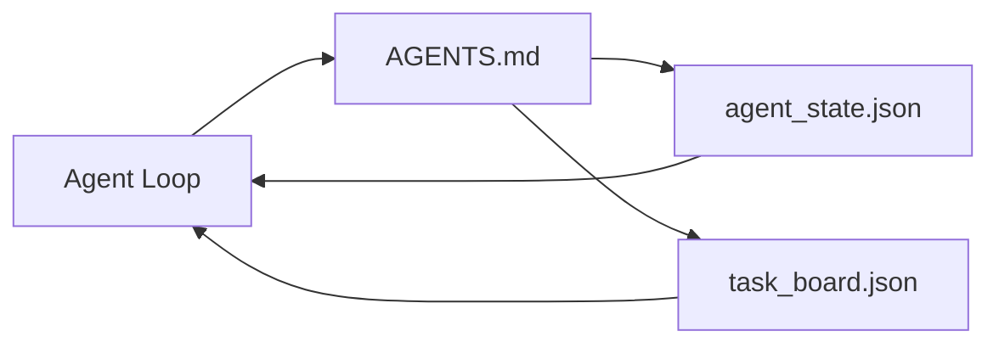

# Bàn làm việc Agent tối thiểu

> Bàn làm việc hữu ích nhỏ nhất là ba tệp: bộ định tuyến hướng dẫn gốc, tệp trạng thái và bảng tác vụ. Mọi thứ khác đều được xếp lớp lên trên. Nếu một repo không thể mang theo ba thứ này, không model nào có thể cứu nó.

**Loại:** Xây dựng
**Ngôn ngữ:** Python (stdlib)
**Kiến thức tiên quyết:** Giai đoạn 14 · 31 (Tại sao Models có khả năng vẫn thất bại)
**Thời lượng:** ~45 phút

## Mục tiêu học tập

- Xác định ba tệp tạo thành bàn làm việc khả thi tối thiểu.
- Giải thích lý do tại sao một bộ định tuyến gốc ngắn đánh bại một `AGENTS.md` nguyên khối dài.
- Xây dựng một tệp trạng thái mà agent có thể đọc ở mọi lượt và ghi ở cuối.
- Xây dựng bảng tác vụ tồn tại sau nhiều session làm việc mà không cần lịch sử trò chuyện.

## Vấn đề

Hầu hết các nhóm tiếp cận bàn làm việc bằng cách viết một `AGENTS.md` 3000 dòng và gọi nó là xong. model tải nó, bỏ qua các phần mà nó không thể tóm tắt và vẫn bị lỗi trên cùng một bề mặt mà nó luôn bị lỗi.

Bạn cần điều ngược lại. Một tệp gốc nhỏ chỉ định tuyến agent vào các tệp sâu hơn khi có liên quan. Trạng thái bền bỉ agent đọc trước khi hành động và viết sau. Một bảng tác vụ cho biết những gì đang bay, những gì bị chặn và những gì tiếp theo.

Ba tệp. Mỗi người có một công việc. Mỗi cái có thể đọc được bằng máy đủ để phát triển thành một hệ thống thực sự sau này.

## Khái niệm



### AGENTS.md là bộ định tuyến, không phải hướng dẫn sử dụng

Một `AGENTS.md` tốt là ngắn. Nó chỉ ra agent tại:

- Hồ sơ tiểu bang (nơi bạn đang ở).
- Bảng nhiệm vụ (những gì còn lại).
- Các quy tắc sâu hơn (theo `docs/agent-rules.md`).
- Lệnh xác minh (làm thế nào để biết nó hoạt động).

Bất cứ thứ gì dài hơn sẽ được đưa vào tài liệu sâu hơn, chỉ được tải khi cần thiết. Hướng dẫn sử dụng dài bị bỏ qua. Các bộ định tuyến ngắn được theo dõi.

### agent_state. json là hệ thống hồ sơ

Trạng thái mang: id tác vụ đang hoạt động, các tệp được chạm, các giả định được thực hiện, trình chặn và hành động tiếp theo. Người agent đọc nó ở mọi lượt. session tiếp theo đọc nó thay vì phát lại cuộc trò chuyện.

Trạng thái nằm trong một tệp vì lịch sử trò chuyện không đáng tin cậy. Sessions chết. Các cuộc trò chuyện bị cắt bớt. Tệp thì không.

### task_board. json là hàng đợi

Bảng nhiệm vụ thực hiện mọi nhiệm vụ với trạng thái `todo | in_progress | done | blocked`. Đó là hàng đợi mà agent lấy từ khi trạng thái trống và hàng đợi bạn đọc khi bạn muốn biết liệu agent có đi đúng hướng hay không.

Một nhiệm vụ trên bảng có id, mục tiêu, chủ sở hữu (`builder`, `reviewer` hoặc `human`) và tiêu chí chấp nhận. Bảng có chủ đích nhỏ: khi nó phát triển qua màn hình, bạn có vấn đề về lập kế hoạch, không phải vấn đề bảng.

### Ba tập tin là sàn nhà, không phải trần nhà

Các bài học sau sẽ thêm hợp đồng phạm vi, trình chạy phản hồi, cổng xác minh, danh sách kiểm tra của người đánh giá và gói bàn giao. Ba tệp ở đây là những gì tất cả họ giả định.

## Tự xây dựng

`code/main.py` viết bàn làm việc tối thiểu vào một repo trống và trình bày một agent quay duy nhất rằng:

1. Đọc `agent_state.json`.
2. Kéo tác vụ tiếp theo từ `task_board.json` nếu trạng thái trống.
3. Chạm vào một tệp duy nhất bên trong phạm vi.
4. Ghi lại trạng thái cập nhật.

Chạy nó:

```
python3 code/main.py
```

script tạo `workdir/` bên cạnh, đặt ba tệp, chạy một lượt và in diff. Chạy lại nó để xem lượt thứ hai tiếp tục như thế nào ở lượt đầu tiên đã dừng lại.

## Ứng dụng

Bên trong production agent sản phẩm, ba tệp giống nhau hiển thị dưới các tên khác nhau:

- **Mã Claude: **`AGENTS.md` hoặc `CLAUDE.md` cho bộ định tuyến, cửa hàng kiểu `.claude/state.json` cho tiểu bang hooks cho bo mạch.
- **Codex / Con trỏ:** quy tắc không gian làm việc cho bộ định tuyến, bộ nhớ session cho trạng thái, các tác vụ được xếp hàng trong thanh bên trò chuyện cho bảng.
- **Python agent tùy chỉnh: **cùng một tệp bạn vừa viết.

Tên thay đổi. Hình dạng thì không.

## Production mô hình trong tự nhiên

Bàn làm việc tối thiểu tồn tại khi tiếp xúc với monorepo thực sự khi ba mẫu được xếp lớp lên trên nó. Họ độc lập; Chọn những thứ mà repo bạn thực sự cần.

**`AGENTS.md` lồng nhau với ưu tiên thắng gần nhất.** OpenAI ships 88 tệp `AGENTS.md` trên repo chính, mỗi thành phần phụ một tệp. Codex, Cursor, Claude Code và Copilot đều đi từ tệp làm việc về phía gốc repo và nối mọi `AGENTS.md` họ tìm thấy trên đường đi. Các tệp thư mục con mở rộng tệp gốc. Codex thêm `AGENTS.override.md` để thay thế thay vì mở rộng; cơ chế ghi đè là dành riêng cho Codex và tránh nó cho công việc chéo công cụ. Phép đo của Augment Code là dòng quan trọng: các tệp `AGENTS.md` tốt nhất cho bước nhảy chất lượng tương đương với việc nâng cấp từ Haiku lên Opus; những cái tồi tệ nhất làm cho đầu ra kém hơn là không có tệp nào cả.

**Chống các mẫu để từ chối, ngay cả khi chúng trông giống như phạm vi bảo hiểm.** Các hướng dẫn mâu thuẫn âm thầm giảm agent từ chế độ tương tác sang chế độ tham lam (ICLR 2026 AMBIG-SWE: 48,8% → tỷ lệ phân giải 28%); số ưu tiên thay vì xếp chúng bằng phẳng. Các quy tắc kiểu không thể xác minh ("tuân theo Hướng dẫn phong cách của Google Python") không có lệnh thực thi cho phép agent phát minh ra sự tuân thủ; Ghép mọi quy tắc kiểu với lệnh lint chính xác. Dẫn đầu bằng phong cách thay vì mệnh lệnh chôn vùi đường dẫn xác minh; lệnh trước, phong cách cuối cùng. Viết cho con người thay vì agents lãng phí ngân sách bối cảnh; ngắn gọn là một feature.

**Liên kết tượng trưng giữa các công cụ.** Một tệp gốc duy nhất có liên kết tượng trưng (`ln -s AGENTS.md CLAUDE.md`, `ln -s AGENTS.md .github/copilot-instructions.md`, `ln -s AGENTS.md .cursorrules`) giữ mọi agent mã hóa trên cùng một nguồn tin cậy. `nx ai-setup` của Nx tự động hóa điều này trên Claude Code, Cursor, Copilot, Gemini, Codex và OpenCode từ một config duy nhất.

## Sản phẩm bàn giao

`outputs/skill-minimal-workbench.md` tạo ra bàn làm việc ba tệp cho bất kỳ repo mới nào: một bộ định tuyến `AGENTS.md` được điều chỉnh theo dự án, một `agent_state.json` có các phím phù hợp và một `task_board.json` được gieo hạt với công việc tồn đọng hiện tại.

## Bài tập

1. Thêm dấu thời gian `last_run` vào `agent_state.json`. Từ chối chạy nếu tệp cũ hơn 24 giờ trừ khi nhà điều hành xác nhận.
2. Thêm trường `priority` vào bảng tác vụ và thay đổi trình kéo để luôn chọn `todo` ưu tiên cao nhất.
3. Di chuyển `task_board.json` sang JSON Dòng để mỗi tác vụ là một dòng và sự khác biệt rõ ràng trong kiểm soát phiên bản.
4. Viết một `lint_workbench.py` không thành công nếu `AGENTS.md` dài hơn 80 dòng hoặc tham chiếu đến một tệp không tồn tại.
5. Quyết định cái nào trong ba tệp sẽ bị tổn thương nhất khi mất. Bảo vệ nó.

## Thuật ngữ chính

| Thuật ngữ | Những gì mọi người nói | Ý nghĩa thực sự của nó |
|------|----------------|------------------------|
| Bộ định tuyến | `AGENTS.md` | Tệp gốc ngắn hướng agent vào các tài liệu và tệp sâu hơn |
| Hồ sơ tiểu bang | "Các ghi chú" | Bản ghi có thể đọc được bằng máy về vị trí của agent, được viết mỗi lượt |
| Bảng tác vụ | "Tồn đọng" | JSON hàng đợi công việc với trạng thái, chủ sở hữu, chấp nhận |
| Hệ thống hồ sơ | "Nguồn sự thật" | Tệp mà bàn làm việc coi là có thẩm quyền khi trò chuyện biến mất |

## Đọc thêm

- [agents.md — the open spec](https://agents.md/) — được chấp nhận bởi Cursor, Codex, Claude Code, Copilot, Gemini, OpenCode
- [Augment Code, A good AGENTS.md is a model upgrade. A bad one is worse than no docs at all](https://www.augmentcode.com/blog/how-to-write-good-agents-dot-md-files) - bước nhảy chất lượng đo được
- [Blake Crosley, AGENTS.md Patterns: What Actually Changes Agent Behavior](https://blakecrosley.com/blog/agents-md-patterns) - những gì hoạt động theo kinh nghiệm, những gì không
- [Datadog Frontend, Steering AI Agents in Monorepos with AGENTS.md](https://dev.to/datadog-frontend-dev/steering-ai-agents-in-monorepos-with-agentsmd-13g0) — ưu tiên lồng nhau trong thực tế
- [Nx Blog, Teach Your AI Agent How to Work in a Monorepo](https://nx.dev/blog/nx-ai-agent-skills) — tạo một nguồn trên sáu công cụ
- [The Prompt Shelf, AGENTS.md Best Practices: Structure, Scope, and Real Examples](https://thepromptshelf.dev/blog/agents-md-best-practices/) — thứ tự phần tồn tại sau khi xem xét
- [Anthropic, Claude Code subagents and session store](https://docs.anthropic.com/en/docs/agents-and-tools/claude-code/sub-agents)
- Giai đoạn 14 · 31 - các chế độ lỗi tối thiểu này hấp thụ
- Giai đoạn 14 · 34 — trạng thái bền bỉ schema bản xem trước bài học này
