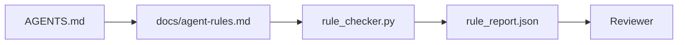

# Agent hướng dẫn dưới dạng ràng buộc thực thi

> Hướng dẫn được viết dưới dạng văn xuôi là mong muốn. Các hướng dẫn được viết dưới dạng ràng buộc là các bài kiểm tra. Workbench biến mỗi quy tắc thành một cái gì đó mà agent có thể kiểm tra tại runtime và người đánh giá có thể xác minh sau khi thực tế.

**Loại:** Xây dựng
**Ngôn ngữ:** Python (stdlib)
**Kiến thức tiên quyết:** Giai đoạn 14 · 32 (Bàn làm việc tối thiểu)
**Thời lượng:** ~50 phút

## Mục tiêu học tập

- Tách văn xuôi định tuyến khỏi các quy tắc hoạt động.
- Thể hiện các quy tắc khởi động, hành động bị cấm, định nghĩa đã hoàn thành, xử lý không chắc chắn và ranh giới phê duyệt là các ràng buộc có thể kiểm tra bằng máy.
- Triển khai trình kiểm tra quy tắc ghi điểm so với bộ quy tắc.
- Làm cho bộ quy tắc thân thiện với sự khác biệt để xem xét có thể xem những gì đã thay đổi.

## Vấn đề

Một `AGENTS.md` điển hình giống như tài liệu giới thiệu. Nó yêu cầu agent "cẩn thận" và "kiểm tra kỹ lưỡng" và "hỏi nếu không chắc chắn". Ba ngày sau, agent ships một thay đổi mà không có kiểm tra, viết thư vào một thư mục bị cấm và không bao giờ hỏi vì nó không bao giờ biết đường dây ở đâu.

Các hướng dẫn mạnh mẽ khi chúng hoạt động và yếu khi chúng có khát vọng. Cách khắc phục là viết các quy tắc mà bàn làm việc có thể diễn giải và người đánh giá có thể chấm điểm.

## Khái niệm

Các quy tắc thuộc về `docs/agent-rules.md`, cách xa bộ định tuyến gốc ngắn. Mỗi quy tắc có tên, danh mục và kiểm tra.



### Năm danh mục bao gồm hầu hết các quy tắc

| Thể loại | Đặt câu hỏi về câu trả lời quy tắc | Ví dụ |
|----------|---------------------------|---------|
| Khởi động | Điều gì phải đúng trước khi công việc bắt đầu? | "Tệp trạng thái tồn tại và mới" |
| Bị cấm | Điều gì không bao giờ được xảy ra? | "Không chỉnh sửa `scripts/release.sh`" |
| Định nghĩa của việc hoàn thành | Điều gì chứng minh nhiệm vụ đã hoàn thành? | "pytest thoát 0 và dòng chấp nhận vượt qua" |
| Sự không chắc chắn | agent làm gì khi không chắc chắn? | "Mở ghi chú câu hỏi thay vì đoán" |
| Phê duyệt | Điều gì đòi hỏi sự chấp thuận của con người? | "bất kỳ sự phụ thuộc mới nào, bất kỳ sản phẩm nào viết" |

Một quy tắc không phù hợp với một trong năm quy tắc này thường muốn là hai quy tắc. Buộc tách.

### Các quy tắc có thể đọc được bằng máy

Mỗi quy tắc có một sên, một danh mục, mô tả một dòng và một trường `check` đặt tên cho một hàm trong `rule_checker.py`. Thêm quy tắc có nghĩa là thêm séc; Checker phát triển cùng với bàn làm việc.

### Các quy tắc thân thiện với sự khác biệt

Các quy tắc tồn tại một quy tắc cho mỗi tiêu đề trong một tệp đánh dấu. Đổi tên có thể nhìn thấy trong diff. Các quy tắc mới đứng đầu danh mục của họ. Các quy tắc cũ bị xóa, không được bình luận, bởi vì bàn làm việc là nguồn gốc của sự thật, không phải nhật ký trò chuyện về cảm giác của nhóm trong quý trước.

### Quy tắc so với framework guardrails

Framework guardrails (OpenAI Agents SDK guardrails, LangGraph ngắt) thực thi các quy tắc ở cấp độ runtime. Quy tắc được đặt ra trong bài học này là hợp đồng mà con người có thể đọc được, có thể xem xét mà những người guardrails thực hiện. Bạn cần cả hai: runtime bắt được vi phạm trong một lượt, bộ quy tắc chứng minh runtime đang làm điều đúng đắn.

### Tiết lộ lũy tiến: một bản đồ, không phải một bách khoa toàn thư

Lý do `AGENTS.md` tiếp tục phát triển là mọi sự cố đều thêm một quy tắc và không có sự cố nào loại bỏ một quy tắc. Một năm sau, tệp có hai nghìn dòng và agent đọc màn hình đầu tiên, hết ngân sách attention và hành động dựa trên một phần nhỏ so với những gì nó được kể. Một tệp hướng dẫn khổng lồ không thành công vì lý do tương tự như một tài liệu giới thiệu dài bốn mươi trang bị lỗi: người đọc lướt qua nó một lần và không bao giờ quay lại phần quan trọng.

Bản sửa lỗi không phải là một tệp ngắn hơn. Nó là một lớp. Bộ định tuyến gốc vẫn đủ nhỏ để đọc mọi session và không chứa gì ngoài con trỏ. Độ sâu nằm trong các tệp chủ đề mà agent chỉ tải khi tác vụ chạm vào chúng. Cung cấp cho agent một bản đồ, không phải toàn bộ bách khoa toàn thư, và để nó đi đến trang mà nó cần.

```
AGENTS.md                  # router, < 50 lines: what this repo is, where to look, the 5 hard rules
docs/
  agent-rules.md           # the full rule set (this lesson)
  architecture.md          # loaded when the task touches module boundaries
  testing.md               # loaded when the task writes or runs tests
  deploy.md                # loaded only for release work, gated behind an approval rule
feature_list.json          # the backlog (Phase 14 · 36)
```

| Bậc | Sống trong | Đọc khi | Ngân sách kích thước |
|------|----------|-----------|-------------|
| Bộ định tuyến | `AGENTS.md` | Mỗi session, luôn luôn | Dưới ~50 dòng |
| Quy tắc | `docs/agent-rules.md` | Mỗi session, khi khởi động | Một màn hình cho mỗi danh mục |
| Tài liệu chủ đề | `docs/<topic>.md` | Chỉ khi nhiệm vụ chạm vào chủ đề đó | Sâu khi cần thiết |

Hai bài kiểm tra giữ cho việc phân lớp trung thực. Kiểm tra khả năng truy cập: một agent phải đạt được bất kỳ quy tắc nào trong tối đa hai bước nhảy từ bộ định tuyến, vì vậy bộ định tuyến phải liên kết mọi tài liệu chủ đề theo đường dẫn, không mô tả nó bằng văn xuôi. Kiểm tra độ mới: bộ định tuyến đủ ngắn để người đánh giá đọc lại nó trên mỗi PR, đó là điều duy nhất ngăn nó âm thầm phát triển trở lại bách khoa toàn thư mà nó đã thay thế. Một con trỏ không còn giải quyết được là một lỗi tồi tệ hơn một quy tắc bị thiếu, vì vậy một liên kết bị hỏng trong bộ định tuyến tự nó là một vi phạm kiểm tra khởi động.

## Tự xây dựng

`code/main.py` ships:

- `agent-rules.md` trình phân tích cú pháp tải các quy tắc vào một lớp dữ liệu.
- `rule_checker.py` chức năng kiểm tra kiểu, mỗi tham chiếu `check` một kiểu.
- Một bản demo agent chạy vi phạm hai quy tắc và một thẻ kiểm tra bắt chúng.

Chạy nó:

```
python3 code/main.py
```

Đầu ra: bộ quy tắc được phân tích cú pháp, chạy trace pass/fail cho mỗi quy tắc và một `rule_report.json` được lưu bên cạnh script.

## Production mô hình trong tự nhiên

Ba mô hình tách một bộ quy tắc kéo dài một phần tư với một bộ quy tắc phân rã trong một tuần.

**Gắn thẻ mức độ nghiêm trọng tại thời điểm viết.** Mọi quy tắc đều có `severity`: `block`, `warn` hoặc `info`. Trình kiểm tra báo cáo cả ba; runtime chỉ từ chối trên `block`. Hầu hết các đội đều phóng đại mức độ nghiêm trọng sớm sau đó lặng lẽ làm suy yếu nó dưới áp lực thời hạn; gắn thẻ tại thời điểm ghi buộc hiệu chuẩn trước. Ghép nối với cổng xác minh (Giai đoạn 14 · 38), cổng này ký bất kỳ ghi đè nào của quy tắc `block` vào nhật ký kiểm tra `overrides.jsonl`.

**Quy tắc hết hạn như một chức năng cưỡng bức.** Mỗi quy tắc đều có ngày `expires_at` (mặc định là 90 ngày kể từ ngày tác giả). Trình kiểm tra sẽ đưa ra cảnh báo khi một quy tắc chưa hết hạn không có vi phạm nào trong 60 ngày liên tiếp; Đánh giá hàng quý tiếp theo hoặc biện minh cho việc giữ nó, làm suy yếu nó thành `info` hoặc xóa nó. Dữ liệu Đánh giá mã production AI của Cloudflare (tháng 4 năm 2026, 131.246 lượt đánh giá chạy trên 5.169 repos trong 30 ngày) cho thấy các bộ quy tắc có thời hạn rõ ràng vẫn dưới 30 quy tắc mỗi repo; bộ mà không phát triển lên 80+ với hầu hết không bao giờ bắn.

**Markdown-as-source, JSON-as-cache.** `agent-rules.md` là tệp tác giả; `agent-rules.lock.json` là một bộ nhớ cache mà trình kiểm tra đọc trong đường dẫn nóng. Khóa được tạo lại bằng cách commit hook trước. Sự khác biệt của Markdown có thể xem xét được; JSON phân tích cú pháp nằm ngoài mọi lượt. Hình dạng tương tự như `package.json` / `package-lock.json` và `Cargo.toml` / `Cargo.lock`.

## Ứng dụng

Trong production:

- Claude Code, Codex, Con trỏ đọc các quy tắc khi bắt đầu session và trích dẫn chúng khi từ chối hành động. Người kiểm tra chạy lại chúng trong CI để bắt trôi im lặng.
- OpenAI Agents SDK guardrails đăng ký các kiểm tra giống như guardrails đầu vào và đầu ra. Đánh dấu là bề mặt tài liệu; SDK là bề mặt runtime.
- LangGraph làm gián đoạn kích hoạt khi một nút đang bay vi phạm quy tắc. Trình xử lý ngắt đọc quy tắc, hỏi con người và tiếp tục.

Bộ quy tắc có thể di chuyển trên cả ba vì nó chỉ là đánh dấu cộng với tên hàm.

## Sản phẩm bàn giao

`outputs/skill-rule-set-builder.md` phỏng vấn chủ dự án, phân loại các hướng dẫn văn xuôi hiện có của họ thành năm loại và phát ra một `agent-rules.md` phiên bản cộng với một sơ khai kiểm tra.

## Bài tập

1. Thêm danh mục thứ sáu nếu sản phẩm của bạn thực sự cần. Bảo vệ lý do tại sao nó không sụp đổ thành một trong năm.
2. Mở rộng trình kiểm tra để quy tắc có thể mang mức độ nghiêm trọng (`block`, `warn`, `info`) và báo cáo tổng hợp cho phù hợp.
3. Kết nối trình kiểm tra vào CI: không thành công trong bản dựng nếu quy tắc mức độ nghiêm trọng của khối không thành công trong lần chạy agent mới nhất.
4. Thêm trường "hết hạn" cho mỗi quy tắc. Sau 90 ngày không kiểm tra không thành công, quy tắc sẽ được xem xét.
5. Tìm một `AGENTS.md` thực sự và viết lại nó thành các quy tắc năm loại. Có bao nhiêu tuyến của nó đang hoạt động? Có bao nhiêu người có khát vọng?

## Thuật ngữ chính

| Thuật ngữ | Những gì mọi người nói | Ý nghĩa thực sự của nó |
|------|----------------|------------------------|
| Quy tắc hoạt động | "Một chỉ dẫn thực sự" | Một quy tắc mà bàn làm việc có thể kiểm tra tại runtime |
| Quy tắc khát vọng | "Hãy cẩn thận" | Một quy tắc không có séc; xóa hoặc nâng cấp |
| Định nghĩa của việc hoàn thành | "Chấp nhận" | Một bằng chứng khách quan, được hỗ trợ bởi tệp rằng nhiệm vụ đã hoàn thành |
| Mức độ nghiêm trọng của khối | "Quy tắc cứng" | Vi phạm sẽ dừng chạy; không thể tắt tiếng mà không có người vận hành |
| Hết hạn quy tắc | "Quét quy tắc cũ" | Một quy tắc không thất bại trong N ngày sẽ nghỉ hưu |

## Đọc thêm

- [OpenAI Agents SDK guardrails](https://platform.openai.com/docs/guides/agents-sdk/guardrails)
- [LangGraph interrupts](https://langchain-ai.github.io/langgraph/how-tos/human_in_the_loop/breakpoints/)
- [Anthropic, Building Effective Agents](https://www.anthropic.com/research/building-effective-agents)
- [Rick Hightower, Agent RuleZ: A Deterministic Policy Engine](https://medium.com/@richardhightower/agent-rulez-a-deterministic-policy-engine-for-ai-coding-agents-9489e0561edf) - mức độ nghiêm trọng block/warn/info trong production
- [Cloudflare, Orchestrating AI Code Review at Scale](https://blog.cloudflare.com/ai-code-review/) - 131 nghìn lần chạy đánh giá, bài học thành phần quy tắc
- [microservices.io, GenAI development platform — part 1: guardrails](https://microservices.io/post/architecture/2026/03/09/genai-development-platform-part-1-development-guardrails.html) - phòng thủ theo chiều sâu giữa các quy tắc và CI
- [Type-Checked Compliance: Deterministic Guardrails (arXiv 2604.01483)](https://arxiv.org/pdf/2604.01483) — Nghiêng 4 làm giới hạn trên của quy tắc khi kiểm tra
- [logi-cmd/agent-guardrails](https://github.com/logi-cmd/agent-guardrails) - triển khai merge cổng: phạm vi, kiểm tra đột biến, ngân sách vi phạm
- Giai đoạn 14 · 32 — bàn làm việc tối thiểu mà bộ quy tắc này rơi vào
- Giai đoạn 14 · 38 — cổng xác minh sử dụng báo cáo quy tắc
- Giai đoạn 14 · 39 — người đánh giá agent điểm tuân thủ quy tắc
