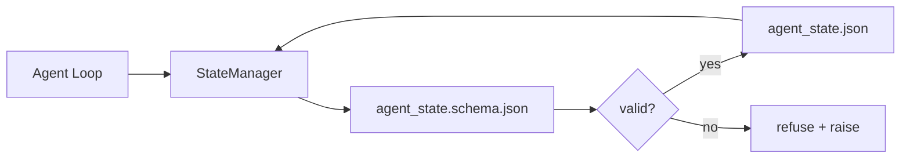

# Bộ nhớ Repo và trạng thái bền bỉ

> Lịch sử trò chuyện không ổn định. repo bền. Workbench lưu trữ trạng thái agent trong các tệp có phiên bản để session tiếp theo, agent tiếp theo và người đánh giá tiếp theo đều đọc từ cùng một nguồn tin cậy.

**Loại:** Xây dựng
**Ngôn ngữ:** Python (stdlib + `jsonschema` optional)
**Kiến thức tiên quyết:** Giai đoạn 14 · 32 (Bàn làm việc tối thiểu)
**Thời lượng:** ~60 phút

## Mục tiêu học tập

- Xác định những gì thuộc về bộ nhớ repo và những gì thuộc về lịch sử trò chuyện.
- Tác giả JSON Schemas cho `agent_state.json` và `task_board.json`.
- Xây dựng trình quản lý trạng thái tải, xác thực, thay đổi và duy trì trạng thái nguyên tử.
- Sử dụng schema để từ chối các bài viết xấu trước khi chúng làm hỏng bàn làm việc.

## Vấn đề

agent kết thúc một session. Cuộc trò chuyện đóng lại. session tiếp theo mở ra và hỏi bắt đầu từ đâu. model nói "hãy để tôi kiểm tra các tệp", đọc các ghi chú cũ và làm lại công việc đã hoàn thành. Hoặc tệ hơn, nó viết lại một tệp đã hoàn thành vì không ai nói rằng tệp đã hoàn thành.

Bản sửa lỗi bàn làm việc là repo bộ nhớ: trạng thái sống trong JSON tệp trong repo, được viết dưới một schema, tồn tại theo nguyên tử, thân thiện với diff trong việc xem xét mã. Trò chuyện là một nguồn cấp dữ liệu tạm thời; repo là hệ thống hồ sơ.

## Khái niệm



### Những gì thuộc về ký ức repo

| Thuộc về | Không thuộc về |
|---------|-----------------|
| Id tác vụ đang hoạt động | Bản ghi cuộc trò chuyện thô |
| Các tập tin đã chạm vào session này | traces lý luận cấp Token |
| Các giả định mà agent đưa ra | "Người dùng có vẻ thất vọng" |
| Mở trình chặn | Số lần hoàn thành được lấy mẫu |
| Hành động tiếp theo | ID model dành riêng cho nhà cung cấp |

Bài kiểm tra là độ bền: điều này có hữu ích trong ba tháng kể từ bây giờ trong một lần chạy lại CI không? Nếu có, repo. Nếu không, telemetry.

### Trạng thái Schema đầu tiên

JSON Schema là hợp đồng. Nếu không có nó, mọi agent đều phát minh ra các lĩnh vực mới, mọi người đánh giá đều học được một hình dạng mới và mọi CI script đều phải đặc biệt hóa các phiên bản trước đây. Với nó, một bài viết xấu là một bài viết bị từ chối.

schema bao gồm:

- Các phím bắt buộc.
- Các giá trị `status` được phép.
- Các giá trị bị cấm (ví dụ: `null` cho mảng).
- Ràng buộc mẫu (id tác vụ khớp với `T-\d{3,}`).
- Trường phiên bản để di chuyển.

### Ghi nguyên tử

Ghi trạng thái cần tồn tại sau các lỗi một phần: ghi vào tệp tạm thời, fsync, đổi tên đích. Hồ sơ nhà nước là nguồn của sự thật; một cái được viết một nửa còn tệ hơn là không có tệp nào cả.

### Di chuyển

Khi schema thay đổi, hãy ship một script di chuyển bên cạnh vết sưng schema. Hồ sơ tiểu bang mang một trường `schema_version`; Người quản lý từ chối tải tệp từ phiên bản mà nó không thể di chuyển.

## Tự xây dựng

`code/main.py` thực hiện:

- `agent_state.schema.json` và `task_board.schema.json`.
- Trình xác thực chỉ stdlib (tập hợp con của JSON Schema: bắt buộc, loại, enum, mẫu, mục).
- `StateManager.load`, `StateManager.update`, `StateManager.commit` với ghi nhiệt độ và đổi tên nguyên tử.
- Một bản demo đột biến trạng thái, tồn tại, tải lại và chứng minh chuyến đi khứ hồi.

Chạy nó:

```
python3 code/main.py
```

script ghi `workdir/agent_state.json` và `workdir/task_board.json`, thay đổi chúng qua hai lượt và in trạng thái đã xác thực ở mỗi bước.

## Production mô hình trong tự nhiên

Bốn mẫu biến mức tối thiểu của bài học thành thứ mà một monorepo nhiều agent có thể tồn tại.

**Nhiệt độ nguyên tử và đổi tên không phải là tùy chọn.** Báo cáo lỗi dự án Hive tháng 3 năm 2026 ghi lại chế độ lỗi một cách rõ ràng: `state.json` được viết qua `write_text()` và các ngoại lệ đã được phát hiện và tắt tiếng. Ghi một phần còn lại sessions tiếp tục chống lại trạng thái bị hỏng mà không có tín hiệu. Cách khắc phục luôn là: `tempfile.mkstemp` trong cùng một thư mục với đích, ghi, `fsync`, `os.replace` (đổi tên nguyên tử trên POSIX và Windows). Bài học này `atomic_write` làm chính xác điều đó.

**Idempotency trên mọi lệnh gọi công cụ không phải idempotent.** Nếu agent gặp sự cố sau khi gọi công cụ nhưng trước khi kiểm tra kết quả, khôi phục sẽ thử lại lệnh gọi công cụ. An toàn để đọc; nguy hiểm cho email, chèn cơ sở dữ liệu, tải lên tệp. Mẫu: ghi lại mọi ID lệnh gọi công cụ trước khi thực thi vào một `pending_calls.jsonl`. Khi thử lại, hãy kiểm tra ID; Nếu có, hãy bỏ qua lệnh gọi và sử dụng kết quả được lưu trong bộ nhớ đệm. Anthropic và LangChain đều đưa ra hướng dẫn này vào năm 2026; Checkpointer của LangGraph vẫn tồn tại trong quá trình chờ ghi vì lý do tương tự.

**Tách artifacts lớn khỏi trạng thái.** Không lưu trữ CSV, bản chép lời dài hoặc tệp được tạo trong `agent_state.json`. Lưu artifact dưới dạng một tệp riêng biệt (hoặc tải lên bộ nhớ đối tượng) và chỉ giữ đường dẫn ở trạng thái. Checkpoints nhỏ và nhanh; artifacts phát triển độc lập.

**Nguồn sự kiện để kiểm tra, ảnh chụp nhanh cho sơ yếu lý lịch.** Nối vào nhật ký sự kiện (`state.events.jsonl`) trên mọi đột biến; định kỳ chụp nhanh để `state.json`. Resume đọc ảnh chụp nhanh, sau đó phát lại bất kỳ sự kiện nào sau dấu thời gian của ảnh chụp nhanh. Điều này tốn nhiều đĩa hơn nhưng cho phép bạn phát lại nguyên văn các quyết định agent - điều cần thiết khi gỡ lỗi các lần chạy đường chân trời dài. Hình dạng tương tự mà Postgres sử dụng nội bộ cho WAL.

**Schema di chuyển hoặc từ chối tải.** Số nguyên `schema_version` là hợp đồng. Khi người quản lý tải một tệp ở phiên bản không xác định, nó từ chối đọc. Ship một di chuyển script bên cạnh vết sưng schema; `tools/migrate_state.py` chạy idempotent trên mọi công ty khởi nghiệp.

## Ứng dụng

Trong production:

- **Thanh kiểm tra LangGraph.** Cùng một ý tưởng, lưu trữ khác nhau. Checkpointer duy trì trạng thái đồ thị thành SQLite, Postgres hoặc backend tùy chỉnh. Điều schema bài học này dạy là những gì bạn tiếp cận khi người kiểm tra chết và bạn cần đọc trạng thái bằng tay.
- **Khối bộ nhớ Letta.** Các khối liên tục với schemas có cấu trúc (Giai đoạn 14 · 08). Cùng một kỷ luật được giới hạn cho các tính cách lâu dài.
- **OpenAI Agents SDK session cửa hàng.** Phần phụ trợ có thể cắm được, nhận biết schema. Tệp trạng thái trong bài học này là phần phụ trợ tệp cục bộ.

## Sản phẩm bàn giao

`outputs/skill-state-schema.md` tạo ra một cặp JSON Schema dành riêng cho dự án (trạng thái + bảng), một Python `StateManager` được kết nối với ghi nguyên tử và giàn giáo di chuyển để lần schema tiếp theo không làm hỏng bàn làm việc.

## Bài tập

1. Thêm dấu thời gian `last_human_touch`. Từ chối bất kỳ agent nào viết trong vòng năm giây kể từ khi con người sửa đổi.
2. Mở rộng trình xác thực để hỗ trợ `oneOf` để tác vụ có thể là tác vụ xây dựng hoặc tác vụ xem xét với các trường bắt buộc khác nhau.
3. Thêm trường `schema_version` và ghi di chuyển từ v1 sang v2 (đổi tên `blockers` thành `risks`).
4. Di chuyển phần phụ trợ lưu trữ từ tệp cục bộ sang SQLite. Giữ `StateManager` API giống hệt nhau.
5. Chạy hai agents với cùng một tệp trạng thái với cuộc đua ghi 50 mili giây. Điều gì xảy ra và việc đổi tên nguyên tử cứu bạn như thế nào?

## Thuật ngữ chính

| Thuật ngữ | Những gì mọi người nói | Ý nghĩa thực sự của nó |
|------|----------------|------------------------|
| Bộ nhớ Repo | "Tệp ghi chú" | Trạng thái được lưu trữ trong các tệp được theo dõi trong repo, dưới schema |
| Schema đầu tiên | "Xác thực đầu vào" | Xác định hợp đồng trước người viết, từ chối trôi dạt |
| Ghi nguyên tử | "Chỉ cần đổi tên" | Ghi vào temp, fsync, đổi tên, vì vậy lỗi một phần không thể bị hỏng |
| Di cư | "Schema va chạm" | Một script biến trạng thái vN thành trạng thái v (N + 1) |
| Hệ thống hồ sơ | "Nguồn sự thật" | artifact bàn làm việc coi là có thẩm quyền |

## Đọc thêm

- [JSON Schema specification](https://json-schema.org/specification.html)
- [LangGraph checkpointers](https://langchain-ai.github.io/langgraph/concepts/persistence/)
- [Letta memory blocks](https://docs.letta.com/concepts/memory)
- [Fast.io, AI Agent State Checkpointing: A Practical Guide](https://fast.io/resources/ai-agent-state-checkpointing/) - điểm kiểm tra schema đầu tiên với idempotency
- [Fast.io, AI Agent Workflow State Persistence: Best Practices 2026](https://fast.io/resources/ai-agent-workflow-state-persistence/) — kiểm soát đồng thời, TTL, tìm nguồn cung ứng sự kiện
- [Hive Issue #6263 — non-atomic state.json writes silently ignored](https://github.com/aden-hive/hive/issues/6263) - chế độ thất bại trong một dự án thực tế
- [eunomia, Checkpoint/Restore Systems: Evolution, Techniques, Applications](https://eunomia.dev/blog/2025/05/11/checkpointrestore-systems-evolution-techniques-and-applications-in-ai-agents/) — CR primitives từ lịch sử hệ điều hành được áp dụng cho agents
- [Indium, 7 State Persistence Strategies for Long-Running AI Agents in 2026](https://www.indium.tech/blog/7-state-persistence-strategies-ai-agents-2026/)
- [Microsoft Agent Framework, Compaction](https://learn.microsoft.com/en-us/agent-framework/agents/conversations/compaction) — nhà cung cấp checkpoint quản lý
- Giai đoạn 14 · 08 — khối bộ nhớ và tính toán thời gian ngủ
- Giai đoạn 14 · 32 — tối thiểu ba tệp mà bài học này sơ đồ hóa
- Giai đoạn 14 · 40 - các gói bàn giao được đọc từ cùng một schema
