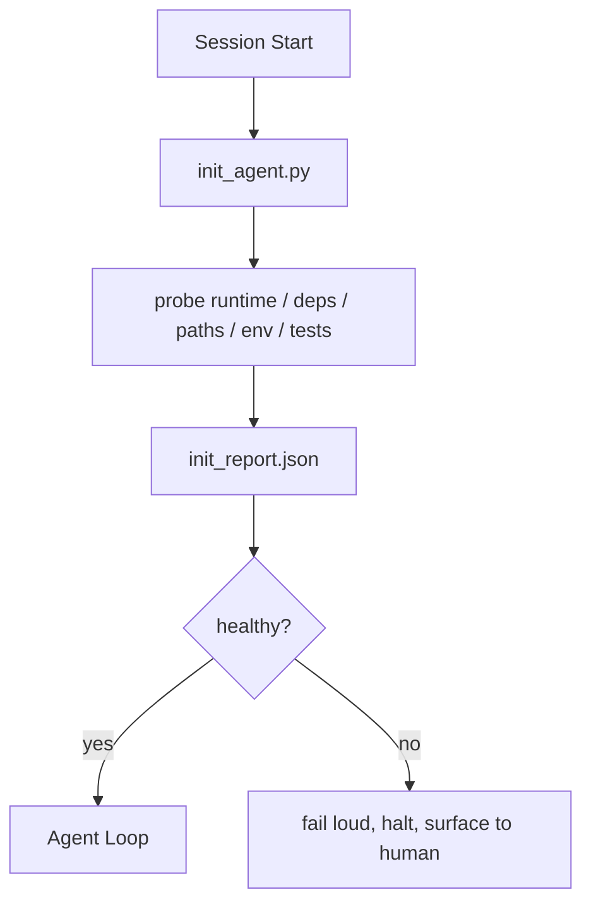

# Khởi tạo Scripts cho Agents

> Mỗi session bắt đầu lạnh đều phải trả thuế. agent đọc cùng một tệp, thử lại các đầu dò giống nhau và phát hiện lại các đường dẫn giống nhau. Một init script nộp thuế một lần và viết câu trả lời vào tiểu bang.

**Loại:** Xây dựng
**Ngôn ngữ:** Python (stdlib)
**Kiến thức tiên quyết:** Giai đoạn 14 · 32 (Bàn làm việc tối thiểu), Giai đoạn 14 · 34 (Repo Bộ nhớ)
**Thời lượng:** ~45 phút

## Mục tiêu học tập

- Xác định công việc mà agent không bao giờ phải làm lại mỗi session.
- Xây dựng một script khởi đầu xác định thăm dò runtime, phần phụ thuộc và sức khỏe repo.
- Duy trì kết quả thăm dò để agent đọc nó thay vì chạy lại kiểm tra.
- Thất bại lớn, nhanh và có một nơi để xem khi khởi tạo không thành công.

## Vấn đề

Mở một session. Người agent đoán phiên bản Python. Đoán lệnh kiểm tra. Liệt kê gốc repo năm lần để tìm điểm vào lệnh. Cố gắng import một gói chưa được cài đặt. Hỏi người dùng nơi chứa tệp config. Vào thời điểm nó thực hiện một chỉnh sửa thực sự, mười nghìn tokens đã đi vào công việc thiết lập mà lẽ ra phải là một script duy nhất.

Bản sửa lỗi là một script khởi tạo chạy trước khi agent thực hiện bất kỳ điều gì khác và ghi một `init_report.json` agent đọc khi khởi động.

## Khái niệm



### Đầu dò script cái gì

| Đầu dò | Tại sao điều này lại quan trọng |
|-------|----------------|
| Runtime phiên bản | Phiên bản Python hoặc Node sai có nghĩa là lỗi phiên bản sai im lặng |
| Tính khả dụng của phần phụ thuộc | Một gói hàng bị mất sau đó có giá gấp mười lần chi phí để bắt nó bây giờ |
| Lệnh kiểm tra | Người agent phải biết cách xác minh; Nếu lệnh bị thiếu, bàn làm việc bị hỏng |
| Repo đường dẫn | Đường dẫn được mã hóa cứng trôi dạt; giải quyết chúng một lần và ghim |
| Biến môi trường | Thiếu `OPENAI_API_KEY` là một bề mặt hỏng hóc, không phải là một bí ẩn runtime |
| Độ mới của tiểu bang + hội đồng quản trị | Tình trạng cũ kỹ từ một session bị rơi là một khẩu súng chân |
| commit tốt được biết đến cuối cùng | Neo cho sự khác biệt bàn giao ở cuối session |

### Thất bại lớn, thất bại nhanh, thất bại ở một nơi

Hỏng đầu dò có nghĩa là dừng lại và nổi lên mặt người. Không có "agent sẽ tìm ra nó." Toàn bộ mục đích của init là từ chối khởi động khi bàn làm việc bị hỏng.

### Idempotent

Chạy nó hai lần liên tiếp. Lần chạy thứ hai sẽ không hoạt động ngoại trừ dấu thời gian mới. Idempotency là thứ cho phép bạn kết nối script thành lệnh CI, hooks hoặc lệnh gạch chéo trước khi thực hiện.

### Quy tắc khởi động so với khởi động

Các quy tắc (Giai đoạn 14 · 33) mô tả những gì phải đúng để hành động. Init là script thiết lập rằng các quy tắc đó có thể được kiểm tra. Các quy tắc không có init trở thành "hãy cẩn thận". Init mà không có quy tắc trở thành một thất bại bóng bẩy.

## Tự xây dựng

`code/main.py` thực hiện các `init_agent.py`:

- Năm đầu dò: phiên bản Python, các phụ thuộc được liệt kê qua `importlib.util.find_spec`, kiểm tra khả năng phân giải lệnh, môi trường bắt buộc, độ mới của tệp trạng thái.
- Mỗi đầu dò trả về `(name, status, detail)`.
- script ghi `init_report.json` với bộ đầu dò đầy đủ và thoát ra không phải bằng không nếu bất kỳ đầu dò mức độ nghiêm trọng khối nào bị lỗi.

Chạy nó:

```
python3 code/main.py
```

script in bảng thăm dò, ghi `init_report.json` và thoát khỏi số không trên đường dẫn hạnh phúc hoặc không với danh sách các đầu dò thất bại.

## Production mô hình trong tự nhiên

Ba mẫu tách biệt một script khởi đầu hữu ích với một buổi lễ.

**Neo commit tốt cuối cùng.** Thăm dò commit hiện tại so với tệp `LKG` được ghi trên merge thành công cuối cùng. Nếu chênh lệch vượt quá ngân sách (mặc định là 50 tệp), hãy từ chối khởi động và yêu cầu con người phê chuẩn đường cơ sở mới. Đây là những gì Đánh giá mã AI của Cloudflare sử dụng để xác định phạm vi agents của người đánh giá: mọi đánh giá session neo dựa trên cùng một điểm tốt cuối cùng và không bao giờ kết hợp trôi qua sessions.

**Khóa tệp bằng TTL.** Ghi `prereqs.lock` sau lần đầu dò thành công đầu tiên. Các lần chạy tiếp theo tin tưởng khóa trong N giờ (mặc định 24h) và bỏ qua các đầu dò đắt tiền. Init script đọc khóa trước; Nếu nó mới và hàm băm biểu hiện phụ thuộc khớp nhau, nó sẽ đoản mạch. Đây là mẫu tương tự mà Docker sử dụng cho bộ nhớ đệm lớp: đầu dò idempotent + hàm băm nội dung = bỏ qua.

**Không có mạng, không có LLM, không có bất ngờ trên đường dẫn nóng.** Đầu dò Init là hệ thống ống nước xác định. Một đầu dò gọi một LLM để phân loại lỗi hoặc đánh vào một dịch vụ bên ngoài để kiểm tra giấy phép không phải là một đầu dò; Đó là một quy trình làm việc. Nếu một đầu dò mất hơn ba giây trong quá trình chạy khô, hãy coi đó là mùi bàn làm việc và di chuyển nó ra khỏi đầu dò hoặc lưu trữ kết quả của nó.

## Ứng dụng

Trong production:

- **Claude Mã hooks.** `pre-task` hook gọi script khởi tạo và từ chối khởi chạy agent nếu nó không thành công.
- **GitHub Hành động.** Một công việc `setup-agent` chạy init script; Công việc agent phụ thuộc vào nó.
- **Docker điểm vào lệnh.** agent container chạy script khởi đầu trước khi thực hiện agent runtime; nhật ký xuất hiện khi thất bại.

Init script có thể di động vì nó không thực hiện cuộc gọi đến một framework cụ thể. Bash, Make hoặc tệp tác vụ đều có thể bao bọc nó.

## Sản phẩm bàn giao

`outputs/skill-init-script.md` phỏng vấn dự án, phân loại công việc thiết lập của nó thành các đầu dò và phát ra một `init_agent.py` cụ thể của dự án cộng với quy trình làm việc CI chạy nó trước bất kỳ bước agent nào.

## Bài tập

1. Thêm một đầu dò khác biệt giữa commit hiện tại với commit đã biết cuối cùng và từ chối khởi động nếu có hơn 50 tệp thay đổi.
2. Nối dây script để viết tệp `prereqs.lock` và từ chối khởi động nếu khóa cũ hơn bảy ngày.
3. Thêm cờ `--fix` tự động cài đặt các phần phụ thuộc dev bị thiếu nhưng không bao giờ sửa đổi các phần phụ thuộc runtime mà không được phê duyệt.
4. Di chuyển các đầu dò từ các hàm được mã hóa cứng sang một YAML registry. Bảo vệ sự đánh đổi.
5. Thêm ngân sách thời gian cho mỗi đầu dò. Một đầu dò chạy lâu hơn ba giây là mùi bàn làm việc.

## Thuật ngữ chính

| Thuật ngữ | Những gì mọi người nói | Ý nghĩa thực sự của nó |
|------|----------------|------------------------|
| Đầu dò | "Một tấm séc" | Một hàm xác định trả về `(name, status, detail)` |
| Báo cáo khởi tạo | "Thiết lập đầu ra" | JSON được viết bên cạnh trạng thái với kết quả thăm dò |
| Idempotent | "An toàn để chạy lại" | Hai lần chạy liên tiếp tạo ra dấu thời gian modulo báo cáo giống hệt nhau |
| Thất bại lớn | "Đừng nuốt" | Dừng lại và nổi lên con người; Không có dự phòng im lặng |
| Thiết lập thuế | "Chi phí Bootstrap" | tokens agent chi tiêu mỗi session khám phá lại những điều hiển nhiên |

## Đọc thêm

- [Anthropic, Effective harnesses for long-running agents](https://www.anthropic.com/engineering/effective-harnesses-for-long-running-agents)
- [GitHub Actions, composite actions for setup](https://docs.github.com/en/actions/sharing-automations/creating-actions/creating-a-composite-action)
- [microservices.io, GenAI dev platform: guardrails](https://microservices.io/post/architecture/2026/03/09/genai-development-platform-part-1-development-guardrails.html) — commit trước + kiểm tra CI khi bắt đầu
- [Augment Code, How to Build Your AGENTS.md (2026)](https://www.augmentcode.com/guides/how-to-build-agents-md) - bắt đầu kỳ vọng
- [Codex Blog, Codex CLI Context Compaction](https://codex.danielvaughan.com/2026/03/31/codex-cli-context-compaction-architecture/) - session bắt đầu như init nhận biết nén
- Giai đoạn 14 · 33 — bộ quy tắc mà script này cho phép
- Giai đoạn 14 · 34 — Hồ sơ nhà nước này script hạt giống
- Giai đoạn 14 · 38 — cổng xác minh nguồn cấp dữ liệu khởi script
- Giai đoạn 14 · 40 — việc chuyển giao tiêu thụ hàng hóa cuối cùng được biết đến của báo cáo INIT
