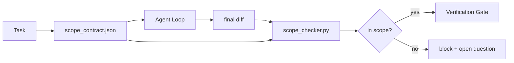

# Phạm vi, hợp đồng và ranh giới nhiệm vụ

> Người model không biết công việc kết thúc ở đâu. Hợp đồng phạm vi là một tệp cho mỗi nhiệm vụ cho biết nơi công việc bắt đầu, nơi kết thúc và cách khôi phục nếu nó bị tràn. Hợp đồng biến "ở trong phạm vi" từ một điều ước thành một tấm séc.

**Loại:** Xây dựng
**Ngôn ngữ:** Python (stdlib)
**Kiến thức tiên quyết:** Giai đoạn 14 · 32 (Bàn làm việc tối thiểu), Giai đoạn 14 · 33 (Quy tắc là ràng buộc)
**Thời lượng:** ~50 phút

## Mục tiêu học tập

- Viết hợp đồng phạm vi mà agent đọc khi bắt đầu nhiệm vụ và người xác minh đọc khi kết thúc nhiệm vụ.
- Chỉ định các tệp được phép, tệp bị cấm, tiêu chí chấp nhận, kế hoạch rollback và ranh giới phê duyệt.
- Triển khai trình kiểm tra phạm vi so sánh chênh lệch với hợp đồng và gắn cờ vi phạm.
- Làm cho phạm vi creep hiển thị, tự động và có thể xem lại.

## Vấn đề

Agents rùng rợn. Nhiệm vụ là "sửa lỗi đăng nhập". Sự khác biệt chạm vào tuyến đăng nhập, trình trợ giúp email, trình điều khiển cơ sở dữ liệu, README và script phát hành. Mỗi cú chạm đều có một lý do hợp lý trong khoảnh khắc. Cùng với nhau, chúng là một thay đổi khác với thay đổi đã được xem xét.

Scope creep là chế độ thất bại ít được giám sát nhất trong công việc agent vì agent thuật lại từng bước một cách thiện chí. Việc sửa chữa không phải là một prompt nghiêm ngặt hơn. Bản sửa lỗi là một hợp đồng trên đĩa cho biết những gì đã được hứa và một kiểm tra so sánh kết quả với lời hứa.

## Khái niệm



### Những gì xảy ra trong hợp đồng phạm vi

| Lĩnh vực | Mục đích |
|-------|---------|
| `task_id` | Liên kết đến nhiệm vụ trên bảng |
| `goal` | Một câu mà người đánh giá có thể xác minh |
| `allowed_files` | Globs agent có thể viết |
| `forbidden_files` | Globs agent không được chạm vào ngay cả khi vô tình |
| `acceptance_criteria` | Kiểm tra các lệnh hoặc dòng xác nhận đã được chứng minh là đã hoàn thành |
| `rollback_plan` | Một đoạn mà người vận hành có thể thực hiện nếu cần tạm dừng |
| `approvals_required` | Các hành động nằm ngoài phạm vi cần sự ký kết rõ ràng của con người |

Một hợp đồng không có `forbidden_files` là không đầy đủ. Không gian âm là một nửa hợp đồng.

### Globs, không phải đường dẫn thô

Thực repos di chuyển tệp. Ghim hợp đồng với các glob (`app/**/*.py`, `tests/test_signup*.py`) để việc tái cấu trúc giữa sessions không làm mất hiệu lực của hợp đồng.

### Rollback là một phần của phạm vi

Liệt kê cách quay trở lại buộc tác giả hợp đồng phải suy nghĩ về những gì có thể xảy ra. Hợp đồng bạn không thể quay trở lại là hợp đồng không nên được chấp thuận.

### Kiểm tra phạm vi là kiểm tra khác biệt

agent viết một diff. Trình kiểm tra đọc diff, các glob được phép, các glob bị cấm và danh sách bất kỳ lệnh chấp nhận nào đã chạy. Mỗi vi phạm là một phát hiện được gắn thẻ cổng xác minh có thể từ chối.

### Hai độ cao của phạm vi: danh sách feature và hợp đồng nhiệm vụ

Hợp đồng phạm vi giới hạn một nhiệm vụ. Nó không ràng buộc dự án. Một agent có thể ở trong một hợp đồng hoàn hảo để sửa lỗi đăng nhập và vẫn quyết định rằng dự án cũng cần một trang cài đặt, chuyển đổi chế độ tối và viết lại bộ định tuyến. Hợp đồng không bao giờ được hỏi công việc nào nằm trong phạm vi của dự án, chỉ hỏi những tệp nào nằm trong phạm vi của nhiệm vụ.

Độ cao thứ hai đó cần primitive riêng của nó: một `feature_list.json` agent đọc khi session đầu. Đó là backlog của dự án dưới dạng tệp có thứ tự, có thể đọc được bằng máy. agent chọn chính xác một feature có `status` `todo`, ghi `id` của mình vào hợp đồng phạm vi đang hoạt động và bị cấm bắt đầu feature thứ hai trong cùng một session. "Một feature tại một thời điểm" không còn là một dòng trong prompt agent có thể hợp lý hóa quá khứ và trở thành một giá trị mà nó đọc ra khỏi đĩa và kiểm tra cổng thực thi.

```json
{
  "project": "knowledge-base",
  "active": "import-pdf",
  "features": [
    { "id": "import-pdf",   "status": "in_progress", "goal": "import a PDF into the library",        "done_when": "pytest tests/test_import.py && a sample PDF appears in the library view" },
    { "id": "full-text-search", "status": "todo",     "goal": "search document text and rank hits",   "done_when": "query returns ranked results with snippets" },
    { "id": "cite-answers", "status": "todo",         "goal": "answers carry source citations",        "done_when": "every answer renders at least one clickable citation" }
  ]
}
```

| Lĩnh vực | Mục đích |
|-------|---------|
| `active` | Đơn feature session hiện tại có thể chạm vào; trống có nghĩa là chọn một và đặt nó |
| `features[].id` | Sên ổn định các điểm `task_id` của hợp đồng phạm vi tại |
| `features[].status` | `todo`, `in_progress`, `done`, `blocked`; chỉ một `in_progress` tại một thời điểm |
| `features[].goal` | Một câu mà người đánh giá có thể xác minh |
| `features[].done_when` | Dòng chấp nhận lật `in_progress` `done` |

Hai quy tắc làm cho danh sách chịu tải thay vì trang trí. Đầu tiên, bất biến "nhiều nhất là một `in_progress`" tự nó là một kiểm tra khởi động (Giai đoạn 14 · 33): nếu danh sách hiển thị hai, session từ chối bắt đầu cho đến khi con người giải quyết nó. Thứ hai, danh sách feature là một tệp, không phải một tin nhắn trò chuyện, bởi vì cuộc trò chuyện cuộn ra khỏi ngữ cảnh và tệp vẫn tồn tại trên sessions và trên agents. Việc bàn giao (Giai đoạn 14 · 40) ghi lại trạng thái của feature đã hoàn thành trở lại `done` để session tiếp theo mở ra một bảng chính xác thay vì lấy lại những gì còn lại.

Hợp đồng và danh sách được soạn theo đặc quyền tối thiểu, merge tương tự được mô tả dưới đây: `allowed_files` của hợp đồng nhiệm vụ phải nằm bên trong bất cứ thứ gì feature đang hoạt động chạm vào, không bao giờ ở bên ngoài nó.

## Tự xây dựng

`code/main.py` thực hiện:

- `scope_contract.json` schema (tập hợp con của JSON Schema, mảng glob).
- Trình phân tích cú pháp khác biệt biến danh sách các tệp được chạm cộng với danh sách các lệnh chạy thành `RunSummary`.
- Một `scope_check` trả lại `(violations, in_scope, off_scope)` so với hợp đồng.
- Hai lần chạy demo: một lần nằm trong phạm vi, một lần rùng mình. Trình kiểm tra gắn cờ creep với tệp và lý do chính xác.

Chạy nó:

```
python3 code/main.py
```

Đầu ra: hợp đồng, hai lần chạy, phán quyết mỗi lần chạy và một `scope_report.json` đã lưu.

## Production mô hình trong tự nhiên

Một học viên chạy "specsmaxxing" (hợp đồng phạm vi trong YAML trước khi gọi agent) báo cáo tỷ lệ lỗ thỏ đã giảm từ 52% xuống 21% trong ba tuần mà không thay đổi agent. Hợp đồng đã thực hiện công việc, không phải model. Ba mẫu làm cho độ lợi dính.

**Ngân sách vi phạm, không phải lỗi nhị phân.** `agent-guardrails` (cổng merge OSS được sử dụng bởi Claude Code, Cursor, Windsurf, Codex qua MCP) ships `violationBudget` cho mỗi nhiệm vụ: các lỗi phạm vi nhỏ trong ngân sách được hiển thị dưới dạng cảnh báo; Chỉ khi vượt quá ngân sách, cổng merge mới từ chối. Ghép nối với `violationSeverity: "error" | "warning"`. Ngân sách là sự khác biệt giữa một cánh cổng ships và một cánh cổng bị vô hiệu hóa bởi nhóm ghét nó.

**Sự bất đối xứng mức độ nghiêm trọng theo họ đường dẫn.** Viết ngoài phạm vi cho `docs/**` thường `warn`; Ghi ngoài phạm vi vào `scripts/**`, `migrations/**` `config/prod/**` luôn `block`. Sự bất đối xứng này phải tồn tại trong hợp đồng, không phải trong runtime, bởi vì nó là dự án cụ thể và thay đổi theo nhiệm vụ.

**Ngân sách thời gian và mạng bên cạnh ngân sách tệp.** Trường `time_budget_minutes` giới hạn đồng hồ treo tường; runtime từ chối tiếp tục vượt qua nó mà không được phê duyệt lại. Danh sách cho phép `network_egress` trên tên máy chủ ngăn agent lặng lẽ truy cập vào API bên ngoài không phải là một phần của tác vụ. Đây cũng là các kích thước phạm vi; Các glob tệp là cần thiết, không đủ.

**Ngữ nghĩa merge nhiều hợp đồng (đặc quyền tối thiểu).** Khi áp dụng hai hợp đồng phạm vi (ví dụ: hợp đồng toàn dự án cộng với hợp đồng cụ thể theo nhiệm vụ), merge là: **giao nhau** `allowed_files` (cả hai hợp đồng phải cho phép đường dẫn), **liên minh** `forbidden_files` (một trong hai có thể cấm), `time_budget_minutes` là hạn chế nhất (tối thiểu) `approvals_required` tích lũy. `network_egress` `None` không thực thi, `[]` từ chối tất cả `[...]` như một danh sách cho phép; dưới merge, `None` trì hoãn sang phía bên kia, hai danh sách giao nhau và từ chối tất cả vẫn phủ nhận tất cả. Nêu điều này trong schema hợp đồng để merge là máy móc và có thể xem xét được.

## Ứng dụng

Production mẫu:

- **Claude Lệnh gạch chéo mã.** Lệnh `/scope` viết hợp đồng và ghim nó dưới dạng ngữ cảnh session. Subagents đọc hợp đồng trước khi hành động.
- **GitHub PR.** Đẩy hợp đồng dưới dạng tệp JSON trong nội dung PR hoặc dưới dạng artifact đăng ký. CI chạy trình kiểm tra phạm vi so với sự khác biệt merge.
- **LangGraph bị ngắt.** Vi phạm phạm vi triggers ngắt; Người xử lý hỏi con người xem hợp đồng cần phát triển hay agent cần lùi lại.

Hợp đồng đi cùng với nhiệm vụ. Khi nhiệm vụ kết thúc, hợp đồng sẽ được lưu trữ dưới `outputs/scope/closed/`.

## Sản phẩm bàn giao

`outputs/skill-scope-contract.md` tạo ra một hợp đồng phạm vi cho mô tả tác vụ và trình kiểm tra nhận biết glob chạy trong CI trên mỗi agent diff.

## Bài tập

1. Thêm trường `network_egress` liệt kê các máy chủ bên ngoài được phép. Từ chối các lần chạy chạm vào các máy chủ khác.
2. Mở rộng trình kiểm tra để không thành công khi `docs/**` mềm và mạnh trên `scripts/**`. Biện minh cho sự bất đối xứng.
3. Làm cho hợp đồng lấy `allowed_files` từ trường `goal` bằng cách sử dụng bộ quy tắc tĩnh (không có LLM). Điều gì xảy ra trên trường hợp cạnh đầu tiên?
4. Thêm một `time_budget_minutes` và từ chối tiếp tục khi đồng hồ treo tường vượt quá nó.
5. Chạy hai hợp đồng với cùng một diff. Ngữ nghĩa merge phù hợp khi cả hai đều áp dụng là gì?

## Thuật ngữ chính

| Thuật ngữ | Những gì mọi người nói | Ý nghĩa thực sự của nó |
|------|----------------|------------------------|
| Phạm vi hợp đồng | "Tóm tắt nhiệm vụ" | Danh sách JSON mỗi nhiệm vụ allowed/forbidden tệp, chấp nhận rollback |
| Phạm vi leo | "Nó cũng chạm vào..." | Các tệp ngoài hợp đồng bị thay đổi trong cùng một nhiệm vụ |
| Kế hoạch Rollback | "Chúng ta có thể hoàn nguyên" | Runbook toán tử một đoạn để tạm dừng |
| Ranh giới phê duyệt | "Cần ký tên" | Một hành động được liệt kê trong hợp đồng là yêu cầu sự chấp thuận rõ ràng của con người |
| Kiểm tra khác biệt | "Kiểm tra đường dẫn" | So sánh các tệp được chạm với các glob hợp đồng |

## Đọc thêm

- [LangGraph human-in-the-loop interrupts](https://langchain-ai.github.io/langgraph/concepts/human_in_the_loop/)
- [OpenAI Agents SDK tool approval policies](https://platform.openai.com/docs/guides/agents-sdk)
- [logi-cmd/agent-guardrails — merge gates and scope validation](https://github.com/logi-cmd/agent-guardrails) — ngân sách vi phạm, mức độ nghiêm trọng
- [Dev|Journal, Preventing AI Agent Configuration Drift with Agent Contract Testing](https://earezki.com/ai-news/2026-05-05-i-built-a-tiny-ci-tool-to-keep-ai-agent-configs-from-drifting-in-my-repo/) - chế độ `--strict` không có deps bên ngoài
- [Agentic Coding Is Not a Trap (production logs)](https://dev.to/jtorchia/agentic-coding-is-not-a-trap-i-answered-the-viral-hn-post-with-my-own-production-logs-33d9) - Thông số kỹ thuật Biên lai tối đa: 52% → 21%
- [OpenCode permission globs](https://opencode.ai/docs/agents/) — phạm vi chi tiết cho mỗi quyền
- [Knostic, AI Coding Agent Security: Threat Models and Protection Strategies](https://www.knostic.ai/blog/ai-coding-agent-security) — phạm vi như một phần của đặc quyền tối thiểu
- [Augment Code, AI Spec Template](https://www.augmentcode.com/guides/ai-spec-template) — Hệ thống ranh giới ba tầng (must/ask/never)
- Giai đoạn 14 · 27 - prompt phòng thủ tiêm kết hợp với khóa ống ngắm
- Giai đoạn 14 · 33 — quy tắc đặt ra hợp đồng này chuyên biệt cho mỗi nhiệm vụ
- Giai đoạn 14 · 38 — cổng xác minh mà trình kiểm tra báo cáo
