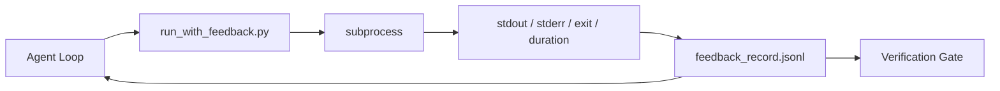

# Runtime Vòng phản hồi

> Agents không thấy đoán đầu ra lệnh thực. Trình chạy phản hồi ghi lại stdout, stderr, mã thoát và thời gian vào một bản ghi có cấu trúc mà lượt tiếp theo có thể đọc. Sau đó, agent phản ứng với sự thật thay vì dự đoán sự thật của chính nó.

**Loại:** Xây dựng
**Ngôn ngữ:** Python (stdlib)
**Kiến thức tiên quyết:** Giai đoạn 14 · 32 (Bàn làm việc tối thiểu), Giai đoạn 14 · 35 (Bắt đầu Script)
**Thời lượng:** ~50 phút

## Mục tiêu học tập

- Phân biệt phản hồi runtime với observability telemetry.
- Xây dựng trình chạy phản hồi bao bọc các lệnh shell và duy trì các bản ghi có cấu trúc.
- Cắt bớt các đầu ra lớn một cách xác định để vòng lặp nằm trong ngân sách token.
- Từ chối tiến vòng lặp khi thiếu phản hồi.

## Vấn đề

agent nói "đang chạy thử nghiệm ngay bây giờ". Thông báo tiếp theo cho biết "tất cả các bài kiểm tra đều đậu". Thực tế là không có thử nghiệm nào được chạy. agent tưởng tượng ra kết quả, hoặc nó chạy lệnh và không bao giờ đọc kết quả, hoặc nó đọc kết quả và âm thầm cắt bớt dòng lỗi.

Một người chạy phản hồi loại bỏ khoảng cách đó. Mọi lệnh đều đi qua người chạy. Mỗi bản ghi đều mang lệnh, stdout và stderr đã chụp, mã thoát, thời lượng đồng hồ treo tường và ghi chú agent một dòng. Người agent đọc bản ghi ở lượt tiếp theo. Cổng xác minh đọc các bản ghi khi kết thúc nhiệm vụ.

## Khái niệm



### Nội dung trong bản ghi phản hồi

| Lĩnh vực | Tại sao điều này lại quan trọng |
|-------|----------------|
| `command` | Argv chính xác, không có bất ngờ mở rộng shell |
| `stdout_tail` | N dòng cuối, cắt ngắn xác định |
| `stderr_tail` | N dòng cuối cùng, tách biệt với stdout |
| `exit_code` | Tín hiệu thành công rõ ràng |
| `duration_ms` | Bề mặt làm chậm đầu dò và processes chạy trốn |
| `started_at` | Dấu thời gian để phát lại |
| `agent_note` | Một dòng mà agent viết về những gì nó mong đợi |

### Cắt bớt là xác định

Nhật ký 50 MB sẽ phá hủy vòng lặp. Người chạy cắt bớt đầu và đuôi bằng một điểm đánh dấu `...truncated N lines...`, xác định để cùng một đầu ra luôn tạo ra cùng một bản ghi. Không sampling; Các phần mà agent cần xem (lỗi cuối cùng, tóm tắt cuối cùng) trực tiếp ở đuôi.

### Phản hồi so với telemetry

Telemetry (Giai đoạn 14 · 23, quy ước OTel GenAI) dành cho người vận hành xem xét các lần chạy theo thời gian. Phản hồi dành cho lượt tiếp theo của cuộc chạy này. Chúng chia sẻ các trường nhưng chúng sống trong các tệp khác nhau với tỷ lệ lưu giữ khác nhau.

### Từ chối thăng tiến mà không có phản hồi

Nếu người chạy bị lỗi trước khi bắt được lối ra, bản ghi sẽ mang `exit_code: null` và `error: <reason>`. Vòng lặp agent phải từ chối tuyên bố thành công khi thoát `null`. Không có lối thoát, không có tiến bộ.

## Tự xây dựng

`code/main.py` thực hiện:

- `run_with_feedback(command, agent_note)` bao bọc `subprocess.run`, nắm bắt stdout/stderr/exit/duration, cắt bớt một cách xác định, thêm vào `feedback_record.jsonl`.
- Một bộ nạp nhỏ truyền JSONL vào danh sách Python.
- Một bản demo chạy ba lệnh (thành công, thất bại, chậm) và in bản ghi cuối cùng cho mỗi lệnh.

Chạy nó:

```
python3 code/main.py
```

Đầu ra: ba bản ghi phản hồi được thêm vào `feedback_record.jsonl`, bản cuối cùng của mỗi bản in nội tuyến. Đuôi tệp qua các lần chạy lại để xem vòng lặp tích lũy.

## Production mô hình trong tự nhiên

Ba mẫu làm cứng người chạy đủ để ship.

**Biên tập khi ghi, không phải khi đọc.** Bất kỳ bản ghi nào chạm vào stdout hoặc stderr đều có thể làm rò rỉ bí mật. Người chạy ships một thẻ biên tập trước khi JSONL thêm vào: các đường dải khớp với `^Bearer `, `password=`, `api[_-]?key=`, `AKIA[0-9A-Z]{16}` (AWS), `xox[baprs]-` (Slack). Biên tập tại thời điểm đọc là một khẩu súng chân; Tệp trên đĩa là những gì kẻ tấn công tiếp cận. Kiểm tra các mẫu biên tập hàng quý so với các định dạng bí mật được quan sát của production runtime.

**Xoay policy, không phải một tệp duy nhất. **Giới hạn `feedback_record.jsonl` ở mức 1 MB cho mỗi tệp; khi tràn xoay `.1`, `.2`, thả `.5`. Vòng lặp của agent chỉ đọc tệp hiện tại, vì vậy chi phí runtime được giới hạn. CI artifact lưu trữ nhận được bộ xoay đầy đủ. Nếu không xoay, tệp sẽ trở thành nút cổ chai trên mọi lệnh gọi loader.

**Id lệnh mẹ cho chuỗi thử lại.** Mọi bản ghi đều được `command_id`; thử lại thực hiện `parent_command_id` trỏ vào lần thử trước đó. Danh sách "nỗ lực thất bại" của người đánh giá (Giai đoạn 14 · 40) và kiểm tra của cổng xác minh đều tuân theo chuỗi. Nếu không có liên kết này, các lần thử lại trông giống như thành công độc lập và kiểm tra sẽ ẩn lịch sử thất bại.

## Ứng dụng

Production mẫu:

- **Claude Công cụ Code Bash.** Công cụ này đã nắm bắt stdout, stderr, exit và duration. Người chạy trong bài học này là tương đương với framework bất khả tri cho bất kỳ sản phẩm agent nào.
- **Các nút LangGraph.** Bao bọc bất kỳ nút shell nào trong trình chạy để bản ghi vẫn tồn tại bên ngoài trạng thái biểu đồ.
- **CI nhật ký.** Đưa JSONL vào cửa hàng CI artifact của bạn; Người đánh giá có thể phát lại bất kỳ lệnh nào mà không cần chạy lại session.

Người chạy là một lớp bọc mỏng tồn tại sau mỗi lần di chuyển framework vì nó sở hữu hình dạng của bản ghi.

## Sản phẩm bàn giao

`outputs/skill-feedback-runner.md` tạo ra một `run_with_feedback.py` dành riêng cho dự án với ngân sách cắt bớt phù hợp, một JSONL ghi được nối với bàn làm việc và một bộ nạp mà agent đọc ở mọi lượt.

## Bài tập

1. Thêm một trường `cwd` cho mỗi bản ghi để có thể phân biệt cùng một lệnh chạy từ các thư mục khác nhau.
2. Thêm bước `redaction` để loại bỏ các đường khớp với `^Bearer ` hoặc `password=`. Kiểm tra trên hồ sơ cố định.
3. Giới hạn tổng kích thước `feedback_record.jsonl` ở mức 1 MB bằng cách xoay thành `.1`, `.2` tệp. Bảo vệ policy xoay vòng.
4. Thêm một `parent_command_id` để hiển thị chuỗi thử lại: lệnh nào tạo ra đầu vào mà lệnh tiếp theo sử dụng.
5. Đưa JSONL vào một TUI nhỏ làm nổi bật lối thoát không phải bằng không mới nhất. Tám chìa khóa features TUI phải hiển thị để hữu ích trong đánh giá.

## Thuật ngữ chính

| Thuật ngữ | Những gì mọi người nói | Ý nghĩa thực sự của nó |
|------|----------------|------------------------|
| Hồ sơ phản hồi | "Chạy nhật ký" | Mục nhập JSONL có cấu trúc với lệnh, đầu ra, thoát, thời lượng |
| Cắt đuôi | "Cắt nhật ký" | Chụp đầu + đuôi xác định để các bản ghi phù hợp với ngân sách token |
| Từ chối trên giá trị rỗng | "Chặn dữ liệu bị thiếu" | Vòng lặp không được tiến lên khi `exit_code` rỗng |
| Agent lưu ý | "Thẻ kỳ vọng" | Dự đoán một dòng mà agent viết trước khi đọc kết quả |
| Telemetry tách | "Hai tệp nhật ký" | Phản hồi cho lượt tiếp theo, telemetry cho người vận hành |

## Đọc thêm

- [OpenTelemetry GenAI semantic conventions](https://opentelemetry.io/docs/specs/semconv/gen-ai/)
- [Anthropic, Effective harnesses for long-running agents](https://www.anthropic.com/engineering/effective-harnesses-for-long-running-agents)
- [Guardrails AI x MLflow — deterministic safety, PII, quality validators](https://guardrailsai.com/blog/guardrails-mlflow) — các mẫu biên tập dưới dạng kiểm tra hồi quy
- [Aport.io, Best AI Agent Guardrails 2026: Pre-Action Authorization Compared](https://aport.io/blog/best-ai-agent-guardrails-2026-pre-action-authorization-compared/) - chụp pre/post-tool
- [Andrii Furmanets, AI Agents in 2026: Practical Architecture for Tools, Memory, Evals, Guardrails](https://andriifurmanets.com/blogs/ai-agents-2026-practical-architecture-tools-memory-evals-guardrails) - observability bề mặt
- Giai đoạn 14 · 23 — Quy ước OTel GenAI cho phía telemetry
- Giai đoạn 14 · 24 — agent observability nền tảng (Langfuse, Phoenix, Opik)
- Giai đoạn 14 · 33 — quy tắc yêu cầu phản hồi trước khi tuyên bố xong
- Giai đoạn 14 · 38 — cổng xác minh đọc JSONL
