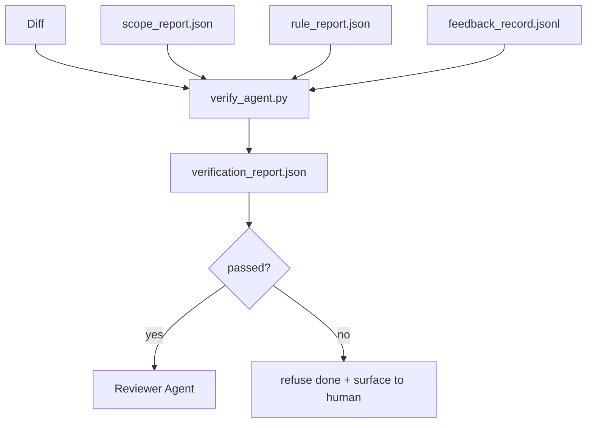

# Cổng xác minh

> agent không được đánh dấu công việc của chính mình là đã hoàn thành. Cổng xác minh đọc hợp đồng phạm vi, nhật ký phản hồi, báo cáo quy tắc và khác biệt và trả lời một câu hỏi duy nhất: nhiệm vụ này có thực sự hoàn thành không? Nếu cổng nói không, nhiệm vụ vẫn chưa hoàn thành, bất kể cuộc trò chuyện nói gì.

**Loại:** Xây dựng
**Ngôn ngữ:** Python (stdlib)
**Kiến thức tiên quyết:** Giai đoạn 14 · 33 (Quy tắc), Giai đoạn 14 · 36 (Phạm vi), Giai đoạn 14 · 37 (Phản hồi)
**Thời lượng:** ~55 phút

## Mục tiêu học tập

- Xác định cổng xác minh dưới dạng hàm xác định trên artifacts bàn làm việc.
- Kết hợp báo cáo quy tắc, báo cáo phạm vi, bản ghi phản hồi và khác biệt thành một phán quyết duy nhất.
- Phát ra một `verification_report.json` người đánh giá agent và CI đều có thể đọc.
- Từ chối thúc đẩy một nhiệm vụ khi bất kỳ lỗi nghiêm trọng nào của khối, không có ngoại lệ.

## Vấn đề

Agents tuyên bố thành công quá dễ dàng. Ba hình dạng thất bại chiếm ưu thế:

- "Trông ổn." model đọc diff của chính mình và quyết định rằng nó đúng.
- "Các bài kiểm tra đã vượt qua." Nói với sự tự tin. Không có hồ sơ về thử nghiệm thực sự chạy.
- "Đã được chấp nhận." Tiêu chí chấp nhận được giải thích đủ lỏng lẻo để có nghĩa là "bất cứ điều gì giống như đã làm".

Bản sửa lỗi bàn làm việc là một cổng xác minh duy nhất đọc artifacts agent đã tạo ra và thực hiện cuộc gọi. Cổng là xác định. Cổng nằm trong kiểm soát phiên bản. Cổng được nối dây vào CI. Người agent không thể hối lộ nó.

## Khái niệm



### Những gì cổng kiểm tra

| Kiểm tra | Nguồn artifact | Mức độ nghiêm trọng |
|-------|-----------------|----------|
| Tất cả các lệnh chấp nhận đều chạy | `feedback_record.jsonl` | khối |
| Tất cả các lệnh chấp nhận thoát khỏi số không | `feedback_record.jsonl` | khối |
| Kiểm tra phạm vi không có ghi bị cấm | `scope_report.json` | khối |
| Kiểm tra phạm vi không có ghi ngoài phạm vi | `scope_report.json` | chặn hoặc cảnh báo |
| Tất cả các quy tắc về mức độ nghiêm trọng của khối đều vượt qua | `rule_report.json` | khối |
| Không có mã thoát `null` trong phản hồi | `feedback_record.jsonl` | khối |
| Các tệp được chạm khớp với `scope.allowed_files` | cả hai | Cảnh báo |

Một phát hiện `warn` chú thích phán quyết; Một phát hiện `block` ngăn chặn `passed: true`.

### Xác định, không xác suất

Cổng phải đưa ra cùng một phán quyết cho cùng một artifact được đặt mỗi lần. Không LLM thẩm phán. LLM giám khảo thuộc về phía người phản biện (Giai đoạn 14 · 39) trong đó mục tiêu là đánh giá định tính, không phải địa vị.

### Một báo cáo, một đường dẫn

Cổng phát ra một `verification_report.json` cho mỗi lần đóng nhiệm vụ, được viết dưới `outputs/verification/<task_id>.json`. CI tiêu thụ cùng một đường dẫn. Nhiều cánh cổng với những con đường khác nhau phân nhánh nguồn gốc của sự thật.

### Từ chối mà không có ngoại lệ

Các phát hiện về mức độ nghiêm trọng của khối không thể bị agent ghi đè. Chúng chỉ có thể được ghi đè bởi con người, với `override_reason` được ghi lại và id người dùng `overridden_by`. Việc ghi đè là một thay đổi đã ký, không phải là một quyết định agent.

## Tự xây dựng

`code/main.py` thực hiện:

- Một bộ tải cho mỗi artifact đầu vào, tất cả đều được sơ khai cục bộ để bài học khép kín.
- Một chức năng `verify(task_id, artifacts) -> VerdictReport` thuần túy.
- Máy in hiển thị kết quả mỗi lần kiểm tra và pass/fail. cuối cùng
- Một bản demo với ba kịch bản nhiệm vụ: vượt qua sạch, phạm vi creep, chấp nhận thiếu.

Chạy nó:

```
python3 code/main.py
```

Đầu ra: ba báo cáo phán quyết, mỗi báo cáo được lưu bên cạnh script.

## Production mô hình trong tự nhiên

Bốn mô hình nâng cánh cổng từ "một công việc lint khác" lên "cạnh quyết định".

**Phòng thủ chuyên sâu, không phải cổng đơn.** Kiểm tra trạng thái commit hook → CI trước → xác thực công cụ trước hook → cổng merge trước. Mỗi lớp là xác định nên một lỗi trong một lớp sẽ bị lớp tiếp theo bắt. Cẩm nang tháng 3 năm 2026 của microservices.io rất rõ ràng: commit hook trước không thể bỏ qua bởi vì, không giống như skill phía model, nó không phụ thuộc vào agent hướng dẫn sau. Cổng xác minh nằm ở lớp CI / trước khi merge.

**Phòng thủ bằng cách kiểm tra xác định, chỉ đánh giá model cho sắc thái.** Ghép nối Hybrid Norm năm 2026 của Anthropic: phần thưởng có thể xác minh (kiểm tra đơn vị, kiểm tra schema, mã thoát) trả lời "mã có giải quyết được vấn đề không?" - LLM câu trả lời của bảng đánh giá "mã có thể đọc được, an toàn, đúng phong cách không?" Cổng chạy class đầu tiên; người phản biện (Giai đoạn 14 · 39) chạy phần thứ hai. Trộn chúng sẽ làm sụp đổ tín hiệu.

**Nhật ký ghi đè đã ký, không phải threads Slack.** Mỗi ghi đè sẽ phát ra một hàng trong `outputs/verification/overrides.jsonl` với: dấu thời gian, mã tìm, lý do, người dùng ký, commit HEAD hiện tại. runtime từ chối bất kỳ ghi đè nào thiếu chữ ký; Dấu vết kiểm toán được theo dõi git. Đây là ranh giới giữa policy ghi đè và rạp hát ghi đè.

**Mức độ bao phủ dưới dạng kiểm tra class trước.** Một `coverage_report.json` cung cấp kiểm tra `coverage_floor` (mặc định 80%). Cổng bị hỏng nếu phạm vi đo được giảm xuống dưới sàn hoặc dưới sàn của merge trước hơn 1 điểm phần trăm. Nếu không có kiểm tra này, agents lặng lẽ xóa các thử nghiệm không thành công và báo cáo xác minh vẫn có màu xanh lục.

**Chế độ `--strict` thúc đẩy cảnh báo bị chặn.** Đối với branches phát hành, PR chặn ship hoặc phân loại sau sự cố, `--strict` làm cho mọi cảnh báo trở nên thất bại. Cờ được branch chọn tham gia; không phải là mặc định toàn cầu, bởi vì nghiêm ngặt về mọi thứ ăn mòn dòng chảy hàng ngày.

## Ứng dụng

Production mẫu:

- **CI bước.** Một công việc `verify_agent` chạy cánh cổng chống lại artifacts cuối cùng của agent. Merge bảo vệ từ chối mà không có `passed: true`.
- **hook trước khi bàn giao.** agent runtime gọi cổng trước khi tạo tài liệu chuyển giao. Không có phán quyết xanh, không bàn giao.
- **Phân loại thủ công.** Người vận hành đọc báo cáo khi một agent tuyên bố thành công và con người nghi ngờ điều đó.

Cổng là cạnh quyết định trong quy trình bàn làm việc. Mọi bề mặt khác đều ở thượng nguồn của nó.

## Sản phẩm bàn giao

`outputs/skill-verification-gate.md` kết nối cổng vào một dự án cụ thể: lệnh chấp nhận nào cung cấp cho nó, quy tắc nào là mức độ nghiêm trọng của khối, ghi ngoài phạm vi nào được dung thứ, nhật ký kiểm tra ghi đè được lưu trữ như thế nào.

## Bài tập

1. Thêm kiểm tra `coverage_floor`: lệnh kiểm tra phải tạo báo cáo mức độ phù hợp với ít nhất 80%. Quyết định artifact nào mang sàn.
2. Hỗ trợ chế độ `--strict` thúc đẩy mọi `warn` lên `block`. Ghi lại các trường hợp mà chế độ nghiêm ngặt là mặc định đúng.
3. Làm cho cổng tạo ra một bản tóm tắt Markdown ngoài JSON. Bảo vệ trường nào thuộc về bản tóm tắt.
4. Thêm kiểm tra `time_since_last_human_touch`: bất kỳ tệp nào được chỉnh sửa trong vòng 60 giây sau khi gõ phím của con người đều được miễn cờ ngoài phạm vi.
5. Chạy cổng trên một agent khác biệt thực sự từ sản phẩm của bạn. Có bao nhiêu phát hiện là có thật và bao nhiêu là nhiễu? Cổng cần phát triển ở đâu?

## Thuật ngữ chính

| Thuật ngữ | Những gì mọi người nói | Ý nghĩa thực sự của nó |
|------|----------------|------------------------|
| Cổng xác minh | "Tấm séc ngăn chặn mọi thứ" | Chức năng xác định trên bàn làm việc artifacts đưa ra phán quyết pass/fail |
| Mức độ nghiêm trọng của khối | "Thất bại khó khăn" | Phát hiện ngăn chặn `passed: true` và yêu cầu ghi đè có chữ ký |
| Ghi đè nhật ký | "Tại sao chúng tôi để nó thông qua" | Các mục đã ký với lý do và id người dùng, được kiểm tra bằng cách xem xét |
| Lệnh chấp nhận | "Bằng chứng" | Một lệnh shell có lối thoát bằng không là ý nghĩa của `done` |
| Một đường dẫn báo cáo | "Nguồn sự thật" | `outputs/verification/<task_id>.json`, được tiêu thụ bởi CI cũng như con người |

## Đọc thêm

- [Anthropic, Harness design for long-running application development](https://www.anthropic.com/engineering/harness-design-long-running-apps)
- [OpenAI Agents SDK guardrails](https://platform.openai.com/docs/guides/agents-sdk/guardrails)
- [microservices.io, GenAI dev platform: guardrails](https://microservices.io/post/architecture/2026/03/09/genai-development-platform-part-1-development-guardrails.html) - phòng thủ theo chiều sâu từ trước commit đến CI
- [ICMD, The 2026 Playbook for Agentic AI Ops](https://icmd.app/article/the-2026-playbook-for-agentic-ai-ops-guardrails-costs-and-reliability-at-scale-1776661990431) - thang cổng phê duyệt (dự thảo phê duyệt → → ô tô dưới ngưỡng)
- [Type-Checked Compliance: Deterministic Guardrails (arXiv 2604.01483)](https://arxiv.org/pdf/2604.01483) — Lean 4 là giới hạn trên của cổng xác định
- [logi-cmd/agent-guardrails — merge gate spec](https://github.com/logi-cmd/agent-guardrails) - phạm vi + cổng kiểm tra đột biến
- [Guardrails AI x MLflow](https://guardrailsai.com/blog/guardrails-mlflow) — trình xác thực xác định như người ghi điểm CI
- [Akira, Real-Time Guardrails for Agentic Systems](https://www.akira.ai/blog/real-time-guardrails-agentic-systems) — pre/post-tool cổng
- Giai đoạn 14 · 27 - prompt phòng thủ tiêm (cặp đối thủ của cổng)
- Giai đoạn 14 · 36 — phạm vi hợp đồng mà cổng này thực thi
- Giai đoạn 14 · 37 — nhật ký phản hồi mà cổng này ghi điểm
- Giai đoạn 14 · 39 — Người đánh giá agent cổng giao cho
