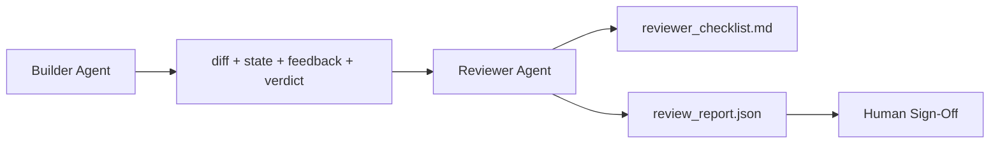

# Người đánh giá Agent: Trình tạo tách khỏi Điểm đánh dấu

> agent viết mã không thể chấm điểm nó. Người đánh giá là vòng lặp thứ hai với một system prompt khác, một mục tiêu khác và quyền truy cập chỉ đọc vào mọi thứ mà trình tạo đã tạo ra. Khoảng cách giữa người xây dựng và người đánh giá là nơi có hầu hết độ tin cậy.

**Loại:** Xây dựng
**Ngôn ngữ:** Python (stdlib)
**Kiến thức tiên quyết:** Giai đoạn 14 · 38 (Cổng xác minh)
**Thời lượng:** ~55 phút

## Mục tiêu học tập

- Nêu lý do tại sao cùng một agent không thể xem xét công việc của chính mình một cách đáng tin cậy.
- Xây dựng vòng lặp agent người đánh giá sử dụng artifacts của trình tạo và phát ra báo cáo đánh giá có cấu trúc.
- Tác giả một bảng đánh giá dành cho người đánh giá chấm điểm các kích thước cụ thể, không phải rung cảm.
- Kết nối người đánh giá vào bàn làm việc để bước đánh giá của con người bắt đầu từ một artifact thực sự.

## Vấn đề

Bạn yêu cầu agent sửa lỗi. Nó chỉnh sửa bốn tệp, chạy các bài kiểm tra và báo cáo đã hoàn thành. Cổng xác minh (Giai đoạn 14 · 38) xác nhận đã chạy nghiệm thu và phạm vi được giữ. Cánh cổng nói `passed: true`. Bạn merge. Hai ngày sau, bạn thấy rằng bản sửa lỗi đã giải quyết sai một nửa lỗi.

Chấp nhận là cần thiết, không đủ. Người đánh giá đặt ra những câu hỏi mà chấp nhận không thể hỏi: điều này có giải quyết đúng vấn đề không? Nó có mở rộng phạm vi mà không gắn cờ không? Nó có ghi lại các giả định đáng lẽ phải được đặt câu hỏi không? Nó có khiến bàn làm việc ở trạng thái mà session tiếp theo có thể nhặt được không?

## Khái niệm



### Phiếu đánh giá của người đánh giá

Năm chiều, mỗi thứ từ 0 đến 2.

| Kích thước | Câu hỏi |
|-----------|----------|
| Vấn đề phù hợp | Thay đổi có giải quyết được nhiệm vụ như đã nêu, không phải nhiệm vụ lân cận? |
| Phạm vi kỷ luật | Các chỉnh sửa bị giới hạn trong hợp đồng hay hợp đồng được phát triển một cách có chủ ý? |
| Giả định | Có phải tất cả các giả định ẩn được viết ra ở đâu đó đều có thể xem xét được không? |
| Chất lượng xác minh | Lệnh chấp nhận có thực sự chứng minh mục tiêu, hay nó chứng minh một phiên bản yếu hơn? |
| Sẵn sàng bàn giao | Liệu session tiếp theo có thể tiếp tục hoàn toàn từ trạng thái hiện tại? |

Tổng cộng trong số 10. Một lần chạy dưới 7 là một thất bại mềm; Chạy dưới 5 là một thất bại khó khăn.

### Người đánh giá là một vai trò riêng biệt, không phải là một model riêng biệt

Bạn có thể chạy trình đánh giá với cùng model với trình tạo. Kỷ luật là sự tách biệt vai trò: system prompt khác nhau, đầu vào khác nhau, không có quyền truy cập ghi vào diff. Sự thay đổi trong tư thế là sự thay đổi trong tín hiệu.

### Người phản biện không thể chỉnh sửa diff

Người đánh giá đọc sự khác biệt, trạng thái, phản hồi, phán quyết. Nó viết một báo cáo. Nó không vá sự khác biệt. Nếu báo cáo cho biết "khắc phục điều này", lượt xây dựng tiếp theo sẽ thực hiện việc khắc phục; Người đánh giá quay lại đánh giá. Trộn vai trò đánh bại khoảng cách.

### Phiếu đánh giá của người đánh giá so với cổng xác minh

Cổng (Giai đoạn 14 · 38) kiểm tra các sự kiện xác định: có chấp nhận không, quy tắc có thông qua không, phạm vi có giữ không. Người phản biện đưa ra đánh giá định tính: đây có phải là công việc đúng không, nó có được ghi lại không, việc bàn giao có thể sử dụng được không. Cả hai đều là bắt buộc.

## Tự xây dựng

`code/main.py` thực hiện:

- Một lớp dữ liệu `ReviewerInputs` gói các artifacts mà người đánh giá đọc.
- Một công cụ ghi điểm theo tiêu chí với một chức năng cho mỗi thứ nguyên. Mỗi hàm là xác định và cấp sơ khai cho bài học; triển khai thực sẽ gọi LLM.
- Một nhà văn `review_report.json` với năm điểm, tổng số và một phán quyết (`pass`, `soft_fail`, `hard_fail`).
- Hai trường hợp demo: thay đổi sạch và thay đổi "kiểm tra đúng, vấn đề sai".

Chạy nó:

```
python3 code/main.py
```

Đầu ra: hai báo cáo đánh giá được viết vào đĩa và một bảng điều khiển về điểm số chiều.

## Production mô hình trong tự nhiên

Biên lai: Hệ thống Đánh giá mã AI tháng 4 năm 2026 của Cloudflare đã chạy 131.246 lần đánh giá trên 48.095 yêu cầu merge trong 5.169 repos trong 30 ngày. Đánh giá trung bình hoàn thành trong 3 phút 39 giây. Tối đa bảy chuyên gia đánh giá (bảo mật, hiệu suất, chất lượng mã, tài liệu, quản lý phát hành, tuân thủ, Codex kỹ thuật) chạy song song dưới Điều phối viên đánh giá để loại bỏ các phát hiện trùng lặp và đánh giá mức độ nghiêm trọng. model cấp cao nhất dành riêng cho điều phối viên; Các chuyên gia chạy trên các cấp rẻ hơn.

Bốn mẫu làm cho điều này hoạt động trên quy mô lớn.

**Nhóm chuyên gia, không phải một người đánh giá lớn.** Một người đánh giá với bảng đánh giá 5 chiều hoạt động cho repos solo. Khi cơ sở mã có các bề mặt quan trọng về bảo mật, hiệu suất và tài liệu, hãy chia thành các chuyên gia có prompts nhỏ hơn. Điều phối viên thực hiện loại bỏ trùng lặp; Các chuyên gia không bao giờ chạy bảng đánh giá đầy đủ. Sự tách biệt Model cấp rơi ra: chuyên gia giá rẻ, điều phối viên đắt tiền.

**Bias giảm thiểu là yêu cầu thiết kế, không phải tối ưu hóa.** LLM giám khảo cho thấy bốn thành kiến đáng tin cậy (Adnan Masood, tháng 4 năm 2026): vị trí bias (GPT-4 ~40% không nhất quán về thứ tự (A, B) so với (B, A), bias độ dài dòng (~15% lạm phát điểm đối với đầu ra dài hơn), sở thích bản thân (giám khảo thích đầu ra từ cùng một họ model), thẩm quyền (đánh giá đánh giá quá cao tham chiếu đến các tác giả đã biết). Giảm thiểu: đánh giá cả hai thứ tự và chỉ tính các chiến thắng nhất quán; sử dụng 1-4 thang đo khen thưởng rõ ràng sự ngắn gọn; luân phiên thẩm phán model gia đình; tước tên tác giả trước khi chấm điểm.

**Bộ hiệu chuẩn, không phải rung cảm.** Bộ lịch sử nhiệm vụ 10-20 với các phán quyết chính xác đã biết. Chạy người đánh giá qua nó trên mỗi prompt thay đổi. Nếu sự đồng ý với hồ sơ lịch sử giảm xuống dưới 80%, bảng đánh giá cần được sửa đổi trước khi người phản biện ships. Đây là điều mà mọi đội cuối cùng cũng khám phá lại; Tốt hơn là bắt đầu với nó.

**Định mức kết hợp với cổng.** Cổng xác minh (Giai đoạn 14 · 38) xử lý các kiểm tra xác định (đã chấp nhận chạy, kiểm tra có vượt qua không, phạm vi có giữ không). Người phản biện xử lý các kiểm tra ngữ nghĩa (đây có phải là công việc đúng không, là các giả định được ghi lại, việc chuyển giao có thể sử dụng được không). Hướng dẫn năm 2026 của Anthropic rất rõ ràng về sự phân chia này: đừng yêu cầu người đánh giá làm lại những gì cổng đã chứng minh.

## Ứng dụng

Production mẫu:

- **Claude Mã subagents.** Trình đánh giá subagent chạy sau khi trình tạo đóng một tác vụ. Nó đăng một nhận xét trên PR với điểm đánh giá.
- **OpenAI Agents SDK bàn giao.** Người xây dựng giao cho Người đánh giá khi hoàn thành nhiệm vụ. Người đánh giá có thể trả lại danh sách các phát hiện hoặc cho con người.
- **Ghép nối hai model.** Trình tạo chạy trên model nhanh hơn, rẻ hơn. Người đánh giá chạy trên một model mạnh hơn với ngữ cảnh nhỏ hơn, tập trung vào phán đoán.

Người đánh giá là cặp mắt thứ hai mà bàn làm việc phát triển khi con người không thể tự mình thực hiện mọi đánh giá.

## Sản phẩm bàn giao

`outputs/skill-reviewer-agent.md` tạo ra một tiêu chí đánh giá dành riêng cho dự án, một sơ khai agent người đánh giá được kết nối với artifacts của trình tạo và tích hợp với cổng xác minh để đánh giá của con người bắt đầu từ một báo cáo bằng văn bản thay vì một trang trống.

## Bài tập

1. Thêm thứ nguyên thứ sáu cụ thể cho miền sản phẩm của bạn. Bảo vệ lý do tại sao nó không được hấp thụ bởi năm người hiện có.
2. Chạy trình đánh giá với hai prompts hệ thống khác nhau (ngắn gọn, dài dòng). Cái nào tạo ra một báo cáo mà con người có nhiều khả năng đọc hơn?
3. Thêm trường `confidence` cho mỗi thứ nguyên. Từ chối ship báo cáo khi độ tin cậy vào thứ nguyên thấp nhất dưới 0,6.
4. Xây dựng bộ hiệu chuẩn: 10 kết thúc nhiệm vụ lịch sử với các phán quyết chính xác đã biết. Chạy người đánh giá qua chúng. Nó không đồng ý với ghi chép lịch sử ở đâu?
5. Thêm khả năng "yêu cầu thêm bằng chứng": người đánh giá có thể yêu cầu người xây dựng chạy thử nghiệm cụ thể trước khi chấm điểm. Back-off phù hợp là gì để điều này không lặp lại?

## Thuật ngữ chính

| Thuật ngữ | Những gì mọi người nói | Ý nghĩa thực sự của nó |
|------|----------------|------------------------|
| Phiếu đánh giá của người đánh giá | "Danh sách kiểm tra" | Chấm điểm 0-2 năm chiều với một câu hỏi bằng văn bản cho mỗi chiều |
| Thất bại mềm | "Cần sửa đổi" | Tổng số dưới 7; Builder nhận được những phát hiện để giải quyết |
| Thất bại khó khăn | "Từ chối" | Tổng dưới 5 hoặc bất kỳ thứ nguyên nào ở 0; dừng lại và bề mặt với con người |
| Tách vai trò | "Các prompt khác nhau" | Cùng một model có thể là cả hai vai trò; Kỷ luật là đầu vào và tư thế |
| Sàn tự tin | "Đừng ship báo cáo tín hiệu thấp" | Từ chối đưa ra phán quyết khi bảng đánh giá không chắc chắn |

## Đọc thêm

- [OpenAI Agents SDK handoffs](https://platform.openai.com/docs/guides/agents-sdk/handoffs)
- [Anthropic Claude Code subagents](https://docs.anthropic.com/en/docs/agents-and-tools/claude-code/sub-agents)
- [Cloudflare, Orchestrating AI Code Review at Scale](https://blog.cloudflare.com/ai-code-review/) - kiến trúc 7 chuyên gia + điều phối viên, 131k chạy / 30 ngày
- [Agent-as-a-Judge: Evaluating Agents with Agents (OpenReview / ICLR)](https://openreview.net/forum?id=DeVm3YUnpj) — DevAI benchmark, yêu cầu giải pháp phân cấp 366
- [Adnan Masood, Rubric-Based Evaluations and LLM-as-a-Judge: Methodologies, Biases, Empirical Validation](https://medium.com/@adnanmasood/rubric-based-evals-llm-as-a-judge-methodologies-and-empirical-validation-in-domain-context-71936b989e80) - 4 thành kiến và giảm thiểu
- [MLflow, LLM-as-a-Judge Evaluation](https://mlflow.org/llm-as-a-judge) - production dụng cụ cho các builder/evaluator riêng biệt
- [LangChain, How to Calibrate LLM-as-a-Judge with Human Corrections](https://www.langchain.com/articles/llm-as-a-judge) - quy trình làm việc được thiết lập hiệu chuẩn
- [Evidently AI, LLM-as-a-judge: a complete guide](https://www.evidentlyai.com/llm-guide/llm-as-a-judge)
- [Arize, LLM as a Judge — Primer and Pre-Built Evaluators](https://arize.com/llm-as-a-judge/)
- Giai đoạn 14 · 05 — Tự tinh chỉnh và PHÊ BÌNH (cơ sở tự đánh giá một agent)
- Giai đoạn 14 · 30 - Phát triển agent dựa trên đánh giá (bộ tạo hiệu chuẩn)
- Giai đoạn 14 · 38 — cổng xác minh mà người đánh giá đọc
- Giai đoạn 14 · 40 — gói bàn giao mà báo cáo của người đánh giá cung cấp
