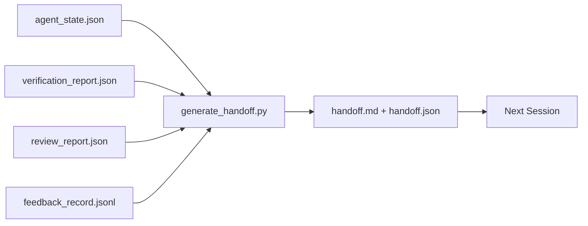

# Chuyển giao nhiều Session

> Cuộc session sẽ kết thúc. Công việc thì không. Gói bàn giao là artifact biến "agent làm việc trong một giờ" thành "session tiếp theo làm việc hiệu quả trong phút đầu tiên". Xây dựng nó có chủ đích, không phải là một suy nghĩ sau.

**Loại:** Xây dựng
**Ngôn ngữ:** Python (stdlib)
**Kiến thức tiên quyết:** Giai đoạn 14 · 34 (Bộ nhớ Repo), Giai đoạn 14 · 38 (Xác minh), Giai đoạn 14 · 39 (Người phản biện)
**Thời lượng:** ~50 phút

## Mục tiêu học tập

- Xác định bảy trường mà mọi gói chuyển giao cần.
- Tạo bàn giao từ bàn làm việc artifacts không có văn xuôi viết tay.
- Cắt nhật ký phản hồi lớn thành một bản tóm tắt có kích thước bàn giao.
- Làm cho hành động đầu tiên của session tiếp theo trở nên quyết định.

## Vấn đề

session kết thúc. agent nói "tuyệt vời, chúng tôi đã tiến bộ." session tiếp theo mở ra. agent tiếp theo hỏi "chúng ta đã dừng lại ở đâu?" Câu trả lời của agent đầu tiên đã biến mất. agent tiếp theo khám phá lại, chạy lại các lệnh tương tự, hỏi lại con người những câu hỏi tương tự và đốt cháy ba mươi phút để khôi phục ba mươi giây cuối cùng của session trước.

Chi phí của một bàn giao tồi được trả mỗi session cho suốt thời gian của nhiệm vụ. Bản sửa lỗi là một gói được tạo tự động ở session cuối: những gì đã thay đổi, tại sao, những gì đã được thử, những gì thất bại, những gì còn lại, những gì phải làm trước vào lần sau.

## Khái niệm



### Bảy lĩnh vực mà mỗi lần chuyển giao mang theo

| Lĩnh vực | Câu hỏi nó trả lời |
|-------|---------------------|
| `summary` | Một đoạn về những gì đã được thực hiện |
| `changed_files` | Sơ lược về sự khác biệt |
| `commands_run` | Những gì đã thực sự được thực hiện |
| `failed_attempts` | Những gì đã được thử và tại sao nó không hiệu quả |
| `open_risks` | Điều gì có thể cắn vào session tới, với mức độ nghiêm trọng |
| `next_action` | Bước cụ thể đầu tiên session tiếp theo thực hiện |
| `verdict_pointer` | Đường dẫn đến báo cáo xác minh + xem xét |

Trường `next_action` là trường chịu lực. Một bàn giao với mọi thứ ngoại trừ `next_action` là một báo cáo trạng thái, không phải là một bàn giao.

### Bàn giao được tạo chứ không phải bằng văn bản

Bàn giao viết tay là bàn giao bị bỏ qua vào một ngày vất vả. Máy phát điện đọc artifacts bàn làm việc và phát ra gói. Công việc của agent là để bàn làm việc ở trạng thái mà trình tạo có thể tóm tắt, chứ không phải viết tóm tắt.

### Hai dạng: con người có thể đọc được và máy có thể đọc được

`handoff.md` là những gì con người đọc. `handoff.json` là những gì agent tiếp theo tải. Cả hai đều đến từ cùng một nguồn artifacts. Nếu họ phân kỳ, JSON sẽ thắng.

### Cắt nhật ký phản hồi

Toàn bộ `feedback_record.jsonl` có thể là hàng trăm bài dự thi. Việc chuyển giao chỉ mang K cuối cùng cộng với mọi mục nhập có lối ra không phải bằng không. session tiếp theo tải toàn bộ nhật ký nếu cần, nhưng gói vẫn nhỏ.

### Để lại trạng thái sạch sẽ

Một bàn giao mô tả công việc. Trạng thái sạch sẽ làm cho công việc có thể tiếp tục. Chúng không giống nhau. Một `handoff.md` hoàn hảo sẽ vô giá trị nếu session tiếp theo mở ra một diff được áp dụng một nửa, một tệp tạm thời mà agent đã quên, một branch đi lạc và kiểm tra lỗi đó trước khi chúng chạy. agent tiếp theo sau đó dành mười phút đầu tiên để dọn dẹp sau lần cuối cùng thay vì xây dựng và chi phí tăng lên mỗi session trong suốt thời gian của nhiệm vụ.

Vì vậy, session không kết thúc khi feature hoạt động. Nó kết thúc khi bàn làm việc ở trạng thái mà máy phát điện có thể tóm tắt và session tiếp theo có thể tin tưởng. Dọn dẹp là giai đoạn riêng của nó, chạy trước khi bàn giao, và đó là một cuộc kiểm tra, không phải là một thói quen, bởi vì một thói quen là thứ bị bỏ qua trong một ngày vất vả.

| Kiểm tra | Sạch sẽ có nghĩa là | Khối bẩn vì |
|-------|-------------|----------------------|
| Cây làm việc | Mọi thay đổi được cam kết hoặc được lưu trữ rõ ràng với một ghi chú | Một diff được áp dụng một nửa trông giống như công việc có chủ đích cho agent tiếp theo |
| Nhiệt độ artifacts | Không có `*.tmp`, dirs cào, bản in gỡ lỗi hoặc các khối được nhận xét để lại | Các tệp đi lạc làm ô nhiễm sự khác biệt và model tinh thần của agent tiếp theo |
| Kiểm tra | Màu xanh lá cây hoặc màu đỏ với lỗi được đặt tên bằng `open_risks` | Một bài kiểm tra màu đỏ im lặng là một cái bẫy trong session bước tiếp theo |
| Bảng Feature | Trạng thái `feature_list.json` phản ánh thực tế (Giai đoạn 14 · 36) | Một bảng cũ gửi session tiếp theo đến công việc đã hoàn thành |
| Branch | Trên branch dự kiến, không có HEAD tách rời, không có branches mồ côi | Sai branch có nghĩa là commit đầu tiên của session tiếp theo hạ cánh sai vị trí |

Giai đoạn dọn dẹp phát ra một `clean_state.json` các vấn đề chặn; Danh sách trống là điều kiện tiên quyết mà trình tạo chuyển giao xác nhận trước khi nó viết một gói. Một bàn giao được xây dựng trên một cái cây bẩn không phải là một bàn giao, nó là một mớ hỗn độn được chuyển tiếp. Hai artifacts cặp: dọn dẹp chứng minh bàn làm việc an toàn để rời đi, bàn giao chứng minh session tiếp theo biết bắt đầu từ đâu.

## Tự xây dựng

`code/main.py` thực hiện:

- Một trình tải tập hợp tiểu bang, phán quyết, đánh giá và phản hồi vào một `WorkbenchSnapshot` duy nhất.
- Một chức năng `generate_handoff(snapshot) -> (markdown, payload)`.
- Bộ lọc chọn các mục phản hồi K cuối cùng cộng với tất cả các lối thoát không phải không.
- Một bản demo chạy viết `handoff.md` và `handoff.json` bên cạnh script.

Chạy nó:

```
python3 code/main.py
```

Đầu ra: một nội dung bàn giao được in, cộng với cả hai tệp trên đĩa.

## Production mô hình trong tự nhiên

Codex CLI, Claude Code và OpenCode mỗi ship một câu chuyện nén khác nhau; Gói Handoff có cấu trúc nằm trên cả ba.

**Các chiến lược đầm nén khác nhau; gói tin schema không.** POST /v1/responses/compact của Codex CLI là một đốm màu AES mờ đục server mặt (đường dẫn nhanh cho OpenAI models); Dự phòng là một "tóm tắt bàn giao" cục bộ được thêm vào dưới dạng thông báo vai trò người dùng `_summary`. Claude Code chạy nén lũy tiến năm giai đoạn ở 95% ngữ cảnh. OpenCode ẩn thông báo dựa trên dấu thời gian cộng với tóm tắt LLM 5 tiêu đề. Ba cơ chế khác nhau, cùng một nhu cầu: tuần tự hóa những gì còn sót lại sau khi nén thành một artifact di động. Gói là artifact.

**Chuyển giao session mới không phải là nén chặt.** Nén kéo dài một session; Handoff đóng một cách sạch sẽ và bắt đầu phần tiếp theo. Khung Hermes Issue #20372 (tháng 4 năm 2026) là đúng: khi nén tại chỗ bắt đầu xuống cấp, agent nên viết một bàn giao nhỏ gọn, kết thúc session và tiếp tục trong bối cảnh mới. Gói là thứ làm cho quá trình chuyển đổi đó trở nên rẻ tiền. Sai lầm là tiếp tục nén cho đến khi chất lượng sụp đổ; Cách khắc phục là lập ngân sách cho việc bàn giao sớm, sạch sẽ.

**Một lần chuyển giao đang hoạt động cho mỗi branch và chủ đề.** Phối hợp nhiều agent gặp lỗi khi chuyển giao cũ nhiều hơn so với đầu ra model kém. Luôn bao gồm `branch`, `last_known_good_commit` và một `status` `active | superseded | archived`. Các bàn giao cũ được lưu trữ; Chỉ có người đang hoạt động mới lái session tiếp theo. Đây là sự khác biệt giữa bàn giao dưới dạng ghi chú và chuyển giao dưới dạng trạng thái.

**Kết thúc trước 50-75% ngữ cảnh, không phải ở tường.** Cẩm nang mẫu viết tay (CLAUDE.md + HANDOVER.md) báo cáo kết quả tốt nhất khi session kết thúc ở ngân sách ngữ cảnh 50-75% thay vì 95%. Trình tạo gói chạy sạch sẽ trước khi nén artifacts gây ô nhiễm trạng thái nguồn. Rẻ để viết trong khi bối cảnh còn nguyên vẹn; đắt tiền khi model đã mất đi vị trí của nó.

## Ứng dụng

Production mẫu:

- **Session hook cuối.** runtime kích hoạt máy phát điện khi người dùng đóng cuộc trò chuyện. Gói đi vào `outputs/handoff/<session_id>/`.
- **PR mẫu.** Đánh dấu của trình tạo cũng là một phần thân PR. Người đánh giá đọc nó mà không cần mở năm tệp khác.
- **Chuyển giao chéo agent.** Xây dựng với một sản phẩm (Mã Claude), tiếp tục với một sản phẩm khác (Codex). Gói là ngôn ngữ chung.

Gói nhỏ, thường xuyên và rẻ để sản xuất. Các hợp chất tiết kiệm chi phí với mỗi session.

## Sản phẩm bàn giao

`outputs/skill-handoff-generator.md` tạo ra một máy phát điện được điều chỉnh theo các đường dẫn artifact của dự án, một session hook cuối chạy nó và một `handoff.json` schema agent tiếp theo đọc khi khởi động.

## Bài tập

1. Thêm một trường `assumptions_to_validate` hiển thị mọi giả định mà trình tạo đã ghi lại nhưng người đánh giá không đạt điểm trên 1.
2. Cắt tóm tắt phản hồi theo cách khác nhau đối với các lần chạy không thành công so với những lần vượt qua. Bảo vệ sự bất đối xứng.
3. Bao gồm một danh sách "câu hỏi dành cho con người". Ngưỡng để một câu hỏi đưa vào gói so với tin nhắn trò chuyện là gì?
4. Làm cho máy phát điện trở nên idempotent: chạy nó hai lần tạo ra cùng một gói. Điều gì cần phải ổn định để điều đó được giữ vững?
5. Thêm phần "yêu cầu tiên quyết session tiếp theo" liệt kê chính xác artifacts session tiếp theo phải tải trước khi hành động.

## Thuật ngữ chính

| Thuật ngữ | Những gì mọi người nói | Ý nghĩa thực sự của nó |
|------|----------------|------------------------|
| Gói bàn giao | "Session tóm tắt" | Được tạo ra artifact mang bảy lĩnh vực, cả đánh dấu và JSON |
| Hành động tiếp theo | "Phải làm gì trước" | Một bước cụ thể bắt đầu session tiếp theo |
| Cắt phản hồi | "Tóm tắt nhật ký" | Bản ghi K cuối cùng cộng với mọi lối thoát không phải bằng không |
| Báo cáo trạng thái | "Những gì chúng tôi đã làm" | Một tài liệu bị thiếu `next_action`; hữu ích, nhưng không phải là bàn giao |
| Con trỏ phán quyết | "Biên lai" | Đường dẫn đến báo cáo xác minh + xem xét để truy xuất nguồn gốc |

## Đọc thêm

- [Anthropic, Effective harnesses for long-running agents](https://www.anthropic.com/engineering/effective-harnesses-for-long-running-agents)
- [OpenAI Agents SDK handoffs](https://platform.openai.com/docs/guides/agents-sdk/handoffs)
- [Codex Blog, Codex CLI Context Compaction: Architecture, Configuration, Managing Long Sessions](https://codex.danielvaughan.com/2026/03/31/codex-cli-context-compaction-architecture/) — POST /v1/responses/compact và dự phòng cục bộ
- [Justin3go, Shedding Heavy Memories: Context Compaction in Codex, Claude Code, OpenCode](https://justin3go.com/en/posts/2026/04/09-context-compaction-in-codex-claude-code-and-opencode) — so sánh độ nén của ba nhà cung cấp
- [JD Hodges, Claude Handoff Prompt: How to Keep Context Across Sessions (2026)](https://www.jdhodges.com/blog/ai-session-handoffs-keep-context-across-conversations/) — CLAUDE.md + HANDOVER.md, ngân sách ngữ cảnh 50-75%
- [Mervin Praison, Managing Handoffs in Multi-Agent Coding Sessions: Fresh Context Without Losing Continuity](https://mer.vin/2026/04/managing-handoffs-in-multi-agent-coding-sessions-fresh-context-without-losing-continuity/) — khung hệ thống phân tán
- [Hermes Issue #20372 — automatic fresh-session handoff when compression becomes risky](https://github.com/NousResearch/hermes-agent/issues/20372)
- [Hermes Issue #499 — Context Compaction Quality Overhaul](https://github.com/NousResearch/hermes-agent/issues/499) — prompts định hướng bàn giao trong Codex CLI
- [Microsoft Agent Framework, Compaction](https://learn.microsoft.com/en-us/agent-framework/agents/conversations/compaction)
- [OpenCode, Context Management and Compaction](https://deepwiki.com/sst/opencode/2.4-context-management-and-compaction)
- [LangChain, Context Engineering for Agents](https://www.langchain.com/blog/context-engineering-for-agents)
- Giai đoạn 14 · 34 — tệp trạng thái mà trình tạo đọc
- Giai đoạn 14 · 38 — Phán quyết xác minh các gói chỉ tại
- Giai đoạn 14 · 39 — Báo cáo của người phản biện được gói vào gói
