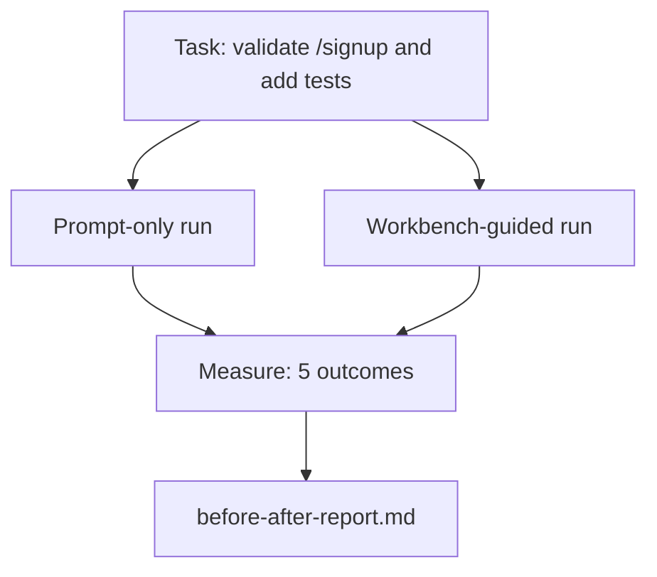

# Bàn làm việc trên một Repo thực sự

> Mười một bài học về bề mặt sẽ không có giá trị gì nếu chúng không tồn tại khi tiếp xúc với một cơ sở mã thực. Bài học này chạy cùng một tác vụ hai lần trên một ứng dụng mẫu nhỏ: chỉ prompt so với hướng dẫn bàn làm việc. Những con số làm cho cuộc tranh luận.

**Loại:** Xây dựng
**Ngôn ngữ:** Python (stdlib)
**Kiến thức tiên quyết:** Giai đoạn 14 · 32 đến 14 · 40
**Thời lượng:** ~60 phút

## Mục tiêu học tập

- Mang bảy bề mặt bàn làm việc lại với nhau trong một ứng dụng nhỏ.
- Chạy cùng một tác vụ hai lần (chỉ prompt và hướng dẫn bàn làm việc) và đo lường năm kết quả.
- Đọc báo cáo before/after và quyết định bề mặt nào mang lại đòn bẩy nhiều nhất.
- Bảo vệ bàn làm việc trước sự phản đối "nhưng model của tôi đủ tốt".

## Vấn đề

Một bản demo về một nhiệm vụ đồ chơi không thuyết phục được ai. Trường hợp của bàn làm việc được thực hiện khi một nhiệm vụ cảm giác thực tế trên một repo cảm giác thực hạ cánh production với ít lỗi hơn, ít hoàn nguyên hơn và một gói mà session tiếp theo có thể sử dụng.

Bài học này ships repo cảm giác thực tế đó và thực hiện cùng một nhiệm vụ thông qua cả hai pipelines. Kết quả là một báo cáo before/after bạn có thể đưa cho một người hoài nghi.

## Khái niệm



### Ứng dụng mẫu

Trình xử lý kiểu FastAPI tối thiểu trong `sample_app/`:

- `app.py` với `/signup` (chưa xác thực).
- `test_app.py` với một bài kiểm tra con đường hạnh phúc.
- `README.md` và `scripts/release.sh` làm mồi vùng cấm.

### Nhiệm vụ

> Thêm xác thực đầu vào vào `/signup`: từ chối mật khẩu ngắn hơn 8 ký tự, trả về 422 với phong bì lỗi đã nhập. Thêm một thử nghiệm chứng minh hành vi mới.

### Hai người pipelines

Chỉ dành cho Prompt:

1. Đọc README.
2. Đọc `app.py`.
3. Chỉnh sửa tệp.
4. Yêu cầu xong.

Workbench hướng dẫn:

1. Chạy init script (Bài 35).
2. Đọc hợp đồng phạm vi (Bài 36).
3. Trạng thái đọc (Bài 34).
4. Chỉ chỉnh sửa các tệp được phép.
5. Chạy lệnh chấp nhận thông qua trình chạy phản hồi (Bài 37).
6. Chạy cổng xác minh (Bài 38).
7. Chạy người phản biện (Bài 39).
8. Tạo handoff (Bài 40).

### Năm kết quả được đo lường

| Kết quả | Tại sao điều này lại quan trọng |
|---------|----------------|
| `tests_actually_run` | Hầu hết các tuyên bố "thử nghiệm đã đạt" đều không thể xác minh được |
| `acceptance_met` | Bài kiểm tra chứng minh mục tiêu phải là bài kiểm tra đã chạy |
| `files_outside_scope` | Scope creep là lỗi im lặng chiếm ưu thế |
| `handoff_quality` | session tiếp theo trả tiền hoặc hưởng lợi từ việc này |
| `reviewer_total` | Đánh giá định tính trên đỉnh cổng |

## Tự xây dựng

`code/main.py` điều phối hai pipelines dựa trên cùng một thiết bị cố định ứng dụng mẫu. Cả hai pipelines đều được viết kịch bản (không có LLM trong vòng lặp) nên phép đo có thể tái tạo. script viết so sánh thành `before-after-report.md` và `comparison.json`.

Chạy nó:

```
python3 code/main.py
```

Đầu ra: bảng điều khiển kết quả mỗi pipeline, báo cáo giảm giá được lưu bên cạnh script và JSON cho bất kỳ ai muốn lập biểu đồ.

## Production mô hình trong tự nhiên

Câu hỏi của người hoài nghi là "bàn làm việc thực sự giúp ích bao nhiêu?" Những con số năm 2026 nói lên nhiều điều hơn là lời giải thích.

**Terminal Bench Top-30 lên Top-5 trên cùng một model.** LangChain's *Anatomy of an Agent Harness* (tháng 4 năm 2026): một agent mã hóa đã nhảy từ bên ngoài top 30 lên xếp hạng thứ năm trên Terminal Bench 2.0 bằng cách chỉ thay đổi harness. Cùng model. Các bề mặt khác nhau. Đồng bằng hai mươi lăm bậc.

**Vercel giảm 80% đến 100% bằng cách xóa các công cụ.** Vercel báo cáo việc xóa 80% các công cụ của agent đã nâng tỷ lệ thành công từ 80% lên 100%. Bề mặt dụng cụ nhỏ hơn, phạm vi sắc nét hơn, ít cách hỏng hóc hơn. Không gian âm chiến thắng.

**Harvey accuracy gấp 2 lần chỉ thông qua harness.** agents pháp lý đã tăng hơn gấp đôi accuracy của họ thông qua tối ưu hóa harness, không có model thay đổi.

**88% các dự án AI agent doanh nghiệp không đạt được production.** Báo cáo preprints.org *Harness Engineering for Language Agents* (tháng 3 năm 2026) traces những thất bại trong việc runtime chứ không phải lý luận: tình trạng cũ kỹ, thử lại giòn, bối cảnh phát triển quá mức, phục hồi kém từ những sai lầm trung gian.

**Sự sụp đổ ngữ cảnh dài.** Mức độ thành công 40-50% cơ bản của WebAgent giảm xuống dưới 10% trong điều kiện ngữ cảnh dài, chủ yếu là từ các vòng lặp vô hạn và loss mục tiêu. Ralph Loop và gói chuyển giao tồn tại để hấp thụ điều đó.

**Âm tính giả vẫn tồn tại.** Các tác vụ thực tế một bước, lỗi mã nguồn một dòng, chạy bộ định dạng, bất cứ thứ gì mà model đã ghi nhớ nguyên văn — những tác vụ này chạy nhanh hơn prompt chỉ. Người benchmark nên liệt kê chúng một cách trung thực để bàn làm việc không bị đóng khung là quá mức cần thiết.

Bài học rút ra không phải là "harness chiến thắng mãi mãi". Models tiếp thu các thủ thuật harness theo thời gian. Bài học rút ra là ngày nay, tải trọng kỹ thuật nằm ở bảy bề mặt và những con số chứng minh điều đó.

## Ứng dụng

Bài học này là hồ sơ vụ án mà bạn trích dẫn khi:

- Có người hỏi tại sao mỗi PR đều mang theo một `agent-rules.md` và một hợp đồng phạm vi.
- Một nhóm muốn bỏ cổng xác minh "chỉ dành cho sprint này".
- Một sản phẩm agent mới ra mắt và bạn cần một benchmark di động để biết liệu nó có thực sự tiết kiệm thời gian hay không.

Những con số đi xa hơn lời giải thích.

## Sản phẩm bàn giao

`outputs/skill-workbench-benchmark.md` là một harness đánh giá di động chạy bất kỳ sản phẩm agent nào thông qua cả hai pipelines dựa trên ứng dụng mẫu của chính dự án và báo cáo năm kết quả.

## Bài tập

1. Thêm kết quả thứ sáu: thời gian chỉnh sửa có ý nghĩa đầu tiên. Làm thế nào để bạn đo nó sạch sẽ?
2. Chạy so sánh trên một tác vụ thực tế trong ngày thứ hai trong cơ sở mã của bạn. Số bàn làm việc trượt ở đâu?
3. Thêm thẻ "âm tính giả": các nhiệm vụ chỉ prompt sẽ nhanh hơn và chi phí bàn làm việc là chi phí thực. Dù sao thì hãy bảo vệ việc giữ bàn làm việc.
4. Thay thế "agent" theo kịch bản bằng một cuộc gọi LLM thực sự. Kết quả nào trở nên ồn ào hơn?
5. Tác giả một bản tóm tắt dài một trang nhắm vào một người không phải là kỹ sư. Điều gì sống sót sau khi cắt?

## Thuật ngữ chính

| Thuật ngữ | Những gì mọi người nói | Ý nghĩa thực sự của nó |
|------|----------------|------------------------|
| Ứng dụng mẫu | "Đồ chơi repo" | Nhỏ nhưng đủ thực tế để thực hiện cả bảy bề mặt |
| Pipeline | "Quy trình làm việc" | Trình tự bề mặt theo thứ tự reads/writes agent sau |
| Báo cáo Before/after | "Biên lai" | Cái artifact bạn đưa cho một người hoài nghi |
| Âm tính giả | "Bàn làm việc quá mức cần thiết" | Các tác vụ chỉ prompt nhanh hơn; hữu ích để liệt kê một cách trung thực |
| benchmark bàn làm việc | "Điểm độ tin cậy" | harness di động chạy so sánh trên cơ sở mã của bạn |

## Đọc thêm

- [LangChain, The Anatomy of an Agent Harness](https://blog.langchain.com/the-anatomy-of-an-agent-harness/) - Biên lai Terminal Bench Top-30 đến Top-5
- [MongoDB, The Agent Harness: Why the LLM Is the Smallest Part of Your Agent System](https://www.mongodb.com/company/blog/technical/agent-harness-why-llm-is-smallest-part-of-your-agent-system) - Số Vercel + Harvey
- [preprints.org, Harness Engineering for Language Agents](https://www.preprints.org/manuscript/202603.1756) - 88% tỷ lệ thất bại của doanh nghiệp, runtime nguyên nhân gốc rễ
- [HN: Improving 15 LLMs at Coding in One Afternoon. Only the Harness Changed](https://news.ycombinator.com/item?id=46988596) — được sao chép trên 15 models
- [Cloudflare, Orchestrating AI Code Review at Scale](https://blog.cloudflare.com/ai-code-review/) - 131 nghìn lượt đánh giá / 30 ngày trong production
- [Anthropic, Building Effective Agents](https://www.anthropic.com/research/building-effective-agents)
- Giai đoạn 14 · 32 đến 14 · 40 — các bề mặt mà bài học này thực hiện từ đầu đến cuối
- Giai đoạn 14 · 19 — SWE-bench, GAIA, AgentBench là macro benchmarks bài học này bổ sung
- Giai đoạn 14 · 30 - Phát triển agent dựa trên đánh giá tương tự harness cắm vào
