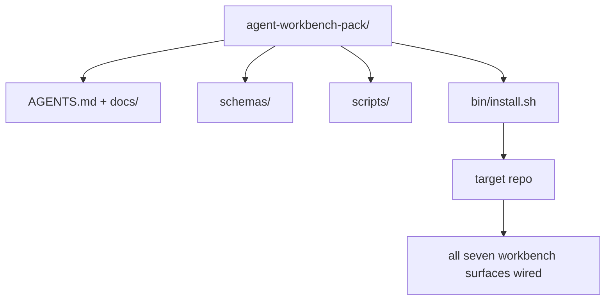

# Capstone: Ship Gói bàn làm việc Agent có thể tái sử dụng

> Bản nhạc nhỏ kết thúc bằng một gói bạn thả vào bất kỳ repo nào. Mười một bài học về các bề mặt được nén vào một thư mục mà bạn có thể `cp -r` và có một agent hoạt động đáng tin cậy vào sáng hôm sau. Điểm mấu chốt là artifact mà chương trình giảng dạy này giao dịch.

**Loại:** Xây dựng
**Ngôn ngữ:** Python (stdlib)
**Kiến thức tiên quyết:** Giai đoạn 14 · 31 đến 14 · 41
**Thời lượng:** ~75 phút

## Mục tiêu học tập

- Đóng gói bảy bề mặt bàn làm việc vào một thư mục thả vào.
- Ghim schemas, scripts và mẫu để repo mới có được đường cơ sở tốt đã biết.
- Thêm một script trình cài đặt duy nhất để đặt gói một cách mạnh mẽ.
- Quyết định những gì còn lại trong nhóm và những gì còn lại, bảo vệ phần cắt giảm cho mỗi người.

## Vấn đề

Một bàn làm việc nằm trong Google Doc, lịch sử trò chuyện và ba scripts được nhớ một nửa là bàn làm việc được xây dựng lại mỗi quý. Phương pháp chữa trị là một gói có phiên bản: một repo hoặc thư mục với các bề mặt, schemas, scripts và trình cài đặt một lệnh.

Bạn sẽ kết thúc bài học này với `outputs/agent-workbench-pack/` shipped trên đĩa và một `bin/install.sh` thả nó vào bất kỳ repo mục tiêu nào.

## Khái niệm



### Bố cục gói

```
outputs/agent-workbench-pack/
├── AGENTS.md
├── docs/
│   ├── agent-rules.md
│   ├── reliability-policy.md
│   ├── handoff-protocol.md
│   └── reviewer-rubric.md
├── schemas/
│   ├── agent_state.schema.json
│   ├── task_board.schema.json
│   └── scope_contract.schema.json
├── scripts/
│   ├── init_agent.py
│   ├── run_with_feedback.py
│   ├── verify_agent.py
│   └── generate_handoff.py
├── bin/
│   └── install.sh
└── README.md
```

### Cái gì ở trong, cái gì ở ngoài

Trong:

- Bề mặt schemas. Chúng là hợp đồng.
- Bốn scripts trên. Họ là runtime.
- Bốn tài liệu. Chúng là các quy tắc và bảng đánh giá.

Ra ngoài:

- Nhiệm vụ cụ thể của dự án. Các nhiệm vụ thuộc về bảng của repo mục tiêu, không phải trong gói.
- Nhà cung cấp SDK cuộc gọi. Gói này là framework bất khả tri.
- Văn xuôi giới thiệu. Gói này nằm bên cạnh phần giới thiệu hiện có của nhóm, không phải bên trong nó.

### Trình cài đặt

Một `bin/install.sh` ngắn (hoặc `bin/install.py`):

1. Từ chối cài đặt trên gói hiện có mà không có `--force`.
2. Sao chép gói vào repo đích.
3. Nối dây CI nếu có `.github/workflows/` tồn tại.
4. In các bước tiếp theo: điền vào bảng, đặt lệnh chấp nhận, chạy script init.

### Phiên bản

Gói mang một tệp `VERSION`. Schema va chạm và thay đổi script yêu cầu di chuyển sẽ ảnh hưởng lớn. Những thay đổi chỉ dành cho tài liệu sẽ làm tăng bản vá. `agent_state.json` của repo mục tiêu ghi phiên bản gói mà nó được khởi tạo.

## Tự xây dựng

`code/main.py` tập hợp các gói thành `outputs/agent-workbench-pack/` bên cạnh bài học, được gieo hạt với các schemas và scripts từ các bài học trước trong bản nhạc nhỏ này và các tài liệu bạn đã viết.

Chạy nó:

```
python3 code/main.py
```

script sao chép và ghim các bề mặt, viết README, in cây gói và thoát khỏi số không. Chạy lại là idempotent.

## Production mô hình trong tự nhiên

Một gói chỉ có giá trị nếu nó tồn tại sau các đợt fork, cập nhật và ngược dòng không thân thiện. Bốn mẫu làm cho điều đó hoạt động.

**`VERSION` là hợp đồng, không phải tiếp thị.** Những va chạm lớn đòi hỏi phải di chuyển tiểu bang. Các va chạm nhỏ yêu cầu chạy lại trình kiểm tra. Các vết sưng vá chỉ dành cho tài liệu. Trình cài đặt ghi `.workbench-version` vào repo đích trên mỗi lần cài đặt; `lint_pack.py` từ chối ship nếu khóa của mục tiêu không đồng ý với `VERSION` của bầy. Đây là cách `npm`, `Cargo` và `pyproject.toml` sống sót sau 10 năm rời bỏ; Không có gì về agents thay đổi các quy tắc.

**Nguồn duy nhất để phân phối công cụ chéo.** Nx ships một `nx ai-setup` đặt `AGENTS.md`, `CLAUDE.md`, `.cursor/rules/`, `.github/copilot-instructions.md` và một MCP server từ một config duy nhất. Gói cũng nên làm như vậy; Trình cài đặt phát ra các liên kết tượng trưng (`ln -s AGENTS.md CLAUDE.md`) để một nguồn tin cậy duy nhất đến mọi agent mã hóa. Phân nhánh gói để hỗ trợ công cụ này hơn công cụ khác là chế độ lỗi.

**`uninstall.sh` từ chối ở trạng thái không tầm thường.** Việc gỡ cài đặt gói không được xóa `agent_state.json`, `task_board.json` hoặc `outputs/` của người dùng. Trình gỡ cài đặt xóa schemas, scripts, tài liệu và `AGENTS.md` (với `--keep-agents-md` chọn không tham gia) và từ chối tiếp tục nếu các tệp trạng thái có bất kỳ thay đổi nào chưa được cam kết. Trạng thái thuộc về người sử dụng; gói không sở hữu nó.

**Skill dưới dạng có thể xuất bản. Phân phối kiểu SkillKit.** Gói ships như một SkillKit skill: `skillkit install agent-workbench-pack` đặt nó trên 32 AI agents từ một nguồn duy nhất. Bầy repo là nguồn gốc của sự thật; SkillKit là kênh phân phối. Khóa nhà cung cấp sụp đổ; bảy bề mặt vẫn giữ nguyên.

## Ứng dụng

Ba nơi gói ships:

- **Là một thư mục, bạn thả vào một repo.** `cp -r outputs/agent-workbench-pack /path/to/repo`.
- **Là một mẫu công khai repo.** Fork-and-customize, với `VERSION` kiểm soát drift.
- **Là một SkillKit skill.** Được kết nối vào sản phẩm agent của bạn để một lệnh duy nhất đặt nó xuống.

Gói là công thức. Mỗi cài đặt là một phần ăn.

## Sản phẩm bàn giao

`outputs/skill-workbench-pack.md` tạo ra một gói được điều chỉnh theo dự án: các quy tắc được làm sắc nét theo lịch sử của nhóm, các quả cầu phạm vi khớp với repo, thứ nguyên bảng đánh giá được mở rộng với một mục nhập dành riêng cho miền.

## Bài tập

1. Quyết định tài liệu thứ năm tùy chọn nào xứng đáng được thăng hạng vào gói chính tắc. Bảo vệ vết cắt.
2. Viết lại trình cài đặt dưới dạng Python với cờ `--dry-run`. So sánh công thái học với bash.
3. Thêm một `bin/uninstall.sh` để loại bỏ gói một cách an toàn và từ chối nếu các tệp trạng thái có lịch sử không tầm thường. Điều gì được coi là không tầm thường?
4. Thêm một `lint_pack.py` không thành công khi gói trôi khỏi `VERSION`. Nối nó vào CI cho repo riêng của gói.
5. Tác giả runbook di chuyển từ bàn làm việc cuộn tay sang gói này. Thứ tự hoạt động giảm thiểu thời gian ngừng hoạt động là gì?

## Thuật ngữ chính

| Thuật ngữ | Những gì mọi người nói | Ý nghĩa thực sự của nó |
|------|----------------|------------------------|
| Gói bàn làm việc | "Bộ khởi động" | Một thư mục phiên bản mang tất cả bảy bề mặt |
| Trình cài đặt | "Thiết lập script" | `bin/install.sh` điều đó đặt gói xuống một cách mạnh mẽ |
| Phiên bản gói | "PHIÊN BẢN" | Các thay đổi lớn về schema/script, bản vá chỉ dành cho tài liệu |
| Gói thả vào | "cp -r và đi" | Đóng gói hoạt động mà không cần tùy chỉnh theo repo vào ngày đầu tiên |
| Mẫu có thể phân nhánh | "GitHub mẫu" | repo công khai mà "Sử dụng bản mẫu này" của GitHub có thể sao chép từ |

## Đọc thêm

- Giai đoạn 14 · 31 đến 14 · 41 — mọi bề mặt gói này đóng gói
- [SkillKit](https://github.com/rohitg00/skillkit) - cài đặt skill này trên 32 AI agents
- [Nx Blog, Teach Your AI Agent How to Work in a Monorepo](https://nx.dev/blog/nx-ai-agent-skills) — trình tạo nguồn duy nhất trên sáu công cụ
- [agents.md — the open spec](https://agents.md/) - những gì bộ định tuyến gói của bạn phải triển khai
- [HKUDS/OpenHarness](https://github.com/HKUDS/OpenHarness) — triển khai tham chiếu của một gói tương đương
- [andrewgarst/agentic_harness](https://github.com/andrewgarst/agentic_harness) — Tham chiếu được Redis hỗ trợ với bộ đánh giá
- [Augment Code, A good AGENTS.md is a model upgrade](https://www.augmentcode.com/blog/how-to-write-good-agents-dot-md-files) — Thanh chất lượng Pack Docs
- [Anthropic, Effective harnesses for long-running agents](https://www.anthropic.com/engineering/effective-harnesses-for-long-running-agents)
- [Anthropic, Harness design for long-running application development](https://www.anthropic.com/engineering/harness-design-long-running-apps)
- Giai đoạn 14 · 30 — Phát triển agent dựa trên đánh giá sử dụng cổng xác minh của gói
- Giai đoạn 14 · 41 — before/after benchmark gói này cải thiện
