# Giao thức truyền thông

> Agents không thể nói cùng một ngôn ngữ không phải là một đội. Họ là những người lạ đang hét vào khoảng không.

**Loại:** Xây dựng
**Ngôn ngữ:** TypeScript
**Kiến thức tiên quyết:** Giai đoạn 14 (Kỹ thuật Agent), Bài 16.01 (Tại sao nên sử dụng Multi-Agent)
**Thời lượng:** ~120 phút

## Mục tiêu học tập

- Triển khai tính năng khám phá và gọi công cụ MCP để agents có thể sử dụng các công cụ do servers bên ngoài hiển thị
- Xây dựng thẻ A2A agent và endpoint nhiệm vụ cho phép một agent ủy thác công việc cho người khác trong HTTP
- So sánh MCP (truy cập công cụ), A2A (agent-to-agent), ACP (kiểm toán doanh nghiệp) và ANP (tin cậy phi tập trung) và giải thích giao thức nào giải quyết vấn đề nào
- Kết nối nhiều giao thức với nhau trong một hệ thống duy nhất, nơi agents khám phá các công cụ thông qua MCP và ủy thác tác vụ qua A2A

## Vấn đề

Bạn chia hệ thống của mình thành nhiều agents. Một nhà nghiên cứu, một lập trình viên, một người đánh giá. Họ rất giỏi trong công việc cá nhân của họ. Nhưng bây giờ bạn cần họ thực sự nói chuyện với nhau.

Nỗ lực đầu tiên của bạn là rõ ràng: chuyền dây xung quanh. Nhà nghiên cứu trả về một đốm văn bản, lập trình viên phân tích cú pháp nó theo cách có thể. Nó hoạt động cho đến khi lập trình viên hiểu sai một bản tóm tắt nghiên cứu, hoặc hai agents bế tắc đang chờ đợi nhau, hoặc bạn cần agents được xây dựng bởi các nhóm khác nhau để cộng tác. Đột nhiên "chỉ cần vượt qua dây" sụp đổ.

Đây là vấn đề giao thức truyền thông. Nếu không có hợp đồng chung về cách agents trao đổi thông tin, các hệ thống đa agent rất mỏng manh, không thể kiểm tra và không thể mở rộng quy mô vượt quá một số agents mà cá nhân bạn đã viết.

Hệ sinh thái AI đã phản hồi với bốn giao thức, mỗi giao thức giải quyết một phần khác nhau của vấn đề:

- **MCP** để truy cập công cụ
- **A2A** để cộng tác agent-agent
- **ACP** cho khả năng kiểm toán doanh nghiệp
- **ANP** cho danh tính và sự tin cậy phi tập trung

Bài học này đi sâu. Bạn sẽ đọc các định dạng dây thực từ mỗi thông số kỹ thuật, xây dựng các triển khai hoạt động và kết nối cả bốn thành một hệ thống thống nhất.

## Khái niệm

### Bối cảnh giao thức

Hãy nghĩ về bốn giao thức này như các lớp, mỗi lớp giải quyết một câu hỏi khác nhau:

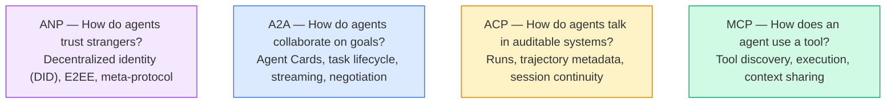

Họ không phải là đối thủ cạnh tranh. Họ giải quyết các vấn đề khác nhau ở các cấp độ khác nhau.

### MCP (Tóm tắt)

MCP được đề cập sâu trong Giai đoạn 13. Tóm tắt nhanh: MCP chuẩn hóa cách LLM kết nối với các công cụ và nguồn dữ liệu bên ngoài. Đó là một giao thức **client-server**, nơi agent (client) phát hiện và gọi các công cụ do server tiết lộ.

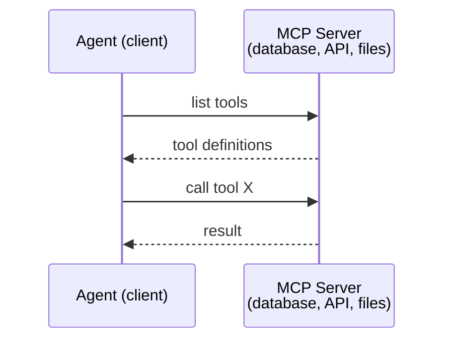

MCP là giao tiếp **agent-to-tool**. Nó không giúp ích gì agents nói chuyện với nhau.

### A2A (Giao thức Agent2Agent)

**Tạo bởi:** Google (hiện thuộc Linux Foundation với tên `lf.a2a.v1`)
**Phiên bản thông số kỹ thuật: **1.0.0
**Vấn đề:** Làm thế nào để agents tự trị cộng tác, đàm phán và giao nhiệm vụ cho nhau?

A2A là giao thức cho **cộng tác ngang hàng agent**. Khi MCP kết nối agent với các công cụ, A2A kết nối agent với các agents khác. Mỗi agent xuất bản một Thẻ **Agent** tại một URL nổi tiếng và các agents khác khám phá, thương lượng và ủy thác nhiệm vụ cho nó.

#### Cách thức hoạt động của A2A

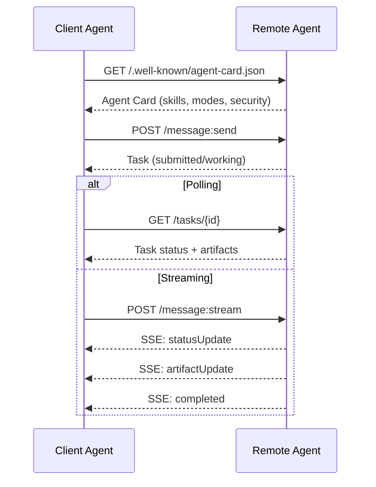

#### Thẻ Agent thực sự

Đây là những gì Thẻ A2A Agent thực sự trông như thế nào trong tự nhiên. Phục vụ tại `GET /.well-known/agent-card.json`:

```json
{
  "name": "Research Agent",
  "description": "Searches documentation and summarizes findings",
  "version": "1.0.0",
  "supportedInterfaces": [
    {
      "url": "https://research-agent.example.com/a2a/v1",
      "protocolBinding": "JSONRPC",
      "protocolVersion": "1.0"
    },
    {
      "url": "https://research-agent.example.com/a2a/rest",
      "protocolBinding": "HTTP+JSON",
      "protocolVersion": "1.0"
    }
  ],
  "provider": {
    "organization": "Your Company",
    "url": "https://example.com"
  },
  "capabilities": {
    "streaming": true,
    "pushNotifications": false
  },
  "defaultInputModes": ["text/plain", "application/json"],
  "defaultOutputModes": ["text/plain", "application/json"],
  "skills": [
    {
      "id": "web-research",
      "name": "Web Research",
      "description": "Searches the web and synthesizes findings",
      "tags": ["research", "search", "summarization"],
      "examples": ["Research the latest changes in React 19"]
    },
    {
      "id": "doc-analysis",
      "name": "Documentation Analysis",
      "description": "Reads and analyzes technical documentation",
      "tags": ["docs", "analysis"],
      "inputModes": ["text/plain", "application/pdf"],
      "outputModes": ["application/json"]
    }
  ],
  "securitySchemes": {
    "bearer": {
      "httpAuthSecurityScheme": {
        "scheme": "Bearer",
        "bearerFormat": "JWT"
      }
    }
  },
  "security": [{ "bearer": [] }]
}
```

Những điều chính cần lưu ý:
- **Skills** là những gì một agent có thể làm. Mỗi loại đều có ID, thẻ và các loại MIME input/output được hỗ trợ. Đây là cách máy khách agent quyết định liệu agent từ xa này có thể xử lý yêu cầu của mình hay không.
- **supportedInterfaces** liệt kê nhiều liên kết giao thức. Một agent duy nhất có thể nói đồng thời JSON-RPC, REST và gRPC.
- **Bảo mật** được tích hợp trong thẻ. Khách hàng biết họ cần xác thực gì trước khi thực hiện một yêu cầu duy nhất.

#### Vòng đời tác vụ

Nhiệm vụ là đơn vị cốt lõi của công việc trong A2A. Họ di chuyển qua các trạng thái xác định:

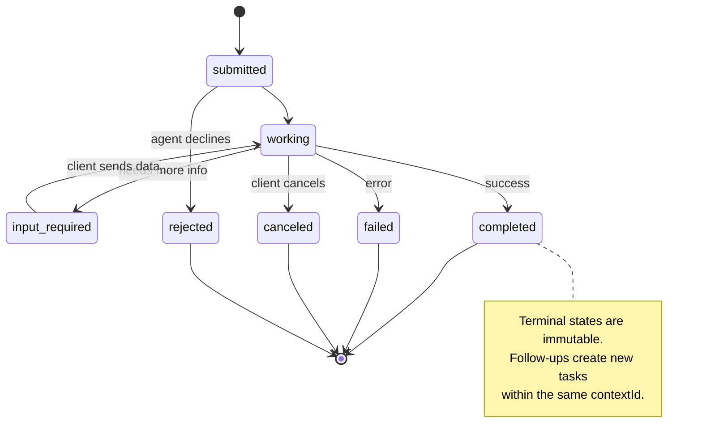

Tất cả 8 trạng thái (thông số kỹ thuật cũng định nghĩa `UNSPECIFIED` là lính canh, bị bỏ qua ở đây):

| Tiểu bang | Thiết bị đầu cuối? | Ý nghĩa |
|---|---|---|
| `TASK_STATE_SUBMITTED` | Không | Đã thừa nhận, chưa xử lý |
| `TASK_STATE_WORKING` | Không | Đang được xử lý tích cực |
| `TASK_STATE_INPUT_REQUIRED` | Không | Agent cần thêm thông tin từ khách hàng |
| `TASK_STATE_AUTH_REQUIRED` | Không | Cần xác thực |
| `TASK_STATE_COMPLETED` | Có | Hoàn thành thành công |
| `TASK_STATE_FAILED` | Có | Kết thúc với lỗi |
| `TASK_STATE_CANCELED` | Có | Hủy trước khi hoàn thành |
| `TASK_STATE_REJECTED` | Có | Agent từ chối nhiệm vụ |

Một khi một nhiệm vụ đạt đến trạng thái cuối cùng, nó là bất biến. Không có tin nhắn nào khác. Theo dõi tạo ra một nhiệm vụ mới trong cùng một `contextId`.

#### Định dạng dây

A2A sử dụng JSON-RPC 2.0. Đây là những gì một trao đổi tin nhắn thực sự trông như thế nào:

**Khách hàng gửi nhiệm vụ:**
```json
{
  "jsonrpc": "2.0",
  "id": 1,
  "method": "SendMessage",
  "params": {
    "message": {
      "messageId": "msg-001",
      "role": "ROLE_USER",
      "parts": [{ "text": "Research React 19 compiler features" }]
    },
    "configuration": {
      "acceptedOutputModes": ["text/plain", "application/json"],
      "historyLength": 10
    }
  }
}
```

**Agent trả lời bằng một nhiệm vụ:**
```json
{
  "jsonrpc": "2.0",
  "id": 1,
  "result": {
    "task": {
      "id": "task-abc-123",
      "contextId": "ctx-xyz-789",
      "status": {
        "state": "TASK_STATE_COMPLETED",
        "timestamp": "2026-03-27T10:30:00Z"
      },
      "artifacts": [
        {
          "artifactId": "art-001",
          "name": "research-results",
          "parts": [{
            "data": {
              "findings": [
                "React 19 compiler auto-memoizes components",
                "No more manual useMemo/useCallback needed",
                "Compiler runs at build time, not runtime"
              ]
            },
            "mediaType": "application/json"
          }]
        }
      ]
    }
  }
}
```

**Streaming qua SSE:**
```text
POST /message:stream HTTP/1.1
Content-Type: application/json
A2A-Version: 1.0

data: {"task":{"id":"task-123","status":{"state":"TASK_STATE_WORKING"}}}

data: {"statusUpdate":{"taskId":"task-123","status":{"state":"TASK_STATE_WORKING","message":{"role":"ROLE_AGENT","parts":[{"text":"Searching documentation..."}]}}}}

data: {"artifactUpdate":{"taskId":"task-123","artifact":{"artifactId":"art-1","parts":[{"text":"partial findings..."}]},"append":true,"lastChunk":false}}

data: {"statusUpdate":{"taskId":"task-123","status":{"state":"TASK_STATE_COMPLETED"}}}
```

### Giao thức truyền thông ACP (Agent)

**Tạo bởi: **IBM / BeeAI
**Phiên bản thông số kỹ thuật:** 0.2.0 (OpenAPI 3.1.1)
**Tình trạng:** Sáp nhập vào A2A thuộc Quỹ Linux
**Vấn đề:** Làm thế nào để agents giao tiếp với khả năng kiểm tra đầy đủ, tính liên tục session và theo dõi quỹ đạo?

ACP là **giao thức doanh nghiệp**. Không giống như những gì nhiều bản tóm tắt tuyên bố, ACP **không** sử dụng JSON-LD. Đó là một REST/JSON API đơn giản được xác định thông qua OpenAPI. Điều làm cho nó trở nên đặc biệt là **TrajectoryMetadata**: mỗi phản hồi agent có thể mang một nhật ký chi tiết về các bước suy luận và các lệnh gọi công cụ đã tạo ra nó.

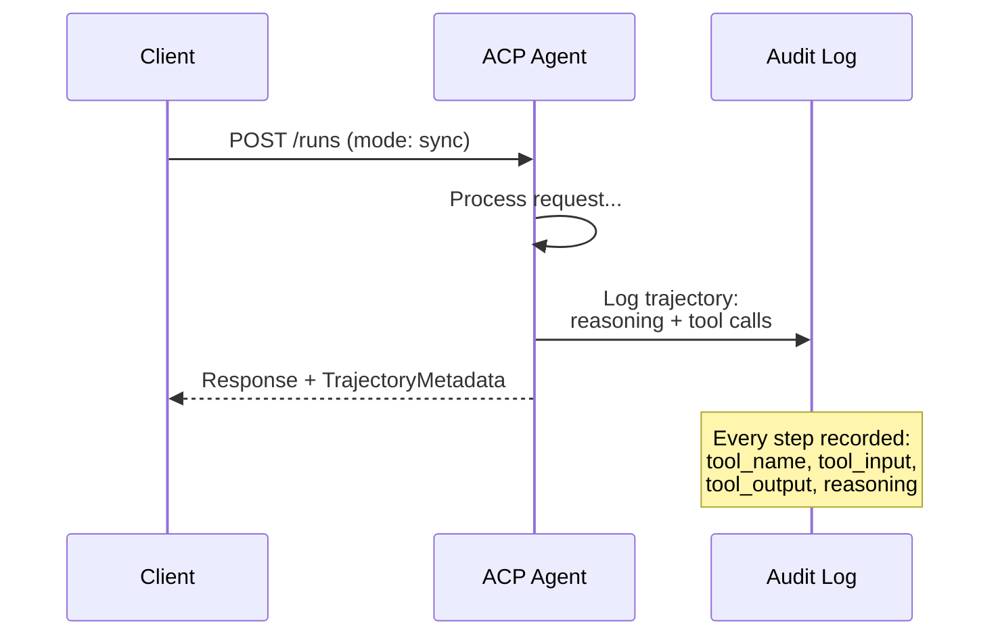

#### Khám phá Agent trong ACP

ACP xác định bốn phương pháp khám phá:

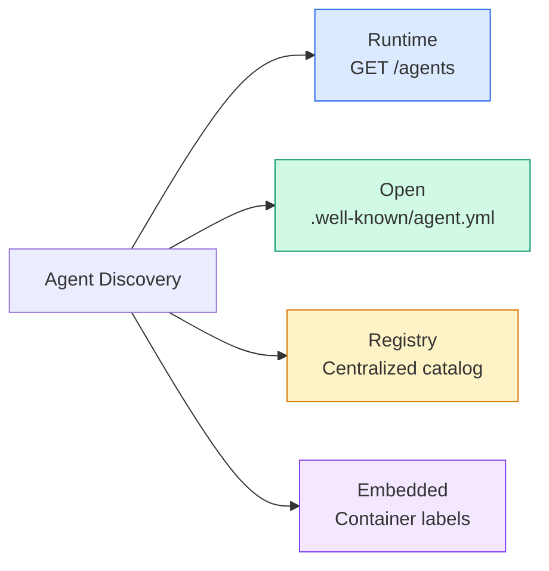

**AgentManifest** đơn giản hơn Thẻ Agent của A2A:

```json
{
  "name": "summarizer",
  "description": "Summarizes documents with source citations",
  "input_content_types": ["text/plain", "application/pdf"],
  "output_content_types": ["text/plain", "application/json"],
  "metadata": {
    "tags": ["summarization", "RAG"],
    "framework": "BeeAI",
    "capabilities": [
      {
        "name": "Document Summarization",
        "description": "Condenses long documents into key points"
      }
    ],
    "recommended_models": ["llama3.3:70b-instruct-fp16"],
    "license": "Apache-2.0",
    "programming_language": "Python"
  }
}
```

#### Vòng đời chạy

ACP sử dụng "Chạy" thay vì "Nhiệm vụ". Run là một thực thi agent với ba chế độ:

| Chế độ | Hành vi |
|---|---|
| `sync` | Chặn. Phản hồi chứa kết quả đầy đủ. |
| `async` | Trả về 202 ngay lập tức. Thăm dò ý kiến `GET /runs/{id}` để biết trạng thái. |
| `stream` | SSE luồng. Các sự kiện bùng nổ khi agent hoạt động. |

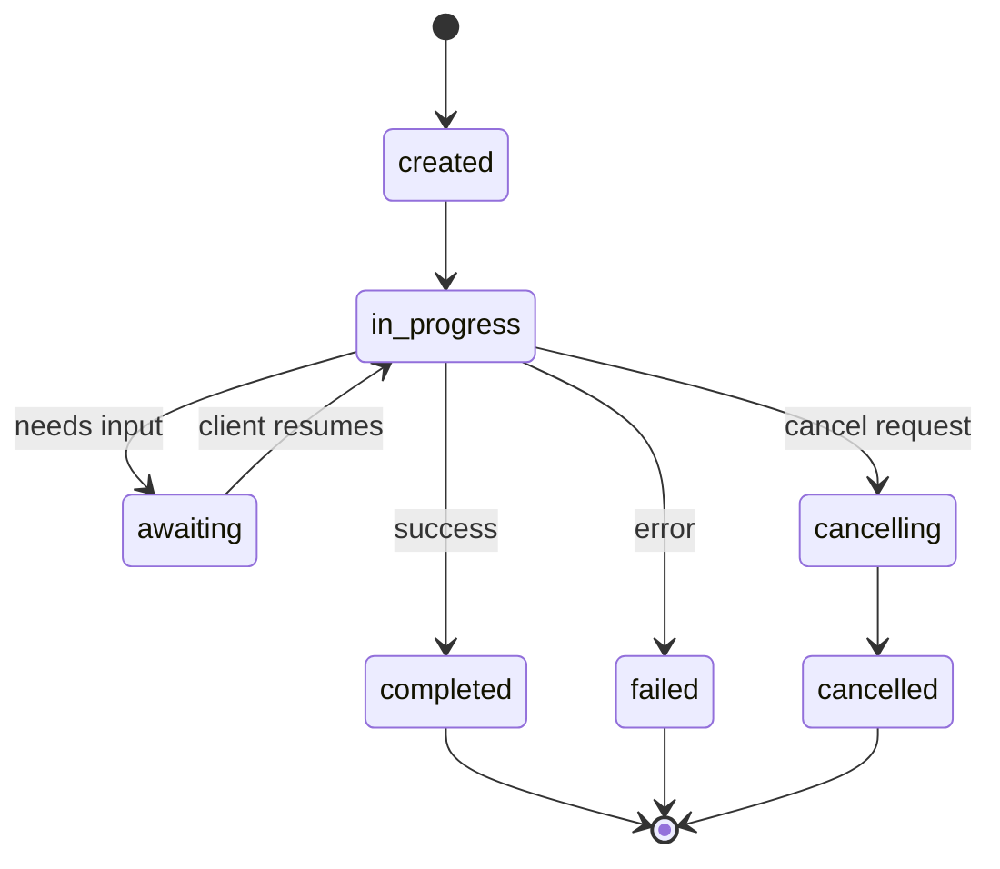

#### TrajectoryMetadata (Dấu vết kiểm tra)

Đây là điểm khác biệt chính của ACP. Mỗi phần tin nhắn có thể bao gồm siêu dữ liệu hiển thị chính xác những gì agent đã làm:

```json
{
  "role": "agent/researcher",
  "parts": [
    {
      "content_type": "text/plain",
      "content": "The weather in San Francisco is 72F and sunny.",
      "metadata": {
        "kind": "trajectory",
        "message": "I need to check the weather for this location",
        "tool_name": "weather_api",
        "tool_input": { "location": "San Francisco, CA" },
        "tool_output": { "temperature": 72, "condition": "sunny" }
      }
    }
  ]
}
```

Đối với các ngành công nghiệp được quản lý, đây là vàng. Mỗi câu trả lời đều đi kèm với một chuỗi lý luận có thể chứng minh được: công cụ nào được gọi, đầu vào nào được sử dụng, đầu ra nào đã nhận được. Không có hộp đen.

ACP cũng hỗ trợ **CitationMetadata** để phân bổ nguồn:

```json
{
  "kind": "citation",
  "start_index": 0,
  "end_index": 47,
  "url": "https://weather.gov/sf",
  "title": "NWS San Francisco Forecast"
}
```

### ANP (Giao thức mạng Agent)

**Tạo bởi: **Cộng đồng mã nguồn mở (được thành lập bởi GaoWei Chang)
**Repo:** [github.com/agent-network-protocol/AgentNetworkProtocol](https://github.com/agent-network-protocol/AgentNetworkProtocol)
**Vấn đề:** Làm thế nào để agents từ các tổ chức khác nhau tin tưởng lẫn nhau mà không có cơ quan trung ương?

ANP là **giao thức nhận dạng phi tập trung**. Nó xây dựng lòng tin bằng cách sử dụng Mã định danh phi tập trung (DID) W3C và mã hóa đầu cuối. Không giống như A2A nơi bạn khám phá agents thông qua các endpoints đã biết, ANP cho phép agents chứng minh danh tính của họ bằng mật mã.

ANP có ba lớp:

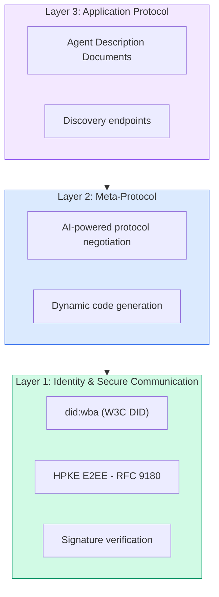

#### Tài liệu DID (Cấu trúc thực)

ANP sử dụng phương thức DID tùy chỉnh được gọi là `did:wba` (Agent dựa trên web). DID `did:wba:example.com:user:alice` quyết định `https://example.com/user/alice/did.json`:

```json
{
  "@context": [
    "https://www.w3.org/ns/did/v1",
    "https://w3id.org/security/suites/jws-2020/v1",
    "https://w3id.org/security/suites/secp256k1-2019/v1"
  ],
  "id": "did:wba:example.com:user:alice",
  "verificationMethod": [
    {
      "id": "did:wba:example.com:user:alice#key-1",
      "type": "EcdsaSecp256k1VerificationKey2019",
      "controller": "did:wba:example.com:user:alice",
      "publicKeyJwk": {
        "crv": "secp256k1",
        "x": "NtngWpJUr-rlNNbs0u-Aa8e16OwSJu6UiFf0Rdo1oJ4",
        "y": "qN1jKupJlFsPFc1UkWinqljv4YE0mq_Ickwnjgasvmo",
        "kty": "EC"
      }
    },
    {
      "id": "did:wba:example.com:user:alice#key-x25519-1",
      "type": "X25519KeyAgreementKey2019",
      "controller": "did:wba:example.com:user:alice",
      "publicKeyMultibase": "z9hFgmPVfmBZwRvFEyniQDBkz9LmV7gDEqytWyGZLmDXE"
    }
  ],
  "authentication": [
    "did:wba:example.com:user:alice#key-1"
  ],
  "keyAgreement": [
    "did:wba:example.com:user:alice#key-x25519-1"
  ],
  "humanAuthorization": [
    "did:wba:example.com:user:alice#key-1"
  ],
  "service": [
    {
      "id": "did:wba:example.com:user:alice#agent-description",
      "type": "AgentDescription",
      "serviceEndpoint": "https://example.com/agents/alice/ad.json"
    }
  ]
}
```

Những điều chính cần lưu ý:
- **Tách khóa** được thực thi. Khóa ký (secp256k1) tách biệt với khóa mã hóa (X25519).
- **`humanAuthorization`** là duy nhất đối với ANP. Các khóa này yêu cầu sự chấp thuận rõ ràng của con người (sinh trắc học, mật khẩu, HSM) trước khi sử dụng. Các hoạt động rủi ro cao như chuyển tiền đi qua con đường này.
- **`keyAgreement`** khóa được sử dụng để mã hóa đầu cuối HPKE (RFC 9180).
- Phần **dịch vụ **liên kết đến tài liệu Mô tả Agent.

#### Niềm tin hoạt động như thế nào trong ANP

ANP **không** sử dụng biểu đồ web tin cậy hoặc xác nhận. Niềm tin là song phương và được xác minh cho mỗi tương tác:

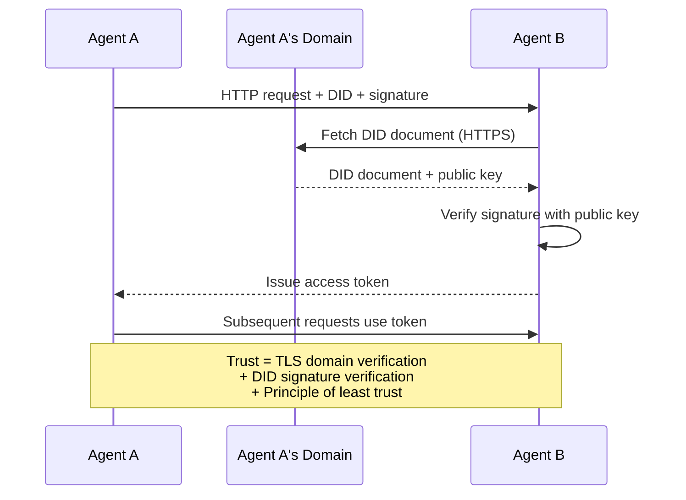

Niềm tin đến từ ba nguồn:
1. **TLS cấp miền** xác minh máy chủ lưu trữ tài liệu DID
2. **Chữ ký mật mã DID **xác minh danh tính của agent
3. **Nguyên tắc ít tin cậy nhất** chỉ cấp quyền tối thiểu

Không có sự lan truyền tin cậy dựa trên tin đồn hoặc chấm điểm PageRank. Bạn xác minh từng agent trực tiếp thông qua DID của nó.

#### Đàm phán Meta-Protocol

Đây là feature mới nhất của ANP. Khi hai agents từ các hệ sinh thái khác nhau gặp nhau, họ không cần các định dạng dữ liệu được thỏa thuận trước. Họ thương lượng bằng ngôn ngữ tự nhiên:

```json
{
  "action": "protocolNegotiation",
  "sequenceId": 0,
  "candidateProtocols": "I can communicate using:\n1. JSON-RPC with hotel booking schema\n2. REST with OpenAPI 3.1 spec\n3. Natural language over HTTP",
  "modificationSummary": "Initial proposal",
  "status": "negotiating"
}
```

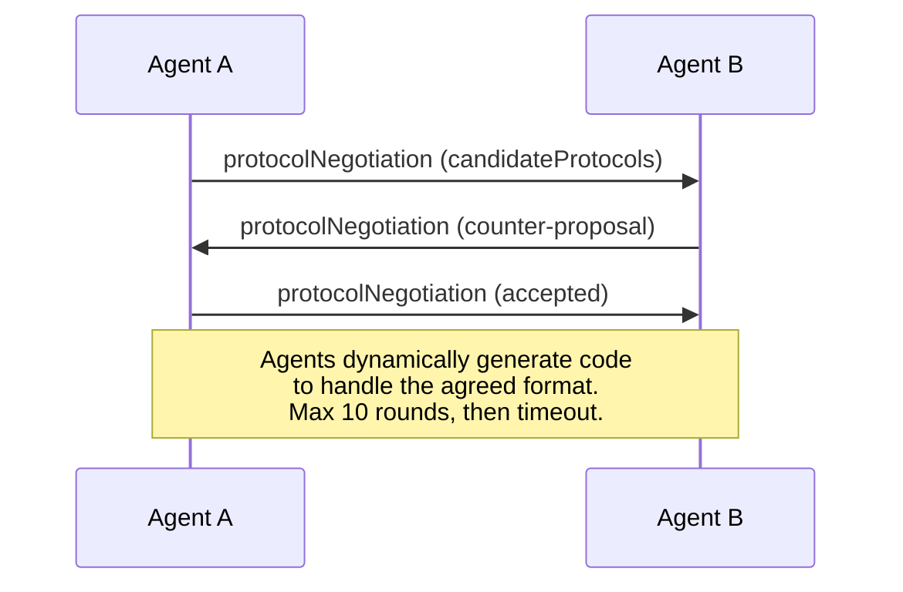

Các agents đi qua lại (tối đa 10 vòng) cho đến khi họ đồng ý về một định dạng, sau đó tự động tạo mã để xử lý nó. Giá trị trạng thái: `negotiating`, `rejected`, `accepted`, `timeout`.

Điều này có nghĩa là hai agents chưa bao giờ gặp nhau trước đây có thể tìm ra cách giao tiếp mà không cần ai xác định trước một schema chung.

### So sánh (Đã sửa)

|| MCP | A2A | ACP | ANP |
|---|---|---|---|---|
| **Tạo bởi** | Anthropic | Quỹ Google / Linux | IBM / BeeAI | Cộng đồng |
| **Định dạng thông số kỹ thuật** | JSON-RPC | JSON-RPC / REST / gRPC | OpenAPI 3.1 (REST) | JSON-RPC |
| **Sử dụng chính** | Agent vào công cụ | Agent để Agent | Agent để Agent | Agent để Agent |
| **Khám phá** | Danh sách công cụ | `/.well-known/agent-card.json` | `GET /agents`, `/.well-known/agent.yml` | `/.well-known/agent-descriptions`, dịch vụ DID endpoints |
| **Danh tính** | Ngầm định (cục bộ) | Lược đồ bảo mật (OAuth, mTLS) | Cấp Server | W3C DID (`did:wba`) với E2EE |
| **Dấu vết kiểm tra** | N/A | Cơ bản (lịch sử nhiệm vụ) | TrajectoryMetadata (gọi công cụ, suy luận) | Không được chỉ định chính thức |
| **Máy trạng thái** | N/A | 9 trạng thái nhiệm vụ | 7 trạng thái chạy | N/A |
| **Streaming** | N/A | SSE | SSE | Transport bất khả tri |
| **feature độc đáo **| Công cụ schemas | Thẻ Agent + Skills | Dấu vết kiểm tra quỹ đạo | Đàm phán siêu giao thức |
| **Tốt nhất cho** | Công cụ và dữ liệu | Cộng tác năng động | Các ngành được quản lý | Tin cậy giữa các tổ chức |
| **Trạng thái** | Ổn định | Ổn định (v1.0) | Hợp nhất vào A2A | Phát triển tích cực |

### Cách họ làm việc cùng nhau

Các giao thức này không loại trừ lẫn nhau. Một hệ thống doanh nghiệp thực tế sử dụng nhiều:

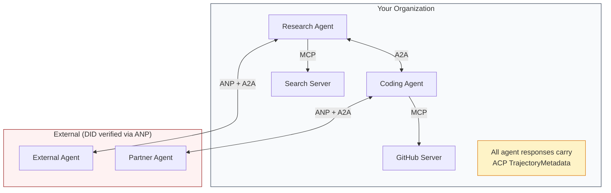

- **MCP** kết nối từng agent với các công cụ của nó
- **A2A** xử lý sự cộng tác giữa agents (bên trong và bên ngoài)
- **ACP** bao bọc các câu trả lời trong siêu dữ liệu quỹ đạo để có khả năng kiểm tra
- **ANP** cung cấp xác minh danh tính cho agents bạn không kiểm soát

## Tự xây dựng

### Bước 1: Các loại tin nhắn cốt lõi

Mọi hệ thống đa agent đều bắt đầu với một định dạng tin nhắn. Chúng ta xác định các loại ánh xạ đến những gì các giao thức thực sử dụng:

```typescript
import crypto from "node:crypto";

type MessageRole = "user" | "agent";

type MessagePart =
  | { kind: "text"; text: string }
  | { kind: "data"; data: unknown; mediaType: string }
  | { kind: "file"; name: string; url: string; mediaType: string };

type TrajectoryEntry = {
  reasoning: string;
  toolName?: string;
  toolInput?: unknown;
  toolOutput?: unknown;
  timestamp: number;
};

type AgentMessage = {
  id: string;
  role: MessageRole;
  parts: MessagePart[];
  trajectory?: TrajectoryEntry[];
  replyTo?: string;
  timestamp: number;
};

function createMessage(
  role: MessageRole,
  parts: MessagePart[],
  replyTo?: string
): AgentMessage {
  return {
    id: crypto.randomUUID(),
    role,
    parts,
    replyTo,
    timestamp: Date.now(),
  };
}

function textMessage(role: MessageRole, text: string): AgentMessage {
  return createMessage(role, [{ kind: "text", text }]);
}
```

Lưu ý: `MessagePart` là đa phương thức (văn bản, dữ liệu có cấu trúc, tệp) giống như thông số kỹ thuật A2A và ACP thực. `TrajectoryEntry` nắm bắt chuỗi lý luận, phù hợp với TrajectoryMetadata của ACP.

### Bước 2: A2A Agent thẻ và Registry

Xây dựng agent khám phá phù hợp với thông số kỹ thuật A2A thực:

```typescript
type Skill = {
  id: string;
  name: string;
  description: string;
  tags: string[];
  inputModes: string[];
  outputModes: string[];
};

type AgentCard = {
  name: string;
  description: string;
  version: string;
  url: string;
  capabilities: {
    streaming: boolean;
    pushNotifications: boolean;
  };
  defaultInputModes: string[];
  defaultOutputModes: string[];
  skills: Skill[];
};

class AgentRegistry {
  private cards: Map<string, AgentCard> = new Map();

  register(card: AgentCard) {
    this.cards.set(card.name, card);
  }

  discoverBySkillTag(tag: string): AgentCard[] {
    return [...this.cards.values()].filter((card) =>
      card.skills.some((skill) => skill.tags.includes(tag))
    );
  }

  discoverByInputMode(mimeType: string): AgentCard[] {
    return [...this.cards.values()].filter(
      (card) =>
        card.defaultInputModes.includes(mimeType) ||
        card.skills.some((skill) => skill.inputModes.includes(mimeType))
    );
  }

  resolve(name: string): AgentCard | undefined {
    return this.cards.get(name);
  }

  listAll(): AgentCard[] {
    return [...this.cards.values()];
  }
}
```

Điều này về cơ bản phong phú hơn so với một bản đồ tên đến khả năng đơn giản. Bạn có thể khám phá agents bằng thẻ skill, theo loại MIME đầu vào hoặc theo tên, giống như thông số kỹ thuật A2A thực hỗ trợ.

### Bước 3: A2A Vòng đời tác vụ

Xây dựng máy trạng thái tác vụ đầy đủ:

```typescript
type TaskState =
  | "submitted"
  | "working"
  | "input-required"
  | "auth-required"
  | "completed"
  | "failed"
  | "canceled"
  | "rejected";

const TERMINAL_STATES: TaskState[] = [
  "completed",
  "failed",
  "canceled",
  "rejected",
];

type TaskStatus = {
  state: TaskState;
  message?: AgentMessage;
  timestamp: number;
};

type Artifact = {
  id: string;
  name: string;
  parts: MessagePart[];
};

type Task = {
  id: string;
  contextId: string;
  status: TaskStatus;
  artifacts: Artifact[];
  history: AgentMessage[];
};

type TaskEvent =
  | { kind: "statusUpdate"; taskId: string; status: TaskStatus }
  | {
      kind: "artifactUpdate";
      taskId: string;
      artifact: Artifact;
      append: boolean;
      lastChunk: boolean;
    };

type TaskHandler = (
  task: Task,
  message: AgentMessage
) => AsyncGenerator<TaskEvent>;

class TaskManager {
  private tasks: Map<string, Task> = new Map();
  private handlers: Map<string, TaskHandler> = new Map();
  private listeners: Map<string, ((event: TaskEvent) => void)[]> = new Map();

  registerHandler(agentName: string, handler: TaskHandler) {
    this.handlers.set(agentName, handler);
  }

  subscribe(taskId: string, listener: (event: TaskEvent) => void) {
    const existing = this.listeners.get(taskId) ?? [];
    existing.push(listener);
    this.listeners.set(taskId, existing);
  }

  async sendMessage(
    agentName: string,
    message: AgentMessage,
    contextId?: string
  ): Promise<Task> {
    const handler = this.handlers.get(agentName);
    if (!handler) {
      const task = this.createTask(contextId);
      task.status = {
        state: "rejected",
        timestamp: Date.now(),
        message: textMessage("agent", `No handler for ${agentName}`),
      };
      return task;
    }

    const task = this.createTask(contextId);
    task.history.push(message);
    task.status = { state: "submitted", timestamp: Date.now() };

    this.processTask(task, handler, message).catch((err) => {
      task.status = {
        state: "failed",
        timestamp: Date.now(),
        message: textMessage("agent", String(err)),
      };
    });
    return task;
  }

  getTask(taskId: string): Task | undefined {
    return this.tasks.get(taskId);
  }

  cancelTask(taskId: string): boolean {
    const task = this.tasks.get(taskId);
    if (!task || TERMINAL_STATES.includes(task.status.state)) return false;
    task.status = { state: "canceled", timestamp: Date.now() };
    this.emit(taskId, {
      kind: "statusUpdate",
      taskId,
      status: task.status,
    });
    return true;
  }

  private createTask(contextId?: string): Task {
    const task: Task = {
      id: crypto.randomUUID(),
      contextId: contextId ?? crypto.randomUUID(),
      status: { state: "submitted", timestamp: Date.now() },
      artifacts: [],
      history: [],
    };
    this.tasks.set(task.id, task);
    return task;
  }

  private async processTask(
    task: Task,
    handler: TaskHandler,
    message: AgentMessage
  ) {
    task.status = { state: "working", timestamp: Date.now() };
    this.emit(task.id, {
      kind: "statusUpdate",
      taskId: task.id,
      status: task.status,
    });

    try {
      for await (const event of handler(task, message)) {
        if (TERMINAL_STATES.includes(task.status.state)) break;

        if (event.kind === "statusUpdate") {
          task.status = event.status;
        }
        if (event.kind === "artifactUpdate") {
          const existing = task.artifacts.find(
            (a) => a.id === event.artifact.id
          );
          if (existing && event.append) {
            existing.parts.push(...event.artifact.parts);
          } else {
            task.artifacts.push(event.artifact);
          }
        }
        this.emit(task.id, event);
      }
    } catch (err) {
      task.status = {
        state: "failed",
        timestamp: Date.now(),
        message: textMessage("agent", String(err)),
      };
      this.emit(task.id, {
        kind: "statusUpdate",
        taskId: task.id,
        status: task.status,
      });
    }
  }

  private emit(taskId: string, event: TaskEvent) {
    for (const listener of this.listeners.get(taskId) ?? []) {
      listener(event);
    }
  }
}
```

Điều này thực hiện vòng đời tác vụ A2A thực: trạng thái đã gửi, đang hoạt động, yêu cầu đầu vào, trạng thái đầu cuối. Trình xử lý là trình tạo không đồng bộ mang lại các sự kiện (cập nhật trạng thái và artifact khối) khớp với SSE streaming model.

### Bước 4: Dấu vết kiểm tra kiểu ACP

Kết thúc giao tiếp với theo dõi quỹ đạo:

```typescript
type AuditEntry = {
  runId: string;
  agentName: string;
  input: AgentMessage[];
  output: AgentMessage[];
  trajectory: TrajectoryEntry[];
  status: "created" | "in-progress" | "completed" | "failed" | "awaiting";
  startedAt: number;
  completedAt?: number;
  sessionId?: string;
};

class AuditableRunner {
  private log: AuditEntry[] = [];
  private handlers: Map<
    string,
    (input: AgentMessage[]) => Promise<{
      output: AgentMessage[];
      trajectory: TrajectoryEntry[];
    }>
  > = new Map();

  registerAgent(
    name: string,
    handler: (input: AgentMessage[]) => Promise<{
      output: AgentMessage[];
      trajectory: TrajectoryEntry[];
    }>
  ) {
    this.handlers.set(name, handler);
  }

  async run(
    agentName: string,
    input: AgentMessage[],
    sessionId?: string
  ): Promise<AuditEntry> {
    const entry: AuditEntry = {
      runId: crypto.randomUUID(),
      agentName,
      input: structuredClone(input),
      output: [],
      trajectory: [],
      status: "created",
      startedAt: Date.now(),
      sessionId,
    };
    this.log.push(entry);

    const handler = this.handlers.get(agentName);
    if (!handler) {
      entry.status = "failed";
      return entry;
    }

    entry.status = "in-progress";
    try {
      const result = await handler(input);
      entry.output = structuredClone(result.output);
      entry.trajectory = structuredClone(result.trajectory);
      entry.status = "completed";
      entry.completedAt = Date.now();
    } catch (err) {
      entry.status = "failed";
      entry.trajectory.push({
        reasoning: `Error: ${String(err)}`,
        timestamp: Date.now(),
      });
      entry.completedAt = Date.now();
    }
    return entry;
  }

  getFullAuditLog(): AuditEntry[] {
    return structuredClone(this.log);
  }

  getAuditLogForAgent(agentName: string): AuditEntry[] {
    return structuredClone(
      this.log.filter((e) => e.agentName === agentName)
    );
  }

  getAuditLogForSession(sessionId: string): AuditEntry[] {
    return structuredClone(
      this.log.filter((e) => e.sessionId === sessionId)
    );
  }

  getTrajectoryForRun(runId: string): TrajectoryEntry[] {
    const entry = this.log.find((e) => e.runId === runId);
    return entry ? structuredClone(entry.trajectory) : [];
  }
}
```

Mỗi lần thực hiện agent tạo ra một mục kiểm tra đầy đủ: những gì đã vào, những gì xuất hiện và quỹ đạo hoàn chỉnh của các cuộc gọi công cụ và các bước suy luận ở giữa. Bạn có thể truy vấn theo agent, theo session hoặc theo từng lần chạy.

### Bước 5: Xác minh danh tính kiểu ANP

Xây dựng danh tính và xác minh dựa trên DID:

```typescript
type VerificationMethod = {
  id: string;
  type: string;
  controller: string;
  publicKeyDer: string;
};

type DIDDocument = {
  id: string;
  verificationMethod: VerificationMethod[];
  authentication: string[];
  keyAgreement: string[];
  humanAuthorization: string[];
  service: { id: string; type: string; serviceEndpoint: string }[];
};

type AgentIdentity = {
  did: string;
  document: DIDDocument;
  privateKey: crypto.KeyObject;
  publicKey: crypto.KeyObject;
};

class IdentityRegistry {
  private documents: Map<string, DIDDocument> = new Map();

  publish(doc: DIDDocument) {
    this.documents.set(doc.id, doc);
  }

  resolve(did: string): DIDDocument | undefined {
    return this.documents.get(did);
  }

  verify(did: string, signature: string, payload: string): boolean {
    const doc = this.documents.get(did);
    if (!doc) return false;

    const authKeyIds = doc.authentication;
    const authKeys = doc.verificationMethod.filter((vm) =>
      authKeyIds.includes(vm.id)
    );

    for (const key of authKeys) {
      const publicKey = crypto.createPublicKey({
        key: Buffer.from(key.publicKeyDer, "base64"),
        format: "der",
        type: "spki",
      });
      const isValid = crypto.verify(
        null,
        Buffer.from(payload),
        publicKey,
        Buffer.from(signature, "hex")
      );
      if (isValid) return true;
    }
    return false;
  }

  requiresHumanAuth(did: string, operationKeyId: string): boolean {
    const doc = this.documents.get(did);
    if (!doc) return false;
    return doc.humanAuthorization.includes(operationKeyId);
  }
}

function createIdentity(domain: string, agentName: string): AgentIdentity {
  const did = `did:wba:${domain}:agent:${agentName}`;
  const { publicKey, privateKey } = crypto.generateKeyPairSync("ed25519");

  const publicKeyDer = publicKey
    .export({ format: "der", type: "spki" })
    .toString("base64");

  const keyId = `${did}#key-1`;
  const encKeyId = `${did}#key-x25519-1`;

  const document: DIDDocument = {
    id: did,
    verificationMethod: [
      {
        id: keyId,
        type: "Ed25519VerificationKey2020",
        controller: did,
        publicKeyDer,
      },
      {
        id: encKeyId,
        type: "X25519KeyAgreementKey2019",
        controller: did,
        publicKeyDer,
      },
    ],
    authentication: [keyId],
    keyAgreement: [encKeyId],
    humanAuthorization: [],
    service: [
      {
        id: `${did}#agent-description`,
        type: "AgentDescription",
        serviceEndpoint: `https://${domain}/agents/${agentName}/ad.json`,
      },
    ],
  };

  return { did, document, privateKey, publicKey };
}

function signPayload(identity: AgentIdentity, payload: string): string {
  return crypto
    .sign(null, Buffer.from(payload), identity.privateKey)
    .toString("hex");
}
```

Điều này phản ánh model nhận dạng ANP thực sự: agents có tài liệu DID với xác thực, thỏa thuận khóa và khóa authorization của con người riêng biệt. `IdentityRegistry` mô phỏng độ phân giải DID (trong production đây sẽ là HTTP tìm nạp vào miền của agent).

### Bước 6: Giao thức Gateway

Kết nối cả bốn giao thức thành một hệ thống thống nhất:

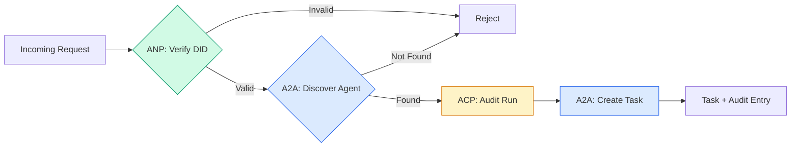

```typescript
class ProtocolGateway {
  private registry: AgentRegistry;
  private taskManager: TaskManager;
  private auditRunner: AuditableRunner;
  private identityRegistry: IdentityRegistry;

  constructor(
    registry: AgentRegistry,
    taskManager: TaskManager,
    auditRunner: AuditableRunner,
    identityRegistry: IdentityRegistry
  ) {
    this.registry = registry;
    this.taskManager = taskManager;
    this.auditRunner = auditRunner;
    this.identityRegistry = identityRegistry;
  }

  async delegateTask(
    fromDid: string,
    signature: string,
    targetAgent: string,
    message: AgentMessage,
    sessionId?: string
  ): Promise<{ task: Task; audit: AuditEntry } | { error: string }> {
    if (!this.identityRegistry.verify(fromDid, signature, message.id)) {
      return { error: "Identity verification failed" };
    }

    const card = this.registry.resolve(targetAgent);
    if (!card) {
      return { error: `Agent ${targetAgent} not found in registry` };
    }

    const audit = await this.auditRunner.run(
      targetAgent,
      [message],
      sessionId
    );
    const task = await this.taskManager.sendMessage(targetAgent, message);

    return { task, audit };
  }

  discoverAndDelegate(
    fromDid: string,
    signature: string,
    skillTag: string,
    message: AgentMessage
  ): Promise<{ task: Task; audit: AuditEntry } | { error: string }> {
    const candidates = this.registry.discoverBySkillTag(skillTag);
    if (candidates.length === 0) {
      return Promise.resolve({
        error: `No agents found with skill tag: ${skillTag}`,
      });
    }
    return this.delegateTask(
      fromDid,
      signature,
      candidates[0].name,
      message
    );
  }
}
```

gateway thực hiện bốn việc trong một cuộc gọi:
1. **ANP**: Xác minh danh tính của người gọi thông qua chữ ký DID
2. **A2A**: Khám phá agent mục tiêu và kiểm tra khả năng
3. **ACP**: Bao bọc việc thực hiện trong một dấu vết kiểm tra với quỹ đạo
4. **A2A**: Tạo một tác vụ với tính năng theo dõi vòng đời đầy đủ

### Bước 7: Nối tất cả lại với nhau

```typescript
async function protocolDemo() {
  const registry = new AgentRegistry();
  registry.register({
    name: "researcher",
    description: "Searches and summarizes findings",
    version: "1.0.0",
    url: "https://researcher.local/a2a/v1",
    capabilities: { streaming: true, pushNotifications: false },
    defaultInputModes: ["text/plain"],
    defaultOutputModes: ["text/plain", "application/json"],
    skills: [
      {
        id: "web-research",
        name: "Web Research",
        description: "Searches the web",
        tags: ["research", "search", "summarization"],
        inputModes: ["text/plain"],
        outputModes: ["application/json"],
      },
    ],
  });
  registry.register({
    name: "coder",
    description: "Writes code from specs",
    version: "1.0.0",
    url: "https://coder.local/a2a/v1",
    capabilities: { streaming: false, pushNotifications: false },
    defaultInputModes: ["text/plain", "application/json"],
    defaultOutputModes: ["text/plain"],
    skills: [
      {
        id: "code-gen",
        name: "Code Generation",
        description: "Generates code",
        tags: ["coding", "generation"],
        inputModes: ["text/plain", "application/json"],
        outputModes: ["text/plain"],
      },
    ],
  });

  const taskManager = new TaskManager();
  const auditRunner = new AuditableRunner();

  const researchTrajectory: TrajectoryEntry[] = [];

  taskManager.registerHandler(
    "researcher",
    async function* (task, message) {
      yield {
        kind: "statusUpdate" as const,
        taskId: task.id,
        status: { state: "working" as const, timestamp: Date.now() },
      };

      researchTrajectory.push({
        reasoning: "Searching for React 19 documentation",
        toolName: "web_search",
        toolInput: { query: "React 19 compiler features" },
        toolOutput: {
          results: ["react.dev/blog/react-19", "github.com/react/react"],
        },
        timestamp: Date.now(),
      });

      researchTrajectory.push({
        reasoning: "Extracting key findings from search results",
        toolName: "doc_analysis",
        toolInput: { url: "react.dev/blog/react-19" },
        toolOutput: {
          summary:
            "React 19 compiler auto-memoizes, no manual useMemo needed",
        },
        timestamp: Date.now(),
      });

      yield {
        kind: "artifactUpdate" as const,
        taskId: task.id,
        artifact: {
          id: crypto.randomUUID(),
          name: "research-results",
          parts: [
            {
              kind: "data" as const,
              data: {
                findings: [
                  "React 19 compiler auto-memoizes components",
                  "No more manual useMemo/useCallback needed",
                  "Compiler runs at build time, not runtime",
                ],
                sources: ["react.dev/blog/react-19"],
              },
              mediaType: "application/json",
            },
          ],
        },
        append: false,
        lastChunk: true,
      };

      yield {
        kind: "statusUpdate" as const,
        taskId: task.id,
        status: { state: "completed" as const, timestamp: Date.now() },
      };
    }
  );

  auditRunner.registerAgent("researcher", async () => ({
    output: [
      textMessage("agent", "React 19 compiler auto-memoizes components"),
    ],
    trajectory: researchTrajectory,
  }));

  const identityRegistry = new IdentityRegistry();

  const coderIdentity = createIdentity("coder.local", "coder");
  const researcherIdentity = createIdentity("researcher.local", "researcher");

  identityRegistry.publish(coderIdentity.document);
  identityRegistry.publish(researcherIdentity.document);

  const gateway = new ProtocolGateway(
    registry,
    taskManager,
    auditRunner,
    identityRegistry
  );

  console.log("=== Protocol Demo ===\n");

  console.log("1. Agent Discovery (A2A)");
  const researchAgents = registry.discoverBySkillTag("research");
  console.log(
    `   Found ${researchAgents.length} agent(s):`,
    researchAgents.map((a) => a.name)
  );

  console.log("\n2. Identity Verification (ANP)");
  const message = textMessage("user", "Research React 19 compiler features");
  const signature = signPayload(coderIdentity, message.id);
  const verified = identityRegistry.verify(
    coderIdentity.did,
    signature,
    message.id
  );
  console.log(`   Coder DID: ${coderIdentity.did}`);
  console.log(`   Signature verified: ${verified}`);

  console.log("\n3. Task Delegation (A2A + ACP + ANP)");
  const result = await gateway.delegateTask(
    coderIdentity.did,
    signature,
    "researcher",
    message,
    "session-001"
  );

  if ("error" in result) {
    console.log(`   Error: ${result.error}`);
    return;
  }

  console.log(`   Task ID: ${result.task.id}`);
  console.log(`   Task state: ${result.task.status.state}`);
  console.log(`   Artifacts: ${result.task.artifacts.length}`);

  console.log("\n4. Audit Trail (ACP)");
  console.log(`   Run ID: ${result.audit.runId}`);
  console.log(`   Status: ${result.audit.status}`);
  console.log(`   Trajectory steps: ${result.audit.trajectory.length}`);
  for (const step of result.audit.trajectory) {
    console.log(`     - ${step.reasoning}`);
    if (step.toolName) {
      console.log(`       Tool: ${step.toolName}`);
    }
  }

  console.log("\n5. Full Audit Log");
  const fullLog = auditRunner.getFullAuditLog();
  console.log(`   Total runs: ${fullLog.length}`);
  for (const entry of fullLog) {
    const duration = entry.completedAt
      ? `${entry.completedAt - entry.startedAt}ms`
      : "in-progress";
    console.log(`   ${entry.agentName}: ${entry.status} (${duration})`);
  }
}

protocolDemo().catch((err) => {
  console.error("Protocol demo failed:", err);
  process.exitCode = 1;
});
```

## Điều gì xảy ra

Các giao thức giải quyết con đường hạnh phúc. Đây là những gì phá vỡ trong production:

**Schema trôi dạt.** Agent A xuất bản đầu ra `application/json` quảng cáo Thẻ Agent. Nhưng JSON schema thay đổi giữa các phiên bản. Agent B phân tích cú pháp định dạng cũ và nhận rác. Khắc phục: phiên bản schemas skills và đầu ra của bạn. Thông số kỹ thuật A2A hỗ trợ `version` trên Thẻ Agent vì lý do này.

**Trạng thái vi phạm máy.** Trình xử lý agent tạo ra một sự kiện `completed`, sau đó cố gắng mang lại nhiều artifacts hơn. Nhiệm vụ là bất biến. Mã của bạn âm thầm bỏ các bản cập nhật hoặc ném. Khắc phục: kiểm tra trạng thái thiết bị đầu cuối trước khi nhượng bộ. `TaskManager` trên thực thi điều này với `break` sau trạng thái cuối.

**Lỗi giải quyết tin cậy.** Agent A cố gắng xác minh DID của Agent B, nhưng miền của Agent B đã ngừng hoạt động. Không thể tìm nạp tài liệu DID. Bạn không thành công khi mở (chấp nhận agents chưa được xác minh) hay thất bại khi đóng (từ chối mọi thứ)? ANP khuyến nghị thất bại đóng với nguyên tắc ít tin cậy nhất.

**Quỹ đạo cồng kềnh.** Ghi nhật ký quỹ đạo ACP rất mạnh mẽ nhưng tốn kém. Một agent phức tạp thực hiện 200 lệnh gọi công cụ mỗi lần chạy tạo ra các mục kiểm tra lớn. Khắc phục: quỹ đạo nhật ký ở mức độ chi tiết có thể định cấu hình. Ghi lại tên công cụ và IO để tuân thủ, bỏ qua các bước suy luận cho khối lượng công việc không được kiểm soát.

**Khám phá bầy sấm sét.** 50 agents tất cả các truy vấn `GET /agents` đồng thời khi khởi động. Khắc phục: bộ nhớ đệm Agent Thẻ có TTL, xen kẽ khoảng thời gian khám phá hoặc sử dụng đăng ký dựa trên đẩy thay vì thăm dò ý kiến.

## Ứng dụng

### Triển khai thực tế

**A2A** là trưởng thành nhất. [official spec](https://github.com/google/A2A) của Google là mã nguồn mở thuộc Linux Foundation. SDKs cho Python và TypeScript. Nếu agents của bạn cần khám phá và cộng tác năng động, hãy bắt đầu tại đây.

**ACP** đang sáp nhập vào A2A. [BeeAI project](https://github.com/i-am-bee/acp) của IBM đã tạo ra ACP như một giải pháp thay thế REST tiên, nhưng khái niệm siêu dữ liệu quỹ đạo đang được hấp thụ vào hệ sinh thái A2A. Sử dụng các mẫu ACP (ghi nhật ký quỹ đạo, vòng đời chạy) ngay cả khi bạn sử dụng A2A làm transport.

**ANP** là thử nghiệm nhất. [community repo](https://github.com/agent-network-protocol/AgentNetworkProtocol) có Python SDK (AgentConnect). Khái niệm đàm phán siêu giao thức thực sự mới lạ. Đáng xem để triển khai agent đa tổ chức.

**MCP** đã được đề cập trong Giai đoạn 13. Nếu bạn muốn agents sử dụng các công cụ thì MCP là tiêu chuẩn.

### Chọn giao thức phù hợp

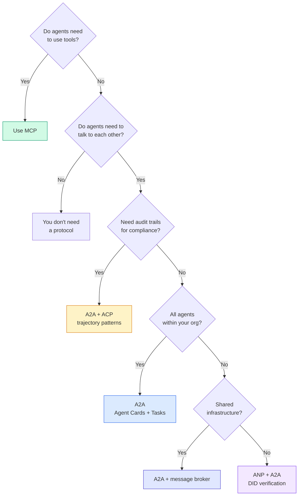

## Sản phẩm bàn giao

Bài học này tạo ra:
- `code/main.ts` -- triển khai hoàn chỉnh tất cả bốn mẫu giao thức
- `outputs/prompt-protocol-selector.md` -- một prompt giúp bạn chọn giao thức cho hệ thống của mình

## Bài tập

1. **Ủy quyền tác vụ nhiều nhảy.** Mở rộng `TaskManager` để trình xử lý agent có thể ủy quyền các tác vụ con cho các agents khác. Nhà nghiên cứu nhận một nhiệm vụ, ủy quyền "tìm kiếm" và "tóm tắt" các nhiệm vụ phụ cho hai agents chuyên môn, đợi cả hai hoàn thành, sau đó merges kết quả vào artifacts của riêng mình.

2. **Streaming dấu vết kiểm tra.** Sửa đổi `AuditableRunner` để hỗ trợ chế độ streaming. Thay vì đợi kết quả đầy đủ, hãy cập nhật `AuditEntry` năng suất trong thời gian thực khi các mục nhập quỹ đạo được thêm vào. Sử dụng trình tạo không đồng bộ để tạo ảnh chụp nhanh kiểm tra.

3. **Xoay DID.** Thêm xoay phím vào `IdentityRegistry`. Một agent sẽ có thể xuất bản tài liệu DID mới với các khóa được cập nhật trong khi vẫn duy trì tham chiếu `previousDid`. Người xác minh phải chấp nhận chữ ký từ cả khóa hiện tại và trước đó trong thời gian gia hạn.

4. **Đàm phán giao thức.** Thực hiện khái niệm siêu giao thức của ANP. Hai agents trao đổi tin nhắn `protocolNegotiation` với các định dạng ứng cử viên (ví dụ: "Tôi có thể nói JSON-RPC" so với "Tôi thích REST"). Sau tối đa 3 vòng, họ đồng ý về thể thức hoặc timeout. Định dạng đã thỏa thuận xác định `TaskManager` hoặc `AuditableRunner` họ sử dụng.

5. **Khám phá giới hạn tốc độ.** Thêm trình bao bọc `RateLimitedRegistry` lưu vào bộ nhớ đệm Agent tra cứu Thẻ bằng TTL có thể định cấu hình và giới hạn truy vấn khám phá mỗi agent mỗi giây. Mô phỏng một đàn 100 con sấm sét agents phát hiện ra nhau khi khởi động và đo lường sự khác biệt.

## Thuật ngữ chính

| Thuật ngữ | Những gì mọi người nói | Ý nghĩa thực sự của nó |
|------|----------------|----------------------|
| MCP | "Giao thức cho các công cụ AI" | Một giao thức server máy khách để agents khám phá và sử dụng các công cụ. Agent với công cụ, không phải agent với agent. |
| A2A | "Giao thức agent của Google" | Một giao thức ngang hàng để cộng tác agent thuộc Linux Foundation. Khám phá thông qua Thẻ Agent, vòng đời tác vụ 9 trạng thái streaming qua SSE. Hỗ trợ liên kết JSON-RPC, REST và gRPC. |
| ACP | "Nhắn tin agent doanh nghiệp" | REST API của IBM/BeeAI cho agent chạy với TrajectoryMetadata: mọi phản hồi đều mang đầy đủ chuỗi lý luận và gọi công cụ. Hợp nhất thành A2A. |
| ANP | "Danh tính agent phi tập trung" | Một giao thức cộng đồng sử dụng `did:wba` (DID) cho nhận dạng mật mã, HPKE cho E2EE và đàm phán siêu giao thức được hỗ trợ bởi AI cho agents chưa bao giờ gặp nhau. |
| Thẻ Agent | "Danh thiếp của một agent" | Một tài liệu JSON tại `/.well-known/agent-card.json` mô tả skills, các loại MIME được hỗ trợ, sơ đồ bảo mật và ràng buộc giao thức. |
| DID | "ID phi tập trung" | Tiêu chuẩn W3C cho các danh tính có thể xác minh bằng mật mã được lưu trữ trên tên miền riêng của agent. ANP sử dụng phương pháp `did:wba`. |
| Quỹ đạoSiêu dữ liệu | "Biên lai kiểm toán" | Cơ chế của ACP để đính kèm các bước suy luận, lệnh gọi công cụ và inputs/outputs của chúng vào mọi phản hồi agent. |
| Giao thức siêu | "Agents đàm phán làm thế nào để nói chuyện" | Cách tiếp cận của ANP trong đó agents sử dụng ngôn ngữ tự nhiên để tự động thống nhất về các định dạng dữ liệu, sau đó tạo mã để xử lý chúng. |
| Nhiệm vụ | "Một đơn vị công việc" | Công việc theo dõi đối tượng có trạng thái của A2A từ khi gửi đến khi hoàn thành. Bất biến một lần thiết bị đầu cuối. |

## Đọc thêm

- [Google A2A specification](https://github.com/google/A2A) -- thông số kỹ thuật và SDKs chính thức (v1.0.0, Linux Foundation)
- [IBM/BeeAI ACP specification](https://github.com/i-am-bee/acp) -- Thông số kỹ thuật OpenAPI 3.1 cho các lần chạy agent và siêu dữ liệu quỹ đạo
- [Agent Network Protocol](https://github.com/agent-network-protocol/AgentNetworkProtocol) - Nhận dạng dựa trên DID, E2EE, đàm phán siêu giao thức
- [Model Context Protocol docs](https://modelcontextprotocol.io/) - Đặc điểm kỹ thuật MCP của Anthropic (được đề cập trong Giai đoạn 13)
- [W3C Decentralized Identifiers](https://www.w3.org/TR/did-core/) - tiêu chuẩn nhận dạng làm nền tảng cho ANP
- [RFC 9180 (HPKE)](https://www.rfc-editor.org/rfc/rfc9180) -- sơ đồ mã hóa mà ANP sử dụng cho E2EE
- [FIPA Agent Communication Language](http://www.fipa.org/specs/fipa00061/SC00061G.html) - tiền thân học thuật của các giao thức agent hiện đại
