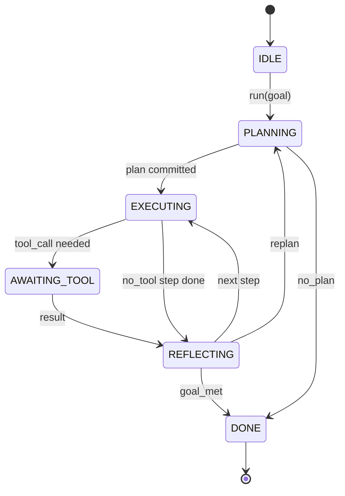

# Hợp đồng vòng lặp Agent Harness

> Sự harness là agent. model là một bộ đồng xử lý. Bài học này đóng băng hợp đồng vòng lặp mà bạn có thể kết nối bất kỳ model nào.

**Loại:** Xây dựng
**Ngôn ngữ:** Python
**Kiến thức tiên quyết:** Giai đoạn 13 bài 01-07, Giai đoạn 14 bài 01
**Thời lượng:** ~90 phút

## Mục tiêu học tập
- Chỉ định vòng lặp agent harness dưới dạng máy trạng thái xác định với các chuyển đổi rõ ràng.
- Triển khai mười chủ đề hook vòng đời mà người vận hành policy, telemetry và guardrails vào.
- Xác định hai điểm kéo trong đó vòng lặp mang lại quyền kiểm soát cho người gọi và tiếp tục trên đầu vào mới.
- Thực thi ngân sách cho mỗi session (lượt, gọi công cụ, đồng hồ treo tường) mà không bị rò rỉ một phần trạng thái khi vượt quá.
- Phát ra một luồng gồm mười một loại sự kiện được nhập để giao diện người dùng và trình theo dõi xuôi dòng có thể đăng ký mà không cần kiểm tra trực tiếp vòng lặp.

## Khung

Một agent mã hóa chạy không cần giám sát trong bốn mươi lượt không phải là một vòng lặp trò chuyện. Nó là một máy trạng thái có các nút mà người vận hành có thể chặn và các cạnh mà người vận hành có thể kiểm tra. Một khi bạn viết hợp đồng ra, việc hoán đổi models, công cụ hoặc policies sẽ không còn là một cấu trúc lại. Nó trở thành một cuộc gọi đăng ký.

Bài học này xây dựng hợp đồng đó. Chúng ta nêu tên sáu tiểu bang, mười chủ đề hook, hai điểm kéo, mười một loại sự kiện và một phong bì ngân sách. Mọi thứ khác trong harness (registry công cụ, transport JSON-RPC, người điều phối, công cụ lập kế hoạch) đều cắm vào hình dạng này.

## Các tiểu bang

Vòng lặp có sáu trạng thái. Năm người đang hoạt động. Một là thiết bị đầu cuối.



`IDLE` là điểm vào hợp pháp duy nhất. `DONE` là lối thoát hợp pháp duy nhất. `AWAITING_TOOL` là trạng thái duy nhất mang lại điểm kéo. Mọi quá trình chuyển đổi khác đều là nội bộ.

Cỗ máy trạng thái là xác định. Với cùng một nhật ký sự kiện, harness sẽ chuyển sang trạng thái cũ. Thuộc tính đó cho phép bạn phát lại sessions để gỡ lỗi mà không cần gọi lại model.

## Các chủ đề hook

Hooks là đường nối của người vận hành vào vòng lặp. harness bắn mười chủ đề. Mỗi chủ đề chấp nhận bất kỳ số lượng người đăng ký nào. Người đăng ký kích hoạt theo thứ tự đăng ký. Người đăng ký có thể thay đổi payload, tăng để hủy lượt hoặc trả lại lính gác để bỏ qua bước tiếp theo.

```text
before_plan         after_plan
before_tool_call    after_tool_call
before_step         after_step
on_error
on_pause
on_budget_exceeded
on_complete
```

Hình dạng phản ánh những gì Claude Code, Cursor và OpenCode đều hội tụ vào giữa năm 2025. Tên là chức năng, không có thương hiệu. Một hook chặn cuộc sống `rm -rf` ở `before_tool_call`. Một hook ships OpenTelemetry span sống ở `after_step`. Một hook tiếp tục vào một session bị tạm dừng sống ở `on_pause`.

## Các điểm kéo

Vòng lặp mang lại quyền kiểm soát hai lần. Đầu tiên là `AWAITING_TOOL` khi nó không thể đạt được tiến bộ nếu không có kết quả công cụ. Thứ hai là `on_pause` khi ngân sách cạn kiệt hoặc một hook rõ ràng yêu cầu xem xét của con người.

Điểm kéo cũng không phải là một ngoại lệ. Đó là một sự trở lại. Người gọi kiểm tra trạng thái harness, lấy bất cứ thứ gì harness yêu cầu và gọi cho `resume(payload)`. Chiếc harness nhặt lại nơi nó dừng lại. Đây có hình dạng tương tự như máy phát điện Python. Sự transport trên điểm kéo là sự lựa chọn của bạn. Trong TUI, đó là nhấn phím. Hơn MCP nó là `tools/call`. Qua một hàng đợi, đó là một cuộc thăm dò việc làm.

## Luồng sự kiện

Vòng lặp nối các sự kiện vào một luồng được nhập tại các điểm cụ thể trong hợp đồng. Sự kiện trực tiếp chỉ dành cho phần nối và người đăng ký có thể phát lại từ bất kỳ phần bù nào. Mười một loại sự kiện được triển khai là:

- `session.start` - phát ra một lần khi `run(goal)` được gọi
- `plan.draft` - phát ra khi người lập kế hoạch trả về kế hoạch dự thảo
- `plan.commit` - phát ra sau khi dự thảo được cam kết làm kế hoạch hoạt động
- `step.start` — phát ra khi bắt đầu mỗi bước thực thi
- `step.end` - phát ra vào cuối mỗi bước thực thi
- `tool.call` - phát ra khi một bước yêu cầu công cụ nhường quyền kiểm soát cho người gọi
- `tool.result` - phát ra trên sơ yếu lý lịch với kết quả công cụ
- `tool.error` - phát ra trên sơ yếu lý lịch với lỗi hoặc khi hook hủy cuộc gọi
- `budget.warn` — phát ra khi đạt đến giới hạn ngân sách
- `session.pause` - phát ra khi vòng lặp nhường lại khi tạm dừng (ngân sách hoặc hook)
- `session.complete` - phát ra một lần khi vòng lặp đạt đến `DONE`

Các sự kiện không trùng lặp hook payloads. Hooks là bắt buộc (đột biến, hủy bỏ). Các sự kiện mang tính quan sát (kỷ lục, ship). Đối xử với chúng như trực giao.

## Phong bì ngân sách

Một session có ba giới hạn. Đếm lượt, đếm cuộc gọi công cụ, giây đồng hồ treo tường. Mỗi lượt tăng dần một. Mỗi lệnh gọi công cụ tăng dần các lệnh gọi công cụ. Đồng hồ treo tường được kiểm tra trên mỗi lần chuyển đổi trạng thái. Khi đạt đến bất kỳ giới hạn nào, vòng lặp sẽ kích hoạt `on_budget_exceeded`, phát ra `budget.warn`, sau đó chuyển sang `IDLE` với lý do vượt quá ngân sách ở điểm kéo tiếp theo.

Ngân sách không phải là một kill switch. Đó là một năng suất. Người gọi quyết định có nên gia hạn ngân sách và tiếp tục hay đóng session.

## Bài học này không làm gì

Nó không gọi một model. Nó không đăng ký các công cụ thực. Nó không thực hiện một transport. Đó là bốn bài học tiếp theo. Bài học này đóng đinh hợp đồng để bốn người tiếp theo có thể cắm vào nó mà không cần viết lại.

Người lập kế hoạch xác định trong `main.py` là một người thay thế. Nó trả về một kế hoạch được mã hóa cứng gồm ba bước, hai trong số đó yêu cầu kết quả công cụ. Vấn đề là vòng lặp, không phải kế hoạch.

## Cách đọc mã

`HarnessLoop` là class chính. Nó giữ trạng thái, đốt cháy hooks, phát ra các sự kiện. `Budget` theo dõi giới hạn. `Event` là phong bì được đánh máy trên luồng. `HookRegistry` là bảng điều phối. `_transition` là hàm duy nhất thay đổi trạng thái, vì vậy các bất biến của máy trạng thái nằm ở một nơi.

Đọc `main.py` từ trên xuống dưới. Sau đó đọc `code/tests/test_loop.py`. Các bài kiểm tra ghim mọi chuyển tiếp và mọi thứ tự bắn hook.

## Tiến xa hơn

Phần khó nhất của việc xây dựng một harness trong production không phải là bộ máy nhà nước. Nó đang làm cho hợp đồng có thể thực thi. Hợp đồng phải tồn tại sau một lần tải lại nóng bỏng của người lập kế hoạch. Nó phải tồn tại sau một công cụ trả lại JSON dị dạng. Nó phải sống sót qua một hook tăng lên trong `before_tool_call` hai phần ba chặng đường qua một session bốn mươi lượt. Các bài kiểm tra trong bài học này thực hiện các chế độ thất bại đó. Chạy chúng. Phá vỡ chúng. Thêm trường hợp.

Bài học tiếp theo bổ sung công cụ registry. Sau đó, JSON-RPC transport. Sau đó, người điều phối. Đến bài hai mươi bốn, vòng lặp trong tệp này sẽ chạy một kế hoạch thực sự chống lại các công cụ thực tế với ngân sách thực tế được thực thi.
