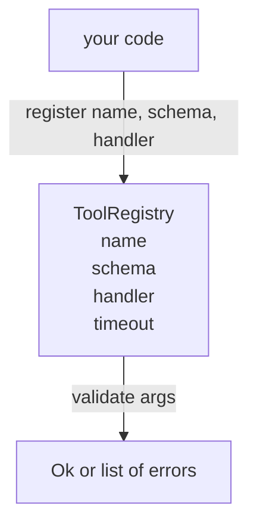

# Công cụ Registry với Xác thực Schema

> Một công cụ mà agent không thể xác thực là một công cụ mà agent không thể gọi. Xây dựng registry và trình kiểm tra schema trước khi bạn xây dựng các công cụ.

**Loại:** Xây dựng
**Ngôn ngữ:** Python
**Kiến thức tiên quyết:** Giai đoạn 13 bài 01-07, Giai đoạn 14 bài 01
**Thời lượng:** ~90 phút

## Mục tiêu học tập
- Giữ một registry nhập tên công cụ → schema → trình xử lý mà người điều phối có thể hỏi một lần và tin tưởng sau đó.
- Triển khai một tập hợp con JSON Schema 2020-12 bao gồm các từ khóa mà chín mươi phần trăm lệnh gọi công cụ thực sự sử dụng.
- Trả về đường dẫn lỗi chính xác, hình con trỏ json để model có thể tự sửa trong một chuyến đi khứ hồi.
- Từ chối đăng ký lại mà không ghi đè rõ ràng, vì ghi đè im lặng là cách production danh mục công cụ trôi dạt.
- Giữ cho trình xác thực thuần túy (không I/O, không có thời gian, không toàn cục) để có thể chạy lại trên nhật ký phát lại.

## Tại sao registry đến trước công cụ

Một agent mã hóa vào năm 2026 có nhiều công cụ đã đăng ký hơn model có thể chứa trong một context window. Một harness không tầm thường sẽ đăng ký hai trăm công cụ và nổi lên từ mười đến bốn mươi tại bất kỳ ngã rẽ nào. registry là nguồn gốc của sự thật cho "những công cụ nào tồn tại", "lập luận của họ có hình dạng nào" và "tôi gọi người xử lý nào". Một khi ba câu trả lời đó được ghim, rest của harness có thể ngừng đoán.

Sai lầm mà chúng tôi đang tránh là shipping người xử lý mà không có schemas hoặc shipping schemas không có xác thực. Cả hai đều phổ biến. Cả hai đều biến lớp tiếp theo (người điều phối trong bài học hai mươi ba) thành một trò chơi đoán trong đó chế độ thất bại duy nhất là stack trace từ người xử lý.

## Bản ghi công cụ trông như thế nào

```text
ToolRecord
  name        : str          (unique, lowercase alphanumeric and underscore segments separated by dots, e.g., snake_case.segment.case)
  description : str          (one line, shown to the model)
  schema      : dict         (JSON Schema 2020-12 subset)
  handler     : Callable     (async or sync, returns Any)
  idempotent  : bool         (dispatcher uses this for retry decisions)
  timeout_ms  : int          (override per-tool dispatcher default)
```

schema là trường duy nhất mà trình xác thực chạm vào. Trình xử lý mờ đục với nó. Chúng ta cố tình tách chúng ra. schema là dữ liệu. Trình xử lý là mã. Việc trộn chúng sẽ khiến bạn đặt logic xác thực bên trong trình xử lý, đó là lỗi mà chúng ta đang ngăn chặn.

## Tập hợp con JSON Schema 2020-12

Thông số kỹ thuật đầy đủ của 2020-12 là một bài báo. Chúng ta cần tám từ khóa.

```text
type           string / number / integer / boolean / object / array / null
properties     map of property name -> schema
required       list of property names
enum           list of allowed primitive values
minLength      integer, applies to strings
maxLength      integer, applies to strings
pattern        ECMA-262-compatible regex, applies to strings
items          schema applied to every array element
```

Điều đó đủ để bao gồm những gì một công cụ API thực sự cần. Các từ khóa mà chúng ta không thêm vào (oneOf, anyOf, allOf, $ref, điều kiện) có giá trị trong production schemas nhưng biến trình xác thực thành một người đi bộ trên cây với các chu kỳ. Chúng ta đang xây dựng một registry, không phải một động cơ JSON Schema.

## Json đường dẫn lỗi con trỏ

Khi xác thực không thành công, trình xác thực trả về danh sách lỗi. Mỗi lỗi mang một đường dẫn con trỏ json vào đầu vào. Con trỏ là một chuỗi tên thuộc tính và chỉ mục mảng có tiền tố dấu gạch chéo.

```text
{"a": {"b": [1, 2, "x"]}}
                    ^
                    /a/b/2
```

model đọc đường dẫn lỗi tốt hơn đọc câu. Nếu một schema yêu cầu `args.user.email` và model truyền một số nguyên, thì lỗi phải được `/user/email` bằng `expected_type: string`. model khắc phục điều đó trong cuộc gọi tiếp theo mà không cần một vòng ngôn ngữ tự nhiên.

## Đăng ký và ghi đè

`register(name, schema, handler, **opts)` từ chối đăng ký lại theo mặc định. Người gọi phải vượt qua `override=True` để thay thế. Đây là vệ sinh hoạt động. Hai phần của cơ sở mã âm thầm đăng ký cùng một tên công cụ là loại lỗi mất một tuần để tìm thấy trong production.

registry hiển thị ba phương pháp đọc. `get(name)` trả về bản ghi hoặc tăng. `validate(name, args)` trả về `Ok` hoặc danh sách lỗi. `names()` trả về tên công cụ theo thứ tự đăng ký.

## Trình xác thực là gì và không phải là gì

Nó là một lần vượt qua cây schema, đệ quy. Nó tinh khiết. Nó không gọi trình xử lý. Nó không ép buộc các kiểu (một chuỗi `"42"` không truyền một số schema). Nó không âm thầm cắt bớt.

Nó không phải là ranh giới an ninh. Trình xử lý độc hại vẫn có thể hoạt động sai sau khi xác thực vượt qua. Người điều phối trong bài hai mươi ba thêm timeout và sandbox lớp. Các registry thêm hình dạng.

## Hình dạng



## Cách đọc mã

`code/main.py` định nghĩa `ToolRegistry`, `ToolRecord`, `ValidationError` và tám hàm trình xác thực. Trình xác thực gửi trên `schema["type"]` (hoặc coi một schema có `enum` là kiểm tra enum chưa được nhập). Mỗi trình xác thực loại trả về một danh sách trống hoặc một danh sách `ValidationError`. Bộ đi cấp cao nhất nối các lỗi và thêm các đoạn đường dẫn khi nó đi xuống.

`code/tests/test_registry.py` bao gồm đăng ký, ghi đè, xác thực thành công, xác thực không thành công với đường dẫn và mọi từ khóa trong tập hợp con.

## Tiến xa hơn

Hai phần mở rộng bạn sẽ muốn khi bài học này hạ cánh `$ref` độ phân giải so với khối định nghĩa cục bộ và `additionalProperties: false` cho hình dạng nghiêm ngặt. Cả hai đều nhỏ. Cả hai đều phổ biến để thêm vào khi danh mục công cụ phát triển qua năm mươi công cụ. Chúng ta đã bỏ chúng ra khỏi bài học để giữ tệp dưới một lần đọc.

Bài học tiếp theo (hai mươi hai) xây dựng transport stdio JSON-RPC hiển thị registry này cho máy khách model. Bài học sau (hai mươi ba) kết thúc cả hai sau một người điều phối với timeouts và thử lại.
