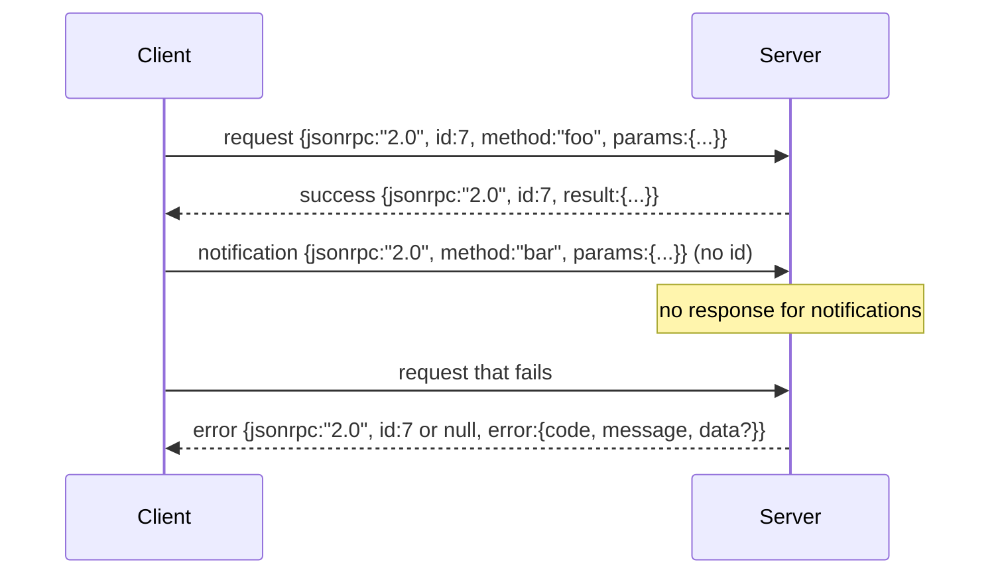

# JSON-RPC 2.0 trên Stdio được phân tách bằng dòng mới

> Sự transport giữa máy khách model và server công cụ là JSON-RPC qua stdio. Cuộn nó bằng tay một lần sẽ dạy bạn mọi lớp khung đang trả tiền cho điều gì.

**Loại:** Xây dựng
**Ngôn ngữ:** Python
**Kiến thức tiên quyết:** Giai đoạn 13 bài 01-07, Giai đoạn 14 bài 01
**Thời lượng:** ~90 phút

## Mục tiêu học tập
- Nói JSON-RPC 2.0 được đóng khung dưới dạng JSON được phân tách bằng dòng mới trên stdin và stdout.
- Ánh xạ năm mã lỗi tiêu chuẩn (-32700, -32600, -32601, -32602, -32603) và hiển thị chúng với ngữ nghĩa phù hợp.
- Phân biệt các yêu cầu, phản hồi, thông báo và batches mà không cần phát minh ra các khóa phong bì mới.
- Xử lý một lỗi phân tích cú pháp trên mỗi dòng mà không gây ngộ độc rest của luồng.
- Xây dựng bản demo tự kết thúc bằng io. BytesIO để bài học chạy mà không tạo ra process con.

## Tại sao JSON-RPC vẫn là ngôn ngữ chung

Một agent lập trình vào năm 2026 nói về có thể có mười hai công cụ servers trong một session. Mỗi server là một process riêng biệt hoặc một endpoint từ xa. Định dạng dây đã giống nhau kể từ năm 2013. JSON-RPC 2.0 là thông số kỹ thuật hai trang. Nó tồn tại vì các lựa chọn thay thế (gRPC, HTTP mỗi cuộc gọi, nhị phân tùy chỉnh) đều áp đặt sự đánh đổi JSON-RPC không: họ chọn streaming hoặc hàng loạt hoặc ghép nối transport. JSON-RPC đối xứng trên stdio, ổ cắm, websockets và HTTP và máy khách có thể điều khiển một server mà nó chưa từng thấy nếu cả hai đều tôn trọng thông số kỹ thuật.

Bài học này xây dựng biến thể stdio. JSON được phân tách bằng dòng mới. Mỗi yêu cầu là một dòng. Mỗi câu trả lời là một dòng. Ranh giới transport là `\n`.

## Hình dạng dây

Bốn hình dạng phong bì tồn tại. Hai được nói bởi khách hàng. Hai được nói bởi server.



Thông báo không có `id`. Người server không được phản ứng với nó. Nếu một server trả về phản hồi cho một thông báo, máy khách không có cách nào để đính kèm nó vào một trang web cuộc gọi. Quy tắc duy nhất đó giữ cho toán học đóng khung đơn giản.

batch là một mảng JSON các yêu cầu hoặc thông báo. server trả lời với một loạt phản hồi, theo bất kỳ thứ tự nào, một câu trả lời cho mỗi mục nhập không thông báo. Nếu mọi mục trong batch là thông báo, server sẽ không gửi lại gì.

## Năm mã lỗi

```text
-32700  Parse error      JSON could not be parsed
-32600  Invalid Request  Envelope shape is wrong
-32601  Method not found
-32602  Invalid params
-32603  Internal error
```

Các mã từ -32000 đến -32099 được dành riêng cho các lỗi do server xác định. Mọi thứ khác đều do ứng dụng xác định. Bài học gắn bó với năm. Nếu trình xử lý của bạn tăng, transport sẽ bao bọc nó là -32603, ngoại trừ tên class trong `data.exception`.

Lỗi phân tích cú pháp có một quy tắc đặc biệt. Các `id` trong phản hồi là `null`, bởi vì yêu cầu chưa bao giờ được phân tích đủ để trích xuất id.

## Đóng khung Newline và bản demo BytesIO

transport đọc từng dòng một. Một dòng có kích thước byte lên đến và bao gồm cả `\n`. Nếu không thể phân tích cú pháp một dòng, transport sẽ ghi phản hồi -32700 với các `id: null` và tiếp tục. Dòng suối không bị nhiễm độc. Dòng tiếp theo được phân tích cú pháp mới.

Đối với bài học, chúng tôi quấn một cặp `io.BytesIO` là stdin và stdout. server đọc các yêu cầu cho đến EOF, viết phản hồi cho từng yêu cầu và trả về. Khách hàng đọc lại câu trả lời. Không có process xuất hiện. Không timeouts. Hành vi transport giống hệt với một đường ống quy trình con thực vì giao diện `io` của Python trình bày cùng một `.readline()` và hợp đồng `.write()`.

## Công văn phương thức

Người transport không biết những phương pháp nào tồn tại. Nó giao cho một `handler(method, params)` có thể gọi được mà harness cung cấp. Trình xử lý trả về kết quả hoặc tăng. Ba ngoại lệ classes hiển thị các mã cụ thể.

```text
MethodNotFound -> -32601
InvalidParams  -> -32602
Anything else  -> -32603 with exception name in data
```

Người transport không bao giờ nhìn thấy một công cụ registry. Người registry ngồi phía sau người xử lý. Đây là lớp chúng tôi muốn. Người transport nói JSON-RPC. registry nói các hình dạng công cụ. Người điều phối (bài hai mươi ba) khâu chúng lại với nhau.

## Hành vi phát trực tiếp khi có lỗi

```text
client writes              server reads             server writes
---------------            -----------              -------------
{...valid request...}      parses ok                {...response, id matches...}
{...broken json...         parse fails              {id:null, error: -32700}
{...valid request...}      parses ok                {...response, id matches...}
{...missing method...}     invalid envelope         {id:X, error: -32600}
```

Một đường JSON bị đứt không dừng vòng lặp. Trường `method` bị thiếu sẽ không dừng vòng lặp. Ngoại lệ của trình xử lý không dừng vòng lặp. transport tiếp tục đọc cho đến khi EOF.

## Thông báo và luồng không đối xứng

Một thông báo là cháy và quên. harness sử dụng thông báo cho các sự kiện tiến độ, tín hiệu hủy và dòng nhật ký. Thông báo là cách một công cụ hoạt động lâu dài có thể phát trực tuyến cập nhật trạng thái mà không cần quay lại cho từng thông báo.

Bài học triển khai một trình trợ giúp thông báo đi, `write_notification`. server sử dụng nó để phát ra tiến trình trong khi một yêu cầu đang được thực hiện. Bản demo cho thấy mẫu: một yêu cầu đến, trình xử lý phát ra hai thông báo tiến độ, sau đó viết phản hồi cuối cùng.

## Cách đọc mã

`code/main.py` định nghĩa `StdioTransport`, trình trợ giúp phân tích cú pháp (`parse_request`), ba trình trợ giúp ghi (`write_response`, `write_error`, `write_notification`) và vòng lặp điều phối `serve`. Hằng số mã lỗi trực tiếp ở phạm vi mô-đun.

`code/tests/test_transport.py` bao gồm năm mã lỗi, thông báo (không có phản hồi được viết), batches (mảng vào, mảng ra, thông báo bị bỏ qua), JSON bị hỏng (lỗi phân tích cú pháp sau đó tiếp tục) và luồng bất đối xứng trong đó trình xử lý viết thông báo giữa cuộc gọi.

## Tiến xa hơn

transport này là đủ cho các bài học tiếp theo. Production transports thêm ba điều. Một trường id tương quan tồn tại sau khi chuyển tiếp (`id` của bạn đã là này, nhưng trong lưới, bạn cũng cần một id trace bên ngoài). Kênh hủy (một thông báo như `$/cancelRequest` với id của cuộc gọi trên chuyến bay). Và một cái bắt tay đàm phán kiểu nội dung để cùng một ổ cắm có thể nói JSON-RPC và HTTP có thể phát trực tuyến. Không ai trong số đó thay đổi dây. Họ thêm siêu dữ liệu.
