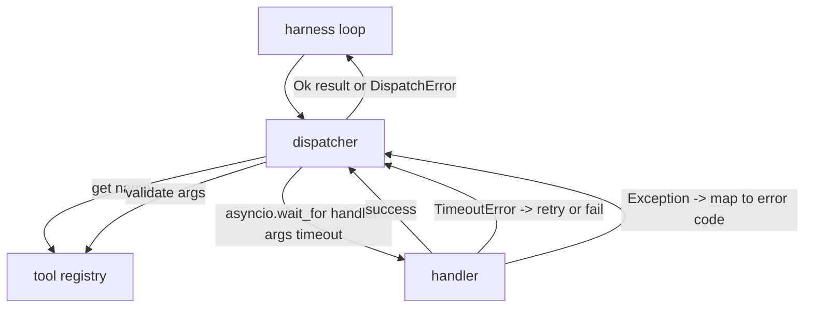
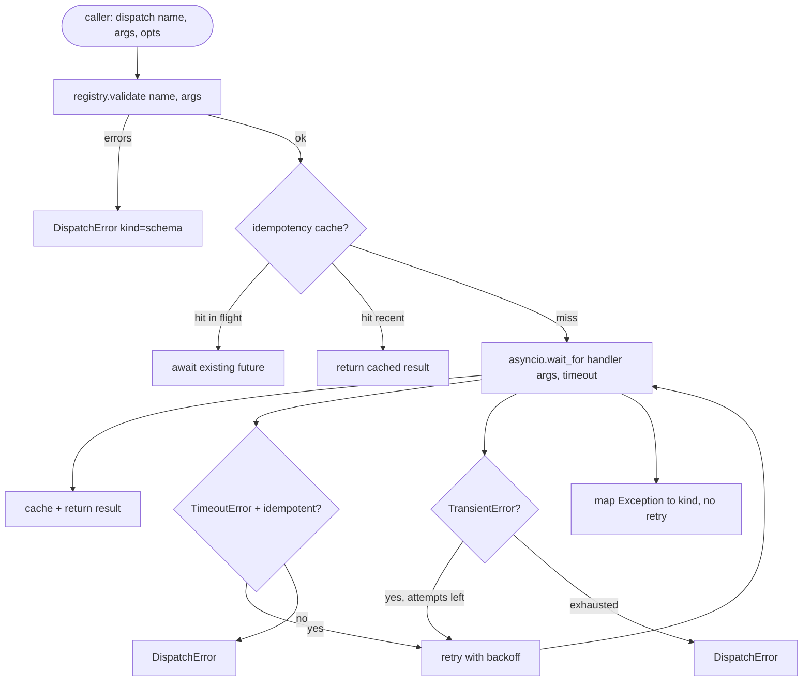

# Trình điều phối cuộc gọi chức năng

> Người điều phối là nơi harness trả tiền cho mọi lời hứa mà schema đã đưa ra. Timeouts, thử lại, khử trùng lặp, ánh xạ lỗi. Tất cả trên một đường may.

**Loại:** Xây dựng
**Ngôn ngữ:** Python
**Kiến thức tiên quyết:** Giai đoạn 13 bài 01-07, Giai đoạn 14 bài 01
**Thời lượng:** ~90 phút

## Mục tiêu học tập
- Bao bọc trình xử lý công cụ trong timeout cho mỗi lệnh gọi trả về lỗi đã nhập thay vì treo vòng lặp.
- Áp dụng thử lại backoff theo cấp số nhân với jitter và số lần thử tối đa.
- Thử lại loại trùng lặp trên khóa idempotency để thử lại chạy đua với bản gốc chậm không chạy hai lần.
- Ánh xạ các ngoại lệ và lỗi transport của trình xử lý vào một phong bì lỗi duy nhất mà vòng lặp harness đã hiểu.
- Điều phối song song bị ràng buộc với giới hạn đồng thời để quạt ra trong số bốn mươi lệnh gọi công cụ không làm cạn kiệt vòng lặp sự kiện.

## Vị trí của người điều phối

Giữa vòng lặp harness (bài hai mươi) và công cụ registry (bài hai mươi mốt). transport (bài hai mươi hai) cung cấp cho vòng lặp. Vòng lặp trao một lệnh gọi công cụ cho người điều phối. Trình điều phối gọi registry, chạy trình xử lý và trả về kết quả hoặc phong bì lỗi hình JSON-RPC.



Trình điều phối là lớp duy nhất biết về bộ đếm thời gian, thử lại và idempotency. Vòng lặp thì không. registry thì không. Người xử lý thì không. Sự cô lập đó là vấn đề.

## Timeouts

Mỗi công cụ có một timeout mặc định. Kỷ lục registry mang `timeout_ms`. Người điều phối ghi đè nó khỏi ghi đè cho mỗi cuộc gọi khi harness vượt qua một. Chúng ta sử dụng `asyncio.wait_for`. Khi timeout, nhiệm vụ của trình xử lý bị hủy và trình điều phối trả về `DispatchError(kind="timeout")`.

Một timeout không phải là lỗi có thể thử lại theo mặc định đối với các công cụ không phải idempotent. Một `db.write` đã hết thời gian chờ có thể đã cam kết hoặc không. Thử lại để sao chép ghi. Người điều phối tôn vinh lá cờ `idempotent` từ hồ sơ registry. Các công cụ idempotent thử lại. Các công cụ không idempotent thì không.

## Thử lại với tính năng dự phòng theo cấp số nhân

Thời gian thử lại policy tối đa là ba lần thử. Backoff theo cấp số nhân với jitter.

```text
attempt 1  -> delay 0
attempt 2  -> delay 0.1s * (1 + random[0..0.5])
attempt 3  -> delay 0.4s * (1 + random[0..0.5])
```

Chỉ có lỗi `timeout` và `transient` thử lại. Lỗi `schema`, lỗi `not_found` hoặc lỗi `internal` sẽ không thử lại. Schema lỗi là xác định. Thử lại không thay đổi kết quả và đốt cháy ngân sách.

Vòng lặp thử lại tôn trọng ngân sách từ harness. Nếu ngân sách của người gọi không còn lệnh gọi công cụ, thì trình điều phối sẽ nhanh chóng thất bại trong lần thử đầu tiên và trả về `kind="budget_exceeded"`.

## Idempotency key dedupe

Thử lại kích hoạt trong khi bản gốc vẫn đang bay là một lỗi production thực sự. Cuộc gọi đầu tiên bị treo ở bốn điểm chín giây (ngay dưới timeout). Thử lại sẽ kích hoạt sau năm giây. Bây giờ hai yêu cầu chạy đua với cùng một phần phụ trợ. Nếu công cụ `payments.charge`, bạn đã tính phí hai lần.

Người điều phối chấp nhận `idempotency_key` tùy chọn. Nếu cùng một chìa khóa đang bay khi có cuộc gọi đến, người điều phối sẽ đợi tương lai trên chuyến bay và trả về kết quả của nó. Bộ nhớ đệm giữ các phím trong sáu mươi giây sau khi hoàn thành để tiếp nhận các lần thử lại muộn.

Chìa khóa là trách nhiệm của người gọi. harness bắt nguồn từ người lập kế hoạch: `f"{step_id}:{tool_name}:{hash(args)}"`. Người điều phối không phát minh ra khóa, bởi vì chỉ lấy một khóa từ các đối số làm cho hai cuộc gọi khác nhau về mặt ngữ nghĩa trông giống nhau.

## Phong bì lỗi

Một công văn không thành công trả về một hình dạng duy nhất.

```text
DispatchError
  kind        : "timeout" | "transient" | "schema" | "not_found" | "internal" | "budget_exceeded"
  message     : str
  attempts    : int
  jsonrpc_code: int   (one of -32601, -32602, -32603)
```

Vòng lặp harness ánh xạ `kind` đến trạng thái tiếp theo. `schema` và `not_found` đến `on_error` và trigger kế hoạch lại. `timeout` và `transient` đi `on_error` và có thể lập kế hoạch lại hoặc không tùy thuộc vào số lần thử. `budget_exceeded` triggers `on_budget_exceeded`.

## Giới hạn đồng thời khi phân xuất

`gather(*calls)` chạy đồng thời tất cả các coroutine. Với bốn mươi lệnh gọi công cụ, tức là bốn mươi ổ cắm mở hoặc bốn mươi đường ống xử lý phụ. Hầu hết các backend không thích bốn mươi kết nối song song từ một máy khách.

Người điều phối bọc `gather` trong một semaphore. Giới hạn đồng thời mặc định là tám. Mỗi lệnh gọi sẽ nhận được semaphore trước khi gửi và phát hành khi hoàn tất. Người gọi nhìn thấy đầu ra hình `gather` nhưng lịch trình thực tế bị giới hạn.

## Quy trình cho một cuộc gọi



## Cách đọc mã

`code/main.py` định nghĩa `Dispatcher`, `DispatchError` và `TransientError`. Người điều phối có registry về việc xây dựng. `dispatch(name, args, ...)` không đồng bộ là điểm vào duy nhất. Mỗi lần thử timeouts được áp dụng nội tuyến bên trong `_run_with_retries` bằng cách sử dụng `asyncio.wait_for`. `gather_bounded(calls)` chạy nhiều công văn với giới hạn đồng thời.

`code/tests/test_dispatcher.py` bao gồm việc kích hoạt timeout, thử lại khi tạm thời, không thử lại khi schema lỗi, loại bỏ trùng lặp idempotency (hai lệnh gọi đồng thời với cùng một khóa thu gọn thành một lệnh gọi trình xử lý) và giới hạn đồng thời (semaphore đang hoạt động).

Các thử nghiệm sử dụng các bộ xử lý dựa trên `Counter` `asyncio.sleep(0)` và xác định, vì vậy chúng kết thúc trong mili giây và không phụ thuộc vào thời gian đồng hồ treo tường.

## Tiến xa hơn

Hai tiện ích mở rộng production người điều phối bổ sung. Đầu tiên, ghi nhật ký có cấu trúc ở mọi quá trình chuyển đổi (mà luồng sự kiện của vòng lặp đã cung cấp cho bạn, nhưng trình điều phối cũng phải phát ra các sự kiện `dispatch.attempt` và `dispatch.retry`). Thứ hai, bộ ngắt mạch: sau khi N lỗi trong một cửa sổ, một công cụ sẽ có một khoảng thời gian nguội khi các công văn trả về ngay lập tức với `kind="circuit_open"` thay vì cố gắng xử lý. Cả hai đều phù hợp với người điều phối này mà không thay đổi hợp đồng.

Bài học hai mươi bốn dán người điều phối vào một agent lập kế hoạch và thực hiện để bạn thấy cả bốn phần đang chuyển động.
