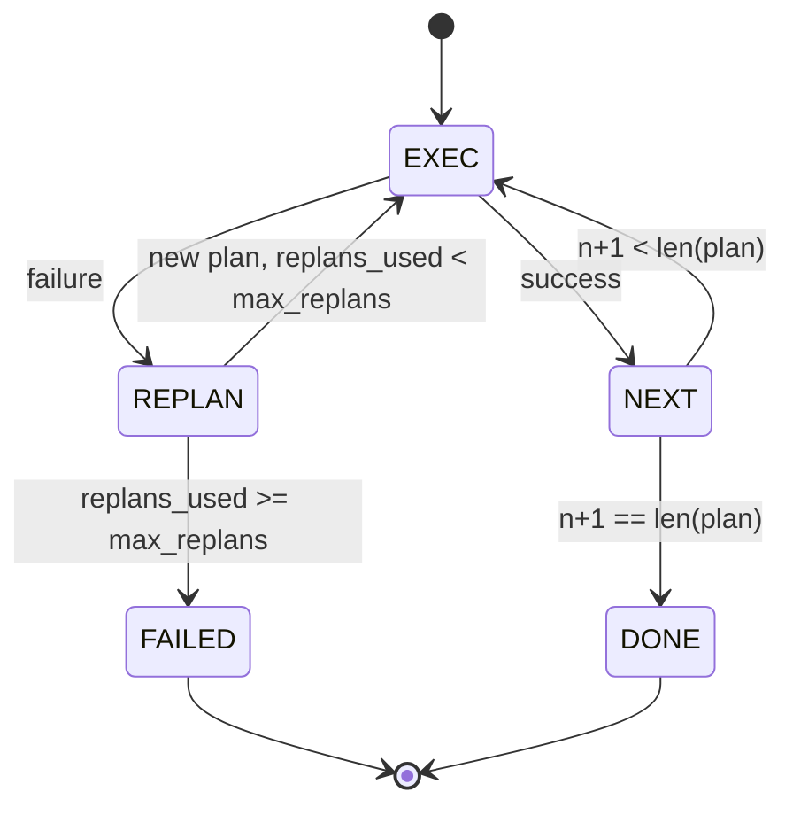

# Lập kế hoạch-thực hiện luồng điều khiển

> Một kế hoạch không thể tồn tại sau một thất bại là một script. Một script có thể lập kế hoạch lại là một agent. Xây dựng công cụ lập kế hoạch lại trước.

**Loại:** Xây dựng
**Ngôn ngữ:** Python
**Kiến thức tiên quyết:** Giai đoạn 13 bài 01-07, Giai đoạn 14 bài 01
**Thời lượng:** ~90 phút

## Mục tiêu học tập
- Biểu diễn một kế hoạch dưới dạng danh sách các bước được nhập theo thứ tự để người thực hiện có thể suy luận về tiến độ và kết quả.
- Thực hiện các bước tuần tự với việc chuyển giao lỗi có kiểm soát trở lại người lập kế hoạch.
- Lập kế hoạch lại từ con trỏ hiện tại với lỗi prior trong ngữ cảnh để kế hoạch tiếp theo được thông báo.
- Phát ra sự khác biệt về kế hoạch trên mỗi bản sửa đổi để trình theo dõi xuôi dòng hoặc giao diện người dùng có thể cho biết lý do kế hoạch thay đổi.
- Thực thi hai ngân sách: trần bước cứng và trần lập kế hoạch lại cứng.

## Lập kế hoạch và thực hiện, không phải chain-of-thought

Một chain-of-thought agent phát ra tokens và cho phép vòng lặp đoán nơi lệnh gọi công cụ kết thúc. Một agent lập kế hoạch và thực hiện đưa ra một kế hoạch có cấu trúc trước, sau đó thực hiện từng bước một cách xác định. Kế hoạch là dữ liệu mà harness có thể xem xét nội tâm. Việc thực thi là harness chạy dữ liệu đó thông qua trình điều phối.

Hai miếng. Một kế hoạch tạo ra một kế hoạch. Một người thực thi điều hành kế hoạch. Công việc thú vị là những gì xảy ra khi người thực thi gặp thất bại. Ba lựa chọn:

```text
1. Abort         (return failed, surface the error)
2. Skip          (mark step failed, continue with the rest)
3. Replan        (hand the error to the planner, get a new plan from the cursor)
```

Replan là cách biến script thành agent.

## Hình dạng bước

```text
Step
  id              : int           (monotonic within a plan revision)
  tool_name       : str
  args            : dict
  expected_outcome: str           (planner's stated success condition)
  result          : Any | None
  error           : str | None
```

`expected_outcome` là một câu ngắn mà người lập kế hoạch phát ra cùng với bước. Nó không được thực thi bởi người thi hành. Đó là vì hai điều: người lập kế hoạch lại đọc nó khi sửa đổi kế hoạch; luồng sự kiện phát ra nó để một người theo dõi có thể hiển thị "bước này được cho là làm X".

## Hình dạng lập kế hoạch

```python
def planner(goal: str, history: list[Step], last_error: str | None) -> list[Step]:
    ...
```

Một chức năng thuần túy. `goal` là mục tiêu của người dùng. `history` là các bước đã được thực hiện (với kết quả và lỗi được điền vào). `last_error` là Không có trong cuộc gọi đầu tiên và thông báo lỗi gần đây nhất trên mỗi cuộc gọi tiếp theo. Người lập kế hoạch trả về kế hoạch tiếp theo bắt đầu từ con trỏ.

Người lập kế hoạch không biết về người thực hiện. Nó không biết về việc thử lại. Nó không biết về timeouts. Nó tạo ra một kế hoạch. Đó là tất cả.

## Người thi hành

Trình thực thi là một máy trạng thái nhỏ. Mỗi bước chạy qua trình điều phối. Kết quả là một trong ba điều: thành công, có thể lập kế hoạch lại thất bại, thất bại-chết người. Các lỗi có thể lập kế hoạch lại sẽ được trao lại cho người lập kế hoạch. Thất bại chết người (vượt quá ngân sách, trần) trả lại kết quả `FAILED` session.



## Lập kế hoạch chênh lệch khi sửa đổi

Khi người lập kế hoạch trả về một kế hoạch mới sau khi thất bại, người thực thi sẽ phát ra một sự kiện `plan.diff` với ba trường.

```text
removed: list of step ids that were in the old plan and are not in the new
added  : list of step ids in the new plan that were not in the old
revised: list of step ids whose tool_name or args changed
```

Trình theo dõi hoặc giao diện người dùng có thể hiển thị điều này dưới dạng gạch ngang trên các bước đã xóa và đánh dấu trên các bước đã thêm. Vấn đề không phải là định dạng khác biệt. Vấn đề là sửa đổi là một sự kiện có thể nhìn thấy được, không phải là một bản viết lại im lặng.

## Hai ngân sách, cả hai đều khó khăn

`max_steps` giới hạn tổng số lần thực hiện bước trên toàn bộ session, bao gồm cả việc lập kế hoạch lại. Mặc định là mười hai. Một kế hoạch năm bước tuyến tính lập kế hoạch lại hai lần và thêm ba bước mỗi lần đạt mười sáu lần thực hiện và sẽ vượt quá ngân sách. Người thực thi sẽ từ chối lập kế hoạch lại và trả về FAILED.

`max_replans` giới hạn số lần người lập kế hoạch được gọi sau kế hoạch đầu tiên. Mặc định là năm. Đây là giới hạn quan trọng hơn. Một người lập kế hoạch trả về cùng một kế hoạch bị hỏng năm lần liên tiếp sẽ lặp lại cho đến khi ngân sách bước bắt được nó. Quy hoạch lại giới hạn làm cho lỗi nhanh hơn và lý do rõ ràng hơn.

## Công cụ lập kế hoạch xác định trong bài học này

Chúng ta không gọi một model trong bài học này. Bài học ships một người lập kế hoạch quyết định chọn một kế hoạch dựa trên `last_error`.

```text
last_error is None    -> emit a four-step plan
last_error matches X  -> emit a three-step plan that routes around X
last_error matches Y  -> emit a two-step plan that gives up gracefully
otherwise             -> return [] (signals nothing to replan)
```

Điều này đủ để kiểm tra hành vi của người thực thi trên mọi lộ trình chuyển đổi: thành công, lập kế hoạch lại một lần, lập kế hoạch lại hai lần, cạn kiệt kế hoạch lại và cạn kiệt ngân sách từng bước.

## Hình dạng kết quả

```text
SessionResult
  status      : "completed" | "failed"
  reason      : str     ("goal_met" | "step_budget" | "replan_budget" | "no_plan")
  history     : list[Step]
  revisions   : list[PlanDiff]
  events      : list[Event]
```

Vòng lặp harness từ bài hai mươi có thể đọc trực tiếp điều này. Người điều phối từ bài hai mươi ba là người thực hiện từng bước. Phần registry từ bài hai mươi mốt xác nhận các đối số của mỗi bước. transport từ bài hai mươi hai sẽ hiển thị toàn bộ luồng này qua JSON-RPC cho một máy khách model.

## Cách đọc mã

`code/main.py` định nghĩa `PlanExecuteAgent`, `Step`, `PlanDiff`, `SessionResult` và công cụ lập kế hoạch xác định. Trình thực thi là một phương thức `run(goal)` duy nhất trả về một `SessionResult`. Chênh lệch kế hoạch được tính bằng cách so sánh id bước và bộ `(tool_name, args)`.

`code/tests/test_agent.py` bao gồm thành công tuyến tính, thất bại giữa kế hoạch lập kế hoạch lại một lần, cạn kiệt kế hoạch lại mang lại `failed:replan_budget`, cạn kiệt ngân sách từng bước và định dạng sự kiện khác nhau về kế hoạch.

## Tiến xa hơn

Hai tiện ích mở rộng bạn sẽ muốn khi bạn nối dây này với một model thực sự. Đầu tiên, bộ nhớ đệm một phần kế hoạch: khi một kế hoạch thành công trong ba trong số sáu bước đầu tiên và sau đó thất bại, bạn không muốn chạy lại ba bước đầu tiên. Người thi hành đã lưu giữ lịch sử; Người lập kế hoạch chỉ cần đọc nó. Thứ hai, branches song song: người thực thi hiện tại hoàn toàn tuần tự. Một công cụ lập kế hoạch phát ra một branch độc lập (`gather_step` thay vì `next_step`) có thể chạy đồng thời hai lệnh gọi công cụ thông qua trình điều phối.

Cả hai đều làm tăng thêm sự phức tạp thực sự. Cả hai đều dễ dàng thêm hơn sau khi trình thực thi tuyến tính được ghim. Đó là những gì bài học này làm.
