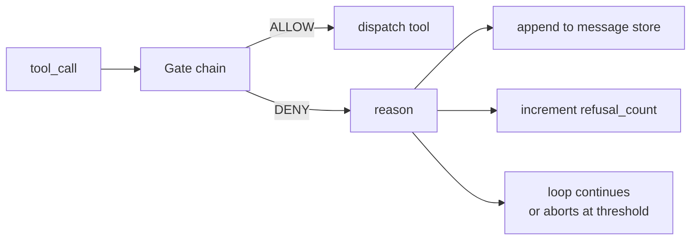
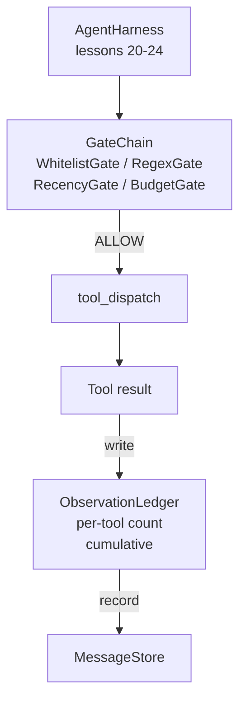

# Bài học Capstone 25: Cổng xác minh và ngân sách quan sát

> Một agent harness không có lớp xác minh là một điều ước trong một chiếc áo khoác trenchcoat. Bài học này xây dựng chuỗi cổng xác định quyết định liệu một lệnh gọi công cụ có được phép kích hoạt hay không, agent được phép xem bao nhiêu đầu ra của nó và khi nào vòng lặp phải dừng lại vì agent đã đọc quá nhiều. Chuỗi là một chức năng của các cổng nhỏ, được đặt tên cộng với một sổ cái quan sát theo dõi mọi token model đã được hiển thị.

**Loại:** Xây dựng
**Ngôn ngữ:** Python (stdlib)
**Kiến thức tiên quyết:** Giai đoạn 19 · 20-24 (Bản nhạc A1: vòng lặp agent, registry công cụ, kho tin nhắn, trình tạo prompt, bộ định tuyến model), Giai đoạn 14 · 33 (hướng dẫn dưới dạng ràng buộc), Giai đoạn 14 · 36 (hợp đồng phạm vi), Giai đoạn 14 · 38 (cổng xác minh)
**Thời lượng:** ~90 phút

## Mục tiêu học tập

- Xây dựng giao thức `VerificationGate` với phương pháp `evaluate(call)` xác định.
- Soạn các cổng ngân sách, gần đây, danh sách trắng và biểu thức chính quy thành một chuỗi với ngữ nghĩa ngắn mạch.
- Theo dõi mọi quan sát thông qua một `ObservationLedger` được khóa bằng công cụ và lượt.
- Từ chối lệnh gọi công cụ khi vượt quá ngân sách quan sát tích lũy.
- Hiển thị một bản ghi `GateDecision` có cấu trúc mà observability hạ lưu có thể nhập.

## Vấn đề

Khi một agent harness cho phép model gọi các công cụ một cách tự do, ba classes lỗi sẽ xuất hiện trong vòng một giờ đầu tiên sử dụng thực tế.

Đầu tiên là quan sát không giới hạn. Một grep trên đường dây 200K repo đổ nửa triệu tokens sản lượng vào lượt tiếp theo. model thấy một kết quả trùng khớp trên mỗi kilobyte và rest ngữ cảnh bị lãng phí. Hóa đơn token lớn và agent bây giờ tồi tệ hơn, không tốt hơn, trong nhiệm vụ.

Thứ hai là sự gần đây cũ kỹ. Một tác vụ chạy dài tích lũy năm mươi lệnh gọi công cụ. model đọc lại read_file đầu tiên từ khúc cua thứ ba như thể nó đang ở trạng thái trực tiếp. Các chỉnh sửa được thực hiện ở lượt bốn mươi bảy không bao giờ xuất hiện vì người xây dựng prompt đã tuần tự hóa các quan sát sớm nhất trước.

Thứ ba là đặc quyền leo thang. Một nhiệm vụ nghiên cứu bắt đầu bằng cách gọi `web_search`, sau đó bằng cách nào đó kết thúc `shell` vì model đã phát minh ra tên công cụ và harness mặc định là cho phép. Vào thời điểm bất kỳ ai đọc trace, một tệp rác đang nằm trong /tmp và một lọn tóc chạy vào một API riêng tư.

Cổng xác minh là thành phần harness cho biết không. Nó không phải là một model. Nó không phải là một thẩm phán. Nó là một hàm xác định của `(call, history, ledger)` trả về ALLOW hoặc DENY với một lý do. Lý do được ghi lại. model được kể. Vòng lặp tiếp tục hoặc hủy bỏ.

## Khái niệm



Cổng là bất cứ thứ gì có phương pháp `evaluate(call, ctx) -> GateDecision`. Chuỗi là một danh sách có thứ tự. Đánh giá đoản mạch trong lần từ chối đầu tiên. Vấn đề trật tự: các cổng kết cấu rẻ tiền chạy trước các cổng đếm token đắt tiền.

Bài học này ships bốn cánh cổng:

- `WhitelistGate`. Tên công cụ được phép là một tập hợp rõ ràng. Bất cứ điều gì bên ngoài đều bị từ chối. Đây là cổng rẻ nhất và chạy trước.
- `RegexGate`. Đối số công cụ được khớp với một biểu thức chính quy. Hữu ích để từ chối các cuộc gọi shell có `rm -rf` trong đó hoặc các cuộc gọi HTTP đến IP nội bộ. Thuần khiết trong cuộc gọi payload.
- `RecencyGate`. model chỉ nhìn thấy các quan sát từ N lượt cuối cùng. Các quan sát cũ hơn bị che đậy. Cổng từ chối một cuộc gọi công cụ mà kết quả sẽ kéo dài một cửa sổ quan sát đã cũ kỹ.
- `BudgetGate`. Số tokens tích lũy mà model đã đọc trên toàn session có mức trần. Khi sổ cái cho biết đã đạt đến mức trần, mọi lệnh gọi công cụ tiếp theo đều bị từ chối.

Sổ cái quan sát là sổ sách. Mỗi lệnh gọi công cụ thành công sẽ viết một hàng: tên công cụ, lượt, tokens phát ra, tích lũy. Sổ cái trả lời hai câu hỏi: tổng số model đã nhìn thấy bao nhiêu và nó đã nhìn thấy bao nhiêu về công cụ X. Cổng ngân sách đọc đầu tiên. Một cổng ngân sách cho mỗi công cụ, mà bạn sẽ viết như một bài tập, đọc cổng thứ hai.

## Kiến trúc



Người harness hỏi dây chuyền. Chuỗi hoặc gật đầu hoặc từ chối. Nếu nó gật đầu, công cụ sẽ chạy, sổ cái tích tắc và kết quả được thêm vào kho tin nhắn. Nếu từ chối, model sẽ được đưa ra từ chối dưới dạng thông báo hệ thống và vòng lặp quyết định thử lại hay hủy bỏ.

## Những gì bạn sẽ xây dựng

Việc triển khai là một `main.py` duy nhất cộng với các bài kiểm tra.

1. Các lớp dữ liệu `Observation` và `ToolCall` xác định hình dạng dây.
2. `ObservationLedger` ghi lại `(turn, tool, tokens)` hàng và trả lời `cumulative()` và `per_tool(name)`.
3. `GateDecision` mang `(allow, reason, gate_name)`.
4. `VerificationGate` là giao thức. Mỗi cổng thực hiện `evaluate(call, ctx)`.
5. `GateChain` bao bọc một danh sách theo thứ tự. Nó gọi mỗi cổng, trả về từ chối đầu tiên hoặc trả về cho phép nếu mọi cổng đi qua.
6. Bản demo chạy một vòng lặp agent tổng hợp nhỏ. Ba lượt. Lượt thứ ba vấp ngã cổng ngân sách và vòng lặp báo cáo một từ chối sạch sẽ với số lượng từ chối không phải bằng không.

Bộ đếm token cố tình là một phương pháp phỏng đoán `len(text) // 4` ngu ngốc. Điểm mấu chốt của bài học này là hệ thống ống nước cổng, không phải tokenizer. Thả vào một tokenizer thực sự trong production.

## Tại sao lệnh chuỗi lại quan trọng

Một từ chối rẻ hơn một giấy phép. `WhitelistGate` chạy trong tra cứu băm O (1). `RegexGate` chạy trong O(mẫu * argv). `RecencyGate` đọc một phần nhỏ của kho tin nhắn. `BudgetGate` đọc toàn bộ sổ cái. Bạn đặt hàng chúng theo chi phí tăng dần để cuộc gọi bị từ chối bị đoản mạch trước khi thực hiện công việc tốn kém.

Bạn cũng sắp xếp chúng theo bán kính vụ nổ. Danh sách trắng là tuyên bố mạnh nhất: công cụ này không có trong hợp đồng. Cổng regex là tiếp theo: đối số này không có trong hợp đồng. Gần đây đến sau: harness vẫn quan tâm nhưng cuộc gọi là hợp pháp về mặt cấu trúc. Ngân sách là cuối cùng bởi vì, theo định nghĩa, nó chỉ kích hoạt khi mọi thứ khác trôi qua.

## Điều này sáng tác như thế nào với rest của Bài hát A

Các bài học trước đã cung cấp cho bạn vòng lặp, registry công cụ, kho tin nhắn, trình tạo prompt và bộ định tuyến model. Bài học này thêm lớp giữa model và các công cụ. Bài 26 ships sandbox mà người điều phối giao lệnh gọi công cụ khi chuỗi cổng cho biết ALLOW. Bài 27 ships harness đánh giá ghi nhận việc từ chối được tính là tín hiệu chất lượng. Bài 28 đưa các quyết định cổng vào spans OpenTelemetry. Bài 29 khâu rất nhiều thành một agent lập trình đang hoạt động.

## Chạy nó

```bash
cd phases/19-capstone-projects/25-verification-gates-observation-budget
python3 code/main.py
python3 -m pytest code/tests/ -v
```

Bản demo in một trace từng lượt bao gồm mọi quyết định cổng và thoát khỏi số không. Các bài kiểm tra bao gồm sổ cái, mỗi cổng cách ly, ngắn mạch chuỗi và vòng lặp tổng hợp từ đầu đến cuối.
