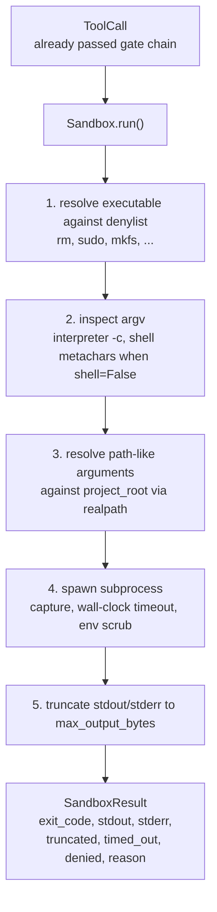
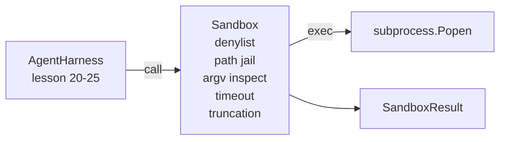

# Bài học Capstone 26: Sandbox Runner với Denylist và Path Jail

> Cổng xác minh quyết định xem có nên chạy lệnh gọi công cụ hay không. sandbox quyết định điều gì sẽ xảy ra khi nó xảy ra. Bài học này ships một trình chạy quá trình con từ chối các tệp thực thi nguy hiểm, từ chối các hình dạng argv nguy hiểm, bỏ tù mọi đường dẫn tệp đến gốc dự án, cắt bớt đầu ra quá khổ và giết các processes chạy trốn trên timeout đồng hồ treo tường. Nó là lớp thứ hai trong số hai lớp nằm giữa model và hệ điều hành.

**Loại:** Xây dựng
**Ngôn ngữ:** Python (stdlib)
**Kiến thức tiên quyết:** Giai đoạn 19 · 25 (cổng xác minh và ngân sách quan sát), Giai đoạn 14 · 33 (hướng dẫn dưới dạng ràng buộc), Giai đoạn 14 · 38 (cổng xác minh)
**Thời lượng:** ~90 phút

## Mục tiêu học tập

- Xây dựng `subprocess.run` bao bọc `Sandbox` class với timeout, chụp và cắt bớt.
- Từ chối lệnh theo tên đối với danh sách từ chối và theo cấu trúc đối với trình kiểm tra argv.
- Từ chối bất kỳ đối số đường dẫn nào phân giải bên ngoài gốc dự án đã khai báo.
- Từ chối siêu ký tự shell khi chế độ shell tắt.
- Trả về một `SandboxResult` có cấu trúc mà observability xuôi dòng và harness đánh giá có thể nhập.

## Vấn đề

Một agent mã hóa có thể cài đặt cửa hậu, lấy chìa khóa, gạch máy tính xách tay của nhà phát triển và kiếm được hóa đơn cloud chỉ trong một lượt. Phòng thủ ít tốn kém nhất là không cung cấp cho nó. Ít tốn kém thứ hai là một sandbox nói không với một danh sách chính xác các mẫu.

Ba classes thất bại lặp lại trong agent traces.

Đầu tiên là các tệp thực thi nguy hiểm. Một model chịu áp lực phải khắc phục sự cố đường dẫn sẽ thử `sudo`, `chmod -R 777`, `rm -rf`, `mkfs` `dd`. Không có cái nào trong số này thuộc về một cuộc chạy agent. Người từ chối bắt họ bằng tên và bí danh.

Thứ hai là thủ thuật argv. Một model đã được thông báo không có đạn pháo sẽ phát sóng một cuộc tấn công thông qua một thông dịch viên: `python3 -c "import os; os.system('rm -rf /')"`, `bash -c '...'`, `node -e '...'`, `perl -e '...'`. Người sandbox cần biết rằng bất kỳ trình thông dịch nào chạy với cờ giống như `-c` chỉ là một lệnh gọi shell với các bước bổ sung.

Thứ ba là lối thoát. Người model được yêu cầu đọc `./src/main.py` và thay vào đó đọc `../../etc/passwd`. sandbox bỏ tù mọi lập luận đường dẫn bằng cách giải quyết nó thông qua `os.path.realpath` và khẳng định tiền tố.

sandbox không phải là ranh giới bảo mật theo nghĩa hệ điều hành. Một kẻ tấn công quyết tâm với việc thực thi mã vẫn có thể bùng phát. sandbox là một guardrail thời gian phát triển: nó làm cho các chế độ lỗi phổ biến trở nên ồn ào và ngăn agent gây ra thiệt hại do sự kém cỏi tuyệt đối.

## Khái niệm



sandbox có bốn trục từ chối: tên, argv, đường dẫn, cấu trúc. Mỗi trục là một hàm thuần túy của cuộc gọi, chưa có quá trình con. Quá trình con chỉ xuất hiện sau khi mỗi trục đã đi qua.

Mã thoát `SandboxResult` là mã thông thường: 0 thành công, không phải không, cộng với ba mã canh gác cho bị từ chối (-100), timed_out (-101) và bị cắt bớt (mã thoát là mã thực, với một bộ cờ). Các bài học xuôi dòng đọc kết quả có cấu trúc này thay vì phân tích cú pháp stderr.

## Kiến trúc



Denylist là một tập hợp các tên cơ sở thực thi bị đóng băng. Bí danh (`/bin/rm`, `/usr/bin/rm`) đều phân giải thành cùng một tên cơ sở. Trình kiểm tra argv biết hình dạng trình thông dịch: bất kỳ argv nào trong đó argv[0] là trình thông dịch và bất kỳ arg nào sau đó bắt đầu bằng `-c` hoặc `-e` đều bị từ chối. Siêu ký tự shell (`;`, `|`, `&`, `>`, `<`, backticks, `$()`) gây ra từ chối khi lệnh gọi không yêu cầu shell một cách rõ ràng.

Nhà tù con đường là mảnh ghép tinh tế nhất. sandbox chấp nhận `project_root` xây dựng. Bất kỳ đối số nào trông giống như một đường dẫn (chứa `/` hoặc khớp với một tệp hiện có) đều được chuẩn hóa thông qua `os.path.realpath`, sau đó được kiểm tra dựa trên đường dẫn thực của gốc dự án. Nếu mục tiêu đã giải quyết không nằm dưới gốc, hãy từ chối. Các nỗ lực thoát liên kết tượng trưng (một liên kết tượng trưng trong gốc dự án trỏ ra bên ngoài) bị chặn bằng cách kiểm tra đường dẫn thực, không phải đường dẫn theo nghĩa đen.

## Những gì bạn sẽ xây dựng

Việc triển khai là `main.py` cộng với một giám đốc kiểm tra.

1. `SandboxResult` lớp dữ liệu: exit_code, stdout, stderr, truncated, timed_out, denied, reason, duration_ms.
2. `SandboxConfig` lớp dữ liệu: project_root, max_output_bytes, timeout_seconds, denylist interpreter_block.
3. `Sandbox` class: `run(argv, *, shell=False, cwd=None)` trả về `SandboxResult`.
4. Người trợ giúp từ chối nội bộ: `_check_executable_denylist`, `_check_argv_interpreter`, `_check_shell_metachars`, `_check_path_jail`.
5. Cắt bớt đầu ra với cờ `truncated` rõ ràng và đường đánh dấu trong luồng đã chụp.
6. Demo ở dưới cùng: một chuỗi các cuộc gọi hợp pháp và đối nghịch. Mỗi cái được hiển thị với kết quả của nó.

sandbox sử dụng `subprocess.run` với `shell=False` theo mặc định và `capture_output=True`. Đồng hồ treo tường timeout sử dụng đối số `timeout`; trên `TimeoutExpired`, sandbox giết nhóm process và tổng hợp SandboxResult.

## Tại sao đây không phải là một sandbox thực sự

Bài học sandbox không sử dụng không gian tên, cgroup, seccomp, gVisor, Firecracker hoặc bất kỳ cách ly cấp hạt nhân nào. Bất cứ điều gì quy trình con có thể làm, sandbox có thể làm. Sự bảo vệ mang tính cấu trúc: agent bị từ chối những lời kêu gọi nguy hiểm phổ biến nhất, và sự từ chối lớn tiếng đi vào observability thay vì im lặng chạy.

Đối với production agents bạn xếp lớp lên trên: chạy bên trong một Docker container không có đặc quyền, chạy bên trong microVM, loại bỏ khả năng, gắn kết root dự án chỉ đọc và đọc ghi scratch, đặt ulimit trên bộ nhớ và CPU, xóa môi trường vào danh sách trắng an toàn đã biết. Bài 29 làm một số điều này. Cách ly hệ thống vận hành nằm ngoài phạm vi của bài học này.

## Chạy nó

```bash
cd phases/19-capstone-projects/26-sandbox-runner-denylist
python3 code/main.py
python3 -m pytest code/tests/ -v
```

Bản demo tạo một thư mục tạm thời, thả một tệp sạch vào đó, sau đó chạy một loạt các cuộc gọi. Các cuộc gọi pháp lý thành công. Cuộc gọi bị từ chối trả về SandboxResult với `denied=True` và lý do. Timeouts trả lại `timed_out=True`. Bộ cắt bớt `truncated=True`. Bản demo in một bảng kết quả JSON và thoát khỏi số không.

## Điều này sáng tác như thế nào với rest của Bài hát A

Bài 25 tạo ra chuỗi cổng. Bài 26 là trình thực thi chạy sau một cổng ALLOW. Đánh giá harness của bài 27 so sánh kết quả sandbox với mã thoát dự kiến cho mỗi nhiệm vụ. Bài 28 phát ra một `gen_ai.tool.execution` span xung quanh mỗi lời cầu `Sandbox.run`. Bản demo end-to-end của bài học 29 kết nối một agent mã hóa thực sự thông qua cả hai lớp.
