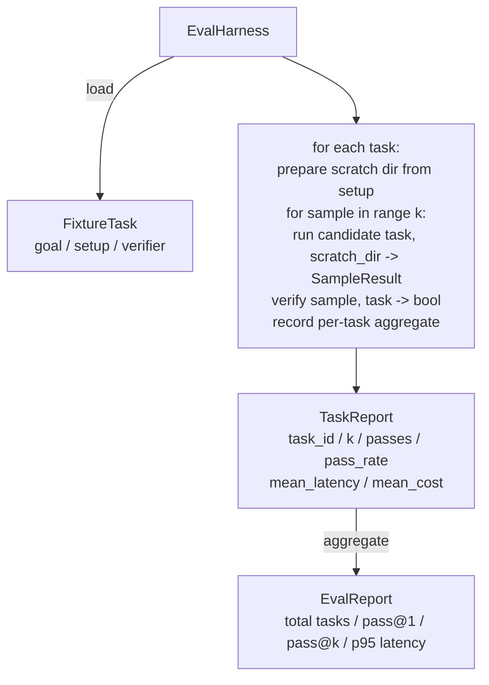

# Bài học Capstone 27: Đánh giá Harness với các nhiệm vụ cố định

> Một agent mã hóa chỉ tốt bằng bộ tác vụ mà bạn đo lường nó. Bài học này xây dựng một harness đánh giá lấy một thư mục các nhiệm vụ cố định, chạy từng nhiệm vụ thông qua một agent ứng viên, điểm số đạt hoặc không đạt thông qua trình xác minh xác định và tổng hợp kết quả thành pass@1, pass@k, độ trễ trung bình và chi phí trung bình. harness là nguồn của sự thật cho phép bạn phân biệt hồi quy từ một refactor.

**Loại:** Xây dựng
**Ngôn ngữ:** Python (stdlib)
**Kiến thức tiên quyết:** Giai đoạn 19 · 25 (cổng xác minh), Giai đoạn 19 · 26 (sandbox runner), Giai đoạn 14 · 30 (phát triển agent định hướng đánh giá), Giai đoạn 14 · 19 (SWE-bench và GAIA benchmarks)
**Thời lượng:** ~90 phút

## Mục tiêu học tập

- Xác định một nhiệm vụ cố định là bộ ba mục tiêu, thiết lập và trình xác minh.
- Ghi điểm nhiều lần chạy mẫu cho mỗi tác vụ và tính toán pass@1 và pass@k.
- Tổng hợp độ trễ và chi phí thành chỉ số trung bình và phân vị thứ 95.
- Nối các trình xác minh xác định (file diff, mã thoát, khớp biểu thức chính quy) thành các hàm có thể tái sử dụng.
- Phát báo cáo JSON có cấu trúc mà script theo dõi hồi quy có thể nhập.

## Vấn đề

Ba chế độ lỗi gây khó khăn agent benchmarks xây dựng mà không có harness đánh giá.

Đầu tiên là vượt qua chưa được xác minh. agent cho biết họ đã sửa lỗi, con người liếc nhìn vào diff, bộ được đánh dấu màu xanh lá cây và ba tuần sau bài kiểm tra hồi quy xuất hiện lỗi tương tự. Người agent đã lập luận hợp lý mà không thực sự sửa chữa bất cứ điều gì.

Thứ hai là hồi quy không được phát hiện. Một thay đổi đối với mẫu prompt làm cho việc agent tốt hơn 4% đối với tác vụ ồn ào và kém hơn 14% đối với tác vụ yên tĩnh. Nếu không có bộ vàng và điểm số cho mỗi nhiệm vụ, hồi quy sẽ chuyển sang chính và chỉ xuất hiện khi khách hàng phàn nàn.

Thứ ba là trôi dạt cho mỗi nhiệm vụ. Cuộc đánh giá được thực hiện vào thứ Hai với 100 nhiệm vụ và vào thứ Sáu với 95 nhiệm vụ trong số đó, bởi vì ai đó đã đổi tên năm lịch thi đấu. Tỷ lệ đậu có vẻ như được cải thiện 5%. Không phải vậy.

harness là chương trình biến những thất bại này thành sự thật. Nó chạy mọi vật cố định, mọi lúc, theo thứ tự có thể tái tạo, chống lại trình xác minh trả về đúng hoặc sai trên kiểm tra xác định.

## Khái niệm

```mermaid
flowchart LR
  F1[fixtures/task_001/<br/>task.json + expected/] --> Harness
  F2[fixtures/task_002/<br/>...] --> Harness
  Harness[Harness<br/>for each task:<br/>setup / run agent k samples /<br/>verify each sample /<br/>record latency, cost]
  Harness --> Report[EvalReport<br/>pass@1 / pass@k<br/>mean ms / p95 ms<br/>mean cost]
```

`FixtureTask` là một tệp JSON nhỏ cộng với một thư mục `expected/` tùy chọn. JSON khai báo một `id`, một `goal` (prompt được đưa vào agent), một khối `setup` (các tệp để thả vào dir cào) và một khối `verifier`. Khối trình xác minh đặt tên cho một hàm trong registry trình xác minh của harness và cung cấp các đối số của nó.

Ba hình dạng xác minh bao gồm phần lớn các tác vụ hữu ích.

Đầu tiên là `file_equals`. Sau khi agent chạy, hãy so sánh tệp được đặt tên với nội dung dự kiến. Thao tác này sẽ bắt được các tác vụ "sửa lỗi này theo cách chính xác này".

Thứ hai là `regex_match`. Nội dung của tệp được đặt tên được khớp với một biểu thức chính quy. Điều này bắt các tác vụ "hàm phải tồn tại và trả về X" trong đó có nhiều giải pháp được chấp nhận.

Thứ ba là `shell_exit_zero`. harness chạy lệnh shell (thông qua sandbox từ bài 26) và chỉ chuyển nhiệm vụ nếu lệnh thoát khỏi số không. Điều này nắm bắt các nhiệm vụ "các bài kiểm tra phải đạt".

harness chạy từng tác vụ `k` lần. Pass@k là `1 - (1 - p)^k` trong đó p là tỷ lệ vượt qua thực nghiệm; harness cũng báo cáo số lượng thô để bạn có thể phát hiện ra variance. Độ trễ là đồng hồ treo tường trên mỗi mẫu. Chi phí là bất kể agent tự báo cáo (token tính, USD hoặc cả hai); harness tổng hợp nó trên các mẫu và trình bày các số cho mỗi nhiệm vụ và tổng hợp.

```figure
pass-at-k
```

## Kiến trúc



Ứng cử viên là một người có thể gọi: `Callable[[FixtureTask, str], SampleResult]`. harness tạo thư mục scratch thông qua `tempfile.mkdtemp()` và chuyển đường dẫn của nó dưới dạng chuỗi thuần túy. Người harness không quan tâm ứng viên làm việc như thế nào. Ứng cử viên có thể là một ứng dụng bản vá xác định (hữu ích cho các bài tự kiểm tra harness), một LLM agent thực sự, một fuzzer. Hợp đồng là SampleResult.

## Những gì bạn sẽ xây dựng

`main.py` ships:

1. `FixtureTask` lớp dữ liệu.
2. `SampleResult` lớp dữ liệu: success_self_reported, latency_ms, cost_units, chỉnh sửa.
3. `TaskReport`, `EvalReport` các lớp dữ liệu với `to_dict()`.
4. `VerifierRegistry` ánh xạ tên trình xác minh vào chức năng. Trình xác minh tích hợp: file_equals, regex_match, shell_exit_zero.
5. `EvalHarness` class. Chạy một thư mục nhiệm vụ đối với một ứng viên. Trả về EvalReport.
6. Năm nhiệm vụ cố định được đóng gói trong `tasks/`:
   - tắt từng người trong `fizzbuzz`
   - Thiếu lợi nhuận trong `factorial`
   - Lỗi chính tả trong thông báo lỗi
   - phần thân chức năng trống
   - off-by-one trong duyệt danh sách liên kết
7. Một ứng cử viên tham chiếu xác định (`apply_known_fixes`) mà harness sử dụng để chứng minh pass@1 rõ ràng là 1.0.
8. Bản demo in JSON EvalReport và thoát khỏi số không.

Các tác vụ cố định được đóng gói dưới dạng JSON tệp trong `tasks/` cộng với các tệp nguồn được ghép nối trong `tasks/<id>/buggy/` và `tasks/<id>/expected/`. Người harness sao chép buggy vào một cào dir, đưa nó cho ứng viên và xác minh so với mong đợi.

## Tại sao pass@k chứ không chỉ pass@1

LLM agents thực là ngẫu nhiên. pass@1 0,6 trông giống như một thất bại. pass@5 0,95 cho biết agent nhận được câu trả lời đúng hầu hết thời gian nhưng lại chọn sai trên các mẫu ban đầu. Cách khắc phục là sampling và xếp hạng, không phải lúc nào cũng training hơn. Pass@k làm cho điều đó có thể nhìn thấy được.

Pass@k được báo cáo cùng với pass@1 vì pass@k báo về một thất bại thực sự: nếu model nhận được câu trả lời đúng một lần trong hai mươi lần thử, bạn không có agent hữu ích. Bản harness cho thấy cả hai.

## Điều này sáng tác như thế nào với rest của Bài hát A

Bài 25 tạo ra chuỗi cổng. Bài 26 đã tạo ra sandbox. harness sử dụng sandbox cho bất kỳ trình xác minh `shell_exit_zero` nào. Bài 28 gói gọn mỗi harness chạy trong một trace OTel. Bài 29 chạy bản demo từ đầu đến cuối đối với một trong các lịch thi đấu đi kèm và xác nhận pass@1 = 1.0 cho ứng cử viên tham chiếu.

## Chạy nó

```bash
cd phases/19-capstone-projects/27-eval-harness-fixture-tasks
python3 code/main.py
python3 -m pytest code/tests/ -v
```

Bản demo in EvalReport bằng JSON, bao gồm thông pass@1, pass@5, độ trễ trung bình và phân tích mỗi tác vụ. Mã thoát bằng không. Các bài kiểm tra bao gồm các chức năng xác minh, toán học pass@k, tải vật cố định và harness từ đầu đến cuối so với ứng cử viên tham chiếu đi kèm.
