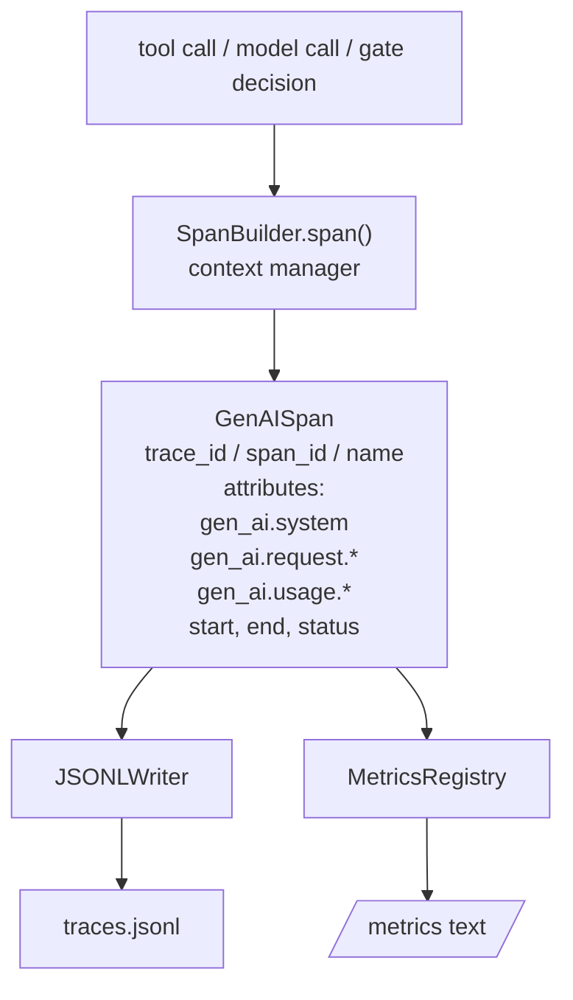
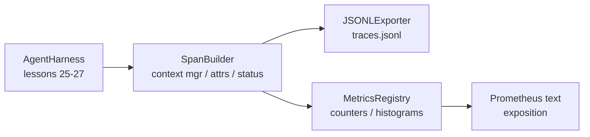

# Bài học Capstone 28: Observability với các chỉ số Spans và Prometheus của OTel GenAI

> Một agent harness không có observability là một hộp đen tốn tiền. Bài học này cuộn thủ công một trình tạo span phát ra các bản ghi tuân thủ các quy ước ngữ nghĩa OpenTelemetry GenAI, ghi chúng vào tệp JSON-Lines một span mỗi dòng và hiển thị các bộ đếm và biểu đồ ở định dạng văn bản Prometheus. Toàn bộ mọi thứ là stdlib Python và chạy ngoại tuyến.

**Loại:** Xây dựng
**Ngôn ngữ:** Python (stdlib)
**Kiến thức tiên quyết:** Giai đoạn 19 · 25 (cổng xác minh), Giai đoạn 19 · 26 (sandbox), Giai đoạn 19 · 27 (đánh giá harness), Giai đoạn 13 · 20 (OpenTelemetry GenAI), Giai đoạn 14 · 23 (Quy ước OTel GenAI)
**Thời lượng:** ~90 phút

## Mục tiêu học tập

- Xây dựng class dữ liệu span được định hình theo quy ước ngữ nghĩa OpenTelemetry GenAI.
- Triển khai trình xuất JSONL ghi một span khép kín trên mỗi dòng.
- Xây dựng bộ đếm và biểu đồ với nhãn và giải thích định dạng văn bản Prometheus.
- Bao bọc bất kỳ tính năng gọi nào trong trình quản lý ngữ cảnh span ghi lại thời lượng, trạng thái và ngoại lệ.
- Xác minh rằng spans phát ra khứ hồi qua `json.loads` và khớp với hình dạng thông số kỹ thuật.

## Vấn đề

Một agent mã hóa trong production tạo ra ba classes artifact mỗi lượt: một cuộc gọi model, thực thi công cụ và quyết định cổng xác minh. Không có điều nào trong số này hữu ích nếu không có telemetry có cấu trúc.

Chế độ lỗi đầu tiên là trace bị thiếu. Có điều gì đó không ổn vào thứ Ba nhưng kỷ lục duy nhất là nhật ký trò chuyện dài 500 dòng. Không có hồ sơ về công cụ nào chạy, mất bao lâu, bao nhiêu tokens đi vào prompt hoặc liệu cổng có từ chối bất cứ điều gì hay không. Tác giả agent phải đoán.

Chế độ lỗi thứ hai là trace không thể phân tích cú pháp. harness đã viết spans nhưng sử dụng tên trường đặc biệt của riêng mình. Không có gì ở Grafana, Honeycomb, Jaeger hoặc CLI địa phương có thể đọc chúng. Bất kỳ công cụ nào tồn tại trong stack của nhóm đều bị lãng phí vì spans không chuẩn.

Chế độ lỗi thứ ba là chỉ số không tổng hợp. Bạn có thể thấy một cuộc gọi công cụ chậm trong trace, nhưng bạn không thể trả lời "độ trễ p95 của các cuộc gọi read_file trong giờ qua là bao nhiêu?" vì không có số liệu, chỉ có traces.

Các quy ước ngữ nghĩa OpenTelemetry GenAI tồn tại chính xác cho điều này. Chúng xác định một tập hợp nhỏ các thuộc tính tiêu chuẩn mà span các bộ phát trên LLM frameworks chia sẻ. Nếu harness của bạn ghi các thuộc tính đó, mọi chương trình phụ trợ tương thích với OTel đều có thể đọc chúng.

## Khái niệm



Mỗi hoạt động trong harness tạo ra một span. Một span có id trace (toàn bộ lệnh gọi agent), id span (thao tác này), tên (ví dụ: `gen_ai.chat`, `gen_ai.tool.execution`), các thuộc tính tuân theo quy ước GenAI, thời gian bắt đầu và kết thúc cũng như trạng thái.

Các quy ước GenAI chuẩn hóa các khóa thuộc tính sau: `gen_ai.system` (nhà cung cấp nào, ví dụ: `anthropic`, `openai`), `gen_ai.request.model` (id model), `gen_ai.request.max_tokens`, `gen_ai.usage.input_tokens`, `gen_ai.usage.output_tokens`, `gen_ai.response.model`, `gen_ai.response.id`, `gen_ai.operation.name`, cùng với các khóa dành riêng cho công cụ `gen_ai.tool.name` và `gen_ai.tool.call.id`.

Nhà xuất khẩu viết JSONL. Một đối tượng JSON trên mỗi dòng. Đây là định dạng đơn giản nhất có thể mà công cụ xuôi dòng có thể phát trực tuyến, grep và import. Một nhà xuất khẩu OTel thực sự sẽ nói OTLP gRPC; Trình xuất khẩu JSONL của bài học là tương đương ngoại tuyến và thoát khỏi số không trên mọi máy trạm.

Các chỉ số nằm bên cạnh traces. Một bộ đếm tăng lên trên mỗi lệnh gọi công cụ: `tools_called_total{tool="read_file"}`. Biểu đồ ghi lại độ trễ quan sát được: `tool_latency_ms{tool="read_file"}`. Cả hai đều tuần tự hóa thành định dạng giải thích văn bản Prometheus, đây là tiêu chuẩn thực tế cho các chỉ số dựa trên kéo.

```figure
trace-spans
```

## Kiến trúc



Trình tạo span là một class nhỏ với phương thức `span(name, attrs)` trả về trình quản lý ngữ cảnh. Trình quản lý ngữ cảnh ghi lại thời gian bắt đầu khi nhập, ghi lại thời gian kết thúc khi thoát, đính kèm một ngoại lệ nếu một ngoại lệ được nâng lên và đẩy các span đã hoàn thiện cho nhà xuất.

Các chỉ số registry là hai dicts. Bộ đếm là `{(name, frozen_labels): int}`. Biểu đồ giữ các mẫu thô trong một danh sách và tuần tự hóa thành các nhóm biểu đồ Prometheus tại thời điểm triển lãm.

## Những gì bạn sẽ xây dựng

`main.py` ships:

1. `GenAISpan` lớp dữ liệu: trace_id, span_id, parent_span_id, tên, thuộc tính, start_unix_nano, end_unix_nano, trạng thái, status_message, sự kiện.
2. `SpanBuilder` class với trình quản lý ngữ cảnh `span(name, attrs, parent=None)`.
3. `JSONLExporter` class với `export(span)` nối thêm một dòng.
4. `Counter` và `Histogram` classes cộng với `MetricsRegistry`.
5. `prometheus_exposition(registry)` tạo ra đầu ra định dạng văn bản.
6. `wrap_tool_call(name)` trình trang trí phát ra span và cập nhật các chỉ số.
7. Demo: tổng hợp một lệnh gọi agent hoàn chỉnh (gen_ai.chat span xung quanh công cụ spans), viết traces. jsonl, in bản trình bày Prometheus, thoát khỏi số không.

Id span và id trace là các chuỗi hex 16 byte, được tạo từ `os.urandom`. Điều đó phù hợp với bối cảnh trace W3C của OTel. Nhà xuất khẩu không bao giờ ném; Lỗi IO xuất hiện nhưng harness vẫn tiếp tục chạy.

Biểu đồ có một bộ nhóm cố định (mặc định OTel cho độ trễ tính bằng mili giây: 5, 10, 25, 50, 100, 250, 500, 1000, 2500, 5000, 10000, + Inf). Các mẫu được lưu trữ dưới dạng một danh sách; Exposition tính toán số lượng trên mỗi nhóm theo yêu cầu.

## Tại sao phải cuộn tay thay vì opentelemetry sdk

OTel Python SDK là một phụ thuộc thực sự. Nó cũng có vài nghìn dòng mã, nhiều processes cho nhà xuất khẩu OTLP và chi phí runtime làm ngập ngân sách bài học. Phiên bản cuộn tay dạy định dạng dây. Trong production, bạn kết nối các thuộc tính tương tự vào SDK thực và nhận được trình xuất OTLP, hàng loạt và phát hiện tài nguyên miễn phí.

Các quy ước ổn định. Định dạng dây mà bài học phát ra sẽ tiếp tục phân tích cú pháp vào năm 2030 vì OTel không bao giờ phá vỡ tên thuộc tính GenAI; họ chỉ thêm những cái mới.

## Điều này sáng tác như thế nào với rest của Bài hát A

Bài 25 tạo ra chuỗi cổng. Bài 26 đã tạo ra sandbox. Bài 27 đã tạo ra harness đánh giá. Bài 28 làm cho cả ba đều có thể quan sát được. Bài 29 gói gọn mọi bước của bản demo từ đầu đến cuối bằng spans và in văn bản Prometheus ở cuối.

## Chạy nó

```bash
cd phases/19-capstone-projects/28-observability-otel-traces
python3 code/main.py
python3 -m pytest code/tests/ -v
```

Bản demo phát ra một `traces.jsonl` trong dir làm việc của bài học (được dọn dẹp ở cuối), sau đó in một mẫu gồm ba spans, sau đó in phần trình bày Prometheus cho các bộ đếm và biểu đồ. Các thử nghiệm xác minh rằng spans tuần tự hóa chuyến đi khứ hồi, rằng các thuộc tính GenAI chuẩn có mặt, bộ đếm gia tăng một cách chính xác và phần trình bày biểu đồ chứa số lượng nhóm dự kiến.
