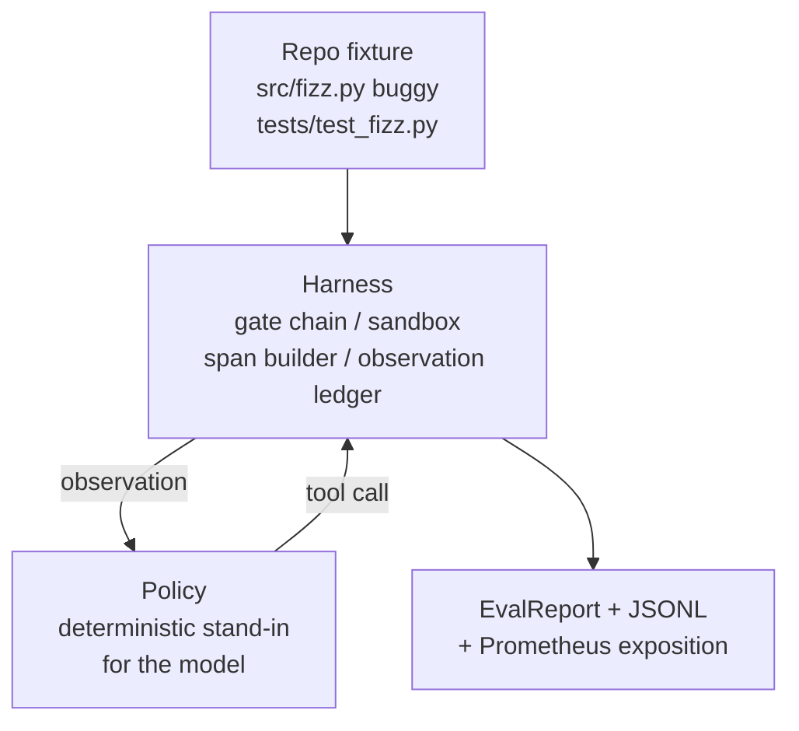
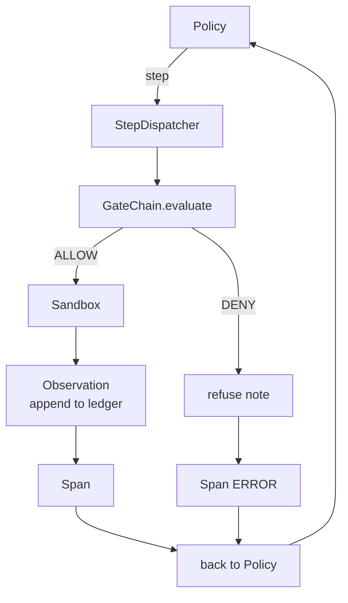

# Bài học Capstone 29: Mã hóa đầu cuối Agent trên Harness

> Phần thưởng của theo dõi A. Bài học này khâu chuỗi cổng, sandbox, harness đánh giá và spans OTel thành một agent mã hóa hoạt động để sửa lỗi thực sự (nhỏ, quy mô cố định) trong một dự án Python nhiều tệp. agent là một policy quyết định, không phải là một LLM; Sự thay thế làm cho bài học có thể tái tạo và cho thấy rằng harness là phần thú vị từ trước đến nay. Hợp đồng giống hệt nhau: một model thực sự cắm vào đường nối policy.

**Loại:** Xây dựng
**Ngôn ngữ:** Python (stdlib)
**Kiến thức tiên quyết:** Giai đoạn 19 · 25 (cổng xác minh), Giai đoạn 19 · 26 (sandbox), Giai đoạn 19 · 27 (đánh giá harness), Giai đoạn 19 · 28 (observability), Giai đoạn 14 · 38 (cổng xác minh), Giai đoạn 14 · 41 (bàn làm việc cho repos thật), Giai đoạn 14 · 42 (agent bàn làm việc)
**Thời lượng:** ~90 phút

## Mục tiêu học tập

- Soạn chuỗi cổng, sandbox, harness đánh giá và trình tạo span thành một vòng lặp agent duy nhất.
- Triển khai policy xác định sử dụng read_file, run_tests và write_file để sửa lỗi cố định.
- Thực thi ngân sách bước toàn cầu cộng với ngân sách quan sát token trong suốt quá trình chạy từ đầu đến cuối.
- Phát ra các chỉ số OTel GenAI traces và Prometheus hoàn chỉnh cho toàn bộ thời gian.
- Xác minh agent giải quyết thiết bị cố định trong ít hơn 12 bước mà không có chuyến đi cổng trên các công cụ pháp lý.

## Vấn đề

Hầu hết các bản demo agent hoạt động riêng biệt: một sandbox tự nó, một bản harness đánh giá, một bộ phát span của chính nó. Chúng trông ổn. Soạn chúng và các đường may hiển thị.

Chuỗi cổng nói CHO PHÉP nhưng sandbox từ chối vì một lý do mà chuỗi không lường trước được. Đánh giá harness ghi lại một đường chuyền nhưng OTel spans nói rằng cổng đã từ chối một công cụ mà agent tuyên bố rằng nó đã sử dụng. Bộ đếm Prometheus được tăng lên hai lần khi nó nên được tăng một lần. Ngân sách quan sát đã vượt quá nhưng agent vẫn tiếp tục vì ngân sách đã được theo dõi trong chuỗi và sandbox không biết.

Bài học này là bài kiểm tra tích hợp cho toàn bộ bài học. agent phải làm bốn việc theo thứ tự: đọc dự án, chạy kiểm tra, xác định lỗi từ lỗi kiểm tra thất bại, viết bản sửa lỗi, chạy lại kiểm tra và dừng lại. Mọi hoạt động đều đi qua chuỗi cổng. Mọi công cụ thực thi đều trải qua sandbox. Mỗi bước đi đều được gói gọn trong một span. Đánh giá harness chấm điểm toàn bộ mọi thứ ở cuối.

## Khái niệm



policy của agent là một cỗ máy nhà nước. Năm tiểu bang.

`SURVEY`: agent đọc danh sách dự án. Trạng thái tiếp theo là RUN_TESTS.

`RUN_TESTS`: agent chạy lệnh kiểm tra. Nếu các bài kiểm tra vượt qua, máy trạng thái sẽ dừng lại thành công. Nếu không, trạng thái tiếp theo là INSPECT.

`INSPECT`: agent đọc tệp nguồn không thành công. Trạng thái tiếp theo là FIX.

`FIX`: agent ghi tệp đã sửa. Trạng thái tiếp theo là XÁC MINH.

`VERIFY`: agent chạy lại lệnh kiểm tra. Nếu các bài kiểm tra vượt qua, hãy dừng thành công. Nếu không, hãy dừng lại với thất bại.

Mỗi trạng thái tương ứng với một lệnh gọi công cụ. Mỗi lệnh gọi công cụ đi qua chuỗi cổng. Nếu một cuộc gọi công cụ bị từ chối, agent sẽ báo cáo việc từ chối trong trace và tạm dừng.

Lỗi cố định là một lỗi trong `fizz.py`. policy xác định phát hiện lỗi từ thông báo kiểm tra thất bại thông qua biểu thức chính quy và phát ra tệp đã sửa chữa. Thay thế policy bằng LLM không làm thay đổi hợp đồng harness.

## Kiến trúc



Bài học là khép kín. Mỗi primitive bài học prior được triển khai lại ở quy mô tối thiểu trong `main.py` (cổng, sandbox, sổ cái, span) để bài học chạy mà không cần nhập anh chị em. Các tên khớp chính xác với các bài 25-28 nên ánh xạ khái niệm là rõ ràng.

## Những gì bạn sẽ xây dựng

`main.py` ships:

1. harness primitives tối thiểu, được sao chép cùng tên với bài 25-28: `GateChain`, `Sandbox`, `ObservationLedger`, `SpanBuilder`, `MetricsRegistry`.
2. `CodingAgentPolicy` class: máy trạng thái với năm trạng thái.
3. `Repo` trợ giúp: Chuẩn bị một dir cào với thiết bị cố định buggy đi kèm.
4. `AgentRun` class: điều khiển policy, điều động qua harness, trả lại một `AgentRunReport`.
5. Một thiết bị cố định đi kèm (`fixture_repo/`) với src/fizz.py, tests/test_fizz.py và một cây dự kiến cho harness đánh giá.
6. Demo: chạy policy từ đầu đến cuối, in trace từng bước, xác nhận đạt, in số liệu.

Vật cố định đi kèm có hình dạng giống như cấu trúc nhiệm vụ của bài 27: tệp lỗi và tệp kiểm tra. Thông báo lỗi kiểm tra chứa đủ thông tin để policy xác định xác định bản sửa lỗi. Một LLM thực sự sẽ làm công việc tương tự, chậm hơn và với recall rộng hơn, nhưng nó sẽ không thay đổi kỳ vọng của harness.

## Tại sao policy không phải là LLM

Một LLM thực yêu cầu khóa API, lệnh gọi mạng và tính ngẫu nhiên không thể xác minh. harness là phần mà bài học quan tâm. Đăng ký trong một policy xác định cho phép bài học chạy trên bất kỳ máy tính xách tay nào của nhà phát triển không có phụ thuộc bên ngoài và cho phép bộ kiểm tra xác nhận số bước chính xác.

Các policy của bài học là một tập hợp con nghiêm ngặt của những gì một LLM agent làm. policy đọc repo, xem bài kiểm tra không đạt, xác định dòng và phát ra bản sửa lỗi. Một LLM đi qua cùng một vòng lặp với cùng một hợp đồng harness; sổ sách kế toán giống hệt nhau.

## Những gì bản demo khẳng định

Bản demo end-to-end khẳng định năm điều tại thời điểm thoát và bộ thử nghiệm xác nhận lại chúng theo chương trình.

policy đã giải quyết vấn đề cố định trong ít hơn 12 bước.

Ngân sách quan sát không bao giờ vượt quá.

Zero gate từ chối được bắn vào các công cụ pháp lý. (agent chưa bao giờ phát minh ra một tên công cụ bị từ chối.)

Mỗi bước đều có một span tương ứng trong traces. jsonl.

Triển lãm Prometheus chứa một mục `tools_called_total{tool="read_file"}` và một biểu đồ `tool_latency_ms`.

## Điều này sáng tác như thế nào với rest của Bài hát A

Bài học này là sự tích hợp. Bài 25 viết xích cổng. Bài 26 đã viết sandbox. Bài 27 đã viết harness đánh giá. Bài 28 đã viết observability. Bài 29 chứng minh chúng hoạt động như một hệ thống. Một agent harness thực sự mở rộng từ đây: hoán đổi policy xác định cho một model, hoán đổi thiết bị cố định đi kèm cho một tác vụ repo thực, hoán đổi trình xuất JSONL cho OTLP.

## Chạy nó

```bash
cd phases/19-capstone-projects/29-end-to-end-coding-task-demo
python3 code/main.py
python3 -m pytest code/tests/ -v
```

Bản demo in một trace theo từng bước, báo cáo đánh giá cuối cùng và triển lãm Prometheus. Mã thoát bằng không. Các thử nghiệm bao gồm chuyển đổi trạng thái policy, từ chối cổng khi gọi công cụ tổng hợp, chạy từ đầu đến cuối trên thiết bị cố định đi kèm và bất biến ngân sách bước.
