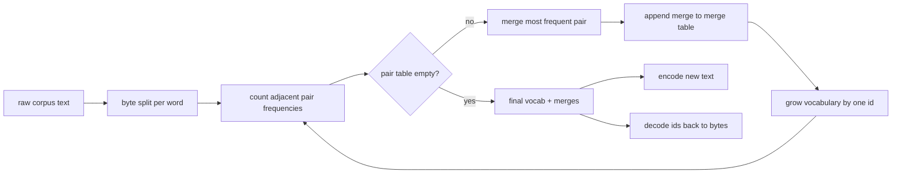
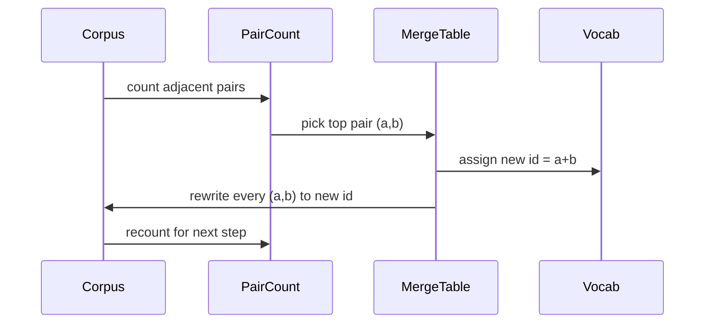

# BPE Tokenizer từ đầu

> Byte vào, ids ra, ids trở lại cùng một byte. Xây dựng tokenizer mà mọi văn bản hiện đại vẫn model bắt đầu.

**Loại:** Xây dựng
**Ngôn ngữ:** Python
**Kiến thức tiên quyết:** Giai đoạn 04 bài học, Giai đoạn 07 transformer bài học
**Thời lượng:** ~90 phút

## Mục tiêu học tập
- Huấn luyện từ vựng Mã hóa cặp byte từ kho dữ liệu văn bản thô bằng cách liên tục hợp nhất cặp ký hiệu liền kề thường xuyên nhất.
- Triển khai bảng merge xác định và áp dụng nó cho văn bản mới để tạo ra một luồng id từ phụ.
- Nhập UTF-8 tùy ý khứ hồi vào id và ngược lại mà không cần loss thông tin.
- Dự trữ và bảo vệ các tokens đặc biệt (`<|endoftext|>`, `<|pad|>`) để chúng tồn tại training và giải mã.
- Lý do tại sao bảng chữ cái cấp byte là sàn phù hợp cho tokenizer mục đích chung.

## Khung

Một ngôn ngữ model không bao giờ nhìn thấy văn bản. Nó nhìn thấy các số nguyên. Ánh xạ từ một chuỗi đến một danh sách các số nguyên và ngược lại là tokenizer. Làm sai lớp này và mọi đường cong loss trong training chạy đều đo sai.

Họ chủ đạo của tokenizers từ phụ cho văn bản chung models là Mã hóa cặp byte. Ý tưởng là nhỏ. Bắt đầu từ một bảng chữ cái đã biết. Tìm cặp ký hiệu liền kề xuất hiện thường xuyên nhất trong kho dữ liệu training. Merge nó thành một biểu tượng mới. Lặp lại cho đến khi từ vựng đạt đến kích thước mục tiêu. Mã hóa văn bản mới sử dụng lại cùng một danh sách merge theo cùng một thứ tự.

Chúng ta sẽ xây dựng biến thể cấp byte. Bảng chữ cái là 256 byte thô, không phải điểm mã Unicode. Sự lựa chọn đó là thứ cho phép tokenizer xử lý bất kỳ đầu vào UTF-8 nào mà không quay trở lại một token không xác định.

## Các pipeline

Mặt training và mặt inference dùng chung bàn merge. Sự chia sẻ đó là hợp đồng. Nếu bạn thay đổi thứ tự merge tại inference, bạn sẽ giải mã một luồng id khác.

## Bảng chữ cái byte

256 id đầu tiên được dành riêng cho các byte thô từ 0x00 đến 0xFF. Điều đó đảm bảo mọi chuỗi đầu vào có thể được thể hiện trong từ vựng trước khi bất kỳ merge nào xảy ra. Sau khối byte, chúng tôi dành một phạm vi nhỏ cho tokens đặc biệt. Vòng lặp training không bao giờ đề xuất các id đó làm mục tiêu merge vì chúng tôi loại bỏ chúng hoàn toàn khỏi luồng mã hóa trước.

Pretokenizer chia kho dữ liệu trên ranh giới khoảng trắng và dấu câu trước khi training nhìn thấy nó. Nếu không có sự phân chia đó, bước BPE merge sẽ vui vẻ học được merges rằng ranh giới chéo từ và từ vựng chứa đầy các cụm từ phổ biến. Với sự phân tách, merges ở bên trong một từ và kết quả khái quát hóa.

## Vòng lặp training

Đối với mỗi bước training, vòng lặp thực hiện ba điều. Nó đi từng từ trong kho dữ liệu và đếm tần suất mỗi cặp ký hiệu hiện tại liền kề xuất hiện, trọng số theo tần suất xuất hiện của chính từ đó. Nó chọn cặp có số lượng cao nhất. Nó viết lại mọi lần xuất hiện của cặp đó thành một ký hiệu mới duy nhất có id là vị trí trống tiếp theo trong từ vựng. Sau đó, nó ghi lại merge.

Chi phí của mỗi bước là tuyến tính theo kích thước của kho dữ liệu được biểu thị dưới dạng danh sách các chuỗi ký hiệu. Đối với một triệu từ và từ vựng mục tiêu là mười nghìn id, vòng lặp chạy đến khi hoàn thành trong vài giây vì các chuỗi ký hiệu thu nhỏ lại khi merges hạ cánh.

## Mã hóa văn bản mới

Inference không gọi bộ đếm merge. Nó áp dụng bảng merge theo cùng thứ tự mà nó đã được học. Đối với một từ mới, encoder bắt đầu từ sự phân tách byte. Nó quét trình tự hiện tại để tìm merge được xếp hạng thấp nhất (trình tự sớm nhất áp dụng). Nó thực hiện merge đó. Nó quét lại. Vòng lặp kết thúc khi không có merge nào trong bảng áp dụng cho trình tự hiện tại.

Thứ tự theo thứ hạng là thuộc tính làm cho việc mã hóa xác định và khớp với hành vi training trên cùng một đầu vào. Một merge đã học đầu tiên nằm ở đầu bảng và được áp dụng trước. Nếu hai merges có thể nộp đơn ở cùng một vị trí, người xếp hạng thấp hơn sẽ thắng.

## tokens đặc biệt

tokens đặc biệt là id mà luồng byte không bao giờ có thể tạo ra. Chúng ta đặt chúng bằng tay. Hai là đủ cho bài học này.

- `<|endoftext|>` tách các tài liệu trong quá trình pretraining. Nó nói với model "một tài liệu mới bắt đầu từ đây, đừng để ngữ cảnh của tài liệu trước đó bị rò rỉ."
- `<|pad|>` điền vào các chuỗi ngắn để một batch có thể là một tensor hình chữ nhật. Mặt nạ loss ẩn nó trong quá trình training.

encoder chấp nhận cờ để cho phép tokens đặc biệt trong đầu vào. Khi cờ tắt, các chuỗi `<|endoftext|>` và `<|pad|>` được mã hóa dưới dạng byte đánh vần chúng. Khi cờ được bật, các chuỗi theo nghĩa đen được ánh xạ đến id dành riêng của chúng và không phải chịu bất kỳ merge nào.

## Đảm bảo khứ hồi

Mã hóa sau đó giải mã phải trả về chính xác các byte đầu vào. decoder nối việc mở rộng byte của mọi id theo thứ tự. Vì mỗi id là một byte thô hoặc sự nối của hai id đã biết trước đó, nên việc mở rộng đệ quy luôn kết thúc bằng byte thô. Sau đó, giải mã trả về chuỗi UTF-8 mà các byte đó đánh vần.

Bộ kiểm thử trong bài học này kiểm tra thuộc tính đó trên một câu không nhìn thấy, trên một câu có biểu tượng cảm xúc Unicode và trên một câu có chứa `<|endoftext|>` token theo nghĩa đen.

## Bài học này không làm gì

Nó không xây dựng một pretokenizer được điều khiển bởi regex theo phong cách của production tokenizers lớn nhất. Pretokenizer ở đây là một khoảng trắng nhỏ và phân tách dấu câu. Chỉ cần tạo ra merges hợp lý trên một kho training nhỏ là đủ và hợp đồng với rest của chuỗi bài học vẫn giữ nguyên. Bài học tiếp theo coi tokenizer như một hộp đen và xây dựng dataset cửa sổ trượt trên nó.

Nó không song song bộ đếm cặp. Một vòng lặp trong Python trên một kho dữ liệu vài nghìn từ kết thúc trong vòng chưa đầy một giây. Đối với kho dữ liệu lớn hơn, động thái rõ ràng là đếm song song các cặp trên mỗi từ và giảm.

## Cách đọc mã

`main.py` định nghĩa bốn đối tượng. `BPETokenizer` chứa từ vựng, bảng merge và bảng token đặc biệt. `train` là vòng lặp training. `encode` là con đường inference. `decode` là nối byte. Bản demo ở dưới cùng huấn luyện một tokenizer nhỏ trên một kho dữ liệu tích hợp, mã hóa một câu được giữ lại, giải mã lại id và in cả hai. Các bài kiểm tra trong `code/tests/test_bpe.py` ghim tài sản khứ hồi, đặt chỗ token đặc biệt và đặt hàng merge.

Chạy bản demo. Sau đó, thay đổi kích thước từ vựng mục tiêu trong bản demo từ 300 thành 600 và xem độ dài được mã hóa của câu được giữ giảm như thế nào. Đường cong đó là đường cong nén BPE.
