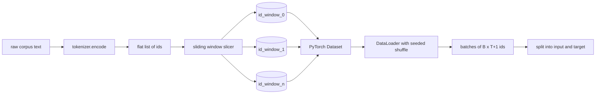
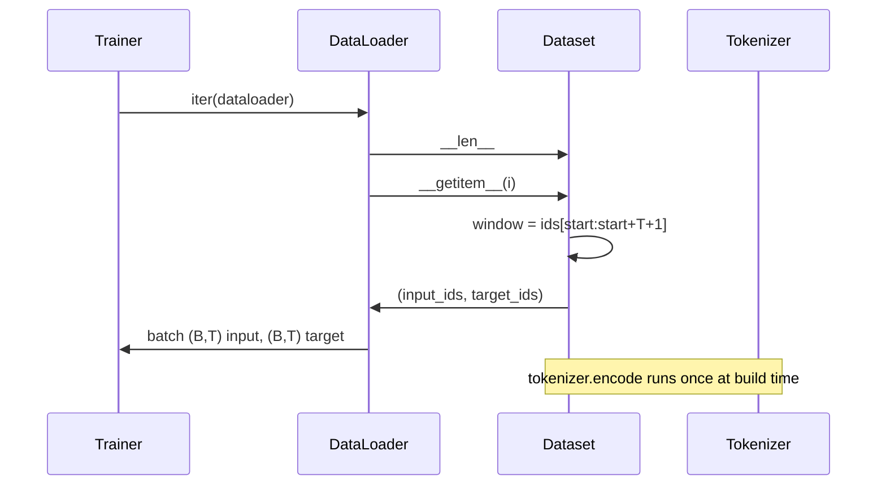

# Tokenized Dataset với Cửa sổ trượt

> Chạy pretraining là một hàm từ token id đến gradients. Bài học này xây dựng băng tải cung cấp id vào.

**Loại:** Xây dựng
**Ngôn ngữ:** Python
**Kiến thức tiên quyết:** Giai đoạn 04 bài học, Giai đoạn 07 transformer bài học, Bài 30 của giai đoạn này
**Thời lượng:** ~90 phút

## Mục tiêu học tập
- Chuyển đổi một kho dữ liệu thô thành một luồng id token bằng cách gọi tokenizer một lần.
- Cắt luồng id thành các windows có độ dài cố định với sải chân chồng chéo có thể định cấu hình.
- Xây dựng một PyTorch Dataset trả về tensors đầu vào và mục tiêu để dự đoán token tiếp theo.
- Bọc dataset trong một DataLoader bằng cách xáo trộn xác định được gieo hạt mỗi epoch.
- Lý do về sự đánh đổi giữa sải chân, dự phòng và kích thước dataset hiệu quả.

## Khung

Chạy pretraining đọc một batch id token cùng một lúc và cập nhật model. Hình dạng của mỗi batch được cố định bởi hợp đồng training. Đối với model ngôn ngữ nhân quả, batch giữ `(B, T)` id đầu vào và id mục tiêu `(B, T)` trong đó mục tiêu là đầu vào được dịch chuyển sang trái một. Công việc của các pipeline dữ liệu là tạo ra hợp đồng đó theo yêu cầu, theo cách xác định và có thể tái tạo, từ một kho dữ liệu có thể là vài gigabyte văn bản thô.

Bài học này xây dựng pipeline. tokenizer từ bài học trước biến văn bản thành một danh sách dài phẳng của id. Một cửa sổ trượt cắt danh sách đó thành training ví dụ. Một Dataset tùy chỉnh hiển thị các ví dụ dưới dạng tensors. A DataLoader batches chúng và xáo trộn chúng với một hạt giống đã biết.

## Hợp đồng hình dạng

Một LM nhân quả tiêu thụ id của hình dạng `(B, T)` trong đó `B` là kích thước batch và `T` là độ dài ngữ cảnh. Mục tiêu tại vị trí `t` là đầu vào ở vị trí `t+1`. Điều đó có nghĩa là mọi ví dụ training bao gồm `T+1` id thô. Sải chân cửa sổ kiểm soát mức độ chồng chéo tồn tại giữa các ví dụ liên tiếp.

Máy thái không bao giờ trùng lặp với ranh giới của kho dữ liệu. Nếu cửa sổ cuối cùng không có đủ id để điền vào các vị trí `T+1`, bộ cắt sẽ thả nó. Đệm đuôi bằng `<|pad|>` cũng là một lựa chọn hợp lệ nhưng nó làm phức tạp loss mặt nạ. Đối với bài học này, chúng tôi bỏ đi.

## Tại sao lại có cửa sổ trượt

Kho dữ liệu pretraining là một luồng dài của id. Nếu model chỉ thấy windows không chồng chéo, mọi ví dụ training sẽ dạy nó `T` ranh giới giống nhau. Điều chỉnh sải chân sẽ di chuyển các ranh giới đó xung quanh để model thấy các nhiệm vụ dự đoán token tiếp theo đa dạng hơn.

Một sải `T` tạo ra windows không chồng chéo. Một bước `T // 2` tạo ra sự chồng chéo năm mươi phần trăm và tăng gấp đôi dataset hiệu quả. Một sải `1` tạo ra sự chồng chéo tối đa và tăng dataset lên hệ số `T`. Chi phí điện toán trên mỗi epoch nhiều hơn. Lợi ích là đa dạng ranh giới hơn. Hầu hết các lần chạy pretraining sử dụng một sải chân bằng với độ dài ngữ cảnh vì kho dữ liệu đã lớn hơn nhiều so với model có thể hoàn thành trong một epoch, vì vậy đối số đa dạng ranh giới yếu hơn.

## Các Dataset class

Một PyTorch Dataset có hai phương pháp bắt buộc. `__len__` trả về số lượng ví dụ. `__getitem__` trả về một ví dụ dưới dạng một cặp tensors. Dataset của chúng tôi lưu trữ luồng id được mã hóa và sải chân. Việc lập chỉ mục vào nó sẽ tính toán thời điểm bắt đầu của cửa sổ một cách nhanh chóng, vì vậy chi phí bộ nhớ là một bản sao của luồng id bất kể sải chân tạo ra bao nhiêu ví dụ.

Sự thay đổi từng người một xảy ra bên trong `__getitem__`. Dataset trả về `(input, target)` nơi `input = window[:-1]` và `target = window[1:]`. Cả hai đều PyTorch tensors dài. Vòng lặp training coi chúng là ground truth.

## Xáo trộn xác định

Một DataLoader có `shuffle=True` đọc từ một trình tạo ngẫu nhiên PyTorch. Bằng cách vượt qua một `torch.Generator` rõ ràng được gieo hạt cho mỗi epoch, chúng tôi nhận được cùng một sự xáo trộn mỗi khi bắt đầu lại quá trình chạy. Thuộc tính đó quan trọng khi bạn muốn so sánh hai lần chạy chỉ khác nhau trong một hyperparameter. Nếu không có hạt giống, hai lần chạy sẽ thấy dữ liệu theo các thứ tự khác nhau và các đường cong loss phân kỳ vì những lý do không liên quan đến sự thay đổi.

Hợp đồng hạt giống trong bài học này rất đơn giản. `epoch_seed = base_seed + epoch_index`. Hạt giống cơ bản được chuyển khi xây dựng. Chỉ số epoch được tăng bởi huấn luyện viên ở đầu mỗi epoch. Một lần chạy lại với cùng một hạt giống cơ bản luôn thấy cùng một thứ tự trong mọi epoch.

## Batch sampler

Bộ lấy mẫu mặc định trong PyTorch chọn các chỉ số một cách ngẫu nhiên với việc thay thế bị tắt. Đó là những gì chúng tôi muốn cho pretraining. Đối với việc tinh chỉnh trên một dataset nhỏ, hợp đồng là như nhau. DataLoader tập hợp một batch bằng cách gọi `__getitem__` `B` lần và xếp chồng kết quả. Bởi vì mọi ví dụ đều có độ dài như nhau theo cấu trúc nên không cần logic đệm.

Bài học giữ `num_workers=0` cho sự đơn giản. Trong một production chạy, workers song song các cuộc gọi `__getitem__`. Với pipeline của chúng tôi, điều đó hầu như không hoạt động vì công việc chỉ là một lát cắt của tensor trong bộ nhớ, nhưng cùng một Dataset API hỗ trợ workers một cách rõ ràng.

## Ví dụ về đếm

Đối với luồng id có độ dài `N`, độ dài ngữ cảnh `T` và `S` sải chân, số lượng ví dụ là `max(0, 1 + (N - (T + 1)) // S)`. Bài học cho thấy phép tính đó là một phương pháp tĩnh trên Dataset để người huấn luyện có thể tính toán tổng số bước mỗi epoch mà không cần lặp lại.

## Bài học này không làm gì

Nó không phát trực tuyến từ đĩa. Kho dữ liệu được mã hóa đầy đủ trong bộ nhớ và được lưu giữ dưới dạng một tensor duy nhất. Đối với một kho dữ liệu gồm vài triệu id có dung lượng dưới một trăm megabyte và là hình dạng phù hợp cho bài học. Disk streaming là một mối quan tâm riêng biệt cắm vào bằng cách thay thế bộ nhớ nhưng vẫn giữ hợp đồng Dataset.

Nó không xử lý nhiều tài liệu. Kho dữ liệu được coi là một luồng id liên tục. Ranh giới tài liệu tiếp theo được mã hóa bằng cách chèn id `<|endoftext|>` khi kho dữ liệu được xây dựng từ nhiều tài liệu. Người model học cách dự đoán xung quanh ranh giới.

## Cách đọc mã

`main.py` định nghĩa hai classes và một trợ giúp. `SlidingWindowDataset` là PyTorch Dataset. `make_dataloader` trả về một DataLoader đã định cấu hình với một trình tạo hạt giống. `_encode_corpus_to_ids` là cuộc gọi one-shot tokenizer. Bản demo ở dưới cùng xây dựng một tokenizer nhỏ trong process, mã hóa một kho dữ liệu tích hợp, xây dựng dataset và dataloader, in một batch và xác nhận hợp đồng hình dạng. Các bài kiểm tra trong `code/tests/test_dataset.py` ghim công thức đếm cửa sổ, thuộc tính dịch chuyển từng một, xáo trộn xác định và đánh đổi sải chân.

Chạy bản demo. Sau đó, thay đổi độ dài ngữ cảnh từ 16 thành 32 và xem số lượng ví dụ mỗi epoch giảm như thế nào. Con số đó là ngân sách số bước trên epoch của bạn.
