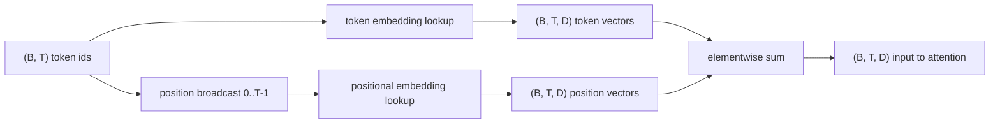
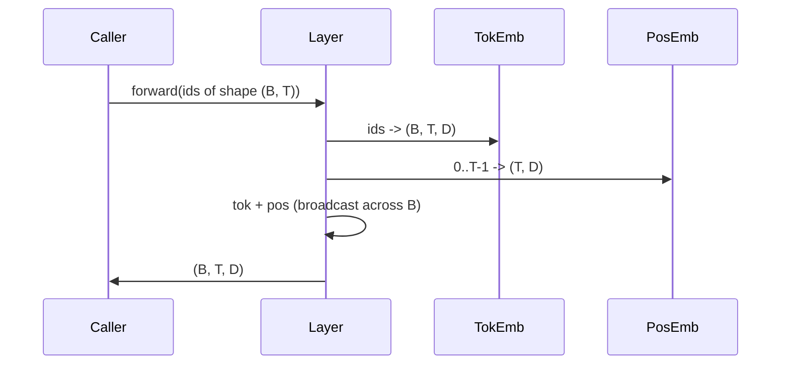

# Token và Embeddings vị trí

> Id là số nguyên. model muốn vectors. Hai bảng tra cứu nằm giữa chúng và việc lựa chọn bảng vị trí định hình những gì model có thể học.

**Loại:** Xây dựng
**Ngôn ngữ:** Python
**Kiến thức tiên quyết:** Giai đoạn 04 bài học, Giai đoạn 07 transformer bài học, Bài 30 và 31 của giai đoạn này
**Thời lượng:** ~90 phút

## Mục tiêu học tập
- Xây dựng bảng tra cứu token embedding ánh xạ id từ vựng với các vectors dày đặc.
- Xây dựng bảng tra cứu embedding vị trí đã học được lập chỉ mục theo vị trí.
- Xây dựng một embedding vị trí hình sin cố định được lập chỉ mục theo vị trí không có parameters.
- Soạn token và embeddings vị trí thành một đầu vào duy nhất cho một khối transformer.
- Tương phản đã học và embeddings hình sin về tổng quát hóa chiều dài và số lượng parameter.

## Khung

Liên hệ đầu tiên của model với id token là tra cứu hàng trong ma trận token-embedding. Ma trận có một hàng cho mỗi id từ vựng và một cột trên mỗi model chiều. Tra cứu trả về một vector mà rest của model coi là ý nghĩa của id. Backprop cập nhật các hàng đã được sử dụng trong forward pass. Qua training hình học của các hàng đó học cách mã hóa sự tương đồng trong các hướng.

Token chỉ riêng id không có thứ tự. model cần tín hiệu thứ hai cho biết vị trí một khác với vị trí mười bảy. Hai lựa chọn chủ đạo cho tín hiệu đó là embedding vị trí đã học (bảng tra cứu thứ hai, một hàng cho mỗi vị trí) và embedding vị trí hình sin cố định (một công thức toán học không có parameters). Sự lựa chọn có hậu quả. Bảng đã học là một parameter và bị giới hạn bởi độ dài ngữ cảnh tối đa mà model được huấn luyện. Về lý thuyết, một bảng hình sin không có parameter và công thức mở rộng đến bất kỳ vị trí nào, nhưng `SinusoidalPositionalEmbedding` của bài học này tính toán trước một bảng cố định ở `max_context_length` và `forward` của nó vượt qua giới hạn đó; Do đó, cả hai mô-đun đều thực thi độ dài ngữ cảnh tối đa ở đây. model vẫn có thể vật lộn vượt qua độ dài training của nó ngay cả khi bảng đủ lớn để lập chỉ mục.

Bài học này xây dựng cả hai và soạn chúng với token embedding thành một đầu vào duy nhất cho khối attention của bài học tiếp theo.

## Hợp đồng hình dạng

Đầu vào cho giai đoạn embedding là một batch của các id token của hình dạng `(B, T)`. Đầu ra là một tensor hình dạng `(B, T, D)` trong đó `D` là kích thước model. Mỗi phần tử batch đều có cùng độ dài ngữ cảnh `T`. Mọi vị trí đều có cùng chiều vector `D`.



Thành phần là một tổng, không phải là một mối nối. Tổng giữ `D` không đổi thông qua mạng và cho phép model quyết định trên cơ sở mỗi feature liệu ý nghĩa token hay vị trí chiếm ưu thế ở mỗi lớp.

## Ma trận token embedding

token embedding là một parameter tensor hình dạng `(V, D)` trong đó `V` là kích thước từ vựng. PyTorch phơi bày nó là `nn.Embedding(V, D)`. Khi bắt đầu, các mục được rút ra từ một Gaussian nhỏ, theo truyền thống với trung bình không và độ lệch chuẩn xung quanh `0.02` cho models thang transformer. Khởi đầu chính xác ít quan trọng hơn là nó vẫn nhất quán qua các lần chạy.

forward pass là một hoạt động lập chỉ mục duy nhất. PyTorch ánh xạ `(B, T)` id int64 để `(B, T, D)` phao bằng cách thu thập các hàng. backward pass tích lũy gradients chỉ vào các hàng đã chạm vào trong forward pass. Hai hàng chưa bao giờ xuất hiện trong batch không nhận được gradient trên bước đó.

Một chi tiết tinh tế. token embedding và hình chiếu đầu ra ở cuối model thường chia sẻ trọng lượng (buộc trọng lượng). Khi điều đó xảy ra, mọi backward pass chạm vào mọi hàng của embedding qua phía đầu ra. Bài học ở đây cho thấy cả hai là các mô-đun riêng biệt nhưng cùng một ma trận có thể đóng cả hai vai trò trong một model đầy đủ.

## Các embedding vị trí đã học

embedding vị trí đã học là `nn.Embedding` thứ hai của hình dạng `(max_context_length, D)`. Tra cứu được khóa theo id vị trí `0, 1, 2, ..., T-1`. forward pass phát vị trí đó vector trên không gian batch.

Nhược điểm của bảng đã học là nó không thể được truy vấn ở vị trí `T` nếu model chỉ được huấn luyện đến vị trí `T-1`. Hàng không tồn tại. models chỉ Production decoder sử dụng lược đồ này đưa độ dài ngữ cảnh tối đa vào kiến trúc và từ chối process đầu vào dài hơn.

## embedding vị trí hình sin

embedding vị trí hình sin là một hàm từ vị trí đến vector. Định vị `p` và feature `i` sản xuất

```python
angle = p / (10000 ** (2 * (i // 2) / D))
emb[p, 2k]     = sin(angle)
emb[p, 2k + 1] = cos(angle)
```

Chức năng này không có parameters. Mỗi vị trí đều có một vector riêng. Bước sóng thay đổi về mặt hình học trên feature chiều, vì vậy kích thước thấp hơn mã hóa vị trí thô và kích thước cao hơn mã hóa vị trí tốt.

Thuộc tính tiếp theo từ việc lựa chọn `sin` và `cos` cùng nhau là vector tại vị trí `p + k` là một hàm tuyến tính của vector tại vị trí `p`. Điều đó cung cấp cho lớp attention một con đường dễ dàng để học các bù đắp vị trí tương đối. model không cần một parameter riêng để thể hiện "nhìn lại năm tokens".

Bài học tính toán bảng hình sin đầy đủ một lần khi xây dựng và lập chỉ mục vào đó theo thời gian chuyển tiếp.

## Thành phần

Đầu vào pipeline thực hiện ba việc theo thứ tự. Đọc id token. Tra cứu token vectors. Thêm vectors vị trí. Trả về tổng.



Việc phát sóng trong bước tổng sao chép tensor vị trí `(T, D)` dọc theo chiều batch. PyTorch xử lý điều đó tự động vì tensor vị trí có hình dạng `(1, T, D)` sau khi không bóp.

## Phân tích tương phản

Bài học chạy cả hai biến thể trên cùng một đầu vào và in hai chẩn đoán.

Đầu tiên là parameter đếm. Biến thể đã học thêm `max_context_length * D` parameters lên trên token embedding. Biến thể hình sin thêm không.

Thứ hai là sự tương đồng cosin giữa embeddings ở các vị trí lân cận. Biến thể hình sin có sự phân rã trơn tru và có thể dự đoán được vì chức năng này liên tục. Biến thể đã học khi khởi tạo có sự tương đồng gần như ngẫu nhiên vì các hàng được vẽ độc lập. Sau training, biến thể đã học thường phát triển một cấu trúc trơn tru tương tự, nhưng nó phải khám phá cấu trúc đó từ dữ liệu.

## Bài học này không làm gì

Nó không xây dựng mã hóa vị trí quay (RoPE) hoặc AliBi. Đó là những lựa chọn hiện đại trong production transformers. Cả hai đều tuân theo cùng một hợp đồng hình dạng như embeddings ở đây (áp dụng phép biến đổi phụ thuộc vào vị trí cho vectors hình dạng `(B, T, D)`) nhưng chúng áp dụng ở bước chiếu attention chứ không phải ở đầu vào. Bài học tiếp theo xây dựng khối attention và một trong những phần mở rộng tùy chọn là gấp xoay vào các phép chiếu khóa truy vấn ở đó.

Nó không huấn luyện embedding. Training yêu cầu một loss, yêu cầu đầu ra model, yêu cầu attention và đầu LM. Đó là bài học tiếp theo và bài học tiếp theo.

## Cách đọc mã

`main.py` định nghĩa ba mô-đun. `TokenEmbedding` bọc `nn.Embedding(V, D)`. `LearnedPositionalEmbedding` bọc `nn.Embedding(L, D)`. `SinusoidalPositionalEmbedding` tính toán trước bảng và hiển thị nó dưới dạng bộ đệm. `EmbeddingComposer` liên kết một token embedding và một embedding vị trí với nhau. Bản demo ở dưới cùng in các hình dạng, số lượng parameter và chẩn đoán tương tự vị trí hàng xóm. Các bài kiểm tra `code/tests/test_embeddings.py` hình dạng chốt, hành vi phát sóng, số lượng parameter và công thức hình sin.

Chạy bản demo. Sau đó thay đổi kích thước model `D` từ 64 thành 32 và xem các dải bước sóng hình sin thay đổi như thế nào.
