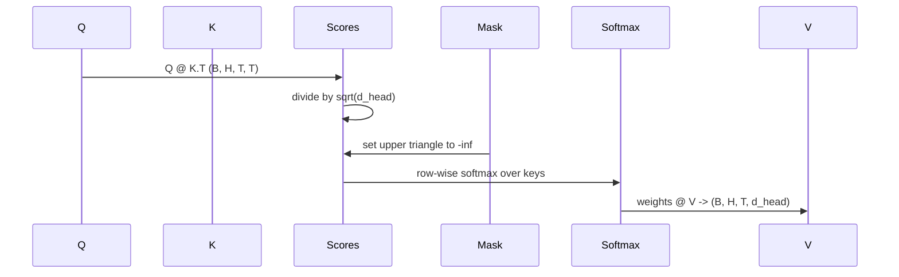

# Self-Attention nhiều đầu

> Một phép chiếu tuyến tính, ba góc nhìn, đầu song song H, một mặt nạ. Khối attention vì model thực sự sử dụng nó.

**Loại:** Xây dựng
**Ngôn ngữ:** Python
**Kiến thức tiên quyết:** Giai đoạn 04 bài học, Giai đoạn 07 transformer bài học, Bài 30 đến 32 của giai đoạn này
**Thời lượng:** ~90 phút

## Mục tiêu học tập
- Triển khai phép chiếu Query/Key/Value hàng loạt dưới dạng một lớp tuyến tính duy nhất được chia thành các đầu H.
- Tính toán attention sản phẩm chấm theo tỷ lệ với chuẩn hóa và xử lý dtype chính xác.
- Áp dụng một mặt nạ nhân quả để ngăn một vị trí tham gia vào các vị trí trong tương lai.
- Kiểm tra trọng lượng attention trên mỗi đầu để biết đầu vào cố định và lý do về những gì mỗi đầu nhìn vào.
- Huấn luyện một khối attention nhỏ trong một nhiệm vụ đồ chơi và xem loss rơi xuống khi những người đứng đầu chuyên môn.

## Khung

Attention là hàm cho phép biểu diễn của token lấy thông tin từ các tokens khác theo cùng một trình tự. Self-attention có nghĩa là các truy vấn, khóa và giá trị đều bắt nguồn từ cùng một đầu vào. Nhiều đầu có nghĩa là phép chiếu được chia thành các bài toán attention song song H có đầu ra được nối và chiếu trở lại.

Mô hình triển khai hiệu quả là một lớp tuyến tính chiếu từ `D` này sang `3 * D` và được cắt thành ba chế độ xem, sau đó được định hình lại thành các đầu H có kích thước `D // H` mỗi đầu. Tổng matmul, softmax và có trọng số xảy ra dưới dạng các phép toán tensor hàng loạt để các đầu chạy song song trên chân ga.

Bài học này xây dựng khối đó. Nó cũng thêm mặt nạ nhân quả để mã tương tự hoạt động như lớp attention trong model ngôn ngữ chỉ decoder. Bài học tiếp theo stacks khối thành một transformer đầy đủ và bài học sau khi huấn luyện nó.

## Hợp đồng hình dạng

Đầu vào là `(B, T, D)`. Đầu ra là `(B, T, D)`. Mặt nạ được `(T, T)` hoặc có thể phát cho nó. Bên trong khối, tensors trung gian có hình dạng `(B, H, T, d_head)` nơi `d_head = D // H`. Ràng buộc là `D % H == 0`.

```mermaid
flowchart LR
    A["(B, T, D) input"] --> B[Linear D -> 3D]
    B --> C["split into Q, K, V"]
    C --> D["reshape to (B, H, T, d_head)"]
    D --> E["scores = Q @ K.T / sqrt(d_head)"]
    E --> F[apply causal mask]
    F --> G[softmax over keys]
    G --> H["context = weights @ V"]
    H --> I["reshape to (B, T, D)"]
    I --> J[output Linear D -> D]
    J --> K["(B, T, D) output"]
```

Hai lớp tuyến tính (phép chiếu QKV và phép chiếu đầu ra) là parameters duy nhất trong khối. Mặt nạ, softmax, matmuls và định hình lại đều không có parameter.

## Sự phân chia QKV

Việc triển khai ngây thơ có ba lớp tuyến tính riêng biệt, mỗi lớp cho Q, K và V. Cái hiệu quả có một lớp duy nhất xuất ra `3 * D` features và phân chia kết quả. Cả hai tương đương về mặt toán học vì ba phép nhân ma trận riêng biệt với trọng số `(D, D)` chính xác là một phép nhân ma trận với trọng số `(3D, D)` xếp chồng lên nhau từ chúng.

Phiên bản hiệu quả nhanh hơn vì bộ tăng tốc khởi chạy một matmul thay vì ba. Việc khởi tạo cũng dễ dàng hơn vì ba ma trận con sống trong cùng một parameter tensor và có thể được khởi tạo cùng nhau.

## Định hình lại đầu

Sau khi tách, mỗi Q, K, V được `(B, T, D)`. Để biến nó thành các bài toán attention song song H, chúng ta định hình lại thành `(B, T, H, d_head)` và chuyển vị thành `(B, H, T, d_head)`. Thứ nguyên đầu hiện nằm bên cạnh thứ nguyên batch để PyTorch coi attention trên đầu như một hoạt động hàng loạt trên `B * H` phiên bản độc lập.

Chiều d_head vẫn ở cuối cùng để điểm số `Q @ K.transpose(-2, -1)` thu hẹp nó. Kết quả là `(B, H, T, T)` điểm attention trên đầu người.

## Mở rộng quy mô

Điểm số được chia cho `sqrt(d_head)` trước softmax. Nếu không có quy mô đó, các sản phẩm chấm phát triển khi `d_head` phát triển và đẩy softmax vào một chế độ mà một mục có gần như tất cả khối lượng và các mục khác nhỏ một cách biến mất. Các gradients trong chế độ đó là những quầy hàng nhỏ và học tập. Chia cho `sqrt(d_head)` giữ cho variance của điểm số gần như không đổi trên các kích thước đầu.

## Mặt nạ nhân quả

Một ngôn ngữ chỉ decoder model chỉ có thể điều kiện vào quá khứ khi dự đoán token tiếp theo. Mặt nạ thực thi điều đó. Cụ thể, trước khi softmax, mọi mục nhập phía trên đường chéo của ma trận điểm số `(T, T)` sẽ được thay thế bằng vô cực âm. Sau khi softmax những vị trí đó nhận được trọng lượng bằng không.

Chúng ta đăng ký mặt nạ làm bộ đệm khi xây dựng để nó tồn tại trên cùng một thiết bị với model và không phải là một phần của biểu đồ gradient. Mặt nạ bao gồm độ dài ngữ cảnh tối đa mà khối sẽ từng thấy. Tại thời gian chuyển tiếp, chúng tôi cắt góc `(T, T)` trên cùng bên trái.

## Dự báo đầu ra

Sau khi vectors `(B, H, T, d_head)` ngữ cảnh cho mỗi đầu, chúng ta chuyển vị trở lại `(B, T, H, d_head)`, định hình lại thành `(B, T, D)` và áp dụng phép chiếu tuyến tính `(D, D)` cuối cùng. Phép chiếu đầu ra cho phép model trộn các đầu. Nếu không có nó, các đầu H sẽ chỉ tái kết hợp qua các lớp sau và khối sẽ bị hạn chế một cách nhân tạo.

## Kiểm tra trọng lượng Attention

Bài học phơi bày một lá cờ `return_weights=True` trên forward pass. Khi được đặt, khối trả về trọng số attention trên đầu của hình dạng `(B, H, T, T)` cùng với đầu ra. Bản demo in bản đồ nhiệt của trọng lượng của một đầu trên một đầu vào ngắn để bạn có thể thấy cấu trúc tam giác nhân quả và tiêu điểm trên mỗi vị trí.

Trong một model được huấn luyện, những người đứng đầu khác nhau học các mô hình khác nhau. Một số người đứng đầu tham dự token trước đó. Một số người đứng đầu tham gia vào phần bắt đầu của chuỗi. Một số đầu trải rộng attention gần như đồng đều. Các hook kiểm tra là điểm khởi đầu cho công việc giải thích đó.

## Bản demo training

Bản demo ở cuối `main.py` nối khối attention vào một đầu LM nhỏ và huấn luyện toàn bộ mọi thứ trong một tác vụ lặp lại. Mỗi hàng đầu vào là một id ngẫu nhiên duy nhất được sao chép trên ngữ cảnh. Mục tiêu là đầu vào dịch chuyển một, vì vậy model phải biết rằng token tiếp theo giống với token trước. loss là entropy chéo. Với H = 4, D = 32, T = 12 và từ vựng là 64, loss giảm từ ngẫu nhiên (khoảng `log(64) ~4.16`) xuống dưới `1.0` hơn ba epochs trên CPU.

Mục đích của bản demo không phải là huấn luyện một model hữu ích. Vấn đề là xác nhận dòng chảy gradients qua từng phần của khối và những người đứng đầu học được điều gì đó về một vấn đề mà câu trả lời là rõ ràng.

## Bài học này không làm gì

Nó không thêm một khối chuyển tiếp nguồn cấp dữ liệu. Lớp transformer trong một model thực attention theo sau là MLP hai lớp với kết nối dư và định mức lớp xung quanh mỗi lớp. Bài học tiếp theo bổ sung những điều đó.

Nó không thực hiện mã hóa vị trí xoay hoặc AliBi. Cả hai đều áp dụng ở bước chiếu QKV trong cùng một khối, nhưng chúng là một đơn vị giảng dạy riêng biệt. Khối được xây dựng ở đây tương thích với một trong hai bằng cách biến đổi Q và K trước matmul.

Nó không thực hiện KV cache cho inference. Bộ nhớ đệm các khóa và giá trị trên các chuyển tiếp là tối ưu hóa giúp giải mã tự hồi quy nhanh chóng. Nó thay đổi hợp đồng hình dạng trên K và V tensors nhưng không thay đổi trên Q. Nó thuộc về bài học inference.

## Cách đọc mã

`main.py` định nghĩa `MultiHeadSelfAttention`. class chứa hai lớp tuyến tính và một bộ đệm mặt nạ đã đăng ký. Các forward pass dự án, định hình lại, điểm số, mặt nạ, softmax, trọng lượng, định hình lại và dự án một lần nữa. Bản demo ở dưới cùng xây dựng một model nhỏ bao bọc attention bằng embeddings token và vị trí và đầu LM, huấn luyện nó trên một tác vụ sao chép trong ba epochs và in đường cong loss và bản đồ nhiệt attention trên mỗi đầu. Các thử nghiệm trong `code/tests/test_attention.py` ghim hợp đồng hình dạng, thuộc tính nhân quả, thuộc tính softmax, thuộc tính tách đầu và luồng gradient.

Chạy bản demo. Sau đó tăng `n_heads` từ 4 lên 8 (giữ `d_model=32`, vì vậy `d_head=4`) và xem bản đồ nhiệt thay đổi.
