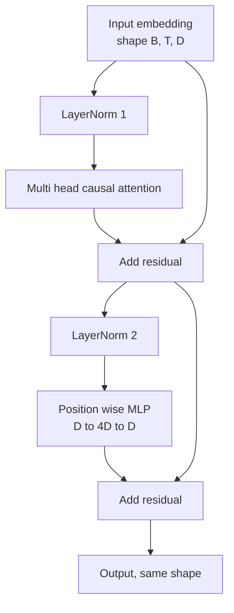
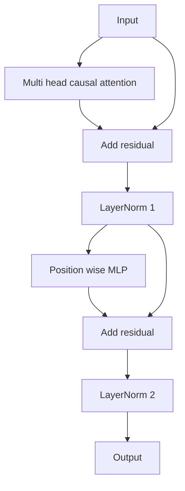

# Transformer Chặn từ đầu

> Một khối là đơn vị của mọi decoder LLM hiện đại. Định mức lớp, attention nhiều đầu, dư, MLP, dư. Biến thể trước LN tập luyện ổn định mà không cần khởi động. Biến thể hậu LN là những gì bài báo gốc shipped. Bài học này xây dựng cả hai, cạnh nhau và cho thấy cái nào tồn tại sau stack 12 lớp ở tốc độ học chung.

**Loại:** Xây dựng
**Ngôn ngữ:** Python
**Kiến thức tiên quyết:** Giai đoạn 19 bài học 30 đến 33 (tokenizer, embeddings, toán attention, bộ nạp dữ liệu hàng loạt)
**Thời lượng:** ~90 phút

## Mục tiêu học tập

- Xây dựng một khối transformer trong PyTorch từ bốn mảnh chuyển động: LayerNorm, attention nhân quả nhiều đầu, kết nối dư, MLP khôn ngoan về vị trí.
- Đặt LayerNorms trong hai cấu hình (trước LN và sau LN) và giải thích lý do tại sao một người tập luyện ổn định mà không cần khởi động.
- Thực hiện mặt nạ nhân quả bên trong attention nhiều đầu để token `i` không thể nhìn thấy tokens `j > i`.
- Theo dõi dòng chảy gradient qua cả hai biến thể trên stack 12 lớp và đọc kết quả mà không cần vẫy tay.
- Tái sử dụng khối như một đơn vị thả vào khi bài học tiếp theo lắp ráp một parameter GPT 124 triệu.

## Vấn đề

Một transformer là một khối được lặp lại. Chặn sai một lần, lặp lại nó mười hai lần và bạn ship một model phân kỳ trong epoch đầu tiên hoặc cần hack khởi động ngay rest đường. Hai chế độ thất bại bạn sẽ thấy trong bài học này không phải là kỳ lạ. Chúng xuất hiện lần đầu tiên một người học stacks chặn một cách ngây thơ. Một là lớp attention quan tâm đến tương lai. Cái còn lại là LayerNorm được đặt ở nơi nó không thể chế ngự tín hiệu còn lại ở độ sâu.

Bản sửa lỗi là máy móc khi bạn nhìn thấy nó. Khối có chính xác hai đường dẫn dư và chính xác hai vị trí chuẩn hóa. Chọn vị trí chính xác và rest của stack chỉ là ghi sổ kế toán.

## Khái niệm

Mỗi khối chỉ transformer decoder là một hàm có một tensor hình dạng `(batch, sequence, embedding)` và trả về một tensor có cùng hình dạng. Bên trong, hai lớp con thực hiện công việc.



Đây là biến thể trước LN. LayerNorm nằm bên trong branch dư, trước lớp phụ. Kết nối còn lại mang tín hiệu không chuẩn hóa về phía trước.

Biến thể sau LN di chuyển LayerNorm sang sau cộng dư.



Hình dạng giống hệt nhau. Training hành vi thì không. Với hậu LN, gradient chảy ngược qua đường dư phải đi qua LayerNorm. Ở độ sâu mười hai và learning rate `3e-4`, gradient đó co lại đủ nhanh để cần một lịch trình khởi động. Pre-LN để lại đường đi dư không chuẩn hóa, vì vậy gradients lan truyền sạch sẽ đến lớp embedding. Pre-LN là configuration GPT-2 ships trở đi vì lý do đó.

### Nhân quả nhiều đầu attention

Lớp con attention chiếu đầu vào ba cách thành truy vấn, khóa, giá trị tensors. Mỗi người được định hình lại từ `(B, T, D)` sang `(B, H, T, D/H)` trong đó số lượng người `H`. Sản phẩm chấm tỷ lệ attention tính toán `softmax(Q K^T / sqrt(d_k))` trên mỗi đầu, che mặt nạ tam giác trên thành vô cực âm, áp dụng mặt nạ thông qua softmax, sau đó nhân với `V`. Các đầu được nối lại thành một `(B, T, D)` tensor duy nhất và chiếu một lần nữa. Mặt nạ là mảnh ghép duy nhất làm cho model nhân quả. Quên mặt nạ và bạn huấn luyện một model gian lận.

### The MLP

Vị trí MLP khôn ngoan áp dụng cùng một mạng hai lớp cho mọi token một cách độc lập. Chiều rộng ẩn gấp bốn lần chiều rộng embedding, kích hoạt là GELU và một dropout theo sau tuyến tính thứ hai. Không tokens nói chuyện với nhau bên trong MLP. Tất cả token trộn đều diễn ra trong attention.

### Các kết nối còn lại làm hai việc

Họ làm cho đường dẫn gradient phụ gia theo chiều sâu, điều này giữ cho tiêu chuẩn gradient theo tỷ lệ thông qua mười hai lớp. Họ cũng cho phép mỗi khối học một bản cập nhật bổ sung cho biểu diễn đang chạy thay vì thay thế toàn bộ. Cả hai hiệu ứng đều là lý do tại sao khối mở rộng.

## Tự xây dựng

`code/main.py` thực hiện:

- `class LayerNorm` với quy mô và sự thay đổi có thể học được, EPS thiên vị, áp dụng theo token vector.
- `class MultiHeadAttention` với `num_heads`, `head_dim = d_model // num_heads`, phép chiếu QKV hợp nhất, mặt nạ nhân quả đã đăng ký, attention và dropout dư.
- `class FeedForward` với hai lớp tuyến tính, kích hoạt GELU dropout.
- `class TransformerBlock` cờ `pre_ln` chuyển đổi giữa hai biến thể.
- Một bản demo xây dựng một stack 6 lớp trước LN và một stack 6 lớp sau LN với các đầu vào và bản in giống hệt nhau (a) hình dạng đầu ra, (b) gradient định mức ở embedding sau một backward pass.

Chạy nó:

```bash
python3 code/main.py
```

Đầu ra: kiểm tra hình dạng trên cả stacks, gradient định mức cạnh nhau. embedding gradient của stack trước LN lớn hơn so với stack sau LN ở cùng learning rate, đó là tín hiệu thực nghiệm trước LN mà không cần khởi động.

## Stack

- `torch` cho toán học tensor, autograd và hệ thống ống nước `nn.Module`.
- Không `transformers`, không có trọng lượng pretrained. Khối được thực hiện từ primitives.

## Production mô hình trong tự nhiên

Ba mẫu biến khối sách giáo khoa thành thứ bạn có thể ship.

**Phép chiếu QKV hợp nhất.** Ba lớp tuyến tính riêng biệt tốn ba lần khởi chạy hạt nhân và ba matmul. Một lớp tuyến tính có chiều rộng `3 * d_model` thực hiện công việc tương tự trong một lần khởi chạy, sau đó tách đầu ra dọc theo trục cuối cùng. Đường dẫn hợp nhất nhanh hơn trên mọi bộ tăng tốc và khớp với những gì triển khai tham chiếu của GPT-2, LLaMA và Mistral đều ship.

**Bộ đệm mặt nạ nhân quả đã đăng ký.** Mặt nạ chỉ phụ thuộc vào độ dài ngữ cảnh tối đa. Phân bổ nó một lần khi xây dựng với `register_buffer`, cắt cửa sổ đang hoạt động trên mỗi forward pass và bỏ qua việc phân bổ cho mỗi cuộc gọi. Quên điều này sẽ biến mặt nạ thành một điểm nóng của bộ phân bổ trong bối cảnh dài.

**Dropout ở hai nơi, không phải ba.** Dropout thuộc về sau attention softmax (attention dropout) và sau tuyến tính thứ hai của MLP (dropout dư). Bản thân dropout trên dư sẽ phá vỡ bản sắc cộng gia cho phép gradient chảy ở độ sâu. Một số triển khai ban đầu đã làm sai điều này và trả giá bằng training giòn.

## Ứng dụng

- Khối trong bài học này cắm thẳng vào cụm GPT trong bài 35 mà không cần sửa đổi.
- Biến thể trước LN là thứ mà mọi trọng lượng mở hiện đại LLM sử dụng. Biến thể hậu LN là những gì bài báo attention ban đầu năm 2017 đã sử dụng. Biết cả hai là đủ để đọc bất kỳ kiến trúc decoder nào bạn sẽ gặp phải.
- Đổi GELU lấy SiLU và bạn có LLaMA kích hoạt gia đình. Đổi LayerNorm lấy RMSNorm và bạn có LLaMA bình thường hóa gia đình. Cùng một bộ xương.

## Bài tập

1. Thêm cờ `bias=False` cho mọi tuyến tính trong khối. Trọng lượng mở hiện đại LLMs ship không có thành kiến trên các lớp tuyến tính. Đo bạn tiết kiệm được bao nhiêu parameters trong model mờ 12 lớp 768.
2. Thay thế `nn.LayerNorm` bằng RMSNorm cuộn bằng tay và xác minh hình dạng đầu ra không thay đổi.
3. Thêm cờ trả về trọng số attention cho đầu đầu tiên dưới dạng `(B, T, T)` tensor. Vẽ biểu đồ tam giác trên để xác nhận nó bằng không sau softmax.
4. Xây dựng một kiểm tra độ tỉnh táo cung cấp cho một `(2, 16, 384)` tensor có `H=6` thông qua cả hai biến thể và xác nhận các đầu ra chuyển tiếp khác nhau (ví dụ: `not torch.allclose`) khi trọng số được khởi tạo giống hệt nhau và dropout được đặt thành không.

## Thuật ngữ chính

| Thuật ngữ | Những gì mọi người nói | Ý nghĩa thực sự của nó |
|------|-----------------|------------------------|
| Trước LN | "Chuẩn trước" | LayerNorm bên trong branch dư, trước mỗi lớp phụ; phần dư mang tín hiệu không chuẩn hóa |
| Hậu LN | "Tiêu chuẩn bài" | LayerNorm sau khi cộng dư; Bài báo năm 2017 shipped gì và những gì cần khởi động |
| Mặt nạ nhân quả | "Mặt nạ tam giác" | Tam giác trên của attention logits được đặt thành vô cực âm, vì vậy token i không thể đọc token j khi j lớn hơn i |
| QKV hợp nhất | "Phép chiếu kết hợp" | Một tuyến tính có chiều rộng 3D thay vì ba tuyến tính có chiều rộng D; một nhân, một matmul |
| Dòng dư | "Bỏ qua kết nối" | tensor không chuẩn hóa chảy từ trên xuống dưới qua mọi khối; Những gì mỗi khối thêm vào |

## Đọc thêm

- Giai đoạn 7 bài 02 (tự attention từ đầu) cho attention toán bên dưới khối này.
- Giai đoạn 7 bài 05 (transformer đầy đủ) cho phiên bản encoder decoder của cùng một bộ xương.
- Giai đoạn 10 bài 04 (trước training GPT mini) cho quy trình training mà khối này cắm vào.
- Giai đoạn 19 bài 35 (bài này) stacks mười hai trong số các khối này thành một GPT model.
