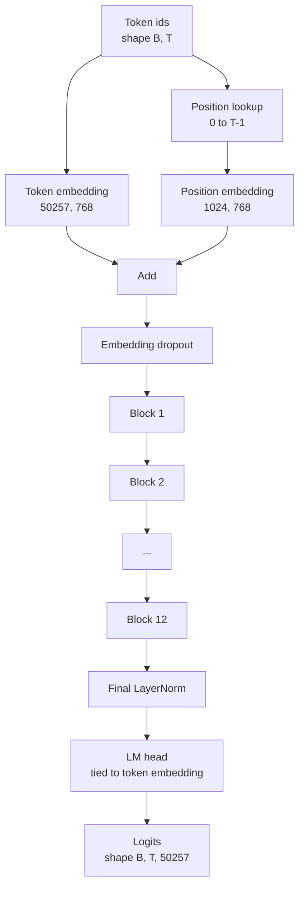
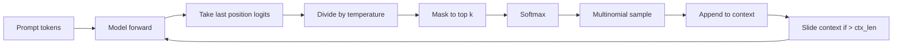

# GPT Model Lắp ráp

> Mười hai khối xếp chồng lên nhau, một token embedding, một vị trí đã học embedding, một LayerNorm cuối cùng và một ngôn ngữ model đầu trói. Đó là toàn bộ 124 triệu parameter GPT model. Bài học này tập hợp các mảnh đó thành một class làm việc, đếm parameters để xác nhận model khớp với hình dạng tham chiếu 124M và tạo văn bản với sampling, temperature và top-k đa thức.

**Loại:** Xây dựng
**Ngôn ngữ:** Python
**Kiến thức tiên quyết:** Giai đoạn 19 bài 30 đến 34
**Thời lượng:** ~90 phút

## Mục tiêu học tập

- Lắp ráp khối transformer từ bài 34 thành một GPT model đầy đủ: token embedding, embedding vị trí, N khối, LayerNorm cuối cùng, ngôn ngữ model đầu.
- Tái tạo 124 triệu parameter configuration: từ vựng 50257, ngữ cảnh 1024, embedding 768, mười hai đầu, mười hai lớp.
- Gắn trọng lượng ngôn ngữ model đầu với token embedding và giải thích lý do tại sao điều đó tiết kiệm ~38 triệu parameters ở thang đo này.
- Tạo văn bản từ một prompt với sampling đa thức, tỷ lệ temperature và cắt bớt top-k, giữ độ dài ngữ cảnh bằng cửa sổ trượt.
- Đo lường số lượng parameter và chi phí forward pass so với mục tiêu 124 triệu.

## Vấn đề

Một khối transformer tự nó không làm gì cả. Bạn cần biến id token thành vectors, trộn thông tin vị trí, chạy chúng qua stack và chiếu trở lại logits từ vựng. Quên bất kỳ bước nào trong bốn bước đó và model không tiến về phía trước, trôi dạt thông tin vị trí hoặc không thể nói.

Hình dạng của model cũng rất quan trọng. Tham chiếu GPT-2 nhỏ là 124 triệu parameters chính xác configuration trên. Những con số không phải là phép thuật. Vocab 50257 lần embedding 768 là bảng token. Vị trí 1024 nhân với 768 là bảng vị trí. Mười hai khối với khoảng 7 triệu parameters mỗi khối là 84 triệu. Đầu cuối cùng sử dụng lại bàn token bằng cách buộc trọng lượng. Tổng các mảnh và bạn hạ cánh trên 124 triệu. Xây dựng một model có số parameter không khớp với tham chiếu là dấu hiệu bạn đã kết nối sai điều gì đó.

## Khái niệm



Token id trở nên token vectors. Id vị trí trở thành vị trí vectors. Cả hai được thêm vào và gửi qua stack. LayerNorm cuối cùng là một mảnh bên ngoài các khối tồn tại sau mọi biến thể hiện đại. Đầu LM sử dụng lại ma trận token embedding, đó là ý nghĩa của việc buộc trọng lượng.

### Buộc trọng lượng

token embedding có hình dạng `(vocab, d_model)`. Ngôn ngữ model đầu cần chiếu từ `d_model` trở lại `vocab`. Đó là những chuyển vị của nhau. Ràng buộc cả hai có nghĩa đen là cùng một parameter tensor, được sử dụng hai lần. Tại từ vựng 50257 và d_model 768, ma trận là 38 triệu parameters. Cởi trói, bạn phải trả tiền cho nó hai lần. Ràng buộc, bạn trả tiền cho nó một lần và bạn cũng nhận được tín hiệu gradient sạch hơn một chút vì embedding và đầu cập nhật cùng nhau.

### Vị trí embedding được học, không phải hình sin

GPT-2 ships một vị trí đã học embedding. Bảng vị trí là một parameter tensor của hình dạng `(1024, 768)`. model tra cứu vị trí từ 0 đến T-1 ở mọi tiền đạo và thêm tra cứu vào token embedding. Đây là sơ đồ vị trí đơn giản nhất (RoPE, ALiBi, T5 tương đối bias là các lựa chọn thay thế) và đó là những gì tham chiếu 124M sử dụng.

### Thế hệ: temperature, top-k, đa thức

Thế hệ là tự hồi quy. Ở mỗi bước, model trả lại logits trên toàn bộ vốn từ vựng ở mọi vị trí. Bạn chỉ lấy vị trí cuối cùng, chia cho temperature, tùy chọn che tất cả ngoại trừ k trên cùng logits đến vô cực âm, softmax để có xác suất và lấy mẫu một token từ phân phối kết quả.



Ba núm, ba hành vi khác nhau. Temperature gần bằng không sụp đổ thành tham lam. Temperature loại phù hợp với sự phân bố tự nhiên của model. Top-k người tham lam. Top-k bốn mươi lọc đuôi dài. Sự kết hợp quan trọng; Bài học tiếp theo về training sử dụng thế hệ như một tín hiệu đánh giá định tính.

## Tự xây dựng

`code/main.py` thực hiện:

- `class GPTConfig` lớp dữ liệu với 124M mặc định: `vocab_size=50257`, `context_length=1024`, `d_model=768`, `num_heads=12`, `num_layers=12`, `mlp_expansion=4`, `dropout=0.1`, `use_bias=True`, `weight_tying=True`.
- `class GPTModel` với token embedding, vị trí embedding, embedding dropout, mười hai `TransformerBlock`, LayerNorm cuối cùng và một `lm_head` gắn với token embedding khi cờ được đặt.
- Một trình trợ giúp `count_parameters` trả về số lượng parameter duy nhất (vì vậy việc buộc trọng lượng được tôn trọng trong số đếm).
- Một hàm `generate` thực hiện ngữ cảnh cửa sổ trượt temperature, top-k, đa thức và trượt.
- Một bản demo xây dựng model, in số lượng parameter bên cạnh tham chiếu 124M và tạo một chuỗi ngắn từ một prompt cố định để hiển thị các pipeline từ đầu đến cuối.

Chạy nó:

```bash
python3 code/main.py
```

Đầu ra: parameter đếm cùng với tham chiếu 124M, được tạo id token từ một prompt ngẫu nhiên và xác nhận rằng đầu và token embedding LM chia sẻ bộ nhớ khi đang bật.

Để giữ cho bản demo nhanh chóng, script cũng chạy một config nhỏ (`d_model=64`, `num_layers=2`) từ đầu đến cuối và in chuỗi token được tạo nội tuyến. config 124M được chế tạo nhưng chỉ có số parameter và một forward pass được thực hiện.

## Stack

- `torch` cho toán học tensor, autograd và hệ thống ống nước mô-đun.
- `code/main.py` triển khai lại cùng một mẫu khối từ bài 34 cục bộ.

## Production mô hình trong tự nhiên

Ba mô hình tạo ra sự khác biệt giữa model chạy và model ships.

**Khởi tạo các phép chiếu dư nhỏ.** Phép chiếu đầu ra của attention và tuyến tính thứ hai của MLP đều đưa trực tiếp vào một cộng dư. Khởi tạo các dòng có cùng độ lệch chuẩn như mọi tuyến tính khác sẽ tạo ra một dòng dư phát triển theo độ sâu và đẩy LayerNorm cuối cùng vào chế độ nóng. Chia tỷ lệ std theo `1 / sqrt(2 * num_layers)` cho hai phép chiếu đó; dòng còn lại nằm trong phạm vi lành mạnh qua mười hai lớp.

**Lưu id vị trí vào bộ nhớ đệm tensor, không tính toán lại.** `torch.arange(T)` phân bổ bộ nhớ mới ở mỗi lần chuyển tiếp. Phân bổ một lần trong `__init__` cho ngữ cảnh tối đa, cắt các mục T đầu tiên cho mỗi lệnh gọi và bỏ qua chuyến đi khứ hồi của trình phân bổ.

**Hòa trọng lượng ở cấp độ parameter, không chỉ bằng cách sao chép.** Cài đặt `lm_head.weight = token_embedding.weight` chia sẻ tensor; sao chép thì không. optimizer cần cập nhật một parameter và biểu đồ autograd cần một tích lũy. Nếu bạn sao chép, cái đầu sẽ trôi ra khỏi embedding và việc buộc trọng lượng không giúp bạn mua được gì.

## Ứng dụng

- model class trong bài học này có hình dạng giống như bài học tiếp theo.
- Thay thế embedding vị trí đã học bằng RoPE giúp bạn có được gia đình LLaMA mà không cần chạm vào khối hoặc đầu.
- Thay thế GELU bằng SiLU và LayerNorm bằng RMSNorm giúp bạn rest thay đổi LLaMA gia đình.
- Chức năng tạo hoạt động với bất kỳ nguồn logits nào, không chỉ model này. Bạn có thể lấy logits từ tệp pretrained GPT-2 trong bài 37 và sử dụng lại cùng một vòng lặp thế hệ.

## Bài tập

1. Tháo đầu LM ra khỏi token embedding và đếm lại parameters. Xác minh delta là 50257 nhân với 768 = 38 triệu.
2. Thay thế vị trí đã học embedding bằng bảng hình sin được tính toán tại thời điểm xây dựng. Xác nhận model vẫn tiếp tục và số lượng parameter giảm 786.432.
3. Thêm cờ `greedy=True` vào thế hệ để bỏ qua sampling và chọn argmax. Xác nhận trình tự là xác định qua các lần chạy.
4. Thêm một núm `repetition_penalty` chia logit của bất kỳ token nào trong prompt hoặc lịch sử được tạo cho một hằng số trước softmax. Hiển thị trên một prompt cố định rằng các giá trị trên một làm giảm số lần lặp lại trong đầu ra.
5. Thêm `top_p` (nhân) sampling bên cạnh `top_k`. Kiểm tra hai dòng để đảm bảo rằng tổng xác suất của tokens được giữ vượt quá `top_p`.

## Thuật ngữ chính

| Thuật ngữ | Những gì mọi người nói | Ý nghĩa thực sự của nó |
|------|-----------------|------------------------|
| Buộc trọng lượng | "Buộc embeddings" | Đầu LM và token embedding có chung parameter tensor; Lưu thời gian từ vựng d_model parameters và khớp với tham chiếu GPT-2 |
| Vị trí embedding | "Vị trí đã học" | Một bảng hình dạng riêng biệt (độ dài ngữ cảnh, d_model) được thêm vào token vectors; học từ đầu đến cuối |
| Ngữ cảnh cửa sổ trượt | "Giới hạn ngữ cảnh" | Khi prompt cộng được tạo tokens vượt quá độ dài ngữ cảnh, hãy bỏ tokens cũ nhất để cửa sổ đang hoạt động vừa với |
| Top-k sampling | "Cắt bớt K" | Giữ K logits có giá trị cao nhất, che mặt rest đến vô cực âm softmax phần còn lại |
| Temperature | "Sampling temperature" | Chia logits cho T trước softmax; T nhỏ hơn 1 độ sắc, T bằng 1 giữ phân bố tự nhiên, T lớn hơn 1 làm phẳng |

## Đọc thêm

- Giai đoạn 19 bài 34 cho khối model stacks này.
- Giai đoạn 19 bài 36 cho vòng lặp training điều khiển model này với loss entropy chéo.
- Giai đoạn 19 bài 37 để tải trọng lượng pretrained GPT-2 vào kiến trúc chính xác này.
- Giai đoạn 7 bài 07 (GPT mô hình ngôn ngữ nhân quả) cho toán học của dự đoán token tiếp theo.
- Giai đoạn 10 bài 04 (trước training mini GPT) cho quy trình training ban đầu trên cùng một kiến trúc.
