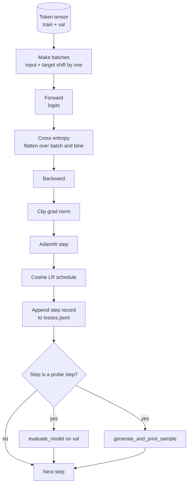

# Training Vòng lặp và đánh giá

> Một vòng lặp không đo lường là một vòng lặp nói dối. Bài học này xây dựng vòng lặp training thúc đẩy GPT model: AdamW với phân chia phân rã trọng lượng, khởi động cộng với lịch trình learning rate cosin, trợ giúp `calc_loss_batch`, chuyển dữ liệu `evaluate_model` giữ, thăm dò định tính `generate_and_print_sample` mỗi K bước và nhật ký JSONL tổn thất mà bạn có thể vẽ sau đó. Cùng một bộ xương huấn luyện mọi decoder LLM bạn từng xây dựng.

**Loại:** Xây dựng
**Ngôn ngữ:** Python
**Kiến thức tiên quyết:** Giai đoạn 19 bài 30 đến 35
**Thời lượng:** ~90 phút

## Mục tiêu học tập

- Xây dựng vòng lặp training tính toán loss entropy chéo với alignment đầu vào và mục tiêu chính xác cho dự đoán token tiếp theo.
- Cấu hình AdamW với sự phân rã trọng lượng được áp dụng cho trọng lượng tensors chứ không phải LayerNorm hoặc bias tensors.
- Thực hiện lịch trình learning rate với khởi động tuyến tính và phân rã cosin, đồng thời đọc LR kết quả theo thời gian.
- Đánh giá về sự phân chia được giữ lại với `evaluate_model` để loss đánh giá có thể so sánh giữa các lần chạy.
- Tạo một mẫu định tính mỗi K bước với `generate_and_print_sample` để bắt sự phân kỳ trước khi đường cong loss xảy ra.
- Kiên trì mỗi bước loss JSONL để bạn có thể tải lại, vẽ và ship nhật ký training dưới dạng sản phẩm.

## Vấn đề

Một training script in loss nhưng không làm gì khác sẽ thất bại theo ba cách. Nó không thể cho bạn biết liệu loss có giảm vì lý do chính đáng hay không (model có thể quá phù hợp với bộ training và không bao giờ học). Nó không thể cho bạn biết liệu sự phân kỳ đang bắt đầu hay không (loss có thể tăng đột biến trong một bước và phục hồi, hoặc một bước và sụp đổ). Nó không thể cho bạn biết model đã học được gì (loss là vô hướng; mẫu được tạo là một đoạn văn). Cả ba thất bại đều ẩn trừ khi vòng lặp đo lường.

Vòng lặp trong bài học này đo lường ba cách. Loss trên training batch từng bước. Loss trên một batch giữ mỗi K bước. Một phần tiếp tục được tạo từ một prompt cố định mỗi K bước. Khúc gỗ training hạ cánh ở JSONL vì vậy artifact là lời khai của vòng lặp.

## Khái niệm



Hai mảnh không rõ ràng là phân rã loss alignment và phân rã AdamW.

### Loss alignment

model dự đoán token tiếp theo ở mọi vị trí. Nếu batch đầu vào là tokens `[t0, t1, t2, t3]`, batch mục tiêu phải được `[t1, t2, t3, t4]`. Entropy chéo được tính toán trên hình dạng phẳng `(batch * seq, vocab)` so với `(batch * seq,)` mục tiêu phẳng. Quên đi sự thay đổi và bạn huấn luyện model để tự dự đoán, hội tụ về không loss trong khi không học được gì hữu ích.

### AdamW phân rã

Sự suy giảm cân nặng điều chỉnh cân nặng tensors nhưng không phải bình thường hóa thang đo hoặc thành kiến. Đặt phân rã trên thang đo LayerNorm từ từ đẩy thang đo về không và phá vỡ chuẩn hóa. Đặt sự phân rã trên một bias là vô hại về mặt toán học nhưng lãng phí chu kỳ. Sự phân chia tiêu chuẩn là: tensors hình ma trận (trọng lượng tuyến tính, embedding bảng) bị phân rã, bất cứ thứ gì trông giống như thang đo hoặc dịch chuyển thì không.

### Khởi động cộng với lịch trình cosine

Khởi động tăng learning rate từ số không đến mục tiêu trong vài trăm bước để trạng thái optimizer có thời gian để điền vào. Phân rã cosin làm giảm learning rate trở lại bằng không trong các bước còn lại, vì vậy pha cuối cùng tinh chỉnh trọng lượng ở kích thước bước nhỏ. Sự kết hợp này là lịch trình phổ biến nhất trong tạ mở LLM training vì nó loại bỏ hầu hết các khoảnh khắc giòn trong nghìn bước đầu tiên và nghìn bước cuối cùng.

### Đánh giá được tổ chức

`evaluate_model` chạy một số batches cố định từ phần tách xác thực, tích lũy loss, chia cho số batch và trả về. Không gradient. Không dropout. Con số này có thể tái tạo qua các lần chạy với cùng một hạt giống và cùng một phân chia. Báo cáo loss bị giữ bên cạnh training loss là cách bạn phát hiện ra overfitting.

### sampling định tính như một tín hiệu sớm

Một model có training loss giảm độc đáo nhưng các mẫu được tạo ra đều giống nhau token bị hỏng. Một model có đường cong loss trông phẳng nhưng có các mẫu được tạo ra sắc nét thành các từ mạch lạc là học tập. Đầu dò định tính chạy nhanh hơn so với đọc toàn bộ đường cong và bắt các chế độ vô hướng bỏ lỡ.

## Tự xây dựng

`code/main.py` thực hiện:

- `make_batches(token_ids, batch_size, context_length)` cắt một token tensor dài thành các cặp đầu vào và đích.
- `calc_loss_batch(model, inputs, targets)` chuyển tiếp, làm phẳng và trả lại entropy chéo vô hướng.
- `evaluate_model(model, val_loader, max_batches)` lặp lại một số lượng xác thực cố định batches không có grad và trả về giá trị trung bình loss.
- `generate_and_print_sample(model, prompt, max_new_tokens)` chạy chức năng tạo bài 35 trên một prompt cố định và in kết quả.
- `build_param_groups(model, weight_decay)` tạo ra danh sách AdamW parameter hai nhóm.
- `cosine_with_warmup(step, warmup_steps, total_steps, max_lr, min_lr)` trả về LR ở một bước nhất định.
- `train(...)` chạy vòng lặp, duy trì `outputs/losses.jsonl` và in loss đánh giá và mẫu sau mỗi `eval_every` bước.
- Một bản demo huấn luyện một model nhỏ trên dữ liệu tổng hợp cho một số bước nhỏ, viết nhật ký JSONL và in loss đánh giá và mẫu tại các điểm thăm dò. Bản demo chạy trong vòng chưa đầy một phút trên CPU.

Chạy nó:

```bash
python3 code/main.py
```

Đầu ra: mỗi bước loss dòng, đánh giá loss mọi bước đầu dò, một mẫu được tạo mỗi bước đầu dò và `outputs/losses.jsonl` cuối cùng bạn có thể tải với `json.loads` trên mỗi dòng.

## Stack

- `torch` cho autograd, optimizer và mô-đun.
- `main.py` triển khai lại bài 35 `GPTModel` và các mô-đun hỗ trợ cục bộ.

## Production mô hình trong tự nhiên

Ba mẫu biến vòng lặp sách giáo khoa thành thứ bạn có thể để chạy qua đêm.

**Gradient cắt tiêu chuẩn là không thể thương lượng.** Một batch xấu (dữ liệu bất thường, tăng đột biến LR, trường hợp cạnh số) tạo ra một gradient khổng lồ xóa sạch hàng giờ training. `torch.nn.utils.clip_grad_norm_(params, max_norm=1.0)` sau `backward` và trước khi `step` giữ optimizer trong phạm vi an toàn. Giá trị cắt là một parameter miễn phí; Một là mặc định tồn tại trong hầu hết các thiết lập.

**Có thể tiếp tục JSONL ghi nhật ký, không phải trạng thái ngâm.** Mỗi bước loss bản ghi dưới dạng `{"step": int, "train_loss": float, "lr": float}` dòng trong JSONL đều bền: bất kỳ sự cố nào cũng để lại artifact có thể đọc được, bạn có thể grep, bạn có thể vẽ với ba mươi dòng Python và bạn có thể tiếp tục training bằng cách đọc bước cuối cùng. Trạng thái ngâm ràng buộc bạn với bố cục mô-đun chính xác đã tạo ra tệp, điều này rất dễ vỡ giữa các tái cấu trúc.

**Eval batches rút ra từ một lát cố định.** Xác thực tokens được cắt thành batches khi bắt đầu script chứ không phải nhanh chóng. Khả năng tái tạo phụ thuộc vào batches đánh giá giống hệt nhau từ lần chạy này sang lần chạy khác; Mặt khác, so sánh loss đánh giá giữa hai lần chạy sẽ đo lường batch xáo trộn nhiều như model.

## Ứng dụng

- Vòng lặp trong bài học này là cùng một bộ xương huấn luyện 124M model trên dữ liệu thực. Hoán đổi token tensor tổng hợp cho bộ nạp kiểu `datasets` và vòng lặp chạy không thay đổi.
- Nhật ký JSONL là sản phẩm chuyển giao biến một training thành bằng chứng. Bài học tiếp theo sử dụng một để so sánh một checkpoint mới được huấn luyện với một pretrained học.
- Đầu dò mẫu định tính là tổng hợp tất cả mà loss vô hướng không thể thay thế.

## Bài tập

1. Thêm các thử nghiệm đơn vị `weight_decay_groups()` xác nhận tỷ lệ và bias parameters nằm trong nhóm không phân rã và trọng lượng tuyến tính và embedding nằm trong nhóm phân rã.
2. Thay thế tokens ngẫu nhiên tổng hợp bằng byte từ một tệp văn bản nhỏ để bản demo huấn luyện một cái gì đó dễ đọc. Xác minh mẫu được tạo sử dụng các ký tự có trong tệp.
3. Thêm tầng `min_lr` 10% `max_lr` vào lịch trình cosine và vẽ lại.
4. Lưu một checkpoint sau mỗi `eval_every` bước ngoài nhật ký JSONL. Thêm cờ `resume_from` tải lại trạng thái model và trạng thái optimizer.
5. Ghi nhật ký thông lượng mỗi bước (tokens mỗi giây) bên cạnh loss và xác nhận rằng nó vẫn ở trong một dải ổn định.

## Thuật ngữ chính

| Thuật ngữ | Những gì mọi người nói | Ý nghĩa thực sự của nó |
|------|-----------------|------------------------|
| Loss alignment | "Ca một" | Đầu vào tokens ở vị trí 0..T-1, tokens mục tiêu tại vị trí 1..T; entropy chéo được tính toán trên các hình dạng phẳng |
| Phân rã | "Hai nhóm" | AdamW nhận được tensors hình ma trận với trọng lượng phân rã và quy mô hoặc bias tensors không có |
| Khởi động | "Đường dốc" | learning rate leo từ số không đến mục tiêu của nó qua một số bước cố định để trạng thái optimizer có thể điền vào |
| Đánh giá batches | "Giữ batches" | Một lát cắt cố định của token tensor xác thực, được cắt một lần khi bắt đầu, được sử dụng giống hệt nhau script mọi đầu dò |
| Đầu dò định tính | "Bản in mẫu" | Một thế hệ ngắn từ một prompt cố định được in mỗi K bước để nắm bắt các chế độ lỗi loss ẩn một mình |

## Đọc thêm

- Giai đoạn 19 bài 35 để model các ổ đĩa vòng lặp.
- Giai đoạn 19 bài 37 để tải pretrained quả cân vào cùng một model.
- Giai đoạn 10 bài 04 (trước training mini GPT) cho quy trình trên dữ liệu thực.
- Giai đoạn 10 bài 10 (đánh giá) cho bề mặt đánh giá rộng hơn ngoài loss entropy chéo.
