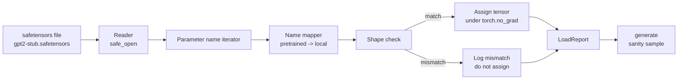

# Tải trọng lượng Pretrained

> Training 124 triệu parameter model từ đầu là một quyết định ngân sách; tải một checkpoint đã xuất bản là thứ Ba. Bài học này tải trọng lượng kiểu pretrained GPT-2 từ tệp safetensors vào kiến trúc chính xác từ bài 35, lập bản đồ tên parameter từng mảnh và sự tỉnh táo tạo ra một phần tiếp tục để chứng minh tải đã hoạt động. Không có mạng, không có trình tải của bên thứ ba, không có phép thuật mờ đục.

**Loại:** Xây dựng
**Ngôn ngữ:** Python
**Kiến thức tiên quyết:** Giai đoạn 19 bài học 30 đến 36
**Thời lượng:** ~90 phút

## Mục tiêu học tập

- Đọc tệp safetensors với thư viện `safetensors` Python và kiểm tra tên và hình dạng tensor.
- Ánh xạ mỗi tên pretrained parameter vào một parameter bên trong bài 35 GPT model.
- Xử lý hai quy ước tên khác nhau giữa trọng số GPT-2 đã phát hành và model trong kênh này: `wte/wpe/h.N.attn.c_attn/c_proj` và `mlp.c_fc/c_proj` so với `tok_embed/pos_embed/blocks.N.attn.qkv/out_proj` và `mlp.fc1/fc2` được đặt tên cục bộ.
- Phát hiện và từ chối sự không khớp hình dạng với lỗi rõ ràng trước khi bất kỳ việc gán trọng lượng nào xảy ra.
- Tạo một sự tiếp tục ngắn với các trọng số được tải và xác nhận tokens đến từ phân phối được tải, không phải phân phối được khởi tạo ngẫu nhiên.

## Vấn đề

Trọng số đã phát hành không được đóng gói cho kiến trúc của bạn. Chúng mang tên triển khai ban đầu được sử dụng. Tệp pretrained có `transformer.h.0.attn.c_attn.weight` hình dạng `(2304, 768)`; model của bạn mong đợi `blocks.0.attn.qkv.weight` hình dạng `(2304, 768)` (là cùng một ma trận trong một quy ước bố cục khác) hoặc model của bạn sử dụng `nn.Linear` lưu trữ ma trận được chuyển vị. Cùng một parameter hiển thị với ba danh tính khác nhau một cách tinh tế (tên, hình dạng, bố cục byte) và trình tải phải dung hòa cả ba.

Một trình tải sao chép một cách mù quáng đặt đúng tensor vào sai vị trí và bạn sẽ nhận được một model tạo ra những điều vô nghĩa. Một trình tải từ chối sao chép khi hình dạng khác nhau nhưng không ghi lại gì khiến bạn đoán tensor nào không hạ cánh. Trình tải trong bài học này rất rõ ràng: mọi bài tập được ghi lại, mọi hình dạng được kiểm tra và một `LoadReport` tóm tắt các lần truy cập, bỏ lỡ và hình dạng không khớp để bạn có thể đọc những gì đã xảy ra.

## Khái niệm



Trình ánh xạ tên chỉ là một hàm từ chuỗi này sang chuỗi khác. Kiểm tra hình dạng là một nếu. Việc phân công diễn ra bên trong `torch.no_grad()` nên autograd không theo dõi tải. Báo cáo chứa kết quả của mọi tên.

### Quy ước đặt tên GPT-2

Trọng lượng GPT-2 được công bố dưới những cái tên như:

| Tên Pretrained | Hình dạng | Ý nghĩa |
|-----------------|-------|---------|
| `wte.weight` | (50257, 768) | Token embedding |
| `wpe.weight` | (1024, 768) | Vị trí embedding |
| `h.N.ln_1.weight` | (768,) | LayerNorm 1 thang đo tại khối N |
| `h.N.ln_1.bias` | (768,) | LayerNorm 1 ca tại block N |
| `h.N.attn.c_attn.weight` | (768, 2304) | Trọng lượng tuyến tính QKV hợp nhất |
| `h.N.attn.c_attn.bias` | (2304,) | bias tuyến tính QKV hợp nhất |
| `h.N.attn.c_proj.weight` | (768, 768) | Attention chiếu đầu ra |
| `h.N.attn.c_proj.bias` | (768,) | bias chiếu đầu ra Attention |
| `h.N.ln_2.weight` | (768,) | LayerNorm 2 thang đo |
| `h.N.ln_2.bias` | (768,) | LayerNorm 2 ca |
| `h.N.mlp.c_fc.weight` | (768, 3072) | Trọng lượng MLP fc1 |
| `h.N.mlp.c_fc.bias` | (3072,) | MLP fc1 bias |
| `h.N.mlp.c_proj.weight` | (3072, 768) | Trọng lượng MLP fc2 |
| `h.N.mlp.c_proj.bias` | (768,) | MLP fc2 bias |
| `ln_f.weight` | (768,) | Thang đo LayerNorm cuối cùng |
| `ln_f.bias` | (768,) | Ca LayerNorm cuối cùng |

Hai bất ngờ để lên kế hoạch. Các tuyến tính `c_attn`, `c_proj` `c_fc` được lưu trữ với ma trận được chuyển vị so với những gì `nn.Linear.weight` mong đợi. Bộ tải chuyển vị trong quá trình phân công. Đầu LM hoàn toàn không có trong tệp; model dựa vào trọng lượng buộc với `wte`, vì vậy đầu được đặt bằng răng cưa khi `wte` hạ cánh.

### Quy ước đặt tên địa phương

model trong bài hát này sử dụng tên mô tả:

| Tên địa phương | Ý nghĩa |
|------------|---------|
| `tok_embed.weight` | Token embedding |
| `pos_embed.weight` | Vị trí embedding |
| `blocks.N.ln1.scale` | LayerNorm 1 thang đo tại khối N |
| `blocks.N.ln1.shift` | LayerNorm 1 ca |
| `blocks.N.attn.qkv.weight` | QKV hợp nhất |
| `blocks.N.attn.qkv.bias` | bias QKV hợp nhất |
| `blocks.N.attn.out_proj.weight` | Attention chiếu đầu ra |
| `blocks.N.attn.out_proj.bias` | bias chiếu đầu ra |
| `blocks.N.ln2.scale` | LayerNorm 2 thang đo |
| `blocks.N.ln2.shift` | LayerNorm 2 ca |
| `blocks.N.mlp.fc1.weight` | MLP fc1 |
| `blocks.N.mlp.fc1.bias` | MLP fc1 bias |
| `blocks.N.mlp.fc2.weight` | MLP fc2 |
| `blocks.N.mlp.fc2.bias` | MLP fc2 bias |
| `final_ln.scale` | Thang đo LayerNorm cuối cùng |
| `final_ln.shift` | Ca LayerNorm cuối cùng |

Ánh xạ là một chức năng cố định. Bài học ships nó như một câu lệnh mà trình tải lặp lại.

### Vật cố định sơ khai

Trọng lượng GPT-2 thực là 0,5 GB. Bản demo không tải xuống chúng; Nó tạo ra một thiết bị cố định an toàn nhỏ ở lần chạy đầu tiên, với quy ước đặt tên chính xác GPT-2 và hình dạng phù hợp với model 12 khối ở d_model 192 thay vì 768. Thiết bị cố định có cấu trúc phù hợp để thực hiện mọi đường dẫn mã trong bộ tải. Hoán đổi thiết bị cố định cho tệp thực và trình tải hoạt động mà không cần sửa đổi.

## Tự xây dựng

`code/main.py` thực hiện:

- Một bản sao nhỏ của bài học 35 `GPTModel` vì vậy bài học này là khép kín.
- `make_pretrained_to_local(num_layers)` mở rộng các mục nhập trên mỗi lớp.
- `load_safetensors(model, path)` lặp lại tên, ánh xạ chúng, kiểm tra hình dạng, chuyển vị trọng số kiểu conv1d và gán dưới `torch.no_grad()`. Trả về một `LoadReport`.
- `make_stub_safetensors(path, cfg)` tạo ra một tệp cố định với quy ước đặt tên pretrained chính xác.
- Một bản demo tạo ra `outputs/gpt2-stub.safetensors` trong lần chạy đầu tiên, xây dựng một model mới, nắm bắt một phần tiếp theo được tạo từ khởi tạo ngẫu nhiên, tải sơ khai, chụp một phần tiếp theo khác, in cả hai và xác minh cả hai là khác nhau (tải thực sự đã thay đổi model).

Chạy nó:

```bash
python3 code/main.py
```

Đầu ra: đường dẫn cố định, nhật ký tải theo từng tên, tóm tắt `LoadReport`, tiếp tục trước tải, tiếp tục sau tải và hình dạng không khớp trên một tensor cố ý xấu được đưa vào thiết bị cố định để đường dẫn hỏng được thực hiện.

## Stack

- `safetensors` cho định dạng trên đĩa và đầu đọc streaming.
- `torch` cho model và toán bài tập.
- Không `transformers`, không `huggingface_hub`, không có cuộc gọi mạng.

## Production mô hình trong tự nhiên

Ba mẫu làm cho máy xúc lật tồn tại khi tiếp xúc với trọng lượng mà bạn không tạo ra.

**Luôn xác thực tệp trước bất kỳ nhiệm vụ nào.** Mở tệp, liệt kê mọi tên tensor với dtype và hình dạng của nó, chạy ánh xạ đầy đủ với kiểm tra hình dạng và chỉ khi thành công mới bắt đầu gán. Máy models nửa tải là những cỗ máy hỏng hóc im lặng.

**Ghi nhật ký mọi bài tập với tên nguồn và tên đích.** Khi có điều gì đó không ổn, nhật ký sẽ cho bạn biết tensor nào đã hạ cánh ở đâu; Giải pháp thay thế là đọc hexdumps. Lớp dữ liệu `LoadReport` trong bài học này theo dõi danh sách `loaded`, `missing`, `unexpected` và `shape_mismatch` và in tóm tắt ở cuối.

**Đầu LM là bí danh buộc trọng lượng, không phải là một bản sao riêng biệt.** Cài đặt `model.lm_head.weight = model.tok_embed.weight` sau khi tải `tok_embed` là mẫu chuẩn. Sao chép ma trận embedding thành một `lm_head.weight` parameter mới sẽ phá vỡ sự ràng buộc và lặng lẽ tăng gấp đôi số parameter của bạn.

## Ứng dụng

- Trình tải hoạt động cho bất kỳ tệp safetensors nào sử dụng quy ước đặt tên pretrained. Các tệp GPT-2 thực (nhỏ / trung bình / lớn / xl) hoạt động mà không cần thay đổi mã; chỉ có model config khác nhau.
- Mẫu tương tự mở rộng đến trọng số LLaMA, Mistral Qwen sau khi bạn cập nhật bản đồ tên. Kiểm tra hình dạng và báo cáo vẫn giống hệt nhau.
- Tạo ra sự tỉnh táo sau khi tải là một cổng nhanh: nếu các mẫu sau tải trông giống như các mẫu tải trước, tải không thay đổi model, có nghĩa là ánh xạ âm thầm bỏ lỡ mỗi tensor.

## Bài tập

1. Thêm đối số `dtype` vào trình tải để truyền từng tensor đến một dtype mục tiêu (`bfloat16`, `float16`, `float32`) trong quá trình gán. Xác nhận một `float32` model có thể bị hạ xuống `bfloat16` và vẫn tạo.
2. Thêm đối số `expected_layers` từ chối tải checkpoint có chỉ mục `h.N` không khớp với `num_layers` của model.
3. Cắm bộ nạp vào chức năng tạo bài 35 và tạo ra hai mẫu cạnh nhau: một từ khởi tạo ngẫu nhiên, một từ thiết bị cố định được tải.
4. Thêm đường dẫn xuất: ghi trạng thái model hiện tại vào tệp safetensors mới bằng quy ước đặt tên pretrained. Khứ hồi bộ nạp và xác nhận báo cáo không có hình dạng không khớp.
5. Mở rộng `NAME_MAP` để xử lý quy ước đặt tên LLaMA (không thiên vị, RMSNorm, bố cục qkv hợp nhất) và chạy lại trình tải trên sơ khai LLaMA cố định mà bạn tạo.

## Thuật ngữ chính

| Thuật ngữ | Những gì mọi người nói | Ý nghĩa thực sự của nó |
|------|-----------------|------------------------|
| Bản đồ tên | "Ánh xạ lại khóa" | Chức năng từ tên pretrained tensor đến tên parameter địa phương; thường là một dict theo nghĩa đen với một mục nhập cho mỗi lớp chỉ mục được mở rộng qua một vòng lặp |
| Hình dạng không phù hợp | "Hình dạng xấu" | pretrained tensor tồn tại dưới tên được ánh xạ nhưng kích thước của nó không phù hợp với parameter địa phương; trình tải từ chối chỉ định và ghi nhật ký cặp |
| Chuyển vị khi tải | "Bố cục Conv1d" | Xuất bản GPT-2 lưu trữ attention và các dự đoán MLP trong chuyển vị của những gì nn. Kỳ vọng tuyến tính; Bộ tải chuyển vị trong quá trình chỉ định |
| Bí danh ràng buộc trọng lượng | "Đầu LM dùng chung" | Cài đặt model.lm_head.weight = model.tok_embed.weight để đầu và embedding chia sẻ dung lượng lưu trữ; đầu không có trong tệp vì điều này |
| Tải báo cáo | "Tóm tắt phạm vi bảo hiểm" | Một lớp dữ liệu nhỏ theo dõi các danh sách đã tải, thiếu, không mong muốn và shape_mismatch; in đó là cách bạn biết liệu tải có thành công hay không |

## Đọc thêm

- Giai đoạn 19 bài 35 cho kiến trúc nhận trọng số.
- Giai đoạn 19 bài 36 cho vòng lặp training tạo ra một checkpoint có cùng hình dạng.
- Giai đoạn 10 bài 11 (quantization) để biết phải làm gì với trọng số được tải khi bộ nhớ bị chật hẹp.
- Giai đoạn 10 bài 13 (xây dựng một LLM pipeline hoàn chỉnh) cho toàn bộ vòng đời xung quanh tải và inference.
