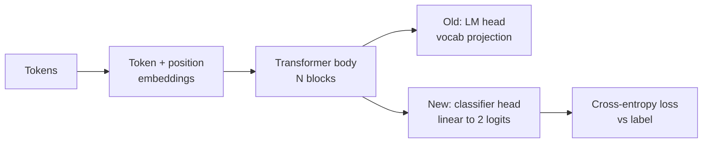
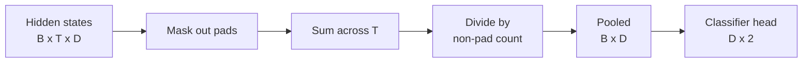
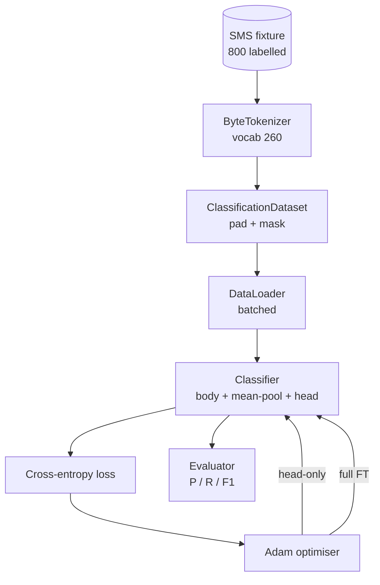

# Bài học Capstone 38: Bộ phân loại Fine-Tuning bằng cách hoán đổi đầu

> Viên đá đầu tiên của Track B. Một model ngôn ngữ pretrained là một stack các khối self-attention kết thúc bằng đầu dự đoán token. Khi bạn muốn spam vs giăm bông, cái đầu là sai nhưng cơ thể hầu như đúng. Bài học này xé đầu, dán một lớp tuyến tính hai class lên biểu diễn gộp và huấn luyện bộ phân loại theo hai cách khác nhau: chỉ lớp cuối cùng và fine-tuning đầy đủ. Đánh giá là precision, recall và F1 trên một sự phân tách được giữ lại. Bạn tìm hiểu những gì mỗi chiến lược mua cho bạn và chi phí của nó.

**Loại:** Xây dựng
**Ngôn ngữ:** Python (torch, numpy)
**Kiến thức tiên quyết:** Giai đoạn 19 bài 30-37 (NLP LLM bài học: tokenizer, bảng embedding, khối attention, thân transformer, vòng lặp trước training, điểm kiểm tra, thế hệ, perplexity)
**Thời lượng:** ~90 phút

## Mục tiêu học tập

- Thay thế đầu model ngôn ngữ bằng đầu phân loại mà không khởi tạo lại nội dung.
- Thực hiện hai chế độ training: cơ thể đông lạnh (chỉ đầu) và toàn fine-tuning, chia sẻ một vòng lặp training.
- Xây dựng một pipeline dữ liệu nhận biết tokeniser mà các đệm, mặt nạ đệm và nhóm attention đầu ra.
- Tính toán precision, recall F1 và ma trận nhầm lẫn từ các logits thô.
- Lý do về sự đánh đổi giữa số lượng parameter, thời gian training và khoảng trống.

## Vấn đề

Bạn đã huấn luyện trước một transformer nhỏ trên một kho dữ liệu chung. Đầu ra chiếu trạng thái ẩn cuối cùng thành từ vựng 1000 token. Bây giờ bạn có 800 tin nhắn SMS được gắn nhãn spam hoặc ham và bạn muốn có một bộ phân loại nhị phân. Có ba lựa chọn.

Tùy chọn sai là huấn luyện một bộ phân loại mới từ đầu trên 800 ví dụ. Phần thân của pretrained model đã mã hóa cấu trúc hữu ích: nhận dạng từ, vị trí, sự xuất hiện đơn giản. Vứt bỏ nó sẽ lãng phí tính toán đã xây dựng nó.

Hai tùy chọn phù hợp là hoán đổi đầu với cơ thể bị đóng băng và hoán đổi đầu với cơ thể có thể huấn luyện được. training chỉ có đầu nhanh, gần như trống trong bộ nhớ và hiếm khi quá phù hợp với dữ liệu ít ỏi này. fine-tuning đầy đủ chậm hơn, có thể quá phù hợp với dữ liệu nhỏ, nhưng đạt accuracy cao hơn khi miền xuôi dòng trôi dạt khỏi kho dữ liệu pretraining.

Bài học này xây dựng cả hai, vì vậy bạn có thể so sánh chúng trên cùng một vật cố định.

## Khái niệm

model là một chức năng `f_theta(tokens) -> hidden_states`. Đầu là một chức năng `g_phi(hidden) -> logits`. Hoán đổi đầu có nghĩa là giữ `theta` và thay thế `g_phi`. parameters của cơ thể là phần đắt tiền. Đầu là một lớp tuyến tính duy nhất.

Hai bộ parameter có thể huấn luyện rất quan trọng:

- `theta` (cơ thể): hàng chục nghìn trọng lượng trên attention khối.
- `phi` (đầu): `hidden_dim * num_classes` quả tạ cộng với một bias.

Trong training chỉ đầu, bạn tính toán gradients so với `phi` và không so với `theta`. PyTorch cho phép bạn làm điều này bằng cách đặt `requires_grad=False` trên cơ thể parameters. Sau đó, người tối ưu hóa chỉ nhìn thấy đầu và cơ thể vẫn đóng băng.

Trong fine-tuning đầy đủ, bạn để gradients chảy ngược qua toàn bộ stack. Trọng lượng của cơ thể trôi dạt để phù hợp với mục tiêu phân loại. Rủi ro là thảm khốc khi quên dữ liệu nhỏ: pretraining của cơ thể bị nhiễu overfitting trôi đi.

## Câu hỏi gộp chung

Một bộ phân loại cần một vector cho mỗi trình tự, không phải một vector mỗi token. Ba lựa chọn phổ biến:

- **Nhóm trung bình**: tính trung bình các trạng thái ẩn trong chuỗi, được tính trọng số bởi mặt nạ attention.
- **Nhóm CLS**: thêm vào trước một token đặc biệt và chỉ sử dụng đầu ra của nó. Đây là những gì BERT làm.
- **Nhóm token cuối cùng**: sử dụng token không đệm cuối cùng. Đây là những gì GPT-class bộ phân loại làm.

Bài học này sử dụng gộp trung bình với trọng số mặt nạ attention rõ ràng. Nó là đơn giản nhất, cho tín hiệu ổn định trên các độ dài trình tự và không yêu cầu pretraining token CLS.

## Dữ liệu

Tám trăm tin nhắn SMS, cân bằng 400 thư rác và 400 ham, được tạo ra một cách xác định trong `code/main.py`. Trình tạo sử dụng một hạt giống cố định, chọn các mẫu và thay thế các chất độn khe cắm, đồng thời phát ra thông điệp dài từ 5 đến 25 tokens. Real datasets có nhiễu mà trận đấu này không có. Điểm của vật cố định là khả năng tái tạo.

Dữ liệu chia 80/20: 640 tàu, 160 thử nghiệm. Phân tách được phân tầng để bộ kiểm tra giữ cân bằng 50/50. Một tập hợp được giữ lại với số dư đã biết cho phép precision và recall được đọc như những con số trung thực.

## Các chỉ số

Phân loại nhị phân với class 1 là class dương tính (spam). Số lượng là:

- `TP`: spam dự đoán, là spam.
- `FP`: thư rác dự đoán, là giăm bông.
- `FN`: giăm bông dự đoán, là thư rác.
- `TN`: giăm bông dự đoán, là giăm bông.

Ba chỉ số tiêu đề:

- `precision = TP / (TP + FP)`. Trong số các tin nhắn bị gắn cờ spam, thực sự là bao nhiêu?
- `recall = TP / (TP + FN)`. Trong số thư rác thực tế, model đã gắn cờ phần nào?
- `F1 = 2 * P * R / (P + R)`. Ý nghĩa hài hòa của cả hai.

Ma trận nhầm lẫn in bốn số đếm dưới dạng lưới 2x2. Bản demo viết điều này cho cả hai chế độ training.

## Kiến trúc

Cơ thể là một transformer nhỏ có chủ ý: từ vựng 260, ẩn 64, 4 đầu, 2 khối, dãy tối đa 32. Nó đủ nhỏ để huấn luyện cả hai chế độ hội tụ trong vòng chín mươi giây trên CPU. Nó không pretrained trong bài học; thay vào đó, người trợ giúp `pretrain_quick` thực hiện năm epochs LM training trên cùng một văn bản của vật cố định để cung cấp cho phần thân một điểm khởi đầu không tầm thường. Điều này giữ cho bài học khép kín.

## Những gì bạn sẽ xây dựng

Việc triển khai là một `main.py` cộng với một mô-đun thử nghiệm (`code/tests/test_main.py`).

1. `ByteTokenizer`: ánh xạ byte với ID, dự trữ ID pad.
2. `Block`: một khối transformer với multi-head attention và một lớp chuyển tiếp. Chuẩn trước.
3. `LMBody`: token + vị trí embeddings cộng với một stack khối. Trả về trạng thái ẩn.
4. `MeanPool`: trung bình có trọng số mặt nạ trên trục trình tự.
5. `Classifier`: thân, hồ bơi, đầu tuyến tính. Cơ thể là cùng một trường hợp giữa các chế độ.
6. `freeze_body` và `unfreeze_body`: chuyển đổi `requires_grad` trên parameters cơ thể.
7. `train_classifier`: Một vòng lặp được chia sẻ. Chấp nhận model và trình tối ưu hóa được định cấu hình cho bất kỳ nhóm parameter nào có thể huấn luyện được.
8. `evaluate`: chạy tập kiểm tra và trả về `Metrics(precision, recall, f1, confusion)`.
9. `run_demo`: huấn luyện trước cơ thể trong thời gian ngắn, sau đó huấn luyện và đánh giá chỉ đầu, sau đó đầy đủ, in cả hai báo cáo và thoát khỏi con số không.

## Tại sao sự so sánh lại quan trọng

Chế độ chỉ tập đầu thường tập nhanh hơn và trang phục duyên dáng hơn. Trong trận đấu này, bạn thường thấy precision gần 0,9 và recall gần 0,85 sau hai mươi epochs chỉ training đầu. fine-tuning đầy đủ mất khoảng ba lần lâu hơn và hạ cánh trong một vài điểm theo cách nào, tùy thuộc vào hạt giống ngẫu nhiên.

Bài học không chọn ra người chiến thắng. Nó dạy bạn đọc các con số và chi phí. Trên 800 ví dụ và một cơ thể nhỏ, chỉ đầu là lựa chọn phù hợp. Trên 80.000 ví dụ và thân máy lớn hơn, fine-tuning đầy đủ bắt đầu được đền đáp. Hợp đồng bạn rút ra từ bài học này là API: cùng một hàm `train_classifier` xử lý cả hai và nút chuyển đổi là một cuộc gọi.

## Mục tiêu kéo dài

- Thêm chế độ thứ ba chỉ giải phóng khối cuối cùng. Điều này đôi khi được gọi là fine-tuning một phần. Nó có chi phí thấp hơn FT đầy đủ và học được nhiều hơn so với chỉ đầu.
- Thêm bộ lập lịch tốc độ học tập. Lịch trình cosin trên đầu cộng với tốc độ không đổi nhỏ hơn trên cơ thể là một thiết lập production phổ biến.
- Thay thế gộp trung bình bằng một nhóm attention đã học: một lớp attention nhỏ với một truy vấn đã học. Điều này thường đánh bại nhóm trung bình trên các chuỗi dài hơn.

Việc triển khai cung cấp cho bạn hooks. Các bài kiểm tra ghim hợp đồng. Những con số là của bạn để đẩy.
