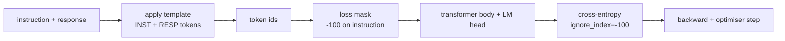
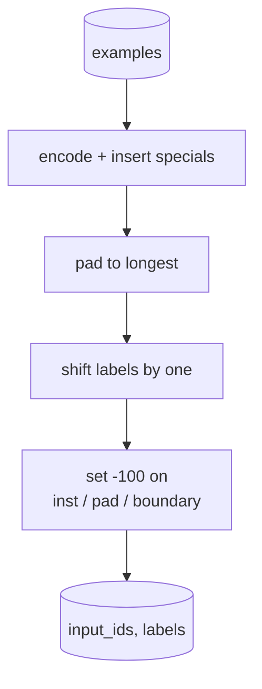
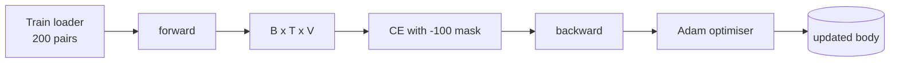

# Bài học Capstone 39: Hướng dẫn điều chỉnh bằng Fine-Tuning giám sát

> Một model cơ sở pretrained có thể kéo dài một trình tự nhưng không thể làm theo hướng dẫn. fine-tuning có giám sát là thay đổi nhỏ nhất khắc phục điều này: cung cấp cho model ví dụ ghép đôi về hướng dẫn và phản hồi mong muốn, đồng thời huấn luyện cơ thể dự đoán phản ứng tokens. Bí quyết là bạn chỉ muốn loss đếm phản hồi chứ không phải hướng dẫn. Bài học này xây dựng một vòng lặp SFT kiểu Alpaca với chức năng đối chiếu tùy chỉnh che các tokens lệnh bằng `ignore_index=-100`, huấn luyện trên 200 cặp lệnh-phản hồi và đánh giá trên một phân tách được giữ bằng cách sử dụng đối sánh chính xác.

**Loại:** Xây dựng
**Ngôn ngữ:** Python (torch, numpy)
**Kiến thức tiên quyết:** Giai đoạn 19 bài 30-37 (NLP LLM bài học: tokenizer, bảng embedding, khối attention, thân transformer, vòng lặp trước training, điểm kiểm tra, thế hệ, perplexity)
**Thời lượng:** ~90 phút

## Mục tiêu học tập

- Định dạng dữ liệu phản hồi lệnh được ghép nối thành một chuỗi nhân quả duy nhất với tokens ranh giới rõ ràng.
- Xây dựng một hàm đối chiếu che đi các tokens lệnh để entropy chéo chỉ tính tokens phản hồi.
- Huấn luyện một cơ thể transformer nhỏ bé dưới mục tiêu SFT và xem số liệu đánh giá di chuyển.
- Triển khai thế hệ tham lam và lấy mẫu temperature tôn trọng ranh giới bắt đầu phản hồi.
- Tính toán đối sánh chính xác trên các lần hoàn thành được tạo.

## Vấn đề

Một model cơ sở được huấn luyện về dự đoán token tiếp theo không biết hướng dẫn là gì. Cho nó xem chuỗi `"What is the capital of France?"` và nó sẽ tiếp tục câu hỏi hoặc phát minh ra một câu mới. model có ngôn ngữ nhưng không có hợp đồng định dạng.

Hợp đồng SFT là một mẫu chuỗi. Mỗi training ví dụ trở thành một chuỗi duy nhất với ba vùng:

```text
<INST> What is the capital of France? <RESP> The capital of France is Paris.
```

Các tokens ranh giới đặc biệt tokens dành riêng tại thời điểm training. Người model học được rằng mọi thứ sau `<RESP>` là phản ứng và phản ứng là những gì được chấm điểm. Mục tiêu token tiếp theo của model cơ sở vẫn được áp dụng; Nó chỉ được huấn luyện trên một kho dữ liệu mà mọi ví dụ đều có hình dạng này.

Nhưng có một cái bẫy. Nếu bạn cung cấp toàn bộ chuỗi cho một loss entropy chéo vani, bạn training model dự đoán lệnh tokens. Hướng dẫn được đưa ra. Bạn không muốn gradient trên các vị trí đó. Cách khắc phục là mặt nạ.

## Khái niệm



`ignore_index` là một feature của `torch.nn.functional.cross_entropy`. Bất kỳ vị trí mục tiêu nào bằng `ignore_index` đều đóng góp loss bằng không và gradient bằng không. Quy ước ở PyTorch là `-100`. Hàm đối chiếu xây dựng hai tensors cho mỗi ví dụ: `input_ids` (chuỗi đầy đủ) và `labels` (một bản sao của `input_ids` với các vị trí lệnh được ghi đè bởi `-100`).

model nhìn thấy toàn bộ trình tự trong forward pass; attention có thể tham gia vào hướng dẫn. loss chỉ tính tokens phản hồi. Đây chính xác là những gì bạn muốn: điều kiện về hướng dẫn, dự đoán phản hồi.

## Dữ liệu

Hai trăm cặp lệnh-phản hồi được tạo ra một cách xác định trong `main.py`. Chúng bao gồm sáu loại nhiệm vụ:

- ảnh chụp một lần thực tế (viết hoa của X)
- số học
- Trích xuất danh sách
- Tóm tắt một câu
- mã (in, sắp xếp)
- Định nghĩa

Mỗi nhiệm vụ có một hướng dẫn theo mẫu và một phản hồi xác định. Điều này là đơn giản có chủ ý. Đối sánh chính xác rất giòn và bài học sử dụng một cố định trong đó câu trả lời đúng là một chuỗi cụ thể. SFT thực datasets cần các chỉ số mờ; Nguyên tắc giống hệt nhau.

Phân chia là 160 tàu, 40 bài kiểm tra. Bộ kiểm tra bao gồm tất cả sáu loại nhiệm vụ để có thể báo cáo đối sánh chính xác cho mỗi danh mục.

## Mã hóa và đệm

Tokeniser ở cấp độ byte với ba đặc biệt dành riêng:

- `INST_ID = 256`: đánh dấu điểm bắt đầu của vùng lệnh.
- `RESP_ID = 257`: đánh dấu ranh giới giữa hướng dẫn và phản hồi.
- `PAD_ID = 258`: khoảng đệm cho batches có độ dài thay đổi.

Trình tự là `[INST] inst_bytes [RESP] resp_bytes [PAD]*`. Chức năng đối chiếu:

1. Mã hóa từng ví dụ.
2. Đệm mọi ví dụ trong batch đến trình tự dài nhất trong batch.
3. Các bản dựng `labels` = `input_ids` dịch chuyển một (mục tiêu LM nhân quả), với:
   - Vùng hướng dẫn được thay thế bằng `-100`.
   - Vùng đệm được thay thế bằng `-100`.
   - Bản thân vị trí ranh giới `RESP_ID` được thay thế bằng `-100` (bạn không huấn luyện model dự đoán ranh giới token; nó dự đoán những gì tiếp theo).



Sự thay đổi là thủ thuật nhân quả tiêu chuẩn: vị trí `i` của `input_ids` dự đoán vị trí `i+1`, vì vậy `labels[i] = input_ids[i+1]` (với vị trí cuối cùng bị loại khỏi đầu vào và vị trí đầu tiên rơi khỏi mục tiêu). Mặt nạ được áp dụng sau khi chuyển sang hạ cánh vào đúng vị trí.

## Training



Vòng lặp là vòng lặp PyTorch SFT tiêu chuẩn. Adam, learning rate khoảng 3e-4 đến 1e-3, mười đến hai mươi epochs trong trận đấu này, không có lịch trình. model đủ nhỏ (ẩn 96, 2 khối, chiều dài tối đa 64) để tập luyện hội tụ trên CPU trong vòng hai phút.

Cứ sau epoch vòng lặp lại chạy một đường chuyền đánh giá nhỏ trên bộ được giữ và in khớp chính xác. Xem trận đấu chính xác đi từ 0,0 ở epoch một đến 0,85 ở epoch mười lăm là phần thưởng của bài học: bạn có thể thấy model học định dạng và câu trả lời cùng một lúc.

## Thế hệ

Tại thời điểm đánh giá, model nhận được tiền tố lệnh `[INST] inst_bytes [RESP]` và tạo tokens cho đến khi:

- trình tự đạt đến `max_len`, hoặc
- model phát ra một phương pháp phỏng đoán dừng đặc biệt: hai byte kết thúc câu liên tiếp (`.`, `!`, `?`).

Bài học ships giải mã tham lam cộng với một bộ lấy mẫu temperature tùy chọn. Đối sánh chính xác sử dụng tham lam vì temperature sẽ làm cho chỉ số ngẫu nhiên. Các hệ thống thực thường lấy mẫu, sau đó đánh giá một cách mờ nhạt; pipeline đó là bài 41.

## Đánh giá đối sánh chính xác

Đối sánh chính xác là chỉ số văn bản nghiêm ngặt nhất. Chuỗi phản hồi dự đoán được chuẩn hóa (chữ thường, khoảng trắng dải, khoảng trắng kép thu gọn) và so sánh với phản hồi tham chiếu, chuẩn hóa theo cùng một cách. Chỉ số là 1 hoặc 0 cho mỗi ví dụ. Cốt liệu là giá trị trung bình.

SFT thực pipelines bổ sung khớp chính xác với F1 cấp token (bài 41) và model giám khảo. Đối sánh chính xác vẫn hữu ích vì nó rõ ràng; Nếu nó nói 0,7, chính xác 70 phần trăm các lệnh kiểm tra tạo ra ký tự phản hồi vàng cho ký tự.

## Những gì bạn sẽ xây dựng

Việc triển khai là một `main.py` cộng với các bài kiểm tra.

1. `InstructionTokenizer`: encoder cấp byte với các đặc biệt dành riêng. Mã hóa tiền tố hướng dẫn hoặc một cặp đầy đủ.
2. `make_dataset`: tạo 200 cặp trên sáu loại nhiệm vụ với một hạt giống cố định.
3. `SFTDataset`: trả về `(input_ids, labels)` cho mỗi ví dụ, đã chuẩn bị mặt nạ.
4. `sft_collate`: đệm động, xây dựng batch tensor, đặt `-100` trên các vị trí hướng dẫn và pad.
5. `TinyGPT`: transformer thân cộng với đầu LM được buộc hoặc không trói.
6. `train_sft`: vòng lặp SFT, với hooks đánh giá trên mỗi epoch.
7. `generate`: giải mã nhân quả từ tiền tố, tham lam hoặc lấy mẫu, với phương pháp phỏng đoán dừng.
8. `exact_match`: so sánh chuỗi chuẩn hóa, trả về float trong `[0, 1]`.
9. `run_demo`: xây dựng dữ liệu, huấn luyện trong hai mươi epochs, đánh giá, in bảng phân tích cho mỗi danh mục, thoát khỏi số không khi thành công.

## Tại sao khẩu trang lại quan trọng

Nếu không có mặt nạ, loss coi tokens hướng dẫn là mục tiêu. Người model học cách dự đoán hướng dẫn. Đây là một mục tiêu khác và tạo ra một model tồi tệ hơn theo hai cách. Đầu tiên, dung lượng model bị lãng phí khi xây dựng lại đầu vào mà người dùng luôn cung cấp. Thứ hai, loss phản hồi nhỏ hơn trong tổng gradient vì hướng dẫn tokens nhiều hơn phản hồi tokens trong hầu hết các batches; learning rate hiệu quả của Optimizer đối với phần bạn quan tâm thấp hơn bạn dự định. Mặt nạ không phải là chất đánh bóng; đó là mục tiêu.

## Mục tiêu kéo dài

- Thêm khởi động tốc độ học tập sau đó là phân rã cosin. SFT nhạy cảm với LR hơn pretraining.
- Thêm ghi nhật ký trên mỗi token loss và vẽ đường cong loss trên training. Lưu ý rằng các epochs đầu bị chi phối bởi tokens bản mẫu (`<RESP>`, tiền tố chung) và sau đó epochs bị chi phối bởi câu trả lời thực tế tokens.
- Mở rộng đánh giá thành BLEU-1 hoặc chrF. Đối sánh chính xác đánh giá thấp models tạo ra một diễn giải với cùng một câu trả lời.
- Thêm mẫu trò chuyện với định dạng nhiều lượt và huấn luyện về một lịch thi đấu bao gồm các phần tiếp theo.

Việc triển khai cung cấp cho bạn hợp đồng định dạng, mặt nạ và vòng lặp. Sự thay đổi mục tiêu từ model cơ sở sang người theo dõi hướng dẫn là một hàm đối chiếu.
