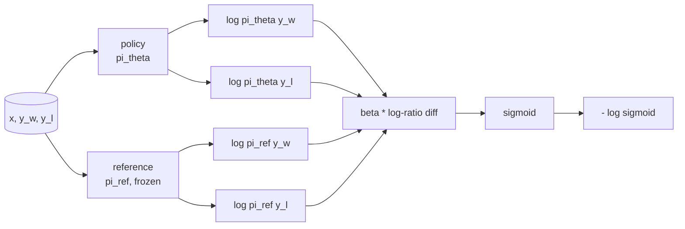
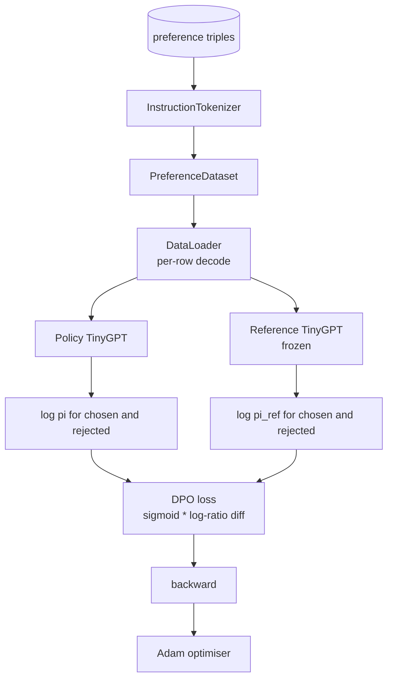

# Bài học Capstone 40: Tối ưu hóa tùy chọn trực tiếp từ đầu

> Phần thưởng models và PPO là RLHF stack cổ điển. DPO thu gọn stack đó thành một loss được giám sát duy nhất phù hợp với một policy trực tiếp chống lại các cặp ưu tiên. Bài học này rút ra DPO loss từ nhận dạng phần thưởng-chênh lệch, ships một tham chiếu làm việc model cộng policy model, tính toán xác suất nhật ký trên mỗi token và huấn luyện một transformer nhỏ về cố định ưu tiên của các kết quả hoàn thành được chọn và bị từ chối. Các bài kiểm tra ghim toán học loss và hướng gradient để bạn biết việc triển khai phù hợp với bài báo.

**Loại:** Xây dựng
**Ngôn ngữ:** Python (torch, numpy)
**Kiến thức tiên quyết:** Giai đoạn 19 bài 30-37 (NLP LLM bài học: tokenizer, bảng embedding, khối attention, thân transformer, vòng lặp trước training, điểm kiểm tra, thế hệ, perplexity)
**Thời lượng:** ~90 phút

## Mục tiêu học tập

- Lấy DPO loss dưới dạng sigmoid trên chênh lệch tỷ lệ log theo tỷ lệ và kết nối nó với phần thưởng ngầm.
- Xây dựng cặp tham chiếu model + policy model với tham chiếu đóng băng và policy có thể huấn luyện.
- Tính toán xác suất log cấp trình tự trong cả models, prompt tokens che giấu.
- Huấn luyện policy trên bộ ba `(prompt, chosen, rejected)` và xem xác suất nhật ký đã chọn tăng lên so với bị từ chối.
- Hành vi ghim với các bài kiểm tra về toán học loss, dấu gradient và bất biến tham chiếu.

## Vấn đề

Bạn có model SFT. Nó tuân theo hướng dẫn, nhưng đầu ra của nó không đồng đều; Một số hoàn thành rõ ràng, một số dài dòng hoặc sai. Bạn cũng có một dataset nhỏ các cặp ưu tiên: đối với cùng một prompt, một con người đánh dấu một lần hoàn thành là đã chọn và lần kia là bị từ chối.

Câu trả lời RLHF cổ điển là pipeline hai giai đoạn. Huấn luyện phần thưởng model theo sở thích. Tối ưu hóa policy so với phần thưởng bằng PPO. Điều này hoạt động nhưng tốn kém: hai models trong bộ nhớ trong quá trình PPO, điều khiển KL để giữ policy gần tham chiếu, hack phần thưởng khi phần thưởng model giòn.

DPO thay thế cả hai giai đoạn bằng một loss được giám sát duy nhất. Phần thưởng model không bao giờ tồn tại một cách rõ ràng. policy được huấn luyện trực tiếp trên các cặp ưu tiên, với hình phạt KL rõ ràng đối với tham chiếu SFT. Cùng một giải pháp tối ưu theo model ưu tiên Bradley-Terry, ít mã hơn nhiều.

## Khái niệm

Bắt đầu từ model Bradley-Terry. Cho một prompt `x` và hai lần hoàn thành `y_w` (được chọn) và `y_l` (bị từ chối), xác suất con người thích `y_w` là

```text
P(y_w > y_l | x) = sigmoid( r(x, y_w) - r(x, y_l) )
```

trong đó `r` là một số hàm phần thưởng tiềm ẩn. RLHF đầu tiên phù hợp với `r` từ sở thích, sau đó huấn luyện một policy `pi` để tối đa hóa `r` với mỏ neo KL:

```text
max_pi   E_{x, y~pi} [ r(x, y) ] - beta * KL(pi || pi_ref)
```

Dẫn xuất DPO quan sát thấy rằng các policy `pi*` tối ưu theo mục tiêu này có dạng khép kín về mặt `r`:

```text
pi*(y | x) = (1/Z(x)) * pi_ref(y | x) * exp( r(x, y) / beta )
```

Sắp xếp lại cho `r`:

```text
r(x, y) = beta * ( log pi*(y | x) - log pi_ref(y | x) ) + beta * log Z(x)
```

Thuật ngữ `log Z(x)` giống nhau cho cả `y_w` và `y_l` (nó phụ thuộc vào `x` chứ không phải `y`), vì vậy nó sẽ hủy bỏ khi bạn tính chênh lệch ưu tiên:

```text
r(x, y_w) - r(x, y_l) = beta * ( log pi_theta(y_w|x) - log pi_ref(y_w|x)
                                - log pi_theta(y_l|x) + log pi_ref(y_l|x) )
```

Thay thế vào sigmoid Bradley-Terry và lấy log âm likelihood các cặp ưu tiên:

```text
L_DPO(theta) = - E_{(x, y_w, y_l)} [
  log sigmoid( beta * ( log pi_theta(y_w|x) - log pi_ref(y_w|x)
                       - log pi_theta(y_l|x) + log pi_ref(y_l|x) ) )
]
```

Đây là loss. Nó là một sigmoid trên một vô hướng duy nhất cho mỗi ví dụ, được tính toán từ bốn xác suất log. Không có phần thưởng riêng model. Không PPO. Không có thuật ngữ KL trong loss; ràng buộc KL được đưa vào đạo hàm dạng đóng.



## Dấu hiệu của Gradient

Một kiểm tra sự tỉnh táo hữu ích trước khi chạy training. Lấy gradient liên quan đến `log pi_theta(y_w | x)`:

```text
d L_DPO / d log pi_theta(y_w | x) = - beta * (1 - sigmoid(z))
```

trong đó `z` là đối số của sigmoid. Điều này là tiêu cực đối với tất cả các `z`, có nghĩa là: tăng xác suất hoàn thành log của policy đã chọn sẽ làm giảm loss. Đối xứng, gradient đối với `log pi_theta(y_l | x)` là dương: tăng xác suất log bị từ chối làm tăng loss. Training đẩy người được chọn lên và người bị từ chối xuống. Tài liệu tham khảo bị đóng băng; nó không di chuyển.

## Dữ liệu

Mười hai ưu tiên tăng gấp ba lần ship với bài học. Mỗi người đều `(prompt, chosen, rejected)`. Việc hoàn thành được chọn là ngắn gọn và chính xác. Người bị từ chối là dài dòng, lạc đề hoặc sai. Các cặp bao gồm các nhóm nhiệm vụ giống như bài 39 (viết hoa, số học, danh sách) vì vậy một policy bắt đầu từ cơ sở SFT có điểm khởi đầu hợp lý.

Vật cố định có chủ ý nhỏ. DPO làm việc trên hàng chục nghìn cặp trong production; Ở đây, vấn đề là toán học loss và vòng lặp chạy từ đầu đến cuối trên một dataset nhỏ và khoảng cách log-prob được chọn so với bị từ chối tăng lên rõ rệt.

## Bất biến tham chiếu

Một triển khai DPO phải xử lý model tham chiếu một cách cẩn thận. Tham chiếu là SFT model đóng băng tại chỗ. Ba thuộc tính phải giữ:

- Tài liệu tham khảo parameters không bao giờ nhận được gradients.
- Xác suất nhật ký tham chiếu không bao giờ thay đổi giữa epochs.
- policy bắt đầu từ cùng trọng số với tham chiếu. (`theta` tối ưu là tham chiếu cộng với bản cập nhật đã học; khởi tạo policy dưới dạng bản sao của tham chiếu là khởi đầu được xác định rõ ràng.)

Việc thực hiện thực thi những điều này bằng cách:

- Bao bọc tham chiếu trong `torch.no_grad()` trong quá trình chuyển tiếp.
- Đặt `requires_grad=False` trên mọi parameter tham chiếu.
- Xây dựng policy thông qua `policy.load_state_dict(reference.state_dict())` sau khi tham chiếu được xây dựng.

## Kiến trúc



Công model này giống như TinyGPT được sử dụng trong bài 39 (chỉ decoder, nhân quả, byte tokeniser). Tài liệu tham khảo và policy chia sẻ kiến trúc; Trọng số của policy trôi khỏi tham chiếu dưới training trong khi tham chiếu vẫn cố định.

## Những gì bạn sẽ xây dựng

Việc triển khai là một `main.py` cộng với các bài kiểm tra.

1. `InstructionTokenizer`: Byte tokeniser với `INST` và `RESP` đặc biệt. Hình dạng giống như bài 39.
2. `TinyGPT`: transformer chỉ dành cho decoder. Hình dạng giống như bài 39 nên bài học khép kín ngay cả khi bạn bỏ qua bài 39.
3. `make_preferences`: trả về mười hai `(prompt, chosen, rejected)` bộ ba.
4. `sequence_log_prob`: cho model, tiền tố prompt và hoàn thành, trả về tổng xác suất nhật ký token tiếp theo trên hoàn thành (không có đóng góp vị trí prompt).
5. `dpo_loss`: lấy bốn xác suất nhật ký và `beta`, trả về loss tensor cho mỗi ví dụ và delta phần thưởng ngầm cho việc ghi nhật ký.
6. `train_dpo`: vòng lặp mỗi epoch tính toán các đầu mối nhật ký đã chọn và bị từ chối trong policy và tham chiếu, áp dụng loss và các bước Adam.
7. `evaluate_margins`: trả về biên độ xác suất log trung bình đã chọn-từ chối dưới policy tại bất kỳ thời điểm nào.
8. `run_demo`: xây dựng tài liệu tham khảo và policy từ một pretrain khởi động nhỏ, sao chép trọng lượng, luyện tập ba mươi bước, in loss và lề mỗi bước, và thoát khỏi số không khi thành công.

## Tại sao DPO hoạt động

DPO tương đương về mặt toán học với RLHF theo model ưu tiên Bradley-Terry, cho đến tham số hóa phần thưởng. Phần thưởng ngầm `r(x, y) = beta * (log pi(y|x) - log pi_ref(y|x))` có thể xác định được từ sở thích cho đến hàm `x`, hàm này sẽ hủy bỏ sự khác biệt. policy dạng đóng cho phép bạn bỏ qua model phần thưởng rõ ràng. Ràng buộc KL được thực thi về mặt cấu trúc: bất kỳ độ lệch nào của `pi` so với `pi_ref` làm cho tỷ lệ log lớn hơn và sigmoid bão hòa, làm giảm gradient khi policy di chuyển quá xa. Tài liệu tham khảo là mạng lưới an toàn của bạn.

## Mục tiêu kéo dài

- Thêm chuẩn hóa độ dài vào tổng xác suất log: chia cho độ dài hoàn thành. Độ dài bias là một chế độ thất bại DPO đã biết trong đó model ưu tiên chọn các lần hoàn thành ngắn hơn vì xác suất log của chúng lớn hơn về mặt tuyệt đối.
- Thêm biến thể IPO của loss: thay thế sigmoid + log bằng `(z - 1)^2`. So sánh sự hội tụ trên thiết bị cố định.
- Thêm parameter làm mịn nhãn nội suy giữa nhãn bị từ chối được chọn khó và 0,5 đồng nhất.
- Thay thế tài liệu tham khảo bằng một model nhỏ hơn, rẻ hơn (kiến thức distillation hương vị).

Việc triển khai cung cấp cho bạn loss, bất biến tham chiếu và vòng lặp training. Toán học là bài học. Mã làm cho toán học trở nên cụ thể.
