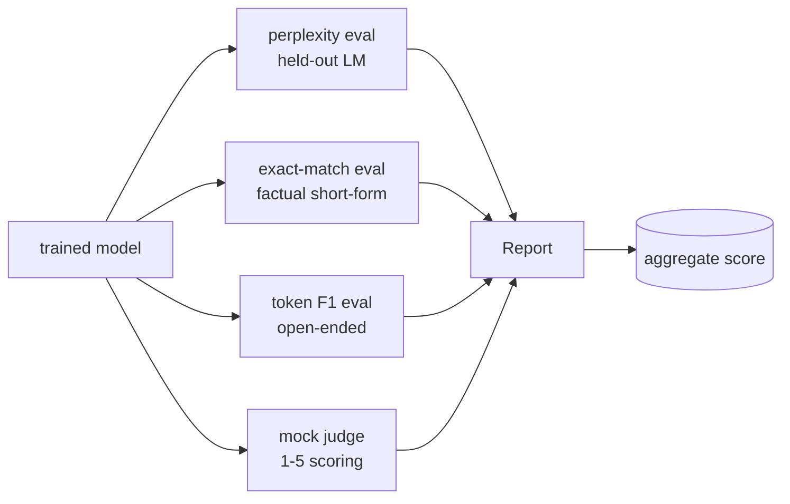
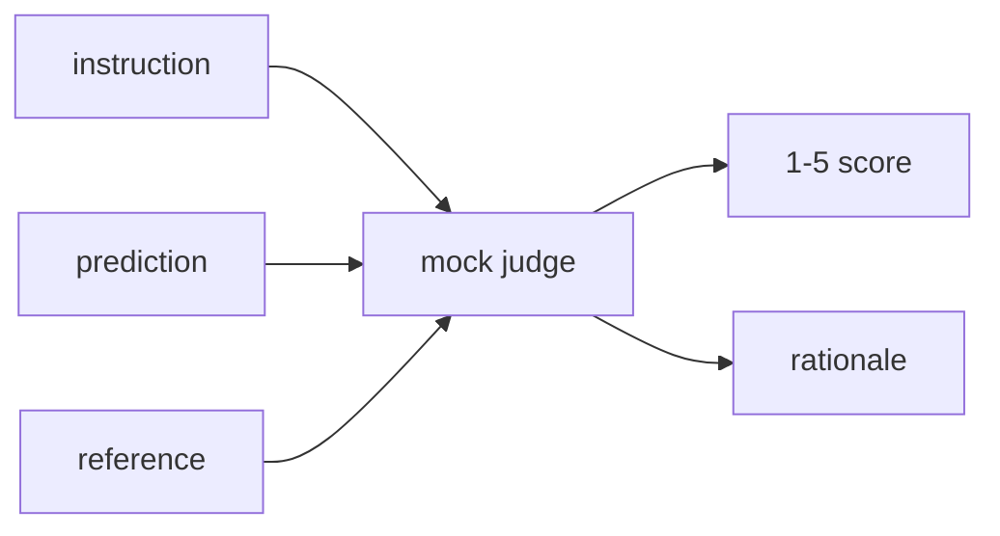
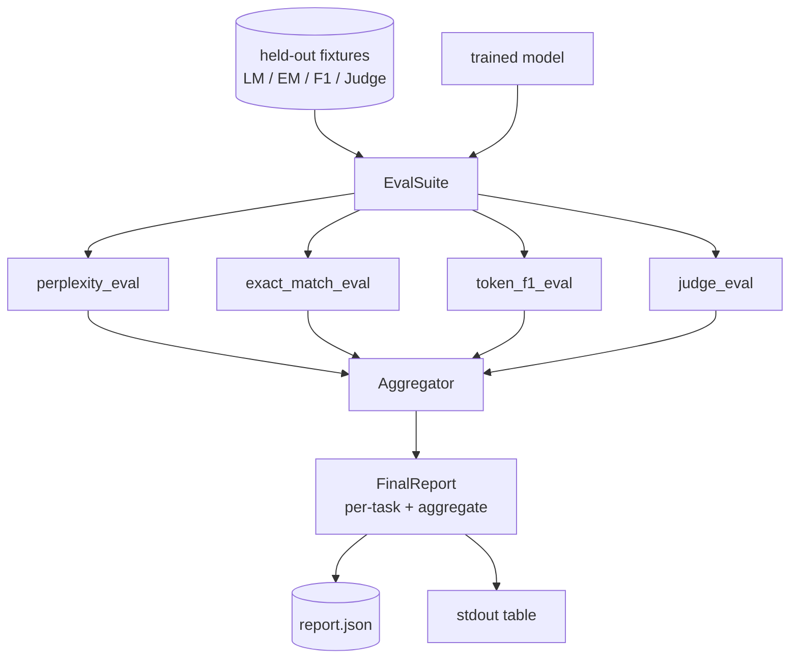

# Bài học Capstone 41: Đánh giá đầy đủ Pipeline

> Training là phần bạn có thể theo dõi bằng các đường cong loss. Đánh giá là phần bạn phải thiết kế. Bài học này xây dựng một pipeline đánh giá thống nhất lấy bất kỳ model ngôn ngữ nào được huấn luyện, chạy bốn đánh giá không đồng nhất trên đó, tổng hợp kết quả thành một báo cáo cho mỗi nhiệm vụ và ships một LLM giả cục bộ với tư cách là giám khảo để vòng lặp chạy mà không cần mạng. Bốn đánh giá bao gồm các khía cạnh mà mọi shipping model cần: mô hình ngôn ngữ (perplexity), độ chính xác dạng ngắn (khớp chính xác), tương tự dạng mở (token F1) và chấm điểm định tính (đánh giá).

**Loại:** Xây dựng
**Ngôn ngữ:** Python (torch, numpy)
**Kiến thức tiên quyết:** Giai đoạn 19 bài 30-37 (NLP LLM bài học: tokenizer, bảng embedding, khối attention, thân transformer, vòng lặp trước training, điểm kiểm tra, thế hệ, perplexity)
**Thời lượng:** ~90 phút

## Mục tiêu học tập

- Tính toán perplexity được giữ lại với kế toán token mặt nạ trên một transformer nhỏ.
- Chạy đánh giá khớp chính xác trên prompts thực tế dạng ngắn.
- Tính toán F1 cấp token giữa chuỗi dự đoán và chuỗi tham chiếu bằng chuẩn hóa.
- Xây dựng một LLM giả cục bộ với tư cách là giám khảo chấm điểm model đầu ra trên thang điểm 1-5.
- Tổng hợp bốn đánh giá thành một báo cáo có trọng số duy nhất với phân tích cho mỗi nhiệm vụ.

## Vấn đề

Một số liệu duy nhất không bao giờ mô tả một model ngôn ngữ. Perplexity cho biết model phù hợp với sự phân bố ngôn ngữ như thế nào nhưng không nói gì về việc liệu nó có trả lời câu hỏi hay không. Đối sánh chính xác cho biết liệu model có tạo ra dây vàng hay không nhưng trừng phạt các diễn giải chính xác. Token F1 tha thứ cho việc diễn giải nhưng bị lừa bởi sự trùng lặp từ vựng với nội dung sai. LLM-as-judge nắm bắt các khía cạnh định tính nhưng đắt tiền và ngẫu nhiên.

pipeline bạn thực sự muốn có cả bốn. Mỗi đánh giá bao gồm một khía cạnh mà những người khác bỏ lỡ. Mỗi dữ liệu chạy trên một tập hợp con dữ liệu được giữ lại khác nhau được định hình cho chỉ số đó. Báo cáo cuối cùng hiển thị các con số trên mỗi nhiệm vụ cạnh nhau và tổng hợp, vì vậy người đánh giá có thể xem nhanh sự đánh đổi nào mà model đang thực hiện.

Bài học này xây dựng pipeline đó, từ đầu đến cuối, trong một tệp.

## Khái niệm

Mỗi đánh giá là một hàm từ `(model, dataset) -> EvalResult`. Kết quả mang giá trị chỉ số, chi tiết cho mỗi ví dụ để kiểm tra và tên cho tổng hợp. pipeline soạn chúng với một config cho biết đánh giá nào sẽ chạy và làm thế nào để cân chúng.

## Perplexity, được đếm đúng

Perplexity là `exp(mean negative log-likelihood per token)`. Việc triển khai có hai bẫy:

- Giá trị trung bình phải trên các vị trí token thực tế, không vượt quá batch * dãy. Đệm tokens phải được loại trừ khỏi mẫu số nếu không perplexity sẽ trông đẹp hơn thực tế.
- model dự đoán token tiếp theo, vì vậy logits ở vị trí `i` dự đoán token ở vị trí `i+1`. Những sai lầm ở đây là im lặng: loss vẫn huấn luyện, nhưng số liệu trở nên vô nghĩa.

Đánh giá tính tổng batch của `-log p(token)` trên các vị trí không phải pad và số lượng trên batch token, sau đó chia ở cuối. Điều này an toàn hơn về mặt số so với tính trung bình mỗi batch sự bối rối (làm giảm trọng số của các chuỗi ngắn) và phù hợp với định nghĩa trong sách giáo khoa.

## Đối sánh chính xác, với chuẩn hóa

harness chuẩn hóa cả dự đoán và tham chiếu trước khi so sánh:

- Chữ thường.
- Dải khoảng trắng xung quanh.
- Thu gọn khoảng trắng bên trong chạy đến một khoảng trống duy nhất.
- Bỏ dấu câu đầu cuối (`.`, `!`, `?`) nếu cả hai bên chỉ khác nhau về dấu câu.

Chuẩn hóa làm cho đối sánh chính xác trở nên hữu ích trong thực tế. Một model nói rằng `"Paris"` đúng; một người nói rằng `"Paris."` cũng đúng; một điều nói rằng `"  paris  "` cũng đúng. Số liệu vẫn yêu cầu câu trả lời phải là cùng một chuỗi sau khi chuẩn hóa.

## Token F1, đúng cách

Token F1 là giá trị trung bình hài hòa của precision và recall được tính toán trên túi tokens. Các bước:

1. Chuẩn hóa dự đoán và tham chiếu (các quy tắc tương tự như đối sánh chính xác).
2. Chia mỗi thành một danh sách tokens (mã hóa khoảng trắng).
3. Đếm giao điểm đa tập.
4. Precision = `intersection_count / len(pred_tokens)`. Recall = `intersection_count / len(ref_tokens)`. F1 = trung bình hài.

Nếu cả dự đoán và tham chiếu đều trống, F1 là 1 (khớp trống). Nếu chỉ có một trống, F1 là 0. Mẫu này khớp với tham chiếu đánh giá SQuAD và tạo ra các con số ổn định trên các diễn giải.

## LLM giả địa phương với tư cách là thẩm phán

Một thẩm phán thực sự là một biên giới model đằng sau một API. Đối với bài học này, giám khảo phải chạy ngoại tuyến. Thẩm phán giả là một người ghi điểm xác định lấy một hướng dẫn, dự đoán của model và tham chiếu, và trả về điểm số theo `{1, 2, 3, 4, 5}` cộng với lý do một dòng. Các quy tắc tính điểm rất rõ ràng:

- 5 nếu dự đoán chuẩn hóa bằng tham chiếu chuẩn hóa.
- 4 nếu token F1 giữa dự đoán và tham chiếu ít nhất là 0,8.
- 3 nếu token F1 ở `[0.5, 0.8)`.
- 2 nếu token F1 ở `[0.2, 0.5)`.
- 1 nếu không.

Đây không phải là một thẩm phán thực sự, nhưng nó có giao diện phù hợp. Hoán đổi trong một model thực sau đó bằng cách thay đổi một chức năng. Người pipeline không quan tâm.

## Tổng hợp

Tổng hợp là giá trị trung bình có trọng số của điểm đánh giá chuẩn hóa. Mỗi đánh giá báo cáo số riêng của nó theo `[0, 1]`:

- Perplexity: chuẩn hóa như `1 / (1 + log(perplexity))`. Một perplexity của 1 bản đồ thành 1, bản đồ vô cực thành 0.
- Đối sánh chính xác: đã có `[0, 1]`.
- Token F1: đã `[0, 1]`.
- Thẩm phán: chia cho 5.

Trọng lượng có thể định cấu hình. Hỗn hợp mặc định là 0,2 perplexity, 0,3 khớp chính xác, 0,3 token F1, 0,2 judge. Việc lựa chọn trọng lượng là một quyết định về sản phẩm; Bài học để lộ núm để bạn có thể thử nghiệm.

## Kiến trúc

`EvalSuite` là một bộ điều phối mỏng. Mỗi đánh giá riêng lẻ là một hàm miễn phí nhận `(model, tokenizer, dataset, config)` và trả về `EvalResult`. `Aggregator` thu thập kết quả và đưa ra báo cáo cuối cùng. Bản demo in bảng và viết một bản sao JSON mà CI xuôi dòng có thể nhập.

## Những gì bạn sẽ xây dựng

Việc triển khai là một `main.py` cộng với các bài kiểm tra.

1. `TinyGPT`: cùng một kiến trúc chỉ dành cho decoder được sử dụng trong bài học 38-40, được bao gồm để bài học độc lập.
2. `InstructionTokenizer`: byte tokeniser với các tính năng đặc biệt của INST / RESP / PAD.
3. Bốn đồ đạc: một kho dữ liệu LM, một bộ EM, một bộ F1 và một bộ giám khảo. Hai mươi ví dụ mỗi người, xác định.
4. `perplexity_eval`: trả về `EvalResult` với giá trị perplexity và biểu đồ trên mỗi token loss.
5. `exact_match_eval`: trả về trung bình EM và mỗi bản ghi ví dụ.
6. `token_f1_eval`: trả về các bản ghi token F1 và mỗi ví dụ trung bình.
7. `mock_judge` và `judge_eval`: điểm và lý do cho mỗi ví dụ, điểm trung bình trên toàn bộ tập hợp.
8. `Aggregator.normalise`: quy tắc chuẩn hóa mỗi đánh giá.
9. `Aggregator.aggregate`: giá trị trung bình có trọng số và báo cáo tập hợp.
10. `run_demo`: huấn luyện một model nhỏ trong thời gian ngắn, chạy cả bốn lần đánh giá, in bảng báo cáo và viết JSON, thoát khỏi số không khi thành công.

## Đọc báo cáo

Báo cáo có ba lớp. Đứng đầu là điểm tổng hợp. Bên dưới nó là bốn con số mỗi thời đại. Dưới đây là bảng phân tích cho mỗi ví dụ về chẩn đoán. Một lần chạy CI không thành công thường muốn có tổng hợp, nhưng một người đánh giá theo đuổi hồi quy muốn phân tích từng ví dụ để xem đầu vào nào mà model đã sai.

Kết xuất JSON sử dụng các khóa ổn định để bảng điều khiển CI có thể vẽ các đường xu hướng trên các phiên bản. Chiếc bàn in đẹp dành cho con người nhìn chằm chằm vào thiết bị đầu cuối sau khi chạy training.

## Mục tiêu kéo dài

- Thêm đánh giá hiệu chuẩn: xác suất softmax của model có khớp với accuracy của nó không? Dự đoán nhóm theo độ tin cậy và báo cáo accuracy thực nghiệm trên mỗi nhóm.
- Thêm đánh giá độ mạnh mẽ: gắn thẻ từng ví dụ bằng nhiễu loạn (chính tả, diễn giải, gây xao nhãng) và báo cáo chỉ số giảm trên mỗi nhiễu loạn.
- Thay thế thẩm phán giả bằng một model thực sự đằng sau một cuộc gọi HTTP. Chữ ký hàm không thay đổi.
- Thêm học trọng số cho mỗi nhiệm vụ: thay vì trọng số cố định, hãy điều chỉnh trọng số theo thứ tự ưu tiên mục tiêu trên models.

Việc triển khai cung cấp cho bạn bốn đánh giá, tổng hợp và báo cáo. Đánh giá thực tế pipelines nhiều khía cạnh hơn lên trên; Mô hình vẫn giữ nguyên: một hàm cho mỗi đánh giá, một tổng hợp, một báo cáo.
