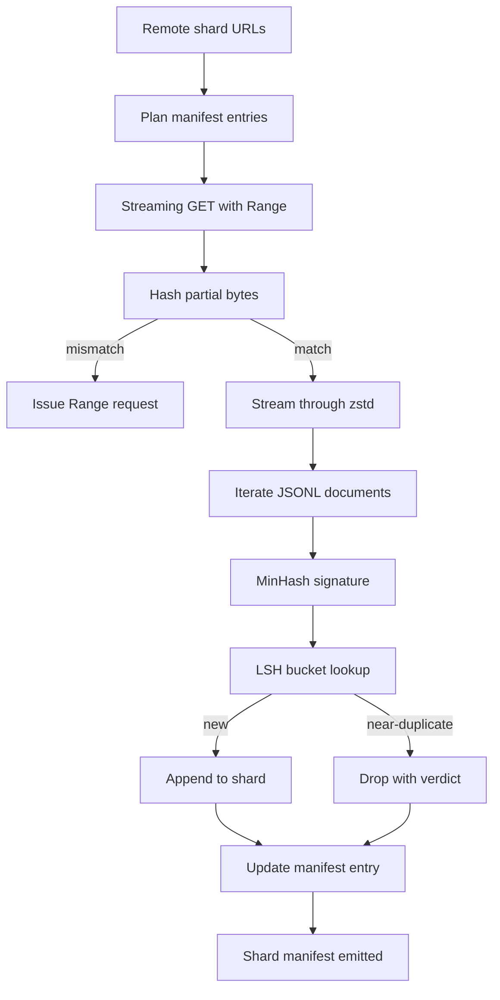

# Trình tải xuống kho dữ liệu lớn

> Training một ngôn ngữ model bắt đầu từ rất lâu trước forward pass đầu tiên. Kho dữ liệu phải hạ cánh trên đĩa, giải nén, khử trùng lặp và có thể định địa chỉ, với câu chuyện sơ yếu lý lịch đã được thực hiện trước khi mạng giảm xuống còn 4%. Bài học này xây dựng một trình tải xuống streaming kéo các phân đoạn nén, giải nén nhanh chóng với Zstandard, dấu vân tay gần như trùng lặp thông qua MinHash cộng với băm nhạy cảm với cục bộ và viết một bản kê khai phân đoạn mà rest của pipeline có thể tin tưởng.

**Loại:** Xây dựng
**Ngôn ngữ:** Python
**Kiến thức tiên quyết:** Giai đoạn 19 bài 30-37
**Thời lượng:** ~90 phút

## Mục tiêu học tập

- Truyền phát các phân đoạn từ xa bằng `urllib` và giải nén bằng `zstandard` mà không làm bộ đệm toàn bộ tệp trong bộ nhớ.
- Tiếp tục tải xuống một phần bằng cách đưa ra yêu cầu HTTP `Range` dựa trên độ lệch byte đã được xác minh.
- Xây dựng chữ ký MinHash cho mỗi tài liệu và lưu trữ nó với LSH để các chữ ký gần như trùng lặp va chạm.
- Phát hành tệp kê khai phân đoạn với hàm băm nội dung, kích thước byte, số lượng tài liệu và phán quyết khử trùng lặp.

## Vấn đề

Lần đầu tiên bạn huấn luyện trên kho dữ liệu 200 GB, mạng giảm ở mức 41 phần trăm và script thoát ra với một ngoại lệ `urllib`. Lần thứ hai nó giảm xuống 78 phần trăm. Theo phần trăm 99, bạn đã viết lại vòng lặp ba lần. Hai lỗi bạn phải thiết kế ngay từ phút đầu tiên là sơ yếu lý lịch tải xuống một phần và xóa tài liệu trùng lặp. Cả hai đều có các giải pháp nổi tiếng; Cả hai đều thường bị bỏ qua vì pipeline bắt đầu như một cuộc gọi `requests.get` một dòng mọc răng.

Sơ yếu lý lịch là một vấn đề HTTP. server phải tôn trọng `Range`, khách hàng phải theo dõi bù đắp đã được xác minh so với bản ghi trên đĩa và bù đắp đã xác minh phải tồn tại process chết. Nếu độ lệch và tệp chênh lệch dù chỉ một byte, quá trình tải xuống được tiếp tục sẽ ghi rác và kho dữ liệu bị hỏng theo cách chỉ hiển thị trong tokenization.

Loại bỏ trùng lặp là một vấn đề chữ ký. Deedup băm chính xác bỏ lỡ gần như trùng lặp: cùng một bài viết trên Wikipedia hiển thị với ba chân trang khác nhau, cùng một tệp mã với tiêu đề giấy phép khác, cùng một bài đăng trên blog với parameter theo dõi trên mọi liên kết. MinHash cộng với LSH bắt được những thứ này với chi phí tuyến tính phụ. Chi phí là một chữ ký cho mỗi tài liệu và một tra cứu vùng lưu trữ cho mỗi chữ ký.

## Khái niệm



### Streaming với `urllib`

Thư viện tiêu chuẩn `urllib.request.urlopen` trả về một đối tượng giống tệp. Bọc nó trong một `zstandard.ZstdDecompressor().stream_reader` và các byte chảy từ mạng qua trình giải nén vào trình lặp tài liệu mà không bao giờ hiện thực hóa phân đoạn nén hoặc phân đoạn giải nén trong bộ nhớ. Chi phí bộ nhớ duy nhất là bộ đệm dòng, chữ ký MinHash cho tài liệu hiện tại và chỉ mục LSH.

### Tiếp tục với `Range`

Trình tải xuống ghi hai tệp trên mỗi phân đoạn: chính phân đoạn và một `.partial.json` checkpoint. checkpoint ghi lại `verified_bytes`, `expected_size`, `sha256_prefix` (được tính toán trong `verified_bytes` byte đầu tiên) và URL nguồn. Khi khởi động, trình tải xuống đọc checkpoint, tính toán lại `sha256_prefix` trên các byte trên đĩa và chỉ tiếp tục nếu hàm băm được tính toán lại khớp với nhau. Nếu hàm băm sai, một phần sẽ bị loại bỏ và quá trình tải xuống sẽ bắt đầu lại từ byte không. Hỏng im lặng là không thể vì các byte đã được xác minh được kiểm tra chứ không phải giả định.

### MinHash cộng với LSH

MinHash ước tính sự giống nhau của Jaccard của hai tập hợp trong không gian cố định. Đối với một tài liệu, tập hợp là các tấm ván lợp (n-gram chồng chéo) của văn bản của nó. Chữ ký là `k` giá trị băm tối thiểu, một giá trị cho mỗi hàm băm độc lập. Hai tài liệu có sự tương đồng của Jaccard `s` có xác suất `s` đồng ý về bất kỳ thành phần nào của chữ ký.

Sau đó, LSH nhóm các thành phần `k` thành `b` dải, mỗi hàng `r`, nơi `k = b * r`. Hai tài liệu va chạm trong ít nhất một băng tần với xác suất `1 - (1 - s^r)^b`, đây là một ngưỡng rõ ràng xung quanh giá trị của `s` bạn điều chỉnh `(b, r)`. Ngưỡng cho việc loại bỏ kho dữ liệu điển hình là `s = 0.8`, mà tài liệu nghiên cứu LSH đạt được với `k = 128`, `b = 32` `r = 4`.

### Phân đoạn biểu hiện dưới dạng hợp đồng

Đầu ra bền duy nhất của trình tải xuống là tệp kê khai. Tệp kê khai giữ, trên mỗi phân đoạn, URL, số byte được giải nén, số lượng tài liệu, số lượng tài liệu duy nhất sau khi loại bỏ và sha256 của tệp phân đoạn cuối cùng. Downstream tokenization đọc tệp kê khai, không phải danh sách thư mục. Nếu một phân đoạn bị thiếu hoặc sha256 của nó sai, tệp kê khai sẽ yêu cầu giai đoạn tiếp theo từ chối bắt đầu. Tệp kê khai là lợi thế quyết định giữa "dữ liệu được tải xuống" và "dữ liệu được tải xuống và có thể xác minh được".

## Tự xây dựng

`code/main.py` thực hiện:

- `ShardPlanner` - đọc danh sách các URL phân đoạn và tạo các mục nhập tệp kê khai theo kế hoạch.
- `StreamingDownloader` - mở luồng `urllib` với `Range` tùy chọn, ghi vào tệp tạm thời, cập nhật `.partial.json` checkpoint trên mọi đoạn và xác minh tiền tố SHA256 khi tiếp tục.
- `ZstdDocIterator` - bao bọc luồng giống như tệp trong `zstandard.ZstdDecompressor` và mang lại một tài liệu trên mỗi dòng.
- `MinHasher` - tạo ra chữ ký thành phần `k` cho một chuỗi bằng cách sử dụng một họ hạt băm cố định.
- `LSHIndex` - nhóm chữ ký theo ban nhạc và báo cáo va chạm.
- `Dedup` - kết hợp hasher và index để gắn nhãn từng tài liệu `keep` hoặc `near_duplicate` cùng với id phân đoạn phù hợp.
- `ManifestWriter` - thu thập số liệu thống kê trên mỗi phân đoạn và ghi `manifest.json`.

Một bản demo ở cuối tệp xây dựng một kho dữ liệu tổng hợp nhỏ trên đĩa, nén nó bằng `zstandard`, tải xuống thông qua URL `file://`, loại bỏ trùng lặp và in tệp kê khai.

Chạy nó:

```bash
python3 code/main.py
```

script thoát khỏi số không và in một bản tóm tắt tệp kê khai.

## Mô hình Production

Bốn mô hình chia sẻ bài học này thành kho dữ liệu thực.

**Checkpoint trước khi ghi.** Các `.partial.json` phải được `fsync` trước khi các byte được thêm vào phân đoạn. Nếu không, một loss lũy thừa sẽ đảo ngược thứ tự: byte phân mảnh trên đĩa, checkpoint không có chúng, resume tiếp theo tin rằng nó có ít byte được xác minh hơn so với nó, các byte hậu tố trùng lặp sẽ làm hỏng tệp. Checkpoint trước, sau đó viết. Đây là kỷ luật tương tự như nhật ký viết trước.

**Chỉ mục LSH phân đoạn.** Một chỉ mục LSH duy nhất trên toàn bộ kho dữ liệu không vừa với RAM ở thang đo 200 GB. Phân vùng chỉ mục LSH theo băm băng tần đầu tiên, lưu trữ các phân vùng trên đĩa và chỉ tham khảo phân vùng mà một chữ ký mới sẽ xuất hiện. Chi phí là một đĩa đọc thêm cho mỗi tài liệu; lợi ích là chỉ số LSH không còn là trần bộ nhớ cứng.

**Tombstone, không phải xóa.** Các bản sao bị loại bỏ được ghi lại trong bản kê khai với phán quyết `near_duplicate` và id phân đoạn của tài liệu mà chúng va chạm. Xóa chúng sẽ mất liên kết giữa bản sao và người giữ nó. Tombstonening bảo tồn dấu vết kiểm tra và cho phép một con đèo hạ lưu thay đổi suy nghĩ về ngưỡng.

**Per-shard sha256 trong tệp kê khai, cộng với tệp kê khai sha256.** Bản thân tệp kê khai nhận được một hàm băm nội dung. Các giai đoạn xuôi dòng xác minh hàm băm kê khai trước khi chúng tin tưởng các mục nhập cho mỗi phân đoạn. Nếu không có điều này, bản kê khai là bề mặt tấn công im lặng: kẻ tấn công có thể chỉnh sửa một tệp duy nhất có thể làm hỏng toàn bộ pipeline.

## Ứng dụng

Production mẫu:

- **Tiếp tục trên mỗi CI chạy.** CI người chạy là phù du. Trình tải xuống phải giả định một đĩa mới trên mỗi lần chạy và khôi phục từ bộ nhớ cache hoặc từ xa. `--cache-dir` là cờ class thứ nhất.
- **Dedup trước tokenization.** Tokenization rất đắt. Chạy nó hai lần trên cùng một tài liệu là gấp đôi chi phí cho cùng một đường cong loss. Dedup là thượng nguồn của tokenization, không phải hạ lưu.
- **Hiển thị là merge cổng.** Chạy training đọc bản kê khai sha256 từ một commit được ghim. Phiên bản dataset mới yêu cầu một commit kê khai mới. Mối liên hệ giữa mã và dữ liệu là git, không phải văn hóa dân gian.

## Sản phẩm bàn giao

Trong một dự án thực tế, `outputs/skill-corpus-downloader.md` sẽ mô tả URL nào cung cấp cho trình tải xuống, cách bố trí thư mục checkpoint, chiều rộng và `(k, b, r)` gấp ba lần sử dụng và tệp kê khai nằm ở đâu trong kiểm soát phiên bản. Bài học này ships động cơ.

## Bài tập

1. Thêm cờ `--shingle-width` và đo lường kết quả loại bỏ thay đổi như thế nào ở chiều rộng 3, 5, 9. Bảo vệ mặc định đã chọn.
2. Thêm hỗ trợ gzip bên cạnh zstd bằng cách đánh hơi các byte ma thuật. Trình tải xuống không nên yêu cầu người gọi chỉ định codec.
3. Thêm chế độ `--resume-only` từ chối bắt đầu tải xuống mới nếu không tìm thấy checkpoint. Hữu ích trong CI để giữ cho một lần chạy không vô tình kéo lại 200 GB.
4. Di chuyển chỉ mục LSH sang kệ hoặc tệp sqlite và đo thông lượng so với biến thể trong bộ nhớ.
5. Thêm kiểm tra tệp kê khai sha256 khi khởi động. Trình tải xuống sẽ không đóng được nếu tệp kê khai trên đĩa không đồng ý với hàm băm tệp kê khai trong `manifest.lock`.

## Thuật ngữ chính

| Thuật ngữ | Những gì mọi người nói | Ý nghĩa thực sự của nó |
|------|-----------------|------------------------|
| Mảnh vỡ | "Một tập tin" | Một lát cắt khép kín của kho dữ liệu với sha256 riêng của nó, được sử dụng làm đơn vị của resume và dedup |
| Chữ ký MinHash | "Dấu vân tay" | Bản phác thảo `k` thành phần của một tập hợp, trong đó mỗi thành phần là tối thiểu của một hàm băm độc lập trên tập hợp |
| Băng tần LSH | "Xô" | Một nhóm các thành phần chữ ký `r` được sử dụng như một khóa vùng lưu trữ duy nhất để phát hiện va chạm |
| Byte đã xác minh | "Tiếp tục bù đắp" | Byte trên đĩa có tiền tố sha256 khớp với checkpoint; Bù đắp an toàn duy nhất để tiếp tục |
| Bản kê khai | "Mục lục" | Bản ghi bền vững duy nhất về những gì trình tải xuống tạo ra, bao gồm cả hàm băm nội dung |

## Đọc thêm

- [RFC 7233](https://datatracker.ietf.org/doc/html/rfc7233) - Yêu cầu HTTP Range, giao thức resume
- [Zstandard format specification](https://datatracker.ietf.org/doc/html/rfc8478) - định dạng khung giúp giải nén streaming an toàn
- [MinHash](https://en.wikipedia.org/wiki/MinHash) - họ đặc trưng mà bài học này sử dụng
- [Locality-sensitive hashing](https://en.wikipedia.org/wiki/Locality-sensitive_hashing) - sơ đồ dải đằng sau ngưỡng dedup
- Giai đoạn 19 · 43 - kho dữ liệu mã hóa HDF5 mà trình tải xuống cung cấp dữ liệu
- Giai đoạn 19 · 44 - lịch trình cosin huấn luyện trên kho dữ liệu
- Giai đoạn 19 · 45 - vòng lặp AMP tiêu thụ lịch trình
