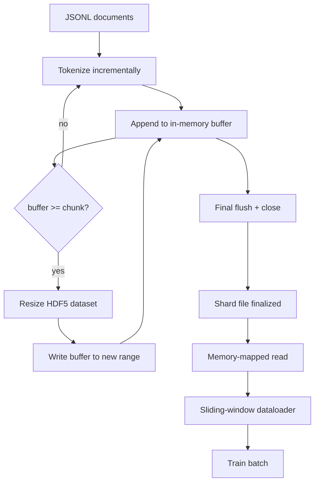

# HDF5 Tokenized Corpus

> Kho dữ liệu đã tải xuống phải hạ cánh trong một bố cục mà huấn luyện viên có thể phát trực tuyến ở tốc độ đường truyền. JSONL trên đĩa không tồn tại sau 16 dataloader workers. HDF5 với số nguyên có thể thay đổi kích thước, dataset làm. Bài học này xây dựng streaming tokenization thành một dataset HDF5 có thể thay đổi kích thước, ghi phân đoạn trên nhiều tệp, đọc được ánh xạ bộ nhớ tại training thời điểm và dataloader cửa sổ trượt tạo ra các chuỗi có độ dài cố định với cách đóng gói phù hợp.

**Loại:** Xây dựng
**Ngôn ngữ:** Python
**Kiến thức tiên quyết:** Giai đoạn 19 bài 30-37
**Thời lượng:** ~90 phút

## Mục tiêu học tập

- Truyền tài liệu thành dataset số nguyên HDF5 có thể thay đổi kích thước với phân đoạn xác định.
- Phân đoạn ghi trên nhiều tệp HDF5 để lỗi có giới hạn và có thể xảy ra song song.
- Đọc lại tokens qua bố cục phân đoạn được hỗ trợ bộ nhớ đệm trang của HDF5 để dataloader chỉ sao chép vào bộ đệm batch tại batch thời điểm.
- Triển khai dataloader cửa sổ trượt phát ra chuỗi training có độ dài cố định với các quy tắc đóng gói rõ ràng.

## Vấn đề

Một cuộc chạy model training ngôn ngữ hiện đại đọc tokens với tốc độ hàng trăm nghìn mẫu mỗi giây trên hàng chục workers. JSONL trên đĩa chết ở lỗi trang bộ nhớ đệm lạnh đầu tiên: trình phân tích cú pháp JSON chậm, ranh giới tài liệu không thể định địa chỉ và tìm kiếm "mẫu 4.217.884" yêu cầu quét tệp. Ngay cả Parquet, nén tốt, cũng không phù hợp vì người tập không muốn cột; nó muốn một luồng token phẳng với quyền truy cập ngẫu nhiên O (1).

HDF5 phù hợp vì nó cung cấp một dataset phân đoạn, có thể thay đổi kích thước, chỉ có số nguyên có các đoạn thân thiện với bộ nhớ đệm trang tại thời điểm đọc. Huấn luyện viên yêu cầu một lát cắt `tokens[3,200,000 : 3,200,8192]` và HDF5 sao chép hyperslab được yêu cầu từ bộ nhớ cache của trang vào một mảng NumPy mới được phân bổ. Chi phí là một tay cầm tệp đang mở và một dấu chân bộ nhớ đệm trang có kích thước khối trên mỗi worker, không đáng kể so với chi phí giải mã JSONL.

Vấn đề xây dựng là làm cho phía viết trung thực. Các datasets có thể thay đổi kích thước rất dễ bị lạm dụng: viết từng tài liệu một và tệp HDF5 bị phân mảnh đến mức không sử dụng được. Viết tất cả các tài liệu trong một lần thay đổi kích thước và một process chết sẽ mất toàn bộ phân đoạn. Nguyên tắc phù hợp là bộ đệm sau đó mở rộng, với kích thước bộ đệm phù hợp với kích thước khối và ghi phân mảnh chia khối lượng công việc giữa các tệp để sự cố mất tối đa một phân đoạn.

## Khái niệm



### HDF5 có thể thay đổi kích thước được thực hiện đúng

token dataset được tạo ra với `maxshape=(None,)` và một `chunks=(chunk_size,)` cố định. Viết tiến hành bằng cách đệm tokens trong một mảng NumPy độ dài `chunk_size`. Khi bộ đệm lấp đầy, dataset được thay đổi kích thước chính xác `chunk_size` và bộ đệm được ghi vào phạm vi mới. Ở cuối phân đoạn, bộ đệm dư được ghi vào một phạm vi một phần cuối cùng. Mọi lần ghi đều liền kề và căn chỉnh theo từng đoạn ngoại trừ lần cuối cùng, mà người đọc được yêu cầu cắt bớt ở `token_count` đã ghi trong thuộc tính HDF5 của phân đoạn.

### Viết phân mảnh

Một tệp HDF5 duy nhất là một điểm lỗi duy nhất. pipeline ghi song song các phân đoạn: mỗi phân đoạn đầu vào từ Giai đoạn 19 bài 42 tạo ra một phân đoạn đầu ra HDF5. Chỉ mục `shards.json` ghi lại đường dẫn tệp, số lượng token, số tài liệu và sha256 trên tokens. Huấn luyện viên đọc `shards.json` để tính toán độ lệch toàn cục và xác thực kho dữ liệu.

### Đọc được ánh xạ bộ nhớ

Tại training thời điểm, mỗi worker mở chia sẻ tệp HDF5 ở chế độ `swmr=True` và yêu cầu `tokens[start:stop]`. Bố cục đoạn của HDF5 làm cho nó được đọc được hỗ trợ bởi bộ nhớ cache trang khi khối nóng. worker không bao giờ hiện thực hóa toàn bộ tệp: lát cắt được sao chép vào bộ đệm batch của dataloader, sau đó dataloader sao chép vào training tensor bộ nhớ được ghim tại batch thời điểm. Đường dẫn nóng có một syscall cho mỗi quá trình chuyển đổi chunk; mọi thứ khác đều RAM quyền truy cập.

### Cửa sổ trượt dataloader

dataloader là giai đoạn duy nhất biết về độ dài chuỗi training. Nó chọn một chỉ mục bắt đầu ngẫu nhiên trong luồng token toàn cầu, đọc `window_size + 1` tokens và trả về `(input, target) = (tokens[:-1], tokens[1:])`. Ranh giới tài liệu không được thực thi: một cửa sổ có thể nằm giữa hai tài liệu, với một `boundary_token_id` rõ ràng giữa chúng để model học cách sử dụng dấu phân cách. Đây là quy tắc đóng gói tiêu chuẩn; Đó cũng là quy tắc mà người mới bắt đầu quên, kết thúc với một kho dữ liệu có 8% training tokens ranh giới và 92% văn bản tự nhiên.

## Tự xây dựng

`code/main.py` thực hiện:

- `Tokenizer` - một tokenizer xác định cấp độ byte đủ tốt cho bản demo. Giao diện `encode(text) -> list[int]` và `vocab_size`.
- `HDF5ShardWriter` - mở một dataset số nguyên có thể thay đổi kích thước, bộ đệm tokens kích thước khối, thay đổi kích thước và ghi theo các bước có kích thước cố định, ghi `token_count` và `sha256` dưới dạng thuộc tính HDF5 khi đóng.
- `ShardedTokenizationPipeline` - lặp lại các tài liệu đầu vào, định tuyến chúng đến người viết và phát ra chỉ mục `shards.json`.
- `MmapTokenStore` - mở các tệp phân đoạn để đọc được ánh xạ bộ nhớ, tính toán độ lệch toàn cục, hiển thị một `get_slice(start, stop)` API duy nhất.
- `SlidingWindowDataloader` - chọn windows ngẫu nhiên từ luồng toàn cầu và mang lại mảng `(input_ids, target_ids)` NumPy.

Một bản demo ở cuối tệp xây dựng một kho dữ liệu nhỏ trong bộ nhớ, mã hóa thành hai mảnh, mở chúng thông qua bản đồ bộ nhớ, chạy dataloader trong 10 batches và in hình dạng mỗi batch và tổng kiểm tra.

Chạy nó:

```bash
python3 code/main.py
```

script thoát khỏi số không và in batch tổng kiểm tra.

## Mô hình Production

Bốn mô hình mở rộng bài học này thành một cuộc chạy training thực sự.

**Kích thước khối bằng giá trị đọc điển hình.** Huấn luyện viên đọc `window_size + 1` tokens trên mỗi mẫu. Đặt đoạn HDF5 thành bội số của `window_size` và các lần đọc được căn chỉnh bộ nhớ đệm trang. Các khối không khớp làm giảm một nửa thông lượng vì mỗi mẫu chạm vào hai khối.

**Token tính theo thuộc tính, không tính theo dataset.** Lát cắt cuối của dataset có thể đầy một phần vì kích thước khối không phân chia ranh giới tài liệu. Lưu trữ `token_count` thực dưới dạng thuộc tính HDF5 trên dataset và yêu cầu đầu đọc cắt bớt ở giá trị đó. Nếu không có điều này, người đọc sẽ bước ra khỏi phần cuối vào tokens không có đệm và model học cách dự đoán bằng không.

**Sha256 được phân mảnh với xác minh song song.** Mỗi phân đoạn có sha256 riêng trên token byte. Huấn luyện viên có thể xác minh song song tất cả các phân đoạn trước khi training bắt đầu. Một sha256 sai sẽ thất bại trong quá trình chạy sớm, không phải vào epoch ba sau mười sáu giờ.

**`swmr=True` ở cả hai bên, với `libver="latest"` trên người viết.** Chế độ Single-Writer-Multiple-Reader yêu cầu người viết mở bằng `libver="latest"`, tạo mọi dataset trước, sau đó đặt `file.swmr_mode = True`. Sau đó, người viết phải gọi `dataset.flush()` sau mỗi lần thay đổi kích thước để người đọc workers (mở bằng `swmr=True`) thấy dữ liệu nhất quán. Bỏ qua `libver="latest"` hoặc bật SWMR sau khi thay đổi cấu trúc là một nguồn phổ biến gây ra lỗi "tệp bị khóa".

## Ứng dụng

Production mẫu:

- **Một HDF5 cho mỗi phân đoạn nguồn.** Trình tải xuống (bài 42) phát ra một phân đoạn cho mỗi URL; tokenization (bài học này) phát ra một HDF5 cho mỗi phân đoạn nguồn. Ánh xạ 1: 1 làm cho sơ yếu lý lịch và khôi phục một phần thất bại trở nên tầm thường.
- **Ranh giới token id.** Ranh giới token là một phần của từ vựng tokenizer và là token duy nhất mà dataloader tiêm. training loss che giấu ranh giới token nếu model được cho là bỏ qua nó; nếu không, nó học cách sử dụng nó như một dấu phân tách trình tự.
- **`shards.json` là nguồn gốc của sự thật.** Thêm một phân đoạn mới có nghĩa là viết HDF5, tính toán sha256 của nó và thêm một mục nhập. Huấn luyện viên đọc tệp một lần khi khởi động và không bao giờ chạm vào danh sách thư mục.

## Sản phẩm bàn giao

Trong một dự án thực tế, `outputs/skill-hdf5-tokenized-corpus.md` sẽ mô tả tokenizer nào cung cấp cho pipeline, kích thước chunk nào phù hợp với cửa sổ của huấn luyện viên, `shards.json` ở đâu trong kiểm soát phiên bản và cách dataloader workers được phân mảnh trên các tệp. Bài học này ships động cơ.

## Bài tập

1. Thêm cờ `--compression gzip` vào trình ghi HDF5 và đo lường chi phí thông lượng trên kho dữ liệu demo. Bảo vệ mặc định đã chọn.
2. Thêm một hạt giống xác định vào dataloader cửa sổ trượt và xác minh hai lần chạy với cùng một hạt giống tạo ra batches giống hệt nhau.
3. Thêm chế độ `--validate` đọc mọi phân đoạn, tính toán lại sha256 qua tokens của nó và so sánh với `shards.json`. CI nên chạy điều này trước khi training bắt đầu.
4. So sánh thông lượng dataloader ở kích thước khối bằng, một nửa và gấp đôi kích thước cửa sổ. Báo cáo hiệu ứng bộ nhớ cache trang.
5. Thêm cờ `--max-document-tokens` để cắt bớt các tài liệu rất dài tại thời điểm ghi. Bảo vệ sự đánh đổi chống lại việc quyết định tại thời điểm đọc.

## Thuật ngữ chính

| Thuật ngữ | Những gì mọi người nói | Ý nghĩa thực sự của nó |
|------|-----------------|------------------------|
| dataset có thể thay đổi kích thước | "Chỉ bổ sung" | HDF5 dataset với `maxshape=(None,)` phát triển thông qua các cuộc gọi `resize` theo từng bước có kích thước khối |
| Bố cục theo khối | "Cách HDF5 lưu trữ nó" | Các trang trên đĩa có kích thước cố định mà hạt nhân có thể ánh xạ bộ nhớ và dataloader có thể đọc liền kề |
| Chế độ `swmr` | "Đọc trong khi ghi" | Chế độ Single-Writer-Multiple-Reader cho phép dataloader workers chia sẻ tệp một cách an toàn |
| Chỉ số phân đoạn | "Mảnh vỡ. json" | Chỉ số bền bỉ của tất cả các phân đoạn token với độ băm bù đắp và nội dung |
| Cửa sổ trượt | "Training mẫu" | Một lát cắt có độ dài cố định của luồng token toàn cầu mà huấn luyện viên ghép nối với mục tiêu dịch chuyển từng một của nó |

## Đọc thêm

- [HDF5 chunking documentation](https://docs.hdfgroup.org/hdf5/v1_14/) - bố cục dataset có thể thay đổi kích thước mà bài học này sử dụng
- [h5py user guide](https://docs.h5py.org/en/stable/) - Python ràng buộc cho HDF5
- [NumPy memory mapping](https://numpy.org/doc/stable/reference/generated/numpy.memmap.html) - mặt đọc primitive HDF5 lộ ra thông qua h5py
- Giai đoạn 19 · 42 - người tải xuống có đầu ra mà bài học này mã hóa
- Giai đoạn 19 · 44 - lịch trình cosin tiêu thụ dataloader này
- Giai đoạn 19 · 45 - vòng lặp AMP bao bọc bước training
