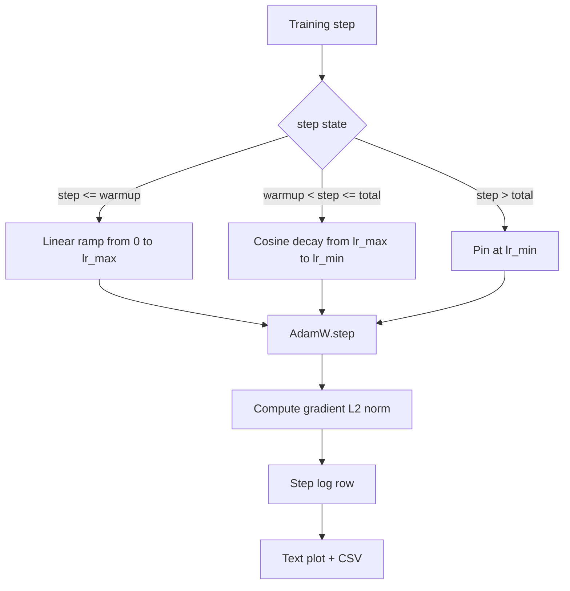

# Cosine LR với Khởi động tuyến tính

> Lịch trình tốc độ học tập là quyết định quan trọng thứ hai sau hàm loss. AdamW với phân rã cosin và khởi động tuyến tính là mặc định hiện đại cho language-model training vì nó cho phép model thấy kích thước bước hiệu quả nhỏ trong hàng nghìn bản cập nhật đầu tiên giòn, tăng lên đỉnh được cấu hình và phân rã mượt mà trở lại bằng không. Bài học này xây dựng lịch trình đó, vẽ đường cong qua training bước, ghi nhật ký gradient định mức bên cạnh lịch trình và chứng minh lịch trình tôn trọng ranh giới khởi động, đỉnh và phân rã.

**Loại:** Xây dựng
**Ngôn ngữ:** Python
**Kiến thức tiên quyết:** Giai đoạn 19 bài 30-37
**Thời lượng:** ~90 phút

## Mục tiêu học tập

- Thực hiện một AdamW optimizer kết nối với lịch trình tốc độ học cosin với khởi động tuyến tính.
- Tính toán giá trị chính xác của lịch trình ở bất kỳ bước nào mà không có độ lệch dấu phẩy động giữa các lần chạy.
- Ghi gradient định mức L2 song song với learning rate để có thể quan sát được sức khỏe training.
- Hiển thị lịch trình thành một biểu đồ văn bản mà mắt có thể đọc và CSV mà bất kỳ công cụ nào cũng có thể sử dụng.

## Vấn đề

Hàng nghìn bản cập nhật training đầu tiên là lớn nhất. Trọng số của model vẫn sắp khởi tạo. Ước tính thời điểm thứ hai của optimizer đã không ổn định. Định mức gradient lớn và ồn ào. Nếu learning rate ở đỉnh điểm trong các bản cập nhật này, model sẽ phân kỳ hoàn toàn hoặc lắng xuống một cao nguyên loss mà nó không bao giờ thoát ra. Hai bản sửa lỗi nổi tiếng là cắt gradient, là chủ đề của Giai đoạn 19 bài học 45 và lịch trình tốc độ học tập bắt đầu nhỏ và tăng lên.

Lịch trình cosine-with-warmup có ba khu vực. Từ bước không đến bước `warmup_steps` learning rate chia tỷ lệ tuyến tính từ không đến `lr_max` đỉnh được định cấu hình. Từ bước `warmup_steps` đến bước `total_steps` learning rate đi theo nửa trên của đường cong cosin, phân rã từ `lr_max` sang `lr_min`. Sau khi `total_steps` learning rate được ghim ở `lr_min` để một huấn luyện viên được định cấu hình sai vượt quá sẽ không lặng lẽ thoát khỏi lịch trình.

Vấn đề xây dựng là lịch trình rất dễ bị sai bởi một. Off-by-one xuất hiện sáu giờ trong một training chạy dưới dạng learning rate quá cao hoặc quá thấp 1% tại thời điểm model bắt đầu overfitting, điều này không thể nhìn thấy trừ khi lịch trình được kiểm tra kỹ lưỡng ở ranh giới.

## Khái niệm



### Công thức khởi động

Đối với `step` `[0, warmup_steps]` với `warmup_steps > 0`, learning rate là `lr_max * step / warmup_steps`. Trường hợp `warmup_steps = 0` thoái hóa được coi là "không khởi động": lịch trình bắt đầu trực tiếp tại `lr_max` ở bước không và ngay lập tức đi vào phân rã cosin. Một số bài kiểm tra harnesses vượt qua `warmup_steps = 0` để kiểm tra lịch trình vẫn tạo ra một đường cong có thể sử dụng được.

### Công thức cosine

Đối với `step` trong `(warmup_steps, total_steps]` learning rate là `lr_min + 0.5 * (lr_max - lr_min) * (1 + cos(pi * progress))` nơi `progress = (step - warmup_steps) / max(1, total_steps - warmup_steps)`. Tại `step = warmup_steps` cosin đánh giá thành `cos(0) = 1`, điều này cho `lr_max`, khớp chính xác với endpoint khởi động. Tại `step = total_steps` cosin đánh giá thành `cos(pi) = -1`, cho `lr_min`, khớp chính xác với endpoint phân rã.

Sự liên tục ở cả hai endpoints không phải là một sự ngẫu nhiên. Đó là lý do lịch trình được thực hiện như một chức năng duy nhất trên `step`, không phải là ba chức năng khác nhau được dán lại với nhau. Một lịch trình được dán sẽ mất một ranh giới trong lần đầu tiên `lr_max` được thay đổi.

### Sàn sau tổng số bước

Đối với `step > total_steps`, learning rate vẫn ở `lr_min`. Hợp đồng rõ ràng: lịch trình không sai sót và không ngoại suy; Nó ghim xuống sàn và cho phép huấn luyện viên ghi lại cảnh báo. Huấn luyện viên cần gia hạn training thay đổi `total_steps` của lịch trình chứ không phải vòng lặp.

### Ghi nhật ký định mức Gradient cùng với tỷ lệ

Lịch trình là một nửa sức khỏe của training. Tiêu chuẩn gradient là nửa còn lại. Vòng lặp training ghi nhật ký cả hai trên mỗi bước. Một cuộc chạy training phân kỳ cho thấy mức tăng đột biến gradient định mức trước khi loss xảy ra; khởi động được điều chỉnh tốt giữ cho tiêu chuẩn tăng tuyến tính với tốc độ; Một đỉnh quá hung hăng xuất hiện như một tiêu chuẩn duy trì ở mức cao sau khi khởi động. dataset trên đĩa là `step, lr, grad_l2_norm, loss`. CSV là bản ghi lâu dài duy nhất.

## Tự xây dựng

`code/main.py` thực hiện:

- `CosineWithWarmup` - một chức năng không trạng thái `lr(step) -> float` trên lịch trình đã định cấu hình.
- `TrainState` - gói một model, một `AdamW` optimizer và lịch trình thành một hàm một bước.
- `TrainState.step` - chạy một forward pass, một backward pass, ghi nhật ký gradient định mức L2 và áp dụng `lr(step)` cho optimizer.
- `plot_schedule_ascii` - hiển thị lịch trình dưới dạng biểu đồ văn bản mà mắt có thể đọc.
- `write_schedule_csv` - phát ra một hàng mỗi bước với learning rate.

Một bản demo ở cuối tệp xây dựng một `nn.Linear` model nhỏ, huấn luyện 20 bước trên một batch đầu vào cố định và in learning rate mỗi bước, gradient chuẩn và loss. Lịch trình cũng được hiển thị dưới dạng biểu đồ văn bản để kiểm tra sự tỉnh táo trực quan.

Chạy nó:

```bash
python3 code/main.py
```

script thoát khỏi số không và in nhật ký training mỗi bước cộng với biểu đồ lịch trình.

## Mô hình Production

Bốn mô hình nâng lịch trình lên production artifact.

**Lịch trình tồn tại trong một config, không phải trong mã.** Huấn luyện viên đọc `warmup_steps`, `total_steps`, `lr_max` `lr_min` từ một YAML hoặc JSON config cam kết git. Lịch trình có thể lặp lại vì config được giải quyết nội dung; Lịch trình có thể kiểm tra được vì config là một phần của PR diff.

**Bộ đếm bước đơn điệu và tách rời khỏi epochs.** Một số frameworks nhầm lẫn bước và epoch khi dataset bị phân mảnh hoặc dataloader khởi động lại. Lịch trình đọc `global_step` từ checkpoint của huấn luyện viên, không phải từ quầy địa phương. Quá trình chạy tiếp tục tiếp tục ở vị trí lịch trình phù hợp vì bộ đếm bước là trục bền.

**Biểu đồ lịch trình trong thư mục chạy.** Mỗi training chạy sẽ ghi `outputs/lr_schedule.png` (hoặc trong bài học này là biểu đồ văn bản) vào thư mục chạy của nó. Một người đánh giá lướt qua thư mục có thể kiểm tra lịch trình mà không cần chạy lại bất cứ thứ gì. Điều này sẽ phát hiện class lỗi được định cấu hình sai tại PR thời điểm.

**schema hàng nhật ký đã được cố định.** `step, lr, grad_l2_norm, loss` theo thứ tự đó. Một sổ ghi chép hoặc bảng điều khiển xuôi dòng đọc schema; Đổi tên cột mà không làm tăng phiên bản sẽ làm mất hiệu lực của mọi bảng thông tin hiện có.

## Ứng dụng

Production mẫu:

- **Quét đỉnh trước khi quét bất cứ thứ gì khác.** `lr_max` là núm nhạy nhất. Quét nó trên một model nhỏ trước; `lr_max` tối ưu đóng cặn yếu với kích thước model, vì vậy việc quét model nhỏ là một prior mạnh.
- **Khởi động là một phần nhỏ của tổng số bước, không phải là số lượng tuyệt đối.** Chạy 200 triệu bước với 2.000 bước khởi động bắt đầu ở mức cao nhất gần như ngay lập tức; Chạy 20.000 bước với cùng một con số sẽ ấm lên 10%. Cấu hình khởi động dưới dạng phân số (điển hình: 1-3 phần trăm) để lịch trình thay đổi theo thời lượng training.
- **`lr_min` không phải là không có chủ đích.** Một sàn bằng 10 phần trăm `lr_max` giữ cho optimizer học trong suốt đuôi dài. Lịch trình `lr_min = 0` tạo ra một đường cong training trông tuyệt vời trên một ô và một model chưa thực sự hoàn thành training.

## Sản phẩm bàn giao

Trong một dự án thực tế, `outputs/skill-cosine-warmup.md` sẽ mô tả config nào mang lịch trình, bước huấn luyện nào được đọc bộ đếm toàn cầu và `lr_max` quét nào tạo ra giá trị được triển khai. Bài học này ships động cơ.

## Bài tập

1. Thêm một biến thể căn bậc hai nghịch đảo của lịch trình và so sánh nó trên một training chạy đồ chơi 200 bước. Đường cong nào tạo ra loss cuối cùng thấp hơn?
2. Thêm cờ `--restart` để thêm lần khởi động thứ hai vào `total_steps / 2`. Bảo vệ xem việc khởi động lại ấm áp có cải thiện hay bị tổn thương khi chạy đồ chơi.
3. Thêm một unit test rằng lịch trình là liên tục: đối với mỗi bước trong `[0, total_steps]` sự khác biệt `|lr(step+1) - lr(step)|` được giới hạn bởi `lr_max / warmup_steps`.
4. Kết nối lịch trình vào một `torch.optim.lr_scheduler.LambdaLR` để nó soạn bằng mã framework. Bài học sử dụng chức năng bước đơn giản; Wrapper thay đổi điều gì?
5. Thêm cờ `--plot-png` viết một cốt truyện thực sự thông qua `matplotlib`. Bảo vệ xem biểu đồ văn bản của bài học hay PNG là mặc định tốt hơn cho các lần chạy CI.

## Thuật ngữ chính

| Thuật ngữ | Những gì mọi người nói | Ý nghĩa thực sự của nó |
|------|-----------------|------------------------|
| Khởi động | "Khởi động chậm" | Đường dốc tuyến tính từ 0 đến `lr_max` trong `warmup_steps` cập nhật đầu tiên |
| Phân rã cosin | "Thả mượt mà" | Đường cong cosin nửa trên từ `lr_max` đến `lr_min` trên các bước còn lại |
| Sàn nhà | "Sau training" | Giá trị `lr_min` cố định các chân lịch trình ở `total_steps` trước |
| Gradient định mức | "L2 của sinh viên tốt nghiệp" | Chuẩn mực Euclid của gradient vector nối nhau, ghi lại từng bước |
| Bước toàn cầu | "Trục lịch trình" | Bộ đếm bước đơn điệu tồn tại sau khi khởi động lại và thúc đẩy lịch trình |

## Đọc thêm

- [Loshchilov and Hutter, SGDR: Stochastic Gradient Descent with Warm Restarts (arXiv 1608.03983)](https://arxiv.org/abs/1608.03983) - tài liệu tham khảo của lịch trình cosin
- [Loshchilov and Hutter, Decoupled Weight Decay Regularization (arXiv 1711.05101)](https://arxiv.org/abs/1711.05101) - Tài liệu tham khảo của AdamW
- [PyTorch torch.optim.lr_scheduler](https://docs.pytorch.org/docs/stable/optim.html#how-to-adjust-learning-rate) - cách các hàm Step soạn với framework scheduler
- Giai đoạn 19 · 42 - trình tải xuống có kho dữ liệu mà lịch trình này sử dụng
- Giai đoạn 19 · 43 - dataloader lịch trình đồng phát triển với
- Giai đoạn 19 · 45 - gradient clipping và AMP, layer tiếp theo trong vòng lặp
