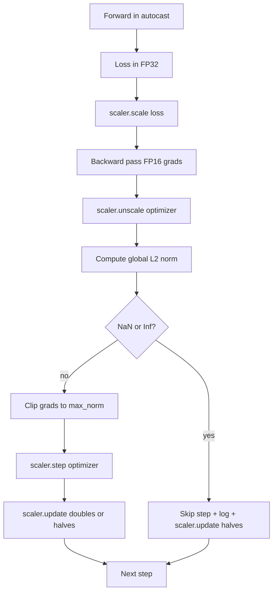

# Gradient Cắt và Mixed Precision

> Các optimizer và lịch trình từ bài học trước cho rằng gradients là lành mạnh. Họ thường không. Một batch xấu duy nhất có thể làm tăng tiêu chuẩn gradient lên ba bậc độ lớn. precision training hỗn hợp khuếch đại điều này bằng cách giới thiệu tràn FP16 ở phía loss. Bài học này xây dựng hai dây đai an toàn mà production training không thể ship thiếu: gradient cắt theo định mức L2 toàn cầu đã định cấu hình và vòng lặp precision hỗn hợp với autocast và GradScaler phát hiện NaN và Inf, bỏ qua bước một cách rõ ràng và ghi lại hệ số tỷ lệ cho pháp y.

**Loại:** Xây dựng
**Ngôn ngữ:** Python
**Kiến thức tiên quyết:** Giai đoạn 19 bài 30-37
**Thời lượng:** ~90 phút

## Mục tiêu học tập

- Tính toán định mức L2 toàn cầu trên tất cả parameter gradients và kẹp tại chỗ khi vượt quá ngưỡng đã định cấu hình.
- Bao bọc một bước training trong tính năng tự động đúc cộng với GradScaler để các đường chuyền tiến và lùi FP16 tồn tại khi bị tràn.
- Phát hiện NaN và Inf trong loss hoặc gradient, bỏ qua bước optimizer và ghi lại bỏ qua.
- Báo cáo hệ số tỷ lệ của GradScaler mỗi bước để hiển thị một chuỗi bỏ qua dài ngay lập tức.

## Vấn đề

Một cuộc chạy training đã chạy sạch vào ngày hôm qua tạo ra một đường cong loss đi thẳng đứng ở bước 8,217. Thủ phạm là một batch duy nhất có định mức gradient là 4.200, gấp hai mươi lần đỉnh trước đó. Không cắt optimizer áp dụng một bước đặt lại mọi kiến thức mà model đã thực hiện trong giờ trước đó. Với clip L2 toàn cầu ở tiêu chuẩn 1.0, batch tương tự đóng góp cập nhật định mức đơn vị; loss vẫn trên đường xu hướng của nó; cuộc chạy vẫn tồn tại.

precision training hỗn hợp đẩy thông lượng lên 2-3 lần bằng cách tính toán forward pass và hầu hết các backward pass trong FP16. Chi phí là FP16 có phạm vi số mũ hẹp. Một gradient điển hình tràn trong FP16 đánh giá thành Inf, truyền qua các lớp tiếp theo dưới dạng NaN, đặt mọi trọng số thành NaN ở bước optimizer tiếp theo. GradScaler của PyTorch giải quyết vấn đề này bằng cách nhân loss với hệ số tỷ lệ lớn trước backward pass và chia gradients cho cùng một hệ số trước bước optimizer. Nếu bất kỳ gradient nào là Inf hoặc NaN tại thời điểm không mở tỷ lệ, bộ chia tỷ lệ sẽ bỏ qua bước và giảm một nửa hệ số tỷ lệ; nếu N bước trước đó sạch, máy cạo sẽ tăng gấp đôi hệ số. Trong quá trình training yếu tố tìm thấy giá trị cao nhất mà phạm vi FP16 cho phép.

Vấn đề xây dựng là đấu dây cả hai một cách chính xác. Kẹp trước khi mở tỷ lệ và ngưỡng được chia tỷ lệ gradients; clip sau khi mở tỷ lệ và thứ tự hoạt động trên GradScaler rất quan trọng. Thứ tự đúng là: `scaler.scale(loss).backward()`, sau đó `scaler.unscale_(optimizer)`, sau đó `clip_grad_norm_`, sau đó `scaler.step(optimizer)`, sau đó `scaler.update()`. Bất kỳ lệnh nào khác đều tạo ra một vòng lặp bị đứt gãy âm thầm.

## Khái niệm



### Định mức L2 toàn cầu

Chuẩn L2 toàn cầu là chuẩn Euclid của gradient vector nối nhau, không phải chuẩn trên mỗi parameter. PyTorch thực hiện điều này như `torch.nn.utils.clip_grad_norm_(parameters, max_norm)`. Hàm trả về định mức trước clip để bài học có thể ghi lại cả giá trị tự nhiên và giá trị bị cắt, điều này cần thiết cho chẩn đoán "chúng ta đang cắt ở mọi bước".

### autocast và GradScaler

`torch.amp.autocast(device_type)` là trình quản lý ngữ cảnh chạy có chọn lọc các hoạt động đủ điều kiện (hầu hết các hoạt động matmul-class) trong FP16. `torch.amp.GradScaler(device_type)` là trợ giúp chia tỷ lệ tỷ lệ loss trước khi lùi và tỷ lệ nghịch đảo tỷ lệ gradients trước bước optimizer. Cả hai được thiết kế cùng nhau; Sử dụng cái này mà không có cái kia là một lỗi configuration mà thử nghiệm sẽ phát hiện.

Bài học sử dụng CPU tự động truyền vì đó là những gì chạy trong CI; Mẫu tương tự chuyển nguyên văn sang CUDA bằng cách thay đổi `device_type="cpu"` thành `device_type="cuda"`. GradScaler trên CPU là một sơ khai (CPU autocast đã hoạt động trong BF16 theo mặc định và không cần loss chia tỷ lệ), nhưng bài học bao gồm các vị trí gọi để hệ thống dây giống với vòng lặp GPU.

### Phát hiện NaN và Inf

Việc phát hiện xảy ra ở hai nơi. Đầu tiên, bản thân loss được kiểm tra bằng `torch.isfinite` trước khi lùi lại; loss Inf hoặc NaN không tạo ra gradients hữu ích và bị bỏ qua mà không vào optimizer. Thứ hai, sau `scaler.unscale_(optimizer)` bài học quét gradients chưa chia tỷ lệ bằng `has_non_finite_grad(...)` và coi bất kỳ Inf hoặc NaN nào là bỏ qua. Hai lần kiểm tra cùng nhau bao gồm cả chế độ lỗi chuyền trước và chuyền lùi.

### Chẩn đoán hệ số tỷ lệ

Hệ số tỷ lệ là trạng thái bên trong của GradScaler. Mỗi bước bài học sẽ đọc `scaler.get_scale()` và ghi lại nó bên cạnh learning rate và gradient chuẩn. Một cuộc chạy lành mạnh cho thấy hệ số tỷ lệ tăng lên theo lũy thừa của hai cho đến khi nó bão hòa gần `2^17` hoặc `2^18`. Một lần chạy sai cho thấy yếu tố dao động giữa các giá trị cao và thấp, đó là tín hiệu cho thấy gradients của model đôi khi nằm trong phạm vi và đôi khi không. Chẩn đoán là vô hình nếu không ghi nhật ký.

## Tự xây dựng

`code/main.py` thực hiện:

- `clip_global_l2_norm` - một trình bao bọc xung quanh `torch.nn.utils.clip_grad_norm_` trả về cả định mức trước và sau clip.
- `has_non_finite_grad` - một trình trợ giúp quét gradients để tìm NaN và Inf.
- `AmpTrainState` - bao bọc một model, một `AdamW` optimizer, một GradScaler và một thiết bị tự động truyền. Hiển thị một `step(inputs, targets)` chạy toàn bộ pipeline cắt, chia tỷ lệ và bỏ qua NaN.
- `StepLog` và `SkipLog` - bản ghi theo bước có cấu trúc.
- Một bản demo huấn luyện một `nn.Linear` model nhỏ trong 20 bước, đưa Inf vào gradient ở bước 5 để thực hiện đường dẫn bỏ qua và in nhật ký kết quả.

Chạy nó:

```bash
python3 code/main.py
```

script thoát khỏi số không và in nhật ký mỗi bước với mỗi hàng được gắn thẻ `STEP` hoặc `SKIP`; Ít nhất một hàng là một `SKIP`.

## Mô hình Production

Bốn mẫu nâng vòng lặp lên một bước production training.

**Bỏ qua bộ đếm như một cảnh báo, không phải một dòng nhật ký.** Một số bước bị bỏ qua mỗi lần chạy training là tốt. Hàng trăm lần bỏ qua mỗi epoch là một cảnh báo khó: model ở chế độ FP16 không thể giữ được và vòng lặp âm thầm thất bại. Bài học theo dõi tỷ lệ bỏ qua 1.000 bước và production sẽ có tỷ lệ trên 5%.

**Ngưỡng clip nằm trong config.** `max_norm = 1.0` là mặc định hiện đại cho model training ngôn ngữ. Quét nó trên một model nhỏ trước; ngưỡng lớn hơn cho phép model phục hồi sau batches thực sự khó khăn; các ngưỡng nhỏ hơn ràng buộc trường hợp xấu nhất với cái giá phải trả là đường cong loss ồn ào hơn. Ngưỡng thuộc cùng YAML hoặc JSON config với lịch trình từ bài 44.

**Nhật ký định mức chuyển sang CSV với lịch biểu.** Các cột CSV được `step, lr, grad_l2_pre_clip, grad_l2_post_clip, loss, skipped, skip_reason, scaler_scale`. Người đánh giá mở tệp sẽ thấy lịch trình, câu chuyện gradient, hệ số tỷ lệ và kết quả bỏ qua (kèm theo lý do) trong một hàng. Chia các cột giữa các tệp là một công thức cho các phân tích sai lệch.

**`scaler.update()` chạy từng bước, ngay cả khi bỏ qua.** Trên một bước sạch, công cụ chia tỷ lệ sẽ đọc bộ đếm no-inf của nó, tăng nó và có thể tăng gấp đôi hệ số. Trên một bước bị bỏ qua, công cụ chia tỷ lệ sẽ giảm một nửa hệ số và đặt lại bộ đếm. Quên `update()` trên đường dẫn bỏ qua là lỗi tạo ra "hệ số tỷ lệ không bao giờ thay đổi".

## Ứng dụng

Production mẫu:

- **Thiết bị tự động truyền phù hợp với thiết bị optimizer.** `torch.amp.autocast(device_type="cuda")` cho GPU training; `torch.amp.autocast(device_type="cpu")` cho CPU. Các thiết bị trộn tạo ra lỗi kiểu im lặng xuất hiện dưới dạng đường cong loss trông đẹp nhưng model không học.
- **Loss kiểm tra trước khi lùi.** `torch.isfinite(loss).all()` là một tensor giảm; chi phí không đáng kể và tiết kiệm cho một loss NaN là một bước training hoàn toàn. Luôn chạy nó.
- **`set_to_none=True` trong `zero_grad`.** Đặt gradients thành `None` thay vì không, cho phép optimizer bỏ qua tính toán cho các nhóm parameter không bị ảnh hưởng. Cài đặt là cải thiện thông lượng miễn phí và giảm nhẹ bề mặt lỗi.

## Sản phẩm bàn giao

Trên một dự án thực tế, `outputs/skill-clip-amp.md` sẽ mô tả ngưỡng clip và thiết bị tự động truyền mà bước training sử dụng, CSV mỗi bước nằm ở đâu trong kiểm soát phiên bản và ngưỡng cảnh báo tỷ lệ bỏ qua production là gì. Bài học này ships động cơ.

## Bài tập

1. Thay thế mũi tiêm Inf tổng hợp bằng đột biến loss thực (nhân mục tiêu của một batch với 1e8) và xác minh đường dẫn bỏ qua triggers.
2. Thêm chế độ `--bf16` chuyển tự động truyền sang BF16 thay vì FP16. BF16 có phạm vi hàm mũ rộng hơn FP16 và hiếm khi cần loss tỷ lệ; Xác minh tỷ lệ bỏ qua giảm xuống bằng không trong cùng một bản demo.
3. Thêm kiểm tra đơn vị mà trình bao bọc gradient clip trả về định mức trước và sau clip một cách chính xác khi không có hiện tượng cắt xảy ra.
4. Thêm tính toán tỷ lệ bỏ qua cửa sổ cuộn và cờ CLI không chạy được nếu tốc độ vượt quá ngưỡng đã định cấu hình cho 100 bước liên tiếp.
5. Nối vòng lặp để ghi CSV chính tắc (`step, lr, grad_l2_pre_clip, grad_l2_post_clip, loss, skipped, skip_reason, scaler_scale`) và xác nhận tệp tồn tại sau Ctrl-C bằng cách xả sau mỗi hàng.

## Thuật ngữ chính

| Thuật ngữ | Những gì mọi người nói | Ý nghĩa thực sự của nó |
|------|-----------------|------------------------|
| Định mức L2 toàn cầu | "Mục tiêu clip" | Chuẩn mực Euclid của gradient vector nối trên tất cả các parameters có thể huấn luyện được |
| Tự động truyền | "Mixed precision" | Thực hiện FP16 (hoặc BF16) có chọn lọc các hoạt động đủ điều kiện bên trong khối `with` |
| Thang đo | "Loss tỷ lệ" | Trình trợ giúp nhân loss trước khi tỷ lệ ngược và tỷ lệ nghịch đảo gradients trước bước optimizer |
| Bỏ qua | "Bước đi tồi" | Một bước optimizer từ chối vì gradient hoặc loss là không hữu hạn; Máy cạo vôi giảm một nửa hệ số |
| Hệ số tỷ lệ | "Trạng thái mở rộng quy mô" | Hệ số nhân hiện tại của GradScaler; nhân đôi sau khi kéo dài và giảm một nửa sạch sẽ trên mỗi lần bỏ qua |

## Đọc thêm

- [Micikevicius et al., Mixed Precision Training (arXiv 1710.03740)](https://arxiv.org/abs/1710.03740) - đề xuất mở rộng quy mô loss ban đầu
- [Pascanu, Mikolov, Bengio, On the difficulty of training recurrent neural networks (arXiv 1211.5063)](https://arxiv.org/abs/1211.5063) - giấy tham khảo cắt gradient
- [PyTorch torch.amp.GradScaler](https://docs.pytorch.org/docs/stable/amp.html) - công cụ chia tỷ lệ API bài học này kết thúc
- [PyTorch torch.nn.utils.clip_grad_norm_](https://docs.pytorch.org/docs/stable/generated/torch.nn.utils.clip_grad_norm_.html) - đoạn cắt primitive bài học này sử dụng
- Giai đoạn 19 · 42 - trình tải xuống có kho dữ liệu cung cấp vòng lặp
- Giai đoạn 19 · 43 - mức tiêu thụ dataloader vòng lặp
- Giai đoạn 19 · 44 - lịch trình mà vòng lặp này soạn thảo
