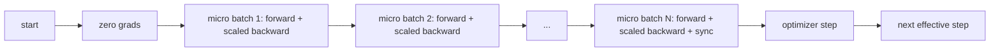
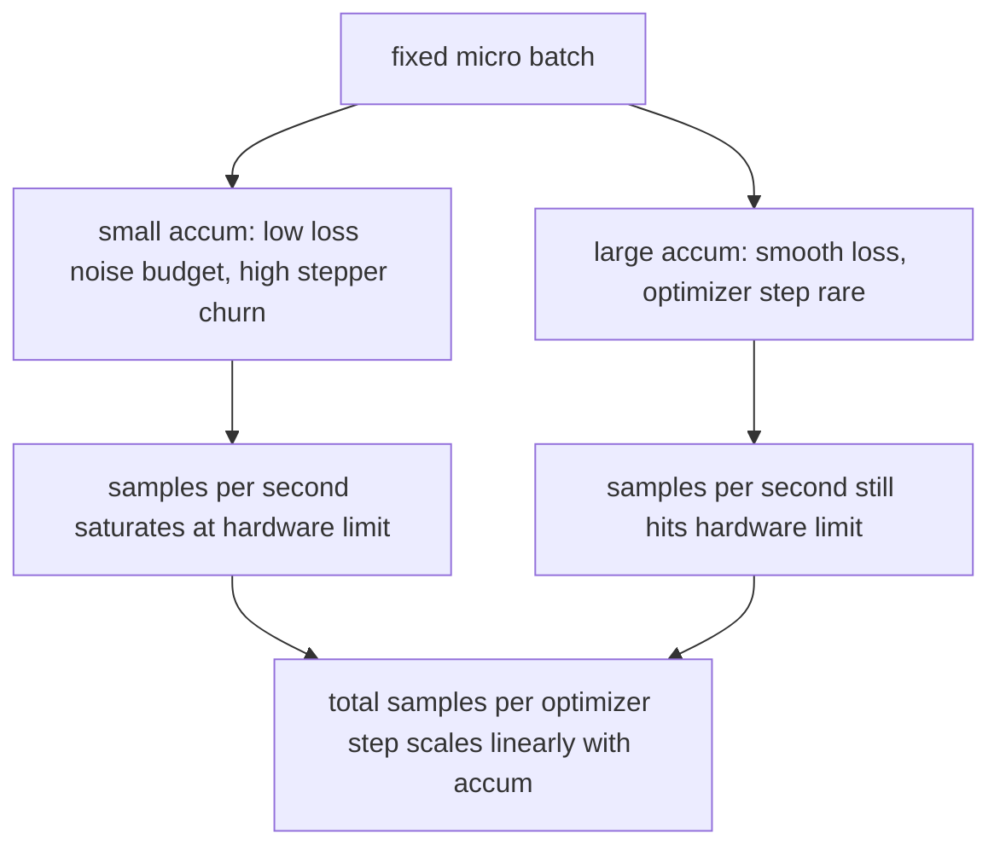

# Tích lũy Gradient

> Huấn luyện ở một batch hiệu quả mà bạn không thể chi trả, mỗi lần một batch nhỏ. Chia tỷ lệ quy mô loss, giữ bước optimizer và để gradients chất đống.

**Loại:** Xây dựng
**Ngôn ngữ:** Python
**Kiến thức tiên quyết:** Giai đoạn 19 bài học 42 đến 45
**Thời lượng:** ~90 phút

## Mục tiêu học tập

- Rút ra nhận dạng batch hiệu quả: `effective_batch = micro_batch * accum_steps`.
- Triển khai tỷ lệ loss trên mỗi batch vi mô để gradient tích lũy khớp ngược với một batch đầy đủ.
- Bỏ qua optimizer đồng bộ hóa cho đến lần batch vi mô cuối cùng (đồng bộ hóa trên bước cuối cùng).
- Đọc thông lượng so với đường cong batch hiệu quả và giải thích lợi nhuận giảm dần.

## Vấn đề

Bạn muốn tập luyện ở batch hiệu quả là 512 vì đường cong loss mượt mà hơn và bước optimizer có ý nghĩa hơn ở thang điểm đó. Máy gia tốc trên bàn chứa 32 ví dụ trước khi hết bộ nhớ. Tăng gấp đôi batch không phải là một lựa chọn. Giảm một nửa model không phải là một lựa chọn. Bí quyết mà lĩnh vực này đã đạt được vào năm 2017 và không bao giờ ngừng sử dụng là thực hiện 16 đường chuyền lùi, để gradients tích tụ bên trong parameter bộ đệm và chỉ bước optimizer khi số đếm đạt đến mục tiêu.

Rủi ro là loss không còn bằng con số như ở batch lớn hơn. Entropy chéo của 16 mini-batches tổng một cách ngây thơ gấp 16 lần loss của một batch đầy đủ. Nếu không chia tỷ lệ, hướng gradient là đúng nhưng độ lớn sai, và bước optimizer quá lớn gấp 16 lần. Sửa chữa là một bộ phận. Bản sửa lỗi cũng rất dễ quên.

## Khái niệm



Hợp đồng ngắn:

- Loss cho mỗi batch vi mô được chia cho `accum_steps` trước khi `backward()`. PyTorch tổng gradients thành `param.grad` theo mặc định; Bộ phận đẩy tổng đang chạy trở lại thang đo phù hợp.
- Bước optimizer kích hoạt một lần cho mỗi batch hiệu quả, sau khi batch vi mô cuối cùng lùi lại. Bước giữa tích lũy nghiêng mỗi parameter rest của cuộc chạy phụ thuộc vào.
- Trạng thái của optimizer (bộ đệm động lượng, Adam khoảnh khắc) tiến một lần cho mỗi bước hiệu quả, không phải một lần cho mỗi batch vi mô. Nếu không, các đường trung bình động hàm mũ sẽ thấy sai tần số và đốt cháy lịch trình.
- Trên một thiết bị duy nhất, đây là sổ sách. Trên một cụm nhiều cấp độ, cùng một mẫu bao bọc các vi batches không phải cuối cùng trong một bối cảnh `no_sync` bỏ qua gradient giảm tất cả; micro-batch cuối cùng giảm toàn bộ gradient tích lũy trong một lần thay vì trả chi phí mạng N lần.

### Bằng chứng tương đương trong mã

```python
loss = criterion(model(x_full), y_full)
loss.backward()
opt.step()
```

tương đương với

```python
for x, y in chunks(x_full, y_full, n):
    scaled = criterion(model(x), y) / n
    scaled.backward()
opt.step()
```

lên đến thứ tự tổng dấu phẩy động. Bộ đệm gradient tích lũy ở cuối vòng lặp giống như tensor mà một batch ngược đầy đủ sẽ tạo ra. Mã bài khẳng định điều này với sự khác biệt tối đa-cơ bụng dưới 1e-4 trong `equivalence_check`.

### Chi phí đi đâu

Mỗi batch vi mô có giá một tiến và một lùi. Với sự tích lũy, bạn đánh đổi trí nhớ lấy thời gian. Đường cong thông lượng tính bằng `outputs/accum-curve.json` cho thấy những gì xảy ra khi batch hiệu quả phát triển ở batch vi mô cố định:



Không có bữa trưa miễn phí. Tăng gấp đôi `accum_steps` tăng gấp đôi thời gian tường cho mỗi bước optimizer. Điều thay đổi là variance của ước tính gradient: với cùng một ngân sách tường, bạn đã thực hiện ít bước optimizer hơn nhưng mỗi bước được tính trung bình trên nhiều mẫu hơn. Tài liệu coi batch lớn và batch nhỏ là các vấn đề tối ưu hóa khác nhau; Bài học ở đây là máy móc, không phải thống kê.

## Tự xây dựng

`code/main.py` là artifact có thể chạy được. Nó làm ba điều.

### Bước 1: kiểm tra tương đương

`equivalence_check()` xây dựng hai bản sao của cùng một mạng với cùng một hạt giống. Người ta thấy một batch 16 mẫu trong một forward pass. Phần còn lại thấy bốn đoạn 4 mẫu với loss chia cho bốn. Hàm này so sánh các bộ đệm gradient trước bước optimizer và parameters sau. Khẳng định là `max_abs_diff < 1e-4`.

### Bước 2: mẫu đồng bộ hóa ở bước cuối cùng

`train_one_optimizer_step` đi bộ vi batches. Đối với mọi batch vi mô ngoại trừ lần cuối cùng nó đi vào `no_sync_context(model)`. Trên một process ngữ cảnh là không hoạt động; trên DDP, đây là nơi bỏ qua tất cả gradient. Sổ sách kế toán là như nhau. Một `sync_counter` ghi lại số lần chúng tôi rời khỏi phạm vi no_sync; đối với N micro-batches số lượng là một trên mỗi bước hiệu quả, không phải N.

### Bước 3: đường cong thông lượng

`sweep_effective_batches` chạy cùng một model với batch vi mô cố định và danh sách các bước tích lũy. Đối với mỗi cài đặt, nó sẽ ghi lại:

- `samples_per_sec`: tổng số mẫu nhìn thấy chia cho thời gian tường
- `median_step_ms`: phân vị thứ 50 cho mỗi bước hiệu quả
- `sync_calls`: điểm tập thể được thực hiện
- `avg_loss`: trung bình trên các bước optimizer của quét

Đầu ra ở `outputs/accum-curve.json` và có thể tái sử dụng từ máy tính xách tay.

Chạy nó:

```bash
python3 code/main.py
```

script in diff tương đương, sau đó là bảng quét, sau đó là đường dẫn JSON. Thoát mã không.

## Ứng dụng

Trong production training, gradient tích lũy tồn tại đằng sau một núm. Mô hình của PyTorch là `accumulation_steps = effective_batch // (micro_batch * world_size)`. Frameworks mà bạn không được phép sử dụng ở đây bao bọc cùng một vòng lặp, nhưng các bước giống nhau: chia tỷ lệ loss, bỏ qua đồng bộ hóa trên micro không phải cuối cùng, tích lũy, bước một lần.

Ba mô hình trong tự nhiên:

- Kích thước micro-batch được chọn để bão hòa bộ nhớ thiết bị. Bất cứ thứ gì nhỏ hơn đều lãng phí chu kỳ gia tốc. Bất cứ thứ gì lớn hơn đều gặp sự cố.
- batch hiệu quả được chọn từ một lịch trình learning rate. batches hiệu quả lớn cần tốc độ học tập và khởi động theo quy mô; Đây là quy tắc tỷ lệ tuyến tính được nói đến từ năm 2017.
- Số lượng tích lũy là cầu nối giữa hai và là núm duy nhất bạn có thể tự do điều chỉnh runtime mà không cần viết lại bộ nạp dữ liệu.

## Sản phẩm bàn giao

`outputs/skill-gradient-accumulation.md` nắm bắt công thức để đồng nghiệp có thể thả nó vào một repo mới: chia tỷ lệ loss theo `accum_steps`, bỏ qua optimizer đồng bộ hóa trên micro không phải cuối cùng, bước optimizer một lần cho mỗi batch hiệu quả, ghi nhật ký thông lượng so với batch hiệu quả như JSON để giao dịch hiển thị.

## Bài tập

1. Chạy lại quá trình quét với `--num-steps 100` và vẽ mẫu mỗi giây so với batch hiệu quả. Đường cong phẳng ở đâu?
2. Thêm một biến thể tỷ lệ sai (không có phép chia) và hiển thị sự khác biệt parameter ở bước 1 so với tham chiếu.
3. Hoán đổi SGD lấy AdamW và xác nhận trạng thái optimizer tiến một lần cho mỗi bước hiệu quả, không phải một lần cho mỗi batch vi mô.
4. Giới thiệu một trình bao bọc `DistributedDataParallel` thực và định tuyến `no_sync_context` đến phương thức của nó. Xác nhận sync_calls giọt N-1 cho mỗi batch hiệu quả.
5. Sửa đổi kiểm tra tương đương để so sánh hai phân chia vi mô khác nhau (2 x 8 so với 4 x 4) và giải thích bất kỳ dung sai nào bạn cần thư giãn.

## Thuật ngữ chính

| Thuật ngữ | Những gì mọi người nói | Ý nghĩa thực sự của nó |
|------|-----------------|------------------------|
| batch siêu nhỏ | batch bạn chuyển tiếp | Lát cắt vừa với bộ nhớ trong một forward pass |
| Các bước tích lũy | Số lần lùi mỗi bước | Số lần lùi được tổng trước một bước optimizer |
| batch hiệu quả | Các batch | Micro batch lần số bước tích lũy nhân với dữ liệu song song kích thước thế giới |
| Loss mở rộng quy mô | Chia cho N | Mỗi batch phân chia được tổng hợp gradients trận đấu đầy đủ batch |
| Đồng bộ hóa vào lần cuối cùng | Bỏ qua rest | Chỉ chạy tập thể gradient ở lần lùi cuối cùng trong cửa sổ |

## Đọc thêm

- PyTorch tài liệu trên `DistributedDataParallel.no_sync` cho phiên bản production của thủ thuật đồng bộ hóa trên bước cuối cùng.
- Goyal và cộng sự, 2017, về tỷ lệ tuyến tính cho batch training lớn, lý do kinh điển để quan tâm đến batch hiệu quả.
- PyTorch trình theo dõi vấn đề về các tương tác tích lũy gradient với mixed precision mở rộng quy mô.
- Giai đoạn 19 các bài học từ 42 đến 45 bao gồm model, trình tải dữ liệu, optimizer và giàn giáo huấn luyện mà bài học này giả định.
- Giai đoạn 19 bài 47 bao gồm checkpoint và tiếp tục để một thời gian tích lũy dài tồn tại sau khi có giới hạn đồng hồ treo tường.
