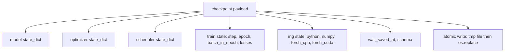
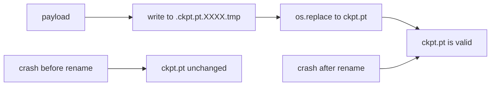
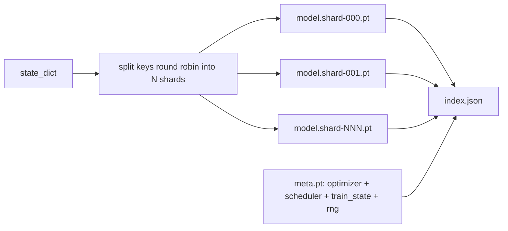

# Checkpoint Lưu và Tiếp tục

> Tàu hỏa làm gián đoạn các cuộc chạy tiêu diệt; checkpoints để họ tiếp tục. Lưu model, optimizer, bộ lập lịch, lịch sử loss, bộ đếm bước và trạng thái RNG, theo nguyên tử, vì vậy việc giết bất kỳ lúc nào sẽ để lại một tệp hợp lệ trên đĩa.

**Loại:** Xây dựng
**Ngôn ngữ:** Python
**Kiến thức tiên quyết:** Giai đoạn 19 bài học 42 đến 45
**Thời lượng:** ~90 phút

## Mục tiêu học tập

- Ghi lại trạng thái training đầy đủ vào một payload duy nhất có thể được tải lại vào một process mới.
- Triển khai lưu nguyên tử với ghi vào tạm thời, sau đó đổi tên để sự cố không bao giờ để lại tệp được ghi một nửa.
- Khôi phục trạng thái RNG cho Python, NumPy và PyTorch để loss sau khi tiếp tục khớp với đường cơ sở không bị gián đoạn.
- Xây dựng bố cục checkpoint phân mảnh cho models không còn phù hợp với một tệp duy nhất, với các phân đoạn đã xác minh hàm băm và chỉ mục JSON.

## Vấn đề

Bạn đặt một công việc training trong 18 giờ. Nắp đồng hồ treo tường là 4 giờ. Cụm khởi động lại vào giờ thứ 11 vì ai đó trên mức lương của bạn đã phê duyệt nâng cấp hạt nhân. Không có checkpoints bạn bắt đầu lại. Nếu không có sơ yếu lý lịch, bạn cũng mất trạng thái optimizer đã mất 11 giờ đầu tiên để học, vì vậy ngay cả khi tạ model vẫn tồn tại, những khoảnh khắc AdamW sẽ biến mất và bước tiếp theo sẽ lảo đảo theo hướng quỹ đạo training đã đi qua.

artifact bên phải là một tệp duy nhất chứa mọi thứ cần thiết để tiếp tục: model parameters, trạng thái optimizer, trạng thái bộ lập lịch, lịch sử loss cho các biểu đồ, bộ đếm bước và epoch và batch trong epoch hiện tại và trạng thái RNG cho mọi nguồn ngẫu nhiên. Nếu không có trạng thái RNG, đường cong loss tiếp tục là một đường cong khác. Cùng model, cùng dữ liệu, xáo trộn khác nhau, mặt nạ dropout khác nhau, số khác nhau trên bảng điều khiển.

Lưu nguyên tử là nửa còn lại của hợp đồng. Ghi vào tên tệp cuối cùng có nghĩa là sự cố giữa quá trình ghi để lại tệp bị hỏng; sơ yếu lý lịch đọc rác. Ghi vào một tệp tạm thời trong cùng một thư mục và sau đó đổi tên có nghĩa là sự cố giữa quá trình ghi sẽ giữ nguyên tệp tốt trước đó. Việc đổi tên là nguyên tử trên hệ thống tệp POSIX.

## Khái niệm



### Năm nhóm nhà nước

| Xô | Tại sao điều này lại quan trọng |
|--------|----------------|
| Model | Trọng lượng và bộ đệm; model là gì. |
| Optimizer | Động lực và khoảnh khắc thích ứng; Nếu không có những điều này, bước tiếp theo là một vấn đề tối ưu hóa khác. |
| Lập lịch trình | Nơi learning rate nằm trên đường cong của nó; lịch trình cosine đặc biệt chăm sóc. |
| Bộ đếm tàu hỏa | Bước, epoch, batch trong epoch, cộng với lịch sử loss vẽ bảng điều khiển. |
| Trạng thái RNG | Quyết định luận cho dropout, xáo trộn dữ liệu và bất kỳ sampling nào bên trong model. |

### Lưu nguyên tử



Hai quy tắc. Đầu tiên, tệp tạm thời nằm trong cùng một thư mục với mục tiêu, vì vậy việc đổi tên vẫn nằm trong cùng một hệ thống tệp; Đổi tên thiết bị chéo không phải là nguyên tử. Thứ hai, tên tạm thời là duy nhất cho mỗi lần thử nên hai nhà văn không dậm chân.

### checkpoints phân mảnh

Khi các model trở nên lớn, payload một tệp trở nên quá lớn để tải nhanh, quá lớn để kiểm tra và quá đau đớn khi chia sẻ mạng gặp trục trặc giữa khi đọc. Cách khắc phục là chia trạng thái parameter thành các phân đoạn và viết một chỉ mục nhỏ liên kết chúng với nhau.



Chỉ mục ghi lại số lượng phân đoạn, sha256 của mỗi phân đoạn và sha256 của tệp meta. Trình tải lỗi lớn khi có bất kỳ hàm băm nào không khớp. Các mảnh vỡ có thể hạ cánh trên các đĩa vật lý khác nhau; meta nhỏ và đọc trước.

### Sơ yếu lý lịch tiếp tục giữa epoch

Một sơ yếu lý lịch gắn liền với đầu epoch tiếp theo lãng phí từ vài phút đến một ngày. Bản sửa lỗi là `(epoch, batch_in_epoch)` cộng với trạng thái RNG. Sau khi tải, vòng lặp training tua nhanh trình tạo số ngẫu nhiên qua batches đã được tiêu thụ trong epoch hiện tại và tiếp tục từ `batch_in_epoch`. Mã bài học thực hiện chính xác điều này; Khẳng định là quỹ đạo loss sau khi tiếp tục khớp với đường cơ sở không bị gián đoạn trong 1E-4.

## Tự xây dựng

`code/main.py` cung cấp bốn primitives và một trình điều khiển demo.

### Bước 1: chụp và khôi phục trạng thái RNG

`capture_rng_state` trả về một dict với `random.getstate` của Python, `np.random.get_state` của NumPy, và PyTorch CPU và CUDA byte RNG. `restore_rng_state` đảo ngược nó. CPU tensor là một bộ đệm uint8 byte mà RNG của PyTorch biết cách tiêu thụ.

### Bước 2: lưu nguyên tử

`atomic_save` ghi payload vào tệp tạm thời trong thư mục đích, sau đó `os.replace` hoán đổi nó thành tên cuối cùng. `atomic_write_json` cũng làm tương tự đối với chỉ mục phân đoạn.

### Bước 3: khứ hồi checkpoint đầy đủ

`save_checkpoint` đóng gói các model, optimizer, bộ lập lịch, trạng thái tàu và RNG thành một dict. `load_checkpoint` đảo ngược nó và trả về một `TrainState`. Trường schema là hook nâng cấp: các thay đổi định dạng trong tương lai sẽ tăng chuỗi phiên bản và bộ tải gửi đi.

### Bước 4: biến thể phân mảnh

`save_sharded_checkpoint` vòng tròn các khóa parameter trên N phân đoạn, ghi mỗi phân đoạn với bản lưu nguyên tử của riêng nó, viết một tệp meta với optimizer và bộ lập lịch trình và trạng thái huấn luyện, đồng thời ghi chỉ mục JSON với sha256 phân đoạn. `load_sharded_checkpoint` xác minh mọi phân đoạn trước khi hợp nhất.

### Bước 5: tiếp tục demo

`run_resume_demo` huấn luyện một model nhỏ cho `total_steps`, tiết kiệm một checkpoint ở `interrupt_at`, sau đó tiếp tục. process thứ hai khôi phục checkpoint và chạy các bước còn lại. Hàm trả về chênh lệch tuyệt đối tối đa giữa hai quỹ đạo loss sau điểm gián đoạn. Với RNG được khôi phục, sự khác biệt là nhiễu bằng không hoặc dấu phẩy động.

Chạy nó:

```bash
python3 code/main.py
```

Các bản demo tệp đơn và phân mảnh đều khẳng định max-diff dưới 1e-4. Bản tóm tắt hạ cánh ở `outputs/resume-demo.json`.

## Ứng dụng

Production training stacks ship trạm kiểm soát như một phần của huấn luyện viên. Hình dạng giống nhau: model + optimizer + bộ lập lịch + bộ đếm + RNG, được viết theo nguyên tử, được đặt tên theo bước để dễ dàng tìm thấy bản mới nhất. Bố cục phân mảnh cung cấp năng lượng cho tải model lớn với các lần đọc song song; chỉ số. json là điều làm cho điều đó hoạt động.

Ba mẫu cần thực thi:

- **Schema là một chuỗi trong payload.** Di chuyển branch trên đó. Nếu không có nó, bạn không thể phát triển định dạng mà không phá vỡ các lần chạy cũ.
- **Sha256 mỗi phân đoạn.** Tải xuống bị cắt bớt âm thầm là loại lỗi tồi tệ nhất; bộ nạp bị lỗi nhanh hoặc bị lỗi muộn.
- **Giữ nhịp điệu trung thực checkpoint.** Lưu mỗi N bước và mỗi phút đồng hồ treo tường, tùy theo thời gian nào ngắn hơn. Nếu không, bước dài gặp sự cố sẽ lãng phí toàn bộ thời gian làm việc.

## Sản phẩm bàn giao

`outputs/skill-checkpoint-save-resume.md` là công thức cho bất kỳ training script mới nào: hình dạng payload, ghi nguyên tử, chụp RNG, chỉ mục phân đoạn. Thả skill vào repo, nối dây `save_checkpoint` tại vị trí lưu định kỳ, nối dây `load_checkpoint` khi khởi động và chạy sống sót sau khi tiêu diệt.

## Bài tập

1. Thay thế sharding vòng tròn bằng sharding theo nhóm parameter (các lớp kết thúc bằng `.weight` so với `.bias`). Khi nào mỗi bố cục được ưu tiên hơn?
2. Mở rộng vòng lặp lưu để giữ K checkpoints cuối cùng và cắt tỉa những cái cũ hơn. K bên phải là bao nhiêu khi đĩa nhỏ?
3. Thêm cờ `--ckpt-every-seconds` triggers lưu trong khoảng thời gian đồng hồ treo tường, không chỉ đếm bước.
4. Thêm đường dẫn xác minh tổng kiểm tra chạy khi khởi động, quét mọi checkpoint trong thư mục và báo cáo cái nào bị hỏng.
5. Triển khai hàm `migrate_v1_to_v2` để thêm một trường mới vào payload và tăng chuỗi schema. Làm cho tải chịu được cả hai phiên bản.

## Thuật ngữ chính

| Thuật ngữ | Những gì mọi người nói | Ý nghĩa thực sự của nó |
|------|-----------------|------------------------|
| Lưu nguyên tử | "Hãy viết và cầu nguyện" | Ghi vào tệp tạm thời trong cùng một thư mục, sau đó os.replace vào tên đích |
| Câu lệnh của nhà nước | "Trọng lượng" | Model parameters và bộ đệm, được khóa theo tên parameter |
| checkpoint phân mảnh | "Tệp model lớn" | Nhiều tệp, một tệp cho mỗi phân đoạn, cộng với một tệp meta và chỉ mục JSON với sha256s |
| Trạng thái RNG | "Hạt giống ngẫu nhiên" | Trạng thái được chụp cho python ngẫu nhiên, numpy, CPU đuốc, CUDA đuốc; không chỉ là hạt giống |
| Sơ yếu lý lịch giữa epoch | "Khởi động lại" | Tua nhanh RNG và tiếp tục từ batch tiếp theo trong cùng một epoch |

## Đọc thêm

- POSIX `rename` ngữ nghĩa cho tuyên bố nguyên tử mà `os.replace` dựa vào.
- PyTorch tài liệu về `torch.save` và `torch.load`, bao gồm cả `map_location` để khôi phục trên nhiều thiết bị.
- Giai đoạn 19 bài 46 bao gồm sự tích lũy gradient mà checkpoint payload của bài học này tồn tại.
- Giai đoạn 19 bài 48 bao gồm các trình bao bọc phân tán có định dạng trạng thái mà lược đồ này phù hợp.
- Hạt nhân Linux `fsync` tài liệu về đảm bảo độ bền đằng sau việc đổi tên nguyên tử.
