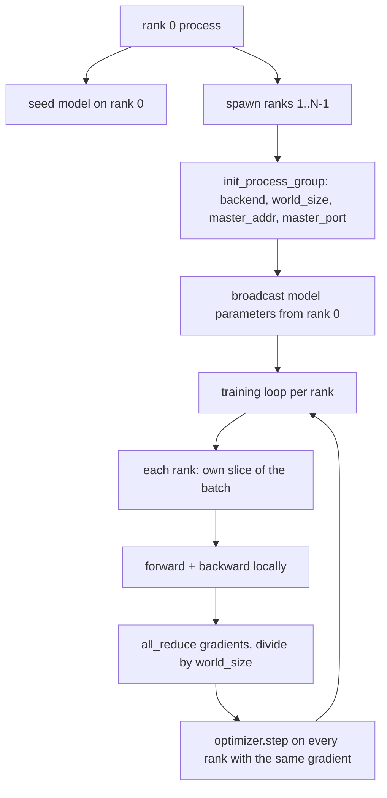
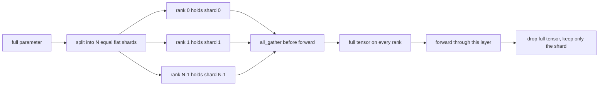

# Dữ liệu phân tán song song và FSDP từ đầu

> training đa cấp là hai tập thể và một quy tắc. Phát sóng parameters khi khởi động, trung bình gradients sau khi lùi, không bao giờ để các cấp bậc bất đồng về bước họ đang đi.

**Loại:** Xây dựng
**Ngôn ngữ:** Python
**Kiến thức tiên quyết:** Giai đoạn 19 bài học 42 đến 45
**Thời lượng:** ~90 phút

## Mục tiêu học tập

- Đưa ra một nhóm process trên N cấp bậc với phần phụ trợ `gloo`, không có phần cứng đặc biệt.
- Triển khai trình bao bọc DDP tối thiểu để phát parameters khi xây dựng và giảm tất cả gradients sau khi lùi.
- Chứng minh rằng việc giảm tất cả các gradients trên mỗi thứ hạng khớp với một process gradient trên đầu vào được nối.
- Phác thảo FSDP parameter sharding: mỗi cấp giữ một lát cắt, toàn bộ tensor được tập hợp cho forward pass và thả sau.

## Vấn đề

model phù hợp với một thiết bị. dataset thì không. Ngân sách tối ưu hóa cho biết bạn muốn xem N lần các ví dụ trên mỗi giây đồng hồ treo tường. Đòn bẩy đầu tiên là dữ liệu song song: mỗi thứ hạng chạy cùng một model trên một lát cắt khác nhau của batch, sau đó tính trung bình gradients trước bước optimizer. Đòn bẩy thứ hai là FSDP: model cũng không vừa với một thiết bị, vì vậy mỗi cấp bậc giữ một phần nhỏ của mỗi parameter và tái tạo toàn bộ tensors từng lớp trong quá trình forward pass.

Nỗi đau là ghi sổ kế toán. Nếu parameters trôi qua các cấp bậc, cuộc chạy sẽ âm thầm bị hỏng. Nếu bạn trung bình gradients nhưng không phải loss bảng điều khiển nằm. Nếu backend tập thể không thể đồng ý về một cấu trúc liên kết, việc chạy sẽ treo mãi mãi. Cách khắc phục là viết các tập thể bằng tay một lần và không bao giờ tin tưởng vào một trình bao bọc mà bạn không thể sao chép.

Bài học này chạy trên CPU. CUDA không được giả định. Phần phụ trợ `gloo` ships với mọi PyTorch xây dựng và chấp nhận `torch.multiprocessing` workers; Cùng một mã chuyển sang `nccl` trên một nút nhiều GPU mà không thay đổi cấu trúc.

## Khái niệm



### Hai tập thể quan trọng

| Tập thể | Chức năng | Khi nào |
|------------|--------------|------|
| `broadcast` | Sao chép một tensor từ cấp bậc này sang tất cả các cấp bậc khác | Parameter khởi tạo, trạng thái lập lịch, bất kỳ đồng bộ hóa một-tất cả nào |
| `all_reduce` | Tổng (hoặc trung bình, hoặc tối đa) một tensor trên tất cả các cấp bậc, mọi thứ hạng đều nhận được kết quả | Gradient tính trung bình sau khi lùi |
| `all_gather` | Mỗi cấp bậc đóng góp một tensor, mỗi cấp bậc đều được nối | Logits bộ sưu tập, FSDP parameter unshard |

Hợp đồng DDP được `broadcast` khi xây dựng và `all_reduce` sau khi lùi lại. Bản phác thảo FSDP thêm `all_gather` trước khi forward pass mỗi lớp.

### Gradient khớp trung bình một process gradient

Một model được huấn luyện trên một batch ví dụ B trên N cấp bậc phải tạo ra gradient giống như một process training duy nhất trên batch N * B. Bí quyết là tổng gradients trên mỗi thứ hạng và chia cho N cho loss gradient trung bình, đó là những gì entropy chéo với mức giảm trung bình sẽ tạo ra trên toàn bộ batch. Mã bài khẳng định điều này với `max-abs-diff < 1e-3` giữa gradient giảm tất cả thủ công và process gradient đơn tham chiếu.

### Bản phác thảo FSDP



Kỷ niệm chiến thắng là chính xác: bộ nhớ mỗi thứ hạng cho parameters giảm xuống 1/N. Chi phí là thu thập, được trả mỗi forward pass. Production FSDP chồng chéo với tính toán của lớp trước nên chi phí đồng hồ treo tường nhỏ hơn nhiều so với dự đoán của kế toán ngây thơ. Bài học thực hiện chuyến đi khứ hồi trên mọi parameter và khẳng định việc tái tạo là một chút bằng với bản gốc.

### CPU và phần phụ trợ gloo

CUDA là mục tiêu production, nhưng các đường dẫn mã tương tự tồn tại trên CPU. `gloo` là phần phụ trợ tập thể CPU. Nó chậm hơn `nccl` trên GPUs theo thứ tự độ lớn, nhưng bề mặt API giống hệt nhau. Nhóm process của bài học được khởi tạo bằng `backend="gloo"` và cấp bậc được sinh ra với `torch.multiprocessing` chứ không phải `torchrun`; Cả hai đều kết thúc ở cùng một cuộc gọi `torch.distributed`. Trên nút nhiều GPU, các thay đổi duy nhất là `backend="nccl"`, tensors thiết bị và `torchrun` khởi chạy.

## Tự xây dựng

`code/main.py` là artifact có thể chạy được.

### Bước 1: Hiển thị nhóm process

```python
os.environ["MASTER_ADDR"] = "127.0.0.1"
os.environ["MASTER_PORT"] = str(port)
dist.init_process_group(backend="gloo", rank=rank, world_size=world_size)
```

`MASTER_ADDR` và `MASTER_PORT` là điểm hẹn: mọi cấp bậc quay cùng một cổng trên cùng một máy chủ. Bài học chọn một cổng tự do thông qua thủ thuật ràng buộc và đóng để tránh va chạm khi nhiều lần chạy dùng chung một máy.

### Bước 2: phát sóng tại công trình

`MinimalDDP.__init__` đi bộ từng parameter và đệm và gọi `dist.broadcast(tensor, src=0)`. Các giá trị của Xếp hạng 0 trở thành điểm bắt đầu chính tắc. Nếu không có điều này, mỗi cấp bậc sẽ khởi tạo với hạt giống riêng của nó và các cấp bậc phân kỳ từ bước một.

### Bước 3: giảm tất cả gradients sau khi lùi

```python
def all_reduce_grads_(module, world_size):
    for p in module.parameters():
        if p.grad is None:
            p.grad = torch.zeros_like(p.data)
        dist.all_reduce(p.grad.data, op=dist.ReduceOp.SUM)
        p.grad.data.div_(world_size)
```

Mỗi thứ hạng đều kết thúc với cùng một gradient trung bình. Bước optimizer bây giờ là một hàm của cùng một đầu vào trên mọi thứ hạng, đó là lý do tại sao parameters luôn đồng bộ trong suốt quá trình chạy.

### Bước 4: chứng minh sự tương đương

`manual_all_reduce_matches_single_process` xây dựng cùng một model trên thứ hạng 0 và so sánh gradient sau giảm tất cả với gradient một process sẽ tính toán trên đầu vào được nối. Sự khác biệt tối đa là khoảng 1e-8.

### Bước 5: Khứ hồi FSDP

`fsdp_round_trip_sketch` làm phẳng từng parameter, đệm thành bội số `world_size`, lát, tất cả thu thập và mở miếng đệm. Việc tái tạo của mọi cấp bậc đều bằng với bản gốc. Đây là bước chưa được phân đoạn; Nghịch đảo (phân đoạn lại sau chuyển tiếp) là một lát cắt từ tensor thu thập được.

Chạy nó:

```bash
python3 code/main.py
```

Kích thước thế giới mặc định là 2. Hai CPU processes xuất hiện, nói chuyện với nhau thông qua `gloo` và thoát khỏi số không. Đầu ra `outputs/ddp-demo.json` thu thập parameter tổng trên mỗi thứ hạng, định mức gradient sau khi giảm tất cả, kết quả khứ hồi FSDP và chênh lệch gradient thủ công so với tham chiếu.

## Ứng dụng

Production training stacks gọi cùng một primitives. `DistributedDataParallel` của PyTorch bổ sung: gradient hooks hậu lùi chồng chéo tất cả rút gọn với giảm ngược, xô kết hợp nhiều gradients nhỏ thành một tập thể và ngữ cảnh `no_sync` bài 46 được sử dụng.

FSDP của PyTorch bổ sung: chế độ xem parameter phẳng trên mỗi lớp để mỗi xếp hạng chứa một bộ đệm liền kề, chồng chéo của phân đoạn của lớp tiếp theo với tính toán của lớp hiện tại và giảm tải CPU tùy chọn cho các phân đoạn.

Hình dạng vẫn giữ nguyên: phát sóng khi khởi động, giảm sau khi lùi, phân đoạn parameters khi chúng không còn phù hợp.

## Sản phẩm bàn giao

`outputs/skill-distributed-fsdp-ddp.md` mang công thức cho một training script mới: quay nhóm process với `gloo` cho CPU và `nccl` cho GPU, bọc model trong một vỏ DDP phát sóng khi xây dựng và giảm sau khi lùi, tùy chọn phân mảnh parameters với mẫu all_gather từ bản phác thảo FSDP.

## Bài tập

1. Chạy với `--world-size 4` và xác nhận chênh lệch tham số vẫn dưới 1e-3 trong suốt quá trình chạy.
2. Thay thế tính trung bình thủ công bằng `dist.all_reduce(op=dist.ReduceOp.AVG)` và tính thời gian chênh lệch.
3. Thêm một hook sau lùi vào trình bao bọc DDP để tất cả giảm trùng lặp với rest của lùi; đo lường sự cải thiện của đồng hồ treo tường.
4. Thực hiện bước phân đoạn lại FSDP: sau khi forward pass, thay thế toàn bộ tensor bằng phân đoạn cục bộ một lần nữa. Xác nhận giảm bộ nhớ trên mỗi cấp bậc.
5. Chuyển phần phụ trợ sang `nccl` trên hộp CUDA. Lưu ý biến môi trường nào thay đổi và biến nào giữ nguyên.

## Thuật ngữ chính

| Thuật ngữ | Những gì mọi người nói | Ý nghĩa thực sự của nó |
|------|-----------------|------------------------|
| Phần phụ trợ | "Gloo hoặc NCCL" | Thư viện thực hiện các hoạt động tập thể; Gloo là CPU, NCCL là GPU |
| Kích thước thế giới | "Tổng số hạng" | Số lượng processes trong nhóm; nhóm là đơn vị mà tập thể hoạt động |
| Cấp | "Worker id" | Process giá trị nhận dạng trong nhóm, không được lập chỉ mục |
| Giảm tất cả | "Tổng số sinh viên tốt nghiệp" | Tổng một tensor trên tất cả các cấp bậc, mọi thứ hạng kết thúc với cùng một kết quả |
| Tháo mảnh | "Thu thập các tham số" | Tái tạo toàn bộ tensor từ các lát cắt theo cấp bậc thông qua all_gather |

## Đọc thêm

- PyTorch `torch.distributed` tài liệu cho ngữ nghĩa tập thể mà bài học này dựa vào.
- Danh sách tập thể của thư viện `gloo`, giống hệt với `nccl` primitives được CUDA hậu thuẫn.
- Giai đoạn 19 bài 46 cho mô hình tích lũy gradient bao bọc DDP giảm tất cả trong `no_sync`.
- Giai đoạn 19 bài 47 cho bố cục checkpoint tồn tại sau khi chạy DDP và FSDP.
- PyTorch tài liệu FSDP để thực hiện production parameter sharding được phác thảo ở đây.
